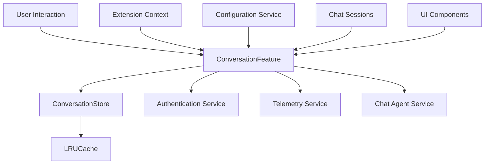

# Conversation Management

<cite>
**Referenced Files in This Document**   
- [conversationStore.ts](file://src/extension/conversationStore/node/conversationStore.ts)
- [conversationFeature.ts](file://src/extension/conversation/vscode-node/conversationFeature.ts)
- [languageModelChatMessageHelpers.ts](file://src/extension/conversation/common/languageModelChatMessageHelpers.ts)
- [copilotCLIChatSessionsContribution.ts](file://src/extension/chatSessions/vscode-node/copilotCLIChatSessionsContribution.ts)
</cite>

## Table of Contents
1. [Introduction](#introduction)
2. [Core Components](#core-components)
3. [Architecture Overview](#architecture-overview)
4. [Conversation Store Implementation](#conversation-store-implementation)
5. [Conversation Lifecycle Management](#conversation-lifecycle-management)
6. [Multi-Session Support](#multi-session-support)
7. [UI Integration and Feature Activation](#ui-integration-and-feature-activation)
8. [State Persistence and Extension Reloads](#state-persistence-and-extension-reloads)
9. [Common Issues and Troubleshooting](#common-issues-and-troubleshooting)
10. [Performance Optimization](#performance-optimization)
11. [Extensibility and Customization](#extensibility-and-customization)

## Introduction
The Conversation Management module in vscode-copilot-chat is responsible for maintaining chat state, history, and session persistence across user interactions. This system ensures that conversation context is preserved throughout the user experience, enabling coherent and continuous interactions with the AI assistant. The architecture is designed to handle multiple concurrent sessions, maintain conversation history, and provide seamless integration with the VS Code interface. The module plays a critical role in preserving user context across extension reloads, workspace changes, and different chat participants, ensuring a consistent and reliable experience.

## Core Components
The Conversation Management system consists of several key components that work together to maintain chat state and history. The central repository for conversation data is the conversationStore.ts module, which serves as the primary storage mechanism for all conversation sessions. The conversation.ts service manages the lifecycle of conversations, handling creation, updating, and deletion operations. The chatSessions.ts component provides support for multiple concurrent sessions, allowing users to switch between different conversation contexts. Finally, the conversationFeature.ts module handles UI integration, connecting the conversation system with the VS Code interface and managing feature activation based on user authentication and permissions.

**Section sources**
- [conversationStore.ts](file://src/extension/conversationStore/node/conversationStore.ts#L1-L40)
- [conversationFeature.ts](file://src/extension/conversation/vscode-node/conversationFeature.ts#L1-L380)

## Architecture Overview
The Conversation Management architecture follows a service-oriented design pattern with clear separation of concerns. At its core, the system uses a dependency injection pattern to provide conversation services throughout the application. The architecture consists of an interface (IConversationStore) that defines the contract for conversation storage, implemented by the ConversationStore class. This implementation uses an LRU (Least Recently Used) cache to manage memory efficiently while maintaining access to recent conversations. The system integrates with authentication services to ensure proper access control and with telemetry services for monitoring and analytics.

**Diagram sources **
- [conversationStore.ts](file://src/extension/conversationStore/node/conversationStore.ts#L1-L40)
- [conversationFeature.ts](file://src/extension/conversation/vscode-node/conversationFeature.ts#L1-L380)

## Conversation Store Implementation
The conversationStore.ts module implements the IConversationStore interface and serves as the central repository for conversation data. It uses an LRUCache from the VS Code base utilities to store conversations with a maximum capacity of 1,000 entries, ensuring memory efficiency while maintaining access to recent conversations. The store provides methods to add conversations with a response ID as the key, retrieve conversations by their ID, and access the most recent conversation. The implementation is designed to be lightweight and efficient, with O(1) time complexity for both get and set operations. The store maintains conversation history in memory, allowing for quick access to previous interactions without requiring disk I/O for basic operations.

**Section sources**
- [conversationStore.ts](file://src/extension/conversationStore/node/conversationStore.ts#L1-L40)

## Conversation Lifecycle Management
The conversation lifecycle is managed through the ConversationStore class and integrated with the ConversationFeature class. When a new conversation is initiated, the system creates a new Conversation object and adds it to the store using a unique response ID. The lifecycle includes creation, updating, and deletion phases, with proper disposal of resources when conversations are no longer needed. The system handles conversation state preservation during extension reloads by maintaining the in-memory cache across extension restarts. For chat participants, the system tracks conversation context and ensures that responses are properly associated with the correct participant and conversation thread. The lifecycle management also includes proper error handling and cleanup procedures to prevent memory leaks.

**Section sources**
- [conversationStore.ts](file://src/extension/conversationStore/node/conversationStore.ts#L1-L40)
- [conversationFeature.ts](file://src/extension/conversation/vscode-node/conversationFeature.ts#L1-L380)

## Multi-Session Support
The system supports multiple concurrent chat sessions through the chatSessions module. Each session maintains its own conversation context and state, allowing users to switch between different topics or projects without losing context. The session management system uses a map to track session models and their associated states, with special handling for untitled sessions and model changes. When users open existing sessions or create new ones, the system properly isolates the conversation context to prevent cross-contamination between sessions. The implementation includes timeout mechanisms to dispose of inactive sessions after a period of inactivity, preventing memory bloat from abandoned sessions while maintaining active conversations.

**Section sources**
- [copilotCLIChatSessionsContribution.ts](file://src/extension/chatSessions/vscode-node/copilotCLIChatSessionsContribution.ts#L37-L54)

## UI Integration and Feature Activation
The conversationFeature.ts module handles UI integration and feature activation for the conversation system. It implements the IExtensionContribution interface and manages the registration of providers, commands, and participants based on user authentication status. The feature activation system listens for authentication changes and enables or disables conversation capabilities accordingly. It registers various commands for feedback, terminal interactions, commit message generation, and merge conflict resolution. The UI integration includes context value management to show or hide the sidebar icon based on feature availability. The system also registers related information providers for command and setting information, enhancing the user experience with relevant context.

**Section sources**
- [conversationFeature.ts](file://src/extension/conversation/vscode-node/conversationFeature.ts#L1-L380)

## State Persistence and Extension Reloads
The conversation management system preserves state during extension reloads through in-memory caching and proper lifecycle management. The LRUCache implementation maintains conversation history in memory, allowing for quick restoration of context when the extension restarts. The system handles authentication state changes and ensures that conversation capabilities are properly enabled or disabled based on the user's login status. For chat participants, the system maintains conversation context across reloads by preserving the conversation map and restoring the last active conversation. The implementation includes proper disposal mechanisms to clean up resources when the extension is deactivated, preventing memory leaks while maintaining necessary state for quick restoration.

**Section sources**
- [conversationStore.ts](file://src/extension/conversationStore/node/conversationStore.ts#L1-L40)
- [conversationFeature.ts](file://src/extension/conversation/vscode-node/conversationFeature.ts#L1-L380)

## Common Issues and Troubleshooting
The conversation management system may encounter several common issues that require troubleshooting. Conversation corruption can occur if the LRU cache becomes inconsistent or if conversation data is improperly serialized. Synchronization conflicts may arise when multiple sessions attempt to modify the same conversation data simultaneously. Performance issues can manifest with large conversation histories, particularly when the cache approaches its maximum capacity. To address these issues, the system includes error handling in the provider registration process and proper disposal mechanisms for cleanup. Monitoring authentication status and ensuring proper feature activation can prevent many common issues. Regular cache maintenance and proper session timeout handling help prevent memory-related problems.

**Section sources**
- [conversationStore.ts](file://src/extension/conversationStore/node/conversationStore.ts#L1-L40)
- [conversationFeature.ts](file://src/extension/conversation/vscode-node/conversationFeature.ts#L1-L380)

## Performance Optimization
The conversation management system includes several performance optimizations to handle large conversation histories efficiently. The primary optimization is the use of an LRUCache with a fixed capacity of 1,000 entries, which prevents unbounded memory growth while maintaining access to recent conversations. The cache provides O(1) time complexity for both get and set operations, ensuring fast access to conversation data. The system implements proper disposal mechanisms for inactive sessions to prevent memory leaks. For multi-session support, the implementation uses efficient data structures to track session models and states. The integration with authentication and configuration services is designed to minimize overhead and ensure responsive UI updates. These optimizations collectively ensure that the conversation system remains performant even with extensive usage and large conversation histories.

**Section sources**
- [conversationStore.ts](file://src/extension/conversationStore/node/conversationStore.ts#L1-L40)

## Extensibility and Customization
The conversation management system is designed with extensibility in mind, allowing for customization and integration with external systems. The service-oriented architecture with interface-based contracts makes it possible to extend the conversation model with custom metadata by implementing the IConversationStore interface. External storage systems can be integrated by creating alternative implementations of the conversation store that persist data to databases or cloud storage. The system's dependency injection pattern allows for easy replacement or augmentation of services. Custom chat participants can be registered through the chat agent service, enabling specialized conversation capabilities. The modular design supports adding new features and integrations without modifying the core conversation management logic, ensuring maintainability and flexibility for future enhancements.

**Section sources**
- [conversationStore.ts](file://src/extension/conversationStore/node/conversationStore.ts#L1-L40)
- [conversationFeature.ts](file://src/extension/conversation/vscode-node/conversationFeature.ts#L1-L380)