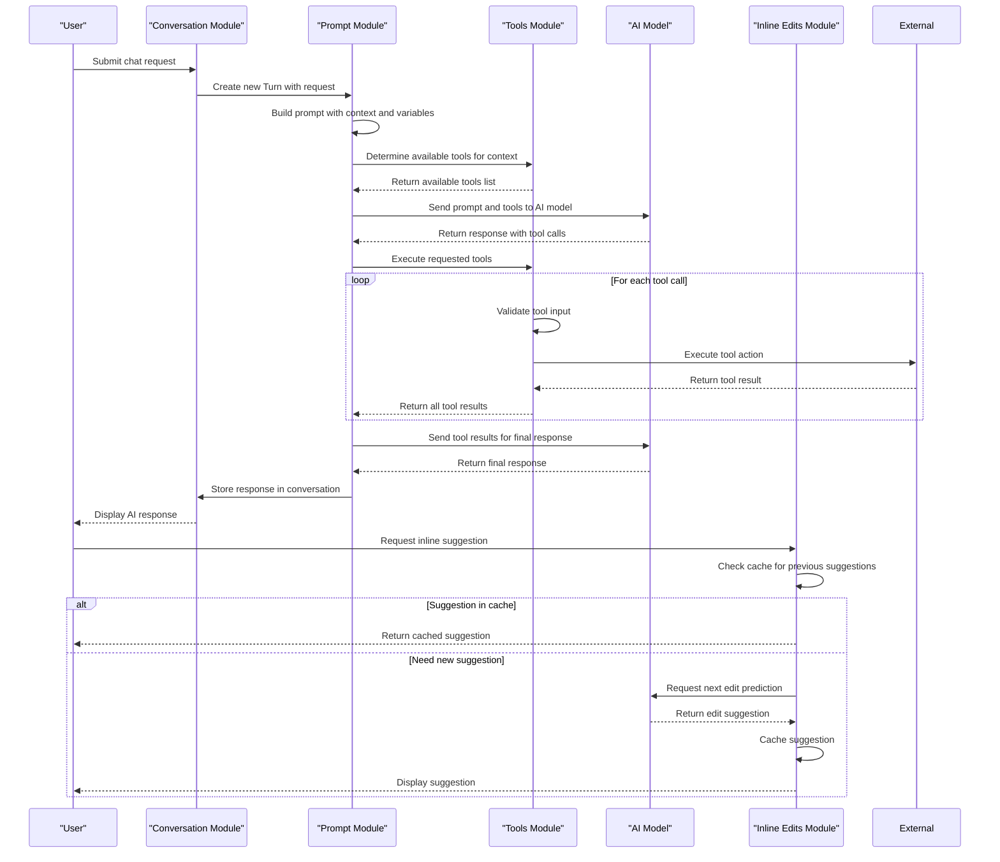

# Core Modules

<cite>
**Referenced Files in This Document**   
- [conversationStore.ts](file://src/extension/conversationStore/node/conversationStore.ts)
- [conversation.ts](file://src/extension/prompt/common/conversation.ts)
- [allTools.ts](file://src/extension/tools/node/allTools.ts)
- [nextEditProvider.ts](file://src/extension/inlineEdits/node/nextEditProvider.ts)
- [defaultIntentRequestHandler.ts](file://src/extension/prompt/node/defaultIntentRequestHandler.ts)
</cite>

## Table of Contents
1. [Introduction](#introduction)
2. [Conversation Module](#conversation-module)
3. [Prompt Module](#prompt-module)
4. [Tools Module](#tools-module)
5. [Inline Edits Module](#inline-edits-module)
6. [Module Interactions and Sequence Flows](#module-interactions-and-sequence-flows)
7. [Modular Design and Architecture](#modular-design-and-architecture)

## Introduction
The vscode-copilot-chat extension implements a modular architecture that separates core AI-powered capabilities into distinct functional modules. This documentation describes the primary components that enable the extension's intelligent features: the Conversation Module for managing chat state, the Prompt Module for constructing AI prompts, the Tools Module for executing function calls, and the Inline Edits Module for providing real-time code suggestions. These modules work together through well-defined interfaces while maintaining independence for easier development and testing.

## Conversation Module
The Conversation Module manages the state and history of chat interactions through the conversationStore.ts implementation. This module provides a centralized service for storing and retrieving conversation data, maintaining the context needed for coherent AI responses across multiple exchanges.

The module implements the IConversationStore interface with a simple yet effective design using an LRUCache to store conversations with a maximum capacity of 1000 entries. Each conversation is associated with a unique responseId and contains a sequence of turns that represent the dialogue history between the user and AI assistant. The Conversation class encapsulates the chat state, including user requests, AI responses, and metadata about the interaction.

This module serves as the foundation for maintaining context across multiple AI interactions, allowing the system to reference previous exchanges when generating responses. The lastConversation property provides quick access to the most recent conversation, enabling features that build upon recent interactions.

**Section sources**
- [conversationStore.ts](file://src/extension/conversationStore/node/conversationStore.ts#L1-L40)
- [conversation.ts](file://src/extension/prompt/common/conversation.ts#L1-L384)

## Prompt Module
The Prompt Module is responsible for constructing AI prompts by combining user input with contextual information and variables. This module transforms user requests into structured prompts that guide the AI model's responses, incorporating relevant code context, workspace information, and conversation history.

The module's core functionality is implemented through the conversation.ts and defaultIntentRequestHandler.ts files, which define the Turn and Conversation classes. Each Turn represents a single exchange in the conversation, containing the user's request message and eventually the AI's response. The PromptMetadata system allows for attaching additional context and instructions to prompts, while the ChatVariablesCollection manages dynamic variables that can be substituted into prompts.

The DefaultIntentRequestHandler orchestrates the prompt construction process, handling intent invocation and response processing. It manages the lifecycle of a chat request from initial processing through tool calling and response generation. The module supports various response stream participants that can modify the output stream, such as code block tracking, edit survival tracking, and linkification.

**Section sources**
- [conversation.ts](file://src/extension/prompt/common/conversation.ts#L1-L384)
- [defaultIntentRequestHandler.ts](file://src/extension/prompt/node/defaultIntentRequestHandler.ts#L1-L765)

## Tools Module
The Tools Module enables function calling and tool execution capabilities through the allTools.ts implementation. This module provides a comprehensive set of tools that extend the AI's capabilities beyond text generation, allowing it to interact with the development environment, file system, and external services.

The allTools.ts file serves as a central registry that imports and registers all available tools in the system. These tools are organized into categories such as file operations (createFileTool, readFileTool), codebase analysis (codebaseTool, searchWorkspaceSymbolsTool), version control (scmChangesTool, githubRepoTool), and IDE integration (vscodeAPITool, vscodeCmdTool). Each tool implements a standardized interface that defines its name, description, input schema, and execution logic.

The module supports dynamic tool registration and discovery, allowing new tools to be added without modifying the core system. The ToolsService manages tool validation, ensuring that inputs conform to expected schemas before execution. This modular approach enables the AI to perform complex operations by chaining multiple tool calls together in a single conversation.

**Section sources**
- [allTools.ts](file://src/extension/tools/node/allTools.ts#L1-L42)

## Inline Edits Module
The Inline Edits Module provides real-time code suggestions through the nextEditProvider.ts implementation. This module analyzes code context and user behavior to predict and suggest the next logical edit, offering intelligent autocomplete-like functionality for code generation and modification.

The NextEditProvider class implements the core prediction logic, using a stateless provider architecture that can be configured through experimentation. The module maintains a cache of previous edit suggestions to improve performance and consistency. It integrates with the workspace edit tracker to understand recent code changes and provide contextually relevant suggestions.

The prediction process considers multiple factors including recent edits, cursor position, and code patterns to generate suggestions. The module supports asynchronous completions and implements sophisticated debouncing and caching strategies to balance responsiveness with accuracy. When a suggestion is accepted, the module can trigger follow-up actions through the SnippyService to provide additional context-aware assistance.

**Section sources**
- [nextEditProvider.ts](file://src/extension/inlineEdits/node/nextEditProvider.ts#L1-L792)

## Module Interactions and Sequence Flows
The core modules interact through a well-defined sequence of operations that begins with user input and culminates in AI-generated responses and actions. The following sequence diagram illustrates the flow from user request to AI response generation and tool execution.

**Diagram sources**
- [conversationStore.ts](file://src/extension/conversationStore/node/conversationStore.ts#L1-L40)
- [conversation.ts](file://src/extension/prompt/common/conversation.ts#L1-L384)
- [defaultIntentRequestHandler.ts](file://src/extension/prompt/node/defaultIntentRequestHandler.ts#L1-L765)
- [allTools.ts](file://src/extension/tools/node/allTools.ts#L1-L42)
- [nextEditProvider.ts](file://src/extension/inlineEdits/node/nextEditProvider.ts#L1-L792)

## Modular Design and Architecture
The vscode-copilot-chat extension employs a modular design that enables independent development, testing, and deployment of each core capability. The architecture follows a service-oriented pattern where each module exposes well-defined interfaces while encapsulating its implementation details.

The Conversation Module provides a centralized state management system that other modules can access through the IConversationStore interface. This separation allows the prompt construction and response generation logic to remain independent while still maintaining shared context. The Prompt Module acts as the orchestrator, coordinating between user input, tool execution, and AI response generation.

The Tools Module implements a plugin-like architecture where individual tools can be developed and tested in isolation. Each tool follows a consistent interface pattern, making it easy to add new capabilities without modifying the core system. The module supports dynamic tool discovery and registration, enabling experimentation with different tool sets.

The Inline Edits Module demonstrates a stateless provider pattern, allowing different prediction algorithms to be swapped in and out through configuration. This design supports A/B testing of different AI models and prediction strategies without affecting other system components.

This modular approach provides several benefits:
- Independent development and testing of each module
- Easy replacement of components with alternative implementations
- Support for experimentation and feature flagging
- Clear separation of concerns between different functional areas
- Scalable architecture that can accommodate new capabilities

The modules communicate through well-defined interfaces and events rather than direct dependencies, reducing coupling and improving maintainability. This design enables the extension to evolve over time while maintaining stability and performance.

**Section sources**
- [conversationStore.ts](file://src/extension/conversationStore/node/conversationStore.ts#L1-L40)
- [conversation.ts](file://src/extension/prompt/common/conversation.ts#L1-L384)
- [defaultIntentRequestHandler.ts](file://src/extension/prompt/node/defaultIntentRequestHandler.ts#L1-L765)
- [allTools.ts](file://src/extension/tools/node/allTools.ts#L1-L42)
- [nextEditProvider.ts](file://src/extension/inlineEdits/node/nextEditProvider.ts#L1-L792)