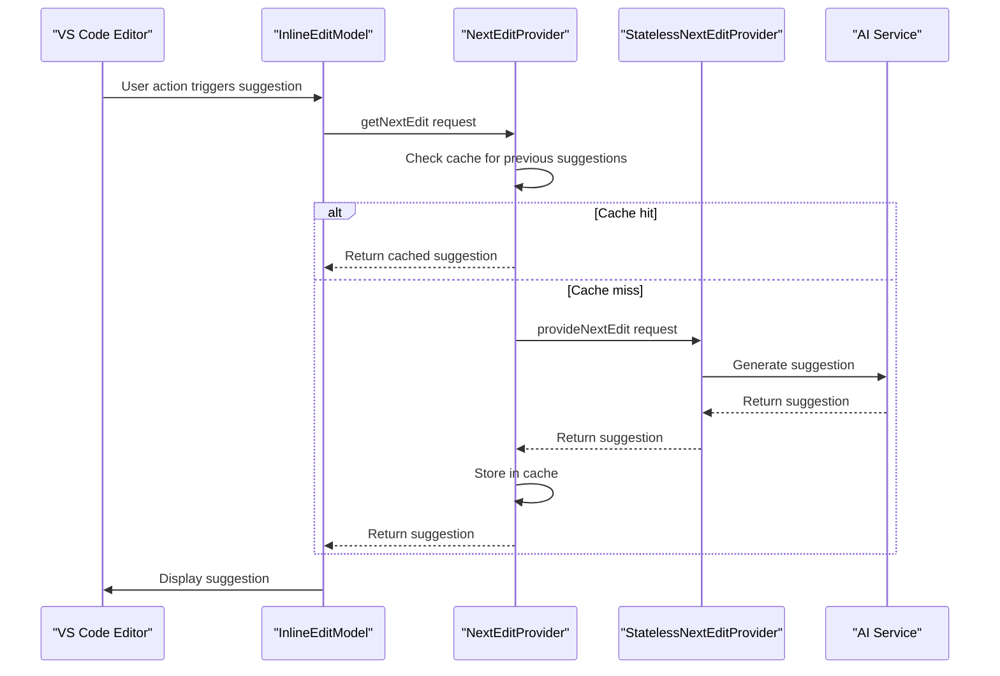
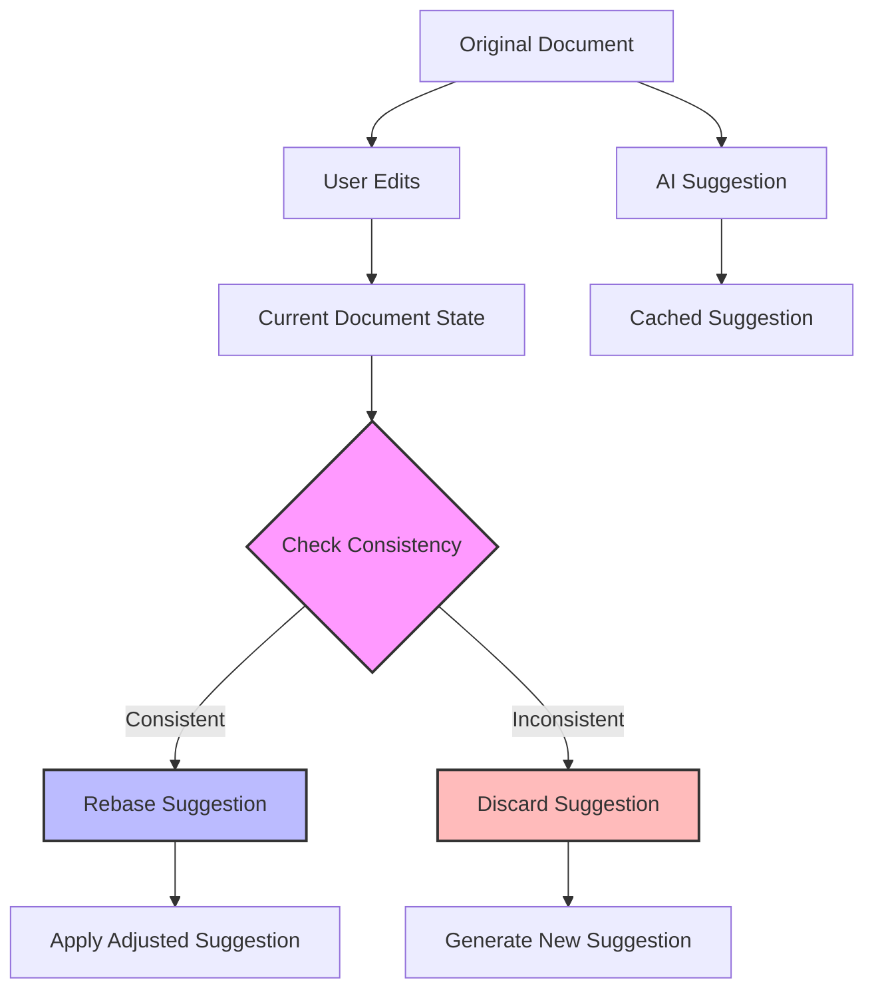
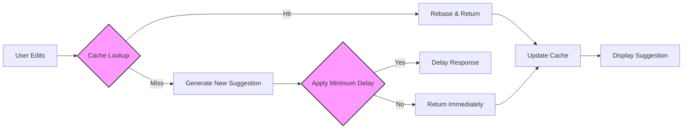

# Inline Editing

<cite>
**Referenced Files in This Document**   
- [nextEditProvider.ts](file://src/extension/inlineEdits/node/nextEditProvider.ts)
- [inlineCompletionProvider.ts](file://src/extension/inlineEdits/vscode-node/inlineCompletionProvider.ts)
- [editRebase.ts](file://src/extension/inlineEdits/common/editRebase.ts)
- [diffNextEdits.ts](file://src/extension/inlineEdits/node/diffNextEdits.ts)
- [statelessNextEditProvider.ts](file://src/platform/inlineEdits/common/statelessNextEditProvider.ts)
- [nextEditCache.ts](file://src/extension/inlineEdits/node/nextEditCache.ts)
- [inlineEditModel.ts](file://src/extension/inlineEdits/vscode-node/inlineEditModel.ts)
</cite>

## Table of Contents
1. [Introduction](#introduction)
2. [Core Components](#core-components)
3. [Data Flow and Processing](#data-flow-and-processing)
4. [Conflict Resolution and Edit Coherence](#conflict-resolution-and-edit-coherence)
5. [Inline Edit Scenarios](#inline-edit-scenarios)
6. [Performance and Optimization](#performance-and-optimization)
7. [Troubleshooting and Common Issues](#troubleshooting-and-common-issues)
8. [Conclusion](#conclusion)

## Introduction
The Inline Editing module in vscode-copilot-chat provides AI-powered code suggestions directly within the editor, enabling real-time code completions based on context. This system integrates with VS Code's editor through a sophisticated architecture that handles suggestion generation, display, conflict resolution, and application. The implementation focuses on maintaining edit coherence, handling partial acceptances, and providing seamless integration with the editor's features. This document details the key components and mechanisms that power the inline editing functionality, including the nextEditProvider.ts for suggestion generation, inlineCompletionProvider.ts for editor integration, editRebase.ts for conflict handling, and diffNextEdits.ts for computing precise changes.

## Core Components

The Inline Editing module consists of several key components that work together to provide AI-powered code suggestions. The nextEditProvider.ts is responsible for generating AI-powered code completions based on context, while inlineCompletionProvider.ts handles the integration with VS Code's editor to display and manage the suggested edits. The editRebase.ts mechanism manages conflicts when user edits occur simultaneously with AI suggestions, and diffNextEdits.ts computes the precise changes to apply. These components work in concert to provide a seamless inline editing experience that maintains edit coherence and handles various editing scenarios.

**Section sources**
- [nextEditProvider.ts](file://src/extension/inlineEdits/node/nextEditProvider.ts#L1-L792)
- [inlineCompletionProvider.ts](file://src/extension/inlineEdits/vscode-node/inlineCompletionProvider.ts#L1-L681)
- [editRebase.ts](file://src/extension/inlineEdits/common/editRebase.ts#L1-L269)
- [diffNextEdits.ts](file://src/extension/inlineEdits/node/diffNextEdits.ts#L1-L67)

## Data Flow and Processing

The data flow for inline editing begins with code context analysis and progresses through suggestion generation to application. The process starts when the inline edit trigger detects a potential editing opportunity, typically after user input or cursor movement. The NextEditProvider in nextEditProvider.ts analyzes the current document state, recent edits, and selection context to generate AI-powered suggestions. This provider uses a stateless approach through the IStatelessNextEditProvider interface, allowing for consistent suggestion generation regardless of internal state.



**Diagram sources**
- [nextEditProvider.ts](file://src/extension/inlineEdits/node/nextEditProvider.ts#L122-L159)
- [inlineEditModel.ts](file://src/extension/inlineEdits/vscode-node/inlineEditModel.ts#L32-L62)
- [statelessNextEditProvider.ts](file://src/platform/inlineEdits/common/statelessNextEditProvider.ts#L36-L43)

The inlineCompletionProvider.ts component integrates with VS Code's editor by implementing the InlineCompletionItemProvider interface. It receives the generated suggestions and formats them for display in the editor. The provider handles various events such as suggestion display, acceptance, rejection, and ignoring, ensuring proper telemetry and state management. The system supports both inline completions (where suggestions appear as ghost text within the current line) and block suggestions (for multi-line edits), with logic to determine the appropriate display format based on context.

## Conflict Resolution and Edit Coherence

The Inline Editing module employs sophisticated mechanisms to handle conflicts when user edits occur simultaneously with AI suggestions. The editRebase.ts component is central to this functionality, providing the logic for rebasing cached edits when the document state changes. This mechanism ensures that suggestions remain relevant even when the user continues editing, by intelligently adjusting the suggested changes to account for user modifications.



**Diagram sources**
- [editRebase.ts](file://src/extension/inlineEdits/common/editRebase.ts#L33-L107)
- [nextEditCache.ts](file://src/extension/inlineEdits/node/nextEditCache.ts#L109-L259)

The system maintains edit coherence through a combination of caching and consistency checking. The NextEditCache in nextEditCache.ts stores previously generated suggestions along with their context, allowing for quick retrieval when appropriate. When a suggestion is retrieved from the cache, the system verifies its consistency with the current document state using the checkEditConsistency function. If the suggestion is still valid, it is rebased to account for any intervening user edits; otherwise, a new suggestion is generated.

The tryRebase function in editRebase.ts implements the core rebasing logic, handling various resolution strategies ('strict' or 'lenient') depending on the context. This function analyzes the relationship between the original edit, user modifications, and the current document state to determine whether the suggestion can be safely applied. The system also tracks rejected suggestions to avoid repeatedly offering the same edits, enhancing the user experience by learning from past interactions.

## Inline Edit Scenarios

The Inline Editing module handles various editing scenarios, each with specific implementation considerations. For single-line completions, the system uses the isInlineSuggestion function to determine whether a suggestion should be displayed as ghost text within the current line. This function checks if the suggestion extends the current line naturally, ensuring that inline completions feel like a natural extension of the user's typing.

```mermaid
classDiagram
class SingleLineCompletion {
+cursorPos : Position
+doc : TextDocument
+range : Range
+newText : string
+isInlineSuggestion() : boolean
}
class MultiLineSuggestion {
+currentLines : string[]
+desiredLines : Lines
+generateDiffNextEdits() : LineEdit
}
class RefactoringOperation {
+originalDocument : string
+editWindow : OffsetRange
+originalEdits : StringReplacement[]
+userEditSince : StringEdit
+currentDocumentContent : string
+tryRebase() : {rebasedEdit : StringReplacement}[] | 'outsideEditWindow' | 'rebaseFailed'
}
SingleLineCompletion --> MultiLineSuggestion : extends
MultiLineSuggestion --> RefactoringOperation : extends
```

**Diagram sources**
- [isInlineSuggestion.ts](file://src/extension/inlineEdits/vscode-node/isInlineSuggestion.ts#L9-L38)
- [diffNextEdits.ts](file://src/extension/inlineEdits/node/diffNextEdits.ts#L15-L31)
- [editRebase.ts](file://src/extension/inlineEdits/common/editRebase.ts#L33-L107)

For multi-line suggestions, the diffNextEdits.ts component computes the precise changes to apply using a diff algorithm. The generateDiffNextEdits function compares the current code lines with the desired lines, producing a LineEdit object that represents the necessary modifications. This approach ensures that multi-line suggestions are applied accurately, even when there are whitespace or formatting differences between the current and desired states.

Refactoring operations present more complex challenges, as they often involve structural changes to the code. The system handles these by maintaining a detailed history of edits and using the rebasing mechanism to adapt suggestions to the current code structure. When a refactoring suggestion is generated, the system considers the edit window and recent changes to ensure that the suggested refactoring is contextually appropriate and doesn't conflict with recent user modifications.

## Performance and Optimization

The Inline Editing module incorporates several performance optimizations to ensure responsive and efficient operation. The caching system in nextEditCache.ts plays a crucial role, storing previously generated suggestions to avoid redundant AI calls. The cache uses an LRU (Least Recently Used) strategy with a capacity of 50 entries, balancing memory usage with performance benefits. Cached suggestions are stored with their context, allowing for intelligent retrieval when the document state matches the cached context.



**Diagram sources**
- [nextEditCache.ts](file://src/extension/inlineEdits/node/nextEditCache.ts#L44-L142)
- [nextEditProvider.ts](file://src/extension/inlineEdits/node/nextEditProvider.ts#L705-L726)

The system implements minimum response delays to prevent overwhelming the user with suggestions. The computeMinimumResponseDelay function calculates an appropriate delay based on whether the suggestion is from the cache, has been rebased, or is a subsequent suggestion. This delay helps create a more natural editing experience by preventing suggestions from appearing too quickly after user input.

Additional optimizations include debouncing mechanisms to reduce the frequency of suggestion requests, particularly during rapid typing. The InlineEditTriggerer in inlineEditModel.ts implements cooldown periods to prevent excessive suggestion generation, with different timeouts for rejection events (5 seconds) and document changes (10 seconds). These optimizations ensure that the system remains responsive without becoming intrusive or resource-intensive.

## Troubleshooting and Common Issues

The Inline Editing module addresses several common issues that can arise during use. Suggestion latency is managed through the caching system and minimum response delays, which balance responsiveness with user experience. When suggestions are not appearing as expected, the most common causes include configuration settings that disable inline edits for specific languages, quota limitations for the AI service, or conflicts with other editor extensions.

Accuracy issues may occur when the AI suggestions don't match the user's intent. The system addresses this through the rejection tracking mechanism in RejectionCollector, which learns from user feedback to avoid repeating rejected suggestions. Additionally, the rebasing system in editRebase.ts helps maintain suggestion relevance by adapting to user modifications, reducing the likelihood of inaccurate suggestions.

Integration with other editor features can sometimes present challenges. The system handles these through careful coordination with VS Code's extension API, ensuring that inline suggestions don't interfere with other editing features. The jointInlineCompletionProvider.ts component manages integration with other completion providers, implementing a priority system that determines which suggestions to display when multiple providers are available.

When troubleshooting issues, developers can use the debugRecorder component to capture detailed logs of the suggestion process. This tool provides insights into the decision-making process, including cache hits/misses, rebasing operations, and timing information. The telemetry system also provides valuable data on suggestion performance, acceptance rates, and error conditions, helping to identify and resolve issues.

**Section sources**
- [nextEditProvider.ts](file://src/extension/inlineEdits/node/nextEditProvider.ts#L66-L68)
- [inlineCompletionProvider.ts](file://src/extension/inlineEdits/vscode-node/inlineCompletionProvider.ts#L148-L186)
- [editRebase.ts](file://src/extension/inlineEdits/common/editRebase.ts#L110-L119)

## Conclusion

The Inline Editing module in vscode-copilot-chat provides a sophisticated system for AI-powered code suggestions that integrates seamlessly with the VS Code editor. Through a combination of context analysis, suggestion generation, conflict resolution, and performance optimization, the system delivers relevant and timely code completions that enhance developer productivity. The modular architecture, with components like nextEditProvider.ts, inlineCompletionProvider.ts, editRebase.ts, and diffNextEdits.ts, allows for flexible and maintainable implementation. By addressing common issues like suggestion latency, accuracy, and integration with other editor features, the system provides a robust and user-friendly experience. The comprehensive caching, rebasing, and telemetry mechanisms ensure that the inline editing functionality remains efficient, coherent, and adaptable to various coding scenarios.