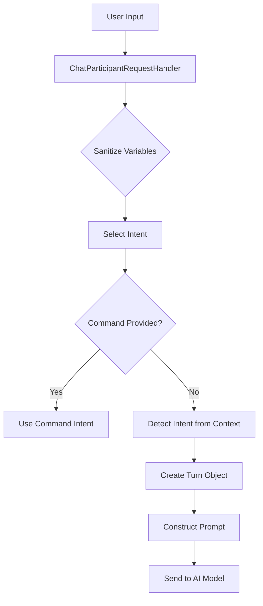
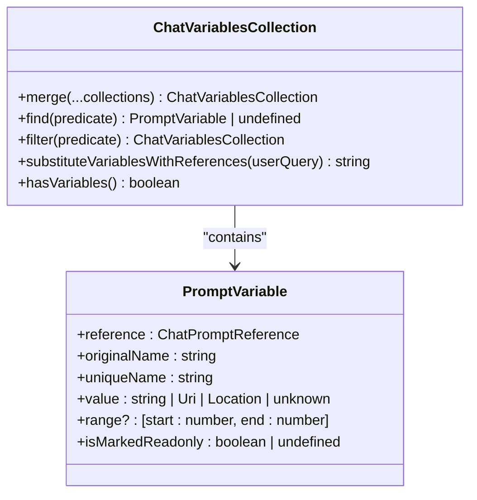
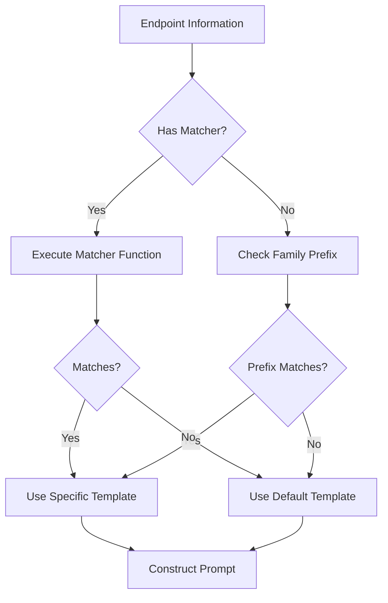

# Prompt System

<cite>
**Referenced Files in This Document**   
- [conversation.ts](file://src/extension/prompt/common/conversation.ts)
- [chatParticipantRequestHandler.ts](file://src/extension/prompt/node/chatParticipantRequestHandler.ts)
- [requestLoggerImpl.ts](file://src/extension/prompt/vscode-node/requestLoggerImpl.ts)
- [promptRegistry.ts](file://src/extension/prompts/node/agent/promptRegistry.ts)
- [chatVariablesCollection.ts](file://src/extension/prompt/common/chatVariablesCollection.ts)
</cite>

## Table of Contents
1. [Introduction](#introduction)
2. [Core Components](#core-components)
3. [Prompt Construction Process](#prompt-construction-process)
4. [Context Enrichment and Variable Substitution](#context-enrichment-and-variable-substitution)
5. [Prompt Registry and Template Resolution](#prompt-registry-and-template-resolution)
6. [Request Logging and Telemetry](#request-logging-and-telemetry)
7. [Specialized Prompt Templates](#specialized-prompt-templates)
8. [Configuration and Customization](#configuration-and-customization)
9. [Common Issues and Performance Considerations](#common-issues-and-performance-considerations)
10. [Conclusion](#conclusion)

## Introduction
The Prompt System in vscode-copilot-chat is responsible for transforming user input into structured prompts that can be processed by AI models. This system handles the construction of prompts by combining user input, context variables, and conversation history to create meaningful interactions with the AI. The core components involved in this process include conversation management, request handling, prompt templating, and logging mechanisms. This document provides a comprehensive overview of how these components work together to deliver an effective AI-powered coding assistant experience.

## Core Components

The Prompt System consists of several key components that work together to process user requests and generate appropriate responses. The main components include the conversation management system, which tracks the state of interactions; the chat participant request handler, which processes incoming requests; the prompt registry, which manages different prompt templates; and the request logger, which captures interaction data for debugging and telemetry purposes. These components are designed to work in concert to provide a seamless experience for users interacting with the AI assistant.

**Section sources**
- [conversation.ts](file://src/extension/prompt/common/conversation.ts#L23-178)
- [chatParticipantRequestHandler.ts](file://src/extension/prompt/node/chatParticipantRequestHandler.ts#L58-324)

## Prompt Construction Process

The prompt construction process begins when a user submits a request through the chat interface. The ChatParticipantRequestHandler class receives this request and initiates the processing pipeline. The handler first normalizes the conversation history by adding any previous turns to the current conversation object. It then creates a new Turn object representing the current request, which includes the user's message, any referenced context variables, and tool references.

The system processes the request by first sanitizing variables to ensure they don't contain paths that should be ignored. It then determines the appropriate intent for the request based on the command used and the current context. For editor-based requests, the system can automatically detect the intent based on whether the user has selected code or is working with an empty line. The request is then passed to the appropriate intent handler, which constructs the final prompt using the selected template and context information.



**Diagram sources**
- [chatParticipantRequestHandler.ts](file://src/extension/prompt/node/chatParticipantRequestHandler.ts#L58-324)

**Section sources**
- [chatParticipantRequestHandler.ts](file://src/extension/prompt/node/chatParticipantRequestHandler.ts#L58-324)
- [conversation.ts](file://src/extension/prompt/common/conversation.ts#L68-91)

## Context Enrichment and Variable Substitution

Context enrichment is a critical aspect of the prompt system, ensuring that AI models receive sufficient information to generate helpful responses. The system enriches prompts with relevant context from the user's workspace, including file contents, selection ranges, and conversation history. The ChatVariablesCollection class manages context variables, providing methods to merge, filter, and iterate over variables from different sources.

When constructing prompts, the system substitutes variables with their actual values while maintaining references to their original sources. This allows the AI to understand the context of each variable and generate more accurate responses. The system also handles special cases such as prompt instructions and prompt files, which provide additional guidance to the AI model. Variables are deduplicated based on their content to prevent redundant information in the prompt.



**Diagram sources**
- [chatVariablesCollection.ts](file://src/extension/prompt/common/chatVariablesCollection.ts#L17-103)

**Section sources**
- [chatVariablesCollection.ts](file://src/extension/prompt/common/chatVariablesCollection.ts#L17-119)

## Prompt Registry and Template Resolution

The prompt registry system provides a flexible mechanism for managing different prompt templates based on the target AI model and context. The PromptRegistry class maintains a collection of prompt constructors that can be registered and resolved based on model characteristics. Each prompt constructor can match models either by family prefix or through a custom matching function.

When resolving templates, the system first checks for prompts with explicit model matchers, then falls back to family-based matching. This allows for both precise model targeting and broader category-based template selection. The registry resolves several types of prompt components, including system prompts, reminder instructions, tool reference hints, identity rules, and safety rules. Default implementations are provided for cases where no specific template is registered.



**Diagram sources**
- [promptRegistry.ts](file://src/extension/prompts/node/agent/promptRegistry.ts#L55-113)

**Section sources**
- [promptRegistry.ts](file://src/extension/prompts/node/agent/promptRegistry.ts#L55-113)

## Request Logging and Telemetry

The request logging system captures detailed information about prompt interactions for debugging, telemetry, and analysis purposes. The RequestLogger class implements comprehensive logging capabilities that track various aspects of the request lifecycle, including model list calls, tool calls, and prompt rendering. The logger maintains a collection of logged entries that can be accessed and rendered in different formats.

Logged information includes metadata about the request, such as the endpoint URL, model information, timing data, and usage statistics. The system also captures request messages, response data, and error information when applicable. For tool calls, the logger records the tool name, arguments, response content, and any associated thinking data. The logged entries can be rendered as JSON, raw request data, or formatted markdown for easy analysis.

```mermaid
classDiagram
class RequestLogger {
+getRequests() LoggedInfo[]
+logModelListCall(id, requestMetadata, models)
+logToolCall(id, name, args, response, thinking)
+addPromptTrace(elementName, endpoint, result, trace)
+addEntry(entry)
}
class LoggedInfo {
<<interface>>
+id : string
+kind : LoggedInfoKind
}
class LoggedRequestInfo {
+entry : LoggedRequest
+token : CapturingToken | undefined
}
class LoggedToolCall {
+name : string
+args : unknown
+response : LanguageModelToolResult2
+time : number
+thinking? : ThinkingData
+edits? : { path : string; edits : string }[]
}
LoggedInfo <|-- LoggedRequestInfo
LoggedInfo <|-- LoggedToolCall
RequestLogger --> LoggedInfo : "manages"
```

**Diagram sources**
- [requestLoggerImpl.ts](file://src/extension/prompt/vscode-node/requestLoggerImpl.ts#L237-703)

**Section sources**
- [requestLoggerImpl.ts](file://src/extension/prompt/vscode-node/requestLoggerImpl.ts#L237-703)

## Specialized Prompt Templates

The system employs specialized prompt templates for different conversation types and use cases. These templates are implemented as React-like components using the prompt-tsx library, allowing for structured and composable prompt construction. Different templates are used for code explanation, generation, refactoring, and other coding tasks, each tailored to the specific requirements of the task.

For example, code explanation prompts include context about the selected code and ask the AI to provide a detailed explanation of its functionality. Code generation prompts focus on creating new code based on a description, while refactoring prompts emphasize improving existing code structure and quality. The system also includes specialized templates for notebook interactions, terminal commands, and workspace-level operations.

The template system supports conditional rendering based on context, allowing prompts to adapt to different situations. Templates can include instructions for the AI, formatting guidelines, and examples of desired output. This flexibility enables the system to provide highly relevant and effective prompts for a wide range of coding scenarios.

**Section sources**
- [promptRegistry.ts](file://src/extension/prompts/node/agent/promptRegistry.ts#L13-31)
- [conversationHistory.tsx](file://src/extension/prompts/node/panel/conversationHistory.tsx#L73-139)

## Configuration and Customization

The prompt system provides several configuration options that allow users and administrators to customize its behavior. These options include settings for controlling the maximum number of logged entries, enabling or disabling workspace edit tracing, and configuring how canceled requests are handled. The system also supports custom instructions that users can provide to guide the AI's behavior across different interactions.

Configuration is managed through the IConfigurationService, which provides access to various settings that affect prompt construction and processing. Users can customize aspects such as the format of tool call arguments, the handling of prediction content, and the display of metadata in logged entries. The system also respects workspace-level settings that may affect which files are included in context or how certain operations are performed.

The extensibility model allows for the registration of custom prompt templates and handlers, enabling organizations to tailor the system to their specific needs and coding standards. This includes the ability to define custom intents, create specialized prompt components, and integrate with external tools and services.

**Section sources**
- [requestLoggerImpl.ts](file://src/extension/prompt/vscode-node/requestLoggerImpl.ts#L245-246)
- [promptRegistry.ts](file://src/extension/prompts/node/agent/promptRegistry.ts#L55-113)

## Common Issues and Performance Considerations

The prompt system addresses several common issues that can arise in AI-assisted coding environments. One key concern is prompt injection, where malicious input could potentially manipulate the AI's behavior. The system mitigates this risk through careful sanitization of variables and context, as well as through safety rules that are included in prompts to guide the AI's responses.

Context overflow is another potential issue, particularly when working with large codebases or complex projects. The system handles this by implementing conversation history summarization, which condenses previous interactions when the context window approaches its limit. This ensures that important context is preserved while staying within token constraints.

Performance considerations include the latency of prompt construction, which can impact the responsiveness of the AI assistant. The system optimizes this process through efficient data structures and caching mechanisms. The request logger is designed to minimize performance impact by using asynchronous operations and limiting the amount of data stored. The system also implements throttling and cancellation mechanisms to prevent excessive resource usage during high-volume interactions.

**Section sources**
- [chatParticipantRequestHandler.ts](file://src/extension/prompt/node/chatParticipantRequestHandler.ts#L151-181)
- [conversationHistory.tsx](file://src/extension/prompts/node/panel/conversationHistory.tsx#L149-168)
- [requestLoggerImpl.ts](file://src/extension/prompt/vscode-node/requestLoggerImpl.ts#L370-377)

## Conclusion
The Prompt System in vscode-copilot-chat provides a robust framework for constructing and managing AI prompts in a coding environment. By combining user input with rich context information and conversation history, the system enables meaningful interactions with AI models that can assist with various coding tasks. The modular architecture, with its separation of concerns between conversation management, request handling, template resolution, and logging, allows for flexibility and extensibility while maintaining performance and reliability. As AI-assisted development continues to evolve, this system provides a solid foundation for delivering increasingly sophisticated coding assistance capabilities.