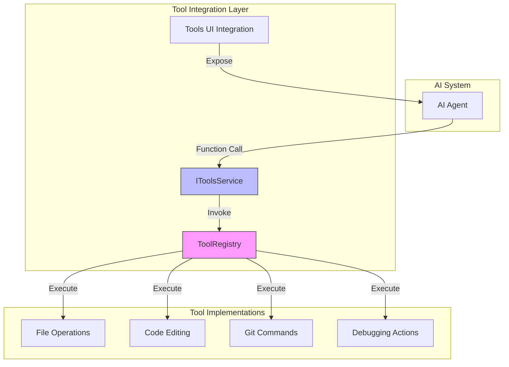
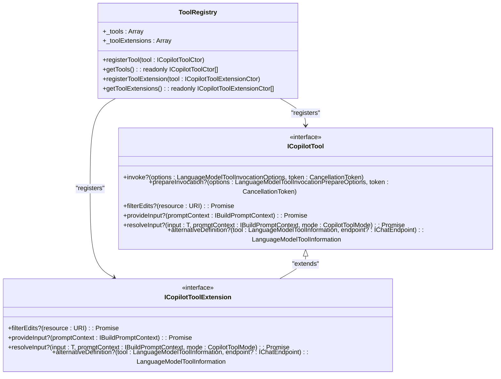
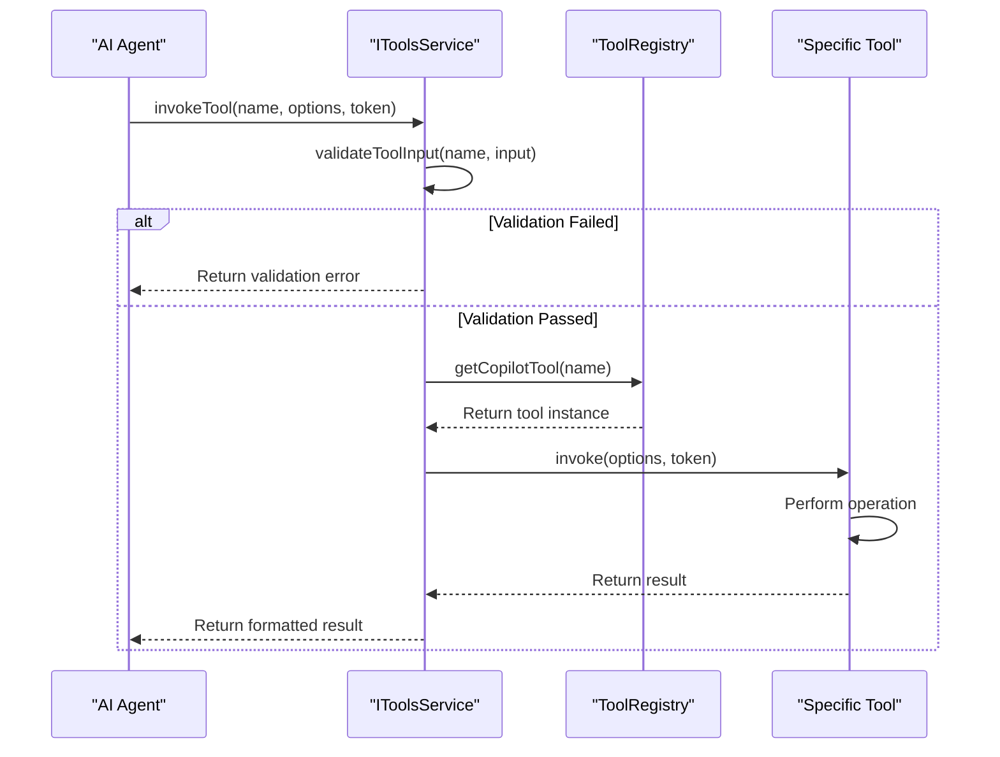
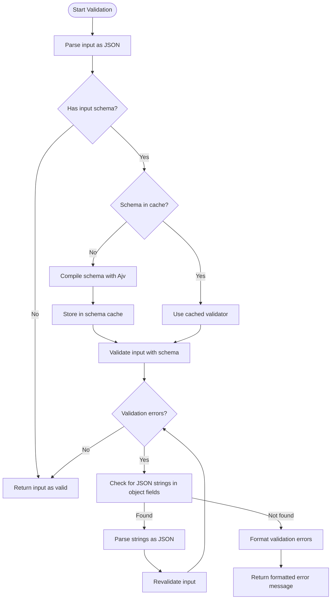
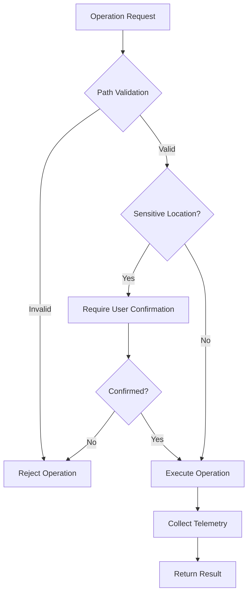
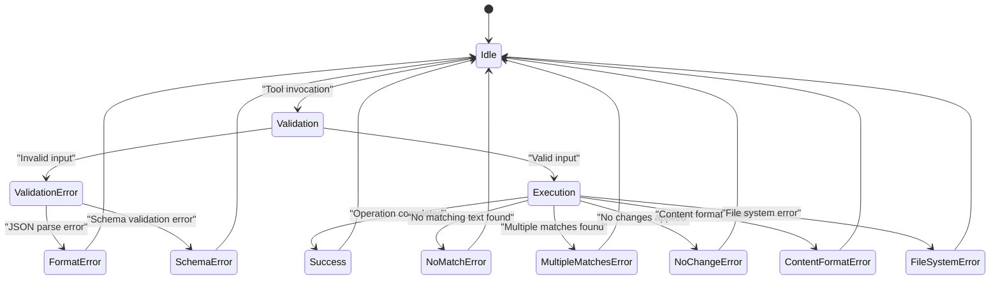
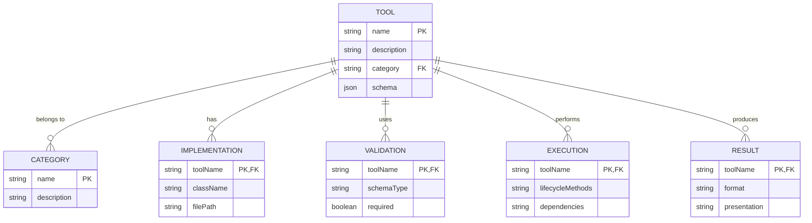

# Tool Integration

<cite>
**Referenced Files in This Document**   
- [toolsRegistry.ts](file://src/extension/tools/common/toolsRegistry.ts)
- [toolsService.ts](file://src/extension/tools/common/toolsService.ts)
- [allTools.ts](file://src/extension/tools/node/allTools.ts)
- [allTools.ts](file://src/extension/tools/vscode-node/allTools.ts)
- [tools.ts](file://src/extension/tools/vscode-node/tools.ts)
- [toolNames.ts](file://src/extension/tools/common/toolNames.ts)
- [createFileTool.tsx](file://src/extension/tools/node/createFileTool.tsx)
- [findFilesTool.tsx](file://src/extension/tools/node/findFilesTool.tsx)
- [editFileToolUtils.tsx](file://src/extension/tools/node/editFileToolUtils.tsx)
</cite>

## Table of Contents
1. [Introduction](#introduction)
2. [Architecture Overview](#architecture-overview)
3. [Core Components](#core-components)
4. [Tool Registry and Management](#tool-registry-and-management)
5. [Tool Execution Lifecycle](#tool-execution-lifecycle)
6. [Parameter Validation and Input Processing](#parameter-validation-and-input-processing)
7. [Security Considerations](#security-considerations)
8. [Error Handling Patterns](#error-handling-patterns)
9. [Extensibility Mechanisms](#extensibility-mechanisms)
10. [Implementation Guidance](#implementation-guidance)

## Introduction

The Tool Integration module in vscode-copilot-chat enables the AI system to interact with the development environment through function calling. This architecture allows the AI assistant to perform various development tasks by invoking specific tools that interface with the VS Code environment, file system, version control, and other services. The system is designed to provide a secure, extensible framework for AI-driven development assistance.

The module follows a structured approach where tools are registered, validated, executed, and their results processed in a consistent manner. This enables the AI system to extend its capabilities beyond text generation to actual development environment interactions while maintaining safety and reliability.

**Section sources**
- [toolsRegistry.ts](file://src/extension/tools/common/toolsRegistry.ts#L1-L106)
- [toolsService.ts](file://src/extension/tools/common/toolsService.ts#L1-L254)

## Architecture Overview

The Tool Integration architecture consists of several key components that work together to enable AI-driven development tasks. The system is organized around a registry pattern where all available tools are registered and managed centrally, with a service layer that handles execution, validation, and lifecycle management.

**Diagram sources **
- [toolsRegistry.ts](file://src/extension/tools/common/toolsRegistry.ts#L86-L105)
- [toolsService.ts](file://src/extension/tools/common/toolsService.ts#L47-L80)

**Section sources**
- [toolsRegistry.ts](file://src/extension/tools/common/toolsRegistry.ts#L1-L106)
- [toolsService.ts](file://src/extension/tools/common/toolsService.ts#L1-L254)

## Core Components

The Tool Integration module comprises several core components that work together to enable AI-driven development tasks. The architecture is designed to be modular, extensible, and maintainable, with clear separation of concerns between registration, execution, and presentation layers.

The system supports various tool categories including code editing, file operations, git commands, and debugging actions. Each tool follows a consistent interface and lifecycle, ensuring predictable behavior and reliable error handling. The integration with the chat interface allows users to leverage AI assistance for complex development tasks while maintaining control over the execution environment.

**Section sources**
- [toolsRegistry.ts](file://src/extension/tools/common/toolsRegistry.ts#L1-L106)
- [toolsService.ts](file://src/extension/tools/common/toolsService.ts#L1-L254)
- [allTools.ts](file://src/extension/tools/node/allTools.ts#L1-L42)

## Tool Registry and Management

The tools registry serves as the central repository for all available tools in the system. Implemented as a singleton class `ToolRegistry`, it maintains a collection of tool constructors that can be instantiated when needed. The registry uses TypeScript interfaces to define the contract for tool implementations, ensuring consistency across different tool types.

Tools are registered through the `registerTool` method, which adds tool constructors to an internal array. The registry provides methods to retrieve all registered tools, enabling the system to enumerate available capabilities. Each tool is identified by a unique name from the `ToolName` enum, which provides type safety and prevents naming conflicts.

The registry also supports tool extensions through the `ICopilotToolExtension` interface, allowing additional functionality to be attached to tools without modifying their core implementation. This extension mechanism supports features like input validation, parameter resolution, and alternative tool definitions based on the language model endpoint.

**Diagram sources **
- [toolsRegistry.ts](file://src/extension/tools/common/toolsRegistry.ts#L86-L105)
- [toolNames.ts](file://src/extension/tools/common/toolNames.ts#L21-L71)

**Section sources**
- [toolsRegistry.ts](file://src/extension/tools/common/toolsRegistry.ts#L1-L106)
- [toolNames.ts](file://src/extension/tools/common/toolNames.ts#L1-L251)

## Tool Execution Lifecycle

The tool execution lifecycle is managed by the `IToolsService` interface and its implementations, which handle the complete process from tool invocation to result processing. The service layer provides a consistent API for interacting with tools while abstracting away the complexities of validation, error handling, and lifecycle management.

When a tool is invoked, the process follows several key steps:
1. Parameter validation using JSON schema validation
2. Input preparation and transformation
3. Tool execution with cancellation support
4. Result formatting and presentation
5. Telemetry collection

The `BaseToolsService` class provides the foundational implementation with methods for validating tool input, invoking tools, and managing the execution context. The service uses Ajv for JSON schema validation, ensuring that tool inputs conform to expected formats before execution. A schema cache is maintained to improve performance for repeated validations.

Tools can implement the `prepareInvocation` method to provide user-facing messages about the impending action, such as "Creating file..." or "Searching for files...". This enhances the user experience by providing feedback before potentially long-running operations.

**Diagram sources **
- [toolsService.ts](file://src/extension/tools/common/toolsService.ts#L47-L80)
- [createFileTool.tsx](file://src/extension/tools/node/createFileTool.tsx#L43-L201)

**Section sources**
- [toolsService.ts](file://src/extension/tools/common/toolsService.ts#L1-L254)
- [createFileTool.tsx](file://src/extension/tools/node/createFileTool.tsx#L1-L201)

## Parameter Validation and Input Processing

Parameter validation is a critical aspect of the tool integration system, ensuring that tool inputs are properly formatted and safe to process. The system uses JSON schema validation through the Ajv library to validate tool inputs against predefined schemas. When a tool is invoked, the input string is first parsed as JSON and then validated against the tool's input schema.

The validation process includes special handling for nested JSON strings, where the system attempts to parse string values as JSON objects when the schema expects an object type. This accommodates cases where the AI model generates JSON strings within the input payload. If validation fails due to type mismatches, the system attempts to parse string values as JSON and revalidates the input.

Input processing is enhanced through the `resolveInput` method, which allows tools to transform or augment AI-generated input parameters. This method can modify generated inputs by adding missing properties or adjusting values based on context. For example, the `FindFilesTool` automatically prefixes queries with `**/` if not already present and adjusts the `maxResults` parameter based on the invocation mode.

**Diagram sources **
- [toolsService.ts](file://src/extension/tools/common/toolsService.ts#L113-L153)
- [findFilesTool.tsx](file://src/extension/tools/node/findFilesTool.tsx#L90-L107)

**Section sources**
- [toolsService.ts](file://src/extension/tools/common/toolsService.ts#L1-L254)
- [findFilesTool.tsx](file://src/extension/tools/node/findFilesTool.tsx#L1-L140)

## Security Considerations

The tool integration system incorporates several security measures to prevent unauthorized or potentially harmful operations. Path validation is performed to ensure that file operations are restricted to appropriate locations, with special handling for system directories and user home folders. The `assertPathIsSafe` function validates paths on Windows systems to prevent exploitation of NTFS alternate data streams and other Windows-specific vulnerabilities.

File operations are subject to content exclusion checks that prevent modification of sensitive files. The system also implements confirmation requirements for operations in sensitive locations, such as configuration directories and system paths. These confirmations can be configured through settings, allowing users to customize the security level based on their preferences.

The architecture includes telemetry collection for tool invocations, enabling monitoring of tool usage patterns and detection of potential abuse. Each tool invocation includes telemetry events that capture the request ID, model, and operation-specific details, providing an audit trail for security analysis.

**Diagram sources **
- [editFileToolUtils.tsx](file://src/extension/tools/node/editFileToolUtils.tsx#L730-L785)
- [createFileTool.tsx](file://src/extension/tools/node/createFileTool.tsx#L67-L68)

**Section sources**
- [editFileToolUtils.tsx](file://src/extension/tools/node/editFileToolUtils.tsx#L1-L800)
- [createFileTool.tsx](file://src/extension/tools/node/createFileTool.tsx#L1-L201)

## Error Handling Patterns

The tool integration system employs comprehensive error handling patterns to ensure robust operation and provide meaningful feedback to users. Custom error classes are defined for different error types, including `EditError`, `NoMatchError`, `MultipleMatchesError`, and `NoChangeError`, each with specific telemetry categories for monitoring and analysis.

The system distinguishes between validation errors and execution errors, providing appropriate feedback in each case. Validation errors occur when tool inputs don't conform to expected formats, while execution errors happen during the actual operation. The error handling includes special cases for common scenarios, such as when a file already exists or when no matching text is found for replacement operations.

Tools implement defensive programming practices, including null checks, proper exception handling, and fallback mechanisms. For example, when attempting to open a document, the system catches exceptions and continues rather than failing completely. This resilience ensures that the AI assistant can continue operating even when individual tool invocations encounter issues.

**Diagram sources **
- [editFileToolUtils.tsx](file://src/extension/tools/node/editFileToolUtils.tsx#L49-L90)
- [createFileTool.tsx](file://src/extension/tools/node/createFileTool.tsx#L74-L98)

**Section sources**
- [editFileToolUtils.tsx](file://src/extension/tools/node/editFileToolUtils.tsx#L1-L800)
- [createFileTool.tsx](file://src/extension/tools/node/createFileTool.tsx#L1-L201)

## Extensibility Mechanisms

The tool integration system is designed with extensibility as a core principle, allowing new tools to be added and existing tools to be enhanced without modifying the core architecture. The registry pattern enables dynamic registration of tools, while the interface-based design ensures consistent behavior across implementations.

The system supports multiple extension points:
- Tool registration through the `ToolRegistry`
- Input parameter resolution via `resolveInput` method
- User confirmation and edit filtering through `filterEdits`
- Input provision through `provideInput`
- Alternative tool definitions based on language model endpoints

The categorization system allows tools to be grouped logically in the UI, with the `ToolCategory` enum defining categories such as "Jupyter Notebook Tools", "Web Interaction", and "VS Code Interaction". This grouping enhances discoverability and helps users understand the capabilities available to them.

External services can be integrated by implementing the appropriate tool interface and registering the tool with the registry. The system's dependency injection pattern allows tools to access necessary services like file system operations, workspace management, and telemetry collection.

**Diagram sources **
- [toolNames.ts](file://src/extension/tools/common/toolNames.ts#L11-L19)
- [toolNames.ts](file://src/extension/tools/common/toolNames.ts#L158-L225)

**Section sources**
- [toolNames.ts](file://src/extension/tools/common/toolNames.ts#L1-L251)
- [toolsRegistry.ts](file://src/extension/tools/common/toolsRegistry.ts#L1-L106)

## Implementation Guidance

Implementing new tools in the vscode-copilot-chat system follows a consistent pattern that ensures integration with the existing architecture. To create a new tool, define a class that implements the `ICopilotTool` interface and register it with the `ToolRegistry`. The class should include a static `toolName` property that references a value from the `ToolName` enum.

Key implementation considerations include:
- Proper parameter validation using JSON schemas
- Comprehensive error handling with appropriate error types
- Efficient resource management with proper disposal patterns
- Appropriate telemetry collection for monitoring and analysis
- User feedback through preparation messages and result presentation

When integrating with external services, use the dependency injection pattern to access required services rather than creating direct dependencies. This promotes testability and maintainability. Tools should be designed to handle cancellation gracefully, responding to cancellation tokens to prevent hanging operations.

The system provides utility functions for common operations like path resolution, file existence checking, and diff formatting. These utilities should be used where applicable to ensure consistency across tools. Security considerations should be paramount, with proper validation of inputs and restrictions on operations in sensitive locations.

**Section sources**
- [createFileTool.tsx](file://src/extension/tools/node/createFileTool.tsx#L43-L201)
- [findFilesTool.tsx](file://src/extension/tools/node/findFilesTool.tsx#L30-L108)
- [toolsRegistry.ts](file://src/extension/tools/common/toolsRegistry.ts#L86-L105)