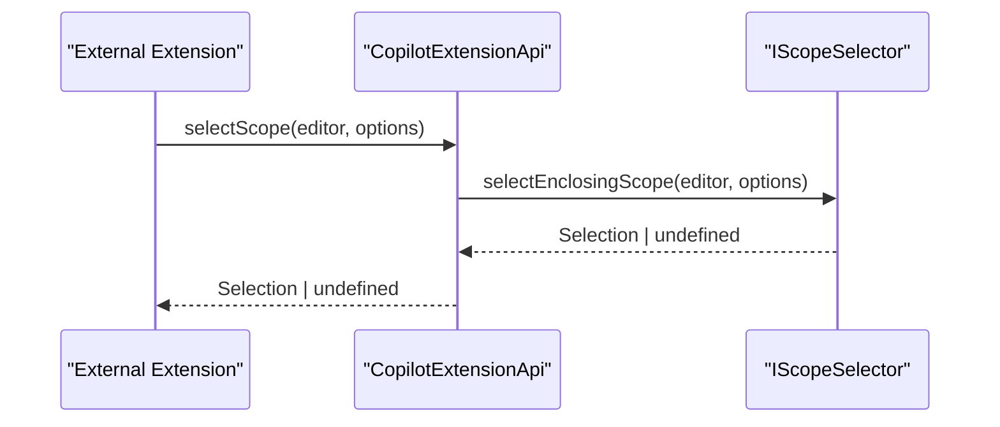
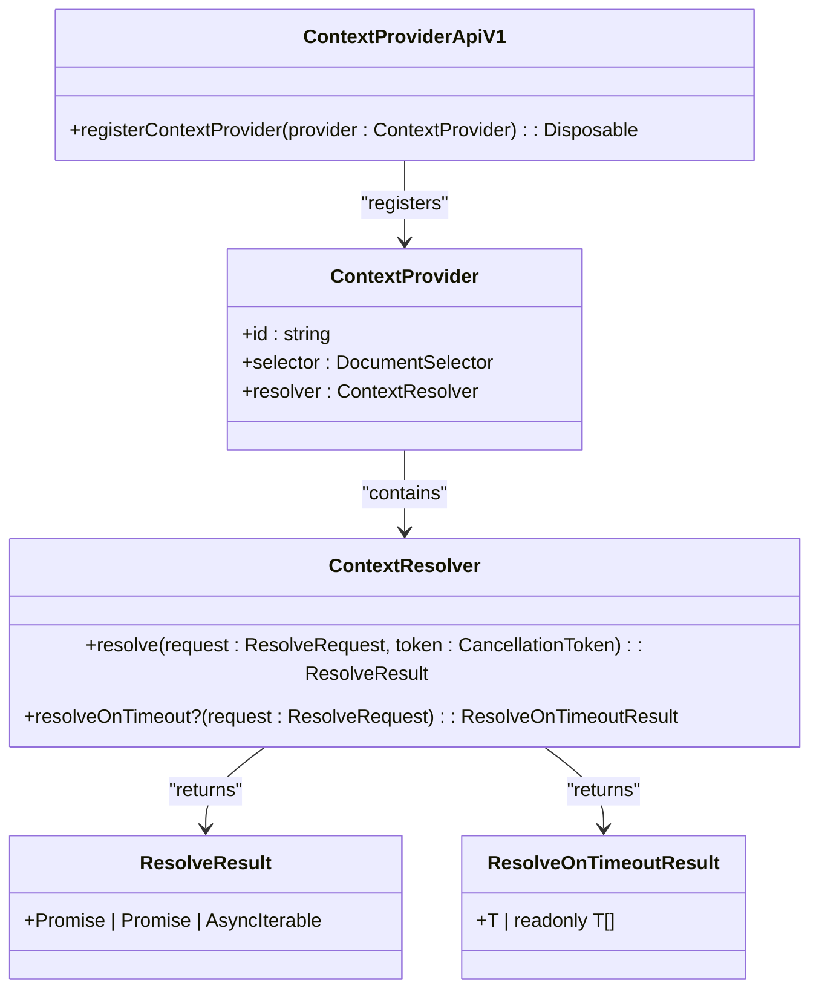
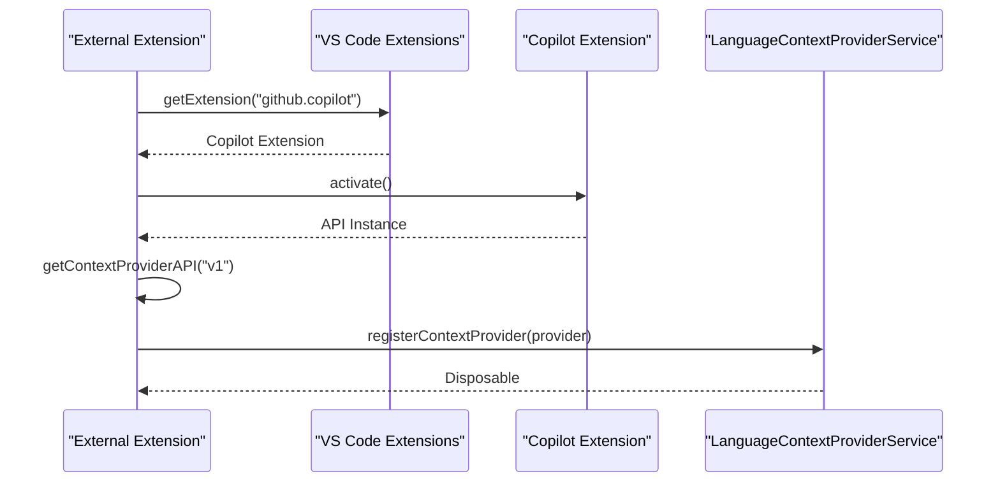
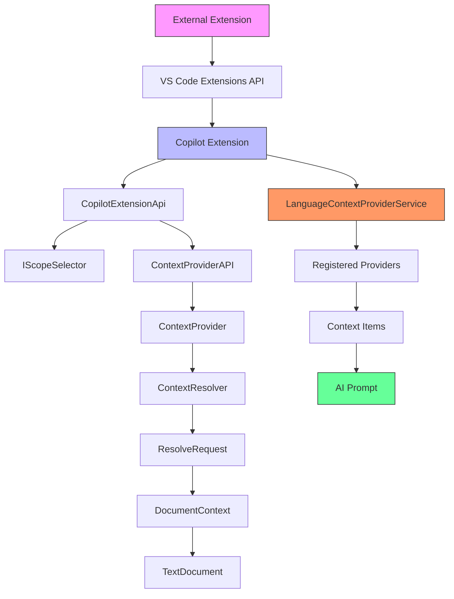
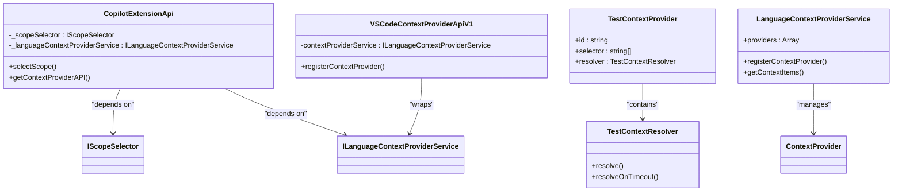
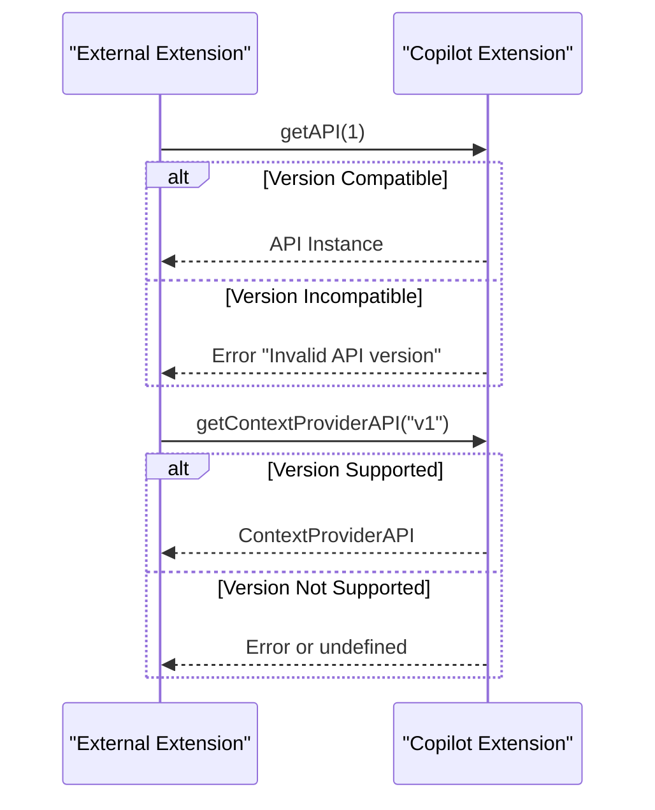

# API Interfaces

<cite>
**Referenced Files in This Document**   
- [extensionApi.ts](file://src/extension/api/vscode/extensionApi.ts)
- [vscodeContextProviderApi.ts](file://src/extension/api/vscode/vscodeContextProviderApi.ts)
- [api.d.ts](file://src/extension/api/vscode/api.d.ts)
- [languageContextProviderService.ts](file://src/extension/languageContextProvider/vscode-node/languageContextProviderService.ts)
- [languageContextProviderService.ts](file://src/platform/languageContextProvider/common/languageContextProviderService.ts)
- [scopeSelection.ts](file://src/platform/scopeSelection/common/scopeSelection.ts)
- [extension.ts](file://src/extension/extension/vscode/extension.ts)
- [contextProviderApiV1.ts](file://src/extension/completions-core/vscode-node/types/src/contextProviderApiV1.ts)
- [api.ts](file://src/platform/inlineCompletions/common/api.ts)
</cite>

## Table of Contents
1. [Introduction](#introduction)
2. [Core API Contracts](#core-api-contracts)
3. [Extension API Interface](#extension-api-interface)
4. [Context Provider API Interface](#context-provider-api-interface)
5. [API Usage Patterns](#api-usage-patterns)
6. [Design Decisions and Architecture](#design-decisions-and-architecture)
7. [Implementation Examples](#implementation-examples)
8. [Versioning and Backward Compatibility](#versioning-and-backward-compatibility)
9. [Common Issues and Troubleshooting](#common-issues-and-troubleshooting)
10. [Best Practices for API Extension](#best-practices-for-api-extension)

## Introduction
The API interfaces in vscode-copilot-chat provide a structured communication layer between the extension and external systems or components. These interfaces enable extensibility by allowing other extensions to integrate with Copilot's functionality, particularly in providing contextual information for AI-assisted coding. The core API contracts are defined in `extensionApi.ts` and `vscodeContextProviderApi.ts`, which expose methods for scope selection and context provisioning. These interfaces follow a versioned approach to ensure backward compatibility while allowing for future enhancements. The design emphasizes loose coupling between components, enabling independent development and deployment of extension features while maintaining a stable integration surface.

**Section sources**
- [extensionApi.ts](file://src/extension/api/vscode/extensionApi.ts#L1-L32)
- [vscodeContextProviderApi.ts](file://src/extension/api/vscode/vscodeContextProviderApi.ts#L1-L21)

## Core API Contracts
The API interfaces in vscode-copilot-chat are designed around two primary contracts: the extension API and the context provider API. The extension API provides high-level functionality such as scope selection, while the context provider API enables extensions to contribute contextual information for AI completions. These contracts are defined using TypeScript interfaces and classes that establish clear method signatures, parameter types, and return types. The interfaces leverage dependency injection patterns, with services like `IScopeSelector` and `ILanguageContextProviderService` injected into the API implementations. This design allows for flexible composition and testing of components. The contracts are versioned to support evolution while maintaining backward compatibility, with the current implementation supporting version 1 of the context provider API.

```mermaid
classDiagram
class CopilotExtensionApi {
+static readonly version : number
+selectScope(editor : TextEditor, options : { reason? : string }) : Promise<Selection | undefined>
+getContextProviderAPI(version : 'v1') : ContextProviderApiV1
}
class VSCodeContextProviderApiV1 {
+registerContextProvider(provider : ContextProvider) : Disposable
}
class ContextProvider {
+id : string
+selector : DocumentSelector
+resolver : ContextResolver
}
class ContextResolver {
+resolve(request : ResolveRequest, token : CancellationToken) : Promise<T> | Promise<T[]> | AsyncIterable<T>
+resolveOnTimeout?(request : ResolveRequest) : T | readonly T[] | undefined
}
class ResolveRequest {
+completionId : string
+documentContext : DocumentContext
+activeExperiments : Map<string, string | number | boolean | string[]>
+timeoutEnd : number
+source : string
}
class DocumentContext {
+uri : DocumentUri
+languageId : string
+version : number
+position : Position
+proposedEdits : ProposedTextEdit[]
}
CopilotExtensionApi --> VSCodeContextProviderApiV1 : "returns"
VSCodeContextProviderApiV1 --> ContextProvider : "registers"
ContextProvider --> ContextResolver : "contains"
ContextResolver --> ResolveRequest : "receives"
ResolveRequest --> DocumentContext : "contains"
```

**Diagram sources**
- [extensionApi.ts](file://src/extension/api/vscode/extensionApi.ts#L13-L32)
- [vscodeContextProviderApi.ts](file://src/extension/api/vscode/vscodeContextProviderApi.ts#L11-L21)
- [api.ts](file://src/platform/inlineCompletions/common/api.ts#L38-L71)

**Section sources**
- [extensionApi.ts](file://src/extension/api/vscode/extensionApi.ts#L1-L32)
- [vscodeContextProviderApi.ts](file://src/extension/api/vscode/vscodeContextProviderApi.ts#L1-L21)
- [api.ts](file://src/platform/inlineCompletions/common/api.ts#L1-L205)

## Extension API Interface
The `CopilotExtensionApi` interface provides access to core extension functionality, primarily focused on scope selection and context provider management. The interface exposes a `selectScope` method that allows users to select enclosing code scopes within a text editor, with optional parameters for specifying the editor and providing a reason for the selection that appears in placeholder hints. This method returns a promise that resolves to a Selection object or undefined if no scope was selected. The API also provides a `getContextProviderAPI` method that returns an instance of the context provider API for a specified version, enabling versioned access to context provisioning functionality. The implementation uses dependency injection to receive required services, ensuring loose coupling and testability. The API version is exposed as a static readonly property, allowing consumers to check compatibility before accessing features.



**Diagram sources**
- [extensionApi.ts](file://src/extension/api/vscode/extensionApi.ts#L13-L27)
- [scopeSelection.ts](file://src/platform/scopeSelection/common/scopeSelection.ts#L9-L24)

**Section sources**
- [extensionApi.ts](file://src/extension/api/vscode/extensionApi.ts#L13-L32)
- [api.d.ts](file://src/extension/api/vscode/api.d.ts#L8-L20)
- [scopeSelection.ts](file://src/platform/scopeSelection/common/scopeSelection.ts#L9-L24)

## Context Provider API Interface
The `VSCodeContextProviderApiV1` interface enables extensions to register context providers that supply additional information for AI completions. The primary method, `registerContextProvider`, accepts a context provider object and returns a Disposable that can be used to unregister the provider. A context provider must include a unique ID, a document selector to specify applicable file types, and a resolver function that returns context items for a given request. The resolver can return a promise, array, or async iterable of context items, providing flexibility in how context is generated. The API supports optional timeout handling through the `resolveOnTimeout` method, allowing providers to supply additional context when requests are taking longer than expected. Context items are typed as `SupportedContextItem`, which includes traits (key-value pairs) and code snippets, with optional importance weighting to influence their usage in prompts.



**Diagram sources**
- [vscodeContextProviderApi.ts](file://src/extension/api/vscode/vscodeContextProviderApi.ts#L11-L21)
- [contextProviderApiV1.ts](file://src/extension/completions-core/vscode-node/types/src/contextProviderApiV1.ts#L31-L67)
- [api.ts](file://src/platform/inlineCompletions/common/api.ts#L61-L71)

**Section sources**
- [vscodeContextProviderApi.ts](file://src/extension/api/vscode/vscodeContextProviderApi.ts#L11-L21)
- [contextProviderApiV1.ts](file://src/extension/completions-core/vscode-node/types/src/contextProviderApiV1.ts#L31-L67)
- [api.ts](file://src/platform/inlineCompletions/common/api.ts#L42-L71)

## API Usage Patterns
The API interfaces in vscode-copilot-chat follow established patterns for extension integration and context provisioning. External extensions access the Copilot API through the VS Code extensions registry, using `vscode.extensions.getExtension("github.copilot")` to obtain a reference to the Copilot extension and then calling `activate()` to retrieve the API instance. The context provider API is accessed by calling `getContextProviderAPI("v1")` on the extension's exports. When registering a context provider, extensions must ensure the provider ID is unique and follows naming conventions, with the document selector properly configured to match relevant file types. The resolver function should handle cancellation via the provided CancellationToken and respect the timeout budget specified in the ResolveRequest. For efficient context retrieval, providers can implement caching mechanisms and prioritize high-importance context items. The API supports both synchronous and asynchronous context resolution, with async iterables enabling streaming of context items for large datasets.



**Diagram sources**
- [extension.ts](file://src/extension/extension/vscode/extension.ts#L81-L88)
- [vscodeContextProviderApi.ts](file://src/extension/api/vscode/vscodeContextProviderApi.ts#L18-L20)
- [languageContextProviderService.ts](file://src/extension/languageContextProvider/vscode-node/languageContextProviderService.ts#L20-L31)

**Section sources**
- [extension.ts](file://src/extension/extension/vscode/extension.ts#L81-L88)
- [vscodeContextProviderApi.ts](file://src/extension/api/vscode/vscodeContextProviderApi.ts#L18-L20)
- [languageContextProviderService.ts](file://src/extension/languageContextProvider/vscode-node/languageContextProviderService.ts#L18-L31)

## Design Decisions and Architecture
The API architecture in vscode-copilot-chat reflects several key design decisions aimed at extensibility, performance, and maintainability. The separation of the extension API and context provider API creates clear boundaries between core functionality and extensible features. The use of dependency injection through service identifiers like `IScopeSelector` and `ILanguageContextProviderService` promotes loose coupling and enables easier testing and replacement of components. The context provider system is designed with performance in mind, using async iterables to support streaming of context items and cancellation tokens to handle timeouts gracefully. The versioned API approach allows for backward-compatible evolution of the interface, with new features added without breaking existing consumers. The architecture also incorporates telemetry and usage statistics to inform decisions about context item importance and provider effectiveness. The design emphasizes security by limiting the scope of context providers to specific document types and implementing proper disposal mechanisms to prevent memory leaks.



**Diagram sources**
- [extensionApi.ts](file://src/extension/api/vscode/extensionApi.ts#L13-L32)
- [vscodeContextProviderApi.ts](file://src/extension/api/vscode/vscodeContextProviderApi.ts#L11-L21)
- [languageContextProviderService.ts](file://src/extension/languageContextProvider/vscode-node/languageContextProviderService.ts#L18-L31)

**Section sources**
- [extensionApi.ts](file://src/extension/api/vscode/extensionApi.ts#L13-L32)
- [vscodeContextProviderApi.ts](file://src/extension/api/vscode/vscodeContextProviderApi.ts#L11-L21)
- [languageContextProviderService.ts](file://src/extension/languageContextProvider/vscode-node/languageContextProviderService.ts#L18-L31)
- [scopeSelection.ts](file://src/platform/scopeSelection/common/scopeSelection.ts#L9-L24)

## Implementation Examples
The codebase contains several examples of API implementation and usage patterns. The `CopilotExtensionApi` class implements the main extension interface, injecting required services through its constructor and exposing methods that delegate to these services. The `VSCodeContextProviderApiV1` class implements the context provider API by wrapping the underlying `ILanguageContextProviderService` and mapping its methods to the public API. Context providers are typically implemented as classes that implement the `ContextProvider` interface, with resolver functions that return context items based on the request parameters. For example, a language-specific context provider might analyze the document structure to extract relevant code snippets or metadata. The implementation uses the `registerContextProvider` method to add providers to the system, returning a Disposable that can be used to clean up resources when the provider is no longer needed. The API also supports testing through mock implementations and dependency injection, allowing for comprehensive unit tests of provider logic.



**Diagram sources**
- [extensionApi.ts](file://src/extension/api/vscode/extensionApi.ts#L13-L32)
- [vscodeContextProviderApi.ts](file://src/extension/api/vscode/vscodeContextProviderApi.ts#L11-L21)
- [contextProviderBridge.test.ts](file://src/extension/completions-core/vscode-node/lib/src/prompt/components/test/contextProviderBridge.test.ts#L112-L136)
- [languageContextProviderService.ts](file://src/extension/languageContextProvider/vscode-node/languageContextProviderService.ts#L18-L31)

**Section sources**
- [extensionApi.ts](file://src/extension/api/vscode/extensionApi.ts#L13-L32)
- [vscodeContextProviderApi.ts](file://src/extension/api/vscode/vscodeContextProviderApi.ts#L11-L21)
- [contextProviderBridge.test.ts](file://src/extension/completions-core/vscode-node/lib/src/prompt/components/test/contextProviderBridge.test.ts#L112-L136)
- [languageContextProviderService.ts](file://src/extension/languageContextProvider/vscode-node/languageContextProviderService.ts#L18-L31)

## Versioning and Backward Compatibility
The API interfaces in vscode-copilot-chat implement a versioning strategy to ensure backward compatibility while allowing for future enhancements. The `CopilotExtensionApi` class exposes a static `version` property that indicates the current API version, allowing consumers to check compatibility before accessing features. The `getAPI` method in the extension activation code validates the requested version against the current version, throwing an error if the requested version is not supported. This approach enables additive changes to the API without breaking existing consumers, as long as the version number remains compatible. The context provider API uses a string-based version identifier ("v1") in the `getContextProviderAPI` method, allowing for future version increments while maintaining backward compatibility. The design follows semantic versioning principles, where major version changes indicate breaking changes, minor versions indicate backward-compatible additions, and patch versions indicate backward-compatible bug fixes. This versioning strategy enables the extension to evolve while minimizing disruption to dependent extensions and users.



**Diagram sources**
- [extension.ts](file://src/extension/extension/vscode/extension.ts#L82-L88)
- [extensionApi.ts](file://src/extension/api/vscode/extensionApi.ts#L14)
- [vscodeContextProviderApi.ts](file://src/extension/api/vscode/vscodeContextProviderApi.ts#L29-L31)

**Section sources**
- [extension.ts](file://src/extension/extension/vscode/extension.ts#L82-L88)
- [extensionApi.ts](file://src/extension/api/vscode/extensionApi.ts#L14)
- [vscodeContextProviderApi.ts](file://src/extension/api/vscode/vscodeContextProviderApi.ts#L29-L31)

## Common Issues and Troubleshooting
Several common issues can arise when working with the API interfaces in vscode-copilot-chat. API misuse often occurs when extensions attempt to use unsupported versions or call methods with incorrect parameters. Type mismatches can happen when context providers return items that don't conform to the `SupportedContextItem` type or when resolver functions don't properly handle the CancellationToken. Interface evolution challenges may occur when new versions of the API introduce breaking changes, requiring updates to dependent extensions. Performance issues can arise from context providers that take too long to resolve or return excessive amounts of data. To troubleshoot these issues, developers should verify API version compatibility, validate context item types, and ensure proper handling of cancellation and timeouts. The system provides telemetry and usage statistics that can help identify problematic providers or inefficient implementations. Testing with mock services and comprehensive unit tests can help catch issues before deployment.

**Section sources**
- [extensionApi.ts](file://src/extension/api/vscode/extensionApi.ts#L13-L32)
- [vscodeContextProviderApi.ts](file://src/extension/api/vscode/vscodeContextProviderApi.ts#L11-L21)
- [api.ts](file://src/platform/inlineCompletions/common/api.ts#L171-L202)

## Best Practices for API Extension
When implementing new API methods or extending existing interfaces in vscode-copilot-chat, several best practices should be followed to maintain stability and compatibility. New methods should be added in a backward-compatible manner, avoiding changes to existing method signatures or return types. When introducing breaking changes, a new version of the API should be created, allowing consumers to migrate at their own pace. Proper documentation should be provided for all new methods, including parameter descriptions, return types, and usage examples. Error handling should be comprehensive, with meaningful error messages that help consumers diagnose issues. Performance considerations should be addressed by implementing efficient algorithms and respecting timeout budgets. Testing should include both unit tests for individual components and integration tests for the complete workflow. Security considerations should be addressed by validating input parameters and implementing proper access controls. Finally, telemetry should be added to monitor usage patterns and identify potential issues in production.

**Section sources**
- [extensionApi.ts](file://src/extension/api/vscode/extensionApi.ts#L13-L32)
- [vscodeContextProviderApi.ts](file://src/extension/api/vscode/vscodeContextProviderApi.ts#L11-L21)
- [CONTRIBUTING.md](file://CONTRIBUTING.md#L326-L334)