# Contribution System

<cite>
**Referenced Files in This Document**   
- [contributions.ts](file://src/extension/common/contributions.ts)
- [authentication.contribution.ts](file://src/extension/authentication/vscode-node/authentication.contribution.ts)
- [contextKeys.contribution.ts](file://src/extension/contextKeys/vscode-node/contextKeys.contribution.ts)
- [chatQuota.contribution.ts](file://src/extension/chat/vscode-node/chatQuota.contribution.ts)
- [chatBlockLanguageFeatures.contribution.ts](file://src/extension/codeBlocks/vscode-node/chatBlockLanguageFeatures.contribution.ts)
- [context.contribution.ts](file://src/extension/context/vscode/context.contribution.ts)
- [contributions.ts](file://src/extension/extension/vscode/contributions.ts)
- [contributions.ts](file://src/extension/extension/vscode-node/contributions.ts)
- [contributions.ts](file://src/extension/extension/vscode-worker/contributions.ts)
- [extension.ts](file://src/extension/extension/vscode/extension.ts)
- [extension.ts](file://src/extension/extension/vscode-node/extension.ts)
- [extension.ts](file://src/extension/extension/vscode-worker/extension.ts)
- [package.json](file://package.json)
- [CONTRIBUTING.md](file://CONTRIBUTING.md)
</cite>

## Table of Contents
1. [Introduction](#introduction)
2. [Contribution Architecture](#contribution-architecture)
3. [Core Contribution Patterns](#core-contribution-patterns)
4. [Contribution Registration Process](#contribution-registration-process)
5. [Platform-Specific Contribution Variants](#platform-specific-contribution-variants)
6. [Command Registration Examples](#command-registration-examples)
7. [Chat Participant Contributions](#chat-participant-contributions)
8. [Context Provider Setups](#context-provider-setups)
9. [Relationship Between package.json and Runtime Contributions](#relationship-between-packagejson-and-runtime-contributions)
10. [Common Issues and Troubleshooting](#common-issues-and-troubleshooting)
11. [Best Practices for Creating New Contributions](#best-practices-for-creating-new-contributions)
12. [Performance Considerations](#performance-considerations)

## Introduction
The Contribution System in vscode-copilot-chat is a comprehensive framework for registering UI elements, commands, and services with VS Code's extension host. This system enables the extension to integrate seamlessly with VS Code's API while maintaining a modular and extensible architecture. The contribution model follows VS Code's established patterns but extends them with additional layers to support the complex AI-powered features of GitHub Copilot Chat. This document provides a detailed analysis of how contributions are registered, managed, and executed across different platform variants, with concrete examples from the codebase.

## Contribution Architecture

The contribution system in vscode-copilot-chat is built on a hierarchical architecture that separates contributions based on their runtime requirements and platform compatibility. The architecture is designed to maximize code reuse while accommodating platform-specific functionality.

```mermaid
graph TD
A[Contribution System] --> B[Common Contributions]
A --> C[Platform-Specific Contributions]
B --> D[vscode/contributions.ts]
C --> E[vscode-node/contributions.ts]
C --> F[vscode-worker/contributions.ts]
D --> G[Shared across all platforms]
E --> H[Node.js only]
F --> I[Web worker only]
A --> J[ContributionCollection]
J --> K[IExtensionContribution]
J --> L[IExtensionContributionFactory]
K --> M[dispose()]
K --> N[activationBlocker]
L --> O[create()]
```

**Diagram sources**
- [contributions.ts](file://src/extension/common/contributions.ts)
- [contributions.ts](file://src/extension/extension/vscode/contributions.ts)
- [contributions.ts](file://src/extension/extension/vscode-node/contributions.ts)

**Section sources**
- [contributions.ts](file://src/extension/common/contributions.ts)
- [contributions.ts](file://src/extension/extension/vscode/contributions.ts)

## Core Contribution Patterns

The vscode-copilot-chat extension implements several core patterns for contribution registration, each serving a specific purpose in the extension's integration with VS Code.

### Contribution Interface and Factory Pattern
The system uses a well-defined interface pattern for contributions, centered around the `IExtensionContribution` and `IExtensionContributionFactory` interfaces. This pattern enables flexible contribution creation and lifecycle management.

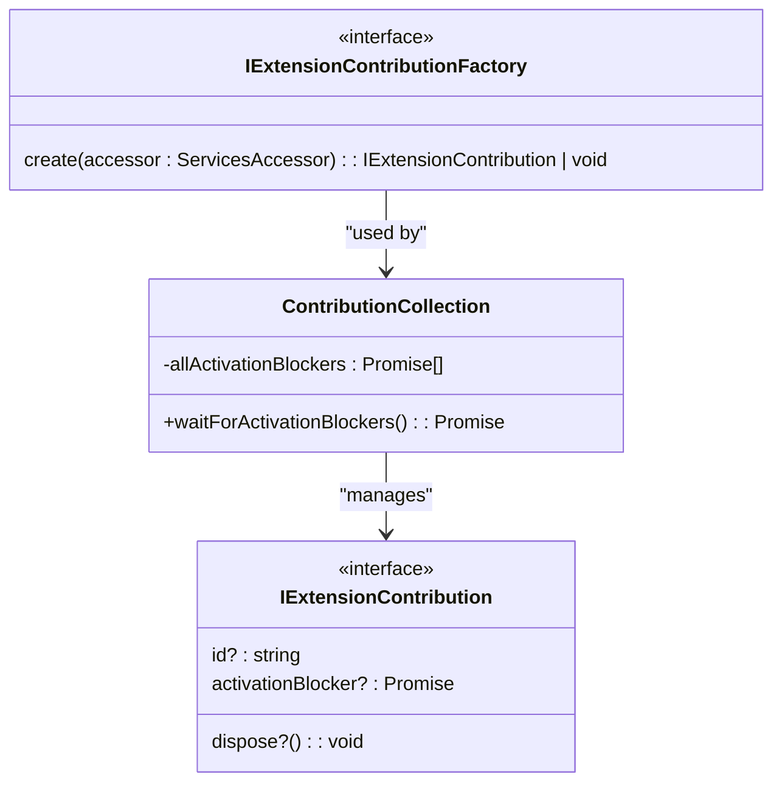

**Diagram sources**
- [contributions.ts](file://src/extension/common/contributions.ts)

**Section sources**
- [contributions.ts](file://src/extension/common/contributions.ts)

### Disposable Pattern for Resource Management
All contributions implement the Disposable pattern to ensure proper resource cleanup and prevent memory leaks. This is particularly important for contributions that register event listeners or maintain state.

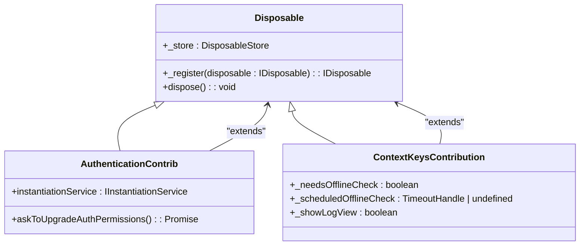

**Diagram sources**
- [authentication.contribution.ts](file://src/extension/authentication/vscode-node/authentication.contribution.ts)
- [contextKeys.contribution.ts](file://src/extension/contextKeys/vscode-node/contextKeys.contribution.ts)

**Section sources**
- [authentication.contribution.ts](file://src/extension/authentication/vscode-node/authentication.contribution.ts)
- [contextKeys.contribution.ts](file://src/extension/contextKeys/vscode-node/contextKeys.contribution.ts)

## Contribution Registration Process

The contribution registration process in vscode-copilot-chat follows a well-defined sequence that ensures contributions are properly initialized and integrated with VS Code's extension host.

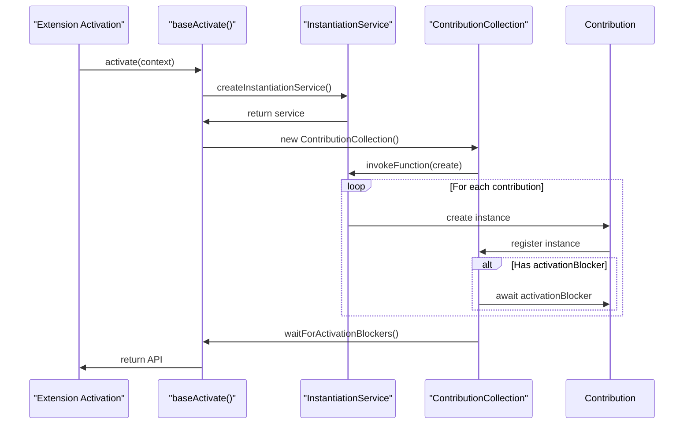

**Diagram sources**
- [extension.ts](file://src/extension/extension/vscode/extension.ts)
- [extension.ts](file://src/extension/extension/vscode-node/extension.ts)

**Section sources**
- [extension.ts](file://src/extension/extension/vscode/extension.ts)
- [extension.ts](file://src/extension/extension/vscode-node/extension.ts)

## Platform-Specific Contribution Variants

The vscode-copilot-chat extension supports multiple runtime environments through a tiered contribution system that separates platform-agnostic and platform-specific functionality.

### Multi-Platform Contribution Strategy
The extension implements a three-tier contribution strategy to maximize code reuse while accommodating platform-specific requirements:

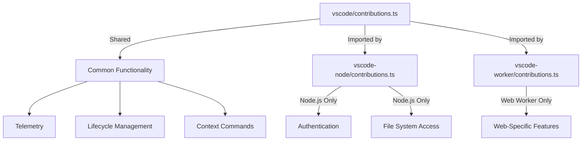

**Diagram sources**
- [contributions.ts](file://src/extension/extension/vscode/contributions.ts)
- [contributions.ts](file://src/extension/extension/vscode-node/contributions.ts)
- [contributions.ts](file://src/extension/extension/vscode-worker/contributions.ts)

**Section sources**
- [contributions.ts](file://src/extension/extension/vscode/contributions.ts)
- [contributions.ts](file://src/extension/extension/vscode-node/contributions.ts)
- [contributions.ts](file://src/extension/extension/vscode-worker/contributions.ts)

### Platform-Specific Implementation Details
The platform-specific contribution files follow a consistent pattern of importing shared contributions and adding platform-specific ones:

```typescript
// vscode-node/contributions.ts
export const vscodeNodeContributions: IExtensionContributionFactory[] = [
    ...vscodeContributions,  // Shared contributions
    asContributionFactory(ConversationFeature),
    asContributionFactory(AuthenticationContrib),
    // ... other node-specific contributions
];
```

This pattern ensures that all shared functionality is available across platforms while allowing for specialized implementations where needed.

## Command Registration Examples

The vscode-copilot-chat extension registers numerous commands through its contribution system, demonstrating various patterns for command implementation.

### Simple Command Registration
Some contributions register simple commands that forward to existing VS Code commands:

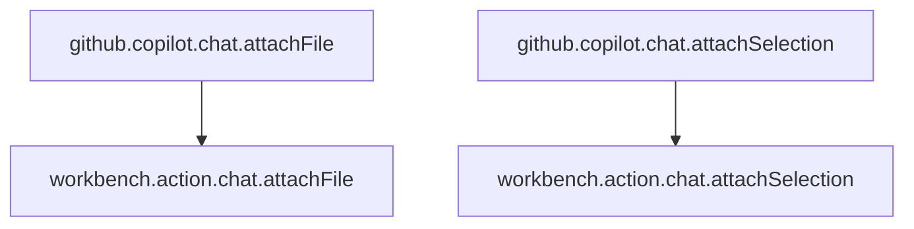

**Diagram sources**
- [context.contribution.ts](file://src/extension/context/vscode/context.contribution.ts)

**Section sources**
- [context.contribution.ts](file://src/extension/context/vscode/context.contribution.ts)

### Complex Command Registration
Other contributions register more complex commands that perform specific actions:

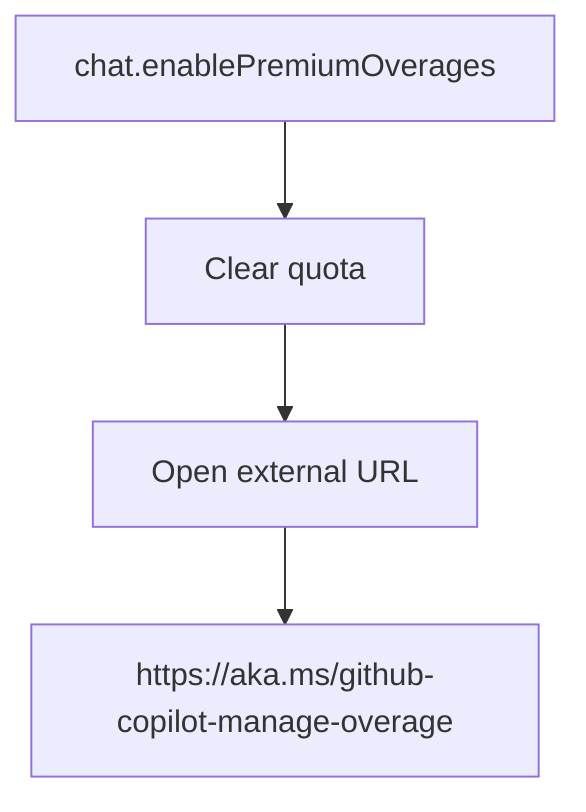

**Diagram sources**
- [chatQuota.contribution.ts](file://src/extension/chat/vscode-node/chatQuota.contribution.ts)

**Section sources**
- [chatQuota.contribution.ts](file://src/extension/chat/vscode-node/chatQuota.contribution.ts)

## Chat Participant Contributions

The contribution system supports chat participant registration, enabling the extension to provide AI-powered chat capabilities within VS Code.

### Chat Feature Registration
The ConversationFeature class is registered as a contribution to enable chat functionality:

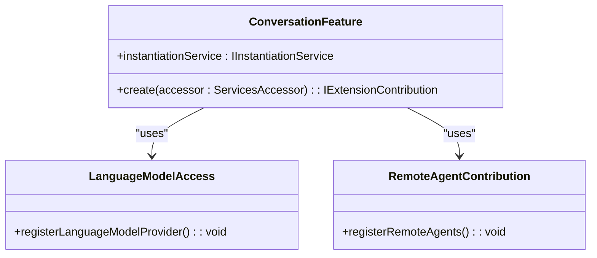

**Diagram sources**
- [contributions.ts](file://src/extension/extension/vscode-node/contributions.ts)

**Section sources**
- [contributions.ts](file://src/extension/extension/vscode-node/contributions.ts)

## Context Provider Setups

The contribution system includes mechanisms for setting up context providers that supply information to the UI and other components.

### Context Key Management
The ContextKeysContribution class manages various context keys that control UI visibility and behavior:

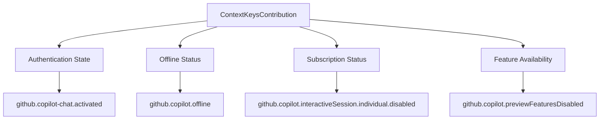

**Diagram sources**
- [contextKeys.contribution.ts](file://src/extension/contextKeys/vscode-node/contextKeys.contribution.ts)

**Section sources**
- [contextKeys.contribution.ts](file://src/extension/contextKeys/vscode-node/contextKeys.contribution.ts)

## Relationship Between package.json and Runtime Contributions

The package.json file defines the extension's contribution points, which are then implemented in the runtime contribution system.

### Declarative vs. Imperative Contributions
The relationship between package.json contributions and runtime implementations follows a clear pattern:

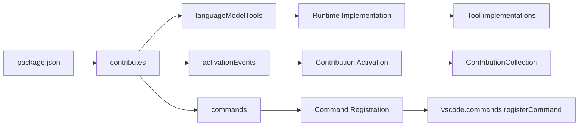

**Diagram sources**
- [package.json](file://package.json)
- [contributions.ts](file://src/extension/common/contributions.ts)

**Section sources**
- [package.json](file://package.json)
- [contributions.ts](file://src/extension/common/contributions.ts)

## Common Issues and Troubleshooting

The contribution system may encounter various issues that affect extension functionality. Understanding these common problems is essential for effective troubleshooting.

### Contribution Conflicts
When multiple contributions attempt to register the same command or context key, conflicts can occur:

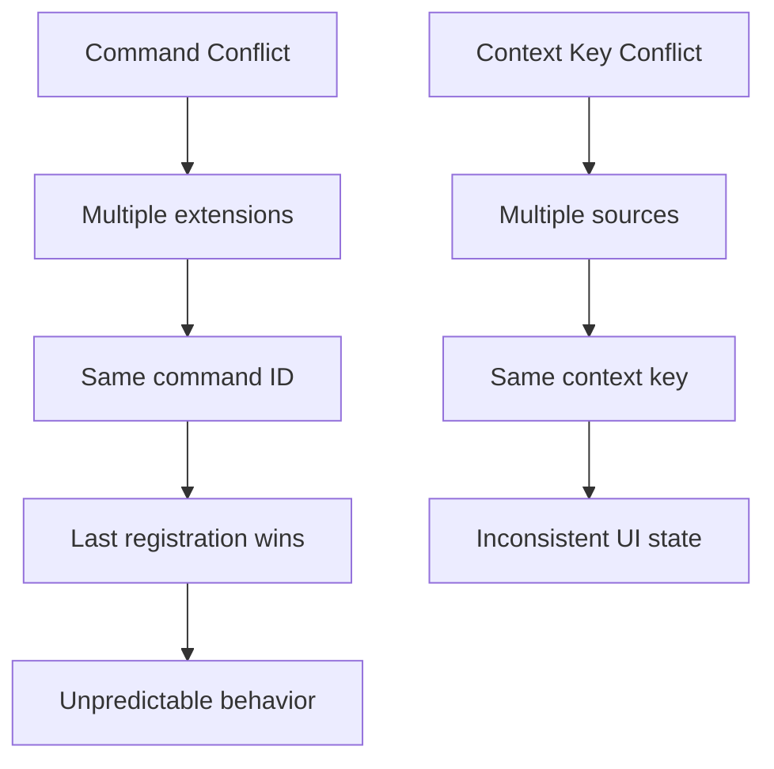

### Registration Failures
Contribution registration can fail due to various reasons:

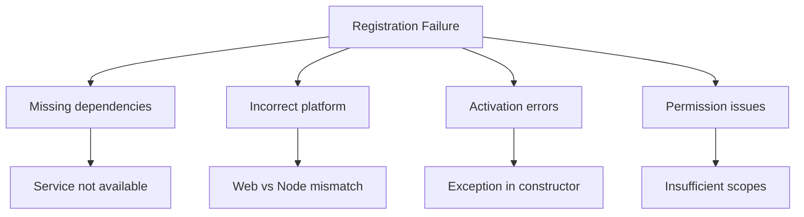

**Section sources**
- [CONTRIBUTING.md](file://CONTRIBUTING.md)
- [extension.ts](file://src/extension/extension/vscode/extension.ts)

## Best Practices for Creating New Contributions

When creating new contributions for the vscode-copilot-chat extension, several best practices should be followed to ensure consistency and maintainability.

### Contribution Design Guidelines
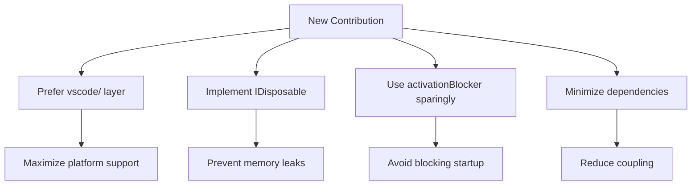

### Implementation Checklist
When implementing a new contribution, consider the following:

1. **Platform Compatibility**: Determine if the contribution can run in all platforms or is platform-specific
2. **Resource Management**: Implement proper disposal of resources and event listeners
3. **Error Handling**: Handle errors gracefully and provide meaningful error messages
4. **Performance Impact**: Minimize startup impact and avoid blocking operations
5. **Testing**: Ensure the contribution is properly tested across relevant platforms

**Section sources**
- [CONTRIBUTING.md](file://CONTRIBUTING.md)
- [contributions.ts](file://src/extension/common/contributions.ts)

## Performance Considerations

The contribution system has several performance implications that should be considered when designing and implementing contributions.

### Activation Impact
Contributions can significantly impact extension activation time, especially when they use activationBlocker:

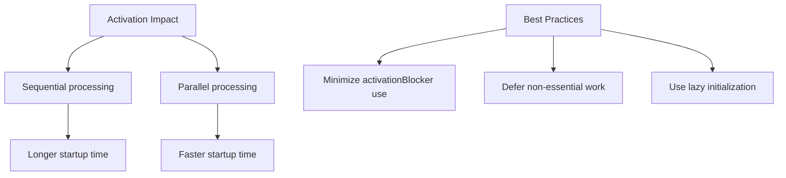

### Memory Usage
Improperly managed contributions can lead to memory leaks:

```mermaid
flowchart TD
A[Memory Management] --> B[Proper disposal]
A --> C[Event listener cleanup]
A --> D[Reference tracking]
B --> E[Implement dispose()]
C --> F[Use _register()]
D --> G[Use DisposableStore]
```

**Section sources**
- [contributions.ts](file://src/extension/common/contributions.ts)
- [extension.ts](file://src/extension/extension/vscode/extension.ts)