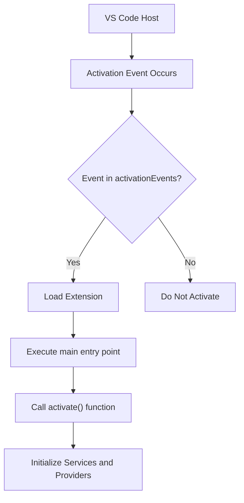
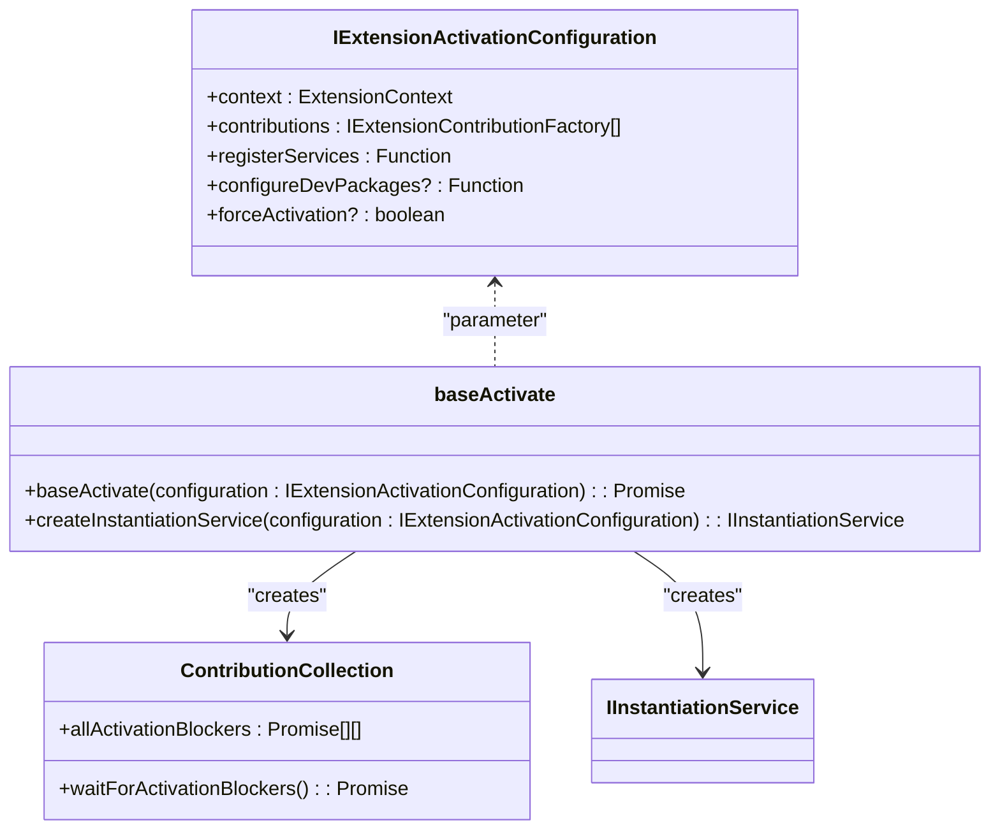
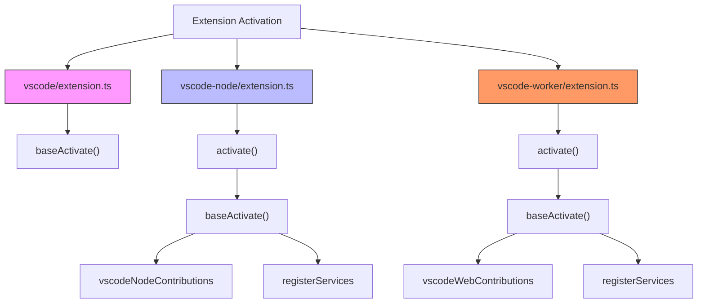
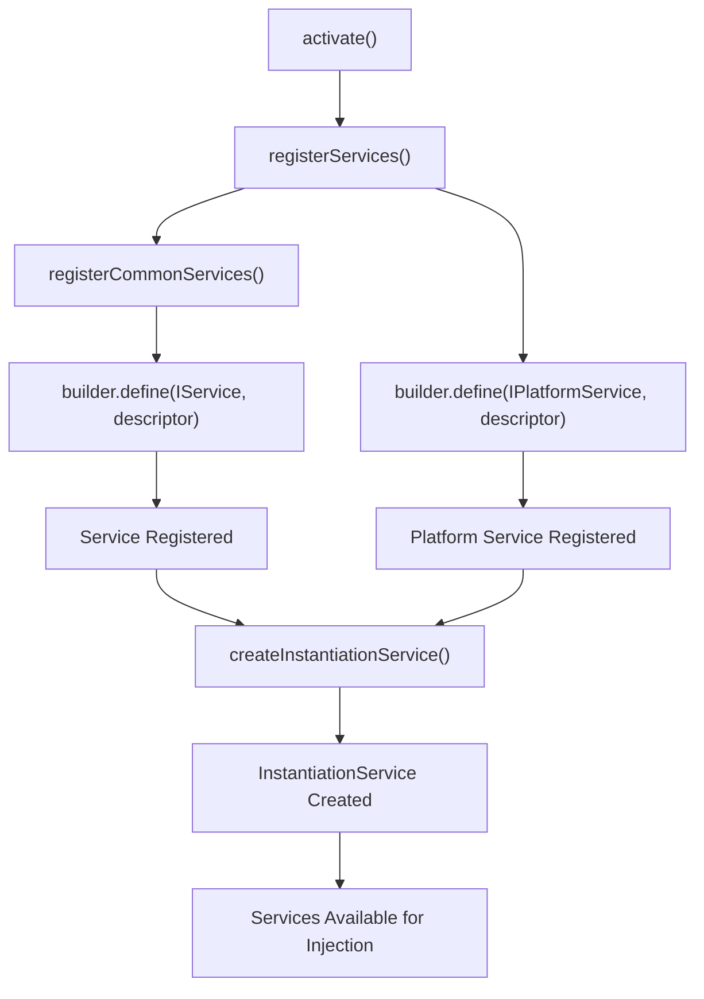
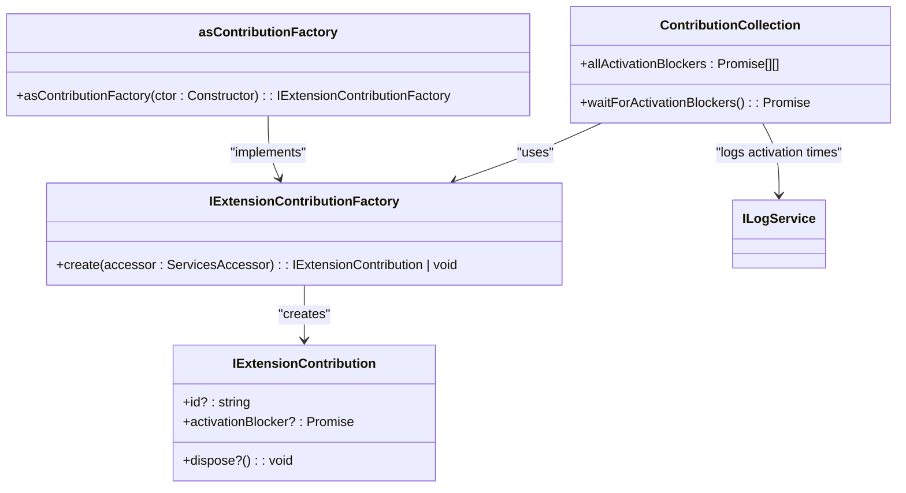

# Extension Activation

<cite>
**Referenced Files in This Document**   
- [extension.ts](file://src/extension/extension/vscode/extension.ts)
- [extension.ts](file://src/extension/extension/vscode-node/extension.ts)
- [extension.ts](file://src/extension/extension/vscode-worker/extension.ts)
- [package.json](file://package.json)
- [contributions.ts](file://src/extension/common/contributions.ts)
- [services.ts](file://src/extension/extension/vscode/services.ts)
- [services.ts](file://src/extension/extension/vscode-node/services.ts)
- [lifecycleTelemetryContrib.ts](file://src/extension/telemetry/common/lifecycleTelemetryContrib.ts)
</cite>

## Table of Contents
1. [Introduction](#introduction)
2. [Activation Events and package.json Configuration](#activation-events-and-packagejson-configuration)
3. [Core Activation Architecture](#core-activation-architecture)
4. [Platform-Specific Activation Variants](#platform-specific-activation-variants)
5. [Service Registration and Dependency Injection](#service-registration-and-dependency-injection)
6. [Contribution System and Extension Initialization](#contribution-system-and-extension-initialization)
7. [Error Handling and Activation Failures](#error-handling-and-activation-failures)
8. [Extending the Activation Process](#extending-the-activation-process)
9. [Common Activation Issues and Troubleshooting](#common-activation-issues-and-troubleshooting)

## Introduction
The Extension Activation process in vscode-copilot-chat is a sophisticated multi-platform initialization system designed to handle the activation of the Copilot Chat extension across different execution contexts within Visual Studio Code. The activation lifecycle is carefully orchestrated to initialize services, register providers, and set up event listeners in a way that supports both node.js and web worker execution environments. The system employs a layered architecture with shared code for common functionality and platform-specific implementations for environment-dependent features. This documentation provides a comprehensive analysis of the activation process, detailing how the `activate()` functions initialize the extension across different contexts and how the various `extension.ts` files coordinate to create a robust and extensible activation framework.

**Section sources**
- [extension.ts](file://src/extension/extension/vscode/extension.ts#L1-L108)
- [extension.ts](file://src/extension/extension/vscode-node/extension.ts#L1-L44)
- [extension.ts](file://src/extension/extension/vscode-worker/extension.ts#L1-L27)

## Activation Events and package.json Configuration
The activation of the vscode-copilot-chat extension is triggered by specific events defined in the package.json file. These activation events determine when the extension should be loaded and initialized by the VS Code host environment. The extension responds to several activation events including "onStartupFinished", "onLanguageModelChat:copilot", "onUri", "onFileSystem:ccreq", "onFileSystem:ccsettings", and "onCustomAgentsProvider". This configuration ensures that the extension activates at appropriate times, such as when VS Code has finished starting up or when specific language model chat functionality is requested. The activation events are carefully chosen to balance prompt responsiveness with resource efficiency, preventing unnecessary activation while ensuring the extension is available when needed. The main entry point for the extension is specified in the "main" field, which points to "./dist/extension", indicating the compiled output directory for the extension code.

**Diagram sources **
- [package.json](file://package.json#L81-L88)
- [extension.ts](file://src/extension/extension/vscode/extension.ts#L35-L39)

## Core Activation Architecture
The core activation architecture of vscode-copilot-chat is built around a shared activation framework that supports multiple execution contexts. At the heart of this system is the `baseActivate` function defined in the vscode/extension.ts file, which serves as the common entry point for all platform variants. This function accepts a configuration object containing the extension context, contribution factories, service registration function, and optional configuration for development packages. The architecture follows a layered approach where platform-agnostic code is centralized in the vscode directory, while platform-specific implementations are isolated in vscode-node and vscode-worker directories. The activation process begins with environment checks, including validation of the extension mode (production, development, or test) and verification of the VS Code version. If running in test mode without forced activation, the process may exit early to avoid unnecessary initialization. The core activation flow then proceeds to create an instantiation service, initialize contributions, and wait for any activation blockers before completing the process.

**Diagram sources **
- [extension.ts](file://src/extension/extension/vscode/extension.ts#L25-L33)
- [contributions.ts](file://src/extension/common/contributions.ts#L11-L25)

## Platform-Specific Activation Variants
The vscode-copilot-chat extension implements three distinct activation variants to support different execution contexts within VS Code: the standard vscode variant, the vscode-node variant for node.js execution, and the vscode-worker variant for web worker execution. Each variant has its own extension.ts file that exports an activate function tailored to its specific environment. The vscode-node variant, located in src/extension/extension/vscode-node/extension.ts, extends the base activation by including node-specific configuration such as source map support and environment variable loading through dotenv. It calls the shared baseActivate function with platform-specific contributions (vscodeNodeContributions) and services (registerServices). Similarly, the vscode-worker variant in src/extension/extension/vscode-worker/extension.ts follows the same pattern but uses web-specific contributions (vscodeWebContributions) and services. This architecture allows for code reuse while accommodating platform-specific requirements, ensuring that each execution context receives the appropriate initialization sequence and dependencies.

**Diagram sources **
- [extension.ts](file://src/extension/extension/vscode-node/extension.ts#L35-L43)
- [extension.ts](file://src/extension/extension/vscode-worker/extension.ts#L19-L26)
- [extension.ts](file://src/extension/extension/vscode/extension.ts#L33-L39)

## Service Registration and Dependency Injection
The service registration and dependency injection system in vscode-copilot-chat is implemented through a builder pattern that allows for flexible and extensible service initialization. The core mechanism revolves around the IInstantiationServiceBuilder interface, which provides a define method for registering services with various instantiation strategies. In the shared vscode/services.ts file, services that are common to all platforms are registered, such as configuration, logging, and workspace services. Platform-specific services are then registered in their respective service files (vscode-node/services.ts and vscode-worker/services.ts) by first calling the shared registration function and then adding environment-specific services. The registration process uses SyncDescriptor objects to specify how services should be instantiated, allowing for both singleton instances and factory-created instances. This approach enables lazy initialization of services while maintaining type safety and dependency resolution. The system also handles conditional registration based on the extension mode (production, development, or test), ensuring that appropriate implementations are used in each context.

**Diagram sources **
- [services.ts](file://src/extension/extension/vscode/services.ts#L111-L177)
- [services.ts](file://src/extension/extension/vscode-node/services.ts#L119-L236)
- [extension.ts](file://src/extension/extension/vscode/extension.ts#L92-L107)

## Contribution System and Extension Initialization
The contribution system in vscode-copilot-chat provides a modular approach to extension initialization, allowing various components to participate in the activation process without creating tight coupling. Contributions are defined as classes that implement the IExtensionContribution interface, which may include an activationBlocker promise to delay completion of the activation process until certain conditions are met. The ContributionCollection class is responsible for creating and managing these contributions, iterating through an array of contribution factories and instantiating each contribution using the dependency injection system. The contribution factories, created using the asContributionFactory helper function, wrap constructor functions and enable dependency resolution during instantiation. Platform-specific contributions are organized in their respective directories (vscode-node/contributions.ts and vscode-worker/contributions.ts) and typically include both shared contributions from the vscode directory and platform-specific ones. This system allows for fine-grained control over the activation sequence, with certain contributions able to block activation until they complete their initialization tasks, ensuring that critical components are ready before the extension becomes fully operational.

**Diagram sources **
- [contributions.ts](file://src/extension/common/contributions.ts#L11-L78)
- [contributions.ts](file://src/extension/extension/vscode-node/contributions.ts#L63-L124)
- [extension.ts](file://src/extension/extension/vscode/extension.ts#L72-L75)

## Error Handling and Activation Failures
The vscode-copilot-chat extension implements comprehensive error handling mechanisms to manage activation failures and ensure graceful degradation when issues occur. The ContributionCollection class includes try-catch blocks around the creation of each contribution, logging any errors that occur during initialization while allowing the activation process to continue with other contributions. This prevents a single failing component from blocking the entire extension activation. The system also handles activation blockers, which are promises that can delay the completion of activation, by wrapping them in a finally block that logs the duration of the blocking operation for performance monitoring. In the service registration layer, conditional logic based on the extension mode (test, development, production) ensures that appropriate service implementations are used, with null or mock implementations provided in test environments to prevent external dependencies from causing failures. The base activation function also includes early exit conditions for test environments, preventing unnecessary initialization that could lead to errors. Additionally, telemetry is integrated throughout the activation process, with the LifecycleTelemetryContrib class sending activation and deactivation events to monitor extension lifecycle and diagnose activation issues.

**Section sources**
- [contributions.ts](file://src/extension/common/contributions.ts#L54-L70)
- [extension.ts](file://src/extension/extension/vscode/extension.ts#L35-L38)
- [lifecycleTelemetryContrib.ts](file://src/extension/telemetry/common/lifecycleTelemetryContrib.ts#L9-L18)

## Extending the Activation Process
Extending the activation process in vscode-copilot-chat follows a well-defined pattern that maintains the separation of concerns between platform-agnostic and platform-specific code. To add new functionality, developers should first determine whether the feature is platform-independent or requires platform-specific implementation. For platform-agnostic features, new services should be registered in the shared vscode/services.ts file, and new contributions should be added to the vscode/contributions.ts file. For platform-specific features, the appropriate platform directory (vscode-node or vscode-worker) should be used, with new service registrations added to the respective services.ts file and new contributions added to the contributions.ts file. When creating new contributions, the asContributionFactory helper function should be used to wrap the constructor, ensuring proper dependency injection. If the new component needs to delay activation completion, it can expose an activationBlocker promise that resolves when initialization is complete. The modular contribution system makes it easy to add new functionality without modifying existing code, promoting maintainability and reducing the risk of introducing bugs.

**Section sources**
- [services.ts](file://src/extension/extension/vscode/services.ts#L111-L177)
- [services.ts](file://src/extension/extension/vscode-node/services.ts#L119-L236)
- [contributions.ts](file://src/extension/extension/vscode/contributions.ts#L20-L28)
- [contributions.ts](file://src/extension/extension/vscode-node/contributions.ts#L63-L124)

## Common Activation Issues and Troubleshooting
Common activation issues in vscode-copilot-chat typically fall into several categories: activation timeouts, dependency loading failures, and context-specific initialization requirements. Activation timeouts can occur when contribution activationBlocker promises take too long to resolve, which can be diagnosed by examining the logged duration of activation blockers. Dependency loading failures may happen when required npm packages are not properly installed or when there are version conflicts, which can be mitigated by ensuring the development environment is correctly configured with source map support and environment variables. Context-specific initialization issues can arise when platform-specific code is executed in the wrong context, which is prevented by the architectural separation between vscode, vscode-node, and vscode-worker variants. To troubleshoot activation problems, developers should first check the VS Code developer console for error messages, verify that all required dependencies are installed, and ensure that the extension is being activated by the expected events. The comprehensive telemetry system, including the LifecycleTelemetryContrib class, provides valuable insights into activation success and failure patterns, helping to identify and resolve issues quickly.

**Section sources**
- [extension.ts](file://src/extension/extension/vscode/extension.ts#L35-L38)
- [extension.ts](file://src/extension/extension/vscode-node/extension.ts#L23-L32)
- [contributions.ts](file://src/extension/common/contributions.ts#L60-L66)
- [lifecycleTelemetryContrib.ts](file://src/extension/telemetry/common/lifecycleTelemetryContrib.ts#L9-L18)