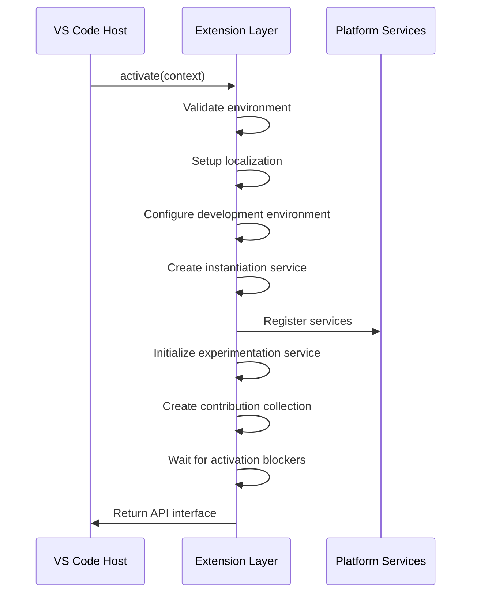
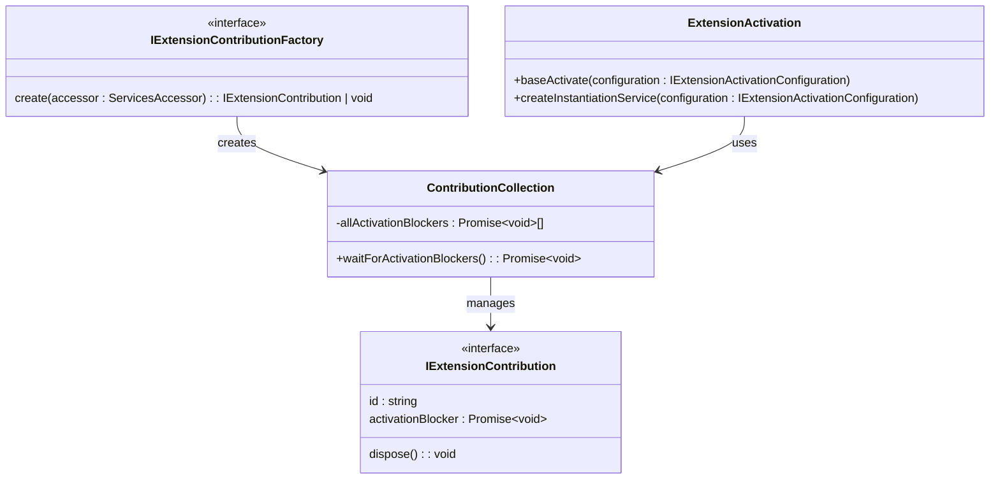
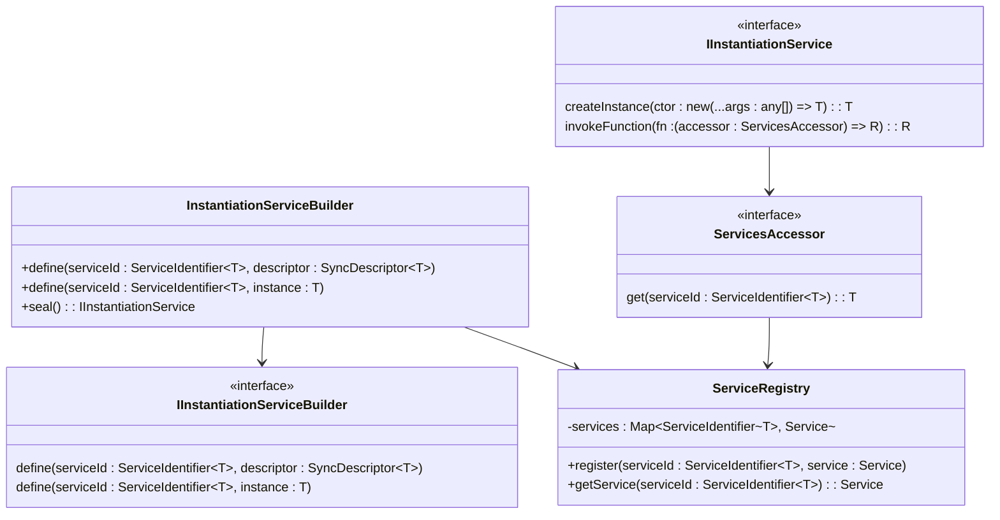
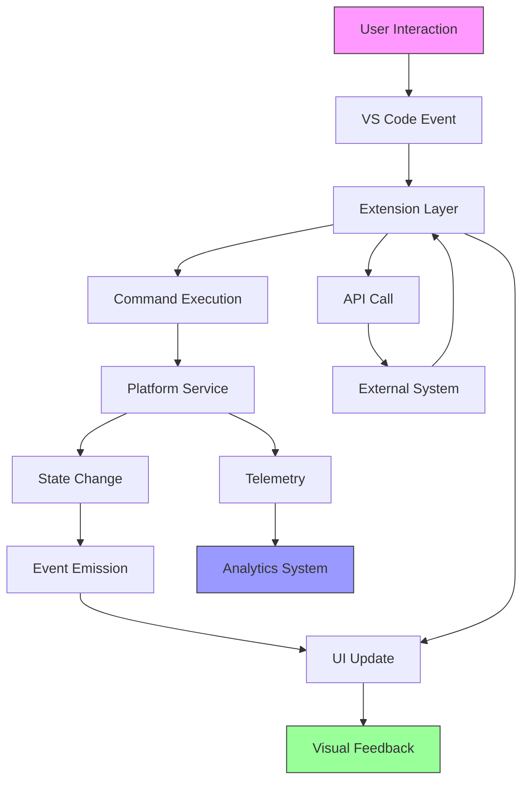
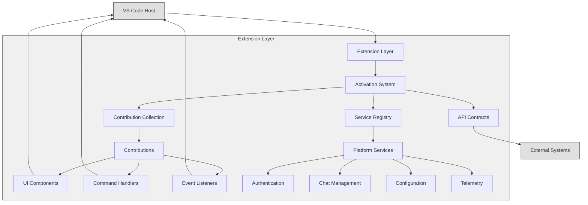

# Extension Layer

<cite>
**Referenced Files in This Document**   
- [extension.ts](file://src/extension/extension/vscode/extension.ts)
- [extension.ts](file://src/extension/extension/vscode-node/extension.ts)
- [extension.ts](file://src/extension/extension/vscode-worker/extension.ts)
- [contributions.ts](file://src/extension/extension/vscode/contributions.ts)
- [contributions.ts](file://src/extension/extension/vscode-node/contributions.ts)
- [contributions.ts](file://src/extension/extension/vscode-worker/contributions.ts)
- [services.ts](file://src/extension/extension/vscode/services.ts)
- [services.ts](file://src/extension/extension/vscode-node/services.ts)
- [services.ts](file://src/extension/extension/vscode-worker/services.ts)
- [extensionApi.ts](file://src/extension/api/vscode/extensionApi.ts)
- [vscodeContextProviderApi.ts](file://src/extension/api/vscode/vscodeContextProviderApi.ts)
- [contributions.ts](file://src/extension/common/contributions.ts)
</cite>

## Table of Contents
1. [Introduction](#introduction)
2. [Extension Lifecycle and Activation](#extension-lifecycle-and-activation)
3. [Contribution System](#contribution-system)
4. [API Contracts](#api-contracts)
5. [Service Registration and Dependency Injection](#service-registration-and-dependency-injection)
6. [Extension Variants](#extension-variants)
7. [UI and VS Code Integration](#ui-and-vs-code-integration)
8. [Event Flow and Communication](#event-flow-and-communication)
9. [Architecture Overview](#architecture-overview)
10. [Conclusion](#conclusion)

## Introduction

The Extension Layer in vscode-copilot-chat serves as the UI and VS Code integration layer, responsible for user interaction, command handling, and chat interface presentation. This layer acts as the bridge between the VS Code host environment and the underlying platform services, managing the extension's lifecycle, user interface components, and integration with VS Code's API.

The architecture follows a layered approach with clear separation between UI components and business logic. The extension layer consumes platform layer services while providing APIs for external systems to interact with the Copilot functionality. This documentation details the extension activation system, contribution registration, API contracts, and the structure of different extension variants for various execution contexts.

**Section sources**
- [extension.ts](file://src/extension/extension/vscode/extension.ts#L1-L108)

## Extension Lifecycle and Activation

The extension activation process is centralized in the `extension.ts` files across different execution contexts. The activation system follows a hierarchical approach with shared code for common functionality and specific implementations for different runtime environments.

The core activation logic is implemented in `src/extension/extension/vscode/extension.ts` through the `baseActivate` function, which handles the common activation workflow for all extension variants. This function performs several key operations:

1. Environment validation to ensure compatibility with the current VS Code version
2. Localization setup using the VS Code l10n API
3. Development environment configuration for non-production builds
4. Instantiation service creation and service registration
5. Experimentation service initialization
6. Contribution collection and activation blocker handling

The activation process is designed to be extensible, allowing different extension variants to provide their own configuration while sharing the core activation logic. The `IExtensionActivationConfiguration` interface defines the configuration contract that includes the extension context, contribution factories, service registration function, and optional configuration for development packages.



**Diagram sources**
- [extension.ts](file://src/extension/extension/vscode/extension.ts#L33-L90)

**Section sources**
- [extension.ts](file://src/extension/extension/vscode/extension.ts#L25-L90)

## Contribution System

The contribution system in vscode-copilot-chat is a key architectural component that enables modular extension functionality. Contributions are discrete units of functionality that can be registered during extension activation and participate in the extension's lifecycle.

The system is defined by two main interfaces in `src/extension/common/contributions.ts`:
- `IExtensionContribution`: Represents a contribution with optional dispose method and activation blocker
- `IExtensionContributionFactory`: Factory interface for creating contributions

The `ContributionCollection` class manages the lifecycle of all registered contributions, handling their creation, disposal, and activation blocking. Contributions can specify an `activationBlocker` promise that delays the completion of the extension activation process, allowing critical functionality to initialize before the extension is considered active.

Different extension variants register their contributions through specific contribution files:
- `vscode-node/contributions.ts`: Registers node.js-specific contributions
- `vscode-worker/contributions.ts`: Registers web worker-specific contributions
- `vscode/contributions.ts`: Registers contributions that work in both environments

The contribution system follows the principle of preferring shared contributions in the vscode directory to maximize code reuse across execution contexts.



**Diagram sources**
- [contributions.ts](file://src/extension/common/contributions.ts#L11-L78)
- [extension.ts](file://src/extension/extension/vscode/extension.ts#L33-L90)

**Section sources**
- [contributions.ts](file://src/extension/common/contributions.ts#L11-L78)

## API Contracts

The Extension Layer defines several API contracts that enable communication between the extension and external systems. These APIs are exposed through the extension's activation function and provide controlled access to Copilot functionality.

The primary API contract is defined in `src/extension/api/vscode/extensionApi.ts` through the `CopilotExtensionApi` class, which implements the `ICopilotExtensionApi` interface. This API provides two main capabilities:

1. **Scope Selection**: The `selectScope` method allows external callers to trigger scope selection in the active editor, with optional reasoning for the selection.
2. **Context Provider Access**: The `getContextProviderAPI` method provides access to context provider functionality for different API versions.

The context provider API is further specialized in `src/extension/api/vscode/vscodeContextProviderApi.ts` through the `VSCodeContextProviderApiV1` class, which implements the `Copilot.ContextProviderApiV1` interface. This API allows registration of context providers that can contribute contextual information to Copilot's responses.

These API contracts follow a versioning strategy to ensure backward compatibility while allowing for future extensions. The version is exposed as a static property on the API class, enabling callers to verify compatibility before using the API.

```mermaid
classDiagram
class ICopilotExtensionApi {
<<interface>>
selectScope(editor? : TextEditor, options? : { reason? : string }) : Promise~Selection | undefined~
getContextProviderAPI(version : 'v1') : Copilot.ContextProviderApiV1
}
class CopilotExtensionApi {
+static version : number
-_scopeSelector : IScopeSelector
-_languageContextProviderService : ILanguageContextProviderService
+selectScope(editor? : TextEditor, options? : { reason? : string }) : Promise~Selection | undefined~
+getContextProviderAPI(version : 'v1') : Copilot.ContextProviderApiV1
}
class VSCodeContextProviderApiV1 {
-contextProviderService : ILanguageContextProviderService
+registerContextProvider(provider : Copilot.ContextProvider~T~) : Disposable
}
class Copilot {
<<interface>>
ContextProviderApiV1
SupportedContextItem
ContextProvider~T~
}
ICopilotExtensionApi <|-- CopilotExtensionApi
CopilotExtensionApi --> VSCodeContextProviderApiV1
VSCodeContextProviderApiV1 --> Copilot
```

**Diagram sources**
- [extensionApi.ts](file://src/extension/api/vscode/extensionApi.ts#L13-L32)
- [vscodeContextProviderApi.ts](file://src/extension/api/vscode/vscodeContextProviderApi.ts#L11-L22)

**Section sources**
- [extensionApi.ts](file://src/extension/api/vscode/extensionApi.ts#L13-L32)
- [vscodeContextProviderApi.ts](file://src/extension/api/vscode/vscodeContextProviderApi.ts#L11-L22)

## Service Registration and Dependency Injection

The Extension Layer implements a comprehensive service registration and dependency injection system that enables loose coupling between components. This system is based on VS Code's instantiation service pattern and provides a centralized way to manage dependencies across the extension.

Service registration is handled through the `registerServices` function in the `services.ts` files for each execution context. The core services are registered in `src/extension/extension/vscode/services.ts`, which contains services that can run in both web and node.js environments. This file follows the principle of preferring shared services to maximize code reuse.

The service registration process uses an `IInstantiationServiceBuilder` to define services with their dependencies. Services are registered with specific lifecycles:
- **Singleton services**: Created once and shared across the extension
- **Transient services**: Created each time they are requested
- **Instance services**: Pre-created instances registered with the container

Key service categories registered by the extension include:
- Authentication and token management
- Chat session and conversation management
- Configuration and settings
- File system and workspace operations
- Git and source control integration
- Telemetry and analytics
- Testing and simulation

The dependency injection system enables clean separation of concerns, with UI components depending on abstract service interfaces rather than concrete implementations. This allows for easier testing and flexibility in implementation.



**Diagram sources**
- [services.ts](file://src/extension/extension/vscode/services.ts#L111-L176)

**Section sources**
- [services.ts](file://src/extension/extension/vscode/services.ts#L111-L176)

## Extension Variants

The vscode-copilot-chat extension is designed to run in multiple execution contexts, with specialized variants for different environments. This multi-variant architecture allows the extension to leverage the capabilities of each execution context while maintaining a shared codebase.

There are three main extension variants:

1. **vscode-node**: Runs in the node.js extension host, providing access to both VS Code APIs and Node.js runtime capabilities. This variant is located in `src/extension/extension/vscode-node/` and includes contributions and services that require Node.js functionality.

2. **vscode-worker**: Runs in the web worker extension host, providing access to VS Code APIs and Web Worker capabilities. This variant is located in `src/extension/extension/vscode-worker/` and is optimized for web environments.

3. **vscode**: Contains shared code that runs in both node.js and web worker extension hosts. This variant is located in `src/extension/extension/vscode/` and contains the core activation logic, services, and contributions that are environment-agnostic.

Each variant follows a consistent pattern:
- **extension.ts**: Entry point that delegates to the shared `baseActivate` function with variant-specific configuration
- **contributions.ts**: Registration of variant-specific contributions
- **services.ts**: Registration of variant-specific services

The architecture prioritizes code sharing by encouraging contributions and services to be implemented in the shared `vscode` directory whenever possible. This reduces duplication and ensures consistent behavior across execution contexts.

```mermaid
graph TD
A[Extension Variants] --> B[vscode-node]
A --> C[vscode-worker]
A --> D[vscode]
B --> B1[extension.ts]
B --> B2[contributions.ts]
B --> B3[services.ts]
C --> C1[extension.ts]
C --> C2[contributions.ts]
C --> C3[services.ts]
D --> D1[extension.ts]
D --> D2[contributions.ts]
D --> D3[services.ts]
D1 --> E[baseActivate]
B1 --> E
C1 --> E
E --> F[ContributionCollection]
F --> G[IExtensionContribution]
F --> H[IExtensionContributionFactory]
style D fill:#f0f0f0,stroke:#333
style B fill:#e0f0e0,stroke:#333
style C fill:#e0e0f0,stroke:#333
note right of D
Shared code for all variants
Preferred location for new features
end
note right of B
Node.js-specific functionality
Access to file system, child processes
end
note right of C
Web worker-specific functionality
Optimized for browser environments
end
```

**Diagram sources**
- [extension.ts](file://src/extension/extension/vscode/extension.ts#L1-L108)
- [extension.ts](file://src/extension/extension/vscode-node/extension.ts#L1-L44)
- [extension.ts](file://src/extension/extension/vscode-worker/extension.ts#L1-L27)

**Section sources**
- [extension.ts](file://src/extension/extension/vscode-node/extension.ts#L1-L44)
- [extension.ts](file://src/extension/extension/vscode-worker/extension.ts#L1-L27)

## UI and VS Code Integration

The Extension Layer provides comprehensive integration with the VS Code user interface, managing the presentation of the chat interface and handling user interactions. This integration is achieved through several key mechanisms:

1. **Command Registration**: The extension registers VS Code commands that can be invoked through the command palette, keyboard shortcuts, or UI elements. These commands are implemented as contributions and handle user actions like starting a chat session or selecting code scope.

2. **View Contributions**: The extension contributes to VS Code's view system, adding chat panels and other UI components to the interface. These views are managed through the contribution system and can be dynamically shown or hidden based on user preferences.

3. **Context Key Management**: The extension uses VS Code's context key system to control the visibility and enablement of UI elements based on the current state. For example, certain commands may only be available when a chat session is active.

4. **Editor Integration**: The extension integrates with the VS Code editor to provide inline chat functionality, code selection tools, and other editor-specific features. This integration is facilitated through VS Code's proposed API extensions.

5. **Event Handling**: The extension listens to VS Code events such as editor changes, file operations, and workspace modifications to keep the UI synchronized with the current state.

The UI components are kept separate from business logic, with the extension layer acting as an adapter between the VS Code UI and the underlying platform services. This separation allows for easier maintenance and testing of the UI components.

**Section sources**
- [contributions.ts](file://src/extension/extension/vscode-node/contributions.ts#L63-L123)

## Event Flow and Communication

The Extension Layer manages a complex event flow between the VS Code host, extension UI components, and platform services. This communication architecture ensures that user actions are properly handled and that state changes are propagated throughout the system.

The event flow follows a unidirectional pattern:
1. User interactions in the VS Code UI trigger events
2. The extension layer captures these events and translates them into service calls
3. Platform services process the requests and may emit state changes
4. The extension layer updates the UI components to reflect the new state

Key communication patterns include:
- **Command Pattern**: User actions are encapsulated as commands that are executed by the extension layer
- **Observer Pattern**: Components subscribe to state changes in services and update accordingly
- **Dependency Injection**: Services are injected into components, providing a clean interface for communication
- **Event Emission**: Services emit events when their state changes, allowing interested components to react

The extension layer also handles communication with external systems through the defined API contracts, allowing other extensions or tools to interact with Copilot functionality in a controlled manner.



**Diagram sources**
- [extension.ts](file://src/extension/extension/vscode/extension.ts#L33-L90)
- [contributions.ts](file://src/extension/extension/vscode-node/contributions.ts#L63-L123)

**Section sources**
- [extension.ts](file://src/extension/extension/vscode/extension.ts#L33-L90)

## Architecture Overview

The Extension Layer architecture in vscode-copilot-chat follows a layered, modular design that separates concerns and enables extensibility. The architecture can be visualized as a hierarchy of components with well-defined responsibilities and interfaces.

At the core is the activation system, which initializes the extension and coordinates the startup of all components. This system delegates to the contribution collection, which manages the lifecycle of individual functionality units. Services are registered through a dependency injection container, enabling loose coupling between components.

The architecture emphasizes code sharing across execution contexts, with a clear hierarchy:
- **Shared components** (vscode): Functionality that works in all environments
- **Node.js components** (vscode-node): Functionality requiring Node.js capabilities
- **Web worker components** (vscode-worker): Functionality optimized for web environments

API contracts provide controlled access to extension functionality, while the contribution system enables modular extension of capabilities. The separation between UI components and business logic ensures maintainability and testability.



**Diagram sources**
- [extension.ts](file://src/extension/extension/vscode/extension.ts#L1-L108)
- [contributions.ts](file://src/extension/common/contributions.ts#L11-L78)
- [services.ts](file://src/extension/extension/vscode/services.ts#L111-L176)

**Section sources**
- [extension.ts](file://src/extension/extension/vscode/extension.ts#L1-L108)

## Conclusion

The Extension Layer in vscode-copilot-chat provides a robust foundation for integrating Copilot functionality into VS Code. Through a well-designed activation system, modular contribution architecture, and clear API contracts, the extension layer effectively bridges the gap between the VS Code host environment and the underlying platform services.

The architecture's emphasis on code sharing across execution contexts ensures consistency while allowing for environment-specific optimizations. The separation of UI components from business logic promotes maintainability and testability, while the dependency injection system enables loose coupling between components.

By following established patterns from VS Code's extension ecosystem, the Extension Layer provides a familiar development experience for contributors while delivering a seamless user experience. The comprehensive event flow and communication architecture ensure that user interactions are properly handled and that the UI remains synchronized with the application state.

This architectural approach enables the extension to evolve over time, with new features being added through the contribution system without disrupting existing functionality. The versioned API contracts provide stability for external integrations while allowing for controlled evolution of capabilities.