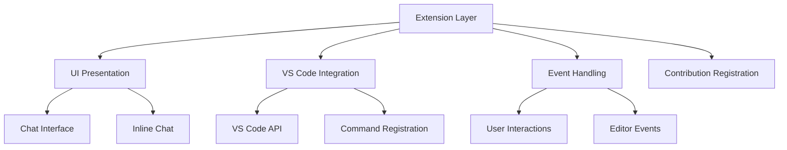
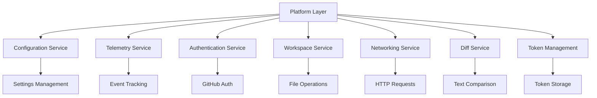
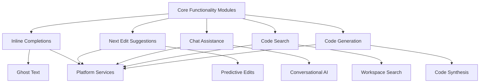
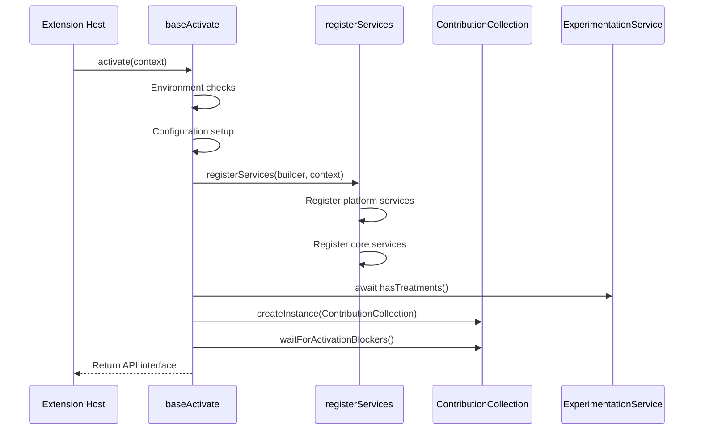
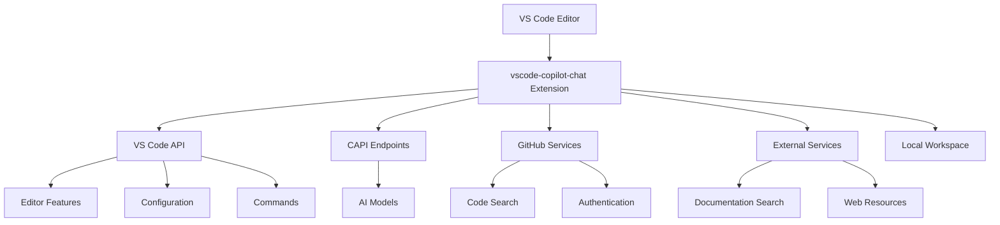

# High-Level Architecture

<cite>
**Referenced Files in This Document**   
- [package.json](file://package.json)
- [README.md](file://README.md)
- [src/extension/extension/vscode/extension.ts](file://src/extension/extension/vscode/extension.ts)
- [src/extension/extension/vscode-node/extension.ts](file://src/extension/extension/vscode-node/extension.ts)
- [src/extension/extension/vscode-node/services.ts](file://src/extension/extension/vscode-node/services.ts)
- [src/platform/configuration/common/configurationService.ts](file://src/platform/configuration/common/configurationService.ts)
- [src/platform/telemetry/common/telemetry.ts](file://src/platform/telemetry/common/telemetry.ts)
- [src/platform/workspace/common/workspaceService.ts](file://src/platform/workspace/common/workspaceService.ts)
- [src/platform/authentication/common/authentication.ts](file://src/platform/authentication/common/authentication.ts)
- [src/lib/node/chatLibMain.ts](file://src/lib/node/chatLibMain.ts)
</cite>

## Table of Contents
1. [Introduction](#introduction)
2. [Three-Tier Modular Structure](#three-tier-modular-structure)
3. [Extension Layer (UI and VS Code Integration)](#extension-layer-ui-and-vs-code-integration)
4. [Platform Layer (Shared Services)](#platform-layer-shared-services)
5. [Core Functionality Modules](#core-functionality-modules)
6. [Extension Activation System](#extension-activation-system)
7. [System Context Diagram](#system-context-diagram)
8. [Technology Choices](#technology-choices)
9. [Conclusion](#conclusion)

## Introduction
The vscode-copilot-chat extension implements a sophisticated three-tier modular architecture designed to provide AI-powered coding assistance within the Visual Studio Code environment. This architecture separates concerns into distinct layers: the extension layer responsible for UI and VS Code integration, the platform layer providing shared services, and core functionality modules handling specific AI capabilities. The system leverages TypeScript and Node.js technologies while maintaining strict separation between UI presentation, business logic, and data access layers. This documentation provides a comprehensive overview of the high-level architecture, detailing component interactions, service initialization, and technology choices that enable the extension's advanced AI features.

## Three-Tier Modular Structure
The vscode-copilot-chat extension follows a well-defined three-tier modular structure that enforces clear separation of concerns between different architectural layers. This design pattern enhances maintainability, testability, and scalability by isolating responsibilities across the extension. The architecture comprises the extension layer (handling UI and VS Code integration), the platform layer (providing shared services), and core functionality modules (implementing specific AI capabilities). This separation ensures that UI presentation logic remains distinct from business logic and data access operations, following established software engineering principles. The modular design allows for independent development and testing of components while maintaining a cohesive system through well-defined interfaces and service dependencies.

**Section sources**
- [src/extension/extension/vscode/extension.ts](file://src/extension/extension/vscode/extension.ts#L1-L108)
- [src/extension/extension/vscode-node/extension.ts](file://src/extension/extension/vscode-node/extension.ts#L1-L44)
- [src/extension/extension/vscode-node/services.ts](file://src/extension/extension/vscode-node/services.ts#L1-L236)

## Extension Layer (UI and VS Code Integration)
The extension layer serves as the interface between the user and the AI capabilities, handling all UI presentation and VS Code integration concerns. This layer is responsible for rendering the chat interface, managing user interactions, and translating VS Code events into appropriate service calls. It implements the extension activation lifecycle through the `activate` function in the extension entry points, which initializes services and registers contributions to the VS Code environment. The layer follows a pattern of shared activation code in `src/extension/extension/vscode/extension.ts` with platform-specific implementations in `src/extension/extension/vscode-node/extension.ts`. This design allows for common functionality to be shared across extension runtimes while enabling node.js-specific features when needed. The extension layer strictly adheres to separation of concerns by delegating business logic and data access operations to the platform layer services.

**Diagram sources**
- [src/extension/extension/vscode/extension.ts](file://src/extension/extension/vscode/extension.ts#L1-L108)
- [src/extension/extension/vscode-node/extension.ts](file://src/extension/extension/vscode-node/extension.ts#L1-L44)

**Section sources**
- [src/extension/extension/vscode/extension.ts](file://src/extension/extension/vscode/extension.ts#L1-L108)
- [src/extension/extension/vscode-node/extension.ts](file://src/extension/extension/vscode-node/extension.ts#L1-L44)

## Platform Layer (Shared Services)
The platform layer provides a comprehensive suite of reusable services that support the extension layer and core functionality modules. This layer implements the business logic and data access operations through a service-oriented architecture, exposing functionality via well-defined interfaces. Key services include configuration management (`IConfigurationService`), telemetry (`ITelemetryService`), authentication (`IAuthenticationService`), workspace operations (`IWorkspaceService`), and networking capabilities. These services are registered through dependency injection using the `IInstantiationServiceBuilder`, allowing for loose coupling between components. The platform layer abstracts away the complexities of interacting with external systems and VS Code APIs, providing a consistent interface for higher layers. Services are designed to be stateless or manage their state explicitly, ensuring predictable behavior and facilitating testing.

**Diagram sources**
- [src/platform/configuration/common/configurationService.ts](file://src/platform/configuration/common/configurationService.ts#L1-L892)
- [src/platform/telemetry/common/telemetry.ts](file://src/platform/telemetry/common/telemetry.ts#L1-L217)
- [src/platform/workspace/common/workspaceService.ts](file://src/platform/workspace/common/workspaceService.ts#L1-L227)
- [src/platform/authentication/common/authentication.ts](file://src/platform/authentication/common/authentication.ts#L1-L316)

**Section sources**
- [src/platform/configuration/common/configurationService.ts](file://src/platform/configuration/common/configurationService.ts#L1-L892)
- [src/platform/telemetry/common/telemetry.ts](file://src/platform/telemetry/common/telemetry.ts#L1-L217)
- [src/platform/workspace/common/workspaceService.ts](file://src/platform/workspace/common/workspaceService.ts#L1-L227)
- [src/platform/authentication/common/authentication.ts](file://src/platform/authentication/common/authentication.ts#L1-L316)

## Core Functionality Modules
The core functionality modules implement the specialized AI capabilities that power the Copilot experience. These modules leverage the platform layer services to provide advanced features such as inline completions, next edit suggestions, and chat-based code assistance. The architecture separates these capabilities into distinct modules that can be developed and maintained independently. The `chatLibMain.ts` file serves as a central point for creating and configuring these core services, exposing interfaces like `IInlineCompletionsProvider` and `INESProvider` that encapsulate complex AI functionality. These modules follow a dependency injection pattern, receiving required services through their constructors rather than creating dependencies directly. This design enables better testability and allows for service mocking during development and testing. The core modules are designed to be extensible, supporting multiple AI models and integration points while maintaining a consistent interface for the extension layer.

**Diagram sources**
- [src/lib/node/chatLibMain.ts](file://src/lib/node/chatLibMain.ts#L1-L834)
- [src/platform/telemetry/common/telemetry.ts](file://src/platform/telemetry/common/telemetry.ts#L1-L217)
- [src/platform/workspace/common/workspaceService.ts](file://src/platform/workspace/common/workspaceService.ts#L1-L227)

**Section sources**
- [src/lib/node/chatLibMain.ts](file://src/lib/node/chatLibMain.ts#L1-L834)

## Extension Activation System
The extension activation system orchestrates the initialization of services and registration of contributions when the extension is loaded. This system follows a two-phase approach where shared activation logic is implemented in `baseActivate` function, while platform-specific initialization occurs in the node.js extension entry point. The activation process begins with environment checks and configuration setup, followed by service registration through the `registerServices` function. The system leverages dependency injection to wire together the various components, ensuring that services are properly initialized before they are used. Activation blockers can be implemented to prevent the extension from becoming fully operational until critical services are ready. The system also handles experimentation service initialization, ensuring that feature treatments are available before other components that depend on them are activated. This structured approach to activation ensures reliable startup and proper service ordering.

**Diagram sources**
- [src/extension/extension/vscode/extension.ts](file://src/extension/extension/vscode/extension.ts#L1-L108)
- [src/extension/extension/vscode-node/extension.ts](file://src/extension/extension/vscode-node/extension.ts#L1-L44)
- [src/extension/extension/vscode-node/services.ts](file://src/extension/extension/vscode-node/services.ts#L1-L236)

**Section sources**
- [src/extension/extension/vscode/extension.ts](file://src/extension/extension/vscode/extension.ts#L1-L108)
- [src/extension/extension/vscode-node/extension.ts](file://src/extension/extension/vscode-node/extension.ts#L1-L44)
- [src/extension/extension/vscode-node/services.ts](file://src/extension/extension/vscode-node/services.ts#L1-L236)

## System Context Diagram
The system context diagram illustrates the interactions between the vscode-copilot-chat extension, the VS Code host environment, AI models, and external services. The extension operates within the VS Code extension host, communicating with the editor through the VS Code API. It connects to external AI services through the CAPI (Copilot API) endpoints, sending code context and receiving AI-generated suggestions. The extension also interacts with GitHub for authentication and code search capabilities, as well as other external services for specific functionality like documentation search. Local workspace operations are performed through the VS Code workspace API, allowing the extension to read and modify files within the user's project. The architecture ensures that all external communications are properly authenticated and that user data is handled according to privacy policies.

**Diagram sources**
- [package.json](file://package.json#L1-L5257)
- [src/platform/endpoint/common/endpointProvider.ts](file://src/platform/endpoint/common/endpointProvider.ts)
- [src/platform/authentication/common/authentication.ts](file://src/platform/authentication/common/authentication.ts#L1-L316)
- [src/platform/workspace/common/workspaceService.ts](file://src/platform/workspace/common/workspaceService.ts#L1-L227)

## Technology Choices
The vscode-copilot-chat extension leverages TypeScript as its primary programming language, taking advantage of its strong typing and object-oriented features to build a robust and maintainable codebase. The extension runs on Node.js within the VS Code extension host environment, utilizing its asynchronous capabilities for efficient network operations and file system access. The architecture makes extensive use of the VS Code API, with specific version compatibility requirements enforced through the `engines.vscode` field in package.json. The system employs a service-oriented architecture with dependency injection for loose coupling between components. For state management, the extension uses observable patterns and event emitters to propagate changes across the system. The choice of TypeScript and Node.js enables seamless integration with the VS Code platform while providing modern language features for implementing complex AI functionality.

**Section sources**
- [package.json](file://package.json#L1-L5257)
- [README.md](file://README.md#L1-L84)
- [tsconfig.json](file://tsconfig.json)

## Conclusion
The vscode-copilot-chat extension demonstrates a well-architected three-tier modular structure that effectively separates concerns between UI presentation, business logic, and data access layers. The extension layer provides seamless integration with VS Code, while the platform layer offers reusable services that support core functionality modules implementing advanced AI capabilities. The activation system ensures proper initialization of services and contributions, and the technology choices of TypeScript and Node.js provide a solid foundation for the extension's operation. This architectural approach enables the extension to deliver sophisticated AI-powered coding assistance while maintaining code quality, testability, and maintainability. The clear separation between layers and well-defined interfaces between components allows for independent development and evolution of different parts of the system.