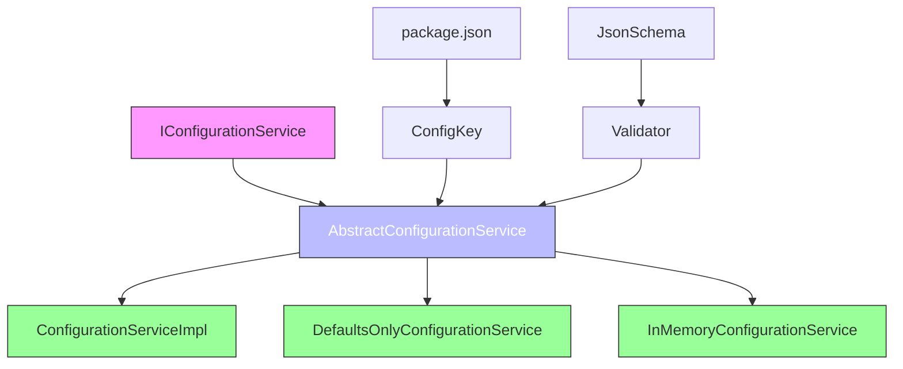
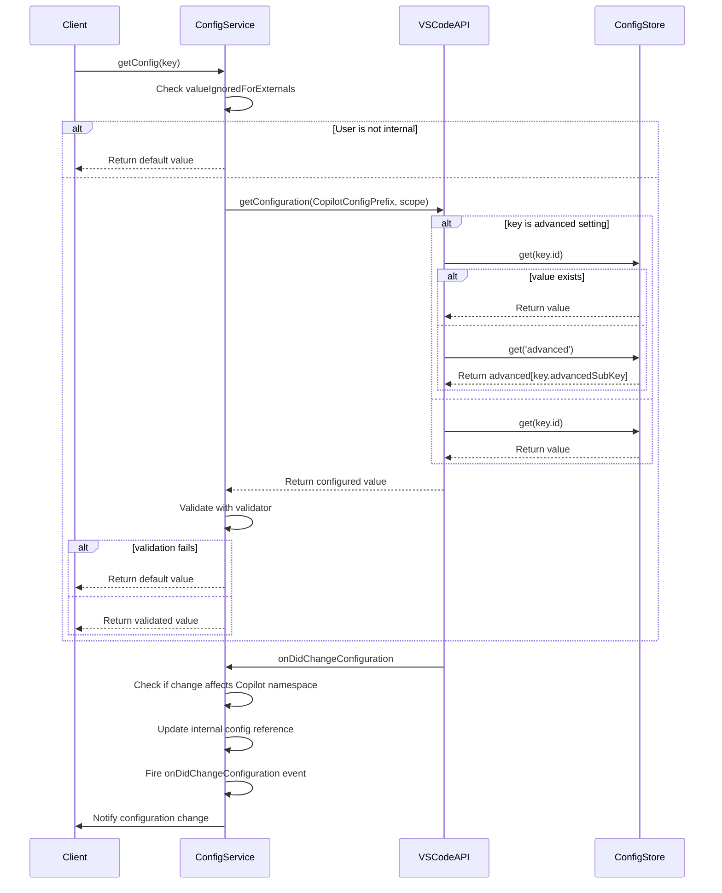
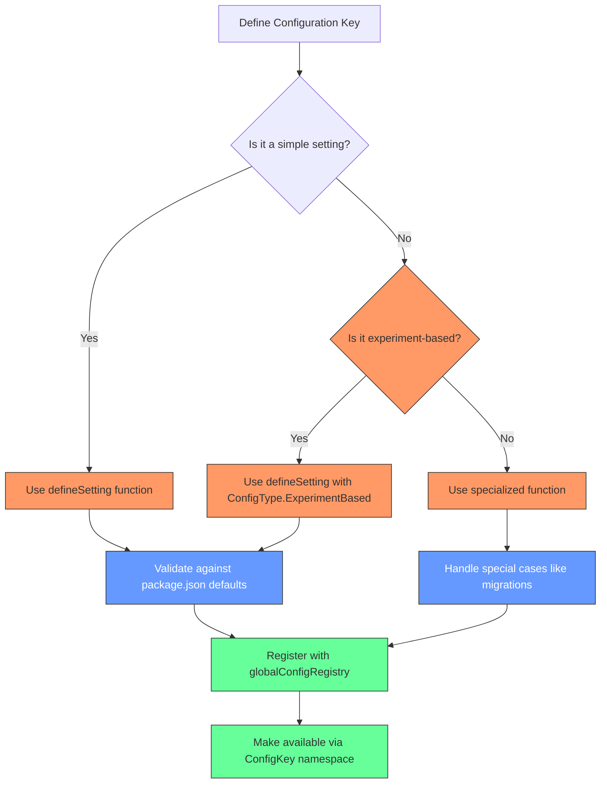
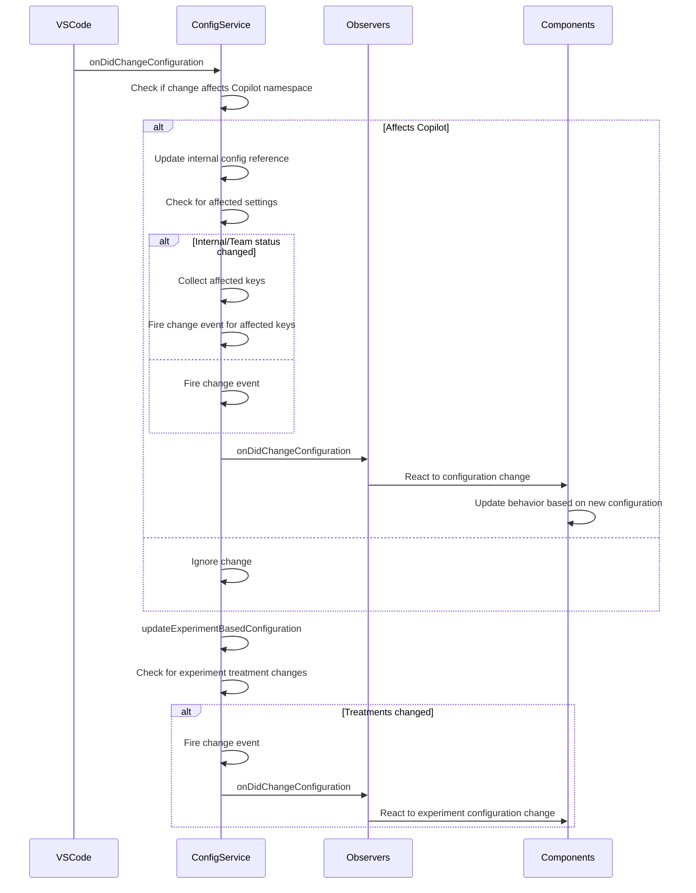
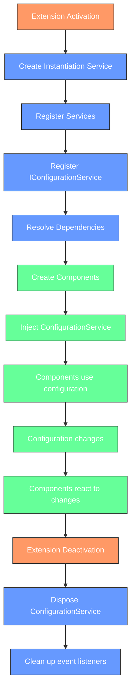

# Configuration Services

<cite>
**Referenced Files in This Document**   
- [configurationService.ts](file://src/platform/configuration/common/configurationService.ts)
- [defaultsOnlyConfigurationService.ts](file://src/platform/configuration/common/defaultsOnlyConfigurationService.ts)
- [jsonSchema.ts](file://src/platform/configuration/common/jsonSchema.ts)
- [validator.ts](file://src/platform/configuration/common/validator.ts)
- [configurationServiceImpl.ts](file://src/platform/configuration/vscode/configurationServiceImpl.ts)
- [package.json](file://package.json)
</cite>

## Table of Contents
1. [Introduction](#introduction)
2. [Architecture Overview](#architecture-overview)
3. [Core Components](#core-components)
4. [Configuration Schema and Validation](#configuration-schema-and-validation)
5. [Testing Configuration Service](#testing-configuration-service)
6. [Configuration Sections and Organization](#configuration-sections-and-organization)
7. [Configuration Change Handling](#configuration-change-handling)
8. [Dependency Injection Integration](#dependency-injection-integration)
9. [Conclusion](#conclusion)

## Introduction

The Configuration Services in the Platform Layer of vscode-copilot-chat provide a robust and unified interface for accessing extension settings across different environments. This documentation details the architecture and implementation of the configuration system, focusing on how it manages settings, validates configuration integrity, and integrates with the extension's lifecycle.

The configuration system is designed to handle various types of settings including stable, preview, experimental, and advanced configurations as defined in the package.json file. It provides a consistent API for accessing these settings while ensuring type safety and validation through schema validation mechanisms.

The service architecture separates common logic from VS Code-specific implementations, allowing for better testability and reusability across different environments. The system also supports testing scenarios through specialized implementations that provide default values without actual configuration access.

**Section sources**
- [configurationService.ts](file://src/platform/configuration/common/configurationService.ts#L25-L163)

## Architecture Overview

The Configuration Services architecture follows a layered approach with clear separation between abstraction, implementation, and validation components. The system is built around an interface-based design that enables dependency injection and facilitates testing.



**Diagram sources **
- [configurationService.ts](file://src/platform/configuration/common/configurationService.ts#L79-L163)
- [configurationServiceImpl.ts](file://src/platform/configuration/vscode/configurationServiceImpl.ts#L22-L315)
- [defaultsOnlyConfigurationService.ts](file://src/platform/configuration/common/defaultsOnlyConfigurationService.ts#L12-L72)

The architecture consists of several key components:
- **IConfigurationService**: The main interface defining the contract for configuration access
- **AbstractConfigurationService**: Base implementation providing common functionality
- **ConfigurationServiceImpl**: VS Code-specific implementation that interacts with the VS Code configuration API
- **DefaultsOnlyConfigurationService**: Testing implementation that returns only default values
- **Validator and JsonSchema**: Components responsible for configuration validation

This layered approach allows the system to maintain a clean separation between the configuration interface and its implementation, making it easier to test and extend.

**Section sources**
- [configurationService.ts](file://src/platform/configuration/common/configurationService.ts#L79-L163)
- [configurationServiceImpl.ts](file://src/platform/configuration/vscode/configurationServiceImpl.ts#L22-L315)

## Core Components

### Configuration Service Interface

The `IConfigurationService` interface defines the contract for accessing configuration settings in the vscode-copilot-chat extension. It provides methods for retrieving configuration values, observing configuration changes, and managing configuration updates.

```mermaid
classDiagram
class IConfigurationService {
+_serviceBrand : undefined
+getConfig<T>(key : Config<T>, scope? : ConfigurationScope) : T
+getConfigObservable<T>(key : Config<T>) : IObservable<T>
+inspectConfig<T>(key : BaseConfig<T>, scope? : ConfigurationScope) : InspectConfigResult<T> | undefined
+isConfigured<T>(key : BaseConfig<T>, scope? : ConfigurationScope) : boolean
+getNonExtensionConfig<T>(configKey : string) : T | undefined
+setConfig<T>(key : BaseConfig<T>, value : T) : Thenable<void>
+getExperimentBasedConfig<T extends ExperimentBasedConfigType>(key : ExperimentBasedConfig<T>, experimentationService : IExperimentationService, scope? : ConfigurationScope) : T
+getExperimentBasedConfigObservable<T extends ExperimentBasedConfigType>(key : ExperimentBasedConfig<T>, experimentationService : IExperimentationService) : IObservable<T>
+getConfigMixedWithDefaults<T>(key : Config<T>) : T
+getDefaultValue<T>(key : Config<T>) : T
+onDidChangeConfiguration : Event<ConfigurationChangeEvent>
+updateExperimentBasedConfiguration(treatments : string[]) : void
+dumpConfig() : { [key : string] : string }
}
class AbstractConfigurationService {
+_serviceBrand : undefined
+_onDidChangeConfiguration : Emitter<ConfigurationChangeEvent>
+onDidChangeConfiguration : Event<ConfigurationChangeEvent>
+_isInternal : boolean
+_isTeamMember : boolean
+getConfigMixedWithDefaults<T>(key : Config<T>) : T
+getDefaultValue<T>(key : BaseConfig<T>) : T
+_setUserInfo(userInfo : { isInternal : boolean; isTeamMember : boolean; teamMemberUsername? : string }) : void
+_isUsingTeamDefault(key : BaseConfig<any>) : boolean
+isConfigured<T>(key : BaseConfig<T>, scope? : ConfigurationScope) : boolean
+getConfigObservable<T>(key : Config<T>) : IObservable<T>
+getExperimentBasedConfigObservable<T extends ExperimentBasedConfigType>(key : ExperimentBasedConfig<T>, experimentationService : IExperimentationService) : IObservable<T>
+_getObservable_$show2FramesUp<T>(key : BaseConfig<T>, getValue : () => T) : IObservable<T>
+observables : Map<string, IObservable<any>>
}
IConfigurationService <|-- AbstractConfigurationService
AbstractConfigurationService <|-- ConfigurationServiceImpl
AbstractConfigurationService <|-- DefaultsOnlyConfigurationService
```

**Diagram sources **
- [configurationService.ts](file://src/platform/configuration/common/configurationService.ts#L79-L332)
- [configurationServiceImpl.ts](file://src/platform/configuration/vscode/configurationServiceImpl.ts#L22-L315)
- [defaultsOnlyConfigurationService.ts](file://src/platform/configuration/common/defaultsOnlyConfigurationService.ts#L12-L72)

The interface provides several key methods:
- `getConfig<T>(key: Config<T>, scope?: ConfigurationScope): T`: Retrieves a configuration value for a given key
- `getConfigObservable<T>(key: Config<T>): IObservable<T>`: Returns an observable for configuration changes
- `setConfig<T>(key: BaseConfig<T>, value: T): Thenable<void>`: Updates a configuration value
- `getExperimentBasedConfig<T extends ExperimentBasedConfigType>(key: ExperimentBasedConfig<T>, experimentationService: IExperimentationService, scope?: ConfigurationScope): T`: Retrieves experiment-based configuration values
- `onDidChangeConfiguration: Event<ConfigurationChangeEvent>`: Event emitted when configuration changes

The `AbstractConfigurationService` class provides a base implementation with common functionality such as configuration change event handling, observable creation, and user information management.

**Section sources**
- [configurationService.ts](file://src/platform/configuration/common/configurationService.ts#L79-L332)

### VS Code Implementation

The `ConfigurationServiceImpl` class provides the VS Code-specific implementation of the configuration service interface. It bridges the extension's configuration needs with the VS Code configuration API.



**Diagram sources **
- [configurationServiceImpl.ts](file://src/platform/configuration/vscode/configurationServiceImpl.ts#L22-L315)

The implementation handles several important aspects:
- **Configuration Scopes**: Supports different configuration scopes (global, workspace, workspace folder)
- **Advanced Settings**: Handles both flat and object-style advanced settings
- **Migration Support**: Manages configuration key migrations from old to new keys
- **Validation**: Applies validators to ensure configuration integrity
- **Event Handling**: Listens for VS Code configuration changes and propagates them

The service also handles special cases like advanced settings that can be configured in two different formats:
1. Flat style: `"github.copilot.advanced.debug.useElectronFetcher": false`
2. Object style: `"github.copilot.advanced": { "debug.useElectronFetcher": false }`

When setting configuration values, the implementation prefers the object style but can read from both formats, ensuring backward compatibility.

**Section sources**
- [configurationServiceImpl.ts](file://src/platform/configuration/vscode/configurationServiceImpl.ts#L22-L315)

## Configuration Schema and Validation

### JSON Schema Implementation

The configuration system uses a comprehensive JSON schema implementation to define and validate configuration structures. The schema system supports various data types and validation rules.

```mermaid
classDiagram
class JsonSchema {
<<interface>>
}
class BaseJsonSchema {
+$id? : string
+$schema? : string
+title? : string
+description? : string
+definitions? : { [name : string] : JsonSchema }
+enum? : unknown[]
+format? : string | Format
+if? : JsonSchema
+then? : JsonSchema
+else? : JsonSchema
+allOf? : JsonSchema[]
+anyOf? : JsonSchema[]
+oneOf? : JsonSchema[]
+not? : JsonSchema
}
class NumericJsonSchema {
+type : JsonSchemaType.Numeric | JsonSchemaType[]
+multipleOf? : number
+maximum? : number
+exclusiveMaximum? : boolean
+minimum? : number
+exclusiveMinimum? : boolean
}
class StringJsonSchema {
+type : typeof JsonSchemaType.string | JsonSchemaType[]
+maxLength? : number
+minLength? : number
+pattern? : string
}
class ArrayJsonSchema {
+type : typeof JsonSchemaType.array | JsonSchemaType[]
+items? : JsonSchema | JsonSchema[]
+additionalItems? : JsonSchema
+maxItems? : number
+minItems? : number
+uniqueItems? : boolean
+contains : JsonSchema
}
class ObjectJsonSchema {
+type : typeof JsonSchemaType.object | JsonSchemaType[]
+maxProperties? : number
+minProperties? : number
+required? : string[]
+properties? : { [name : string] : JsonSchema }
+patternProperties? : { [name : string] : JsonSchema }
+additionalProperties? : JsonSchema
+dependencies? : { [name : string] : JsonSchema | string[] }
}
class JsonSchemaReference {
+$ref : string
}
class EmptyJsonSchema {
}
JsonSchema <|-- BaseJsonSchema
BaseJsonSchema <|-- NumericJsonSchema
BaseJsonSchema <|-- StringJsonSchema
BaseJsonSchema <|-- ArrayJsonSchema
BaseJsonSchema <|-- ObjectJsonSchema
JsonSchema <|-- JsonSchemaReference
JsonSchema <|-- EmptyJsonSchema
class Format {
+dateTime : "date-time"
+date : "date"
+time : "time"
+email : "email"
+idnEmail : "idn-email"
+hostname : "hostname"
+idnHostname : "idn-hostname"
+ipv4 : "ipv4"
+ipv6 : "ipv6"
+uri : "uri"
+uriReference : "uri-reference"
+iri : "iri"
+iriReference : "iri-reference"
+uriTemplate : "uri-template"
+jsonPointer : "json-pointer"
+relativeJsonPointer : "relative-json-pointer"
+regex : "regex"
}
```

**Diagram sources **
- [jsonSchema.ts](file://src/platform/configuration/common/jsonSchema.ts#L6-L139)

The JSON schema implementation supports:
- **Primitive Types**: String, number, boolean, null
- **Numeric Validation**: Range constraints, multiples
- **String Validation**: Length constraints, patterns
- **Array Validation**: Item types, length constraints, uniqueness
- **Object Validation**: Property definitions, required fields, pattern properties
- **Conditional Validation**: If/then/else rules
- **Composition**: allOf, anyOf, oneOf, not constraints

The schema system is used to generate validation rules that ensure configuration values meet the expected format and constraints.

**Section sources**
- [jsonSchema.ts](file://src/platform/configuration/common/jsonSchema.ts#L6-L139)

### Validation System

The validation system provides a comprehensive set of validators to ensure configuration integrity. Validators are used to validate configuration values at runtime and can be composed to create complex validation rules.

```mermaid
classDiagram
class IValidator~T~ {
<<interface>>
+validate(content : unknown) : { content : T; error : undefined } | { content : undefined; error : ValidationError }
+toSchema() : JsonSchema
+isRequired?() : boolean
}
class TypeofValidator~T~ {
-type : TKey
+validate(content : unknown) : { content : T; error : undefined } | { content : undefined; error : ValidationError }
+toSchema() : JsonSchema
}
class ObjectValidator~T~ {
-properties : T
+validate(content : unknown) : { content : any; error : undefined } | { content : undefined; error : ValidationError }
+toSchema() : JsonSchema
}
class ArrayValidator~T~ {
-validator : IValidator<T>
+validate(content : unknown) : { content : T[]; error : undefined } | { content : undefined; error : ValidationError }
+toSchema() : JsonSchema
}
class TupleValidator~T~ {
-validators : T[]
+validate(content : unknown) : { content : any; error : undefined } | { content : undefined; error : ValidationError }
+toSchema() : JsonSchema
}
class UnionValidator~T~ {
-validators : T[]
+validate(content : unknown) : { content : any; error : undefined } | { content : undefined; error : ValidationError }
+toSchema() : JsonSchema
}
class EnumValidator~T~ {
-values : T[]
+validate(content : unknown) : { content : any; error : undefined } | { content : undefined; error : ValidationError }
+toSchema() : JsonSchema
}
class LiteralValidator~T~ {
-value : T
+validate(content : unknown) : { content : any; error : undefined } | { content : undefined; error : ValidationError }
+toSchema() : JsonSchema
}
class LazyValidator~T~ {
-fn : () => IValidator<T>
+validate(content : unknown) : { content : any; error : undefined } | { content : undefined; error : ValidationError }
+toSchema() : JsonSchema
}
IValidator~T~ <|-- TypeofValidator~T~
IValidator~T~ <|-- ObjectValidator~T~
IValidator~T~ <|-- ArrayValidator~T~
IValidator~T~ <|-- TupleValidator~T~
IValidator~T~ <|-- UnionValidator~T~
IValidator~T~ <|-- EnumValidator~T~
IValidator~T~ <|-- LiteralValidator~T~
IValidator~T~ <|-- LazyValidator~T~
class ValidationError {
+message : string
}
class vStringValidator {
+validate(content : unknown) : { content : string; error : undefined } | { content : undefined; error : ValidationError }
+toSchema() : JsonSchema
}
class vNumberValidator {
+validate(content : unknown) : { content : number; error : undefined } | { content : undefined; error : ValidationError }
+toSchema() : JsonSchema
}
class vBooleanValidator {
+validate(content : unknown) : { content : boolean; error : undefined } | { content : undefined; error : ValidationError }
+toSchema() : JsonSchema
}
TypeofValidator~T~ --> vStringValidator
TypeofValidator~T~ --> vNumberValidator
TypeofValidator~T~ --> vBooleanValidator
```

**Diagram sources **
- [validator.ts](file://src/platform/configuration/common/validator.ts#L8-L292)

The validation system includes several key components:
- **Primitive Validators**: `vString()`, `vNumber()`, `vBoolean()` for basic types
- **Object Validator**: `vObj()` for validating object structures with property validation
- **Array Validator**: `vArray()` for validating array contents
- **Tuple Validator**: `vTuple()` for validating fixed-length arrays with specific types
- **Union Validator**: `vUnion()` for validating values that can be one of several types
- **Enum Validator**: `vEnum()` for validating values against a set of allowed values
- **Literal Validator**: `vLiteral()` for validating exact values
- **Lazy Validator**: `vLazy()` for deferred validation

Validators can be composed to create complex validation rules. For example, an object validator can use other validators for its properties, creating a hierarchical validation structure.

The system also supports required field validation through the `vRequired()` function, which marks a field as required and ensures it is present in the configuration.

**Section sources**
- [validator.ts](file://src/platform/configuration/common/validator.ts#L8-L292)

## Testing Configuration Service

### Default Values Configuration Service

The `DefaultsOnlyConfigurationService` provides a specialized implementation for testing scenarios that returns only default values without accessing actual user configuration.

```mermaid
classDiagram
class DefaultsOnlyConfigurationService {
+getConfig<T>(key : Config<T>) : T
+inspectConfig<T>(key : BaseConfig<T>, scope? : ConfigurationScope) : InspectConfigResult<T> | undefined
+setConfig() : Promise<void>
+getNonExtensionConfig<T>(configKey : string) : T | undefined
+getExperimentBasedConfig<T extends ExperimentBasedConfigType>(key : ExperimentBasedConfig<T>, experimentationService : IExperimentationService, scope? : ConfigurationScope) : T
+dumpConfig() : { [key : string] : string }
}
AbstractConfigurationService <|-- DefaultsOnlyConfigurationService
class AbstractConfigurationService {
+getDefaultValue<T>(key : BaseConfig<T>) : T
}
DefaultsOnlyConfigurationService --> AbstractConfigurationService : uses
```

**Diagram sources **
- [defaultsOnlyConfigurationService.ts](file://src/platform/configuration/common/defaultsOnlyConfigurationService.ts#L12-L72)

This service is designed for testing scenarios where:
- Consistent behavior is required regardless of user settings
- Tests should not be affected by actual configuration values
- Default values need to be verified in isolation

The implementation overrides key methods to ensure only default values are returned:
- `getConfig<T>(key: Config<T>)`: Returns the default value for the specified key
- `inspectConfig<T>(key: BaseConfig<T>)`: Returns inspection results with only default values
- `getExperimentBasedConfig<T extends ExperimentBasedConfigType>(key: ExperimentBasedConfig<T>, experimentationService: IExperimentationService)`: Returns experiment-based values or defaults, but ignores user configuration

This approach ensures that tests are deterministic and not affected by the user's actual configuration settings.

**Section sources**
- [defaultsOnlyConfigurationService.ts](file://src/platform/configuration/common/defaultsOnlyConfigurationService.ts#L12-L72)

### In-Memory Configuration Service

The `InMemoryConfigurationService` provides another testing implementation that allows for configuration value overrides while maintaining the full functionality of the configuration service.

```mermaid
classDiagram
class InMemoryConfigurationService {
-baseConfigurationService : IConfigurationService
-overrides : Map<BaseConfig<any>, unknown>
-nonExtensionOverrides : Map<string, any>
+getConfig<T>(key : Config<T>) : T
+inspectConfig<T>(key : BaseConfig<T>, scope? : ConfigurationScope) : InspectConfigResult<T> | undefined
+getNonExtensionConfig<T>(configKey : string) : T | undefined
+setConfig<T>(key : BaseConfig<T>, value : T) : Promise<void>
+setNonExtensionConfig<T>(key : string, value : T) : Promise<void>
+getExperimentBasedConfig<T extends ExperimentBasedConfigType>(key : ExperimentBasedConfig<T>, experimentationService : IExperimentationService, scope? : ConfigurationScope) : T
+dumpConfig() : { [key : string] : string }
}
AbstractConfigurationService <|-- InMemoryConfigurationService
InMemoryConfigurationService --> AbstractConfigurationService : extends
InMemoryConfigurationService --> IConfigurationService : delegates to
```

**Diagram sources **
- [inMemoryConfigurationService.ts](file://src/platform/configuration/test/common/inMemoryConfigurationService.ts#L13-L79)

This service is useful for:
- Unit testing specific configuration scenarios
- Integration testing with controlled configuration values
- Testing configuration change events
- Simulating different user configurations

The service wraps a base configuration service and allows for:
- Overriding specific configuration values
- Setting non-extension configuration values
- Testing configuration change events
- Verifying the impact of configuration changes

This flexibility makes it ideal for comprehensive testing of configuration-dependent functionality.

**Section sources**
- [inMemoryConfigurationService.ts](file://src/platform/configuration/test/common/inMemoryConfigurationService.ts#L13-L79)

## Configuration Sections and Organization

### Configuration Sections in package.json

The configuration system organizes settings into distinct sections as defined in the package.json file. These sections help categorize settings based on their stability and intended audience.

```mermaid
erDiagram
CONFIGURATION_SECTIONS {
string id PK
string title
string description
string[] tags
int order
}
CONFIGURATION_SETTING {
string id PK
string name
string description
string type
string default
string[] tags FK
string section FK
}
CONFIGURATION_TAGS {
string tag PK
string description
string color
}
CONFIGURATION_SECTIONS ||--o{ CONFIGURATION_SETTING : contains
CONFIGURATION_TAGS ||--o{ CONFIGURATION_SETTING : applied_to
CONFIGURATION_SECTIONS {
"stable" "Stable Settings" "Settings that are stable and available to all users" 1
"preview" "Preview Settings" "Settings that are in preview and may change" 2
"experimental" "Experimental Settings" "Settings that are experimental and may be unstable" 3
"advanced" "Advanced Settings" "Advanced settings for power users" 4
}
CONFIGURATION_TAGS {
"preview" "Preview feature" "#FFA500"
"experimental" "Experimental feature" "#FF0000"
"advanced" "Advanced setting" "#800080"
}
```

**Diagram sources **
- [package.json](file://package.json#L141-L200)

The configuration sections are defined in the package.json file under the `contributes.configuration` property. Each section serves a specific purpose:

- **Stable**: Settings that are stable and available to all users
- **Preview**: Settings that are in preview and may change in future releases
- **Experimental**: Settings that are experimental and may be unstable
- **Advanced**: Advanced settings for power users and debugging

Each section has associated tags that are applied to its settings:
- Preview settings are tagged with "preview"
- Experimental settings are tagged with "experimental"
- Advanced settings are tagged with "advanced"

This organization helps users understand the stability and intended audience of each setting.

**Section sources**
- [package.json](file://package.json#L141-L200)

### Configuration Key Definitions

Configuration keys are defined in code using a systematic approach that ensures consistency between code and package.json definitions.



**Diagram sources **
- [configurationService.ts](file://src/platform/configuration/common/configurationService.ts#L494-L517)

The configuration key system uses several functions to define settings:
- `defineSetting()`: For regular settings
- `defineTeamInternalSetting()`: For settings restricted to team members
- `defineAndMigrateSetting()`: For settings that are migrated from old keys
- `defineAndMigrateExpSetting()`: For experiment-based settings with migration

Each configuration key is an object with properties including:
- `id`: The key name without the "github.copilot." prefix
- `isPublic`: Whether the setting is visible to the general public
- `fullyQualifiedId`: The complete key name with prefix
- `defaultValue`: The default value for the setting
- `options`: Additional options like migration information
- `validator`: Optional validator for the setting

The system validates that default values in code match those in package.json to ensure consistency.

**Section sources**
- [configurationService.ts](file://src/platform/configuration/common/configurationService.ts#L494-L517)

## Configuration Change Handling

### Configuration Change Propagation

The configuration system implements a robust mechanism for handling and propagating configuration changes throughout the application.



**Diagram sources **
- [configurationService.ts](file://src/platform/configuration/common/configurationService.ts#L148-L160)
- [configurationServiceImpl.ts](file://src/platform/configuration/vscode/configurationServiceImpl.ts#L292-L313)

The change handling system works as follows:
1. The VS Code configuration change event is captured by the ConfigurationServiceImpl
2. The service checks if the change affects the Copilot namespace
3. If affected, the internal configuration reference is updated
4. A change event is fired through the onDidChangeConfiguration event
5. Components that observe this event can react to the configuration change

Special cases are handled:
- **User Status Changes**: When internal or team member status changes, settings with different defaults for these users are refreshed
- **Experiment Changes**: When experiment treatments change, experiment-based configurations are updated
- **Migration Events**: When configuration keys are migrated, both old and new keys are monitored

The system also provides observable configurations through the `getConfigObservable()` method, which creates observables that automatically update when the underlying configuration changes.

**Section sources**
- [configurationService.ts](file://src/platform/configuration/common/configurationService.ts#L148-L160)
- [configurationServiceImpl.ts](file://src/platform/configuration/vscode/configurationServiceImpl.ts#L292-L313)

### Observable Configuration Values

The configuration service provides observable values that automatically update when configuration changes occur.

```mermaid
flowchart TD
A[Component] --> B[Call getConfigObservable(key)]
B --> C{Observable exists?}
C --> |Yes| D[Return existing observable]
C --> |No| E[Create new observable]
E --> F[Register change listener]
F --> G[Get current value]
G --> H[Return observable]
H --> I[Component subscribes]
I --> J[Component receives current value]
K[Configuration changes] --> L[onDidChangeConfiguration fires]
L --> M{Change affects key?}
M --> |Yes| N[Get new value]
N --> O[Notify subscribers]
O --> P[Component receives new value]
M --> |No| Q[Ignore change]
classDef component fill:#f96,stroke:#333,color:#fff;
classDef observable fill:#69f,stroke:#333,color:#fff;
classDef change fill:#6f9,stroke:#333,color:#fff;
class A component
class D,E,F,G,H,I,J,P observable
class K,L,M,N,O,Q change
```

**Diagram sources **
- [configurationService.ts](file://src/platform/configuration/common/configurationService.ts#L276-L301)

The observable system works by:
1. Creating an observable for each configuration key on first request
2. Registering a listener for configuration changes
3. Checking if changes affect the specific key
4. Notifying subscribers with the new value when changes occur

This approach provides several benefits:
- **Efficiency**: Observables are created only when needed and reused
- **Consistency**: All subscribers receive the same value updates
- **Automatic Cleanup**: The system manages event listeners and cleanup
- **Type Safety**: Observables are strongly typed based on the configuration key

Components can use these observables to automatically react to configuration changes without manually managing event listeners.

**Section sources**
- [configurationService.ts](file://src/platform/configuration/common/configurationService.ts#L276-L301)

## Dependency Injection Integration

### Service Registration and Injection

The configuration service integrates with the extension's dependency injection system, allowing it to be easily injected into other components.

```mermaid
classDiagram
class IConfigurationService {
<<interface>>
}
class AbstractConfigurationService {
+_serviceBrand : undefined
}
class ConfigurationServiceImpl {
+constructor(@ICopilotTokenStore copilotTokenStore : ICopilotTokenStore)
}
class InstantiationService {
+createInstance<T>(ctor : any, ...args : unknown[]) : T
+_createInstance<T>(ctor : any, args : unknown[], _trace : Trace) : T
+_getOrCreateServiceInstance<T>(id : ServiceIdentifier<T>, _trace : Trace) : T
}
class ServiceIdentifier~T~ {
+toString() : string
}
IConfigurationService <|-- AbstractConfigurationService
AbstractConfigurationService <|-- ConfigurationServiceImpl
InstantiationService --> ConfigurationServiceImpl : creates
InstantiationService --> ServiceIdentifier~T~ : uses
ConfigurationServiceImpl --> ICopilotTokenStore : depends on
note right of InstantiationService
The instantiation service
resolves dependencies and
creates instances with
injected services
end
```

**Diagram sources **
- [configurationService.ts](file://src/platform/configuration/common/configurationService.ts#L27-L33)
- [configurationServiceImpl.ts](file://src/platform/configuration/vscode/configurationServiceImpl.ts#L25-L27)
- [instantiation.ts](file://src/util/vs/platform/instantiation/common/instantiation.ts#L112-L128)
- [instantiationService.ts](file://src/util/vs/platform/instantiation/common/instantiationService.ts#L125-L299)

The integration works as follows:
1. The `IConfigurationService` interface is registered as a service identifier using `createServiceIdentifier()`
2. The `ConfigurationServiceImpl` class is registered with the dependency injection container
3. When a component requests the configuration service, the container creates an instance
4. Dependencies (like `ICopilotTokenStore`) are automatically injected through the constructor

The service identifier system uses decorators to mark dependencies, allowing the instantiation service to resolve and inject them automatically. This creates a clean separation between components and their dependencies.

**Section sources**
- [configurationService.ts](file://src/platform/configuration/common/configurationService.ts#L27-L33)
- [configurationServiceImpl.ts](file://src/platform/configuration/vscode/configurationServiceImpl.ts#L25-L27)

### Configuration in Component Lifecycle

The configuration service is integrated into the extension's component lifecycle, ensuring proper initialization and cleanup.



**Diagram sources **
- [configurationService.ts](file://src/platform/configuration/common/configurationService.ts#L167-L188)
- [configurationServiceImpl.ts](file://src/platform/configuration/vscode/configurationServiceImpl.ts#L22-L47)

The lifecycle integration ensures that:
- The configuration service is properly initialized during extension activation
- Event listeners are registered to monitor configuration changes
- User status changes (internal/team member) are tracked and handled
- Resources are properly cleaned up during extension deactivation
- Configuration changes are properly propagated throughout the application

The `AbstractConfigurationService` extends `Disposable`, ensuring that all event listeners and resources are properly disposed when the service is no longer needed.

**Section sources**
- [configurationService.ts](file://src/platform/configuration/common/configurationService.ts#L167-L188)
- [configurationServiceImpl.ts](file://src/platform/configuration/vscode/configurationServiceImpl.ts#L22-L47)

## Conclusion

The Configuration Services in the Platform Layer of vscode-copilot-chat provide a comprehensive and robust system for managing extension settings. The architecture follows a clean separation of concerns, with well-defined interfaces, implementations, and validation mechanisms.

Key features of the system include:
- **Unified Interface**: A consistent API for accessing configuration settings across different environments
- **Schema Validation**: Comprehensive validation using JSON schema and custom validators to ensure configuration integrity
- **Section Organization**: Clear categorization of settings into stable, preview, experimental, and advanced sections
- **Testing Support**: Specialized implementations for testing scenarios that provide default values or allow value overrides
- **Change Propagation**: Robust mechanism for handling and propagating configuration changes throughout the application
- **Dependency Injection**: Seamless integration with the extension's dependency injection system

The system effectively balances flexibility and type safety, allowing for both simple configuration access and complex validation scenarios. The separation between common logic and VS Code-specific implementation enables better testability and reusability.

By providing observable configuration values and automatic change handling, the system makes it easy for components to react to configuration changes without manual event management. The integration with the extension lifecycle ensures proper initialization and cleanup of resources.

Overall, the Configuration Services architecture demonstrates a well-designed approach to configuration management in a complex VS Code extension, providing a solid foundation for reliable and maintainable code.

[No sources needed since this section summarizes without analyzing specific files]