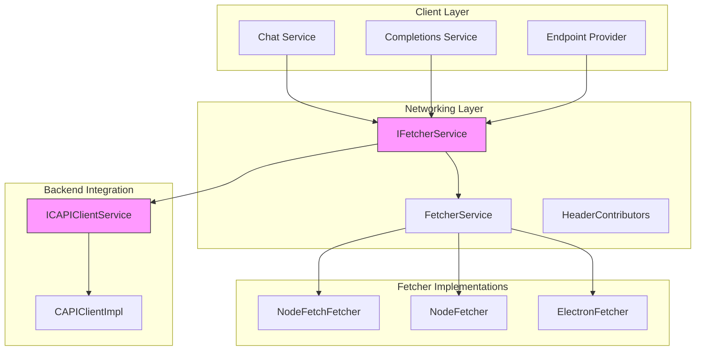
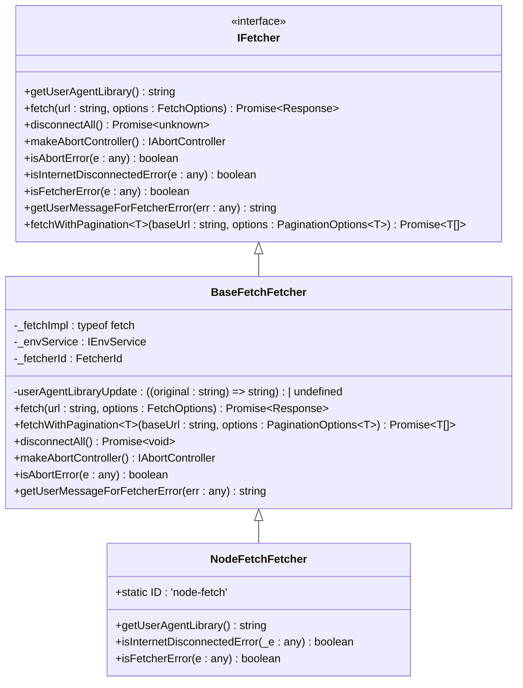
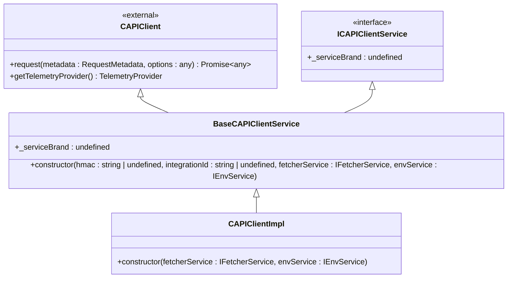
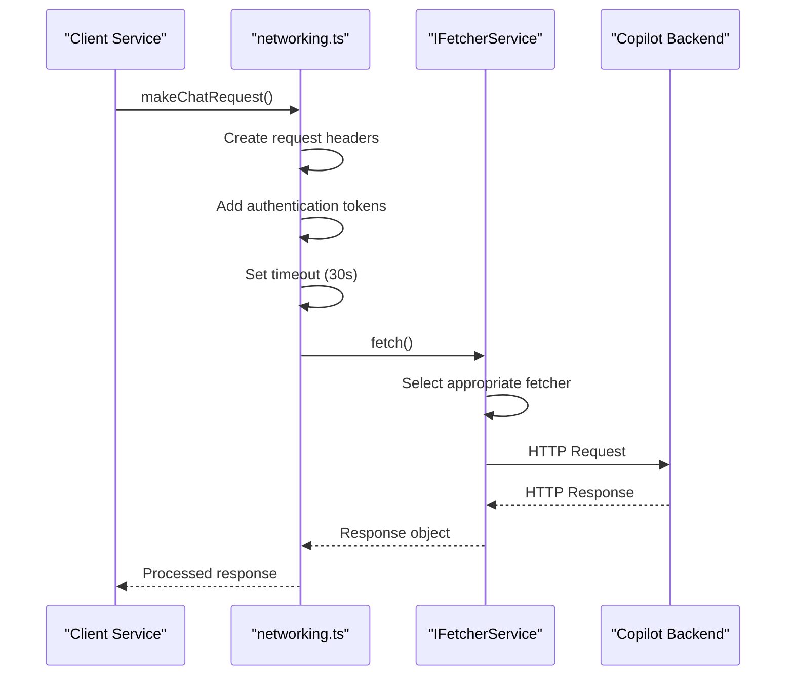
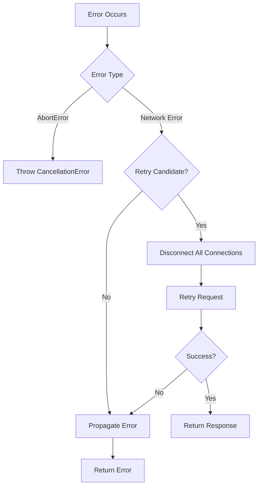

# Networking Services

<cite>
**Referenced Files in This Document**   
- [fetcherService.ts](file://src/platform/networking/common/fetcherService.ts)
- [networking.ts](file://src/platform/networking/common/networking.ts)
- [nodeFetchFetcher.ts](file://src/platform/networking/node/nodeFetchFetcher.ts)
- [fetcherServiceImpl.ts](file://src/platform/networking/vscode-node/fetcherServiceImpl.ts)
- [capiClient.ts](file://src/platform/endpoint/common/capiClient.ts)
- [capiClientImpl.ts](file://src/platform/endpoint/node/capiClientImpl.ts)
- [stream.ts](file://src/platform/networking/node/stream.ts)
- [fetcherFallback.ts](file://src/platform/networking/node/fetcherFallback.ts)
- [electronFetcher.ts](file://src/platform/networking/vscode-node/electronFetcher.ts)
</cite>

## Table of Contents
1. [Introduction](#introduction)
2. [Architecture Overview](#architecture-overview)
3. [Core Components](#core-components)
4. [Request/Response Pipeline](#requestresponse-pipeline)
5. [Streaming Implementation](#streaming-implementation)
6. [Error Handling and Retry Logic](#error-handling-and-retry-logic)
7. [Security Considerations](#security-considerations)
8. [API Endpoints](#api-endpoints)

## Introduction
The Networking Services in the Platform Layer of vscode-copilot-chat provide a unified HTTP client interface that abstracts differences between Node.js and VS Code environments. This architecture enables consistent communication with Copilot backend services across different runtime environments while maintaining robust error handling, security, and performance characteristics. The system is designed to handle various types of requests including chat, completions, and model metadata queries, with support for streaming responses from AI models.

**Section sources**
- [fetcherService.ts](file://src/platform/networking/common/fetcherService.ts#L1-L99)
- [networking.ts](file://src/platform/networking/common/networking.ts#L1-L478)

## Architecture Overview
The networking architecture is built around a modular design that separates concerns between the fetcher implementations, the service interface, and the client integration. The system provides a unified interface for HTTP operations while supporting multiple underlying implementations based on the runtime environment.



**Diagram sources **
- [fetcherService.ts](file://src/platform/networking/common/fetcherService.ts#L8-L20)
- [fetcherServiceImpl.ts](file://src/platform/networking/vscode-node/fetcherServiceImpl.ts#L18-L152)
- [capiClient.ts](file://src/platform/endpoint/common/capiClient.ts#L15-L38)

## Core Components

### Fetcher Service Interface
The `IFetcherService` interface defines the contract for HTTP operations, providing a consistent API across different environments. It includes methods for fetching resources, managing connections, handling abort signals, and processing errors. The interface abstracts the underlying implementation details, allowing clients to interact with the network without knowledge of the specific fetcher being used.

**Section sources**
- [fetcherService.ts](file://src/platform/networking/common/fetcherService.ts#L8-L20)

### Node.js Implementation
The Node.js implementation uses the `node-fetch` library with the `undici` HTTP client for improved performance and HTTP/2 support. The `NodeFetchFetcher` class extends `BaseFetchFetcher` and implements the `IFetcher` interface, providing environment-specific functionality. Connection pooling is managed through a lazy-initialized `undici.Agent` instance that reuses connections across requests.



**Diagram sources **
- [baseFetchFetcher.ts](file://src/platform/networking/node/baseFetchFetcher.ts#L12-L118)
- [nodeFetchFetcher.ts](file://src/platform/networking/node/nodeFetchFetcher.ts#L11-L33)

### VS Code Integration
The VS Code integration uses the `fetcherServiceImpl.ts` implementation, which provides a service wrapper around multiple fetcher implementations. The `FetcherService` class manages a collection of available fetchers and implements fallback logic when primary fetchers fail. It supports configuration through the experimentation service and can dynamically adjust which fetcher to use based on runtime conditions.

**Section sources**
- [fetcherServiceImpl.ts](file://src/platform/networking/vscode-node/fetcherServiceImpl.ts#L18-L152)

### CAPI Client Interface
The `ICAPIClientService` interface extends the `CAPIClient` from the `@vscode/copilot-api` package and provides a service-oriented approach to interacting with the Copilot backend. The `BaseCAPIClientService` class implements the core functionality, while the `CAPIClientImpl` provides the Node.js-specific implementation that integrates with the fetcher service.



**Diagram sources **
- [capiClient.ts](file://src/platform/endpoint/common/capiClient.ts#L15-L38)
- [capiClientImpl.ts](file://src/platform/endpoint/node/capiClientImpl.ts#L10-L23)

## Request/Response Pipeline
The request/response pipeline handles the complete lifecycle of HTTP requests to the Copilot backend, including authentication, headers, timeouts, and response processing. The pipeline is designed to be resilient and provide consistent behavior across different environments.

### Request Processing
The request processing flow begins with the creation of HTTP requests using standardized methods like `postRequest` and `getRequest`. These methods handle authentication headers, request IDs, and other metadata automatically. The pipeline includes timeout management with a default of 30 seconds, and supports cancellation through `CancellationToken`.



**Diagram sources **
- [networking.ts](file://src/platform/networking/common/networking.ts#L290-L438)
- [fetcherService.ts](file://src/platform/networking/common/fetcherService.ts#L13-L20)

### Authentication and Headers
Authentication is handled through Bearer tokens in the Authorization header, with additional metadata in custom headers. The pipeline automatically includes headers for request tracking, interaction type, and GitHub API version. Header contributors can be registered to add additional headers as needed.

**Section sources**
- [networking.ts](file://src/platform/networking/common/networking.ts#L317-L324)

## Streaming Implementation
The system supports streaming responses from AI models through a sophisticated SSE (Server-Sent Events) processing mechanism. This allows for real-time delivery of AI-generated content to the user interface.

### SSE Processing
The `SSEProcessor` class handles the parsing of server-sent events from the Copilot backend. It processes JSON chunks from the stream, reconstructs complete responses, and handles special cases like function calls and tool invocations. The processor supports cancellation through `CancellationToken` and properly cleans up resources when requests are cancelled.

```mermaid
flowchart TD
A[HTTP Response Stream] --> B{Start of Stream}
B --> C[Parse JSON Chunks]
C --> D{Data Line Starts with ':'}
D --> |Yes| E[Ignore Comment]
D --> |No| F[Extract JSON Data]
F --> G{Line is '[DONE]'}
G --> |Yes| H[Yield Finished Solutions]
G --> |No| I[Parse JSON]
I --> J{Has 'choices' Array}
J --> |No| K[Handle Special Messages]
J --> |Yes| L[Process Each Choice]
L --> M{Has Delta Content}
M --> |Yes| N[Append to Solution]
M --> |No| O{Has Finish Reason}
O --> |Yes| P[Yield Finished Completion]
O --> |No| Q[Continue Processing]
H --> R[Close Stream]
P --> R
Q --> C
```

**Diagram sources **
- [stream.ts](file://src/platform/networking/node/stream.ts#L195-L655)

### Streaming State Management
The streaming implementation maintains state for each completion choice through the `APIJsonDataStreaming` class. This class accumulates text chunks and provides methods to flush deltas for incremental updates. The system also tracks tool calls and function invocations separately, reconstructing them from streaming data.

**Section sources**
- [stream.ts](file://src/platform/networking/node/stream.ts#L18-L63)

## Error Handling and Retry Logic
The networking system implements comprehensive error handling and retry mechanisms to ensure resilience in various network conditions.

### Error Classification
Errors are classified into different categories including abort errors, internet disconnection errors, and fetcher-specific errors. The system provides user-friendly error messages and includes error codes for troubleshooting. Network errors that may benefit from retry (such as connection resets) are identified and handled appropriately.



**Diagram sources **
- [networking.ts](file://src/platform/networking/common/networking.ts#L372-L382)
- [fetcherFallback.ts](file://src/platform/networking/node/fetcherFallback.ts#L20-L65)

### Fallback Mechanism
The system implements a sophisticated fallback mechanism that can switch between different fetcher implementations when the primary fetcher fails. The `fetchWithFallbacks` function attempts requests with multiple fetchers in order of preference, and can promote a working fetcher to the primary position if the current primary fails.

**Section sources**
- [fetcherFallback.ts](file://src/platform/networking/node/fetcherFallback.ts#L20-L65)

## Security Considerations
The networking implementation includes several security features to protect user data and ensure secure communication with the Copilot backend.

### Authentication
Authentication is handled through Bearer tokens derived from the user's GitHub credentials. The system uses HMAC secrets and integration IDs to authenticate requests, with these values typically provided through environment variables in the Node.js implementation.

**Section sources**
- [capiClientImpl.ts](file://src/platform/endpoint/node/capiClientImpl.ts#L17-L20)

### Secure Communication
All communication with the Copilot backend occurs over HTTPS, with the system respecting proxy settings from the VS Code environment. The implementation avoids logging sensitive information and uses secure telemetry practices to prevent exposure of user data.

### Header Management
The system carefully manages HTTP headers to include necessary metadata while avoiding information leakage. Custom headers are used for telemetry and request tracking, but sensitive information is not included in headers that might be logged or exposed.

## API Endpoints
The system interacts with various Copilot backend endpoints for different functionality.

### Chat and Completions
The primary endpoints for chat and completions are accessed through the `/chat/completions` and `/responses` paths. These endpoints support streaming responses and handle various types of AI-generated content including code suggestions and natural language responses.

### Model Metadata
Model metadata is retrieved from endpoints that provide information about available AI models, including their capabilities, token limits, and pricing information. This metadata is used to inform the user interface and select appropriate models for different tasks.

**Section sources**
- [endpointProvider.ts](file://src/platform/endpoint/common/endpointProvider.ts#L70-L74)