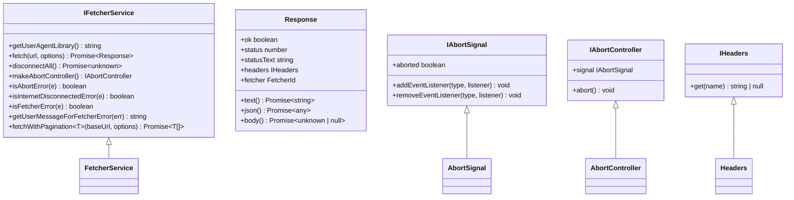

# Platform Layer

<cite>
**Referenced Files in This Document**   
- [configurationService.ts](file://src/platform/configuration/common/configurationService.ts)
- [workspaceService.ts](file://src/platform/workspace/common/workspaceService.ts)
- [ghTelemetryService.ts](file://src/platform/telemetry/common/ghTelemetryService.ts)
- [fetcherService.ts](file://src/platform/networking/common/fetcherService.ts)
- [authenticationService.ts](file://src/platform/authentication/vscode-node/authenticationService.ts)
- [services.ts](file://src/util/common/services.ts)
</cite>

## Table of Contents
1. [Introduction](#introduction)
2. [Project Structure](#project-structure)
3. [Core Components](#core-components)
4. [Architecture Overview](#architecture-overview)
5. [Detailed Component Analysis](#detailed-component-analysis)
6. [Dependency Analysis](#dependency-analysis)
7. [Performance Considerations](#performance-considerations)
8. [Troubleshooting Guide](#troubleshooting-guide)
9. [Conclusion](#conclusion)

## Introduction
The Platform Layer in vscode-copilot-chat serves as a shared services layer that provides reusable functionality across the extension. This architectural layer abstracts VS Code API differences across environments and offers a stable interface for the extension layer. The platform implements a service-oriented architecture with components for configuration management, telemetry, workspace operations, authentication, and networking. These services are delivered to the extension layer through a dependency injection pattern, enabling loose coupling and testability. The platform layer separates common implementations from platform-specific adaptations, allowing the core functionality to remain consistent while accommodating different execution environments.

## Project Structure
The platform layer is organized as a collection of services within the `src/platform` directory, with each service having a common interface and implementation. The structure follows a pattern where each service has a `common` directory containing shared interfaces and base classes, and platform-specific implementations in directories like `vscode-node`, `node`, or `vscode`. This organization enables code reuse while allowing for environment-specific adaptations.


**Diagram sources**
- [configurationService.ts](file://src/platform/configuration/common/configurationService.ts)
- [workspaceService.ts](file://src/platform/workspace/common/workspaceService.ts)
- [ghTelemetryService.ts](file://src/platform/telemetry/common/ghTelemetryService.ts)

**Section sources**
- [configurationService.ts](file://src/platform/configuration/common/configurationService.ts)
- [workspaceService.ts](file://src/platform/workspace/common/workspaceService.ts)

## Core Components
The Platform Layer consists of several core services that provide essential functionality to the vscode-copilot-chat extension. These services include configuration management through `configurationService.ts`, telemetry handling via `ghTelemetryService.ts`, workspace state management with `workspaceService.ts`, authentication through `authenticationService.ts`, and networking capabilities via `fetcherService.ts`. Each service provides a consistent API that abstracts the underlying VS Code platform differences, allowing the extension layer to interact with these services in a uniform manner regardless of the execution environment. The services are designed to be reusable across different parts of the extension, promoting code sharing and reducing duplication.

**Section sources**
- [configurationService.ts](file://src/platform/configuration/common/configurationService.ts)
- [workspaceService.ts](file://src/platform/workspace/common/workspaceService.ts)
- [ghTelemetryService.ts](file://src/platform/telemetry/common/ghTelemetryService.ts)
- [fetcherService.ts](file://src/platform/networking/common/fetcherService.ts)
- [authenticationService.ts](file://src/platform/authentication/vscode-node/authenticationService.ts)

## Architecture Overview
The Platform Layer implements a service-oriented architecture where each service provides specific functionality to the extension layer. Services are accessed through interfaces that define their capabilities, with implementations that can vary based on the execution environment. The dependency injection pattern is used to deliver services to components that need them, promoting loose coupling and testability. The architecture separates common interfaces and base implementations from platform-specific adaptations, allowing the core functionality to remain consistent while accommodating different environments. This design enables the extension to work across various VS Code configurations and execution contexts while maintaining a stable API for consumers.


**Diagram sources**
- [configurationService.ts](file://src/platform/configuration/common/configurationService.ts)
- [workspaceService.ts](file://src/platform/workspace/common/workspaceService.ts)
- [ghTelemetryService.ts](file://src/platform/telemetry/common/ghTelemetryService.ts)
- [authenticationService.ts](file://src/platform/authentication/vscode-node/authenticationService.ts)
- [fetcherService.ts](file://src/platform/networking/common/fetcherService.ts)

## Detailed Component Analysis

### Configuration Service Analysis
The configuration service provides consistent settings access across the extension, serving as a central point for managing user preferences and application settings. It implements the `IConfigurationService` interface with methods for getting, setting, and observing configuration values. The service handles both simple configuration values and experiment-based configurations that can vary based on user treatments. It also manages configuration migrations, allowing for smooth transitions when setting names change. The service validates configuration values and provides default values when settings are not explicitly set by users.

```mermaid
classDiagram
class IConfigurationService {
+getConfig(key, scope) T
+getConfigObservable(key) IObservable~T~
+inspectConfig(key, scope) InspectConfigResult~T~
+isConfigured(key, scope) boolean
+getNonExtensionConfig(configKey) T
+setConfig(key, value) Thenable~void~
+getExperimentBasedConfig(key, experimentationService) T
+getExperimentBasedConfigObservable(key, experimentationService) IObservable~T~
+getConfigMixedWithDefaults(key) T
+getDefaultValue(key) T
+onDidChangeConfiguration Event~ConfigurationChangeEvent~
+updateExperimentBasedConfiguration(treatments) void
+dumpConfig() { [key : string] : string }
}
class AbstractConfigurationService {
-_onDidChangeConfiguration Emitter~ConfigurationChangeEvent~
-_isInternal boolean
-_isTeamMember boolean
+getConfigMixedWithDefaults(key) T
+getDefaultValue(key) T
+_setUserInfo(userInfo) void
+_isUsingTeamDefault(key) boolean
+isConfigured(key, scope) boolean
+getConfigObservable(key) IObservable~T~
+getExperimentBasedConfigObservable(key, experimentationService) IObservable~T~
}
IConfigurationService <|-- AbstractConfigurationService
AbstractConfigurationService <|-- ConfigurationService
```

**Diagram sources**
- [configurationService.ts](file://src/platform/configuration/common/configurationService.ts)

**Section sources**
- [configurationService.ts](file://src/platform/configuration/common/configurationService.ts)

### Telemetry Service Analysis
The telemetry service handles analytics and error reporting for the extension, providing both standard and enhanced telemetry capabilities. It implements the `IGHTelemetryService` interface with methods for sending regular telemetry events, error telemetry, enhanced telemetry (for users who have opted in to additional data collection), and exception reporting. The service manages separate reporters for secure and insecure telemetry, ensuring that sensitive data is only sent when appropriate. It also handles telemetry redaction to protect user privacy by removing potentially sensitive information like file paths from telemetry data.


**Diagram sources**
- [ghTelemetryService.ts](file://src/platform/telemetry/common/ghTelemetryService.ts)

**Section sources**
- [ghTelemetryService.ts](file://src/platform/telemetry/common/ghTelemetryService.ts)

### Workspace Service Analysis
The workspace service manages workspace state and provides access to workspace resources, serving as an abstraction layer over the VS Code workspace API. It implements the `IWorkspaceService` interface with methods for accessing text documents, notebook documents, and workspace folders. The service provides events for workspace changes, including document opening and closing, content changes, and workspace folder modifications. It also offers utility methods for path manipulation, such as converting absolute paths to relative paths within the workspace context. The service handles both regular text documents and notebook documents, providing snapshot capabilities for consistent state management.


**Diagram sources**
- [workspaceService.ts](file://src/platform/workspace/common/workspaceService.ts)

**Section sources**
- [workspaceService.ts](file://src/platform/workspace/common/workspaceService.ts)

### Networking Service Analysis
The networking service provides HTTP client capabilities for the extension, abstracting the underlying fetch implementation across different environments. It implements the `IFetcherService` interface with methods for making HTTP requests, handling pagination, and managing network errors. The service supports multiple fetcher implementations (electron-fetch, node-fetch, node-http) that can be selected based on the execution environment. It includes features like request cancellation through AbortController, timeout handling, and automatic retry logic. The service also provides utilities for error handling and user-friendly error messages when network requests fail.



**Diagram sources**
- [fetcherService.ts](file://src/platform/networking/common/fetcherService.ts)

**Section sources**
- [fetcherService.ts](file://src/platform/networking/common/fetcherService.ts)

## Dependency Analysis
The Platform Layer services are interconnected through dependency injection, with each service potentially depending on others to fulfill its responsibilities. The configuration service is often a dependency for other services, as they need to access user settings. The telemetry service is typically injected into most components to enable analytics and error reporting. The workspace service provides access to workspace resources that other services may need. The authentication service manages credentials that are used by networking services when making authenticated requests. These dependencies are managed through the dependency injection framework, which resolves service instances and injects them into components that declare them as dependencies.


**Diagram sources**
- [configurationService.ts](file://src/platform/configuration/common/configurationService.ts)
- [ghTelemetryService.ts](file://src/platform/telemetry/common/ghTelemetryService.ts)
- [workspaceService.ts](file://src/platform/workspace/common/workspaceService.ts)
- [authenticationService.ts](file://src/platform/authentication/vscode-node/authenticationService.ts)
- [fetcherService.ts](file://src/platform/networking/common/fetcherService.ts)

**Section sources**
- [configurationService.ts](file://src/platform/configuration/common/configurationService.ts)
- [ghTelemetryService.ts](file://src/platform/telemetry/common/ghTelemetryService.ts)

## Performance Considerations
The Platform Layer is designed with performance in mind, implementing several optimizations to ensure efficient operation. Services use lazy initialization and caching where appropriate to minimize resource usage. The configuration service caches observable instances to avoid recreating them for repeated access to the same configuration key. The telemetry service batches events and manages promise tracking to prevent memory leaks. The networking service implements connection pooling and reuse where possible, and supports pagination for large datasets to avoid memory exhaustion. The workspace service provides snapshot capabilities to allow components to work with consistent state without repeatedly querying the workspace API. These performance considerations help ensure that the platform layer remains responsive and efficient even under heavy usage.

## Troubleshooting Guide
When troubleshooting issues with the Platform Layer, start by checking the configuration service to ensure settings are correctly loaded and applied. Verify that the telemetry service is properly initialized and configured to send events, as this can provide valuable diagnostic information. For workspace-related issues, confirm that the workspace service is correctly detecting and tracking documents and folders. Network connectivity problems may be related to the fetcher service configuration or authentication state, so check that the appropriate fetcher implementation is being used and that credentials are valid. When debugging dependency injection issues, verify that services are properly registered in the service collection and that components are correctly declaring their dependencies. The platform layer's modular design allows for isolating issues to specific services, making troubleshooting more manageable.

**Section sources**
- [configurationService.ts](file://src/platform/configuration/common/configurationService.ts)
- [ghTelemetryService.ts](file://src/platform/telemetry/common/ghTelemetryService.ts)
- [workspaceService.ts](file://src/platform/workspace/common/workspaceService.ts)
- [fetcherService.ts](file://src/platform/networking/common/fetcherService.ts)
- [authenticationService.ts](file://src/platform/authentication/vscode-node/authenticationService.ts)

## Conclusion
The Platform Layer in vscode-copilot-chat provides a robust foundation for the extension by implementing a service-oriented architecture with reusable components for configuration management, telemetry, workspace operations, authentication, and networking. The layer abstracts VS Code API differences across environments, providing a stable interface for the extension layer. Through the use of dependency injection, services are delivered to components in a way that promotes loose coupling and testability. The separation of common implementations from platform-specific adaptations allows the core functionality to remain consistent while accommodating different execution environments. This architectural approach enables the extension to be maintainable, extensible, and performant, serving as a solid foundation for the copilot chat functionality.