# Telemetry Services

<cite>
**Referenced Files in This Document**   
- [telemetry.ts](file://src/platform/telemetry/common/telemetry.ts)
- [baseTelemetryService.ts](file://src/platform/telemetry/common/baseTelemetryService.ts)
- [ghTelemetrySender.ts](file://src/platform/telemetry/common/ghTelemetrySender.ts)
- [msftTelemetrySender.ts](file://src/platform/telemetry/common/msftTelemetrySender.ts)
- [telemetryData.ts](file://src/platform/telemetry/common/telemetryData.ts)
- [telemetryServiceImpl.ts](file://src/platform/telemetry/vscode-node/telemetryServiceImpl.ts)
- [githubTelemetrySender.ts](file://src/platform/telemetry/vscode-node/githubTelemetrySender.ts)
- [microsoftTelemetrySender.ts](file://src/platform/telemetry/vscode-node/microsoftTelemetrySender.ts)
- [chatParticipantTelemetry.ts](file://src/extension/prompt/node/chatParticipantTelemetry.ts)
- [userActions.ts](file://src/extension/conversation/vscode-node/userActions.ts)
</cite>

## Table of Contents
1. [Introduction](#introduction)
2. [Core Components](#core-components)
3. [Architecture Overview](#architecture-overview)
4. [Telemetry Data Structure and Processing](#telemetry-data-structure-and-processing)
5. [Event Categorization and Privacy](#event-categorization-and-privacy)
6. [Error Handling and Exception Reporting](#error-handling-and-exception-reporting)
7. [Key Telemetry Events](#key-telemetry-events)
8. [Conclusion](#conclusion)

## Introduction

The Telemetry Services in the Platform Layer of vscode-copilot-chat provide a comprehensive analytics and usage tracking system for the Copilot extension. This system enables Microsoft and GitHub to collect valuable insights about feature usage, performance metrics, and user interactions while maintaining strict privacy controls. The telemetry architecture is designed with multiple layers of abstraction to support different telemetry endpoints, data sensitivity levels, and privacy requirements. The system collects data on chat sessions, code assistance, feature usage, and user interactions while implementing robust privacy protections and user consent mechanisms.

**Section sources**
- [telemetry.ts](file://src/platform/telemetry/common/telemetry.ts#L1-L217)

## Core Components

The telemetry system in vscode-copilot-chat consists of several core components that work together to collect, process, and transmit telemetry data. At the heart of the system is `telemetry.ts`, which defines the central interfaces and types for telemetry reporting. The `baseTelemetryService.ts` serves as the foundation for all telemetry operations, providing a unified API for sending events to different endpoints. The system implements separate senders for GitHub (`ghTelemetrySender.ts`) and Microsoft (`msftTelemetrySender.ts`) telemetry endpoints, allowing for targeted data collection based on the destination and sensitivity of the information. The VS Code-specific implementation in `telemetryServiceImpl.ts` integrates with Microsoft's telemetry infrastructure and handles the creation of appropriate telemetry reporters for different scenarios.

```mermaid
classDiagram
class ITelemetryService {
<<interface>>
+sendMSFTTelemetryEvent(eventName, properties, measurements)
+sendGHTelemetryEvent(eventName, properties, measurements)
+sendTelemetryEvent(eventName, destination, properties, measurements)
+setAdditionalExpAssignments(expAssignments)
}
class BaseTelemetryService {
-_sharedProperties : Record[string, string]
-_additionalExpAssignments : string[]
-_disposables : IDisposable[]
+sendMSFTTelemetryEvent()
+sendGHTelemetryEvent()
+sendTelemetryEvent()
+setAdditionalExpAssignments()
}
class ITelemetrySender {
<<interface>>
+sendTelemetryEvent(eventName, properties, measurements)
+sendTelemetryErrorEvent(eventName, properties, measurements)
}
class BaseGHTelemetrySender {
-_standardTelemetryLogger : TelemetryLogger
-_enhancedTelemetryLogger : TelemetryLogger
+sendTelemetryEvent()
+sendTelemetryErrorEvent()
+sendEnhancedTelemetryEvent()
+sendExceptionTelemetry()
}
class BaseMsftTelemetrySender {
-_internalTelemetryReporter : ITelemetryReporter
-_externalTelemetryReporter : ITelemetryReporter
+sendInternalTelemetryEvent()
+sendTelemetryEvent()
+sendTelemetryErrorEvent()
}
class TelemetryData {
+properties : TelemetryProperties
+measurements : {[key : string] : number | undefined}
+issuedTime : number
+makeReadyForSending()
+sanitizeKeys()
+extendedBy()
}
ITelemetryService <|-- BaseTelemetryService
ITelemetrySender <|.. BaseGHTelemetrySender
ITelemetrySender <|.. BaseMsftTelemetrySender
BaseTelemetryService --> BaseMsftTelemetrySender : "uses"
BaseTelemetryService --> BaseGHTelemetrySender : "uses"
BaseTelemetryService --> TelemetryData : "creates"
```

**Diagram sources **
- [telemetry.ts](file://src/platform/telemetry/common/telemetry.ts#L90-L112)
- [baseTelemetryService.ts](file://src/platform/telemetry/common/baseTelemetryService.ts#L12-L173)
- [ghTelemetrySender.ts](file://src/platform/telemetry/common/ghTelemetrySender.ts#L19-L133)
- [msftTelemetrySender.ts](file://src/platform/telemetry/common/msftTelemetrySender.ts#L17-L135)
- [telemetryData.ts](file://src/platform/telemetry/common/telemetryData.ts#L12-L208)

**Section sources**
- [telemetry.ts](file://src/platform/telemetry/common/telemetry.ts#L1-L217)
- [baseTelemetryService.ts](file://src/platform/telemetry/common/baseTelemetryService.ts#L1-L173)
- [ghTelemetrySender.ts](file://src/platform/telemetry/common/ghTelemetrySender.ts#L1-L133)
- [msftTelemetrySender.ts](file://src/platform/telemetry/common/msftTelemetrySender.ts#L1-L135)

## Architecture Overview

The telemetry architecture in vscode-copilot-chat follows a layered design pattern with clear separation of concerns. The system is built around a central `ITelemetryService` interface that provides a unified API for sending telemetry events to different endpoints. The `BaseTelemetryService` implementation acts as a facade that routes events to the appropriate sender based on the destination specified in the `TelemetryDestination` parameter. For GitHub telemetry, the system uses `BaseGHTelemetrySender` which creates separate telemetry loggers for standard and enhanced telemetry based on user consent. For Microsoft telemetry, `BaseMsftTelemetrySender` manages multiple telemetry reporters for internal and external customers. The VS Code-specific implementation in `TelemetryService` extends the base service and integrates with the VS Code telemetry infrastructure through the `env.createTelemetryLogger` API and the `@vscode/extension-telemetry` package.


**Diagram sources **
- [telemetryServiceImpl.ts](file://src/platform/telemetry/vscode-node/telemetryServiceImpl.ts#L1-L68)
- [githubTelemetrySender.ts](file://src/platform/telemetry/vscode-node/githubTelemetrySender.ts#L1-L37)
- [microsoftTelemetrySender.ts](file://src/platform/telemetry/vscode-node/microsoftTelemetrySender.ts#L1-L30)

**Section sources**
- [telemetryServiceImpl.ts](file://src/platform/telemetry/vscode-node/telemetryServiceImpl.ts#L1-L68)
- [githubTelemetrySender.ts](file://src/platform/telemetry/vscode-node/githubTelemetrySender.ts#L1-L37)
- [microsoftTelemetrySender.ts](file://src/platform/telemetry/vscode-node/microsoftTelemetrySender.ts#L1-L30)

## Telemetry Data Structure and Processing

Telemetry data in vscode-copilot-chat is structured and processed through the `TelemetryData` class, which provides a comprehensive framework for handling telemetry properties, measurements, and metadata. The system implements several key processing steps to ensure data quality and privacy compliance. When telemetry data is created, it is marked with an issuance timestamp and can be extended with additional properties and measurements. The system automatically enriches telemetry events with editor-agnostic fields such as editor version, plugin version, machine ID, and session ID. Configuration properties are also included in telemetry events, providing context about the user's setup. The data processing pipeline includes sanitization of property keys by replacing dots with underscores (except for exempted keys), removal of undefined values, and addition of required properties like a unique ID for event correlation.

The system implements a sophisticated property multiplexing mechanism to handle large property values that exceed the maximum length limit of 8,192 characters. When a property value exceeds this limit, it is split into multiple properties with numbered suffixes (e.g., propertyName_01, propertyName_02). This ensures that large data payloads can be transmitted while respecting the limitations of the telemetry infrastructure. The system also implements time tracking by calculating the time since the event was issued and displayed, providing valuable insights into event processing latency.

```mermaid
flowchart TD
Start([Telemetry Event Created]) --> CreateData["Create TelemetryData Object"]
CreateData --> AddProperties["Add Event Properties & Measurements"]
AddProperties --> ExtendData["Extend with Editor Context"]
ExtendData --> AddConfig["Add Configuration Properties"]
AddConfig --> Sanitize["Sanitize Keys (replace dots with underscores)"]
Sanitize --> CheckLength["Check Property Lengths"]
CheckLength --> |Any > 8192 chars| Multiplex["Split into Multiple Properties"]
CheckLength --> |All ≤ 8192 chars| AddUniqueId["Add Unique ID"]
Multiplex --> AddUniqueId
AddUniqueId --> RemoveUndefined["Remove Undefined Values"]
RemoveUndefined --> CalculateTime["Calculate Time Since Issued/Displayed"]
CalculateTime --> Ready["Data Ready for Transmission"]
Ready --> End([Event Sent to Destination])
style Multiplex fill:#f96,stroke:#333
style AddUniqueId fill:#6f9,stroke:#333
```



**Diagram sources **
- [telemetryData.ts](file://src/platform/telemetry/common/telemetryData.ts#L12-L208)
- [telemetry.ts](file://src/platform/telemetry/common/telemetry.ts#L186-L217)

**Section sources**
- [telemetryData.ts](file://src/platform/telemetry/common/telemetryData.ts#L1-L208)

## Event Categorization and Privacy

The telemetry system implements a comprehensive approach to event categorization and privacy protection. Events are categorized based on their destination (GitHub or Microsoft) and sensitivity level (standard or enhanced). The system respects user privacy through multiple mechanisms, including opt-in controls for enhanced telemetry that contains user prompts and suggestions. Enhanced telemetry events require explicit user consent and can be managed through the Copilot settings page on GitHub. The system implements differential privacy by transmitting different levels of detail based on the telemetry destination and user consent.

For privacy protection, the system implements several key mechanisms. Repository information such as gitRepoHost, gitRepoName, and gitRepoOwner is removed from standard telemetry events but retained in enhanced telemetry when the user has opted in. Path redaction is applied to sensitive information in error reports and exception telemetry. The system also implements property sanitization by replacing dots in property names with underscores to ensure compatibility with telemetry systems, while exempting specific properties like AB experiment assignments from this transformation.

The telemetry system supports multiple data collection policies based on user consent and organizational affiliation. Internal Microsoft staff telemetry is handled separately with additional properties like tenant ID (tid) and username, but this data is only collected when appropriate consent is given. The system also implements rate limiting and sampling mechanisms to prevent excessive data collection and ensure performance is not impacted by telemetry operations.


**Diagram sources **
- [ghTelemetrySender.ts](file://src/platform/telemetry/common/ghTelemetrySender.ts#L110-L137)
- [msftTelemetrySender.ts](file://src/platform/telemetry/common/msftTelemetrySender.ts#L82-L88)
- [telemetryData.ts](file://src/platform/telemetry/common/telemetryData.ts#L110-L137)

**Section sources**
- [ghTelemetrySender.ts](file://src/platform/telemetry/common/ghTelemetrySender.ts#L1-L133)
- [msftTelemetrySender.ts](file://src/platform/telemetry/common/msftTelemetrySender.ts#L1-L135)
- [telemetryData.ts](file://src/platform/telemetry/common/telemetryData.ts#L1-L208)

## Error Handling and Exception Reporting

The telemetry system implements robust error handling and exception reporting mechanisms to ensure reliability and provide insights into system issues. The system distinguishes between telemetry errors and application exceptions, handling each appropriately. For telemetry transmission errors, the system implements fallback mechanisms and graceful degradation. When an exception occurs in the application, the telemetry system captures it through the `sendGHTelemetryException` and `sendExceptionTelemetry` methods, which provide detailed information about the error origin and context.

The exception reporting system implements a dual-reporting strategy to balance diagnostic value with privacy protection. A placeholder event with minimal information is sent to standard telemetry, while the full error details are sent to enhanced telemetry only if the user has opted in to enhanced data collection. This approach ensures that basic error information is available for troubleshooting while respecting user privacy preferences. The system also includes rate limiting and deduplication mechanisms to prevent overwhelming the telemetry infrastructure with repeated error reports.

The telemetry infrastructure includes comprehensive error handling in the sender implementations. The `BaseGHTelemetrySender` and `BaseMsftTelemetrySender` classes implement proper disposal patterns to ensure telemetry resources are cleaned up correctly. The system also implements promise tracking and await mechanisms to ensure all pending telemetry events are flushed before shutdown, preventing data loss during extension deactivation.


**Diagram sources **
- [ghTelemetrySender.ts](file://src/platform/telemetry/common/ghTelemetrySender.ts#L86-L110)
- [ghTelemetryService.ts](file://src/platform/telemetry/common/ghTelemetryService.ts#L154-L166)

**Section sources**
- [ghTelemetrySender.ts](file://src/platform/telemetry/common/ghTelemetrySender.ts#L1-L133)
- [ghTelemetryService.ts](file://src/platform/telemetry/common/ghTelemetryService.ts#L1-L166)

## Key Telemetry Events

The telemetry system tracks a comprehensive set of events related to chat sessions, code assistance, and feature usage. Key telemetry events include request events that capture user interactions with the Copilot chat interface, including inline requests and panel requests. These events include detailed measurements such as time to first token, time to complete, prompt token count, and response token count, providing insights into performance and user experience.

For chat interactions, the system tracks events like `panel.action.followup` when users interact with follow-up suggestions, capturing information about the language context, request ID, participant, and command used. The system also tracks user message telemetry with properties like message content, off-topic detection, and document context. Model response telemetry captures information about code blocks, text blocks, links, and other content generated by Copilot.

The telemetry system also tracks feature usage events for specific Copilot capabilities, including code review, inline editing, and multi-file editing. These events include detailed context about the user's environment, such as language ID, diagnostic information, selection context, and workspace state. The system also tracks experimentation events to measure the impact of A/B tests and feature rollouts, using shared properties to correlate events within the same experiment context.


**Diagram sources **
- [chatParticipantTelemetry.ts](file://src/extension/prompt/node/chatParticipantTelemetry.ts#L142-L169)
- [userActions.ts](file://src/extension/conversation/vscode-node/userActions.ts#L128-L133)
- [telemetry.ts](file://src/platform/telemetry/common/telemetry.ts#L25-L36)

**Section sources**
- [chatParticipantTelemetry.ts](file://src/extension/prompt/node/chatParticipantTelemetry.ts#L1-L561)
- [userActions.ts](file://src/extension/conversation/vscode-node/userActions.ts#L1-L151)

## Conclusion

The Telemetry Services in vscode-copilot-chat provide a sophisticated, privacy-conscious analytics framework that enables data-driven improvement of the Copilot experience. The system's modular architecture with clear separation between interface, implementation, and transmission layers allows for flexible configuration and extension. By implementing dual telemetry pipelines for GitHub and Microsoft endpoints, the system can collect appropriate data for each platform while respecting their respective privacy policies and user consent mechanisms.

The comprehensive data processing pipeline ensures telemetry quality through property sanitization, length handling, and automatic enrichment with contextual information. The privacy protections, including differential data collection based on user consent and selective removal of repository information, demonstrate a commitment to user privacy. The robust error handling and exception reporting mechanisms ensure the reliability of the telemetry system itself while providing valuable diagnostic information.

This telemetry infrastructure enables the Copilot team to understand how users interact with the extension, identify performance bottlenecks, measure the impact of new features, and continuously improve the user experience while maintaining the highest standards of privacy and data protection.