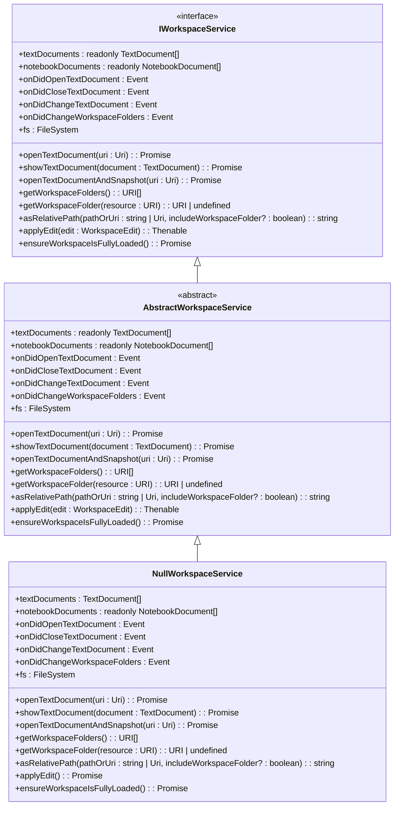
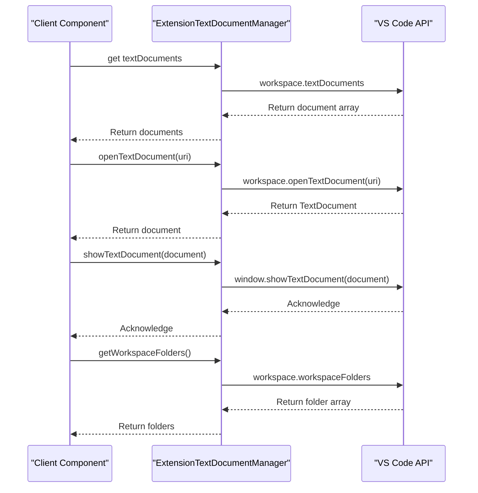
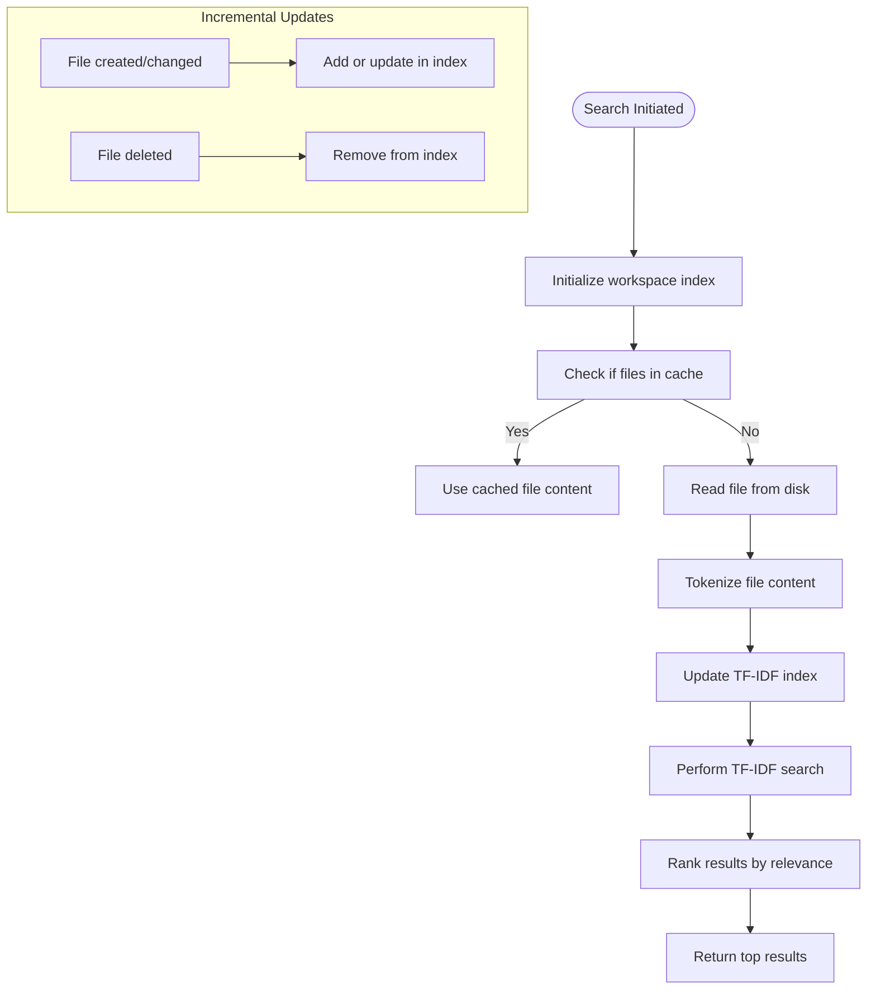
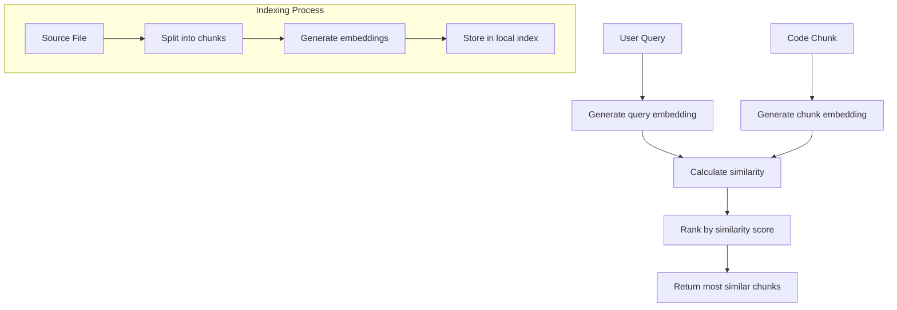
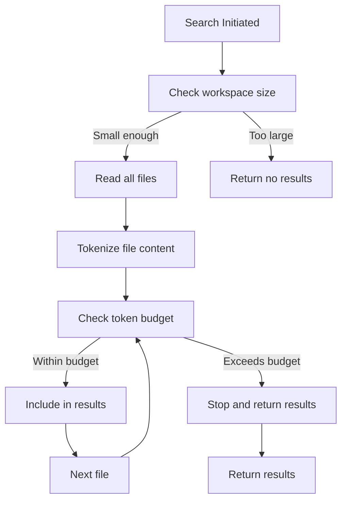
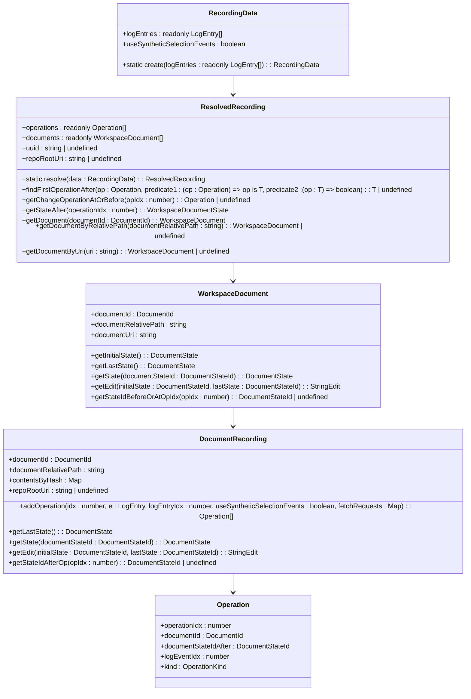

# Workspace Services

<cite>
**Referenced Files in This Document**   
- [workspaceService.ts](file://src/platform/workspace/common/workspaceService.ts)
- [workspaceServiceImpl.ts](file://src/platform/workspace/vscode/workspaceServiceImpl.ts)
- [workspaceChunkSearch.ts](file://src/platform/workspaceChunkSearch/common/workspaceChunkSearch.ts)
- [workspaceChunkSearchService.ts](file://src/platform/workspaceChunkSearch/node/workspaceChunkSearchService.ts)
- [tfidfChunkSearch.ts](file://src/platform/workspaceChunkSearch/node/tfidfChunkSearch.ts)
- [embeddingsChunkSearch.ts](file://src/platform/workspaceChunkSearch/node/embeddingsChunkSearch.ts)
- [fullWorkspaceChunkSearch.ts](file://src/platform/workspaceChunkSearch/node/fullWorkspaceChunkSearch.ts)
- [workspaceRecorder.ts](file://src/extension/workspaceRecorder/vscode-node/workspaceRecorder.ts)
- [workspaceLog.ts](file://src/extension/workspaceRecorder/common/workspaceLog.ts)
</cite>

## Table of Contents
1. [Introduction](#introduction)
2. [Workspace Service Interface](#workspace-service-interface)
3. [VS Code Implementation](#vs-code-implementation)
4. [Workspace Chunk Search Architecture](#workspace-chunk-search-architecture)
5. [Search Strategies](#search-strategies)
6. [Workspace Recorder System](#workspace-recorder-system)
7. [Performance Considerations](#performance-considerations)
8. [Conclusion](#conclusion)

## Introduction
The Workspace Services in the Platform Layer of vscode-copilot-chat provide a comprehensive system for accessing workspace information and state across different environments. These services enable core functionality such as code search, context-aware suggestions, and workspace state restoration by providing consistent interfaces to workspace data. The architecture is designed to handle large repositories efficiently through incremental indexing strategies and multiple search approaches that balance accuracy and performance. This documentation details the key components of the workspace services, including the workspace service interface, chunk search functionality, and user interaction tracking system.

## Workspace Service Interface

The workspace service interface provides a consistent abstraction layer for accessing workspace information and state across different environments. The `IWorkspaceService` interface defines the contract for workspace operations, allowing the Copilot Chat extension to interact with the editor's workspace API in a standardized way. This interface includes methods for accessing text and notebook documents, handling workspace folder operations, and managing file system interactions.

The service follows an abstract class pattern with `AbstractWorkspaceService` providing default implementations for common functionality while allowing specific implementations to override methods as needed. Key features include document management, workspace folder handling, and file system operations. The interface also provides utility methods like `asRelativePath` for path manipulation and `ensureWorkspaceIsFullyLoaded` for handling virtual workspaces.

**Diagram sources**
- [workspaceService.ts](file://src/platform/workspace/common/workspaceService.ts#L17-L227)

**Section sources**
- [workspaceService.ts](file://src/platform/workspace/common/workspaceService.ts#L1-L227)

## VS Code Implementation

The VS Code-specific implementation of the workspace service, `ExtensionTextDocumentManager`, integrates directly with the VS Code editor's workspace API. This implementation extends `AbstractWorkspaceService` and delegates most operations to the VS Code workspace and window objects. The service provides access to the current state of the editor's workspace, including open text and notebook documents, workspace folders, and file system operations.

Key aspects of the implementation include event forwarding, where workspace events from VS Code are exposed through the service interface, and direct delegation of operations like opening documents and applying workspace edits. The implementation also handles virtual workspaces by ensuring that workspace contents are fully loaded before returning, which is crucial for remote development scenarios.

**Diagram sources**
- [workspaceServiceImpl.ts](file://src/platform/workspace/vscode/workspaceServiceImpl.ts#L14-L113)

**Section sources**
- [workspaceServiceImpl.ts](file://src/platform/workspace/vscode/workspaceServiceImpl.ts#L6-L113)

## Workspace Chunk Search Architecture

The workspace chunk search system provides semantic search capabilities across the codebase by indexing and searching code chunks using multiple strategies. The architecture is centered around the `IWorkspaceChunkSearchService` interface, which coordinates different search strategies and manages the indexing process. The service implements a fallback mechanism that tries different search approaches in order of preference, ensuring that search results are available even when primary strategies fail.

The core component is `WorkspaceChunkSearchService`, which acts as a facade for multiple search strategies including embeddings-based search, TF-IDF search, and full workspace search. The service handles initialization, index state management, and search coordination. It also manages authentication requirements and telemetry for search operations.

```mermaid
classDiagram
class IWorkspaceChunkSearchService {
<<interface>>
+onDidChangeIndexState : Event<void>
+getIndexState() : Promise<WorkspaceIndexState>
+hasFastSearch(sizing : StrategySearchSizing) : Promise<boolean>
+searchFileChunks(sizing : WorkspaceChunkSearchSizing, query : WorkspaceChunkQuery, options : WorkspaceChunkSearchOptions, telemetryInfo : TelemetryCorrelationId, progress : vscode.Progress<vscode.ChatResponsePart> | undefined, token : CancellationToken) : Promise<WorkspaceChunkSearchResult>
+triggerLocalIndexing(trigger : BuildIndexTriggerReason, telemetryInfo : TelemetryCorrelationId) : Promise<Result<true, TriggerIndexingError>>
+triggerRemoteIndexing(trigger : BuildIndexTriggerReason, telemetryInfo : TelemetryCorrelationId) : Promise<Result<true, TriggerIndexingError>>
}
class WorkspaceChunkSearchService {
+_impl : WorkspaceChunkSearchServiceImpl | undefined
+tryInit(silent : boolean) : Promise<WorkspaceChunkSearchServiceImpl | undefined>
+getIndexState() : Promise<WorkspaceIndexState>
+hasFastSearch(sizing : StrategySearchSizing) : Promise<boolean>
+searchFileChunks(sizing : WorkspaceChunkSearchSizing, query : WorkspaceChunkQuery, options : WorkspaceChunkSearchOptions, telemetryInfo : TelemetryCorrelationId, progress : vscode.Progress<vscode.ChatResponsePart> | undefined, token : CancellationToken) : Promise<WorkspaceChunkSearchResult>
+triggerLocalIndexing(trigger : BuildIndexTriggerReason, telemetryInfo : TelemetryCorrelationId) : Promise<Result<true, TriggerIndexingError>>
+triggerRemoteIndexing(trigger : BuildIndexTriggerReason, telemetryInfo : TelemetryCorrelationId) : Promise<Result<true, TriggerIndexingError>>
}
class WorkspaceChunkSearchServiceImpl {
+_embeddingsIndex : WorkspaceChunkEmbeddingsIndex
+_embeddingsChunkSearch : EmbeddingsChunkSearch
+_fullWorkspaceChunkSearch : FullWorkspaceChunkSearch
+_codeSearchChunkSearch : CodeSearchChunkSearch
+_tfidfChunkSearch : TfidfChunkSearch
+_tfIdfWithSemanticChunkSearch : TfIdfWithSemanticChunkSearch
+getIndexState() : Promise<WorkspaceIndexState>
+hasFastSearch(sizing : StrategySearchSizing) : Promise<boolean>
+searchFileChunks(sizing : WorkspaceChunkSearchSizing, query : WorkspaceChunkQuery, options : WorkspaceChunkSearchOptions, telemetryInfo : TelemetryCorrelationId, progress : vscode.Progress<vscode.ChatResponsePart> | undefined, token : CancellationToken) : Promise<WorkspaceChunkSearchResult>
+triggerLocalIndexing(trigger : BuildIndexTriggerReason, telemetryInfo : TelemetryCorrelationId) : Promise<Result<true, TriggerIndexingError>>
+triggerRemoteIndexing(trigger : BuildIndexTriggerReason, telemetryInfo : TelemetryCorrelationId) : Promise<Result<true, TriggerIndexingError>>
}
IWorkspaceChunkSearchService <|-- WorkspaceChunkSearchService
WorkspaceChunkSearchService --> WorkspaceChunkSearchServiceImpl
class IWorkspaceChunkSearchStrategy {
<<interface>>
+id : WorkspaceChunkSearchStrategyId
+searchWorkspace(sizing : StrategySearchSizing, query : WorkspaceChunkQueryWithEmbeddings, options : WorkspaceChunkSearchOptions, telemetryInfo : TelemetryCorrelationId, token : CancellationToken) : Promise<StrategySearchResult | undefined>
}
IWorkspaceChunkSearchStrategy <|-- EmbeddingsChunkSearch
IWorkspaceChunkSearchStrategy <|-- FullWorkspaceChunkSearch
IWorkspaceChunkSearchStrategy <|-- CodeSearchChunkSearch
IWorkspaceChunkSearchStrategy <|-- TfidfChunkSearch
WorkspaceChunkSearchServiceImpl --> EmbeddingsChunkSearch
WorkspaceChunkSearchServiceImpl --> FullWorkspaceChunkSearch
WorkspaceChunkSearchServiceImpl --> CodeSearchChunkSearch
WorkspaceChunkSearchServiceImpl --> TfidfChunkSearch
WorkspaceChunkSearchServiceImpl --> TfIdfWithSemanticChunkSearch
```

**Diagram sources**
- [workspaceChunkSearchService.ts](file://src/platform/workspaceChunkSearch/node/workspaceChunkSearchService.ts#L74-L868)
- [workspaceChunkSearch.ts](file://src/platform/workspaceChunkSearch/common/workspaceChunkSearch.ts#L1-L115)

**Section sources**
- [workspaceChunkSearchService.ts](file://src/platform/workspaceChunkSearch/node/workspaceChunkSearchService.ts#L1-L868)
- [workspaceChunkSearch.ts](file://src/platform/workspaceChunkSearch/common/workspaceChunkSearch.ts#L1-L115)

## Search Strategies

The workspace chunk search system implements multiple search strategies to handle different scenarios and performance requirements. Each strategy is designed to balance accuracy, speed, and resource usage, with the system automatically selecting the most appropriate strategy based on the current context and workspace state.

### TF-IDF Search Strategy
The TF-IDF (Term Frequency-Inverse Document Frequency) search strategy provides keyword-based search capabilities by analyzing the frequency of terms in code files. This strategy uses a worker process to maintain an index of file contents and perform efficient text searches. The implementation includes incremental indexing, where files are added to or updated in the index as they change, and supports both full workspace searches and searches within specific file subsets.

**Diagram sources**
- [tfidfChunkSearch.ts](file://src/platform/workspaceChunkSearch/node/tfidfChunkSearch.ts#L31-L351)

### Embeddings-Based Search Strategy
The embeddings-based search strategy uses vector embeddings to find semantically similar code chunks. This approach converts both queries and code chunks into high-dimensional vectors and measures their similarity using distance metrics. The strategy is particularly effective for finding code that has similar functionality but different syntax. The implementation includes local indexing with size limits to prevent performance issues in large repositories.

**Diagram sources**
- [embeddingsChunkSearch.ts](file://src/platform/workspaceChunkSearch/node/embeddingsChunkSearch.ts#L52-L417)

### Full Workspace Search Strategy
The full workspace search strategy attempts to include the entire workspace content when there is sufficient token budget. This approach is used for small repositories or when high completeness is required. The strategy performs a direct scan of all files in the workspace, calculating token usage as it goes, and stops when the token budget is reached. This ensures that the most relevant files are included while respecting token limitations.

**Diagram sources**
- [fullWorkspaceChunkSearch.ts](file://src/platform/workspaceChunkSearch/node/fullWorkspaceChunkSearch.ts#L28-L194)

**Section sources**
- [tfidfChunkSearch.ts](file://src/platform/workspaceChunkSearch/node/tfidfChunkSearch.ts#L1-L351)
- [embeddingsChunkSearch.ts](file://src/platform/workspaceChunkSearch/node/embeddingsChunkSearch.ts#L1-L417)
- [fullWorkspaceChunkSearch.ts](file://src/platform/workspaceChunkSearch/node/fullWorkspaceChunkSearch.ts#L1-L194)

## Workspace Recorder System

The workspace recorder system tracks user interactions and code changes to preserve context for AI-assisted development. This system captures a detailed history of document changes, selections, and other editor events, allowing the Copilot Chat extension to understand the user's workflow and provide context-aware suggestions. The recorded data includes document states, edit operations, and interaction patterns, which can be used to reconstruct the user's development session.

The implementation uses a structured logging approach where events are recorded in a JSONL format, with each line representing a discrete event in the development process. The system captures both explicit actions (like code edits) and implicit context (like cursor movements and selections), providing a comprehensive view of the user's interaction with the codebase.

**Diagram sources**
- [resolvedRecording.ts](file://src/extension/workspaceRecorder/common/resolvedRecording/resolvedRecording.ts#L1-L217)

**Section sources**
- [workspaceRecorder.ts](file://src/extension/workspaceRecorder/vscode-node/workspaceRecorder.ts#L1-L500)
- [workspaceLog.ts](file://src/extension/workspaceRecorder/common/workspaceLog.ts#L1-L200)
- [resolvedRecording.ts](file://src/extension/workspaceRecorder/common/resolvedRecording/resolvedRecording.ts#L1-L217)

## Performance Considerations

The workspace services are designed with performance in mind, particularly for large repositories where indexing and search operations can be resource-intensive. The system implements several strategies to optimize performance and ensure responsiveness:

1. **Incremental Indexing**: Instead of re-indexing the entire workspace on every change, the system uses incremental updates to modify the index only for changed files. This significantly reduces the computational overhead of maintaining the search index.

2. **Strategy Fallback**: The search system employs a fallback mechanism that tries multiple search strategies in order of preference. If a primary strategy fails or times out, the system automatically falls back to alternative approaches, ensuring that search results are available even under suboptimal conditions.

3. **Size Limits**: To prevent performance issues in very large repositories, the system implements file count limits for different indexing strategies. For example, embeddings-based search is limited to smaller workspaces to avoid excessive memory usage and indexing time.

4. **Caching**: The system uses caching at multiple levels, including file content caching and result caching, to avoid redundant operations and improve response times for repeated queries.

5. **Asynchronous Operations**: Most operations are performed asynchronously to prevent blocking the main thread and ensure that the editor remains responsive during indexing and search operations.

6. **Telemetry and Monitoring**: Comprehensive telemetry is implemented to monitor performance metrics and identify bottlenecks. This data is used to optimize the system and make informed decisions about strategy selection and resource allocation.

## Conclusion
The Workspace Services in the Platform Layer of vscode-copilot-chat provide a robust foundation for AI-assisted development features. By offering a consistent interface for accessing workspace information and implementing sophisticated search and context preservation capabilities, these services enable powerful features like code search, context-aware suggestions, and workspace state restoration. The architecture balances performance and functionality through multiple search strategies, incremental indexing, and comprehensive user interaction tracking. As the system continues to evolve, these services will play a crucial role in enhancing developer productivity and enabling more intelligent coding assistance.