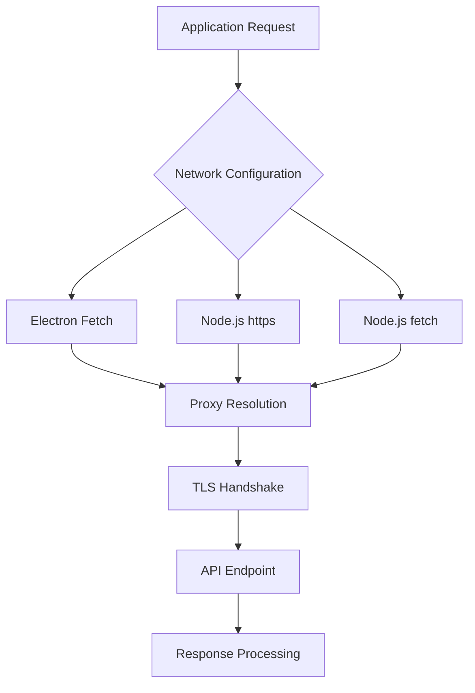
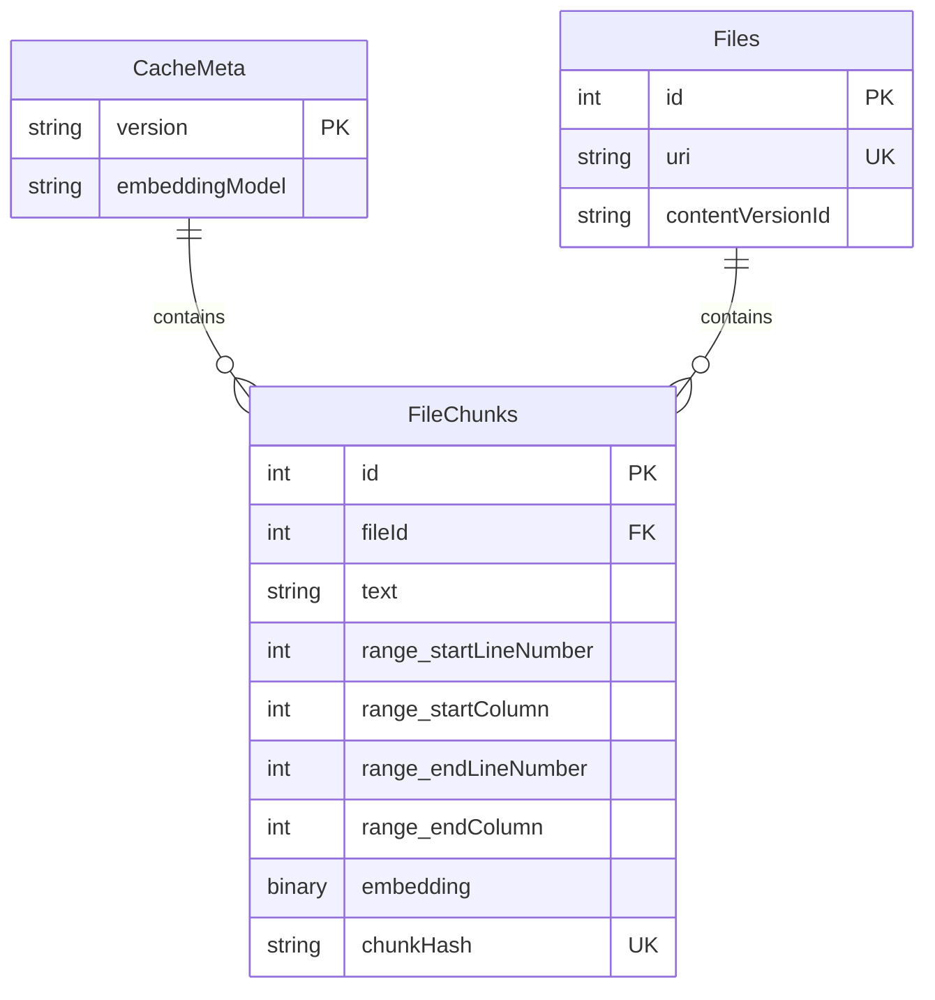
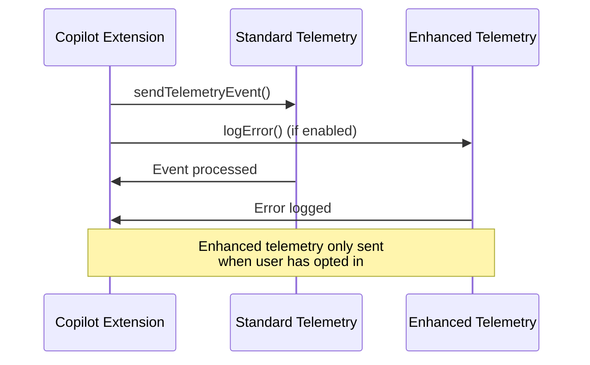

# Advanced Configuration

<cite>
**Referenced Files in This Document**   
- [configurationService.ts](file://src/platform/configuration/common/configurationService.ts)
- [loggingActions.ts](file://src/extension/log/vscode-node/loggingActions.ts)
- [workspaceChunkAndEmbeddingCache.ts](file://src/platform/workspaceChunkSearch/node/workspaceChunkAndEmbeddingCache.ts)
- [ghTelemetryService.ts](file://src/platform/telemetry/common/ghTelemetryService.ts)
- [ghTelemetrySender.ts](file://src/platform/telemetry/common/ghTelemetrySender.ts)
</cite>

## Table of Contents
1. [Introduction](#introduction)
2. [Advanced Configuration Overview](#advanced-configuration-overview)
3. [Network Behavior Configuration](#network-behavior-configuration)
4. [Caching Strategies](#caching-strategies)
5. [Logging and Telemetry Configuration](#logging-and-telemetry-configuration)
6. [Performance Tuning Options](#performance-tuning-options)
7. [Enterprise Deployment Scenarios](#enterprise-deployment-scenarios)
8. [Monitoring and Diagnostics](#monitoring-and-diagnostics)
9. [Risk Management and Troubleshooting](#risk-management-and-troubleshooting)
10. [System Resource Interactions](#system-resource-interactions)

## Introduction
The vscode-copilot-chat extension provides a comprehensive set of advanced configuration options that allow users to fine-tune the extension's behavior for specific environments and use cases. These advanced settings control critical aspects such as network behavior, caching strategies, logging verbosity, and performance characteristics. This document details the low-level configuration options available for optimizing the extension in various scenarios, including enterprise deployments, restricted networks, and high-security environments. The advanced configuration system is designed to provide maximum flexibility while maintaining security and performance considerations.

**Section sources**
- [configurationService.ts](file://src/platform/configuration/common/configurationService.ts#L25-L892)

## Advanced Configuration Overview
The advanced configuration system in vscode-copilot-chat is organized into multiple namespaces, with settings categorized by their accessibility and purpose. The configuration framework supports three main categories: public advanced settings, team-internal settings, and experiment-based configurations. Public advanced settings are available to all users and are designed for common optimization scenarios. Team-internal settings are restricted to Microsoft team members and internal users, providing access to experimental features and debugging tools. Experiment-based configurations allow for A/B testing of features and can be toggled based on user participation in specific experiments.

The configuration system follows a hierarchical structure with settings organized under the `github.copilot` namespace. Advanced settings are specifically grouped under the `github.copilot.advanced` prefix, making them easily identifiable. The system supports both flat-style configuration (e.g., "github.copilot.advanced.debug.useElectronFetcher") and object-style configuration (e.g., "github.copilot.advanced": { "debug.useElectronFetcher": false }), providing flexibility in how settings are defined in the user's configuration files.

**Section sources**
- [configurationService.ts](file://src/platform/configuration/common/configurationService.ts#L600-L800)

## Network Behavior Configuration
The network behavior of the vscode-copilot-chat extension can be extensively customized through advanced configuration options. These settings control how the extension establishes connections to the Copilot service, handles proxy configurations, and manages different fetcher implementations. The extension supports multiple fetcher implementations, including Electron fetch, Node.js https, and Node.js fetch, allowing users to select the most appropriate networking layer for their environment.

Key network configuration options include:
- `github.copilot.advanced.debug.overrideProxyUrl`: Allows overriding the proxy URL used for network requests
- `github.copilot.advanced.debug.useNodeFetchFetcher`: Enables or disables the use of Node.js fetch implementation
- `github.copilot.advanced.debug.useNodeFetcher`: Controls the use of Node.js https implementation
- `github.copilot.advanced.debug.useElectronFetcher`: Determines whether to use Electron's fetch implementation

The extension includes comprehensive network diagnostics capabilities that can be accessed through the logging system. These diagnostics provide detailed information about DNS lookups, proxy resolution, TLS connections, and network connectivity to various endpoints. The network configuration system also supports certificate management, allowing the extension to load system certificates when required for secure connections through corporate proxies.

**Diagram sources**
- [loggingActions.ts](file://src/extension/log/vscode-node/loggingActions.ts#L110-L373)

**Section sources**
- [loggingActions.ts](file://src/extension/log/vscode-node/loggingActions.ts#L110-L373)

## Caching Strategies
The vscode-copilot-chat extension implements a sophisticated caching system to optimize performance and reduce redundant network requests. The caching strategy is configurable through advanced settings that control cache behavior, storage locations, and eviction policies. The system uses SQLite databases for persistent storage, with separate databases for base cache and layered caches to support different caching scenarios.

The workspace chunk and embedding cache is a critical component that stores pre-processed code chunks and their embeddings for semantic search and code completion. This cache is automatically managed and versioned, with automatic clearing when the cache version or embedding model changes. The cache structure includes tables for files and file chunks, with foreign key relationships to maintain data integrity. Indexes are created on frequently queried fields to optimize performance.

Key caching configuration options include:
- `github.copilot.advanced.workspace.maxLocalIndexSize`: Controls the maximum size of the local workspace index
- `github.copilot.advanced.workspace.enableFullWorkspace`: Enables or disables full workspace indexing
- `github.copilot.advanced.workspace.enableCodeSearch`: Toggles code search functionality
- `github.copilot.advanced.workspace.enableEmbeddingsSearch`: Controls embeddings-based search

The caching system also supports garbage collection operations to clean up unused cache entries and optimize storage usage. The cache can be configured to use external cache layers through environment variables, allowing for shared cache configurations in team environments.

**Diagram sources**
- [workspaceChunkAndEmbeddingCache.ts](file://src/platform/workspaceChunkSearch/node/workspaceChunkAndEmbeddingCache.ts#L134-L170)

**Section sources**
- [workspaceChunkAndEmbeddingCache.ts](file://src/platform/workspaceChunkSearch/node/workspaceChunkAndEmbeddingCache.ts#L56-L170)

## Logging and Telemetry Configuration
The logging and telemetry system in vscode-copilot-chat provides detailed insights into the extension's operation and can be configured through advanced settings to control verbosity and data collection. The telemetry framework supports both standard and enhanced telemetry, with different data collection policies based on user privacy preferences. Enhanced telemetry includes more detailed diagnostic information and is only sent when users have explicitly opted in to enhanced data collection.

Key telemetry configuration options include:
- `github.copilot.advanced.debug.collectFetcherTelemetry`: Enables collection of detailed fetcher telemetry
- `github.copilot.advanced.debug.reportFeedback`: Allows reporting of feedback issues (team members only)
- `github.copilot.advanced.editRecording.enabled`: Controls whether edit recording is enabled
- `github.copilot.advanced.localWorkspaceRecording.enabled`: Toggles local workspace recording

The telemetry system implements a secure data transmission model, with sensitive information redacted before transmission. The system can send telemetry events through both standard and secure channels, with the secure channel used for enhanced telemetry data. Exception telemetry is handled specially, with placeholder events sent through the standard channel and detailed error information sent through the secure channel when enabled.

**Diagram sources**
- [ghTelemetryService.ts](file://src/platform/telemetry/common/ghTelemetryService.ts#L20-L166)
- [ghTelemetrySender.ts](file://src/platform/telemetry/common/ghTelemetrySender.ts#L80-L132)

**Section sources**
- [ghTelemetryService.ts](file://src/platform/telemetry/common/ghTelemetryService.ts#L20-L166)
- [ghTelemetrySender.ts](file://src/platform/telemetry/common/ghTelemetrySender.ts#L80-L132)

## Performance Tuning Options
The performance of the vscode-copilot-chat extension can be optimized through various advanced configuration settings that control resource usage, request timing, and processing strategies. These options allow users to balance responsiveness with system resource consumption based on their specific hardware and usage patterns.

Key performance tuning options include:
- `github.copilot.advanced.inlineEdits.debounce`: Controls the debounce time for inline edits (default: 200ms)
- `github.copilot.advanced.inlineEdits.cacheDelay`: Sets the delay before caching inline edit responses
- `github.copilot.advanced.inlineEdits.subsequentCacheDelay`: Configures cache delay for subsequent requests
- `github.copilot.advanced.inlineEdits.rebasedCacheDelay`: Sets cache delay for rebased requests
- `github.copilot.advanced.inlineEdits.backoffDebounceEnabled`: Enables backoff debouncing for inline edits

The extension also provides options to control the context window size and model selection, which directly impact performance and quality of responses. The `github.copilot.advanced.debug.overrideChatMaxTokenNum` setting allows forcing a specific context window size, while `github.copilot.advanced.debug.overrideChatEngine` enables using a specific AI model. These settings should be used with caution as they may lead to different experiences compared to standard users.

**Section sources**
- [configurationService.ts](file://src/platform/configuration/common/configurationService.ts#L693-L780)

## Enterprise Deployment Scenarios
The advanced configuration system supports enterprise deployment scenarios through specific settings that address common enterprise requirements such as proxy configurations, authentication modes, and security policies. For GitHub Enterprise deployments, the extension provides configuration options to specify the enterprise instance URL and authentication provider.

Enterprise-specific configuration options include:
- `github.copilot.advanced.authProvider`: Sets the authentication provider (GitHub, GitHub Enterprise, or Microsoft)
- `github-enterprise.uri`: Specifies the GitHub Enterprise instance URL
- `github.copilot.advanced.authPermissions`: Configures authentication permission mode (default or minimal)

The extension also supports Azure authentication modes for enterprise scenarios, including Entra ID and API key authentication. These modes can be configured through the `AzureAuthMode` enum and associated settings. For high-security environments, the extension provides lockdown modes for MCP (Model Context Protocol) servers, which can be configured to run in readonly or lockdown modes to restrict functionality.

**Section sources**
- [configurationService.ts](file://src/platform/configuration/common/configurationService.ts#L569-L590)
- [githubMcpDefinitionProvider.ts](file://src/extension/githubMcp/common/githubMcpDefinitionProvider.ts#L1-L18)

## Monitoring and Diagnostics
The vscode-copilot-chat extension includes comprehensive monitoring and diagnostic capabilities that can be accessed through advanced configuration settings. These tools provide insights into the extension's operation, network connectivity, and performance characteristics. The diagnostic system can generate detailed reports about network connectivity, including DNS lookup times, proxy resolution, TLS handshake performance, and connection success rates.

Key diagnostic configuration options include:
- `github.copilot.advanced.debug.requestLogger.maxEntries`: Controls the maximum number of entries in the request logger
- `github.copilot.advanced.inlineEdits.logContextRecorder.enabled`: Enables context recorder logging (team members only)
- `github.copilot.advanced.inlineEdits.logCancelledRequests`: Logs cancelled requests (team members only)

The extension also provides a network connectivity diagnostic tool that tests connections to various endpoints, including DNS resolution, proxy configuration, and direct API connectivity. This tool can help identify network issues in restricted environments and provides detailed timing information for each step of the connection process.

**Section sources**
- [loggingActions.ts](file://src/extension/log/vscode-node/loggingActions.ts#L110-L373)

## Risk Management and Troubleshooting
Modifying advanced configuration settings carries potential risks that should be understood before making changes. Incorrect network configurations can prevent the extension from connecting to the Copilot service, while aggressive caching settings may lead to excessive disk usage. Performance tuning options can impact system responsiveness if set to extreme values.

Common issues and troubleshooting steps:
- **Network connectivity issues**: Verify proxy settings and test connectivity using the diagnostic tools
- **Authentication failures**: Check authentication provider configuration and token validity
- **Performance degradation**: Reset performance tuning settings to defaults and monitor resource usage
- **Cache corruption**: Clear the cache directory and restart the extension

When troubleshooting issues, it's recommended to modify one setting at a time and test the results before making additional changes. For enterprise deployments, changes should be tested in a staging environment before rolling out to production. The telemetry and logging systems can provide valuable diagnostic information when investigating issues.

**Section sources**
- [loggingActions.ts](file://src/extension/log/vscode-node/loggingActions.ts#L110-L373)
- [ghTelemetryService.ts](file://src/platform/telemetry/common/ghTelemetryService.ts#L20-L166)

## System Resource Interactions
The advanced configuration options in vscode-copilot-chat directly impact system resource usage, including CPU, memory, disk I/O, and network bandwidth. Understanding these interactions is crucial for optimizing the extension's performance in different environments. The caching system, for example, trades disk space for reduced network requests and faster response times, while the telemetry system balances diagnostic information collection with privacy considerations.

The extension's resource usage can be tuned through configuration settings that control:
- Cache size and retention policies
- Network request frequency and batching
- Background processing and indexing
- Memory usage for context storage

In resource-constrained environments, users can adjust these settings to minimize the extension's footprint, while in high-performance environments, they can be optimized for maximum responsiveness and feature richness. The system resource interactions are designed to be transparent, with clear documentation of how each setting affects resource usage.

**Section sources**
- [workspaceChunkAndEmbeddingCache.ts](file://src/platform/workspaceChunkSearch/node/workspaceChunkAndEmbeddingCache.ts#L56-L170)
- [configurationService.ts](file://src/platform/configuration/common/configurationService.ts#L600-L800)