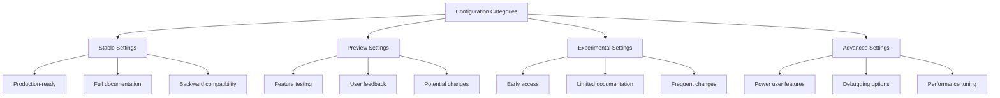
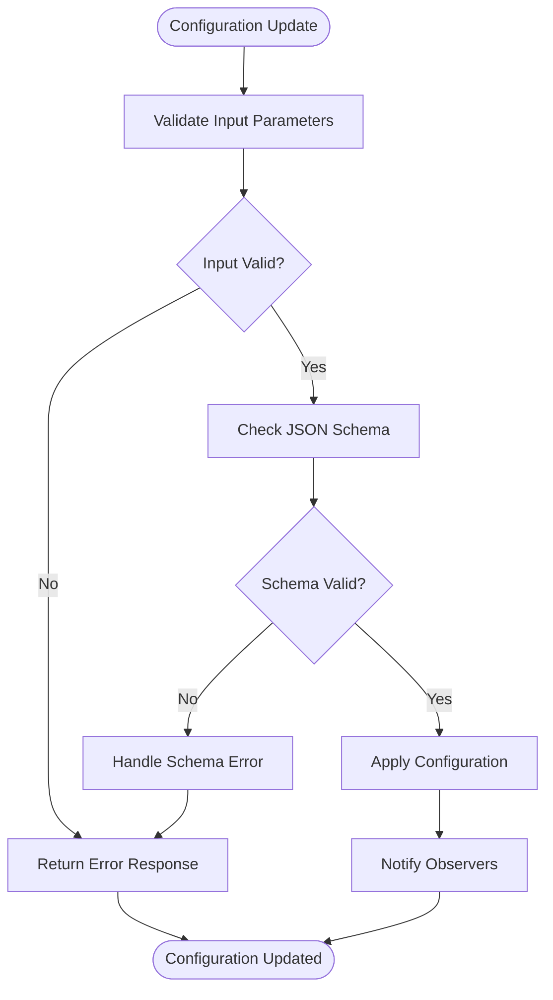
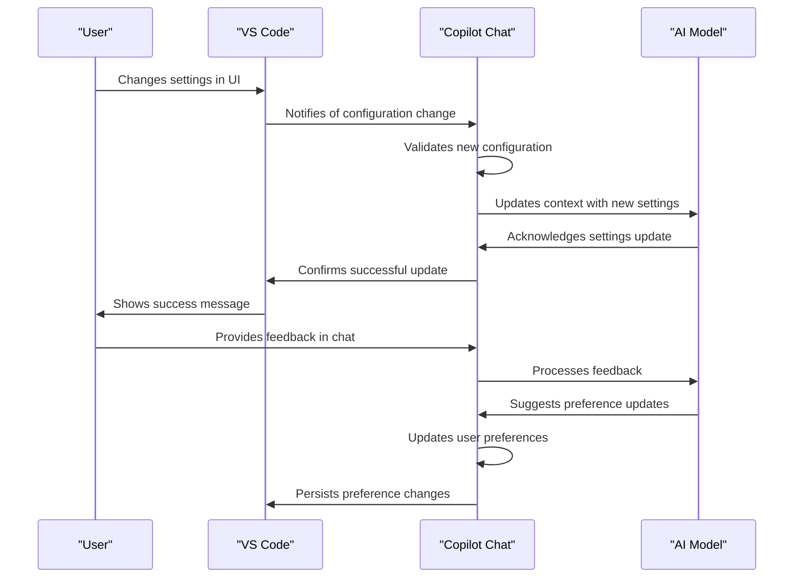

# Configuration

<cite>
**Referenced Files in This Document**   
- [configurationService.ts](file://src/platform/configuration/common/configurationService.ts)
- [configurationServiceImpl.ts](file://src/platform/configuration/vscode/configurationServiceImpl.ts)
- [jsonSchema.ts](file://src/platform/configuration/common/jsonSchema.ts)
- [validator.ts](file://src/platform/configuration/common/validator.ts)
- [configurationMigration.ts](file://src/extension/configuration/vscode-node/configurationMigration.ts)
- [settingsSchemaFeature.ts](file://src/extension/settingsSchema/vscode-node/settingsSchemaFeature.ts)
- [package.json](file://package.json)
- [configurations.spec.ts](file://src/extension/test/node/configurations.spec.ts)
</cite>

## Table of Contents
1. [Introduction](#introduction)
2. [Configuration Architecture](#configuration-architecture)
3. [Configuration Categories](#configuration-categories)
4. [Configuration Options](#configuration-options)
5. [Configuration Validation and Error Handling](#configuration-validation-and-error-handling)
6. [Environment and User Preference Interactions](#environment-and-user-preference-interactions)
7. [Configuration Management Best Practices](#configuration-management-best-practices)
8. [Troubleshooting Configuration Issues](#troubleshooting-configuration-issues)

## Introduction
The vscode-copilot-chat extension provides a comprehensive configuration system that enables users to customize the behavior of AI-powered chat features. The configuration system is designed with a clear categorization structure that separates settings into stable, preview, experimental, and advanced features. This documentation provides a detailed overview of the configuration architecture, available options, and best practices for managing settings effectively.

**Section sources**
- [package.json](file://package.json#L141-L339)
- [configurations.spec.ts](file://src/extension/test/node/configurations.spec.ts#L11-L28)

## Configuration Architecture
The configuration system in vscode-copilot-chat is built on a robust architecture that provides type safety, validation, and seamless integration with VS Code's configuration API. The core of the system is implemented in the `IConfigurationService` interface, which defines methods for getting, setting, and observing configuration values.

The architecture supports multiple configuration types, including simple configurations and experiment-based configurations. Simple configurations use default values defined in code or package.json, while experiment-based configurations can be influenced by experimentation services that allow for A/B testing of different settings.

```mermaid
classDiagram
class IConfigurationService {
+_serviceBrand : undefined
+getConfig<T>(key : Config<T>, scope? : ConfigurationScope) : T
+getConfigObservable<T>(key : Config<T>) : IObservable<T>
+inspectConfig<T>(key : BaseConfig<T>, scope? : ConfigurationScope) : InspectConfigResult<T> | undefined
+isConfigured<T>(key : BaseConfig<T>, scope? : ConfigurationScope) : boolean
+getNonExtensionConfig<T>(configKey : string) : T | undefined
+setConfig<T>(key : BaseConfig<T>, value : T) : Thenable<void>
+getExperimentBasedConfig<T extends ExperimentBasedConfigType>(key : ExperimentBasedConfig<T>, experimentationService : IExperimentationService, scope? : ConfigurationScope) : T
+getExperimentBasedConfigObservable<T extends ExperimentBasedConfigType>(key : ExperimentBasedConfig<T>, experimentationService : IExperimentationService) : IObservable<T>
+getConfigMixedWithDefaults<T>(key : Config<T>) : T
+getDefaultValue<T>(key : Config<T>) : T
+getDefaultValue<T extends ExperimentBasedConfigType>(key : ExperimentBasedConfig<T>) : T
+onDidChangeConfiguration : Event<ConfigurationChangeEvent>
+updateExperimentBasedConfiguration(treatments : string[]) : void
+dumpConfig() : { [key : string] : string }
}
class AbstractConfigurationService {
<<abstract>>
+_serviceBrand : undefined
+_onDidChangeConfiguration : Emitter<ConfigurationChangeEvent>
+onDidChangeConfiguration : Event<ConfigurationChangeEvent>
+_isInternal : boolean
+_isTeamMember : boolean
+getConfigMixedWithDefaults<T>(key : Config<T>) : T
+getDefaultValue<T>(key : BaseConfig<T>) : T
+_setUserInfo(userInfo : { isInternal : boolean; isTeamMember : boolean; teamMemberUsername? : string }) : void
+_isUsingTeamDefault(key : BaseConfig<any>) : boolean
+isConfigured<T>(key : BaseConfig<T>, scope? : ConfigurationScope) : boolean
+getConfig<T>(key : Config<T>, scope? : ConfigurationScope) : T
+inspectConfig<T>(key : BaseConfig<T>, scope? : ConfigurationScope) : InspectConfigResult<T> | undefined
+getNonExtensionConfig<T>(configKey : string) : T | undefined
+setConfig<T>(key : BaseConfig<T>, value : T) : Thenable<void>
+getExperimentBasedConfig<T extends ExperimentBasedConfigType>(key : ExperimentBasedConfig<T>, experimentationService : IExperimentationService) : T
+dumpConfig() : { [key : string] : string }
+updateExperimentBasedConfiguration(treatments : string[]) : void
+getConfigObservable<T>(key : Config<T>) : IObservable<T>
+getExperimentBasedConfigObservable<T extends ExperimentBasedConfigType>(key : ExperimentBasedConfig<T>, experimentationService : IExperimentationService) : IObservable<T>
+_getObservable_$show2FramesUp<T>(key : BaseConfig<T>, getValue : () => T) : IObservable<T>
}
class ConfigurationServiceImpl {
+config : WorkspaceConfiguration
+getConfig<T>(key : Config<T>, scope? : vscode.ConfigurationScope) : T
+inspectConfig<T>(key : BaseConfig<T>, scope? : vscode.ConfigurationScope) : InspectConfigResult<T> | undefined
+getNonExtensionConfig<T>(configKey : string) : T | undefined
+setConfig<T>(key : BaseConfig<T>, value : T) : Thenable<void>
+getExperimentBasedConfig<T extends ExperimentBasedConfigType>(key : ExperimentBasedConfig<T>, experimentationService : IExperimentationService, scope? : vscode.ConfigurationScope) : T
+_getUserConfiguredValueForExperimentBasedConfig<T extends ExperimentBasedConfigType>(key : ExperimentBasedConfig<T>, scope? : vscode.ConfigurationScope) : T | undefined
+dumpConfig() : { [key : string] : string }
+updateExperimentBasedConfiguration(treatments : string[]) : void
}
class DefaultsOnlyConfigurationService {
+getConfig<T>(key : Config<T>) : T
+inspectConfig<T>(key : BaseConfig<T>, scope? : ConfigurationScope) : InspectConfigResult<T> | undefined
+setConfig() : Promise<void>
+getNonExtensionConfig<T>(configKey : string) : T | undefined
+getExperimentBasedConfig<T extends ExperimentBasedConfigType>(key : ExperimentBasedConfig<T>, experimentationService : IExperimentationService, scope? : ConfigurationScope) : T
+dumpConfig() : { [key : string] : string }
}
IConfigurationService <|-- AbstractConfigurationService
AbstractConfigurationService <|-- ConfigurationServiceImpl
AbstractConfigurationService <|-- DefaultsOnlyConfigurationService
```

**Diagram sources**
- [configurationService.ts](file://src/platform/configuration/common/configurationService.ts#L79-L163)
- [configurationServiceImpl.ts](file://src/platform/configuration/vscode/configurationServiceImpl.ts#L22-L315)

## Configuration Categories
The configuration system categorizes settings into four distinct categories: stable, preview, experimental, and advanced. Each category serves a specific purpose and has different stability guarantees.

### Stable Settings
Stable settings are fully tested and supported features that are available to all users. These settings are considered production-ready and are unlikely to change in backward-incompatible ways.

### Preview Settings
Preview settings are features that are being tested with a broader audience before being promoted to stable status. These settings may change or be removed in future releases based on user feedback.

### Experimental Settings
Experimental settings are early-stage features that are only available to users who explicitly enable them. These settings are subject to frequent changes and may have limited documentation.

### Advanced Settings
Advanced settings are intended for power users and developers who need fine-grained control over the extension's behavior. These settings may include debugging options, performance tuning parameters, and integration settings.



**Diagram sources**
- [package.json](file://package.json#L141-L339)
- [configurations.spec.ts](file://src/extension/test/node/configurations.spec.ts#L12-L28)

## Configuration Options
The extension provides a comprehensive set of configuration options that control various aspects of its behavior, including chat functionality, code generation, and AI model selection.

### Chat Behavior Settings
These settings control the behavior of the chat interface and conversation management.

| Setting | Default Value | Valid Range | Description |
|-------|-------------|-----------|-------------|
| github.copilot.chat.enableUserPreferences | false | boolean | Enables user preferences to be updated based on chat history |
| github.copilot.chat.feedback.onChange | false | boolean | Enables feedback collection when chat responses change |
| github.copilot.chat.review.intent | false | boolean | Enables review intent detection in chat conversations |

### Code Generation Settings
These settings control the code generation capabilities of the extension.

| Setting | Default Value | Valid Range | Description |
|-------|-------------|-----------|-------------|
| github.copilot.chat.codeGeneration.instructions | [] | array of objects | Custom instructions for code generation |
| github.copilot.chat.codeGeneration.useInstructionFiles | false | boolean | Enables the use of instruction files for code generation |
| github.copilot.chat.generateTests.codeLens | true | boolean | Shows code lens for test generation |

### AI Model Selection Settings
These settings control which AI models are used for different tasks.

| Setting | Default Value | Valid Range | Description |
|-------|-------------|-----------|-------------|
| github.copilot.chat.useResponsesApi | true | boolean | Uses the Responses API instead of Chat Completions when supported |
| github.copilot.chat.responsesApiReasoningEffort | 'default' | 'low', 'medium', 'high', 'default' | Configures reasoning effort sent to Responses API |
| github.copilot.chat.responsesApiReasoningSummary | 'detailed' | 'off', 'detailed' | Configures reasoning summary style sent to Responses API |

### Advanced Settings
These settings provide fine-grained control over advanced features and debugging options.

| Setting | Default Value | Valid Range | Description |
|-------|-------------|-----------|-------------|
| github.copilot.advanced.debug.overrideProxyUrl | undefined | string | Overrides the base domain for CAPI requests |
| github.copilot.advanced.debug.overrideCapiUrl | undefined | string | Overrides the CAPI URL for development |
| github.copilot.advanced.authProvider | 'github' | 'github', 'github-enterprise', 'microsoft' | Sets the authentication provider |

**Section sources**
- [configurationService.ts](file://src/platform/configuration/common/configurationService.ts#L600-L800)
- [package.json](file://package.json#L141-L339)

## Configuration Validation and Error Handling
The configuration system includes robust validation and error handling mechanisms to ensure that settings are correctly formatted and within valid ranges.

### Validation Process
The validation process uses a combination of JSON Schema and custom validators to ensure configuration integrity. The system defines validators for different data types, including strings, numbers, booleans, arrays, and objects.



**Diagram sources**
- [validator.ts](file://src/platform/configuration/common/validator.ts#L8-L292)
- [configurationServiceImpl.ts](file://src/platform/configuration/vscode/configurationServiceImpl.ts#L106-L117)

### Error Handling
When configuration validation fails, the system logs detailed error messages and falls back to default values. This ensures that the extension remains functional even when invalid configurations are provided.

The error handling system includes:
- Type validation for primitive values
- Schema validation for complex objects
- Range validation for numeric values
- Enum validation for string values with limited options

**Section sources**
- [validator.ts](file://src/platform/configuration/common/validator.ts#L8-L292)
- [configurationServiceImpl.ts](file://src/platform/configuration/vscode/configurationServiceImpl.ts#L110-L114)

## Environment and User Preference Interactions
The configuration system is designed to work seamlessly across different environments and respect user preferences.

### Local vs Remote Environments
The configuration system supports both local and remote development environments, including containers and remote workspaces. Settings are synchronized across environments when possible, but some settings may be environment-specific.

### User Preference Integration
User preferences are integrated into the configuration system through the `updateUserPreferences` tool, which allows the AI to learn from user interactions and adapt its behavior accordingly.



**Diagram sources**
- [configurationServiceImpl.ts](file://src/platform/configuration/vscode/configurationServiceImpl.ts#L29-L47)
- [settingsSchemaFeature.ts](file://src/extension/settingsSchema/vscode-node/settingsSchemaFeature.ts#L23-L28)

## Configuration Management Best Practices
To ensure optimal performance and reliability, follow these best practices when managing configuration settings.

### Setting Organization
Organize settings in your configuration files using a consistent structure. Group related settings together and use comments to explain the purpose of each setting.

### Version Control
Include configuration files in version control when they contain settings that should be shared across a team. Use `.gitignore` to exclude sensitive information or machine-specific settings.

### Environment-Specific Settings
Use workspace settings for environment-specific configurations and user settings for personal preferences. This ensures that team members can share common configurations while maintaining their personal preferences.

### Testing Configuration Changes
Test configuration changes in a development environment before applying them to production. Use the preview settings category to test new features before enabling them for all users.

**Section sources**
- [configurationServiceImpl.ts](file://src/platform/configuration/vscode/configurationServiceImpl.ts#L169-L206)
- [configurationMigration.ts](file://src/extension/configuration/vscode-node/configurationMigration.ts#L41-L58)

## Troubleshooting Configuration Issues
When encountering configuration issues, follow these steps to diagnose and resolve the problem.

### Common Issues and Solutions
- **Setting not taking effect**: Verify that the setting name is correct and that there are no typos. Check if the setting is being overridden by a more specific scope (workspace vs user).
- **Invalid value error**: Check the valid range for the setting and ensure the value is within the expected range. Refer to the documentation for the correct data type.
- **Setting not appearing in UI**: Some advanced settings may not appear in the settings UI. Use the JSON editor to modify these settings directly.

### Diagnostic Tools
The extension provides several diagnostic tools to help troubleshoot configuration issues:
- Configuration validation messages in the developer console
- Detailed error messages when invalid configurations are detected
- The ability to inspect configuration values programmatically

### Resetting to Defaults
If configuration issues persist, you can reset settings to their default values by removing them from your configuration files or using the "Reset Setting" option in the VS Code settings UI.

**Section sources**
- [configurationServiceImpl.ts](file://src/platform/configuration/vscode/configurationServiceImpl.ts#L110-L114)
- [configurationService.ts](file://src/platform/configuration/common/configurationService.ts#L148-L152)