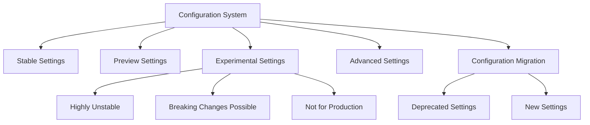
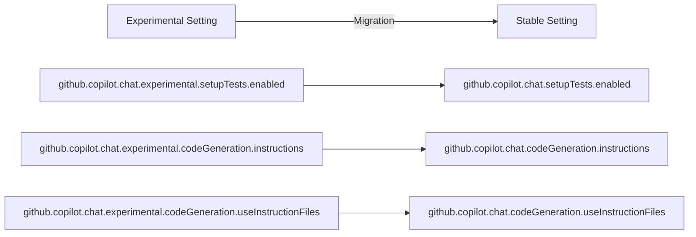
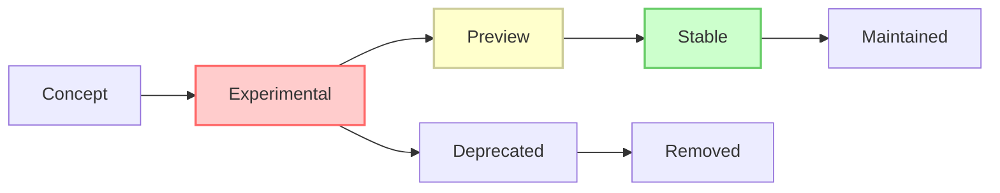

# Experimental Features

<cite>
**Referenced Files in This Document**   
- [package.json](file://package.json)
- [configurationMigration.ts](file://src/extension/configuration/vscode-node/configurationMigration.ts)
- [configurationService.ts](file://src/platform/configuration/common/configurationService.ts)
- [configurations.spec.ts](file://src/extension/test/node/configurations.spec.ts)
- [settingsSchemaFeature.ts](file://src/extension/settingsSchema/vscode-node/settingsSchemaFeature.ts)
</cite>

## Table of Contents
1. [Introduction](#introduction)
2. [Experimental Configuration Overview](#experimental-configuration-overview)
3. [Enabling Experimental Features](#enabling-experimental-features)
4. [Experimental Settings and Default Values](#experimental-settings-and-default-values)
5. [Configuration Migration and Deprecation](#configuration-migration-and-deprecation)
6. [Diagnostic Information Collection](#diagnostic-information-collection)
7. [Reporting Bugs and Providing Feedback](#reporting-bugs-and-providing-feedback)
8. [Lifecycle of Experimental Features](#lifecycle-of-experimental-features)

## Introduction
The vscode-copilot-chat extension includes experimental features designed to test new AI capabilities and user interfaces. These features are highly unstable and subject to breaking changes without notice. This documentation provides comprehensive information about the experimental configuration system, including how to enable these features, their risks, and the process for providing feedback. Experimental features are intended for testing purposes only and should not be used in any environment containing important work.

**Section sources**
- [package.json](file://package.json#L2373-L2450)

## Experimental Configuration Overview
The vscode-copilot-chat extension organizes its configuration settings into four distinct sections: stable, preview, experimental, and advanced. The experimental section specifically contains features that are in active development and testing. These settings are tagged with 'experimental' in the package.json file and are not recommended for production use. The configuration system is designed to allow Microsoft and select users to test new functionality before it is released to the broader user base.

The experimental features are governed by a sophisticated configuration management system that supports experimentation through treatment variables and feature flags. This system allows for controlled rollouts of new features to specific user segments. The configuration service integrates with an experimentation service that can override settings based on server-side configurations, enabling A/B testing of different feature implementations.

**Diagram sources **
- [package.json](file://package.json#L2373-L2450)
- [configurationMigration.ts](file://src/extension/configuration/vscode-node/configurationMigration.ts#L115-L143)

**Section sources**
- [package.json](file://package.json#L2373-L2450)
- [configurations.spec.ts](file://src/extension/test/node/configurations.spec.ts#L12-L27)

## Enabling Experimental Features
To enable experimental features in the vscode-copilot-chat extension, users must modify their VS Code settings to include experimental configuration options. This can be done by adding experimental settings directly to the user or workspace settings.json file. However, it's important to note that many experimental features may also require specific treatment variables to be set through the experimentation service, which is typically controlled by server-side configurations.

The extension validates that all settings in the experimental section are properly tagged with the 'experimental' tag and not with 'preview' or 'advanced' tags. This ensures clear categorization of the feature's maturity level. Users should be aware that enabling experimental features can lead to unpredictable behavior, performance issues, or data loss.

When experimental features are enabled, they may interact with other configuration categories such as preview and advanced settings. The configuration system processes these settings in a specific order, with experimental settings potentially overriding or being overridden by settings from other categories based on the implementation logic.

**Section sources**
- [configurations.spec.ts](file://src/extension/test/node/configurations.spec.ts#L49-L55)
- [package.json](file://package.json#L2373-L2450)

## Experimental Settings and Default Values
The experimental settings in vscode-copilot-chat are designed with default values that ensure they are disabled by default, preventing accidental activation by users. These settings are specifically prefixed with 'github.copilot.chat.experimental' to clearly identify their experimental nature. The configuration system ensures that experimental settings do not appear in the standard settings UI for non-internal users, as the settings schema feature only exposes advanced settings to internal users.

Each experimental setting is defined with a clear type, default value, and description. The system validates that experimental settings are not mistakenly categorized as preview or advanced features. The configuration service provides methods to retrieve experimental settings by integrating with the experimentation service, which can provide treatment variables that override the default or user-configured values.

The experimental settings are subject to frequent changes, including renaming, removal, or significant behavioral modifications. Users should not rely on the stability of these settings or their default values, as they may change between releases without notice.

**Section sources**
- [package.json](file://package.json#L2373-L2450)
- [configurationService.ts](file://src/platform/configuration/common/configurationService.ts#L267-L282)
- [settingsSchemaFeature.ts](file://src/extension/settingsSchema/vscode-node/settingsSchemaFeature.ts#L34-L52)

## Configuration Migration and Deprecation
The vscode-copilot-chat extension implements a robust configuration migration system to handle the evolution of experimental features. When experimental features are stabilized and moved to regular settings, the system automatically migrates user configurations from the experimental namespace to the standard namespace. This process is handled by the ConfigurationMigrationRegistry, which defines migration functions for specific settings.

For example, the system includes migrations for settings such as 'github.copilot.chat.experimental.setupTests.enabled' which is migrated to 'github.copilot.chat.setupTests.enabled', with the experimental setting being removed from the configuration. This ensures a seamless transition for users when features graduate from experimental to stable status.

The migration system also handles the cleanup of deprecated experimental settings, ensuring that old configuration entries do not persist in user settings. This prevents potential conflicts and confusion when the same feature is later released under a different configuration name.

**Diagram sources **
- [configurationMigration.ts](file://src/extension/configuration/vscode-node/configurationMigration.ts#L115-L143)

**Section sources**
- [configurationMigration.ts](file://src/extension/configuration/vscode-node/configurationMigration.ts#L115-L143)

## Diagnostic Information Collection
When issues occur with experimental features, users can collect diagnostic information to help identify and resolve problems. The extension provides several commands for diagnostic purposes, accessible through the command palette. These include commands to show the chat log view, output channel, and context inspector view, which can provide insights into the behavior of experimental features.

The configuration system includes methods to dump the current configuration state, which can be useful for troubleshooting. Additionally, the experimentation service can provide information about active treatments and feature flags that may be affecting the behavior of experimental features. Users experiencing issues should enable these diagnostic tools before reporting problems to ensure sufficient information is available for analysis.

It's important to note that diagnostic information may contain sensitive data about the user's environment and usage patterns. Users should review the collected information before sharing it and remove any sensitive content.

**Section sources**
- [package.json](file://package.json#L2056-L2075)
- [configurationService.ts](file://src/platform/configuration/common/configurationService.ts#L268-L268)

## Reporting Bugs and Providing Feedback
Users can report bugs and provide feedback on experimental features through several mechanisms. The extension includes a dedicated command "github.copilot.interactiveSession.feedback" that allows users to send chat feedback directly to the development team. This feedback is crucial for improving experimental features before they are released more broadly.

For more detailed bug reports, users should include information about their environment, the specific experimental feature being tested, the expected behavior, and the actual behavior observed. Screenshots, error messages, and diagnostic logs can significantly improve the ability to diagnose and fix issues.

The development team actively monitors feedback on experimental features and uses this information to prioritize improvements and determine which features are ready to move from experimental to stable status. Users are encouraged to be specific in their feedback, describing not only what is not working but also how they intended to use the feature and what outcomes they were hoping to achieve.

**Section sources**
- [package.json](file://package.json#L2050-L2054)
- [configurationService.ts](file://src/platform/configuration/common/configurationService.ts#L267-L282)

## Lifecycle of Experimental Features
Experimental features in the vscode-copilot-chat extension follow a defined lifecycle from introduction to potential stabilization. Features begin as experimental, where they are tested by a limited audience and refined based on feedback. During this phase, features are highly unstable and subject to breaking changes.

As features demonstrate reliability and value, they may progress to preview status, indicating they are closer to final release but still subject to changes. Eventually, successful features are promoted to stable status, where they are fully supported and included in the regular release cycle.

The configuration migration system plays a key role in this lifecycle, automatically handling the transition of settings from experimental to stable namespaces. This ensures a smooth experience for users when features they have been testing are officially released. Features that do not meet quality or usability standards may be deprecated and removed without ever reaching stable status.

**Diagram sources **
- [configurationMigration.ts](file://src/extension/configuration/vscode-node/configurationMigration.ts#L115-L143)

**Section sources**
- [configurationMigration.ts](file://src/extension/configuration/vscode-node/configurationMigration.ts#L115-L143)
- [package.json](file://package.json#L2373-L2450)