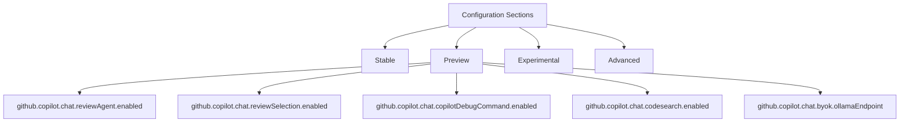
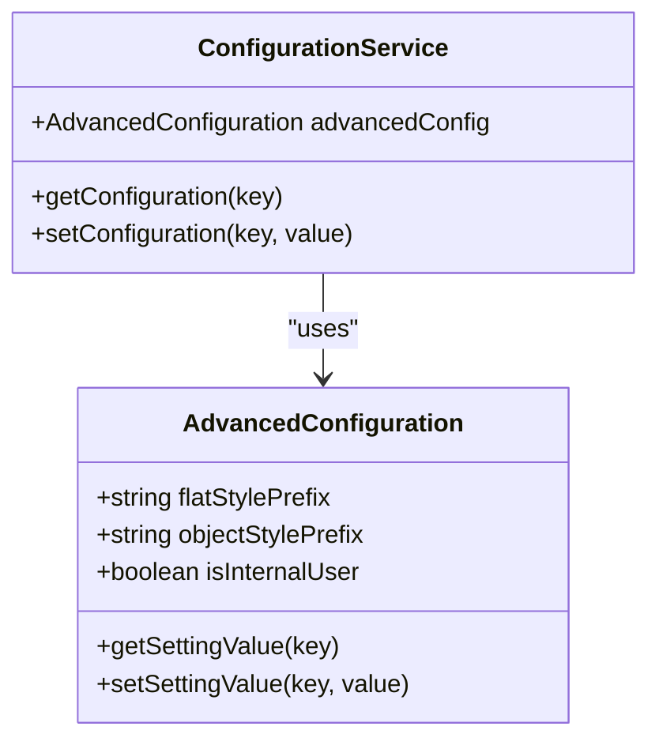
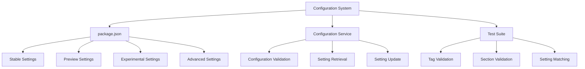

# Preview Features

<cite>
**Referenced Files in This Document**   
- [package.json](file://package.json)
- [configurations.spec.ts](file://src/extension/test/node/configurations.spec.ts)
- [configurationMigration.ts](file://src/extension/configuration/vscode-node/configurationMigration.ts)
- [expConfig.ts](file://src/extension/completions-core/vscode-node/lib/src/experiments/expConfig.ts)
- [settingsSchemaFeature.ts](file://src/extension/settingsSchema/vscode-node/settingsSchemaFeature.ts)
- [inMemoryConfigurationService.ts](file://src/platform/configuration/test/common/inMemoryConfigurationService.ts)
- [configurationServiceImpl.ts](file://src/platform/configuration/vscode/configurationServiceImpl.ts)
</cite>

## Table of Contents
1. [Introduction](#introduction)
2. [Preview Configuration Overview](#preview-configuration-overview)
3. [Preview Settings](#preview-settings)
4. [Experimental Settings](#experimental-settings)
5. [Advanced Settings](#advanced-settings)
6. [Configuration Architecture](#configuration-architecture)
7. [Enabling and Testing Preview Features](#enabling-and-testing-preview-features)
8. [Use Cases for Preview Features](#use-cases-for-preview-features)
9. [Risks of Using Preview Features in Production](#risks-of-using-preview-features-in-production)
10. [Providing Feedback on Preview Features](#providing-feedback-on-preview-features)
11. [Transition from Preview to Stable](#transition-from-preview-to-stable)
12. [Conclusion](#conclusion)

## Introduction
The vscode-copilot-chat extension provides a range of preview features that offer enhanced capabilities for users who want to experiment with cutting-edge functionality. These preview features are designed to be used in development environments and are subject to change based on user feedback and testing. This document details all preview settings, their experimental nature, default values, and potential impact on extension stability. It also explains the purpose and functionality of each preview feature and how they differ from stable counterparts.

**Section sources**
- [package.json](file://package.json#L2536-L2650)

## Preview Configuration Overview
The vscode-copilot-chat extension organizes its configuration settings into four distinct sections: stable, preview, experimental, and advanced. Each section serves a specific purpose and has different stability guarantees. The preview section contains features that are considered relatively stable but are still under active development and may change based on user feedback. These features are enabled by default but are clearly marked as preview to indicate their status.

The configuration system uses tags to categorize settings, with the "preview" tag specifically identifying features in the preview section. This tagging system ensures that users can easily identify which settings are part of the preview program. The extension's test suite verifies that these tags are correctly applied, ensuring consistency across the configuration system.



**Diagram sources**
- [package.json](file://package.json#L2536-L2650)
- [configurations.spec.ts](file://src/extension/test/node/configurations.spec.ts#L41-L47)

**Section sources**
- [package.json](file://package.json#L2536-L2650)
- [configurations.spec.ts](file://src/extension/test/node/configurations.spec.ts#L30-L47)

## Preview Settings
The preview settings in the vscode-copilot-chat extension provide enhanced functionality that is considered relatively stable but still under active development. These settings are enabled by default and are designed to offer users access to new features while maintaining a reasonable level of stability.

The preview settings include:
- **github.copilot.chat.reviewAgent.enabled**: Enables the review agent feature, which provides code review capabilities. Default value is true.
- **github.copilot.chat.reviewSelection.enabled**: Enables selection-based code review functionality. Default value is true.
- **github.copilot.chat.copilotDebugCommand.enabled**: Enables the Copilot debug command feature. Default value is true.
- **github.copilot.chat.codesearch.enabled**: Enables code search functionality. Default value is false.
- **github.copilot.chat.byok.ollamaEndpoint**: Specifies the endpoint for the BYOK (Bring Your Own Key) Ollama service. Default value is "http://localhost:11434".

These settings are designed to enhance the user experience by providing additional functionality that is not yet considered stable enough for the main feature set. Users can enable or disable these features based on their needs and risk tolerance.

**Section sources**
- [package.json](file://package.json#L2539-L2649)

## Experimental Settings
The experimental settings in the vscode-copilot-chat extension represent features that are in the early stages of development and are subject to significant changes. These settings are disabled by default and are intended for users who want to test cutting-edge functionality and provide feedback to the development team.

The experimental settings include:
- **github.copilot.chat.githubMcpServer.enabled**: Enables the GitHub MCP server integration. Default value is false.
- **github.copilot.chat.githubMcpServer.toolsets**: Specifies the toolsets available for the GitHub MCP server. Default value is ["default"].
- **github.copilot.chat.githubMcpServer.readonly**: Enables read-only mode for the GitHub MCP server. Default value is false.
- **github.copilot.chat.githubMcpServer.lockdown**: Enables lockdown mode for the GitHub MCP server. Default value is false.
- **github.copilot.chat.imageUpload.enabled**: Enables image upload functionality. Default value is true.

These settings are marked with the "experimental" tag and are not recommended for production use. They may change or be removed in future releases based on user feedback and development priorities.

**Section sources**
- [package.json](file://package.json#L2653-L2703)

## Advanced Settings
The advanced settings in the vscode-copilot-chat extension are intended for internal users and team members. These settings provide access to functionality that is not intended for general use and may have different default values for internal users compared to public users.

The advanced settings are organized in a way that allows for both flat-style and object-style configuration. The flat style uses the format "github.copilot.advanced.settingName" while the object style uses "github.copilot.advanced" with sub-keys. This flexibility allows for easier configuration management and backward compatibility.

For internal users, a JSON schema is provided that recognizes advanced settings and suppresses warnings about unknown configuration settings. This schema helps internal users avoid confusion when using advanced features that are not documented for public use.



**Diagram sources**
- [settingsSchemaFeature.ts](file://src/extension/settingsSchema/vscode-node/settingsSchemaFeature.ts#L23-L55)
- [configurationServiceImpl.ts](file://src/platform/configuration/vscode/configurationServiceImpl.ts#L61-L86)

**Section sources**
- [settingsSchemaFeature.ts](file://src/extension/settingsSchema/vscode-node/settingsSchemaFeature.ts#L23-L55)
- [configurationServiceImpl.ts](file://src/platform/configuration/vscode/configurationServiceImpl.ts#L61-L86)

## Configuration Architecture
The configuration architecture of the vscode-copilot-chat extension is designed to support multiple levels of feature stability, from stable to experimental. The system uses a hierarchical approach with distinct sections for different types of settings, each with its own stability guarantees and intended audience.

The configuration system is implemented using a combination of JSON schema definitions in package.json and TypeScript classes that manage configuration state. The settings are organized into sections (stable, preview, experimental, advanced) that are defined in the package.json file's contributes.configuration array. Each setting is tagged appropriately to indicate its status, with the test suite verifying that these tags are correctly applied.

The architecture supports both flat-style and object-style configuration for advanced settings, providing flexibility for different use cases. For internal users, a special JSON schema is generated that recognizes advanced settings and suppresses warnings about unknown configuration settings. This schema is only available to internal users, ensuring that public users are not confused by advanced features.



**Diagram sources**
- [package.json](file://package.json#L141-L3100)
- [configurations.spec.ts](file://src/extension/test/node/configurations.spec.ts#L30-L63)
- [configurationServiceImpl.ts](file://src/platform/configuration/vscode/configurationServiceImpl.ts#L61-L86)

**Section sources**
- [package.json](file://package.json#L141-L3100)
- [configurations.spec.ts](file://src/extension/test/node/configurations.spec.ts#L30-L63)
- [configurationServiceImpl.ts](file://src/platform/configuration/vscode/configurationServiceImpl.ts#L61-L86)

## Enabling and Testing Preview Features
To enable preview features in the vscode-copilot-chat extension, users need to modify the appropriate settings in their VS Code configuration. Preview features can be enabled or disabled through the VS Code settings UI or by directly editing the settings.json file.

For development and testing purposes, it is recommended to use a dedicated development environment to avoid impacting production workflows. Users can enable preview features by setting the corresponding configuration values to true in their settings.json file:

```json
{
    "github.copilot.chat.reviewAgent.enabled": true,
    "github.copilot.chat.reviewSelection.enabled": true,
    "github.copilot.chat.copilotDebugCommand.enabled": true,
    "github.copilot.chat.codesearch.enabled": true
}
```

When testing preview features, it is important to monitor the extension's behavior and performance. Users should document any issues or unexpected behavior and provide feedback to the development team. The test suite included with the extension can also be used to verify the functionality of preview features in a controlled environment.

**Section sources**
- [package.json](file://package.json#L2539-L2649)

## Use Cases for Preview Features
Preview features in the vscode-copilot-chat extension provide enhanced capabilities that can significantly improve developer productivity in specific scenarios. These features are particularly useful in development environments where users want to experiment with new functionality and provide feedback to the development team.

One key use case is code review automation, enabled by the reviewAgent and reviewSelection features. These features allow developers to automatically review code changes and provide feedback based on predefined instructions. This can be particularly useful in large teams where maintaining consistent coding standards is important.

Another use case is code search functionality, which allows developers to quickly find relevant code snippets within their workspace. This can be especially helpful when working on large codebases or when onboarding new team members.

The BYOK (Bring Your Own Key) Ollama endpoint feature enables integration with custom AI models, allowing organizations to use their own models for code generation and analysis. This can be valuable for organizations with specific security or compliance requirements.

**Section sources**
- [package.json](file://package.json#L2539-L2649)

## Risks of Using Preview Features in Production
Using preview features in production environments carries several risks that organizations should carefully consider. While preview features are generally more stable than experimental features, they are still subject to change and may introduce instability into production systems.

One major risk is feature removal or modification. Preview features may be significantly altered or removed in future releases based on user feedback and development priorities. This could break existing workflows and require significant rework to adapt to the changes.

Another risk is performance impact. Preview features may not be fully optimized and could potentially degrade the performance of the extension or VS Code itself. This could affect developer productivity and system responsiveness.

Compatibility issues are also a concern. Preview features may not work correctly with all programming languages, frameworks, or VS Code extensions. This could lead to unexpected behavior or errors in production environments.

Finally, there is a risk of data security and privacy issues. Preview features may handle sensitive code or configuration data in ways that have not been fully vetted for security. Organizations should carefully evaluate the security implications before enabling preview features in production.

**Section sources**
- [package.json](file://package.json#L2539-L2649)

## Providing Feedback on Preview Features
User feedback is crucial for the development and refinement of preview features in the vscode-copilot-chat extension. The development team actively encourages users to provide feedback on their experiences with preview features, including both positive experiences and issues encountered.

Feedback can be provided through several channels:
- GitHub issues: Users can file issues on the extension's GitHub repository to report bugs or suggest improvements.
- User surveys: Periodic surveys may be conducted to gather feedback on specific preview features.
- Direct communication: Internal users and team members can provide feedback directly to the development team.

When providing feedback, users should include detailed information about their environment, the specific feature being tested, and any issues encountered. This information helps the development team reproduce and address issues more effectively.

The feedback process is integrated into the extension's development cycle, with regular reviews of user feedback to prioritize feature improvements and bug fixes. This ensures that user input directly influences the evolution of preview features.

**Section sources**
- [package.json](file://package.json#L2539-L2649)

## Transition from Preview to Stable
The process for transitioning features from preview to stable status in the vscode-copilot-chat extension is based on several key criteria. Features must demonstrate stability, performance, and user satisfaction before being promoted to stable status.

The primary criteria for transition include:
- Sufficient user feedback indicating positive experiences and minimal issues
- Performance optimization and stability under various usage scenarios
- Compatibility with a wide range of programming languages, frameworks, and VS Code extensions
- Security and privacy compliance
- Documentation completeness

The transition process typically involves several stages:
1. Initial release as experimental
2. Promotion to preview status after initial testing
3. Extended testing period with user feedback collection
4. Final stability and performance optimization
5. Promotion to stable status

During the preview phase, the development team monitors usage metrics, error reports, and user feedback to assess the feature's readiness for stable release. Features that meet the criteria are gradually rolled out to all users as stable functionality.

**Section sources**
- [package.json](file://package.json#L2536-L2650)
- [configurations.spec.ts](file://src/extension/test/node/configurations.spec.ts#L30-L47)

## Conclusion
The preview features in the vscode-copilot-chat extension provide valuable opportunities for users to experiment with cutting-edge functionality and provide feedback to the development team. These features are carefully organized into distinct sections based on their stability and intended audience, with clear tagging to indicate their status.

While preview features offer enhanced capabilities, users should be aware of the risks associated with using them in production environments. The development team encourages feedback from users to help refine and improve these features before they are promoted to stable status.

By following the guidelines for enabling and testing preview features, users can safely explore new functionality while contributing to the improvement of the extension. The transition process from preview to stable status ensures that only well-tested and reliable features become part of the core functionality.

[No sources needed since this section summarizes without analyzing specific source files]