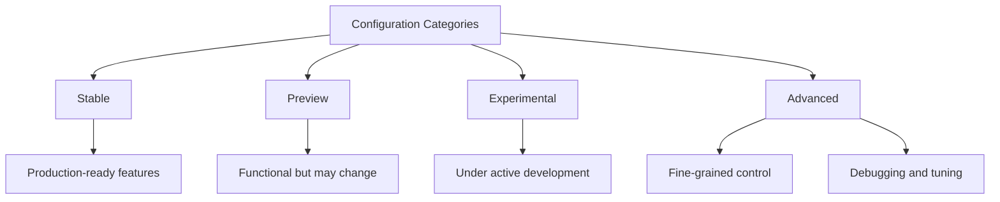
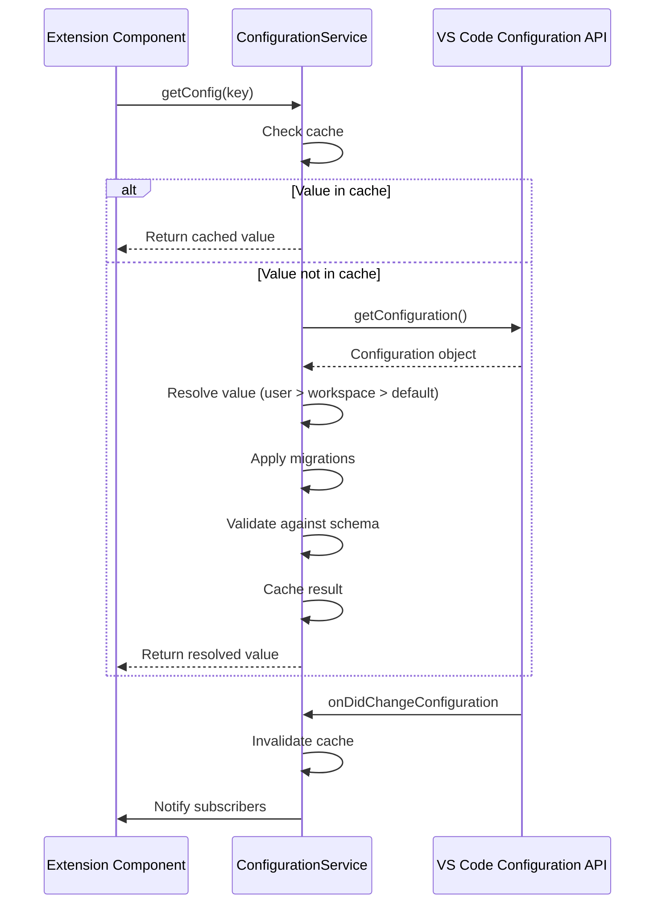
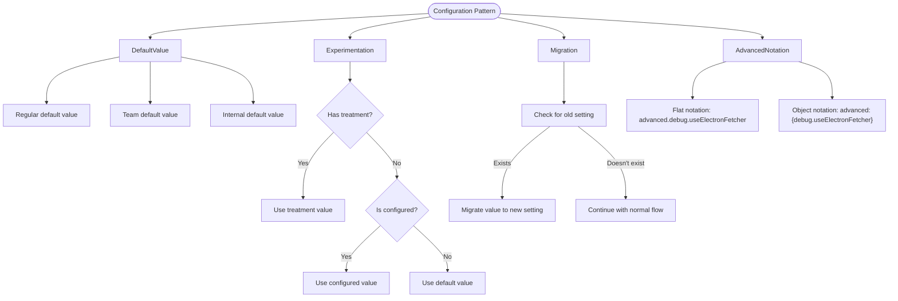
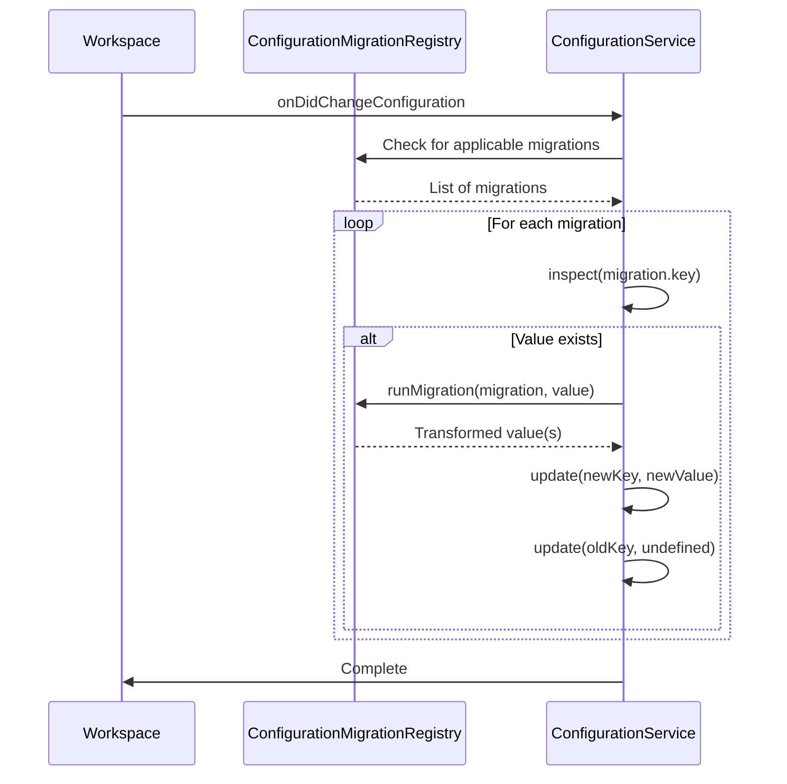
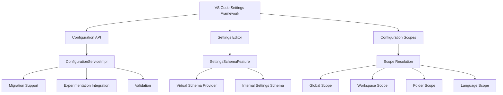

# Settings Overview

<cite>
**Referenced Files in This Document**   
- [configurationMigration.ts](file://src/extension/configuration/vscode-node/configurationMigration.ts)
- [configurationService.ts](file://src/platform/configuration/common/configurationService.ts)
- [configurationServiceImpl.ts](file://src/platform/configuration/vscode/configurationServiceImpl.ts)
- [jsonSchema.ts](file://src/platform/configuration/common/jsonSchema.ts)
- [validator.ts](file://src/platform/configuration/common/validator.ts)
- [settingsSchemaFeature.ts](file://src/extension/settingsSchema/vscode-node/settingsSchemaFeature.ts)
- [configurations.spec.ts](file://src/extension/test/node/configurations.spec.ts)
- [package.json](file://package.json)
</cite>

## Table of Contents
1. [Introduction](#introduction)
2. [Configuration Hierarchy and Categorization](#configuration-hierarchy-and-categorization)
3. [Configuration Lifecycle](#configuration-lifecycle)
4. [Settings Schema Definition and Validation](#settings-schema-definition-and-validation)
5. [Configuration Storage and Retrieval](#configuration-storage-and-retrieval)
6. [Common Configuration Patterns](#common-configuration-patterns)
7. [Configuration Migration Strategies](#configuration-migration-strategies)
8. [Integration with VS Code Settings Framework](#integration-with-vs-code-settings-framework)
9. [Conclusion](#conclusion)

## Introduction
The vscode-copilot-chat extension implements a sophisticated configuration system that manages settings across different stability levels and user types. This system provides a structured approach to configuration management, enabling the extension to support stable features while safely experimenting with new capabilities. The configuration architecture is designed to handle the complexities of feature development, user preferences, and cross-environment consistency.

The system is built around a hierarchical structure that categorizes settings based on their stability and availability, with distinct handling for stable, preview, experimental, and advanced features. It integrates seamlessly with VS Code's settings framework while providing additional capabilities for configuration validation, migration, and dynamic updates based on experimentation.

**Section sources**
- [configurationService.ts](file://src/platform/configuration/common/configurationService.ts#L25-L892)
- [package.json](file://package.json#L141-L800)

## Configuration Hierarchy and Categorization
The configuration system in vscode-copilot-chat organizes settings into a well-defined hierarchy based on their stability and target audience. This categorization ensures that users are exposed to features at appropriate maturity levels while allowing internal teams to develop and test new functionality.

The system implements four primary categories of settings:

1. **Stable**: These are production-ready features that are available to all users. They have undergone thorough testing and are considered reliable for everyday use.

2. **Preview**: Features in this category are functional but may still undergo changes based on user feedback. They are available to users who opt into preview functionality.

3. **Experimental**: These settings enable cutting-edge features that are still under active development. They may be unstable and are typically used for gathering early feedback.

4. **Advanced**: Configuration options in this category are intended for advanced users and internal team members. They provide fine-grained control over extension behavior and are often used for debugging or performance tuning.

The categorization is implemented through the package.json file, which defines configuration contributions with appropriate tags. The system uses these tags to determine the visibility and behavior of each setting. Additionally, the configuration system supports team-internal settings that are only available to Microsoft team members, allowing for internal testing before broader release.



**Diagram sources**
- [package.json](file://package.json#L141-L800)
- [configurations.spec.ts](file://src/extension/test/node/configurations.spec.ts#L11-L70)

**Section sources**
- [package.json](file://package.json#L141-L800)
- [configurations.spec.ts](file://src/extension/test/node/configurations.spec.ts#L11-L70)

## Configuration Lifecycle
The configuration lifecycle in vscode-copilot-chat encompasses initialization, loading, and change handling processes that ensure settings are properly managed throughout the extension's operation. This lifecycle is designed to provide a responsive and consistent user experience while maintaining data integrity.

During initialization, the configuration system establishes connections with VS Code's workspace configuration API and sets up event listeners for configuration changes. The `ConfigurationServiceImpl` class is responsible for this initialization, creating a wrapper around VS Code's configuration system that provides additional functionality specific to the Copilot extension.

The loading process involves retrieving configuration values from multiple sources, including user settings, workspace settings, and default values. The system implements a hierarchical approach where more specific settings override more general ones. When a configuration value is requested, the system follows this priority order:
1. Workspace folder settings
2. Workspace settings
3. User settings
4. Default values

Change handling is implemented through event-driven architecture. The system listens for VS Code's `onDidChangeConfiguration` events and propagates these changes to interested components. The `AbstractConfigurationService` class provides the foundation for this functionality with its `onDidChangeConfiguration` event emitter. When a configuration change is detected, the system validates the new values and notifies subscribers through observable patterns.

The lifecycle also includes special handling for experimentation-based configurations, which can be dynamically updated based on feature flags. These settings are re-evaluated when experimentation treatments change, allowing for A/B testing and gradual feature rollouts without requiring application restarts.

**Section sources**
- [configurationService.ts](file://src/platform/configuration/common/configurationService.ts#L167-L332)
- [configurationServiceImpl.ts](file://src/platform/configuration/vscode/configurationServiceImpl.ts#L22-L47)

## Settings Schema Definition and Validation
The settings schema system in vscode-copilot-chat provides a robust framework for defining configuration structure and ensuring data integrity. This system combines static schema definitions with runtime validation to prevent configuration errors and maintain consistency across different environments.

Schema definition is implemented through the `jsonSchema.ts` file, which provides TypeScript interfaces for JSON Schema Draft 7. These interfaces define the structure of configuration schemas, including support for various data types, validation rules, and metadata. The system supports common JSON Schema features such as:
- Type validation (string, number, boolean, object, array)
- Format constraints (date-time, email, uri, etc.)
- Value constraints (minimum, maximum, pattern, etc.)
- Enumerated values
- Required properties

Validation is handled by the `validator.ts` module, which provides a comprehensive set of validation functions. These validators are integrated with the configuration system to automatically validate settings when they are read or updated. The validation framework includes:
- Basic type validators (vString, vNumber, vBoolean)
- Object validators (vObj) for complex settings
- Array validators (vArray) for list-type settings
- Union validators (vUnion) for settings with multiple valid types
- Enum validators (vEnum) for settings with predefined options

The system also supports custom validation through the `IValidator` interface, allowing for domain-specific validation logic. Each configuration setting can have an associated validator that is automatically applied when the setting is accessed. This ensures that configuration values always meet the required criteria before being used by the extension.

```mermaid
classDiagram
class IValidator~T~ {
+validate(content : unknown) : { content : T; error : undefined } | { content : undefined; error : ValidationError }
+toSchema() : JsonSchema
+isRequired?() : boolean
}
class TypeofValidator~TKey~ {
-type : TKey
+validate(content : unknown) : { content : TypeOfMap[TKey]; error : undefined } | { content : undefined; error : ValidationError }
+toSchema() : JsonSchema
}
class vStringValidator {
+validate(content : unknown) : { content : string; error : undefined } | { content : undefined; error : ValidationError }
+toSchema() : JsonSchema
}
class vNumberValidator {
+validate(content : unknown) : { content : number; error : undefined } | { content : undefined; error : ValidationError }
+toSchema() : JsonSchema
}
class vBooleanValidator {
+validate(content : unknown) : { content : boolean; error : undefined } | { content : undefined; error : ValidationError }
+toSchema() : JsonSchema
}
IValidator <|-- TypeofValidator
TypeofValidator <|-- vStringValidator
TypeofValidator <|-- vNumberValidator
TypeofValidator <|-- vBooleanValidator
```

**Diagram sources**
- [jsonSchema.ts](file://src/platform/configuration/common/jsonSchema.ts#L1-L139)
- [validator.ts](file://src/platform/configuration/common/validator.ts#L1-L292)

**Section sources**
- [jsonSchema.ts](file://src/platform/configuration/common/jsonSchema.ts#L1-L139)
- [validator.ts](file://src/platform/configuration/common/validator.ts#L1-L292)

## Configuration Storage and Retrieval
The configuration storage and retrieval system in vscode-copilot-chat provides a unified interface for accessing settings across different environments while maintaining compatibility with VS Code's native configuration system. This system abstracts the underlying storage mechanisms and provides additional features for managing configuration data.

Storage is implemented through VS Code's workspace configuration API, which persists settings in JSON files at different scope levels:
- User-level settings (global.json)
- Workspace-level settings (workspace.json)
- Workspace folder-level settings

The `ConfigurationServiceImpl` class serves as the primary interface for configuration storage and retrieval. It wraps VS Code's configuration API and provides additional functionality specific to the Copilot extension. The system supports both simple and advanced settings, with special handling for the "advanced" namespace which can be configured in two different styles:
1. Flat style: "github.copilot.advanced.debug.useElectronFetcher": false
2. Object style: "github.copilot.advanced": { "debug.useElectronFetcher": false }

Retrieval of configuration values is optimized for performance and consistency. The system implements caching to avoid repeated calls to the underlying configuration API. When a configuration value is requested, the system follows a specific resolution order:
1. Check if the setting is configured at the requested scope
2. Retrieve the value from the appropriate configuration source
3. Apply any necessary transformations or migrations
4. Validate the value against the defined schema
5. Return the final value or fall back to the default

The system also provides observable patterns for configuration values, allowing components to react to changes in real-time. The `getConfigObservable` method returns an observable that emits the current configuration value and updates whenever the configuration changes.



**Diagram sources**
- [configurationServiceImpl.ts](file://src/platform/configuration/vscode/configurationServiceImpl.ts#L22-L206)
- [configurationService.ts](file://src/platform/configuration/common/configurationService.ts#L79-L163)

**Section sources**
- [configurationServiceImpl.ts](file://src/platform/configuration/vscode/configurationServiceImpl.ts#L22-L206)
- [configurationService.ts](file://src/platform/configuration/common/configurationService.ts#L79-L163)

## Common Configuration Patterns
The vscode-copilot-chat extension employs several common configuration patterns to manage settings effectively and provide a consistent user experience. These patterns address various aspects of configuration management, from default value handling to advanced feature control.

One key pattern is the use of default value variants for different user types. The system supports three levels of default values:
- Regular default values for general users
- Team default values for Microsoft team members
- Internal default values for internal users

This allows the extension to provide different default behaviors for different user groups without requiring manual configuration changes.

Another important pattern is the support for experimentation-based configurations. These settings can have their values determined by feature flags or A/B tests, enabling gradual rollouts and data-driven decision making. The system checks for experimentation treatments and uses the treatment value if available, falling back to the configured value or default value otherwise.

The system also implements a migration pattern for settings that have been renamed or restructured. When a setting is deprecated in favor of a new name, the system automatically migrates the value from the old setting to the new one, ensuring continuity for users. This is handled by the `ConfigurationMigrationRegistry` which registers migration functions for specific settings.

For advanced settings, the system supports both flat and object notation, providing flexibility in how settings are organized in the configuration file. This allows users to organize their settings in a way that suits their preferences while maintaining compatibility with the extension's requirements.



**Diagram sources**
- [configurationService.ts](file://src/platform/configuration/common/configurationService.ts#L334-L348)
- [configurationServiceImpl.ts](file://src/platform/configuration/vscode/configurationServiceImpl.ts#L49-L100)
- [configurationMigration.ts](file://src/extension/configuration/vscode-node/configurationMigration.ts#L1-L164)

**Section sources**
- [configurationService.ts](file://src/platform/configuration/common/configurationService.ts#L334-L348)
- [configurationServiceImpl.ts](file://src/platform/configuration/vscode/configurationServiceImpl.ts#L49-L100)
- [configurationMigration.ts](file://src/extension/configuration/vscode-node/configurationMigration.ts#L1-L164)

## Configuration Migration Strategies
The configuration migration system in vscode-copilot-chat provides a robust mechanism for evolving settings over time while maintaining compatibility with existing user configurations. This system ensures that users' settings are preserved when configuration keys are renamed or restructured, preventing data loss during updates.

Migration is implemented through the `ConfigurationMigrationRegistry` which manages a collection of migration functions. Each migration is defined as an object with a key (the setting to migrate) and a migration function that transforms the value. When a migration is registered, the system automatically applies it to existing configurations.

The migration process follows these steps:
1. Detect when a workspace or user configuration changes
2. Check if any registered migrations apply to the changed configuration
3. For each applicable migration:
   - Retrieve the current value of the old setting
   - Apply the migration function to transform the value
   - Update the new setting with the transformed value
   - Clear the old setting to prevent conflicts

The system supports both simple value migrations and complex transformations. Simple migrations typically involve copying a value from an old key to a new key, while complex migrations may transform the value format or combine multiple settings.

The migration system is particularly important for the extension's evolution, as it allows the development team to improve the configuration structure without disrupting existing users. For example, the system includes migrations for settings that were moved from a flat structure to a more organized hierarchy.



**Diagram sources**
- [configurationMigration.ts](file://src/extension/configuration/vscode-node/configurationMigration.ts#L1-L164)
- [configurationService.ts](file://src/platform/configuration/common/configurationService.ts#L470-L492)

**Section sources**
- [configurationMigration.ts](file://src/extension/configuration/vscode-node/configurationMigration.ts#L1-L164)
- [configurationService.ts](file://src/platform/configuration/common/configurationService.ts#L470-L492)

## Integration with VS Code Settings Framework
The configuration system in vscode-copilot-chat is designed to integrate seamlessly with VS Code's native settings framework while extending its capabilities to meet the specific needs of the Copilot extension. This integration provides a consistent user experience while enabling advanced configuration features.

The system builds upon VS Code's configuration API by wrapping it in the `ConfigurationServiceImpl` class, which extends the base functionality with additional features. This wrapper maintains compatibility with VS Code's event-driven architecture, listening for `onDidChangeConfiguration` events and propagating changes through the extension.

One key aspect of the integration is the support for VS Code's configuration scopes, including:
- Global (user) scope
- Workspace scope
- Workspace folder scope
- Language-specific scope

The system respects these scopes and applies the appropriate precedence rules when resolving configuration values. It also supports VS Code's configuration inspection API, allowing users to see where a particular setting is defined and what its effective value is.

The integration also includes special handling for the extension's unique requirements. For example, the system supports a virtual schema provider that generates JSON schemas for internal settings, providing IntelliSense and validation in the settings editor. This is implemented through the `SettingsSchemaFeature` class, which creates a virtual document containing the schema for internal settings.

Additionally, the system integrates with VS Code's configuration user interface, ensuring that settings are properly categorized and displayed in the settings editor. The package.json file defines configuration contributions with appropriate titles and tags, organizing settings into logical groups that match VS Code's UI conventions.



**Diagram sources**
- [configurationServiceImpl.ts](file://src/platform/configuration/vscode/configurationServiceImpl.ts#L22-L47)
- [settingsSchemaFeature.ts](file://src/extension/settingsSchema/vscode-node/settingsSchemaFeature.ts#L1-L56)
- [package.json](file://package.json#L141-L800)

**Section sources**
- [configurationServiceImpl.ts](file://src/platform/configuration/vscode/configurationServiceImpl.ts#L22-L47)
- [settingsSchemaFeature.ts](file://src/extension/settingsSchema/vscode-node/settingsSchemaFeature.ts#L1-L56)
- [package.json](file://package.json#L141-L800)

## Conclusion
The configuration system in vscode-copilot-chat provides a comprehensive and flexible framework for managing extension settings. By implementing a hierarchical structure with clear categorization of stable, preview, experimental, and advanced features, the system enables controlled feature development and deployment.

The lifecycle management ensures that configurations are properly initialized, loaded, and updated in response to changes, while the schema definition and validation system maintains data integrity and prevents configuration errors. The storage and retrieval mechanisms provide efficient access to settings across different environments, and the migration strategies ensure backward compatibility during configuration evolution.

Integration with VS Code's settings framework provides a seamless user experience while extending the platform's capabilities to meet the specific needs of the Copilot extension. The system's design supports both simple configuration needs and complex scenarios involving experimentation, team-specific settings, and advanced customization.

Overall, the configuration system demonstrates a thoughtful approach to configuration management that balances flexibility, reliability, and user experience, serving as a robust foundation for the extension's functionality.