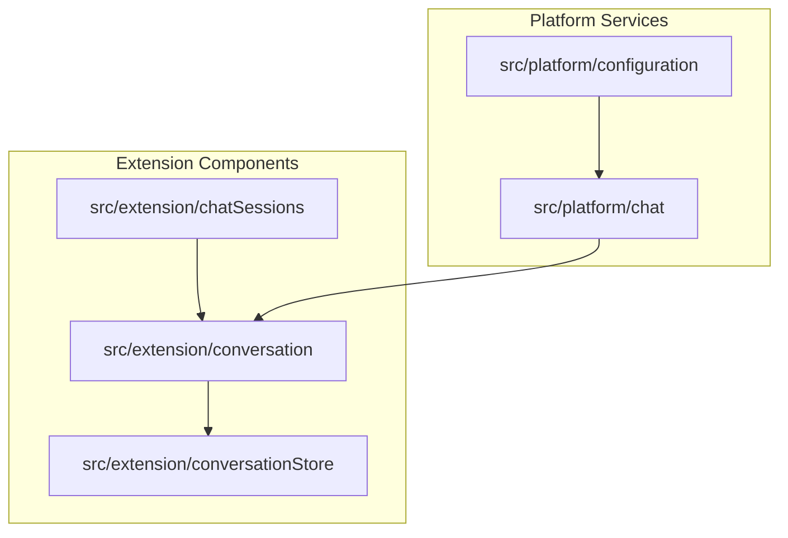
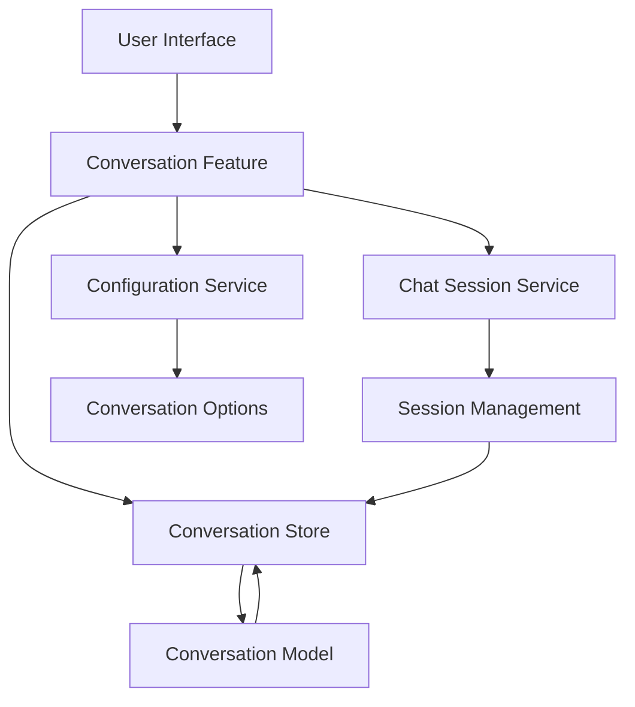
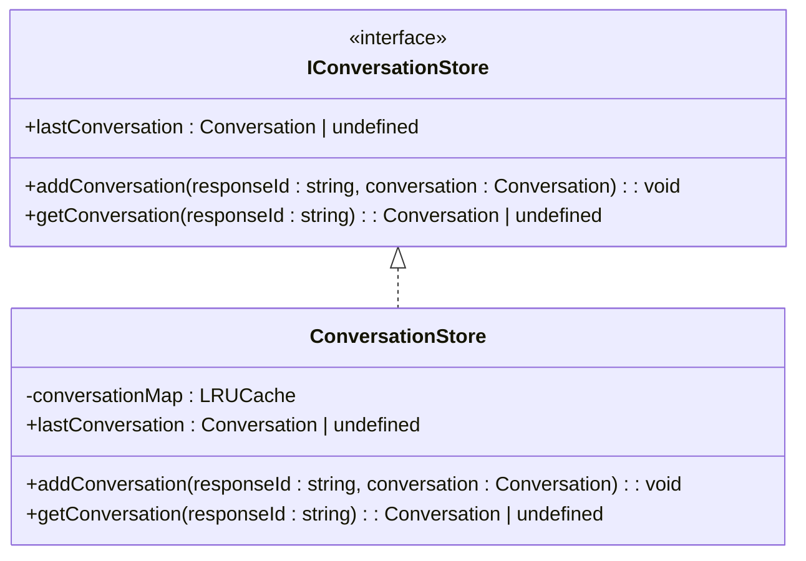
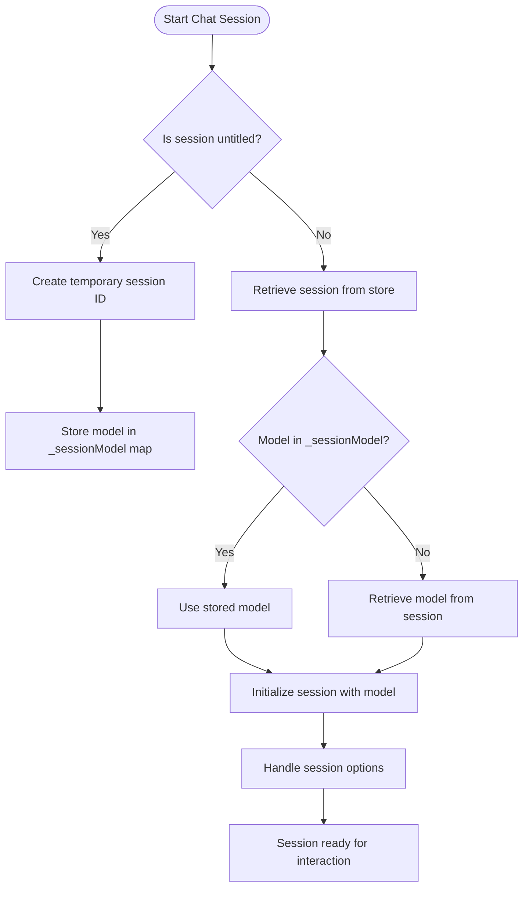
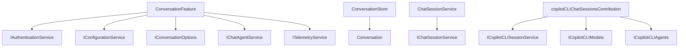

# Chat Interface

<cite>
**Referenced Files in This Document**   
- [conversationStore.ts](file://src/extension/conversationStore/node/conversationStore.ts)
- [conversation.ts](file://src/extension/prompt/common/conversation.ts)
- [conversationFeature.ts](file://src/extension/conversation/vscode-node/conversationFeature.ts)
- [copilotCLIChatSessionsContribution.ts](file://src/extension/chatSessions/vscode-node/copilotCLIChatSessionsContribution.ts)
- [chatSessionService.ts](file://src/platform/chat/common/chatSessionService.ts)
- [conversationOptions.ts](file://src/platform/chat/common/conversationOptions.ts)
</cite>

## Table of Contents
1. [Introduction](#introduction)
2. [Project Structure](#project-structure)
3. [Core Components](#core-components)
4. [Architecture Overview](#architecture-overview)
5. [Detailed Component Analysis](#detailed-component-analysis)
6. [Dependency Analysis](#dependency-analysis)
7. [Performance Considerations](#performance-considerations)
8. [Troubleshooting Guide](#troubleshooting-guide)
9. [Conclusion](#conclusion)

## Introduction
The Chat Interface feature in the vscode-copilot-chat extension provides a comprehensive conversation management system that enables users to interact with AI assistants directly within the VS Code environment. This documentation details the implementation of the chat interface, focusing on conversation management, session handling, and the underlying architecture that supports these features. The system is designed to handle chat sessions, store conversation history, and manage participant interactions through a well-defined set of interfaces and domain models.

## Project Structure
The chat interface functionality is organized across multiple directories within the vscode-copilot-chat extension. The core components are distributed across the `src/extension` and `src/platform` directories, with specific features isolated in dedicated subdirectories. The conversation management system is primarily implemented in the `conversation`, `conversationStore`, and `chatSessions` directories, while shared platform services are located in the `platform/chat` directory.



**Diagram sources**
- [conversationFeature.ts](file://src/extension/conversation/vscode-node/conversationFeature.ts)
- [conversationStore.ts](file://src/extension/conversationStore/node/conversationStore.ts)
- [copilotCLIChatSessionsContribution.ts](file://src/extension/chatSessions/vscode-node/copilotCLIChatSessionsContribution.ts)
- [chatSessionService.ts](file://src/platform/chat/common/chatSessionService.ts)

**Section sources**
- [conversationFeature.ts](file://src/extension/conversation/vscode-node/conversationFeature.ts)
- [conversationStore.ts](file://src/extension/conversationStore/node/conversationStore.ts)

## Core Components
The chat interface is built around several core components that work together to manage conversations, sessions, and user interactions. The ConversationStore serves as the central repository for conversation data, while the Conversation class represents individual chat sessions with their message history. The conversation feature components handle the registration of chat participants and providers, enabling the chat interface to respond to user requests. Configuration options for chat behavior are managed through the conversation options service, which provides parameters for message processing and response generation.

**Section sources**
- [conversationStore.ts](file://src/extension/conversationStore/node/conversationStore.ts)
- [conversation.ts](file://src/extension/prompt/common/conversation.ts)
- [conversationOptions.ts](file://src/platform/chat/common/conversationOptions.ts)

## Architecture Overview
The chat interface architecture follows a service-oriented design pattern with clear separation of concerns between data storage, conversation management, and user interface components. The system is built around a central conversation store that maintains chat session data, with various services interacting with this store to provide specific functionality. The architecture supports multiple chat participants and session types, allowing for flexible interaction patterns between users and AI assistants.



**Diagram sources**
- [conversationFeature.ts](file://src/extension/conversation/vscode-node/conversationFeature.ts)
- [conversationStore.ts](file://src/extension/conversationStore/node/conversationStore.ts)
- [chatSessionService.ts](file://src/platform/chat/common/chatSessionService.ts)
- [conversationOptions.ts](file://src/platform/chat/common/conversationOptions.ts)

## Detailed Component Analysis

### Conversation Store Analysis
The ConversationStore component serves as the central data repository for all chat conversations in the vscode-copilot-chat extension. It implements an LRU (Least Recently Used) cache with a capacity of 1000 conversations, ensuring efficient memory usage while maintaining access to recent chat histories. The store provides methods for adding, retrieving, and accessing the most recent conversation, forming the foundation for conversation persistence and retrieval.



**Diagram sources**
- [conversationStore.ts](file://src/extension/conversationStore/node/conversationStore.ts)

**Section sources**
- [conversationStore.ts](file://src/extension/conversationStore/node/conversationStore.ts)

### Conversation Model Analysis
The Conversation class represents the domain model for chat sessions, encapsulating the message history and state management for individual conversations. Each conversation is identified by a unique session ID and contains a collection of turns, where each turn represents a complete exchange between the user and the AI assistant. The model supports various message types and maintains metadata for conversation state, enabling rich interaction patterns and context preservation across sessions.

```mermaid
classDiagram
class Conversation {
-_turns : Turn[]
+sessionId : string
+turns : readonly Turn[]
+getLatestTurn() : Turn
}
class Turn {
-_references : readonly PromptReference[]
-_responseInfo : { message : TurnMessage | undefined; status : TurnStatus; responseId : string | undefined; chatResult? : ChatResult }
-_metadata : Map<unknown, unknown[]>
+id : string
+request : TurnMessage
+responseMessage : TurnMessage | undefined
+responseStatus : TurnStatus
+responseId : string | undefined
+rounds : readonly IToolCallRound[]
+setResponse(status : TurnStatus, message : TurnMessage | undefined, responseId : string | undefined, chatResult : ChatResult | undefined) : void
}
class IResultMetadata {
+modelMessageId : string
+responseId : string
+sessionId : string
+agentId : string
+renderedUserMessage? : Raw.ChatCompletionContentPart[]
+toolCallRounds? : readonly IToolCallRound[]
+summary? : { toolCallRoundId : string; text : string }
}
Conversation --> Turn
Turn --> IResultMetadata
```

**Diagram sources**
- [conversation.ts](file://src/extension/prompt/common/conversation.ts)

**Section sources**
- [conversation.ts](file://src/extension/prompt/common/conversation.ts)

### Chat Session Management Analysis
The chat session management system handles the creation, storage, and retrieval of chat sessions through the copilotCLIChatSessionsContribution component. This system supports both temporary and persistent sessions, with special handling for untitled sessions that are later assigned permanent IDs. The session management includes options for model selection, agent configuration, and isolation settings, providing users with control over their chat environment.



**Diagram sources**
- [copilotCLIChatSessionsContribution.ts](file://src/extension/chatSessions/vscode-node/copilotCLIChatSessionsContribution.ts)

**Section sources**
- [copilotCLIChatSessionsContribution.ts](file://src/extension/chatSessions/vscode-node/copilotCLIChatSessionsContribution.ts)

## Dependency Analysis
The chat interface components have well-defined dependencies that follow the inversion of control principle, with services injected through constructor parameters. The conversation feature depends on various platform services for authentication, configuration, and telemetry, while the conversation store maintains a dependency on the conversation model. The chat session service acts as a bridge between the VS Code chat API and the extension's internal conversation management system.



**Diagram sources**
- [conversationFeature.ts](file://src/extension/conversation/vscode-node/conversationFeature.ts)
- [conversationStore.ts](file://src/extension/conversationStore/node/conversationStore.ts)
- [chatSessionService.ts](file://src/platform/chat/common/chatSessionService.ts)
- [copilotCLIChatSessionsContribution.ts](file://src/extension/chatSessions/vscode-node/copilotCLIChatSessionsContribution.ts)

**Section sources**
- [conversationFeature.ts](file://src/extension/conversation/vscode-node/conversationFeature.ts)
- [conversationStore.ts](file://src/extension/conversationStore/node/conversationStore.ts)
- [chatSessionService.ts](file://src/platform/chat/common/chatSessionService.ts)

## Performance Considerations
The chat interface is designed with performance optimization in mind, particularly when handling large conversation histories. The ConversationStore uses an LRU cache with a capacity of 1000 conversations, which balances memory usage with access speed. The system minimizes redundant data loading by maintaining in-memory references to active conversations and session models. For large conversation histories, the implementation avoids deep copying of message data and instead uses references to shared data structures where possible.

The architecture also includes performance considerations for session initialization, with lazy loading of session data and asynchronous retrieval of conversation history. The use of event-driven updates ensures that UI components are only refreshed when necessary, reducing unnecessary re-renders and improving overall responsiveness.

## Troubleshooting Guide
Common issues with the chat interface typically relate to message persistence, session recovery, and configuration problems. For message persistence issues, verify that the conversation store is properly initialized and that the LRU cache has sufficient capacity. Session recovery problems may occur when temporary session IDs are not properly mapped to permanent IDs; check the _untitledSessionIdMap and _sessionModel structures for consistency.

Configuration-related issues can often be resolved by verifying the conversation options settings, particularly the maxResponseTokens, temperature, and topP parameters. Authentication problems may prevent chat sessions from being created; ensure that the authentication service is properly initialized and that the user has valid credentials.

Performance issues with large conversation histories can be addressed by optimizing the LRU cache size or implementing additional pagination mechanisms for message retrieval. Memory leaks can be prevented by ensuring proper disposal of session references and event listeners.

**Section sources**
- [conversationStore.ts](file://src/extension/conversationStore/node/conversationStore.ts)
- [conversation.ts](file://src/extension/prompt/common/conversation.ts)
- [conversationOptions.ts](file://src/platform/chat/common/conversationOptions.ts)

## Conclusion
The Chat Interface feature in the vscode-copilot-chat extension provides a robust and extensible conversation management system that enables seamless interaction between users and AI assistants. The architecture combines a centralized conversation store with flexible session management and rich domain models to support complex chat scenarios. The system's design prioritizes performance, scalability, and ease of extension, making it suitable for both basic chat interactions and advanced AI-assisted development workflows. By understanding the core components and their relationships, developers can effectively customize and extend the chat interface to meet specific requirements.