# Code Assistance

<cite>
**Referenced Files in This Document**   
- [editCodeIntent.ts](file://src/extension/intents/node/editCodeIntent.ts)
- [generateCodeIntent.ts](file://src/extension/intents/node/generateCodeIntent.ts)
- [explainIntent.ts](file://src/extension/intents/node/explainIntent.ts)
- [genericInlineIntentInvocation.ts](file://src/extension/context/node/resolvers/genericInlineIntentInvocation.ts)
- [nextEditProvider.ts](file://src/extension/inlineEdits/node/nextEditProvider.ts)
- [inlineEditModel.ts](file://src/extension/inlineEdits/vscode-node/inlineEditModel.ts)
- [editGeneration.ts](file://src/extension/prompt/node/editGeneration.ts)
- [configurationService.ts](file://src/platform/configuration/common/configurationService.ts)
</cite>

## Table of Contents
1. [Introduction](#introduction)
2. [Core Intent Handlers](#core-intent-handlers)
3. [Inline Editing System](#inline-editing-system)
4. [Prompt Templates and Context](#prompt-templates-and-context)
5. [Configuration Options](#configuration-options)
6. [Error Handling and Conflict Resolution](#error-handling-and-conflict-resolution)
7. [Performance Considerations](#performance-considerations)
8. [Conclusion](#conclusion)

## Introduction
The Code Assistance feature in the vscode-copilot-chat extension provides intelligent code generation, explanation, and inline editing capabilities through AI-powered suggestions. This documentation details the implementation of the core components that enable users to generate new code, edit existing code, and understand code functionality through natural language interactions. The system uses intent-based routing to determine user requests and applies appropriate processing through specialized handlers for code generation, editing, and explanation. The architecture integrates with VS Code's editor features to provide inline suggestions and seamless code modifications.

## Core Intent Handlers

The Code Assistance feature implements three primary intent handlers that process different types of user requests: code generation, code editing, and code explanation. These handlers are responsible for interpreting user intent, constructing appropriate prompts, and processing AI responses to generate code suggestions.

### Generate Code Intent Handler
The `GenerateCodeIntent` class handles requests for generating new code based on user queries. When a user requests code generation (e.g., "generate a nodejs server that responds with 'Hello World'"), this handler processes the request by creating an inline intent invocation with a forced insertion strategy. The handler ensures that generated code is inserted at the cursor location regardless of surrounding context. It validates that a document is open before processing and uses the `GenericInlineIntentInvocation` to manage the interaction flow.

**Diagram sources**
- [generateCodeIntent.ts](file://src/extension/intents/node/generateCodeIntent.ts#L16-L39)

**Section sources**
- [generateCodeIntent.ts](file://src/extension/intents/node/generateCodeIntent.ts#L1-L39)

### Edit Code Intent Handler
The `EditCodeIntent` class processes requests to modify existing code. This handler supports both inline editor and panel locations and manages the complete workflow from intent recognition to code application. When a user requests code modifications (e.g., "rewrite the selection to use async/await"), the handler first checks for code search capabilities and processes any tool references. It then creates an `EditIntentRequestHandler` to manage the request processing, which includes building prompts, handling responses, and applying edits.

The handler implements sophisticated logic for managing code edits, including:
- Processing code search results from tool references
- Handling confirmed edits through the `mapCode` service
- Managing working sets of files involved in multi-file edits
- Collecting telemetry for edit code blocks in editing sessions

```mermaid
classDiagram
class EditCodeIntent {
+static readonly ID : Intent
+readonly id : string
+readonly description : string
+readonly locations : ChatLocation[]
+handleRequest(conversation : Conversation, request : vscode.ChatRequest, stream : vscode.ChatResponseStream, token : CancellationToken, documentContext : IDocumentContext | undefined, agentName : string, location : ChatLocation, chatTelemetry : ChatTelemetryBuilder, onPaused : Event<boolean>) : Promise<vscode.ChatResult>
+invoke(invocationContext : IIntentInvocationContext) : Promise<IIntentInvocation>
}
class EditCodeIntentInvocation {
+_editCodeStep : EditCodeStep | undefined
+stableToolReferences : InternalToolReference[]
+linkification : IntentLinkificationOptions
+codeblocksRepresentEdits : boolean
+buildPrompt(promptContext : IBuildPromptContext, progress : vscode.Progress<vscode.ChatResponseReferencePart | vscode.ChatResponseProgressPart>, token : vscode.CancellationToken) : Promise<IBuildPromptResult>
+processResponse(context : IResponseProcessorContext, inputStream : AsyncIterable<IResponsePart>, outputStream : vscode.ChatResponseStream, token : vscode.CancellationToken) : Promise<vscode.ChatResult>
}
EditCodeIntent --> IIntent : implements
EditCodeIntentInvocation --> IIntentInvocation : implements
```

**Diagram sources**
- [editCodeIntent.ts](file://src/extension/intents/node/editCodeIntent.ts#L82-L784)

**Section sources**
- [editCodeIntent.ts](file://src/extension/intents/node/editCodeIntent.ts#L1-L784)

### Explain Code Intent Handler
The `ExplainIntent` class handles requests for code explanations. This handler supports multiple locations including the editor, panel, and notebook interfaces. When a user requests an explanation (e.g., "explain how this function works"), the handler creates appropriate invocation instances based on the location. For inline chat, it uses `InlineExplainIntentInvocation` which processes responses as streaming markdown.

The handler includes default query functionality that automatically provides a prompt when the user's query is empty ("Write an explanation for the code above as paragraphs of text."). It integrates with the editor service to access the active document and selection, ensuring explanations are contextually relevant to the user's current focus.

**Diagram sources**
- [explainIntent.ts](file://src/extension/intents/node/explainIntent.ts#L68-L91)

**Section sources**
- [explainIntent.ts](file://src/extension/intents/node/explainIntent.ts#L1-L91)

## Inline Editing System

The inline editing system provides real-time code suggestions that appear directly in the editor, allowing users to accept or reject proposed changes. This system consists of several interconnected components that work together to provide seamless code assistance.

### Next Edit Provider
The `NextEditProvider` is the core component responsible for generating inline edit suggestions. It implements the `INextEditProvider` interface and manages the complete lifecycle of edit suggestions from generation to user interaction. The provider maintains a cache of previous edits to optimize performance and avoid redundant suggestions.

Key features of the NextEditProvider include:
- **Caching mechanism**: Stores previous edit suggestions to improve response times for subsequent requests
- **Rejection tracking**: Monitors user rejections to avoid suggesting the same edits repeatedly
- **Timing controls**: Implements delays and cooldown periods to prevent overwhelming users with suggestions
- **Document change detection**: Cancels pending requests when the document changes to ensure suggestions remain relevant

The provider works with a stateless next edit provider (such as `ServerPoweredInlineEditProvider`) to generate edit suggestions. It processes the document history and current context to create appropriate edit proposals.

**Diagram sources**
- [nextEditProvider.ts](file://src/extension/inlineEdits/node/nextEditProvider.ts#L62-L792)

**Section sources**
- [nextEditProvider.ts](file://src/extension/inlineEdits/node/nextEditProvider.ts#L1-L792)

### Inline Edit Model
The `InlineEditModel` class serves as the main entry point for the inline editing system, coordinating between the workspace, history tracking, and edit providers. It manages the lifecycle of inline edit suggestions and handles document and selection changes to determine when to trigger new suggestions.

The model includes a triggerer component (`InlineEditTriggerer`) that monitors editor events and determines appropriate times to request edit suggestions. The triggerer implements several heuristics to avoid excessive suggestions:
- **Change limit**: Only triggers suggestions within a certain time window after document changes
- **Line cooldown**: Prevents repeated suggestions on the same line within a short period
- **Rejection cooldown**: Disables automatic triggering after user rejections for a specified duration
- **Selection change debouncing**: Implements delays for consecutive selection changes

**Diagram sources**
- [inlineEditModel.ts](file://src/extension/inlineEdits/vscode-node/inlineEditModel.ts#L32-L312)

**Section sources**
- [inlineEditModel.ts](file://src/extension/inlineEdits/vscode-node/inlineEditModel.ts#L1-L312)

## Prompt Templates and Context

The Code Assistance system uses a sophisticated prompt templating system to generate appropriate AI requests based on user intent and context. The system leverages the `GenericInlineIntentInvocation` class to manage prompt creation and response processing for inline interactions.

### Generic Inline Intent Invocation
The `GenericInlineIntentInvocation` class serves as a base implementation for handling inline intent requests. It determines the appropriate prompt template based on the document type and edit strategy, then renders the prompt using the `PromptRenderer`. The invocation supports different prompt types for various scenarios:

- **Notebook cells**: Uses `InlineChatNotebookGeneratePrompt` or `InlineChatNotebookEditPrompt` based on the edit strategy
- **Markdown files**: Uses `InlineChatGenerateMarkdownPrompt` or `InlineChatEditMarkdownPrompt`
- **Code files**: Uses `InlineChatGenerateCodePrompt` or `InlineChatEditCodePrompt`

The invocation also manages response processing through reply interpreters, which handle the streaming response from the AI service and present it appropriately in the editor interface.

**Diagram sources**
- [genericInlineIntentInvocation.ts](file://src/extension/context/node/resolvers/genericInlineIntentInvocation.ts#L32-L81)

**Section sources**
- [genericInlineIntentInvocation.ts](file://src/extension/context/node/resolvers/genericInlineIntentInvocation.ts#L1-L81)

### Edit Generation Strategies
The system implements different edit generation strategies through the `EditStrategy` enum, which determines how code suggestions are applied:

- **FallbackToInsertAboveRange**: Inserts code above the selected range when no specific hints are available
- **FallbackToReplaceRange**: Replaces the selected range with generated code
- **FallbackToInsertBelowRange**: Inserts code below the selected range
- **ForceInsertion**: Always inserts code at the cursor location (used for code generation)

These strategies are used by the intent handlers to determine the appropriate behavior for different types of requests. For example, the `GenerateCodeIntent` uses `ForceInsertion` to ensure new code is always inserted at the cursor, while `EditCodeIntent` may use `FallbackToReplaceRange` to modify existing code.

**Diagram sources**
- [editGeneration.ts](file://src/extension/prompt/node/editGeneration.ts#L59-L79)

**Section sources**
- [editGeneration.ts](file://src/extension/prompt/node/editGeneration.ts#L1-L85)

## Configuration Options

The Code Assistance feature provides extensive configuration options that allow users and administrators to customize the behavior of code suggestions. These options are managed through the configuration service and can be controlled via VS Code settings.

### Configuration Service
The `IConfigurationService` interface provides access to configuration values throughout the extension. Configuration options are defined with specific types and validation rules, and can be either simple values or experiment-based values that depend on A/B testing configurations.

Key configuration aspects include:
- **Experiment-based settings**: Values that can vary based on user experiments or internal testing
- **Advanced settings**: Configuration options that are typically hidden from general users
- **Default values**: Predefined values that apply when no user setting is specified
- **Validation**: Rules that ensure configuration values are appropriate for their intended use

**Diagram sources**
- [configurationService.ts](file://src/platform/configuration/common/configurationService.ts#L406-L414)

**Section sources**
- [configurationService.ts](file://src/platform/configuration/common/configurationService.ts#L373-L429)

## Error Handling and Conflict Resolution

The Code Assistance system implements comprehensive error handling and conflict resolution mechanisms to ensure reliable operation and prevent data loss.

### Error Handling
The system handles various error conditions through structured error types and appropriate recovery strategies:
- **Cancellation handling**: Properly manages cancelled requests to free resources and prevent memory leaks
- **Document change detection**: Detects when documents have changed during processing and cancels outdated suggestions
- **Network error handling**: Manages failures in communication with AI services and provides appropriate user feedback
- **Validation errors**: Checks input parameters and context before processing requests

### Conflict Resolution
The system implements several strategies to resolve conflicts between user actions and AI suggestions:
- **Edit consistency checking**: Verifies that proposed edits are still valid given the current document state
- **Rejection tracking**: Remembers user rejections to avoid suggesting the same changes repeatedly
- **Cache invalidation**: Clears outdated suggestions when documents change significantly
- **Timing controls**: Uses delays and cooldown periods to prevent suggestion flooding

The system also handles multi-file edits by tracking working sets and ensuring changes are applied consistently across related files.

## Performance Considerations

The Code Assistance system is designed with performance optimization as a key priority, implementing several strategies to ensure responsive user experiences:

- **Caching**: Extensive use of caching for previous edit suggestions to reduce latency
- **Debouncing**: Implementation of delays for rapid user interactions to prevent excessive processing
- **Asynchronous processing**: Non-blocking operations that allow the editor to remain responsive
- **Resource management**: Proper disposal of resources and cleanup of unused objects
- **Selective triggering**: Heuristics that determine optimal times to request suggestions

The system also includes comprehensive telemetry to monitor performance metrics and identify areas for improvement.

## Conclusion
The Code Assistance feature in the vscode-copilot-chat extension provides a sophisticated system for AI-powered code generation, editing, and explanation. By leveraging intent-based routing, prompt templating, and inline editing capabilities, the system delivers contextually relevant suggestions that enhance developer productivity. The modular architecture separates concerns between intent handling, prompt generation, and edit application, allowing for extensibility and customization. With comprehensive configuration options and robust error handling, the system provides a reliable and user-friendly experience for developers of all skill levels.