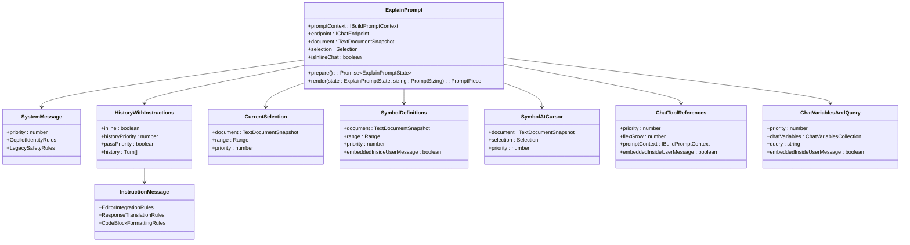

# Code Explanation

<cite>
**Referenced Files in This Document**   
- [explainIntent.ts](file://src/extension/intents/node/explainIntent.ts)
- [explain.tsx](file://src/extension/prompts/node/panel/explain.tsx)
- [agentIntent.ts](file://src/extension/intents/node/agentIntent.ts)
- [inlineChatEditCodePrompt.tsx](file://src/extension/prompts/node/inline/inlineChatEditCodePrompt.tsx)
- [intentDetector.tsx](file://src/extension/prompt/node/intentDetector.tsx)
</cite>

## Table of Contents
1. [Introduction](#introduction)
2. [Intent Handling Architecture](#intent-handling-architecture)
3. [Code Explanation Pipeline](#code-explanation-pipeline)
4. [Prompt Construction Process](#prompt-construction-process)
5. [Context Extraction and Analysis](#context-extraction-and-analysis)
6. [Response Generation and Streaming](#response-generation-and-streaming)
7. [Configuration Options](#configuration-options)
8. [Error Handling and Edge Cases](#error-handling-and-edge-cases)
9. [Performance Considerations](#performance-considerations)
10. [Troubleshooting Guide](#troubleshooting-guide)

## Introduction

The Code Explanation feature in the vscode-copilot-chat extension provides natural language explanations of selected code through the explainIntent handler. This system transforms code selections into comprehensive explanations by leveraging a sophisticated pipeline that includes intent detection, context extraction, prompt construction, and response generation. The feature supports multiple locations including the chat panel, editor, and notebook interfaces, providing consistent explanation capabilities across different development contexts.

The core functionality revolves around the explainIntent class which handles explanation requests and coordinates with the prompt system to generate natural language descriptions. The system uses a component-based prompt architecture where different context elements are composed into a final prompt that guides the AI model's response. This documentation details the implementation of this feature, focusing on the domain model, processing pipeline, and integration points within the extension architecture.

**Section sources**
- [explainIntent.ts](file://src/extension/intents/node/explainIntent.ts#L1-L91)
- [explain.tsx](file://src/extension/prompts/node/panel/explain.tsx#L1-L105)

## Intent Handling Architecture

The Code Explanation feature is built on a modular intent handling architecture that follows the command pattern for processing user requests. At the core of this system is the ExplainIntent class, which implements the IIntent interface and serves as the entry point for explanation requests. This class is responsible for creating appropriate invocation instances based on the chat location (panel, editor, or notebook).

The architecture follows a hierarchical class structure where base functionality is defined in parent classes and specialized behavior is implemented in derived classes. The ExplainIntent class creates instances of ExplainIntentInvocation for panel-based explanations and InlineExplainIntentInvocation for inline editor explanations. This separation allows for location-specific behavior while maintaining shared core functionality.

The intent system integrates with the broader extension architecture through dependency injection, receiving services such as IEndpointProvider for accessing the AI model endpoint and IInstantiationService for creating dependent objects. The invoke method in ExplainIntent determines the appropriate invocation type based on the ChatLocation, ensuring that the correct processing path is followed for each context.

**Diagram sources**
- [explainIntent.ts](file://src/extension/intents/node/explainIntent.ts#L68-L90)

**Section sources**
- [explainIntent.ts](file://src/extension/intents/node/explainIntent.ts#L68-L90)

## Code Explanation Pipeline

The code explanation pipeline processes requests through a well-defined sequence of stages that transform a user's code selection into a natural language explanation. The pipeline begins when a user initiates an explanation request, which triggers the explainIntent handler to create an appropriate invocation instance based on the chat location.

The first stage involves building the prompt context, where the system gathers relevant information about the selected code and surrounding context. For empty queries, the system automatically applies a default query "Write an explanation for the code above as paragraphs of text." This ensures consistent behavior even when users don't provide specific instructions. The buildPrompt method in ExplainIntentInvocation handles this logic, ensuring that all explanation requests have a clear directive.

The second stage involves creating a prompt renderer that will generate the final prompt structure. The createRenderer method constructs a PromptRenderer instance with the ExplainPrompt component and necessary context information including the document snapshot, selection range, and location-specific flags. This renderer is responsible for composing the various prompt elements into a coherent structure that guides the AI model's response.

The final stage is response processing, where the generated explanation is streamed back to the user. For inline explanations, the InlineExplainIntentInvocation uses a StreamingMarkdownReplyInterpreter to handle the response stream, ensuring that markdown-formatted explanations are properly processed and displayed. This streaming approach allows users to see the explanation as it's being generated, providing immediate feedback and improving the interactive experience.

**Diagram sources**
- [explainIntent.ts](file://src/extension/intents/node/explainIntent.ts#L25-L58)

**Section sources**
- [explainIntent.ts](file://src/extension/intents/node/explainIntent.ts#L25-L58)

## Prompt Construction Process

The prompt construction process for code explanations is a sophisticated composition of multiple contextual elements that guide the AI model's response. The ExplainPrompt component serves as the central element in this process, orchestrating various sub-components that provide specific types of context. This component-based architecture allows for flexible and extensible prompt construction that can adapt to different explanation scenarios.

The prompt structure follows a hierarchical organization with system messages establishing the AI's role and constraints, followed by instruction messages that provide detailed guidance on the explanation process. The ExplainPrompt defines the AI as a "world-class coding tutor" with specific instructions to balance high-level concepts and granular details. This identity framing ensures that explanations are educational and comprehensive, focusing on both what the code does and why it works that way.

Key components in the prompt construction include:
- **SystemMessage**: Establishes the AI's identity as GitHub Copilot and applies safety rules
- **HistoryWithInstructions**: Incorporates conversation history with specific instruction priorities
- **CurrentSelection**: Provides the selected code context with appropriate priority
- **SymbolDefinitions**: Includes definitions of symbols referenced in the selected code
- **SymbolAtCursor**: Adds context about symbols at the cursor position when not explaining diagnostics
- **ChatToolReferences**: Integrates references from chat tools with high priority
- **ChatVariablesAndQuery**: Combines user variables and the explanation query

The prompt construction process also includes conditional logic based on the explanation context. For example, when explaining code with associated diagnostics, the system modifies its behavior to focus on error analysis rather than general code explanation. The prepare method in ExplainPrompt analyzes the document and selection to determine if severe diagnostics are present, setting state that influences the final prompt composition.

**Diagram sources**
- [explain.tsx](file://src/extension/prompts/node/panel/explain.tsx#L41-L105)

**Section sources**
- [explain.tsx](file://src/extension/prompts/node/panel/explain.tsx#L41-L105)

## Context Extraction and Analysis

The context extraction system in the Code Explanation feature gathers and analyzes multiple sources of information to provide comprehensive code understanding. This multi-faceted approach ensures that explanations are grounded in both the immediate code context and broader project knowledge. The system extracts context from several key sources, each contributing different types of information to the final explanation.

The primary context source is the current code selection, captured through the CurrentSelection component. This component extracts the selected code from the active document, preserving its original formatting and structure. The selection is enhanced with metadata about the document's language, file path, and surrounding code context, providing the AI model with sufficient information to understand the code's syntactic and semantic context.

Symbol analysis is performed through two complementary components: SymbolDefinitions and SymbolAtCursor. SymbolDefinitions extracts definitions of symbols referenced in the selected code, providing type information, function signatures, and class hierarchies that help explain how different code elements relate to each other. SymbolAtCursor focuses on the symbol at the cursor position, adding detailed context about its declaration, usage patterns, and relationships to other code elements.

Additional context is derived from project structure and diagnostics. The ProjectLabels component incorporates information about the project's architecture, dependencies, and organizational patterns, allowing explanations to reference broader design principles. When explaining code with associated diagnostics, the system prioritizes error analysis, extracting information about the diagnostic severity, message, and potential fixes. This contextual awareness enables the AI to provide targeted explanations that address both the code's intended functionality and any issues it may contain.

The context extraction process is optimized for performance through lazy loading and caching mechanisms. Context elements are only retrieved when needed, and frequently accessed information is cached to minimize redundant operations. This ensures that the explanation system remains responsive even when analyzing complex codebases with extensive dependencies.

**Section sources**
- [explain.tsx](file://src/extension/prompts/node/panel/explain.tsx#L96-L99)

## Response Generation and Streaming

The response generation system in the Code Explanation feature employs a streaming architecture that delivers explanations incrementally to provide immediate feedback to users. This approach enhances the interactive experience by allowing users to begin reading the explanation as soon as the first content is generated, rather than waiting for the complete response.

The streaming process is managed by the StreamingMarkdownReplyInterpreter, which handles the asynchronous response stream from the AI model. This interpreter processes the response in chunks, parsing markdown formatting and ensuring that the output is properly structured and displayed. The streaming approach also enables the system to handle long explanations efficiently, as content is rendered progressively without requiring the entire response to be held in memory.

For inline explanations, the response generation process includes additional considerations for editor integration. The system must ensure that the explanation does not interfere with the user's workflow or code editing. This is achieved through careful positioning of the explanation UI and appropriate styling that distinguishes the explanation from the code content. The inline context also influences the explanation style, with more concise and focused responses typically generated for inline requests compared to panel-based explanations.

The response generation pipeline includes several quality assurance mechanisms. The system validates the response structure to ensure proper markdown formatting and checks for content safety before displaying the explanation. Error handling is integrated throughout the streaming process, allowing the system to recover from interruptions or partial failures and provide meaningful feedback to users when issues occur.

**Section sources**
- [explainIntent.ts](file://src/extension/intents/node/explainIntent.ts#L62-L65)

## Configuration Options

The Code Explanation feature supports several configuration options that allow users to customize the behavior and output style of explanations. These options are exposed through the extension's configuration system and can be adjusted to suit different preferences and use cases.

Key configuration parameters include:
- **Explanation depth**: Controls the level of detail in explanations, from high-level overviews to comprehensive line-by-line analysis
- **Technical level**: Adjusts the assumed knowledge level of the audience, from beginner to expert
- **Response length**: Influences the verbosity of explanations, from concise summaries to detailed analyses
- **Focus areas**: Allows users to prioritize certain aspects of the explanation, such as performance implications, security considerations, or design patterns

These configuration options are integrated into the prompt construction process through the CustomInstructions component, which incorporates user preferences into the final prompt. The system also respects workspace-level settings, allowing teams to establish consistent explanation styles across projects.

Additional configuration options relate to the user interface and interaction model:
- **Inline vs panel preference**: Determines whether explanations appear inline in the editor or in the chat panel by default
- **Automatic explanation triggers**: Controls whether explanations are automatically generated when certain code patterns are detected
- **Context inclusion**: Configures which types of contextual information are included in explanations, such as symbol definitions or project structure

The configuration system is designed to be extensible, allowing future enhancements to add new customization options without requiring changes to the core explanation pipeline. Configuration values are validated and normalized before being applied, ensuring that invalid settings do not disrupt the explanation process.

**Section sources**
- [explain.tsx](file://src/extension/prompts/node/panel/explain.tsx#L68-L89)

## Error Handling and Edge Cases

The Code Explanation feature includes comprehensive error handling mechanisms to address various edge cases and failure scenarios. These mechanisms ensure robust operation across different code patterns, project structures, and user interactions.

Common issues addressed by the error handling system include:
- **Empty or invalid selections**: When no code is selected or the selection is invalid, the system applies default behavior or provides helpful guidance to the user
- **Unsupported file types**: For files that cannot be analyzed (such as binary files or unsupported languages), the system provides appropriate feedback rather than failing silently
- **Large code selections**: For extensive code blocks, the system implements truncation or summarization strategies to prevent prompt overflow and maintain response quality
- **Network or service failures**: When the AI service is unavailable, the system provides graceful degradation and retry mechanisms

The system also handles complex code patterns through specialized analysis techniques. For example, when encountering code with ambiguous syntax or multiple possible interpretations, the explanation process includes clarification steps to ensure accuracy. The system may ask follow-up questions or provide alternative interpretations when confidence in a single explanation is low.

Context preservation across multiple explanation requests is maintained through conversation state management. The system tracks the context of previous interactions and uses this information to provide coherent and consistent explanations when users request additional information about related code elements. This context awareness prevents repetition and enables progressive disclosure of information as users explore different aspects of the codebase.

**Section sources**
- [explainIntent.ts](file://src/extension/intents/node/explainIntent.ts#L40-L42)
- [explain.tsx](file://src/extension/prompts/node/panel/explain.tsx#L50-L59)

## Performance Considerations

The Code Explanation feature is designed with performance optimization as a key consideration, ensuring responsive interactions even with complex codebases. The system employs several strategies to maintain high performance while delivering comprehensive explanations.

Key performance optimizations include:
- **Lazy context loading**: Context elements are only retrieved when needed, minimizing unnecessary operations
- **Caching mechanisms**: Frequently accessed information such as symbol definitions and project structure is cached to reduce redundant computations
- **Progressive rendering**: Explanations are streamed to the user incrementally, providing immediate feedback while the complete response is being generated
- **Resource prioritization**: The system allocates resources based on the importance of different context elements, ensuring critical information is processed first

The prompt construction process is optimized to minimize token usage while maintaining explanation quality. This includes intelligent truncation of less relevant context, compression of repetitive patterns, and selective inclusion of supporting information. These optimizations help prevent prompt overflow and ensure that the most important context is preserved within the model's token limits.

The system also monitors performance metrics and adjusts its behavior dynamically based on resource availability and user interaction patterns. For example, when system resources are constrained, the explanation process may prioritize essential context elements and simplify the prompt structure to maintain responsiveness.

**Section sources**
- [explain.tsx](file://src/extension/prompts/node/panel/explain.tsx#L62-L105)

## Troubleshooting Guide

When encountering issues with the Code Explanation feature, consider the following common problems and solutions:

1. **No explanation generated**: Verify that code is properly selected and that the file type is supported. Check that the AI service is available and properly configured.

2. **Incomplete or truncated explanations**: This may occur with very large code selections. Try selecting a smaller code block or check if token limits are being exceeded.

3. **Slow response times**: Performance may be affected by large projects or complex code patterns. Consider closing unnecessary files or simplifying the code selection.

4. **Inaccurate explanations**: The system may struggle with highly specialized or unconventional code patterns. Providing additional context through comments or documentation can improve explanation quality.

5. **Configuration not applying**: Ensure that configuration changes are saved and that workspace settings are not overriding user preferences.

For persistent issues, check the extension logs for error messages and verify that all dependencies are properly installed. The system's telemetry can provide additional insights into performance bottlenecks and error patterns.

**Section sources**
- [explainIntent.ts](file://src/extension/intents/node/explainIntent.ts#L1-L91)
- [explain.tsx](file://src/extension/prompts/node/panel/explain.tsx#L1-L105)