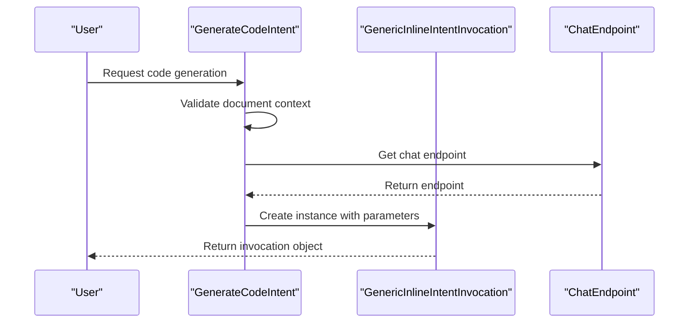
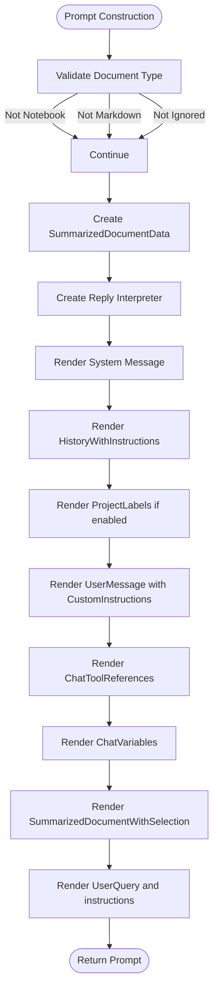
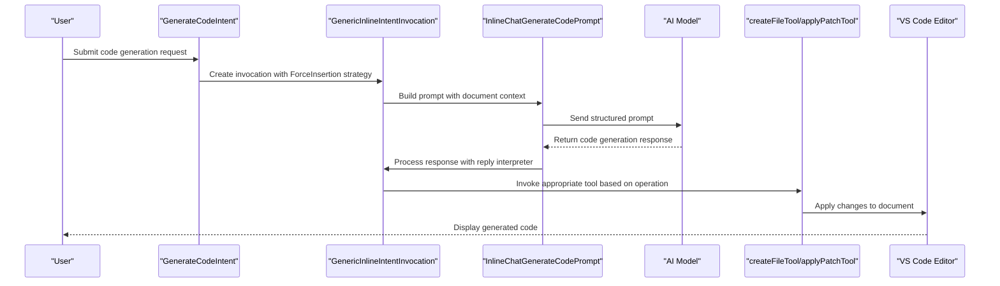

# Code Generation

<cite>
**Referenced Files in This Document**   
- [generateCodeIntent.ts](file://src/extension/intents/node/generateCodeIntent.ts)
- [inlineChatGenerateCodePrompt.tsx](file://src/extension/prompts/node/inline/inlineChatGenerateCodePrompt.tsx)
- [createFileTool.tsx](file://src/extension/tools/node/createFileTool.tsx)
- [applyPatchTool.tsx](file://src/extension/tools/node/applyPatchTool.tsx)
- [genericInlineIntentInvocation.ts](file://src/extension/context/node/resolvers/genericInlineIntentInvocation.ts)
- [editGeneration.ts](file://src/extension/prompt/node/editGeneration.ts)
- [summarizedDocumentWithSelection.ts](file://src/extension/intents/node/testIntent/summarizedDocumentWithSelection.ts)
</cite>

## Table of Contents
1. [Introduction](#introduction)
2. [Intent Processing Pipeline](#intent-processing-pipeline)
3. [Prompt Construction and Context](#prompt-construction-and-context)
4. [Code Generation Workflow](#code-generation-workflow)
5. [Tool Integration](#tool-integration)
6. [Configuration Options](#configuration-options)
7. [Error Handling and Security](#error-handling-and-security)
8. [Performance Considerations](#performance-considerations)
9. [Conclusion](#conclusion)

## Introduction

The Code Generation feature in the vscode-copilot-chat extension enables users to generate new code through natural language requests. This document details the implementation of the code generation pipeline, focusing on the `generateCodeIntent` handler and the `inlineChatGenerateCodePrompt` component. The system transforms user requests into actual code via prompt templates and executes file operations using specialized tools. The architecture follows a modular design with clear separation between intent processing, prompt construction, and code execution phases.

**Section sources**
- [generateCodeIntent.ts](file://src/extension/intents/node/generateCodeIntent.ts#L1-L39)
- [inlineChatGenerateCodePrompt.tsx](file://src/extension/prompts/node/inline/inlineChatGenerateCodePrompt.tsx#L1-L116)

## Intent Processing Pipeline

The code generation process begins with the `GenerateCodeIntent` class, which implements the `IIntent` interface. This intent is triggered when users request new code generation within the editor context. The intent validation ensures that a document context exists before proceeding, throwing an error if no file is open.

The `invoke` method creates a `GenericInlineIntentInvocation` instance, passing the current intent, location, endpoint, document context, and edit strategy. The `EditStrategy.ForceInsertion` parameter specifies that code should always be inserted at the cursor location, regardless of surrounding context. This strategy is specifically designed for code generation scenarios where the user wants to add new code rather than modify existing code.

The intent system supports multiple locations, but code generation is restricted to the editor context (`ChatLocation.Editor`). The intent is marked as hidden from users through the `hiddenFromUser: true` commandInfo setting, making it available only through direct invocation rather than appearing in command lists.



**Diagram sources**
- [generateCodeIntent.ts](file://src/extension/intents/node/generateCodeIntent.ts#L16-L38)
- [genericInlineIntentInvocation.ts](file://src/extension/context/node/resolvers/genericInlineIntentInvocation.ts#L32-L81)

**Section sources**
- [generateCodeIntent.ts](file://src/extension/intents/node/generateCodeIntent.ts#L16-L38)
- [editGeneration.ts](file://src/extension/prompt/node/editGeneration.ts#L59-L79)

## Prompt Construction and Context

The `InlineChatGenerateCodePrompt` component is responsible for constructing the prompt that guides the AI model in generating appropriate code. This React-based component uses the `@vscode/prompt-tsx` library to create structured prompts with various message types and priority levels.

The prompt construction process begins with validation checks to ensure the document is neither a notebook nor a markdown file, as these content types require different handling. The component then creates a `SummarizedDocumentData` instance that captures the current document state, including language-specific information and selection context.

The rendered prompt consists of several key components:
- **System Message**: Establishes the AI's identity as "GitHub Copilot" and emphasizes expertise in the current language
- **Instruction Message**: Provides specific guidelines for code generation, including rules about code block formatting and placeholder handling
- **User Message**: Contains custom instructions, language server context, and the actual user query
- **Document Context**: Includes the summarized document with selection, providing context for code insertion

The prompt uses a sophisticated reply interpretation system that streams code blocks while suppressing markdown and stopping after the first code block. This ensures that only executable code is returned to the user, with proper handling of the placeholder text that marks insertion points.



**Diagram sources**
- [inlineChatGenerateCodePrompt.tsx](file://src/extension/prompts/node/inline/inlineChatGenerateCodePrompt.tsx#L31-L115)
- [summarizedDocumentWithSelection.ts](file://src/extension/intents/node/testIntent/summarizedDocumentWithSelection.ts#L1-L100)

**Section sources**
- [inlineChatGenerateCodePrompt.tsx](file://src/extension/prompts/node/inline/inlineChatGenerateCodePrompt.tsx#L31-L115)
- [summarizedDocumentWithSelection.ts](file://src/extension/intents/node/testIntent/summarizedDocumentWithSelection.ts#L1-L100)

## Code Generation Workflow

The code generation workflow follows a structured process from user request to code execution. When a user submits a code generation request, the `generateCodeIntent` handler validates the context and creates an invocation object. This object is then processed by the `GenericInlineIntentInvocation` class, which selects the appropriate prompt template based on the document type and edit strategy.

For code generation scenarios, the `InlineChatGenerateCodePrompt` is selected due to the `EditStrategy.ForceInsertion` parameter. The prompt renderer processes the template, incorporating document context, conversation history, and user variables. The resulting prompt is sent to the AI model endpoint, which generates a response containing code blocks.

The response processing is handled by the reply interpreter, which extracts code blocks and applies them to the document. For new file creation, the `createFileTool` is invoked with the generated content. For modifications to existing files, the `applyPatchTool` processes the changes using a specialized diff format.

The workflow includes several validation steps:
- Document context validation to ensure a file is open
- File type validation to prevent inappropriate operations
- Path resolution to handle workspace-relative paths
- Content exclusion checks to prevent modification of protected files

The system also implements telemetry tracking to monitor code generation usage and performance, with events for tool invocations and success/failure outcomes.



**Diagram sources**
- [generateCodeIntent.ts](file://src/extension/intents/node/generateCodeIntent.ts#L30-L37)
- [genericInlineIntentInvocation.ts](file://src/extension/context/node/resolvers/genericInlineIntentInvocation.ts#L45-L72)
- [inlineChatGenerateCodePrompt.tsx](file://src/extension/prompts/node/inline/inlineChatGenerateCodePrompt.tsx#L43-L115)

**Section sources**
- [generateCodeIntent.ts](file://src/extension/intents/node/generateCodeIntent.ts#L30-L37)
- [genericInlineIntentInvocation.ts](file://src/extension/context/node/resolvers/genericInlineIntentInvocation.ts#L45-L72)
- [inlineChatGenerateCodePrompt.tsx](file://src/extension/prompts/node/inline/inlineChatGenerateCodePrompt.tsx#L43-L115)

## Tool Integration

The code generation system relies on specialized tools to execute file operations. The two primary tools are `createFileTool` and `applyPatchTool`, both implementing the `ICopilotTool` interface and registered with the `ToolRegistry`.

The `createFileTool` handles the creation of new files with specified content. It validates that the target file does not already exist and that the path is valid. The tool supports both text files and notebooks, using different processing methods for each type. For notebooks, it processes code blocks and removes leading filepath comments before creating the new file.

The `applyPatchTool` processes modifications to existing files using a specialized diff format called "patch language." This format includes headers for file operations (Add, Delete, Update) and uses context lines to identify change locations. The tool implements sophisticated error handling, including a healing mechanism that attempts to fix invalid patches by sending them to a smaller, faster model for correction.

Both tools implement the `resolveInput` method to set up the prompt context and the `prepareInvocation` method to generate confirmation messages before execution. They also include comprehensive telemetry tracking to monitor usage patterns and identify potential issues.

Key parameters for tool integration:
- `filePath`: Target file path for operations
- `content`: Code content for new files or modifications
- `explanation`: Description of the intended changes
- `model`: AI model used for the operation
- `chatRequestId`: Unique identifier for the request

```mermaid
classDiagram
class ICopilotTool {
<<interface>>
+invoke(options, token) Promise~LanguageModelToolResult~
+resolveInput(input, promptContext) Promise~T~
+prepareInvocation(options, token) Promise~PreparedToolInvocation~
}
class CreateFileTool {
+toolName : string
+invoke(options, token) Promise~LanguageModelToolResult~
+resolveInput(input, promptContext) Promise~ICreateFileParams~
+prepareInvocation(options, token) Promise~PreparedToolInvocation~
-fileExists(uri) Promise~boolean~
-sendTelemetry(requestId, model, fileExtension) void
}
class ApplyPatchTool {
+toolName : string
+invoke(options, token) Promise~LanguageModelToolResult~
+resolveInput(input, promptContext) Promise~IApplyPatchToolParams~
+prepareInvocation(options, token) Promise~PreparedToolInvocation~
-buildCommit(patch, docText) Promise~{commit, docTexts}~
-healCommit(patch, docs, explanation, token) Promise~string~
-sendApplyPatchTelemetry(outcome, options, file, healed, isNotebook) void
}
class ToolRegistry {
+registerTool(tool) void
+getTool(name) ICopilotTool
}
ICopilotTool <|-- CreateFileTool
ICopilotTool <|-- ApplyPatchTool
ToolRegistry --> CreateFileTool : registers
ToolRegistry --> ApplyPatchTool : registers
```

**Diagram sources**
- [createFileTool.tsx](file://src/extension/tools/node/createFileTool.tsx#L43-L201)
- [applyPatchTool.tsx](file://src/extension/tools/node/applyPatchTool.tsx#L61-L720)
- [toolsRegistry.ts](file://src/extension/tools/common/toolsRegistry.ts#L1-L50)

**Section sources**
- [createFileTool.tsx](file://src/extension/tools/node/createFileTool.tsx#L43-L201)
- [applyPatchTool.tsx](file://src/extension/tools/node/applyPatchTool.tsx#L61-L720)

## Configuration Options

The code generation feature supports several configuration options that control its behavior. These options are accessed through the `IConfigurationService` and can be influenced by experimentation settings.

Key configuration parameters include:
- `ConfigKey.Advanced.ProjectLabelsInline`: Controls whether project labels are included in inline prompts
- `EditStrategy`: Determines how code is inserted or replaced in the document
- `promptContext.request.model`: Specifies the AI model to use for code generation
- `promptPathRepresentationService`: Handles path resolution for file operations

The system also supports experimentation-based configuration, allowing different behaviors to be tested with user segments. This is implemented through the `IExperimentationService`, which provides feature flags and A/B testing capabilities.

Additional parameters that affect code generation:
- `tokenizationOptions`: Controls how text is tokenized for model input
- `flexGrow` and `flexReserve`: Manage prompt sizing and token budget allocation
- `priority` values: Determine the order of prompt elements in the final prompt
- `requestId` and `interactionId`: Track individual requests for telemetry and debugging

These configuration options provide flexibility for both users and developers, allowing customization of the code generation behavior while maintaining a consistent interface.

**Section sources**
- [inlineChatGenerateCodePrompt.tsx](file://src/extension/prompts/node/inline/inlineChatGenerateCodePrompt.tsx#L63-L64)
- [configurationService.ts](file://src/platform/configuration/common/configurationService.ts#L1-L100)
- [experimentationService.ts](file://src/platform/telemetry/common/nullExperimentationService.ts#L1-L50)

## Error Handling and Security

The code generation system implements comprehensive error handling and security measures to protect users and their codebases. The primary security mechanism is the `ignoreService`, which prevents code generation in files marked as copilot-ignored. This is checked at the prompt construction stage, returning an `ignoredFiles` component if the current file is excluded.

Input validation is performed at multiple levels:
- Path validation ensures that file paths are properly resolved and accessible
- Content exclusion checks prevent modification of sensitive files
- Document type validation prevents inappropriate operations on notebooks and markdown files
- Existence checks prevent overwriting existing files without proper tool usage

The `applyPatchTool` includes sophisticated error handling with a healing mechanism that attempts to fix invalid patches. When a patch fails to apply, it is sent to a smaller, faster model (copilot-fast) for correction. This reduces the cost of error recovery compared to using the primary model for retries.

Telemetry is used extensively to monitor errors and track their resolution:
- `createFileToolInvoked` event tracks file creation attempts
- `applyPatchToolInvoked` event monitors patch application success/failure
- `applyPatchHealRate` event measures the effectiveness of the healing mechanism
- Detailed error information is captured for debugging and improvement

Security considerations also include:
- Proper path resolution to prevent directory traversal attacks
- Token-based cancellation to prevent long-running operations
- Stream validation to ensure responses are properly processed
- Confirmation dialogs for potentially destructive operations

**Section sources**
- [inlineChatGenerateCodePrompt.tsx](file://src/extension/prompts/node/inline/inlineChatGenerateCodePrompt.tsx#L56-L59)
- [createFileTool.tsx](file://src/extension/tools/node/createFileTool.tsx#L67-L97)
- [applyPatchTool.tsx](file://src/extension/tools/node/applyPatchTool.tsx#L194-L240)
- [toolUtils.ts](file://src/extension/tools/common/toolUtils.ts#L1-L50)

## Performance Considerations

The code generation system is designed with performance optimization in mind, particularly regarding token usage and response latency. The prompt construction process uses priority-based rendering to ensure critical information is included even when token limits are reached.

Key performance features:
- **Token Budget Management**: The `tokenBudget` parameter in `SummarizedDocumentWithSelection` controls how much context is included in the prompt
- **Streaming Responses**: Code blocks are streamed as they are generated, providing immediate feedback to users
- **Caching Mechanisms**: The `applyPatchTool` implements a simple cache to avoid reprocessing identical patches
- **Parallel Processing**: Multiple file operations can be processed in a single request when appropriate

The system also implements telemetry to monitor performance metrics:
- Response times for code generation requests
- Token usage patterns across different file types
- Success rates for patch application and healing
- User interaction patterns with generated code

Optimization opportunities include:
- Improving the patch healing mechanism to reduce reliance on secondary models
- Enhancing context summarization to better preserve relevant information
- Optimizing the reply interpreter for faster code extraction
- Reducing memory usage in document snapshot operations

**Section sources**
- [inlineChatGenerateCodePrompt.tsx](file://src/extension/prompts/node/inline/inlineChatGenerateCodePrompt.tsx#L103-L104)
- [applyPatchTool.tsx](file://src/extension/tools/node/applyPatchTool.tsx#L66-L68)
- [promptRenderer.ts](file://src/extension/prompts/node/base/promptRenderer.ts#L1-L100)
- [chatResponseStreamImpl.ts](file://src/util/common/chatResponseStreamImpl.ts#L1-L50)

## Conclusion

The Code Generation feature in vscode-copilot-chat provides a robust framework for transforming natural language requests into executable code. The system follows a well-structured pipeline from intent processing through prompt construction to code execution, with clear separation of concerns between components.

Key strengths of the implementation include:
- Modular design with reusable components
- Comprehensive error handling and security measures
- Flexible configuration options for customization
- Detailed telemetry for monitoring and improvement
- Support for both new file creation and existing file modification

The integration of specialized tools like `createFileTool` and `applyPatchTool` enables precise control over code generation operations while maintaining safety and reliability. The use of structured prompts with context-aware templates ensures high-quality code generation that respects the existing codebase structure.

For developers looking to extend or customize the code generation features, the system provides clear extension points through the intent system, tool registry, and prompt template framework. The comprehensive documentation and type definitions make it accessible for both beginners and experienced developers.