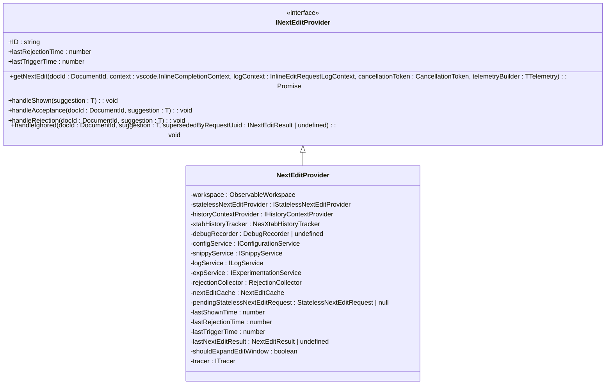
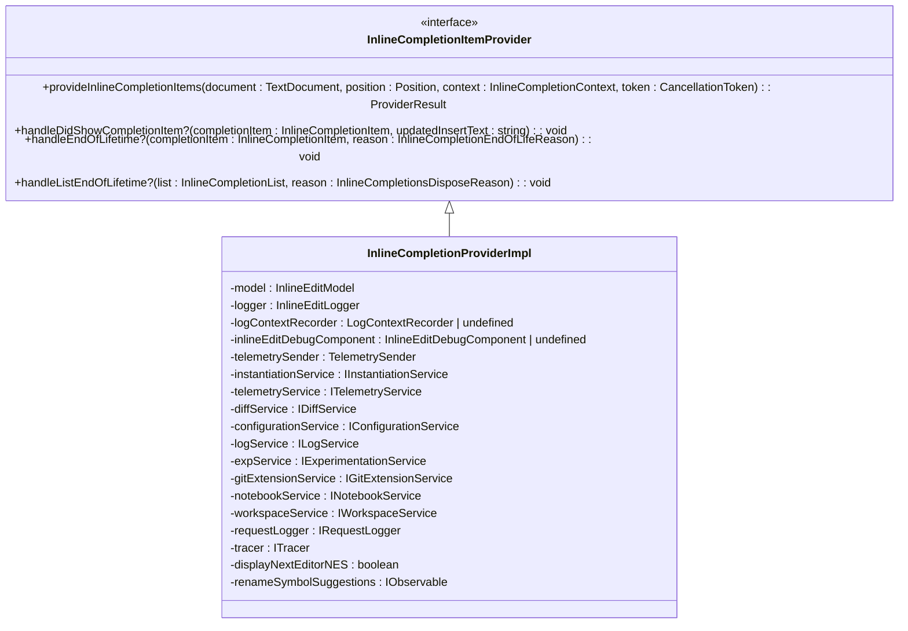
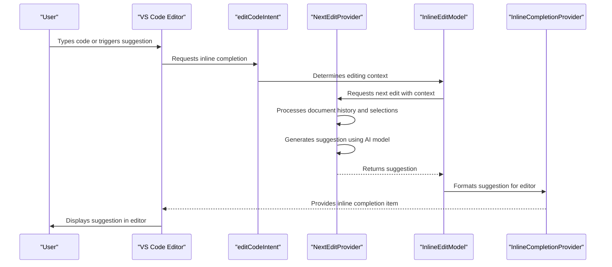
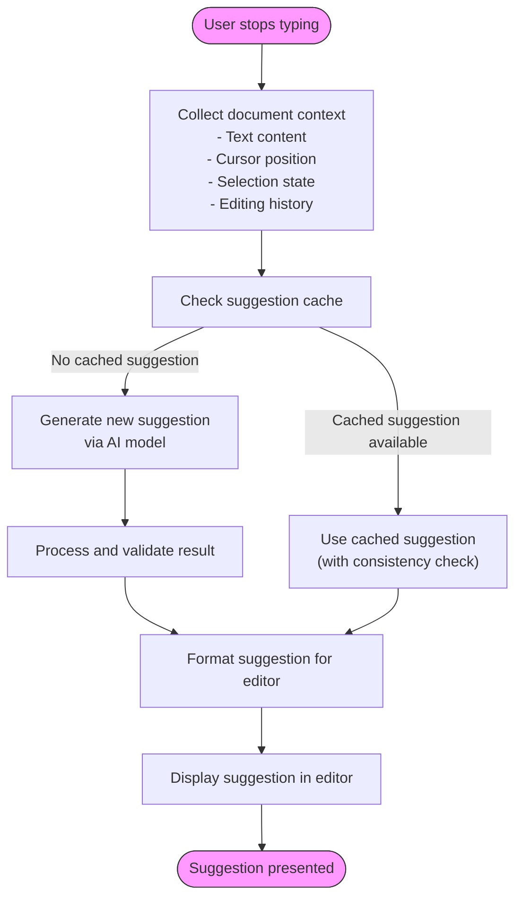
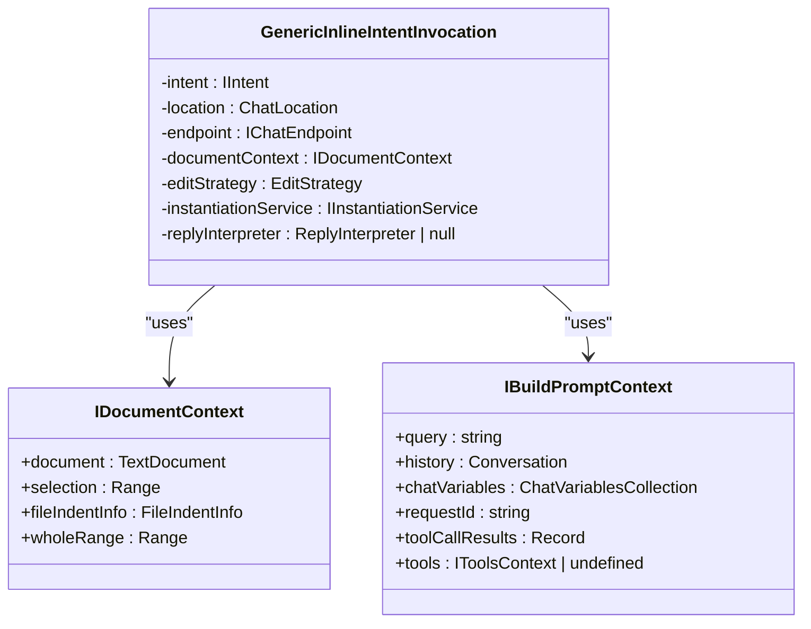
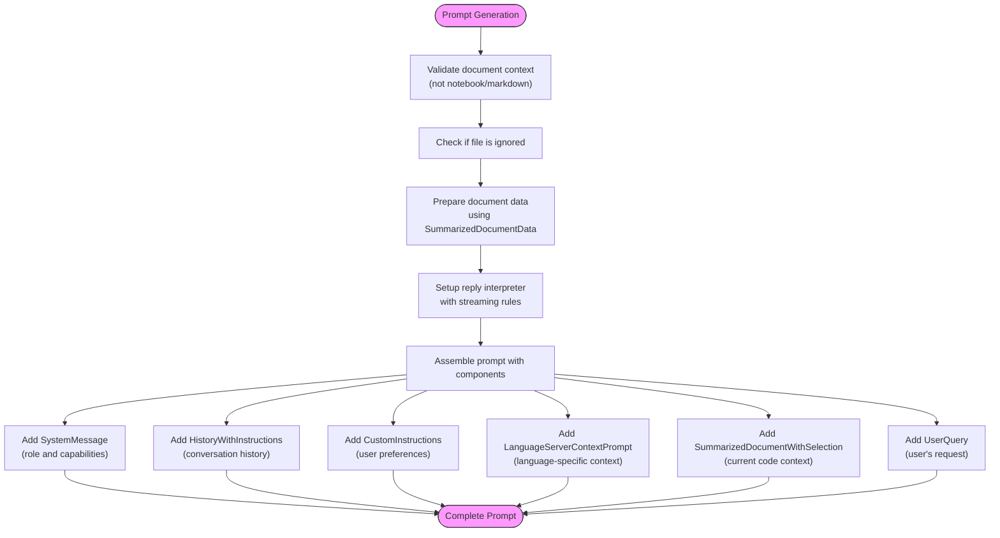

# Inline Editing

<cite>
**Referenced Files in This Document**   
- [nextEditProvider.ts](file://src/extension/inlineEdits/node/nextEditProvider.ts)
- [inlineCompletionProvider.ts](file://src/extension/inlineEdits/vscode-node/inlineCompletionProvider.ts)
- [inlineChatEditCodePrompt.tsx](file://src/extension/prompts/node/inline/inlineChatEditCodePrompt.tsx)
- [editCodeIntent.ts](file://src/extension/intents/node/editCodeIntent.ts)
- [genericInlineIntentInvocation.ts](file://src/extension/context/node/resolvers/genericInlineIntentInvocation.ts)
- [inlineEditModel.ts](file://src/extension/inlineEdits/vscode-node/inlineEditModel.ts)
- [configurationService.ts](file://src/platform/configuration/common/configurationService.ts)
- [createNextEditProvider.ts](file://src/extension/inlineEdits/node/createNextEditProvider.ts)
- [jointInlineCompletionProvider.ts](file://src/extension/inlineEdits/vscode-node/jointInlineCompletionProvider.ts)
</cite>

## Table of Contents
1. [Introduction](#introduction)
2. [Core Components](#core-components)
3. [Domain Model](#domain-model)
4. [Implementation Details](#implementation-details)
5. [Configuration Options](#configuration-options)
6. [Prompt Templates](#prompt-templates)
7. [Common Issues](#common-issues)
8. [Conclusion](#conclusion)

## Introduction
The Inline Editing feature in the vscode-copilot-chat extension provides intelligent code suggestions directly within the editor context. This documentation details the implementation of how inline code suggestions are generated, presented, and applied within the editor. The system leverages advanced AI models to analyze code context, user intent, and recent editing history to provide relevant suggestions that appear seamlessly in the editor. The feature is designed to enhance developer productivity by reducing context switching and providing intelligent code completions that understand the broader codebase context.

## Core Components

The inline editing functionality is built around several key components that work together to provide intelligent code suggestions. The primary components include the NextEditProvider, InlineCompletionProvider, and the interaction between editCodeIntent and the completion system. These components form a cohesive system that processes user context, generates suggestions, and manages their presentation and application in the editor.

The architecture follows a layered approach where lower-level components handle data processing and suggestion generation, while higher-level components manage the integration with the VS Code editor interface. This separation of concerns allows for modular development and easier maintenance of the feature.

**Section sources**
- [nextEditProvider.ts](file://src/extension/inlineEdits/node/nextEditProvider.ts#L45-L54)
- [inlineCompletionProvider.ts](file://src/extension/inlineEdits/vscode-node/inlineCompletionProvider.ts#L104-L116)
- [editCodeIntent.ts](file://src/extension/intents/node/editCodeIntent.ts#L82-L91)

## Domain Model

### NextEditProvider
The NextEditProvider is the core component responsible for generating inline code suggestions. It implements the `INextEditProvider` interface and serves as the primary interface between the AI model and the editor. The provider receives context about the current document state, user selections, and editing history to generate relevant suggestions.

**Diagram sources**
- [nextEditProvider.ts](file://src/extension/inlineEdits/node/nextEditProvider.ts#L45-L54)

### InlineCompletionProvider
The InlineCompletionProvider acts as the bridge between the VS Code editor's inline completion system and the NextEditProvider. It implements the `InlineCompletionItemProvider` interface defined by VS Code, allowing it to integrate seamlessly with the editor's completion system.

**Diagram sources**
- [inlineCompletionProvider.ts](file://src/extension/inlineEdits/vscode-node/inlineCompletionProvider.ts#L104-L116)

### editCodeIntent and Completion System Interaction
The editCodeIntent component serves as the entry point for inline editing functionality, coordinating between user intent, prompt generation, and the completion system. It determines when to use inline editing versus other completion methods based on context and configuration.

**Diagram sources**
- [editCodeIntent.ts](file://src/extension/intents/node/editCodeIntent.ts#L180-L192)
- [inlineEditModel.ts](file://src/extension/inlineEdits/vscode-node/inlineEditModel.ts#L32-L61)

## Implementation Details

### Suggestion Generation Process
The suggestion generation process begins when the user stops typing or explicitly triggers an inline completion. The system follows a multi-step process to generate relevant suggestions:

1. **Context Collection**: The system collects information about the current document, including the text content, cursor position, selection state, and recent editing history.
2. **History Analysis**: The NesHistoryContextProvider analyzes the document's editing history to understand recent changes and patterns.
3. **Request Processing**: The NextEditProvider processes the request, checking its cache for previously generated suggestions that might still be relevant.
4. **AI Model Invocation**: If no suitable cached suggestion is found, the system invokes the AI model through the statelessNextEditProvider to generate a new suggestion.
5. **Result Processing**: The generated suggestion is processed, validated, and formatted for presentation in the editor.

The process includes sophisticated caching mechanisms to improve performance and reduce redundant AI model calls. The system also implements debouncing to avoid generating suggestions too frequently during active typing.

**Section sources**
- [nextEditProvider.ts](file://src/extension/inlineEdits/node/nextEditProvider.ts#L122-L317)
- [inlineEditModel.ts](file://src/extension/inlineEdits/vscode-node/inlineEditModel.ts#L85-L311)

### User Selection and Context Processing
The system processes user selections and context through a sophisticated mechanism that considers both the immediate editing context and broader project context. When a user makes a selection or positions the cursor, the system analyzes several factors:

- **Document Context**: The content of the current document, including syntax, structure, and recent changes
- **Selection Context**: The specific code selected by the user, if any
- **Editing History**: Recent edits made to the document to understand the user's current workflow
- **Project Context**: Relevant files and code patterns from the broader project

The GenericInlineIntentInvocation class plays a crucial role in this process, determining the appropriate prompt template based on the document type and user intent. For example, different prompts are used for code files versus markdown files, and for editing existing code versus generating new code.

**Diagram sources**
- [genericInlineIntentInvocation.ts](file://src/extension/context/node/resolvers/genericInlineIntentInvocation.ts#L32-L81)
- [inlineChatEditCodePrompt.tsx](file://src/extension/prompts/node/inline/inlineChatEditCodePrompt.tsx#L42-L127)

## Configuration Options

### Inline Editing Behavior Configuration
The inline editing feature provides several configuration options that control its behavior. These options are defined in the configurationService and can be accessed through the ConfigKey enum.

| Configuration Key | Type | Default Value | Description |
|-------------------|------|---------------|-------------|
| InlineEditsEnabled | boolean | true | Enables or disables the inline editing feature |
| InlineEditsDebounce | number | 200 | Debounce time in milliseconds before suggesting edits |
| InlineEditsCacheDelay | number | 200 | Delay in milliseconds for cached suggestions |
| InlineEditsSubsequentCacheDelay | number \| undefined | 0 | Delay for subsequent cached suggestions |
| InlineEditsRebasedCacheDelay | number \| undefined | 0 | Delay for rebased cached suggestions |
| InlineEditsBackoffDebounceEnabled | boolean | true | Enables backoff debouncing |
| InlineEditsExtraDebounceEndOfLine | number | 0 | Extra debounce time at end of line |
| InlineEditsDebounceOnSelectionChange | number \| undefined | undefined | Debounce time on selection change |

**Section sources**
- [configurationService.ts](file://src/platform/configuration/common/configurationService.ts#L729-L738)

### Edit Generation Parameters
The system provides parameters that control how edits are generated and presented. These parameters influence the AI model's behavior and the formatting of suggestions.

| Parameter | Type | Default Value | Description |
|---------|------|---------------|-------------|
| InlineEditsProviderId | string \| undefined | undefined | ID of the provider used for generating edits |
| InlineEditsUnification | boolean | false | Enables unification of inline edits with other completion providers |
| InlineEditsNextCursorPredictionEnabled | NextCursorLinePrediction \| boolean \| undefined | OnlyWithEdit | Enables cursor prediction after edits |
| InlineEditsNextCursorPredictionModelName | string \| undefined | "xtab-cursor-jump-1104" | Model name for cursor prediction |
| InlineEditsXtabProviderModelConfigurationString | string \| undefined | undefined | Model configuration string for XTab provider |
| InlineEditsXtabProviderDefaultModelConfigurationString | string \| undefined | undefined | Default model configuration string |
| InlineEditsXtabProviderUseVaryingLinesAbove | boolean \| undefined | undefined | Uses varying lines above in context |
| InlineEditsXtabProviderNLinesAbove | number \| undefined | undefined | Number of lines above to include in context |
| InlineEditsXtabProviderNLinesBelow | number \| undefined | undefined | Number of lines below to include in context |
| InlineEditsAutoExpandEditWindowLines | number \| undefined | undefined | Number of lines to expand edit window |

**Section sources**
- [configurationService.ts](file://src/platform/configuration/common/configurationService.ts#L739-L748)

### Return Values for Key Functions
The key functions in the inline editing system return structured data that includes both the edit suggestion and metadata about the suggestion generation process.

| Function | Return Type | Description |
|--------|------------|-------------|
| getNextEdit | Promise<NextEditResult> | Returns a promise that resolves to a NextEditResult containing the suggested edit and metadata |
| provideInlineCompletionItems | Promise<NesCompletionList \| undefined> | Returns a promise that resolves to a NesCompletionList containing the inline completion items |
| handleAcceptance | void | Called when a suggestion is accepted, updates internal state and telemetry |
| handleRejection | void | Called when a suggestion is rejected, updates rejection tracking |
| handleIgnored | void | Called when a suggestion is ignored (superseded by another), updates tracking |

The NextEditResult contains the actual edit suggestion (insert text and range), as well as metadata such as the show range preference, jump-to position, and action commands.

**Section sources**
- [nextEditProvider.ts](file://src/extension/inlineEdits/node/nextEditProvider.ts#L122-L159)
- [inlineCompletionProvider.ts](file://src/extension/inlineEdits/vscode-node/inlineCompletionProvider.ts#L148-L354)

## Prompt Templates

### inlineChatEditCodePrompt Structure
The inlineChatEditCodePrompt is a React-like component that defines the structure and content of the prompt sent to the AI model for code editing suggestions. It uses the @vscode/prompt-tsx library to create structured prompts with dynamic content.

```mermaid
classDiagram
class InlineChatEditCodePrompt {
+props : InlineChatEditCodePromptProps
-ignoreService : IIgnoreService
-parserService : IParserService
-experimentationService : IExperimentationService
-configurationService : IConfigurationService
}
class InlineChatEditCodePromptProps {
+documentContext : IDocumentContext
+promptContext : IBuildPromptContext
}
class SystemMessage {
+priority : number
+children : ReactNode
}
class UserMessage {
+priority : number
+flexGrow : number
+flexReserve : number
+children : ReactNode
}
class HistoryWithInstructions {
+inline : boolean
+historyPriority : number
+passPriority : boolean
+history : Conversation
+children : ReactNode
}
class InstructionMessage {
+priority : number
+children : ReactNode
}
class CustomInstructions {
+priority : number
+chatVariables : ChatVariablesCollection
+languageId : string
}
class LanguageServerContextPrompt {
+priority : number
+document : TextDocument
+position : Position
+requestId : string
+source : string
}
class SummarizedDocumentWithSelection {
+flexGrow : number
+tokenBudget : string
+documentData : SummarizedDocumentData
+createReplyInterpreter : (splitDoc : SummarizedDocumentSplit) => ReplyInterpreter
}
class Tag {
+name : string
+children : ReactNode
}
InlineChatEditCodePrompt --> InlineChatEditCodePromptProps : "receives"
InlineChatEditCodePrompt --> SystemMessage : "renders"
InlineChatEditCodePrompt --> HistoryWithInstructions : "renders"
InlineChatEditCodePrompt --> InstructionMessage : "renders"
InlineChatEditCodePrompt --> CustomInstructions : "renders"
InlineChatEditCodePrompt --> LanguageServerContextPrompt : "renders"
InlineChatEditCodePrompt --> SummarizedDocumentWithSelection : "renders"
InlineChatEditCodePrompt --> Tag : "renders"
```

**Diagram sources**
- [inlineChatEditCodePrompt.tsx](file://src/extension/prompts/node/inline/inlineChatEditCodePrompt.tsx#L42-L127)

### Prompt Generation Process
The prompt generation process transforms user context and intent into a structured prompt that guides the AI model's response. The process involves several steps:

1. **Context Validation**: The system validates that the document is appropriate for inline editing (not a notebook or markdown file).
2. **Ignore Check**: It checks if the file is in the copilot ignore list.
3. **Data Preparation**: The SummarizedDocumentData is created, which includes the document content and selection information.
4. **Reply Interpreter Setup**: A reply interpreter is configured to process the AI model's response, with specific rules for handling code blocks and early stopping.
5. **Prompt Assembly**: The final prompt is assembled using various components like SystemMessage, UserMessage, and custom instructions.

The prompt structure is designed to provide the AI model with sufficient context while maintaining clarity about the task. The system message establishes the AI's role and capabilities, while the user message contains the specific code context and editing request.

**Section sources**
- [inlineChatEditCodePrompt.tsx](file://src/extension/prompts/node/inline/inlineChatEditCodePrompt.tsx#L54-L124)

## Common Issues

### Edit Accuracy
Edit accuracy is a critical aspect of the inline editing feature. The system employs several mechanisms to ensure high-quality suggestions:

- **Contextual Understanding**: The AI model is provided with extensive context about the current code, including surrounding lines, recent edits, and project structure.
- **Consistency Checking**: Before presenting a suggestion, the system checks that it is consistent with the current document state.
- **Rejection Tracking**: The RejectionCollector component tracks rejected suggestions to avoid repeating the same incorrect suggestions.
- **Caching with Validation**: Suggestions are cached but validated against the current document state before reuse.

Despite these measures, accuracy issues can still occur, particularly when:
- The AI model misinterprets complex code patterns
- The context window is insufficient for understanding broader code relationships
- The suggestion conflicts with recent uncommitted changes

### Conflict Resolution with Existing Code
The system handles conflicts with existing code through several strategies:

1. **Document Change Detection**: The system monitors document changes and cancels pending suggestion requests if the document changes significantly during processing.
2. **Edit Rebase**: When a suggestion is retrieved from cache, the system attempts to rebase it onto the current document state using the editRebase utility.
3. **Consistency Validation**: Before applying a suggestion, the system validates that the edit range still matches the expected content.
4. **User Feedback Loop**: Rejected suggestions are recorded and used to improve future suggestions.

The conflict resolution process is particularly important when multiple users are working on the same codebase or when the user makes rapid changes. The system prioritizes safety by erring on the side of not suggesting edits when there is uncertainty about the document state.

### Handling of Multi-file Edits
The inline editing system supports multi-file edits through several mechanisms:

- **Working Set Management**: The EditCodeStep class maintains a working set of files that are relevant to the current editing session.
- **Cross-file Context**: The system can include context from multiple files in the prompt when generating suggestions.
- **Sequential Application**: When multiple file edits are suggested, they are applied sequentially with appropriate user confirmation.
- **Notebook Support**: Special handling is provided for notebook files, where edits might span multiple cells.

The system also includes safeguards to prevent unintended changes to files outside the current workspace. When a suggestion involves a file outside the workspace, the system creates an untitled file instead, allowing the user to save it when ready.

**Section sources**
- [nextEditProvider.ts](file://src/extension/inlineEdits/node/nextEditProvider.ts#L242-L247)
- [editCodeIntent.ts](file://src/extension/intents/node/editCodeIntent.ts#L133-L163)
- [inlineEditModel.ts](file://src/extension/inlineEdits/vscode-node/inlineEditModel.ts#L107-L145)

## Conclusion
The Inline Editing feature in the vscode-copilot-chat extension represents a sophisticated integration of AI-powered code suggestions with the VS Code editor. By leveraging a modular architecture with well-defined components like NextEditProvider and InlineCompletionProvider, the system provides intelligent, context-aware suggestions that enhance developer productivity.

The feature's design emphasizes performance through caching and debouncing, accuracy through contextual understanding and consistency checking, and safety through careful conflict resolution. The configuration options provide flexibility for different development workflows, while the prompt template system ensures that the AI model receives well-structured requests.

For developers looking to extend or customize the inline editing functionality, the clear separation of concerns and comprehensive configuration system provide a solid foundation. The system's extensibility is further enhanced by its use of standard VS Code extension APIs and its modular component design.