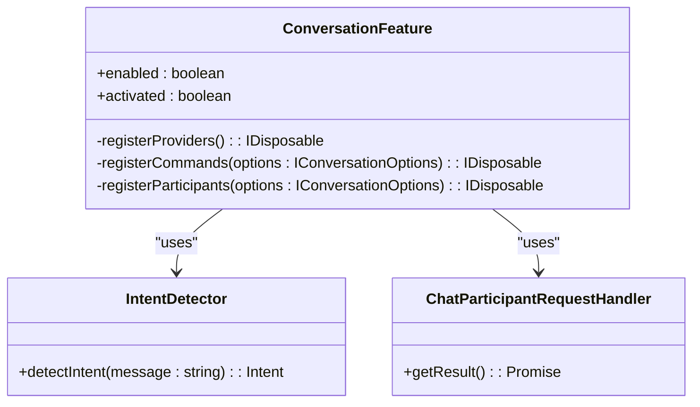
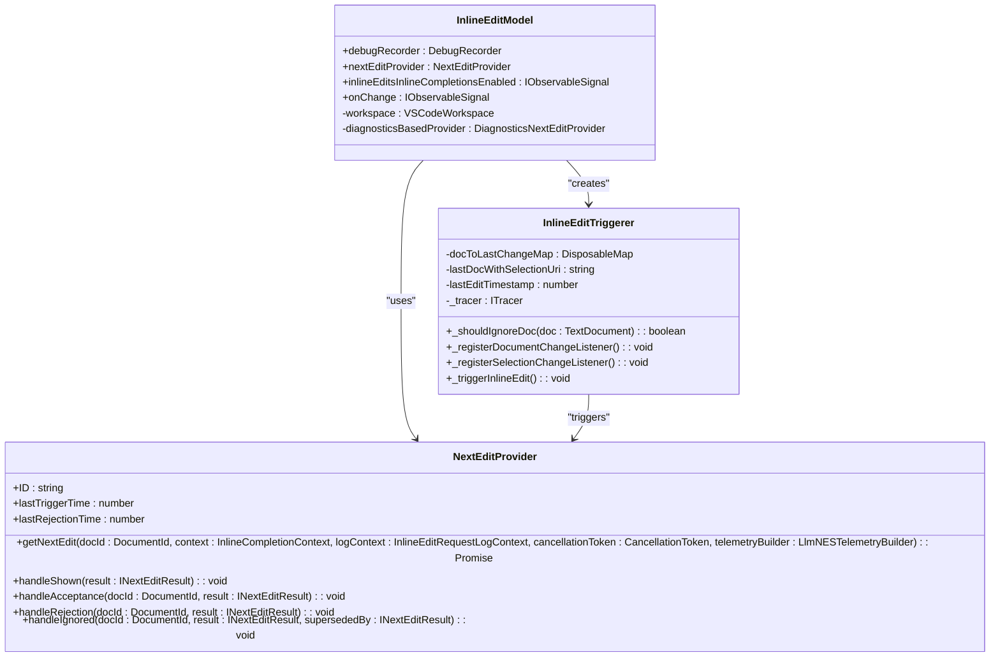
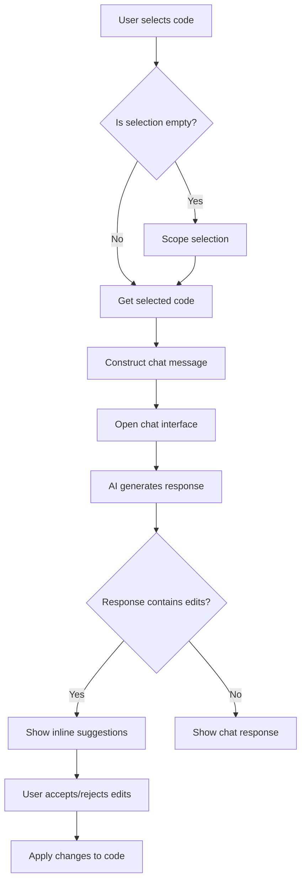
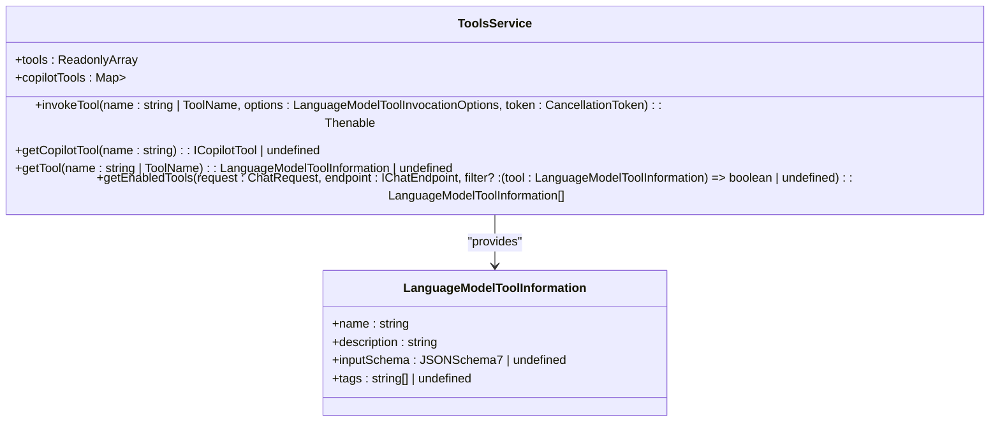

# Core Features

<cite>
**Referenced Files in This Document**   
- [README.md](file://README.md)
- [package.json](file://package.json)
- [src\extension\extension\vscode\extension.ts](file://src/extension/extension/vscode/extension.ts)
- [src\lib\node\chatLibMain.ts](file://src/lib/node/chatLibMain.ts)
- [src\extension\conversation\vscode-node\conversationFeature.ts](file://src/extension/conversation/vscode-node/conversationFeature.ts)
- [src\extension\inlineChat\vscode-node\inlineChatCommands.ts](file://src/extension/inlineChat/vscode-node/inlineChatCommands.ts)
- [src\extension\inlineEdits\vscode-node\inlineEditModel.ts](file://src/extension/inlineEdits/vscode-node/inlineEditModel.ts)
- [src\extension\tools\vscode-node\toolsService.ts](file://src/extension/tools/vscode-node/toolsService.ts)
- [src\platform\promptFiles\common\promptsService.ts](file://src/platform/promptFiles/common/promptsService.ts)
- [src\extension\intents\vscode-node\testGenAction.ts](file://src/extension/intents/vscode-node/testGenAction.ts)
</cite>

## Table of Contents
1. [Introduction](#introduction)
2. [Chat Interface](#chat-interface)
3. [Code Assistance Capabilities](#code-assistance-capabilities)
4. [Development Workflow Support](#development-workflow-support)
5. [Workspace Management](#workspace-management)
6. [Integration Features](#integration-features)
7. [Configuration Options](#configuration-options)
8. [Common Issues and Solutions](#common-issues-and-solutions)
9. [Conclusion](#conclusion)

## Introduction
The GitHub Copilot Chat extension provides AI-powered coding assistance within Visual Studio Code, offering features like inline suggestions, chat-based code help, and AI-powered coding sessions. This document details the core features of the extension, focusing on implementation details, interfaces, domain models, and usage patterns.

**Section sources**
- [README.md](file://README.md#L1-L84)

## Chat Interface
The chat interface in GitHub Copilot Chat allows users to interact with the AI assistant through a conversational interface. The interface is activated through the `ConversationFeature` class, which registers various providers and commands to enable chat functionality.

The chat interface supports multiple interaction modes, including inline chat within the editor and a dedicated chat view. Users can ask questions about their code, request explanations, generate tests, and perform code fixes through natural language commands.

Key components of the chat interface include:
- **ConversationFeature**: Manages the activation and registration of chat providers and commands
- **IntentDetector**: Detects user intents from chat messages
- **ChatParticipantRequestHandler**: Handles requests from chat participants

The chat interface integrates with VS Code's proposed APIs, including `chatProvider`, `chatEditing`, and `chatSessionsProvider`, to provide a seamless user experience.



**Diagram sources **
- [src\extension\conversation\vscode-node\conversationFeature.ts](file://src/extension/conversation/vscode-node/conversationFeature.ts#L49-L380)
- [src\extension\prompt\node\intentDetector.ts](file://src/extension/prompt/node/intentDetector.ts)
- [src\extension\prompt\node\chatParticipantRequestHandler.ts](file://src/extension/prompt/node/chatParticipantRequestHandler.ts)

**Section sources**
- [src\extension\conversation\vscode-node\conversationFeature.ts](file://src/extension/conversation/vscode-node/conversationFeature.ts#L49-L380)

## Code Assistance Capabilities
GitHub Copilot Chat provides several code assistance capabilities, including inline editing, code explanation, test generation, and code fixes. These features are implemented through a combination of AI models and VS Code integration.

### Inline Editing
Inline editing allows users to make code changes directly in the editor through natural language commands. The feature is implemented through the `inlineEditModel` and `inlineEditProvider` components.

The inline editing system uses a predictor model to suggest code changes based on the current context. The system tracks document changes and selection events to determine when to trigger suggestions. Key parameters include:

- **TRIGGER_INLINE_EDIT_AFTER_CHANGE_LIMIT**: 10 seconds - time after which inline edits are triggered after a document change
- **TRIGGER_INLINE_EDIT_ON_SAME_LINE_COOLDOWN**: 5 seconds - cooldown period for triggering inline edits on the same line
- **TRIGGER_INLINE_EDIT_REJECTION_COOLDOWN**: 5 seconds - cooldown period after rejecting an inline edit suggestion



**Diagram sources **
- [src\extension\inlineEdits\vscode-node\inlineEditModel.ts](file://src/extension/inlineEdits/vscode-node/inlineEditModel.ts#L32-L312)
- [src\extension\inlineEdits\node\nextEditProvider.ts](file://src/extension/inlineEdits/node/nextEditProvider.ts)

**Section sources**
- [src\extension\inlineEdits\vscode-node\inlineEditModel.ts](file://src/extension/inlineEdits/vscode-node/inlineEditModel.ts#L32-L312)

### Code Explanation
The code explanation feature allows users to get explanations of their code through natural language queries. This is implemented through the `doExplain` function in the `inlineChatCommands` module.

When a user requests code explanation, the system:
1. Retrieves the current selection or scope
2. Formats the selected code with appropriate context
3. Constructs a chat message with the explanation intent
4. Opens the chat interface with the prepared message

The explanation process uses the workspace context participant to provide relevant code context to the AI model.

### Test Generation
Test generation is implemented through the `GenerateTests` class, which provides functionality to generate tests for code. The feature works by:

1. Identifying the source file and selection
2. Determining if the file is a test file
3. If not a test file, finding or creating a test file
4. Determining the insertion position for tests
5. Opening the test file and positioning the cursor
6. Launching the chat interface with the test generation intent

The `GenerateTests` class uses several services to accomplish this:
- **ParserService**: To analyze the code structure and identify testable nodes
- **TestFileFinder**: To locate existing test files
- **TestGenInfoStorage**: To store information about the source file being tested

```mermaid
classDiagram
class GenerateTests {
+runCommand(context? : { document : TextDocument; selection : vscode.Range }) : Promise<void>
-identifyTestableNode(srcFile : TextDocumentSnapshot, selection : Range) : Promise<{ identifier : string; range : Range } | null>
-findOrCreateTestFile(srcFile : TextDocumentSnapshot) : Promise<Uri>
-determineTestInsertPosition(testDoc : TextDocument) : Promise<Range>
-updateTestGenInfo(srcFile : TextDocumentSnapshot, testableNode : { identifier : string; range : Range } | null, selection : Range) : void
-getTabGroupByUri(uri : Uri) : ViewColumn | undefined
}
class TestFileFinder {
+findTestFileForSourceFile(srcFile : TextDocumentSnapshot, token : CancellationToken) : Promise<Uri | undefined>
}
class ParserService {
+getTreeSitterAST(document : TextDocumentSnapshot) : Promise<TreeSitterAST | null>
}
class TestGenInfoStorage {
+sourceFileToTest : { uri : Uri; target : Range; identifier : string | undefined }
}
GenerateTests --> TestFileFinder : "uses"
GenerateTests --> ParserService : "uses"
GenerateTests --> TestGenInfoStorage : "uses"
```

**Diagram sources **
- [src\extension\intents\vscode-node\testGenAction.ts](file://src/extension/intents/vscode-node/testGenAction.ts#L18-L179)
- [src\extension\prompt\node\testFiles.ts](file://src/extension/prompt/node/testFiles.ts)
- [src\platform\parser\node\parserService.ts](file://src/platform/parser/node/parserService.ts)

**Section sources**
- [src\extension\intents\vscode-node\testGenAction.ts](file://src/extension/intents/vscode-node/testGenAction.ts#L18-L179)

## Development Workflow Support
GitHub Copilot Chat provides several features to support the development workflow, including inline chat, code fixes, and review capabilities.

### Inline Chat
Inline chat allows users to interact with the AI assistant directly in the editor context. The feature is implemented through commands registered in the `inlineChatCommands` module.

Key inline chat commands include:
- **github.copilot.chat.explain**: Explain the selected code
- **github.copilot.chat.generate**: Generate code
- **github.copilot.chat.generateDocs**: Generate documentation
- **github.copilot.chat.generateTests**: Generate tests
- **github.copilot.chat.fix**: Fix code issues

The inline chat system uses the `vscode.editorChat.start` command to initiate chat sessions with specific parameters:
- **message**: The initial message to send to the chat
- **autoSend**: Whether to automatically send the message
- **initialRange**: The range in the editor to associate with the chat

### Code Fixes
Code fixes are implemented through integration with VS Code's diagnostics system. The system can detect code issues and suggest fixes through the chat interface.

The `QuickFixesProvider` class implements VS Code's code actions API to provide fix suggestions. When diagnostics are detected in the current selection, the system can automatically suggest fixes through the chat interface.

### Review Capabilities
The review capabilities allow users to get AI-powered code reviews. The system implements a review session that can analyze code changes and provide feedback.

Key review commands include:
- **github.copilot.chat.review**: Review the current selection
- **github.copilot.chat.review.stagedChanges**: Review staged changes
- **github.copilot.chat.review.unstagedChanges**: Review unstaged changes
- **github.copilot.chat.review.changes**: Review all changes

The review system creates comment threads with suggested changes that users can apply, discard, or continue discussing in chat.



**Diagram sources **
- [src\extension\inlineChat\vscode-node\inlineChatCommands.ts](file://src/extension/inlineChat/vscode-node/inlineChatCommands.ts#L43-L424)

**Section sources**
- [src\extension\inlineChat\vscode-node\inlineChatCommands.ts](file://src/extension/inlineChat/vscode-node/inlineChatCommands.ts#L43-L424)

## Workspace Management
GitHub Copilot Chat provides several workspace management features to help users navigate and understand their codebase.

### Workspace Search
The extension implements workspace search capabilities through the `semanticSearchTextSearchProvider` class. This allows users to search for code using natural language queries.

The search functionality is registered through the `registerSearchProvider` method in the `ConversationFeature` class:

```typescript
private registerSearchProvider(): IDisposable | undefined {
    if (this._searchProviderRegistered) {
        return;
    } else {
        this._searchProviderRegistered = true;
        return vscode.workspace.registerAITextSearchProvider('file', this.instantiationService.createInstance(SemanticSearchTextSearchProvider));
    }
}
```

### Workspace Context
The system provides workspace context to the AI model through various context providers:
- **Workspace context participant**: Provides access to the entire workspace
- **Symbol context**: Provides information about symbols in the workspace
- **File search**: Allows searching for files by name or pattern
- **Code search**: Allows searching for code by content

These context providers are registered in the `package.json` file under the `contributes.languageModelTools` section:

```json
{
    "name": "copilot_searchCodebase",
    "toolReferenceName": "codebase",
    "displayName": "%copilot.tools.searchCodebase.name%",
    "icon": "$(folder)",
    "userDescription": "%copilot.codebase.tool.description%",
    "modelDescription": "Run a natural language search for relevant code or documentation comments from the user's current workspace.",
    "inputSchema": {
        "type": "object",
        "properties": {
            "query": {
                "type": "string",
                "description": "The query to search the codebase for."
            }
        },
        "required": ["query"]
    }
}
```

### Workspace Structure
The extension can read the workspace structure through the `copilot_readProjectStructure` tool, which provides a file tree representation of the workspace.

**Section sources**
- [src\extension\conversation\vscode-node\conversationFeature.ts](file://src/extension/conversation/vscode-node/conversationFeature.ts#L160-L173)
- [package.json](file://package.json#L144-L165)

## Integration Features
GitHub Copilot Chat integrates with various systems and services to enhance its capabilities.

### GitHub Integration
The extension provides integration with GitHub through several features:
- **Pull request title and description generation**: Helps users create meaningful pull request titles and descriptions
- **GitHub MCP (Model Context Protocol) integration**: Allows integration with GitHub's AI models
- **Repository context**: Provides access to repository information and history

The GitHub pull request providers are registered in the `conversationFeature` module:

```typescript
function registerGitHubPullRequestTitleAndDescriptionProvider(instantiationService: IInstantiationService): IDisposable {
    return instantiationService.createInstance(GitHubPullRequestProviders);
}
```

### Terminal Integration
The extension integrates with the VS Code terminal to provide assistance with command-line operations:

- **Terminal command explanation**: Explain the last terminal command
- **Terminal command fixing**: Fix failed terminal commands
- **Commit message generation**: Generate commit messages based on changes

These features are implemented through terminal quick fix providers:

```typescript
vscode.window.registerTerminalQuickFixProvider('copilot-chat.fixWithCopilot', {
    provideTerminalQuickFixes(commandMatchResult, token) {
        if (!isEnabled() || commandMatchResult.commandLine.endsWith('^C')) {
            return [];
        }
        setLastCommandMatchResult(commandMatchResult);
        return [
            {
                command: 'github.copilot.terminal.fixTerminalLastCommand',
                title: vscode.l10n.t('Fix using Copilot')
            },
            {
                command: 'github.copilot.terminal.explainTerminalLastCommand',
                title: vscode.l10n.t('Explain using Copilot')
            }
        ];
    }
})
```

### Extension Integration
The extension can integrate with other VS Code extensions through the `toolsService` class, which manages language model tools:

```typescript
class ToolsService extends BaseToolsService {
    get tools(): ReadonlyArray<vscode.LanguageModelToolInformation> {
        if (arraysEqual(this._contributedToolCache.input, vscode.lm.tools)) {
            return this._contributedToolCache.output;
        }
        
        const input = [...vscode.lm.tools];
        const contributedTools = [...input]
            .sort((a, b) => {
                // Sort builtin tools to the top
                const aIsBuiltin = a.name.startsWith('vscode_') || a.name.startsWith('copilot_');
                const bIsBuiltin = b.name.startsWith('vscode_') || b.name.startsWith('copilot_');
                if (aIsBuiltin && bIsBuiltin) {
                    return a.name.localeCompare(b.name);
                } else if (!aIsBuiltin && !bIsBuiltin) {
                    return a.name.localeCompare(b.name);
                }
                
                return aIsBuiltin ? -1 : 1;
            })
            .map(tool => {
                const owned = this._copilotTools.value.get(getToolName(tool.name) as ToolName);
                return owned?.alternativeDefinition?.(tool) ?? tool;
            });
            
        const result: vscode.LanguageModelToolInformation[] = contributedTools.map(tool => {
            return {
                ...tool,
                name: getToolName(tool.name),
                description: mapContributedToolNamesInString(tool.description),
                inputSchema: tool.inputSchema && mapContributedToolNamesInSchema(tool.inputSchema),
            };
        });
        
        this._contributedToolCache.input = input;
        this._contributedToolCache.output = result;
        
        return result;
    }
}
```

The system supports various tool types, including:
- **File operations**: Create, read, update, delete files
- **Code search**: Search for code and symbols
- **Git operations**: Get changed files, commit information
- **Terminal operations**: Run commands, get output



**Diagram sources **
- [src\extension\tools\vscode-node\toolsService.ts](file://src/extension/tools/vscode-node/toolsService.ts#L16-L155)

**Section sources**
- [src\extension\tools\vscode-node\toolsService.ts](file://src/extension/tools/vscode-node/toolsService.ts#L16-L155)

## Configuration Options
GitHub Copilot Chat provides several configuration options to customize its behavior. These options are defined in the `package.json` file and can be accessed through the `IConfigurationService`.

Key configuration options include:

### Inline Edits Configuration
- **github.copilot.inlineEdits.inlineCompletionsEnabled**: Enables or disables inline completions
- **github.copilot.inlineEdits.triggerOnEditorChangeAfterSeconds**: Sets the delay for triggering inline edits when switching editors
- **github.copilot.inlineEdits.debounceOnSelectionChange**: Sets the debounce time for inline edits on selection change

### Chat Configuration
- **github.copilot.chat.enableUserPreferences**: Enables user preferences storage
- **github.copilot.chat.newWorkspaceCreation.enabled**: Enables new workspace creation
- **github.copilot.chat.terminalChatLocation**: Sets the location for terminal chat (quickChat, terminal, or chatView)

### Advanced Configuration
- **github.copilot.advanced.inlineEditsTriggerOnEditorChangeAfterSeconds**: Advanced setting for inline edit triggering
- **github.copilot.teamInternal.inlineEditsXtabDiffNEntries**: Internal setting for tracking edit history
- **github.copilot.teamInternal.inlineEditsDebounceOnSelectionChange**: Internal setting for debouncing inline edits

The configuration service provides methods to access these settings:

```typescript
interface IConfigurationService {
    getConfig<T>(key: ConfigKey<T>): T | undefined;
    getExperimentBasedConfig<T>(key: ConfigKey<T>, expService: IExperimentationService): T | undefined;
    getConfigObservable<T>(key: ConfigKey<T>): IObservable<T>;
}
```

**Section sources**
- [package.json](file://package.json#L144-L734)
- [src\platform\configuration\common\configurationService.ts](file://src/platform/configuration/common/configurationService.ts)

## Common Issues and Solutions
Users may encounter several common issues when using GitHub Copilot Chat. This section addresses these issues and provides solutions.

### Authentication Issues
**Issue**: Copilot Chat fails to activate due to authentication problems.

**Solution**: Ensure you have an active GitHub Copilot subscription and are properly authenticated. The extension checks for a valid Copilot token during activation:

```typescript
this._disposables.add(this.authenticationService.onDidAuthenticationChange(() => {
    const hasSession = !!authenticationService.copilotToken;
    this.logService.debug(`ConversationFeature: onDidAuthenticationChange has token: ${hasSession}`);
    if (hasSession) {
        this.activated = true;
    } else {
        this.activated = false;
    }
}));
```

### Performance Issues
**Issue**: The extension is slow or unresponsive.

**Solution**: 
1. Ensure you are using the latest version of VS Code and the Copilot extension
2. Check your internet connection, as the extension requires network access to the Copilot service
3. Disable unnecessary extensions that might conflict with Copilot
4. Adjust configuration settings like `inlineEditsDebounceOnSelectionChange` to reduce processing load

### Inline Edit Issues
**Issue**: Inline edit suggestions are not appearing or are incorrect.

**Solution**:
1. Check that inline edits are enabled in the configuration
2. Ensure the file is not in the ignore list (output pane, etc.)
3. Verify that the document has recent changes (within 10 seconds)
4. Check that the selection is empty and on a single line
5. Ensure you're not within the cooldown period after rejecting a suggestion

### Tool Invocation Issues
**Issue**: Language model tools fail to execute.

**Solution**:
1. Verify that the tool is enabled in the tool picker
2. Check that the tool has the required permissions
3. Ensure the input parameters match the tool's schema
4. Verify network connectivity to the Copilot service

### Workspace Search Issues
**Issue**: Workspace search returns no results or incorrect results.

**Solution**:
1. Ensure the workspace is properly indexed
2. Check that the search query contains relevant keywords
3. Verify that the files are not ignored by .gitignore or other ignore files
4. Try using more specific search terms

**Section sources**
- [src\extension\conversation\vscode-node\conversationFeature.ts](file://src/extension/conversation/vscode-node/conversationFeature.ts#L87-L332)
- [src\extension\inlineEdits\vscode-node\inlineEditModel.ts](file://src/extension/inlineEdits/vscode-node/inlineEditModel.ts#L115-L117)
- [package.json](file://package.json#L144-L734)

## Conclusion
GitHub Copilot Chat provides a comprehensive set of AI-powered features to enhance developer productivity. The extension integrates seamlessly with VS Code, offering capabilities like inline editing, code explanation, test generation, and workspace management.

The architecture is modular, with clear separation of concerns between different components:
- **Chat interface**: Provides the user interaction layer
- **Code assistance**: Implements specific AI-powered coding features
- **Development workflow**: Supports common development tasks
- **Workspace management**: Helps users navigate and understand their codebase
- **Integration features**: Connects with external systems and services

The extension is highly configurable, allowing users to tailor its behavior to their preferences. It also provides robust error handling and diagnostic capabilities to help users resolve common issues.

By leveraging the power of AI and deep integration with VS Code, GitHub Copilot Chat significantly enhances the development experience, helping developers write code faster and smarter.

**Section sources**
- [README.md](file://README.md#L1-L84)
- [package.json](file://package.json#L1-L800)
- [src\extension\extension\vscode\extension.ts](file://src/extension/extension/vscode/extension.ts#L25-L108)