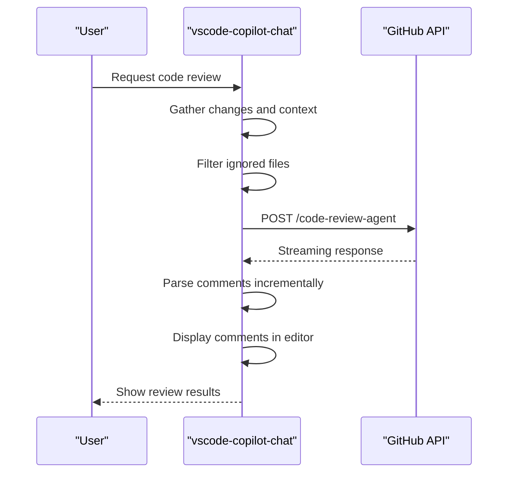
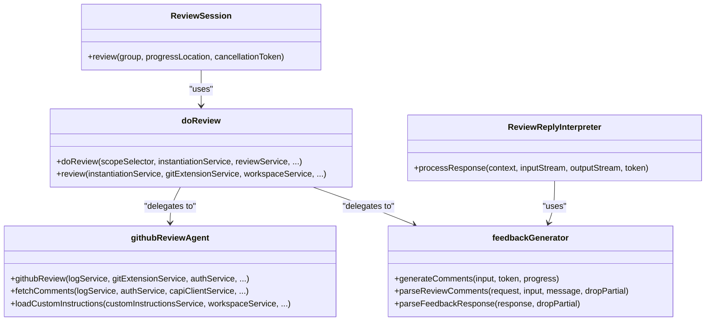

# Code Review

<cite>
**Referenced Files in This Document**   
- [doReview.ts](file://src/extension/review/node/doReview.ts)
- [githubReviewAgent.ts](file://src/extension/review/node/githubReviewAgent.ts)
- [githubPullRequestReviewerCommentsProvider.ts](file://src/extension/review/node/githubPullRequestReviewerCommentsProvider.ts)
- [reviewIntent.ts](file://src/extension/intents/node/reviewIntent.ts)
- [reviewService.ts](file://src/platform/review/common/reviewService.ts)
- [feedbackGenerator.ts](file://src/extension/prompt/node/feedbackGenerator.ts)
- [configurationService.ts](file://src/platform/configuration/common/configurationService.ts)
</cite>

## Table of Contents
1. [Introduction](#introduction)
2. [Review Intent Handler](#review-intent-handler)
3. [Domain Model for Code Review](#domain-model-for-code-review)
4. [GitHub Pull Request Integration](#github-pull-request-integration)
5. [Review Analysis Components](#review-analysis-components)
6. [Configuration Options](#configuration-options)
7. [Error Handling and Limitations](#error-handling-and-limitations)
8. [Conclusion](#conclusion)

## Introduction
The Code Review feature in the vscode-copilot-chat extension provides intelligent code analysis and feedback generation capabilities. This documentation details the implementation of the review system, focusing on the reviewIntent handler, its integration with GitHub pull request systems, and the domain model for code review analysis. The system analyzes code changes and generates meaningful feedback through a sophisticated architecture that combines local analysis with cloud-based AI processing. The feature supports various review scenarios including selection-based reviews, staged changes, unstaged changes, and comprehensive uncommitted changes analysis.

## Review Intent Handler

The review intent handler is implemented through the `ReviewIntent` class in the `reviewIntent.ts` file, which serves as the entry point for code review functionality. This handler processes user requests to review code and orchestrates the entire review workflow. The `invoke` method creates the appropriate invocation context based on whether the review is initiated from the editor or panel location, with different handling for inline reviews versus panel-based reviews.

The handler integrates with the conversation system through the `IIntent` interface, allowing it to participate in the chat-based interaction model. When a review request is made, the handler creates a `ReviewIntentInvocation` that manages the lifecycle of the review process. For inline reviews, it uses the `InlineReviewIntentInvocation` class which processes the response stream and interprets feedback in real-time.

The handler coordinates with multiple platform services including authentication, git extension, workspace, and logging services to gather the necessary context for code review. It determines the scope of the review based on user input, whether reviewing a selection, local changes, or specific files. The handler then delegates the actual analysis to the appropriate review service, either using the local feedback generator or the GitHub review agent depending on configuration and availability.

**Section sources**
- [reviewIntent.ts](file://src/extension/intents/node/reviewIntent.ts#L110-L134)

## Domain Model for Code Review

The domain model for code review analysis is centered around several key interfaces and classes that define the structure of review data and the relationships between components. The `ReviewRequest` interface defines the metadata for a review session, including the source (either 'vscodeCopilotChat' or 'githubReviewAgent'), prompt count, message ID, input type ('selection' or 'change'), and input ranges. This request object serves as the context for all review operations and is passed through the system to maintain consistency.

The `ReviewComment` interface represents individual feedback items generated during code review. Each comment contains a reference to its parent request, document snapshot, URI, language ID, range, body (as a MarkdownString), kind (such as 'bug', 'performance', 'consistency'), severity, original index, action count, and optional suggestion data. The comment model supports rich feedback with actionable suggestions that can be applied directly in the editor.

The system uses a batch processing model where large review requests are split into smaller prompts when they exceed token limits. The `FeedbackResult` type defines the possible outcomes of a review operation, including success with comments, errors with reasons, or cancellation. Excluded comments are tracked separately to provide transparency about feedback that was generated but not displayed due to confidence thresholds.

**Section sources**
- [reviewService.ts](file://src/platform/review/common/reviewService.ts#L22-L54)
- [feedbackGenerator.ts](file://src/extension/prompt/node/feedbackGenerator.ts#L31-L32)

## GitHub Pull Request Integration

The integration with GitHub pull request systems is implemented through the `githubReviewAgent.ts` file, which serves as the bridge between the local extension and GitHub's code review APIs. The `githubReview` function is the main entry point that handles the complete workflow of analyzing code changes and generating pull request comments. It first gathers the relevant changes based on the review scope (selection, index, working tree, or all changes) and filters out ignored files using the ignore service.

The agent constructs a request payload that includes the base and head file contents for comparison, along with custom instructions and coding guidelines. It makes an authenticated POST request to the GitHub API with the 'X-Copilot-Code-Review-Mode' header set to 'ide'. The response is processed as a stream using Node.js readline interface, allowing incremental processing of comments as they are generated by the server.

The integration handles various response types including generated pull request comments, excluded comments (filtered out due to low confidence), and excluded files (unsupported languages). The `parseLine` function processes each line of the streaming response, extracting structured data from the JSON payload. The agent also handles error conditions such as quota limits (HTTP 402) and request cancellations.

For pull request scenarios, the `GitHubPullRequestReviewerCommentsProvider` class implements the `ReviewerCommentsProvider` interface, allowing the extension to integrate with the GitHub Pull Requests extension. This provider is registered when the review feature is enabled and handles requests to generate comments for pull requests by invoking the review session with the appropriate context.

**Diagram sources**
- [githubReviewAgent.ts](file://src/extension/review/node/githubReviewAgent.ts#L34-L49)
- [githubPullRequestReviewerCommentsProvider.ts](file://src/extension/review/node/githubPullRequestReviewerCommentsProvider.ts#L14-L34)

**Section sources**
- [githubReviewAgent.ts](file://src/extension/review/node/githubReviewAgent.ts#L34-L433)
- [githubPullRequestReviewerCommentsProvider.ts](file://src/extension/review/node/githubPullRequestReviewerCommentsProvider.ts#L14-L34)

## Review Analysis Components

The review analysis components are organized in a layered architecture with distinct responsibilities. At the core is the `doReview.ts` file which contains the `ReviewSession` class and the `doReview` function that coordinates the review process. This component acts as the orchestrator, managing the lifecycle of review operations, handling progress reporting, and coordinating between different services.

The `githubReviewAgent.ts` file implements the cloud-based analysis component that leverages GitHub's AI infrastructure for code review. It handles the complete workflow from gathering file changes to processing the streaming response from the server. The agent supports both selection-based reviews and diff-based reviews, adapting the request format accordingly. For selection reviews, it includes a 'review_type' field with value 'snippet' and specifies the selected regions.

The `feedbackGenerator.ts` file implements the local feedback generation capability, which serves as a fallback when the GitHub agent is not available. This component uses a batch processing approach to handle large review requests, splitting them into smaller prompts when necessary to stay within token limits. It renders prompts using the `PromptRenderer` and processes the responses incrementally, reporting progress as comments are generated.

The `ReviewReplyInterpreter` class processes the streaming response from the AI model, parsing review comments in real-time and updating the UI incrementally. It uses a markdown placeholder to indicate that review is in progress and updates with the final count of suggestions when complete. The interpreter also handles user feedback on comments, tracking actions like helpful or unhelpful votes for telemetry and model improvement.

**Diagram sources**
- [doReview.ts](file://src/extension/review/node/doReview.ts#L35-L82)
- [githubReviewAgent.ts](file://src/extension/review/node/githubReviewAgent.ts#L34-L561)
- [feedbackGenerator.ts](file://src/extension/prompt/node/feedbackGenerator.ts#L33-L424)

**Section sources**
- [doReview.ts](file://src/extension/review/node/doReview.ts#L106-L276)
- [githubReviewAgent.ts](file://src/extension/review/node/githubReviewAgent.ts#L34-L561)
- [feedbackGenerator.ts](file://src/extension/prompt/node/feedbackGenerator.ts#L33-L424)

## Configuration Options

The code review functionality is controlled by several configuration options that can be customized by users. These settings are defined in the extension's configuration system and can be accessed through the standard VS Code settings interface. The primary configuration options include:

- **Code Review Agent**: A boolean setting that enables or disables the use of the GitHub review agent for code analysis. When enabled, the system uses the cloud-based AI model; when disabled, it falls back to local analysis.
- **Code Generation Instructions**: Custom instructions that guide the AI model's behavior during code generation and review. These can be specified globally or per-language.
- **Code Feedback Instructions**: Specific instructions for code review scenarios, allowing users to customize the types of feedback they receive.
- **Advanced Settings**: Internal settings prefixed with 'github.copilot.chat.advanced.' that provide fine-grained control over the review process for advanced users.

The configuration system validates settings and ensures that public settings match their defaults in package.json. Settings can have different values based on scope (global, workspace, folder) and can be overridden for specific languages. The system also supports experimentation-based configurations that can be modified by feature flags.

The review service checks configuration settings through methods like `isReviewDiffEnabled()` and `isCodeFeedbackEnabled()` to determine whether specific features should be available. The configuration service also handles migration of old setting keys to new ones, ensuring backward compatibility.

**Section sources**
- [configurationService.ts](file://src/platform/configuration/common/configurationService.ts#L25-L200)

## Error Handling and Limitations

The code review system implements comprehensive error handling to manage various failure scenarios and limitations. When authentication is not available (no auth user), the system prompts the user to sign in rather than proceeding with the review. For quota limits, it displays a specific error message indicating that the code review quota has been reached.

The system handles context limitations by splitting large review requests into smaller batches when they exceed token limits. If too many changes need to be reviewed (more than 10 prompts), it returns an error suggesting the user review a smaller set of changes. For ignored files, it provides a clear message indicating that all input documents are ignored by configuration, directing users to check their .copilotignore file.

Network errors and API failures are handled gracefully, with appropriate error messages displayed to the user. The system uses cancellation tokens to support user cancellation of long-running review operations, ensuring that resources are properly cleaned up. Progress reporting is designed to handle partial results, allowing comments to be displayed incrementally even if the full review is cancelled.

Limitations include support for specific languages, with unsupported languages identified and reported to the user. The system also has performance considerations for large code changes, where the analysis time may be significant. The review agent filters out comments with low confidence to reduce noise, but provides an option to show skipped comments if desired.

**Section sources**
- [doReview.ts](file://src/extension/review/node/doReview.ts#L128-L215)
- [githubReviewAgent.ts](file://src/extension/review/node/githubReviewAgent.ts#L416-L422)

## Conclusion

The Code Review feature in vscode-copilot-chat provides a sophisticated system for analyzing code and generating meaningful feedback. By combining local analysis with cloud-based AI processing through GitHub's infrastructure, it delivers high-quality code review capabilities directly within the editor. The modular architecture separates concerns between intent handling, analysis components, and integration points, making the system extensible and maintainable.

The domain model for code review is well-defined, with clear interfaces for requests, comments, and results that support rich feedback with actionable suggestions. Integration with GitHub pull request systems enables seamless code review workflows, while configuration options allow customization to meet different user needs. The system handles errors and limitations gracefully, providing clear feedback to users when issues occur.

For developers looking to extend or customize the code review functionality, the architecture provides clear extension points through the intent system, review service interface, and configuration framework. The comprehensive error handling and telemetry collection also support ongoing improvement of the feature based on user feedback and usage patterns.