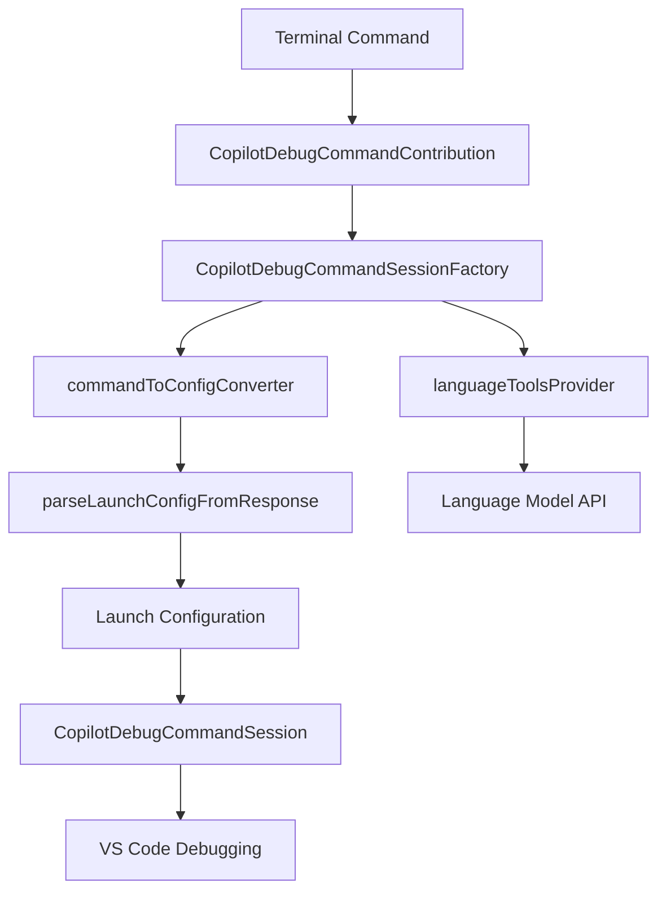
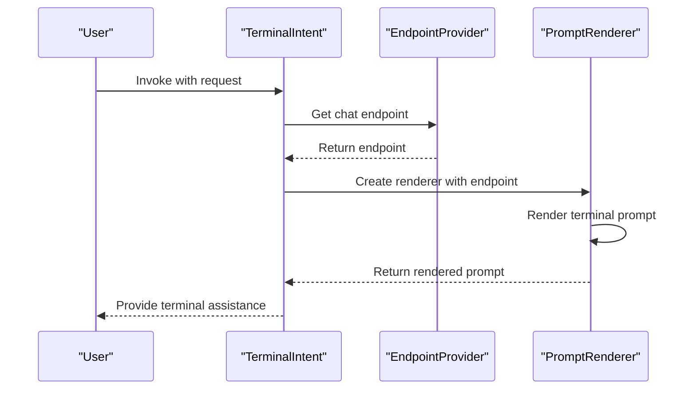
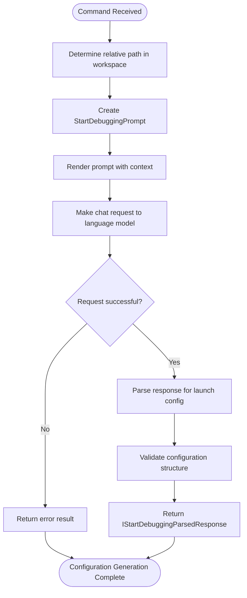
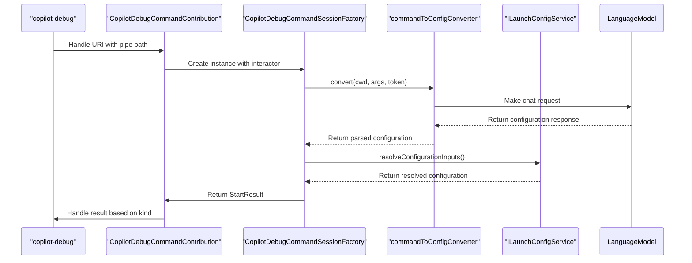
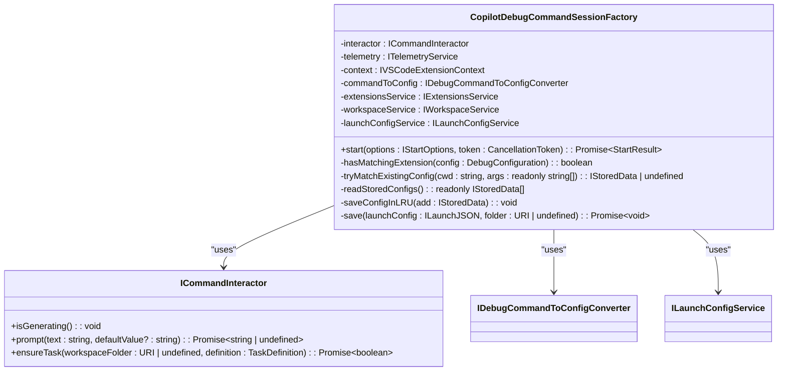
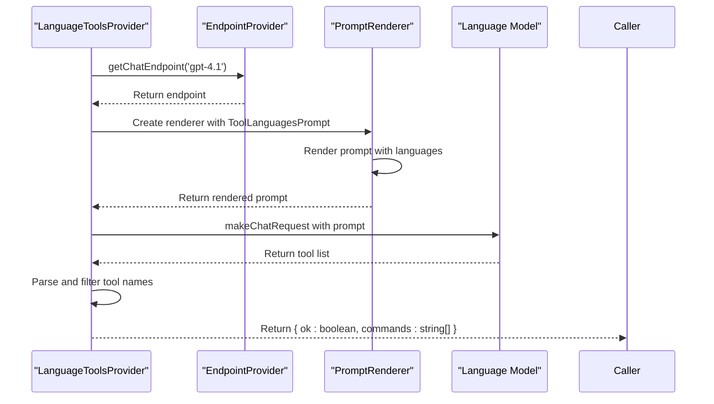
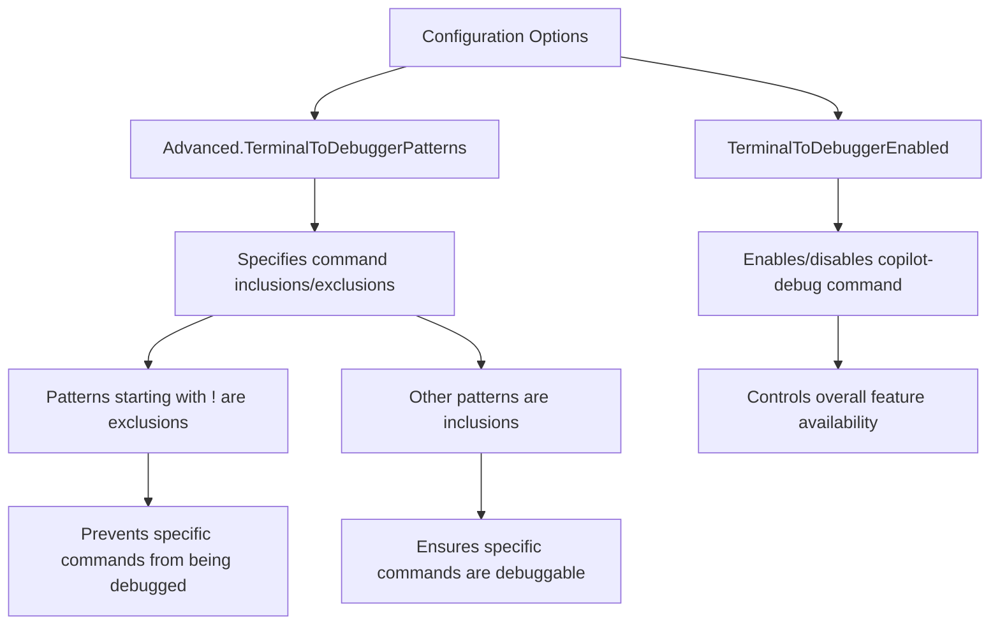

# Debugging Assistance

<cite>
**Referenced Files in This Document**   
- [terminalIntent.ts](file://src/extension/intents/node/terminalIntent.ts)
- [terminalExplainIntent.ts](file://src/extension/intents/node/terminalExplainIntent.ts)
- [copilotDebugCommandSessionFactory.tsx](file://src/extension/onboardDebug/node/copilotDebugCommandSessionFactory.tsx)
- [languageToolsProvider.tsx](file://src/extension/onboardDebug/node/languageToolsProvider.tsx)
- [launchConfigService.ts](file://src/extension/onboardDebug/common/launchConfigService.ts)
- [commandToConfigConverter.tsx](file://src/extension/onboardDebug/node/commandToConfigConverter.tsx)
- [parseLaunchConfigFromResponse.ts](file://src/extension/onboardDebug/node/parseLaunchConfigFromResponse.ts)
- [copilotDebugCommandContribution.ts](file://src/extension/onboardDebug/vscode-node/copilotDebugCommandContribution.ts)
- [copilotDebugCommandHandle.ts](file://src/extension/onboardDebug/vscode-node/copilotDebugCommandHandle.ts)
- [copilotDebugCommandSession.ts](file://src/extension/onboardDebug/vscode-node/copilotDebugCommandSession.ts)
- [startDebugging.tsx](file://src/extension/prompts/node/panel/startDebugging.tsx)
- [terminal.tsx](file://src/extension/prompts/node/panel/terminal.tsx)
- [terminalExplain.tsx](file://src/extension/prompts/node/panel/terminalExplain.tsx)
- [debuggableCommandIdentifier.ts](file://src/extension/onboardDebug/node/debuggableCommandIdentifier.ts)
</cite>

## Table of Contents
1. [Introduction](#introduction)
2. [Debug Onboarding Architecture](#debug-onboarding-architecture)
3. [Terminal Intent Processing](#terminal-intent-processing)
4. [Domain Model for Debugging Support](#domain-model-for-debugging-support)
5. [Launch Configuration Generation](#launch-configuration-generation)
6. [Debug Command Processing](#debug-command-processing)
7. [Error Explanation and Formulation](#error-explanation-and-formulation)
8. [Key Component Analysis](#key-component-analysis)
9. [Configuration Options](#configuration-options)
10. [Common Issues and Solutions](#common-issues-and-solutions)
11. [Conclusion](#conclusion)

## Introduction

The Debugging Assistance feature in the vscode-copilot-chat extension provides intelligent support for developers during debugging workflows. This comprehensive system integrates terminal commands with Visual Studio Code's debugging capabilities, enabling users to convert command-line operations into debug configurations, explain terminal command outcomes, and receive contextual debugging assistance. The feature leverages AI-powered analysis to interpret debugging commands, generate appropriate launch configurations, and provide actionable suggestions for resolving issues.

The system is designed to bridge the gap between terminal-based development workflows and integrated debugging environments. By analyzing command-line inputs, the extension can automatically generate appropriate debug configurations, saving developers time and reducing configuration errors. The debugging assistance framework consists of several interconnected components that work together to provide a seamless debugging experience, from command interpretation to configuration generation and execution.

**Section sources**
- [terminalIntent.ts](file://src/extension/intents/node/terminalIntent.ts#L22-L70)
- [terminalExplainIntent.ts](file://src/extension/intents/node/terminalExplainIntent.ts#L21-L72)

## Debug Onboarding Architecture

The debug onboarding architecture in vscode-copilot-chat follows a modular design pattern that separates concerns between command interpretation, configuration generation, and execution handling. The system is built around several key components that work together to provide a comprehensive debugging assistance experience.

At the core of the architecture is the `CopilotDebugCommandSessionFactory`, which serves as the central coordinator for debug command processing. This component receives command-line inputs and orchestrates the generation of appropriate debug configurations. It works in conjunction with the `languageToolsProvider` to identify debuggable commands based on programming languages and the `commandToConfigConverter` to transform command-line operations into structured launch configurations.

The architecture follows a client-server model where the extension acts as a server that communicates with a debug command worker process through a named pipe connection. This separation allows for robust error handling and prevents the main extension process from being blocked during debug operations. The `CopilotDebugCommandContribution` class handles URI routing and establishes connections between the extension and debug command workers, while the `CopilotDebugCommandHandle` provides a remote procedure call (RPC) interface for communication.



**Diagram sources **
- [copilotDebugCommandContribution.ts](file://src/extension/onboardDebug/vscode-node/copilotDebugCommandContribution.ts#L44-L309)
- [copilotDebugCommandSessionFactory.tsx](file://src/extension/onboardDebug/node/copilotDebugCommandSessionFactory.tsx#L51-L197)

**Section sources**
- [copilotDebugCommandContribution.ts](file://src/extension/onboardDebug/vscode-node/copilotDebugCommandContribution.ts#L44-L309)
- [copilotDebugCommandSessionFactory.tsx](file://src/extension/onboardDebug/node/copilotDebugCommandSessionFactory.tsx#L51-L197)

## Terminal Intent Processing

The terminal intent processing system in vscode-copilot-chat handles two primary types of debugging-related intents: `TerminalIntent` and `TerminalExplainIntent`. These intents are responsible for interpreting user commands related to terminal operations and providing appropriate debugging assistance.

The `TerminalIntent` class handles requests for how to perform specific actions in the terminal. When invoked, it creates a `TerminalIntentInvocation` that builds a prompt using the `TerminalPrompt` component. This prompt includes contextual information about the user's environment, including the operating system and terminal shell type, to provide relevant suggestions. The intent is available in both the chat panel and terminal locations, making it accessible wherever the user is working.



**Diagram sources **
- [terminalIntent.ts](file://src/extension/intents/node/terminalIntent.ts#L22-L70)
- [terminal.tsx](file://src/extension/prompts/node/panel/terminal.tsx#L1-L30)

The `TerminalExplainIntent` handles requests to explain what happened in the terminal, such as "What did the last command do?". Similar to `TerminalIntent`, it creates an invocation that builds a prompt using the `TerminalExplainPrompt` component. This prompt is specifically designed to analyze terminal command outputs and provide explanations of their effects. The intent includes a sample request to guide users on how to use this feature effectively.

Both intents follow the same processing pattern: they receive an invocation context, obtain a chat endpoint, and create an invocation instance that handles the specific logic for building prompts and processing responses. This consistent pattern makes the system extensible and maintainable, allowing for additional terminal-related intents to be added in the future.

**Section sources**
- [terminalIntent.ts](file://src/extension/intents/node/terminalIntent.ts#L22-L70)
- [terminalExplainIntent.ts](file://src/extension/intents/node/terminalExplainIntent.ts#L21-L72)

## Domain Model for Debugging Support

The domain model for debugging support in vscode-copilot-chat consists of several interconnected components that represent the core concepts of the debugging assistance system. At the foundation is the `ILaunchConfigService` interface, which defines the contract for managing launch configurations in VS Code. This service provides methods for adding configurations to launch.json, showing the launch configuration file, launching debug sessions, and resolving configuration inputs.

```mermaid
classDiagram
class ILaunchConfigService {
+add(workspaceFolder : URI, config : ILaunchJSON) : Promise~void~
+show(workspaceFolder : URI, showConfigName? : string) : Promise~void~
+launch(config : ILaunchJSON | DebugConfiguration) : Promise~void~
+resolveConfigurationInputs(launchJson : ILaunchJSON, defaults? : Map~string, string~, interactor? : ICommandInteractor) : Promise~{ config : DebugConfiguration; inputs : Map~string, string~ } | undefined~
}
class ILaunchJSON {
+configurations : DebugConfiguration[]
+inputs? : Input[]
}
class ICommandInteractor {
+isGenerating() : void
+prompt(text : string, defaultValue? : string) : Promise~string | undefined~
+ensureTask(workspaceFolder : URI | undefined, definition : TaskDefinition) : Promise~boolean~
}
ILaunchConfigService --> ILaunchJSON : "uses"
ILaunchConfigService --> ICommandInteractor : "depends on"
```

**Diagram sources **
- [launchConfigService.ts](file://src/extension/onboardDebug/common/launchConfigService.ts#L13-L59)
- [copilotDebugCommandSessionFactory.tsx](file://src/extension/onboardDebug/node/copilotDebugCommandSessionFactory.tsx#L51-L197)

The `IStartOptions` interface defines the parameters for starting a debug command, including the command arguments, current working directory, and various flags that control the behavior of the debug session. These options are passed between components through the RPC interface, allowing for flexible control over the debugging process.

The `StartResult` type represents the outcome of a debug command execution, with different kinds of results indicating success, cancellation, missing configurations, or the need for additional extensions. This type-safe approach to handling results ensures that the system can respond appropriately to different scenarios and provide meaningful feedback to users.

The domain model also includes the `IDebugCommandToConfigConverter` interface, which defines the contract for converting command-line operations into debug configurations. This abstraction allows for different implementation strategies while maintaining a consistent interface for the rest of the system.

**Section sources**
- [launchConfigService.ts](file://src/extension/onboardDebug/common/launchConfigService.ts#L13-L59)
- [copilotDebugCommandSessionFactory.tsx](file://src/extension/onboardDebug/node/copilotDebugCommandSessionFactory.tsx#L17-L18)
- [commandToConfigConverter.tsx](file://src/extension/onboardDebug/node/commandToConfigConverter.tsx#L28-L31)

## Launch Configuration Generation

The launch configuration generation process in vscode-copilot-chat is a sophisticated workflow that transforms command-line operations into structured VS Code debug configurations. This process begins when a user runs a command through the `copilot-debug` utility, which triggers the configuration generation pipeline.

The core of this process is the `commandToConfigConverter` component, which uses the `StartDebuggingPrompt` to generate appropriate configurations. This prompt is specifically designed to convert command-line operations into debug configurations by analyzing the command arguments, current working directory, and other contextual information. The converter first determines the relative path of the working directory within the workspace, then creates a prompt renderer with the appropriate context.



**Diagram sources **
- [commandToConfigConverter.tsx](file://src/extension/onboardDebug/node/commandToConfigConverter.tsx#L35-L121)
- [startDebugging.tsx](file://src/extension/prompts/node/panel/startDebugging.tsx#L140-L200)

The language model response is processed by the `parseLaunchConfigFromResponse` function, which extracts JSON data from code blocks or the response text. This function handles various response formats, including complete launch.json files, single configuration objects, and task definitions. It also validates the configuration against the schema provided by installed debug extensions, ensuring that only valid properties are included.

The system maintains a Least Recently Used (LRU) cache of previously generated configurations, stored in the workspace state with the key `copilot-chat.terminalToDebugging.configs`. This cache allows the system to quickly retrieve previously generated configurations when the same command is run again, improving performance and consistency. The cache size is limited to 30 entries to prevent excessive memory usage.

When generating configurations, the system also checks for required extensions by examining the `package.json` files of installed extensions for debug contributions. If a configuration requires a debug type that doesn't have a corresponding extension installed, the system will inform the user and suggest searching for the appropriate extension.

**Section sources**
- [commandToConfigConverter.tsx](file://src/extension/onboardDebug/node/commandToConfigConverter.tsx#L35-L121)
- [parseLaunchConfigFromResponse.ts](file://src/extension/onboardDebug/node/parseLaunchConfigFromResponse.ts#L1-L125)
- [copilotDebugCommandSessionFactory.tsx](file://src/extension/onboardDebug/node/copilotDebugCommandSessionFactory.tsx#L20-L29)

## Debug Command Processing

The debug command processing workflow in vscode-copilot-chat is orchestrated by the `CopilotDebugCommandSessionFactory` class, which handles the complete lifecycle of a debug command from invocation to execution. This component receives the command-line arguments and options, coordinates the generation of appropriate debug configurations, and manages the execution flow.

When a debug command is initiated, the factory first checks if a matching configuration already exists in the LRU cache by comparing the current working directory and command arguments. If a matching configuration is found and the `forceNew` flag is not set, the cached configuration is used. Otherwise, the system generates a new configuration using the `commandToConfigConverter`.



**Diagram sources **
- [copilotDebugCommandContribution.ts](file://src/extension/onboardDebug/vscode-node/copilotDebugCommandContribution.ts#L134-L222)
- [copilotDebugCommandSessionFactory.tsx](file://src/extension/onboardDebug/node/copilotDebugCommandSessionFactory.tsx#L62-L146)

The processing flow includes several key decision points. If the command includes special test status strings (like '73687c45-cancelled'), the system returns predefined test results for validation purposes. For normal commands, the system generates a configuration and checks if the required debug extension is installed. If not, it returns a `NeedExtension` result with the debug type, prompting the user to install the appropriate extension.

When tasks are included in the configuration, the system prompts the user to confirm whether they want to save and run the task before debugging. This is handled through the `ensureTask` method, which displays a confirmation dialog and manages task creation through the VS Code tasks service.

The factory also handles configuration persistence through the `save` method, which adds the generated configuration to the user's launch.json file and optionally shows the file in the editor. This allows users to review and modify the generated configuration if needed.

**Section sources**
- [copilotDebugCommandSessionFactory.tsx](file://src/extension/onboardDebug/node/copilotDebugCommandSessionFactory.tsx#L62-L146)
- [copilotDebugCommandContribution.ts](file://src/extension/onboardDebug/vscode-node/copilotDebugCommandContribution.ts#L102-L125)

## Error Explanation and Formulation

The error explanation and formulation system in vscode-copilot-chat provides contextual assistance for understanding and resolving debugging issues. This system leverages the terminal intent processing capabilities to analyze command outputs and provide meaningful explanations of what occurred.

When users ask questions like "What did the last command do?" through the `TerminalExplainIntent`, the system generates a specialized prompt that includes information about the operating system and terminal shell type. This contextual information allows the language model to provide more accurate and relevant explanations of command behavior.

The error formulation process begins with the `TerminalExplainPrompt` component, which structures the request to the language model with appropriate system messages and context. The prompt includes instructions for the model to explain terminal command outcomes in a clear and concise manner, focusing on the practical effects of the command rather than technical jargon.

For configuration generation errors, the system provides specific feedback through the `StartResult` types. When a configuration cannot be generated (`NoConfig`), the system returns a descriptive text explaining the reason, which is then displayed to the user with appropriate formatting. These error messages are designed to be actionable, guiding users toward solutions rather than simply indicating failure.

The system also handles authentication errors by checking for the presence of a Copilot token before attempting to generate configurations. If the token is missing, the system prompts the user to authenticate through the GitHub session service, ensuring that all necessary credentials are available before proceeding.

Error handling is integrated throughout the debug command processing pipeline, with appropriate telemetry events recorded for analysis and improvement. The system uses the `sendMSFTTelemetryEvent` method to report key events such as command execution and configuration generation, which helps identify common failure patterns and areas for improvement.

**Section sources**
- [terminalExplainIntent.ts](file://src/extension/intents/node/terminalExplainIntent.ts#L21-L72)
- [terminalExplain.tsx](file://src/extension/prompts/node/panel/terminalExplain.tsx#L1-L30)
- [copilotDebugCommandSessionFactory.tsx](file://src/extension/onboardDebug/node/copilotDebugCommandSessionFactory.tsx#L74-L77)

## Key Component Analysis

### CopilotDebugCommandSessionFactory Analysis

The `CopilotDebugCommandSessionFactory` is the central component responsible for coordinating debug command processing. It implements a factory pattern that creates and manages the lifecycle of debug sessions based on command-line inputs.



**Diagram sources **
- [copilotDebugCommandSessionFactory.tsx](file://src/extension/onboardDebug/node/copilotDebugCommandSessionFactory.tsx#L51-L197)
- [launchConfigService.ts](file://src/extension/onboardDebug/common/launchConfigService.ts#L54-L58)

The factory's primary method, `start`, orchestrates the entire debug command processing workflow. It begins by recording telemetry about the executed command, then checks for special test status strings that allow for predefined test results. The method then attempts to find a matching configuration in the LRU cache before generating a new one if necessary.

A key feature of the factory is its ability to validate that the required debug extension is installed for the generated configuration. The `hasMatchingExtension` method iterates through all installed extensions to check if any contribute a debugger with the required type, preventing users from attempting to debug with unsupported configurations.

### LanguageToolsProvider Analysis

The `LanguageToolsProvider` component is responsible for identifying command-line tools associated with specific programming languages. This information is used to determine which commands are likely to be debuggable and should be eligible for configuration generation.



**Diagram sources **
- [languageToolsProvider.tsx](file://src/extension/onboardDebug/node/languageToolsProvider.tsx#L25-L62)
- [languageToolsProvider.tsx](file://src/extension/onboardDebug/node/languageToolsProvider.tsx#L65-L98)

The provider uses a specialized prompt, `ToolLanguagesPrompt`, to query the language model about common command-line tools for specified programming languages. The prompt instructs the model to list tools that actually run code (like node, python, cargo) while excluding linting tools (like eslint, pylint). The response is parsed to extract tool names, which are then used to identify debuggable commands.

The provider maintains a cache of known debuggable commands in the global state with the key `chat.debuggableCommands`, reducing the need for repeated language model queries for the same languages. This caching mechanism improves performance and reduces API costs while maintaining accuracy.

**Section sources**
- [copilotDebugCommandSessionFactory.tsx](file://src/extension/onboardDebug/node/copilotDebugCommandSessionFactory.tsx#L51-L197)
- [languageToolsProvider.tsx](file://src/extension/onboardDebug/node/languageToolsProvider.tsx#L25-L98)

## Configuration Options

The debugging assistance feature in vscode-copilot-chat provides several configuration options that allow users to customize the behavior of the system. These options are managed through the extension's configuration service and can be modified by users to suit their specific workflows.

The primary configuration option is `TerminalToDebuggerEnabled`, which controls whether the debug onboarding feature is active. When enabled, the system contributes the `copilot-debug` command to the terminal PATH, allowing users to invoke debug assistance from any terminal session. This setting can be toggled globally to enable or disable the entire debugging assistance system.



**Diagram sources **
- [copilotDebugCommandContribution.ts](file://src/extension/onboardDebug/vscode-node/copilotDebugCommandContribution.ts#L66-L70)
- [debuggableCommandIdentifier.ts](file://src/extension/onboardDebug/node/debuggableCommandIdentifier.ts#L80-L82)

The advanced configuration option `Advanced.TerminalToDebuggerPatterns` allows users to specify custom patterns for command inclusions and exclusions. Patterns that start with an exclamation mark (!) are treated as exclusions, while other patterns are treated as inclusions. This allows users to fine-tune which commands are eligible for debug configuration generation, preventing unwanted commands from being processed while ensuring that specific commands are always handled.

The system also supports command-line flags that modify the behavior of the `copilot-debug` command:
- `--print`: Prints the generated configuration without running it
- `--no-cache`: Generates a new configuration without checking the cache
- `--save`: Saves the configuration to launch.json
- `--once`: Exits after the debug session ends
- `--help`: Displays usage information

These flags provide users with granular control over the debug command execution, allowing them to preview configurations, force regeneration, persist configurations, or control session lifecycle.

**Section sources**
- [copilotDebugCommandContribution.ts](file://src/extension/onboardDebug/vscode-node/copilotDebugCommandContribution.ts#L66-L70)
- [debuggableCommandIdentifier.ts](file://src/extension/onboardDebug/node/debuggableCommandIdentifier.ts#L132-L141)
- [copilotDebugWorker/index.ts](file://src/extension/onboardDebug/node/copilotDebugWorker/index.ts#L46-L55)

## Common Issues and Solutions

### Interpreting Complex Error Messages

One common challenge in debugging assistance is interpreting complex error messages from various programming languages and tools. The system addresses this through the `TerminalExplainIntent`, which leverages the language model's understanding of different error formats to provide clear explanations.

When users encounter cryptic error messages, they can use the explain functionality to get a plain-language interpretation of what went wrong and potential solutions. The system analyzes the error context, including the command that was run and the surrounding code, to provide targeted suggestions for resolution.

### Handling Different Debugging Environments

The debugging assistance system must work across different operating systems (Windows, macOS, Linux) and terminal environments (bash, zsh, PowerShell, Command Prompt). The system handles these variations by including environment-specific information in prompts and generating appropriate configuration syntax.

For example, path separators are automatically converted to the appropriate format for the target environment, and shell-specific syntax is used when necessary. The system also detects the terminal shell type and adjusts its behavior accordingly, ensuring compatibility across different development environments.

### Providing Actionable Debugging Suggestions

A key challenge is ensuring that debugging suggestions are actionable and relevant to the user's specific context. The system addresses this by incorporating workspace context into its analysis, including project structure, file contents, and existing configurations.

When generating launch configurations, the system examines the current working directory relative to workspace folders and uses appropriate path variables like `${workspaceFolder}`. It also considers existing tasks and build configurations when suggesting debug setups, ensuring that the generated configurations integrate well with the user's existing workflow.

The system also provides interactive follow-up options after a debug session, allowing users to:
- Restart the session with the same configuration (Enter)
- Regenerate the configuration with new parameters (R)
- Save the configuration to launch.json (S)
- View the raw configuration JSON (V)
- Quit the debug session (Q)

These options give users control over the debugging process and allow them to refine their approach based on the results of previous attempts.

**Section sources**
- [terminalExplainIntent.ts](file://src/extension/intents/node/terminalExplainIntent.ts#L21-L72)
- [copilotDebugCommandSession.ts](file://src/extension/onboardDebug/vscode-node/copilotDebugCommandSession.ts#L50-L73)
- [startDebugging.tsx](file://src/extension/prompts/node/panel/startDebugging.tsx#L140-L200)

## Conclusion

The Debugging Assistance feature in vscode-copilot-chat provides a comprehensive solution for bridging the gap between terminal-based development workflows and integrated debugging environments. By intelligently interpreting command-line operations and converting them into appropriate VS Code debug configurations, the system significantly reduces the friction associated with setting up debugging sessions.

The architecture is designed with modularity and extensibility in mind, separating concerns between command interpretation, configuration generation, and execution handling. This design allows for easy maintenance and future enhancements while providing a robust foundation for debugging assistance.

Key strengths of the system include its ability to handle various programming languages and environments, its intelligent caching mechanism for improved performance, and its comprehensive error handling and user feedback. The integration with VS Code's existing debugging infrastructure ensures that generated configurations work seamlessly with the editor's powerful debugging capabilities.

For developers, this feature represents a significant productivity boost, eliminating the need to manually create and maintain debug configurations for common tasks. The system's ability to explain terminal command outcomes and provide actionable suggestions further enhances the development experience, making debugging more accessible and efficient.

As the system continues to evolve, potential enhancements could include support for more complex debugging scenarios, integration with additional development tools, and improved natural language understanding for more intuitive command interpretation.

[No sources needed since this section summarizes without analyzing specific files]