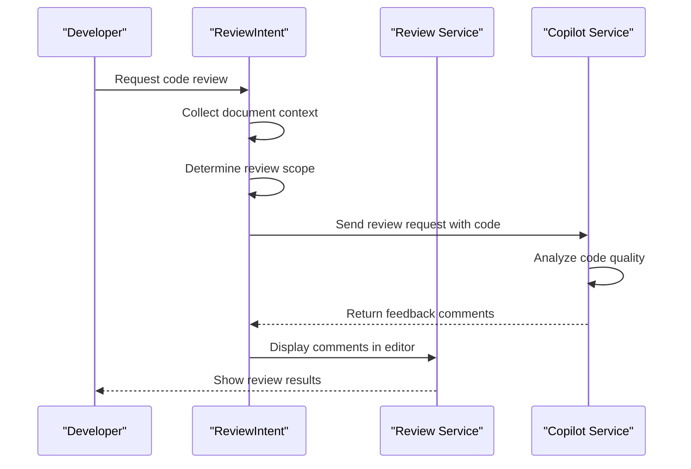
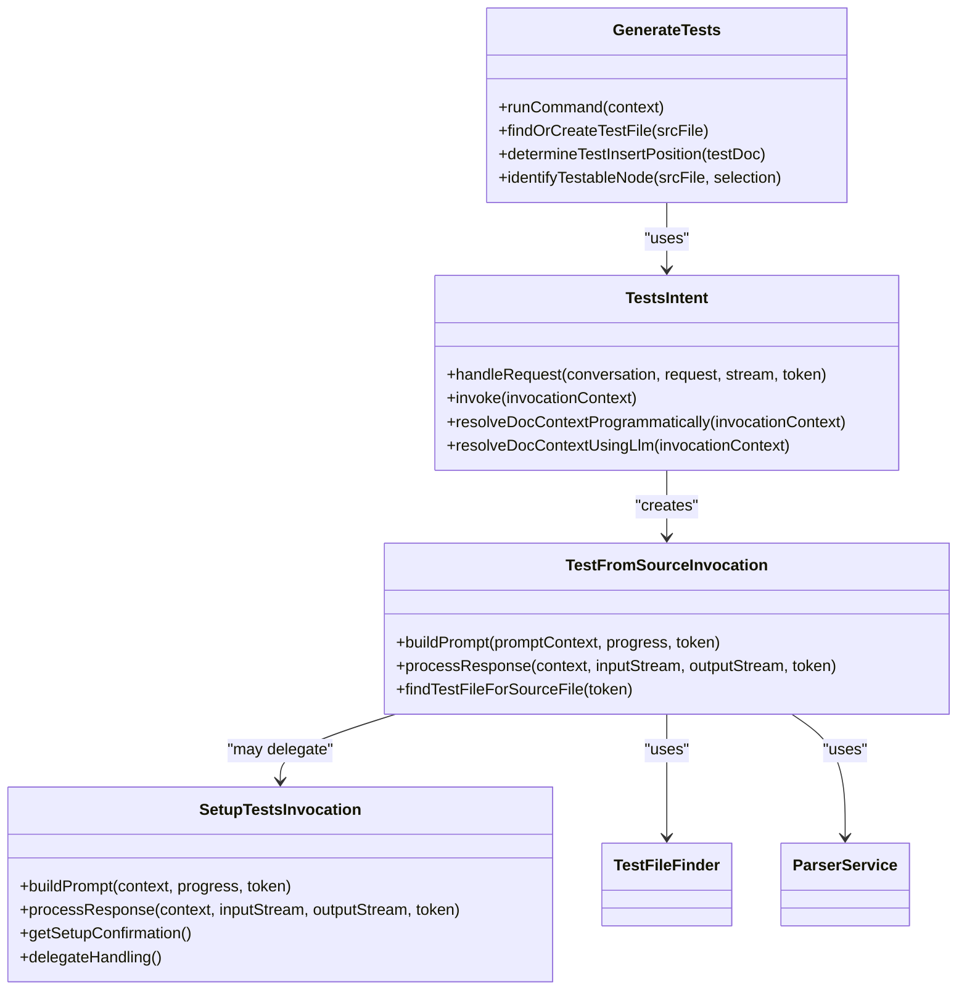
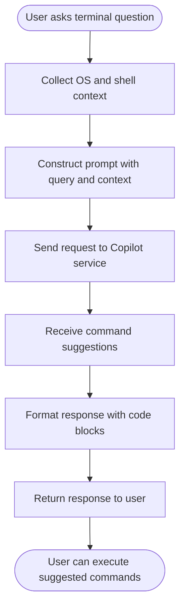
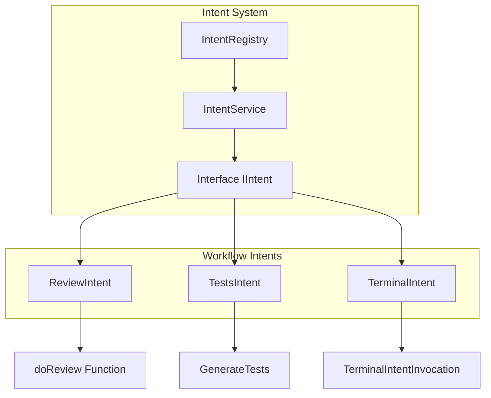

# Development Workflow Support

<cite>
**Referenced Files in This Document**   
- [reviewIntent.ts](file://src/extension/intents/node/reviewIntent.ts)
- [doReview.ts](file://src/extension/review/node/doReview.ts)
- [testGenAction.ts](file://src/extension/intents/vscode-node/testGenAction.ts)
- [testIntent.tsx](file://src/extension/intents/node/testIntent/testIntent.tsx)
- [testFromSrcInvocation.tsx](file://src/extension/intents/node/testIntent/testFromSrcInvocation.tsx)
- [terminalIntent.ts](file://src/extension/intents/node/terminalIntent.ts)
- [setupTestsInvocation.tsx](file://src/extension/intents/node/testIntent/setupTestsInvocation.tsx)
- [allIntents.ts](file://src/extension/intents/node/allIntents.ts)
- [intentService.ts](file://src/extension/intents/node/intentService.ts)
</cite>

## Table of Contents
1. [Introduction](#introduction)
2. [Core Components](#core-components)
3. [Code Review Implementation](#code-review-implementation)
4. [Test Generation System](#test-generation-system)
5. [Debugging Assistance](#debugging-assistance)
6. [Intent Handling Architecture](#intent-handling-architecture)
7. [Configuration Options](#configuration-options)
8. [Common Issues and Solutions](#common-issues-and-solutions)
9. [Conclusion](#conclusion)

## Introduction
The Development Workflow Support feature in the vscode-copilot-chat extension provides comprehensive assistance for software development tasks through three primary capabilities: code review, test generation, and debugging support. This documentation details the implementation of these features, focusing on the reviewIntent, testGenAction, and terminalIntent handlers that enable developers to improve code quality, create test cases, and resolve issues efficiently. The system integrates with Visual Studio Code's editor and chat interface to provide context-aware suggestions and automated assistance throughout the development lifecycle.

## Core Components
The Development Workflow Support feature consists of three main components that work together to enhance the development experience: code review, test generation, and debugging assistance. These components are implemented as intent handlers that respond to specific user requests within the VS Code environment. The architecture follows a modular design where each component has dedicated services for analysis, generation, and user interaction. The components share common infrastructure for context management, authentication, and communication with the Copilot service, ensuring consistent behavior across different workflow scenarios.

**Section sources**
- [allIntents.ts](file://src/extension/intents/node/allIntents.ts#L33-L57)
- [intentService.ts](file://src/extension/intents/node/intentService.ts#L14-L57)

## Code Review Implementation
The code review functionality is implemented through the reviewIntent handler, which analyzes selected code or changes and provides feedback on quality, potential issues, and improvement suggestions. The implementation consists of two main components: the ReviewIntent class that handles user interaction and the doReview function that performs the actual analysis.

The review process begins when a user invokes the review command, either through the editor context menu or chat interface. The ReviewIntent class creates a ReviewIntentInvocation that manages the interaction flow. It collects the current document context, including the selected code range and surrounding context, then constructs a prompt for the Copilot service. The prompt includes the code to review, relevant file information, and instructions for generating feedback.

The actual review analysis is performed by the doReview function, which coordinates with various platform services to gather necessary information. It first checks authentication status and user permissions, then determines the scope of the review (selection, staged changes, or working tree changes). For code selections, it uses the scopeSelector service to identify appropriate code boundaries when no selection is made. The function then creates a feedback generation request and processes the response, displaying comments directly in the editor through the reviewService.

**Diagram sources**
- [reviewIntent.ts](file://src/extension/intents/node/reviewIntent.ts#L40-L224)
- [doReview.ts](file://src/extension/review/node/doReview.ts#L106-L276)

**Section sources**
- [reviewIntent.ts](file://src/extension/intents/node/reviewIntent.ts#L40-L224)
- [doReview.ts](file://src/extension/review/node/doReview.ts#L106-L276)

## Test Generation System
The test generation system enables developers to automatically create unit tests for their code through the testGenAction and associated components. This functionality is implemented as an intent-based system that analyzes the source code, determines appropriate test frameworks, and generates test cases in the correct location.

The test generation process begins with the GenerateTests class, which serves as the entry point for the feature. When invoked, it first determines whether the current file is a test file or source file. If in a source file, it identifies the testable code elements using the parserService to analyze the abstract syntax tree. The system then determines where to place the generated tests by either finding an existing test file or creating a new one using the TestFileFinder service.

The TestsIntent class handles the chat-based interaction for test generation. It supports both panel and editor locations, adapting its behavior accordingly. When invoked, it resolves the document context either programmatically or through LLM analysis of the user query. The intent then creates the appropriate invocation handler: TestFromSourceInvocation for source files or TestFromTestInvocation for test files.

For source files, the TestFromSourceInvocation performs several key steps:
1. Identifies the testable node in the code using tree-sitter parsing
2. Determines the target test file location
3. Constructs a detailed prompt with code context and test requirements
4. Processes the response to insert generated tests at the appropriate location

The system also includes setupTests functionality that helps configure testing frameworks when needed. The SetupTestsInvocation analyzes the user's request and workspace structure, then recommends appropriate testing frameworks and generates configuration files.

**Diagram sources**
- [testGenAction.ts](file://src/extension/intents/vscode-node/testGenAction.ts#L18-L179)
- [testIntent.tsx](file://src/extension/intents/node/testIntent/testIntent.tsx#L40-L279)
- [testFromSrcInvocation.tsx](file://src/extension/intents/node/testIntent/testFromSrcInvocation.tsx#L55-L442)
- [setupTestsInvocation.tsx](file://src/extension/intents/node/testIntent/setupTestsInvocation.tsx#L41-L374)

**Section sources**
- [testGenAction.ts](file://src/extension/intents/vscode-node/testGenAction.ts#L18-L179)
- [testIntent.tsx](file://src/extension/intents/node/testIntent/testIntent.tsx#L40-L279)
- [testFromSrcInvocation.tsx](file://src/extension/intents/node/testIntent/testFromSrcInvocation.tsx#L55-L442)

## Debugging Assistance
The debugging assistance feature is implemented through the terminalIntent handler, which helps developers troubleshoot issues by providing guidance on terminal commands and debugging techniques. This component enables users to ask questions about command-line operations and receive context-aware suggestions.

The TerminalIntent class handles requests related to terminal operations, supporting both panel and terminal locations. When invoked, it creates a TerminalIntentInvocation that gathers relevant context about the user's environment, including the operating system and shell type. This information is incorporated into the prompt to ensure that generated suggestions are appropriate for the user's specific setup.

The implementation follows a straightforward pattern:
1. Collect environment context (OS, shell type)
2. Construct a prompt with the user's query and context
3. Send the request to the Copilot service
4. Return the response with command suggestions

The system is designed to provide practical, executable commands that users can directly apply in their terminal. It focuses on common debugging scenarios such as process management, file operations, and system diagnostics, making it easier for developers to resolve issues without leaving their development environment.

**Diagram sources**
- [terminalIntent.ts](file://src/extension/intents/node/terminalIntent.ts#L22-L70)

**Section sources**
- [terminalIntent.ts](file://src/extension/intents/node/terminalIntent.ts#L22-L70)

## Intent Handling Architecture
The Development Workflow Support features are integrated into VS Code through a unified intent handling architecture. This system allows different capabilities to coexist and be invoked consistently through both UI interactions and chat commands.

The IntentRegistry serves as the central component, registering all available intents including review, test generation, and terminal assistance. The IntentService provides a unified interface for discovering and accessing intents based on location (panel, editor, terminal). This design enables the extension to dynamically adapt its behavior to the current context.

Each intent follows a consistent pattern:
- Implements the IIntent interface with standardized properties
- Provides a description and location information
- Handles invocation through the invoke method
- Creates an IIntentInvocation to manage the interaction

The allIntents.ts file shows the complete registration of all intents, demonstrating how the review, test, and terminal capabilities are integrated alongside other features. This architecture ensures that new workflow support features can be added consistently while maintaining a cohesive user experience.

**Diagram sources**
- [allIntents.ts](file://src/extension/intents/node/allIntents.ts#L33-L57)
- [intentService.ts](file://src/extension/intents/node/intentService.ts#L14-L57)

**Section sources**
- [allIntents.ts](file://src/extension/intents/node/allIntents.ts#L33-L57)
- [intentService.ts](file://src/extension/intents/node/intentService.ts#L14-L57)

## Configuration Options
The Development Workflow Support features include several configuration options that control their behavior:

- **Review settings**: Control the scope of code reviews (selection, staged changes, working tree)
- **Test generation preferences**: Determine how test files are located and created
- **Terminal context**: Automatically detect OS and shell type for command suggestions
- **Authentication requirements**: Ensure users are logged in for code review functionality
- **Ignore rules**: Respect copilot-ignored files and directories

These options are managed through the extension's configuration system and platform services, allowing users to customize the behavior to match their development workflow. The system also respects VS Code's standard settings for indentation, language preferences, and workspace configuration.

## Common Issues and Solutions
The Development Workflow Support features may encounter several common issues:

**False positives in code review**: The system may occasionally flag valid code patterns as issues. This is mitigated by using confidence thresholds and allowing users to view skipped comments with lower confidence scores.

**Test coverage adequacy**: Generated tests may not cover all edge cases. The system addresses this by analyzing the code structure to identify testable elements and suggesting comprehensive test scenarios.

**Debugging context limitations**: Terminal suggestions may not account for all environment variables or system configurations. The implementation includes OS and shell detection to improve relevance, but users may need to adapt suggestions to their specific environment.

**File location challenges**: Determining the correct location for test files can be complex in large projects. The system uses intelligent heuristics based on common project structures and naming conventions to locate or create appropriate test files.

**Authentication requirements**: Code review functionality requires user authentication. The system gracefully handles unauthenticated states by prompting users to sign in rather than failing silently.

## Conclusion
The Development Workflow Support feature in vscode-copilot-chat provides comprehensive assistance for code review, test generation, and debugging through a well-structured intent-based architecture. By integrating with VS Code's editor and chat interface, these capabilities help developers improve code quality, create effective tests, and resolve issues more efficiently. The modular design allows for consistent behavior across different workflow scenarios while providing the flexibility to adapt to various development environments and preferences.