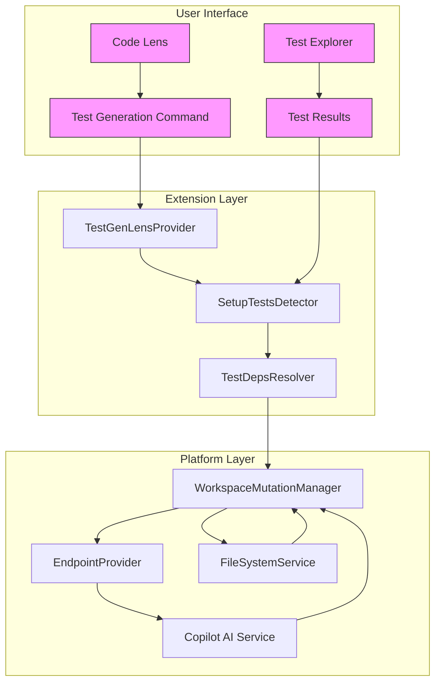
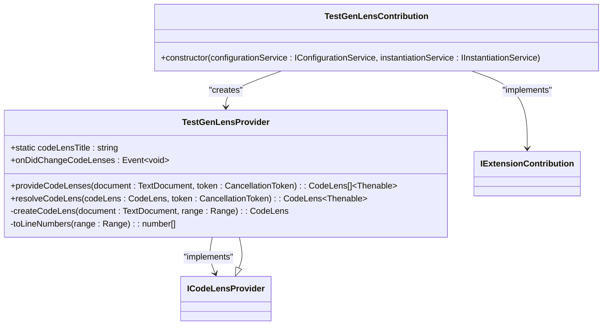
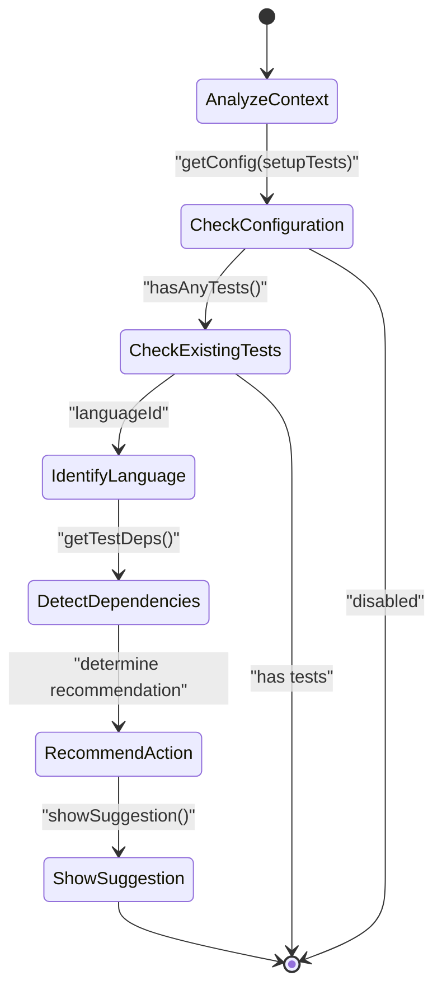
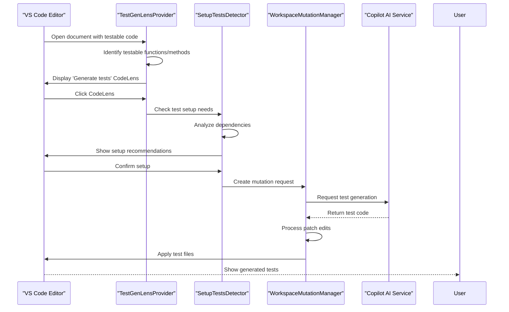
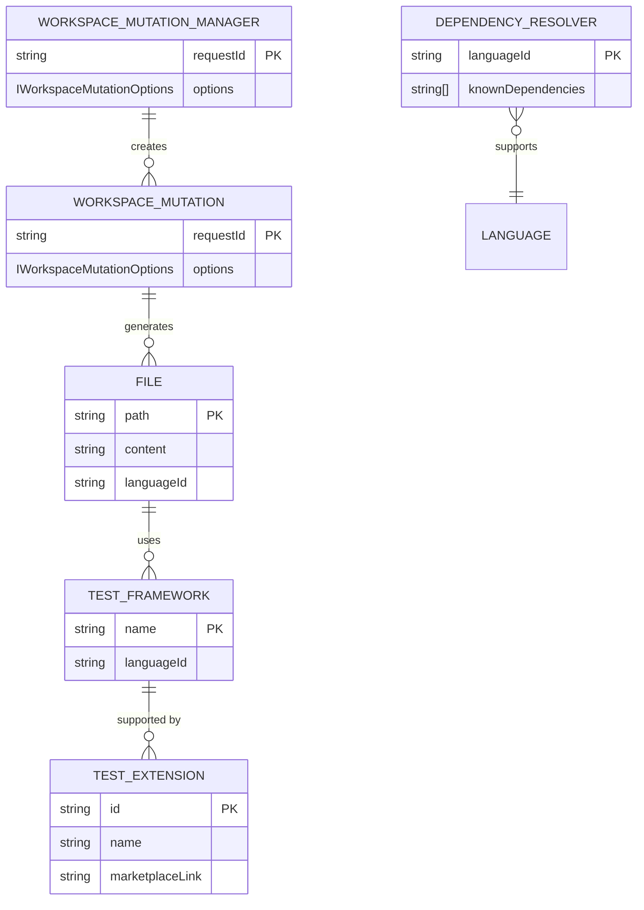

# Test Generation

<cite>
**Referenced Files in This Document**   
- [setupTestsFileManager.tsx](file://src/extension/testing/node/setupTestsFileManager.tsx)
- [setupTestContributions.ts](file://src/extension/testing/vscode/setupTestContributions.ts)
- [files.ts](file://src/extension/testing/common/files.ts)
- [setupTestDetector.tsx](file://src/platform/testing/node/setupTestDetector.tsx)
- [testDepsResolver.ts](file://src/platform/testing/node/testDepsResolver.ts)
- [setupTestExtensions.ts](file://src/platform/testing/common/setupTestExtensions.ts)
- [testProviderImpl.ts](file://src/platform/testing/vscode/testProviderImpl.ts)
- [testProvider.ts](file://src/platform/testing/common/testProvider.ts)
- [workspaceMutationManager.ts](file://src/platform/testing/common/workspaceMutationManager.ts)
- [testGenLens.ts](file://src/extension/intents/vscode-node/testGenLens.ts)
</cite>

## Table of Contents
1. [Introduction](#introduction)
2. [Architecture Overview](#architecture-overview)
3. [Core Components](#core-components)
4. [Test Generation Workflow](#test-generation-workflow)
5. [Domain Model](#domain-model)
6. [Configuration and Parameters](#configuration-and-parameters)
7. [Error Handling and Troubleshooting](#error-handling-and-troubleshooting)
8. [Performance Considerations](#performance-considerations)
9. [Conclusion](#conclusion)

## Introduction

The Test Generation feature in the vscode-copilot-chat extension provides automated test creation capabilities that help developers write comprehensive test cases for their code. This feature analyzes code to identify testable components and generates appropriate test cases using AI-powered suggestions. The system is designed to work seamlessly with various testing frameworks and programming languages, providing intelligent recommendations based on project context and dependencies.

The implementation consists of several interconnected components that handle test identification, generation, and integration with the development workflow. The system uses a combination of static code analysis, dependency detection, and AI-driven content generation to create meaningful test cases that cover the functionality of the target code.

**Section sources**
- [setupTestDetector.tsx](file://src/platform/testing/node/setupTestDetector.tsx#L1-L324)
- [testGenLens.ts](file://src/extension/intents/vscode-node/testGenLens.ts#L1-L161)

## Architecture Overview

The Test Generation feature follows a layered architecture that separates concerns between code analysis, test generation, and user interface components. The system integrates with VS Code's testing infrastructure while providing additional AI-powered capabilities for test creation and setup.

**Diagram sources**
- [testGenLens.ts](file://src/extension/intents/vscode-node/testGenLens.ts#L15-L161)
- [setupTestDetector.tsx](file://src/platform/testing/node/setupTestDetector.tsx#L29-L324)
- [setupTestsFileManager.tsx](file://src/extension/testing/node/setupTestsFileManager.tsx#L33-L175)

## Core Components

The Test Generation feature consists of several key components that work together to provide automated test creation capabilities. These components handle different aspects of the test generation process, from identifying testable code to generating and applying test implementations.

### Test Generation Lens

The TestGenLensProvider component implements VS Code's CodeLensProvider interface to display "Generate tests using Copilot" suggestions in the editor. This component analyzes the current document to identify testable code sections and provides inline suggestions for generating tests.

**Diagram sources**
- [testGenLens.ts](file://src/extension/intents/vscode-node/testGenLens.ts#L15-L161)

**Section sources**
- [testGenLens.ts](file://src/extension/intents/vscode-node/testGenLens.ts#L1-L161)

### Test Setup Detector

The SetupTestsDetector component analyzes the current workspace to determine whether test frameworks are properly configured and suggests appropriate setup actions when needed. This component evaluates the project's dependencies and language context to recommend suitable testing extensions and configurations.

**Diagram sources**
- [setupTestDetector.tsx](file://src/platform/testing/node/setupTestDetector.tsx#L29-L324)

**Section sources**
- [setupTestDetector.tsx](file://src/platform/testing/node/setupTestDetector.tsx#L1-L324)

## Test Generation Workflow

The test generation process follows a structured workflow that begins with identifying testable code and ends with applying generated test implementations to the workspace. This workflow ensures that test generation is context-aware and produces relevant, functional test cases.

**Diagram sources**
- [testGenLens.ts](file://src/extension/intents/vscode-node/testGenLens.ts#L1-L161)
- [setupTestDetector.tsx](file://src/platform/testing/node/setupTestDetector.tsx#L1-L324)
- [setupTestsFileManager.tsx](file://src/extension/testing/node/setupTestsFileManager.tsx#L33-L175)

**Section sources**
- [testGenLens.ts](file://src/extension/intents/vscode-node/testGenLens.ts#L1-L161)
- [setupTestDetector.tsx](file://src/platform/testing/node/setupTestDetector.tsx#L1-L324)
- [setupTestsFileManager.tsx](file://src/extension/testing/node/setupTestsFileManager.tsx#L1-L346)

## Domain Model

The Test Generation feature uses a well-defined domain model that represents the key entities and relationships involved in automated test creation. This model includes concepts such as test mutations, workspace operations, and framework-specific configurations.

### Test Generation Domain Model

**Diagram sources**
- [workspaceMutationManager.ts](file://src/platform/testing/common/workspaceMutationManager.ts#L1-L56)
- [testDepsResolver.ts](file://src/platform/testing/node/testDepsResolver.ts#L1-L210)
- [setupTestExtensions.ts](file://src/platform/testing/common/setupTestExtensions.ts#L1-L73)

**Section sources**
- [workspaceMutationManager.ts](file://src/platform/testing/common/workspaceMutationManager.ts#L1-L56)
- [testDepsResolver.ts](file://src/platform/testing/node/testDepsResolver.ts#L1-L210)
- [setupTestExtensions.ts](file://src/platform/testing/common/setupTestExtensions.ts#L1-L73)

### Test Generation Configuration

The system uses several configuration options to control test generation behavior. These options allow users to customize how tests are generated and when suggestions are displayed.

| Configuration Key | Type | Default | Description |
|-------------------|------|---------|-------------|
| `generateTestsCodeLens` | boolean | true | Enables/disables the test generation CodeLens in the editor |
| `setupTests` | boolean | true | Enables/disables automatic test setup suggestions |
| `testFrameworkDetection` | boolean | true | Controls whether the system detects test frameworks from dependencies |
| `testGenerationTimeout` | number | 30000 | Maximum time (ms) to wait for test generation response |
| `maxTestFileSize` | number | 10000 | Maximum size (characters) for generated test files |

**Section sources**
- [configurationService.ts](file://src/platform/configuration/common/configurationService.ts)
- [setupTestDetector.tsx](file://src/platform/testing/node/setupTestDetector.tsx#L70-L80)

## Configuration and Parameters

The Test Generation feature provides several configuration options and parameters that control its behavior and integration with the development workflow. These settings allow users to customize the test generation experience according to their preferences and project requirements.

### Configuration Options

The extension exposes configuration options through VS Code's settings system, allowing users to control various aspects of test generation:

- **Test Generation CodeLens**: Enables or disables the inline "Generate tests" suggestions in the editor
- **Automatic Setup Suggestions**: Controls whether the system suggests test framework setup when none is detected
- **Framework Detection**: Determines whether the system should analyze project dependencies to identify testing frameworks
- **Confirmation Requirements**: Specifies when user confirmation is required before applying generated tests

### Function Parameters

Key functions in the test generation system accept various parameters that influence their behavior:

- **WorkspaceMutationOptions**: Contains the user query, file tree structure, base URI, and list of files to be modified
- **SetupTestAction**: Represents different types of setup actions (install extension, search for framework, etc.)
- **IDocumentContext**: Provides context about the current document, including selection and range information
- **IWorkspaceMutationOptions**: Specifies options for workspace mutations, including the query and file tree

These parameters enable the system to generate context-aware test suggestions that are relevant to the current code and project structure.

**Section sources**
- [setupTestDetector.tsx](file://src/platform/testing/node/setupTestDetector.tsx#L48-L59)
- [workspaceMutationManager.ts](file://src/platform/testing/common/workspaceMutationManager.ts#L11-L20)
- [testGenLens.ts](file://src/extension/intents/vscode-node/testGenLens.ts#L19-L21)

## Error Handling and Troubleshooting

The Test Generation feature includes comprehensive error handling mechanisms to address common issues that may arise during test creation and application. These mechanisms ensure that the system can gracefully handle failures and provide meaningful feedback to users.

### Common Issues and Solutions

| Issue | Cause | Solution |
|------|------|---------|
| Test generation timeout | Network issues or slow AI response | Check internet connection, retry request |
| Missing test framework | No testing framework detected in dependencies | Install recommended framework or configure manually |
| CodeLens not appearing | Feature disabled or unsupported language | Enable `generateTestsCodeLens` setting or check language support |
| Failed to apply edits | File system permissions or conflicts | Check file permissions, resolve conflicts manually |
| Incorrect test assertions | AI misinterpretation of code | Review and modify generated tests as needed |

The system also provides diagnostic information through the VS Code output panel, helping users identify and resolve issues with test generation. When errors occur during test application, the system rolls back changes and provides detailed error messages to guide troubleshooting.

**Section sources**
- [setupTestsFileManager.tsx](file://src/extension/testing/node/setupTestsFileManager.tsx#L96-L117)
- [setupTestDetector.tsx](file://src/platform/testing/node/setupTestDetector.tsx#L211-L228)
- [testProviderImpl.ts](file://src/platform/testing/vscode/testProviderImpl.ts#L26-L32)

## Performance Considerations

The Test Generation feature is designed with performance in mind, minimizing impact on the editor while providing responsive test generation capabilities. The system employs several optimization strategies to ensure efficient operation.

### Performance Optimizations

- **Caching**: The system caches dependency resolution results to avoid redundant analysis of project files
- **Batch Processing**: Multiple file operations are batched to reduce the number of AI service calls
- **Lazy Loading**: Test generation resources are loaded only when needed, reducing startup time
- **Progress Indicators**: Clear progress feedback is provided during test generation to maintain perceived performance
- **Cancellation Support**: Long-running operations support cancellation to maintain editor responsiveness

The system also monitors performance metrics and adjusts its behavior based on system resources and user interaction patterns. For example, it may reduce the frequency of automatic suggestions when the system is under heavy load.

**Section sources**
- [testDepsResolver.ts](file://src/platform/testing/node/testDepsResolver.ts#L31-L35)
- [setupTestsFileManager.tsx](file://src/extension/testing/node/setupTestsFileManager.tsx#L31-L32)
- [testProviderImpl.ts](file://src/platform/testing/vscode/testProviderImpl.ts#L138-L161)

## Conclusion

The Test Generation feature in the vscode-copilot-chat extension provides a powerful, AI-driven solution for automated test creation. By combining static code analysis with intelligent content generation, the system helps developers write comprehensive tests more efficiently. The architecture is modular and extensible, allowing for integration with various testing frameworks and programming languages.

Key strengths of the implementation include its context-aware suggestions, seamless integration with VS Code's editor features, and robust error handling. The system effectively balances automation with user control, providing intelligent recommendations while allowing developers to review and modify generated tests.

For developers looking to extend or customize the test generation capabilities, the well-defined interfaces and service-oriented architecture make it relatively straightforward to add support for new languages, frameworks, or generation strategies. The separation of concerns between the extension layer and platform layer ensures that customizations can be made with minimal impact on the core functionality.