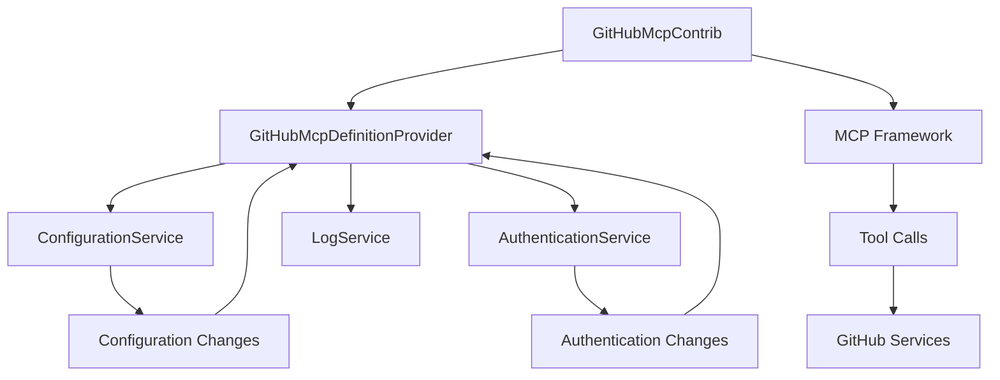
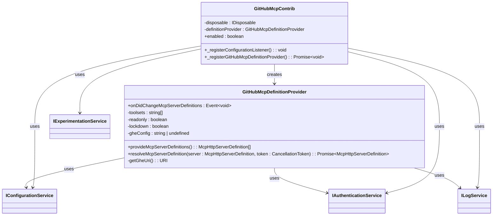
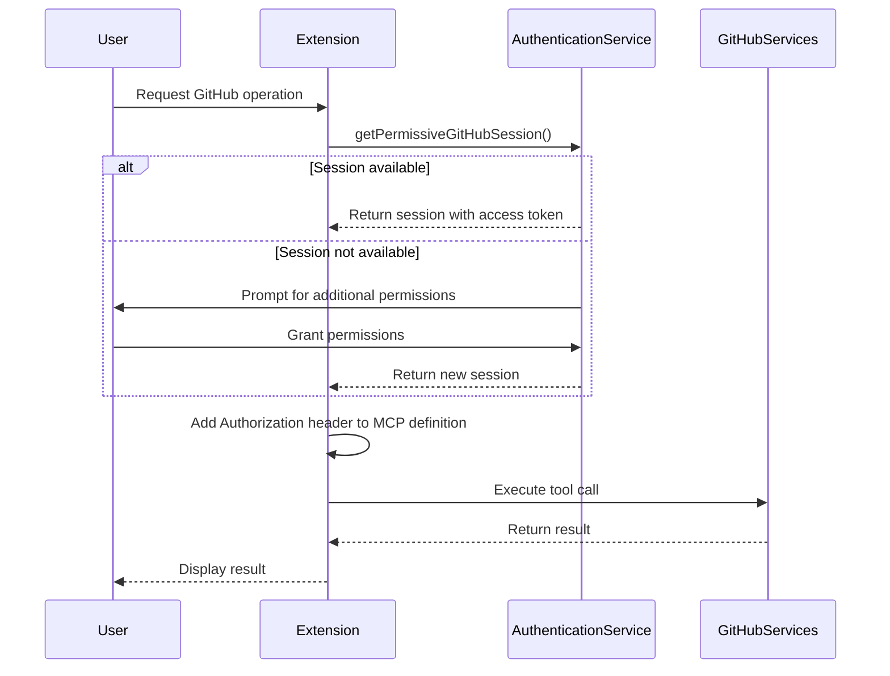
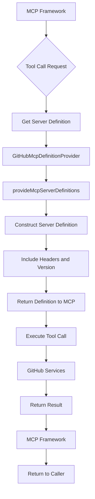

# GitHub Integration

<cite>
**Referenced Files in This Document**   
- [githubMcpDefinitionProvider.ts](file://src/extension/githubMcp/common/githubMcpDefinitionProvider.ts)
- [githubMcp.contribution.ts](file://src/extension/githubMcp/vscode-node/githubMcp.contribution.ts)
- [configurationService.ts](file://src/platform/configuration/common/configurationService.ts)
- [authentication.ts](file://src/platform/authentication/common/authentication.ts)
- [mcpHandler.ts](file://src/extension/agents/copilotcli/node/mcpHandler.ts)
</cite>

## Table of Contents
1. [Introduction](#introduction)
2. [Architecture Overview](#architecture-overview)
3. [Core Components](#core-components)
4. [Configuration and Parameters](#configuration-and-parameters)
5. [Authentication and Security](#authentication-and-security)
6. [Error Handling and Troubleshooting](#error-handling-and-troubleshooting)
7. [MCP Framework Integration](#mcp-framework-integration)

## Introduction
The GitHub Integration feature in the vscode-copilot-chat extension enables seamless communication between the extension and GitHub services through the Model Context Protocol (MCP) framework. This integration allows the extension to access GitHub repositories, query metadata, and perform operations on GitHub resources. The core implementation revolves around the githubMcp module, which provides the necessary infrastructure for establishing and managing connections to GitHub services. The integration supports both GitHub.com and GitHub Enterprise environments, with configurable parameters for repository access and security settings. This document provides a comprehensive analysis of the implementation, focusing on the githubMcpDefinitionProvider class, configuration options, authentication mechanisms, and error handling strategies.

## Architecture Overview
The GitHub Integration architecture follows a modular design pattern with clear separation of concerns between configuration management, authentication handling, and MCP server definition. The integration is initialized through the GitHubMcpContrib class, which acts as the entry point and manages the lifecycle of the integration components. When enabled, this contribution class registers the GitHubMcpDefinitionProvider with the MCP framework, establishing the connection between the extension and GitHub services. The architecture implements an event-driven model where changes to configuration or authentication state trigger updates to the MCP server definitions. This ensures that the connection parameters remain synchronized with the user's settings and authentication status. The integration leverages the MCP framework's extensibility model to dynamically provide server definitions based on the current context, allowing for flexible routing of tool calls to appropriate GitHub services.

**Diagram sources**
- [githubMcp.contribution.ts](file://src/extension/githubMcp/vscode-node/githubMcp.contribution.ts#L14-L56)
- [githubMcpDefinitionProvider.ts](file://src/extension/githubMcp/common/githubMcpDefinitionProvider.ts#L16-L149)

## Core Components

The githubMcp module consists of two primary components: the GitHubMcpDefinitionProvider and the GitHubMcpContrib. The GitHubMcpDefinitionProvider implements the McpServerDefinitionProvider interface and is responsible for providing and resolving MCP server definitions for GitHub services. This class monitors configuration changes and authentication state to dynamically generate appropriate server definitions. The provider exposes an onDidChangeMcpServerDefinitions event that fires when relevant configuration parameters change, ensuring that the MCP framework receives updated connection information. The GitHubMcpContrib class serves as the contribution point that registers the definition provider with the MCP framework. It listens for changes to the GitHubMcpEnabled configuration and manages the registration and disposal of the definition provider accordingly. This separation of concerns allows for clean initialization and cleanup of the integration components.

**Section sources**
- [githubMcpDefinitionProvider.ts](file://src/extension/githubMcp/common/githubMcpDefinitionProvider.ts#L16-L149)
- [githubMcp.contribution.ts](file://src/extension/githubMcp/vscode-node/githubMcp.contribution.ts#L14-L56)

## Configuration and Parameters

The GitHub Integration provides several configuration options that control the connection to GitHub services. These parameters are defined as experiment-based configurations in the ConfigKey namespace and can be modified by users to customize the integration behavior. The primary configuration options include GitHubMcpEnabled, which controls whether the GitHub MCP integration is active; GitHubMcpToolsets, which specifies the toolsets available for use; GitHubMcpReadonly, which enables read-only mode for operations; and GitHubMcpLockdown, which activates lockdown mode for enhanced security. For GitHub Enterprise integration, the github-enterprise.uri configuration parameter specifies the enterprise instance URL. These configuration values are accessed through the IConfigurationService and are used to construct the appropriate headers and version strings for MCP server definitions. The integration also monitors changes to the Shared.AuthProvider configuration to detect switches between GitHub.com and GitHub Enterprise authentication.

**Diagram sources**
- [githubMcpDefinitionProvider.ts](file://src/extension/githubMcp/common/githubMcpDefinitionProvider.ts#L16-L149)
- [githubMcp.contribution.ts](file://src/extension/githubMcp/vscode-node/githubMcp.contribution.ts#L14-L56)
- [configurationService.ts](file://src/platform/configuration/common/configurationService.ts#L600-L800)

## Authentication and Security

The GitHub Integration implements a robust authentication mechanism that leverages the extension's authentication service to obtain access tokens for GitHub operations. The integration requires permissive GitHub sessions, which provide elevated permissions necessary for accessing extended Copilot API features. When resolving MCP server definitions, the githubMcpDefinitionProvider requests a permissive session through the IAuthenticationService, prompting the user for additional permissions if needed. The access token is then included in the Authorization header of HTTP requests to GitHub services. For security, the integration follows the principle of least privilege and only requests the minimum necessary permissions. The readonly and lockdown configuration options provide additional security controls, with readonly mode preventing write operations and lockdown mode restricting access to sensitive endpoints. The integration also handles authentication state changes by listening to the onDidAuthenticationChange event, ensuring that server definitions are updated when the user's authentication status changes.

**Diagram sources**
- [githubMcpDefinitionProvider.ts](file://src/extension/githubMcp/common/githubMcpDefinitionProvider.ts#L137-L148)
- [authentication.ts](file://src/platform/authentication/common/authentication.ts#L79-L99)

## Error Handling and Troubleshooting

The GitHub Integration includes comprehensive error handling mechanisms to address common issues such as authentication failures and rate limiting. When authentication is required but no valid session is available, the resolveMcpServerDefinition method throws an "Authentication required" error, prompting the user to sign in or grant additional permissions. For GitHub Enterprise integration, the getGheUri method validates the enterprise URL configuration and throws an error if the URI is not configured, preventing attempts to connect to undefined endpoints. The integration also handles configuration changes by firing the onDidChangeMcpServerDefinitions event when relevant settings are modified, ensuring that the MCP framework receives updated connection information. Common troubleshooting steps for connection issues include verifying authentication status, checking configuration settings, and ensuring network connectivity to GitHub services. The integration logs debug messages for configuration changes and authentication state transitions, aiding in diagnosis of connectivity problems.

**Section sources**
- [githubMcpDefinitionProvider.ts](file://src/extension/githubMcp/common/githubMcpDefinitionProvider.ts#L90-L91)
- [githubMcpDefinitionProvider.ts](file://src/extension/githubMcp/common/githubMcpDefinitionProvider.ts#L143-L145)

## MCP Framework Integration

The GitHub Integration connects to the MCP framework through the registration of a server definition provider, enabling the routing of tool calls to GitHub services. The GitHubMcpContrib class registers the GitHubMcpDefinitionProvider with the MCP framework using the lm.registerMcpServerDefinitionProvider method, making the GitHub server definitions available to the system. When tool calls are executed, the MCP framework uses the definition provider to obtain the appropriate server configuration, including the endpoint URL, headers, and version information. The provideMcpServerDefinitions method constructs server definitions with conditional headers based on configuration parameters, such as X-MCP-Toolsets for available toolsets, X-MCP-Readonly for read-only mode, and X-MCP-Lockdown for lockdown mode. The version string incorporates sorted toolset names and flags for readonly and lockdown modes, allowing the server to optimize responses based on the client's capabilities. This integration enables seamless execution of GitHub-related tool calls within the MCP framework, providing a consistent interface for accessing GitHub services.

**Diagram sources**
- [githubMcp.contribution.ts](file://src/extension/githubMcp/vscode-node/githubMcp.contribution.ts#L49-L50)
- [githubMcpDefinitionProvider.ts](file://src/extension/githubMcp/common/githubMcpDefinitionProvider.ts#L97-L135)
- [mcpHandler.ts](file://src/extension/agents/copilotcli/node/mcpHandler.ts#L266-L284)