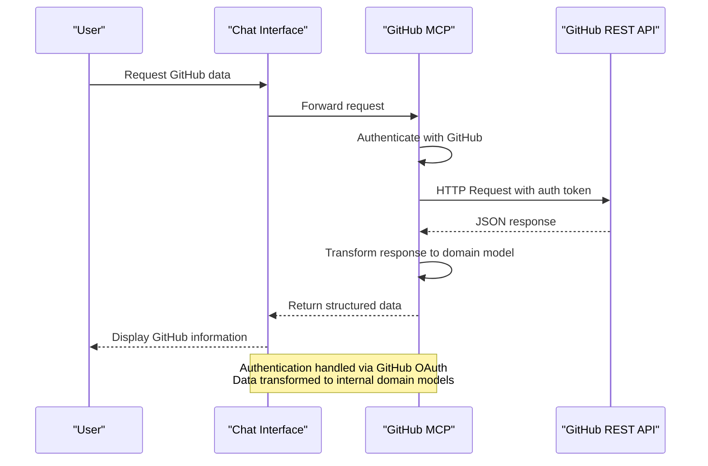
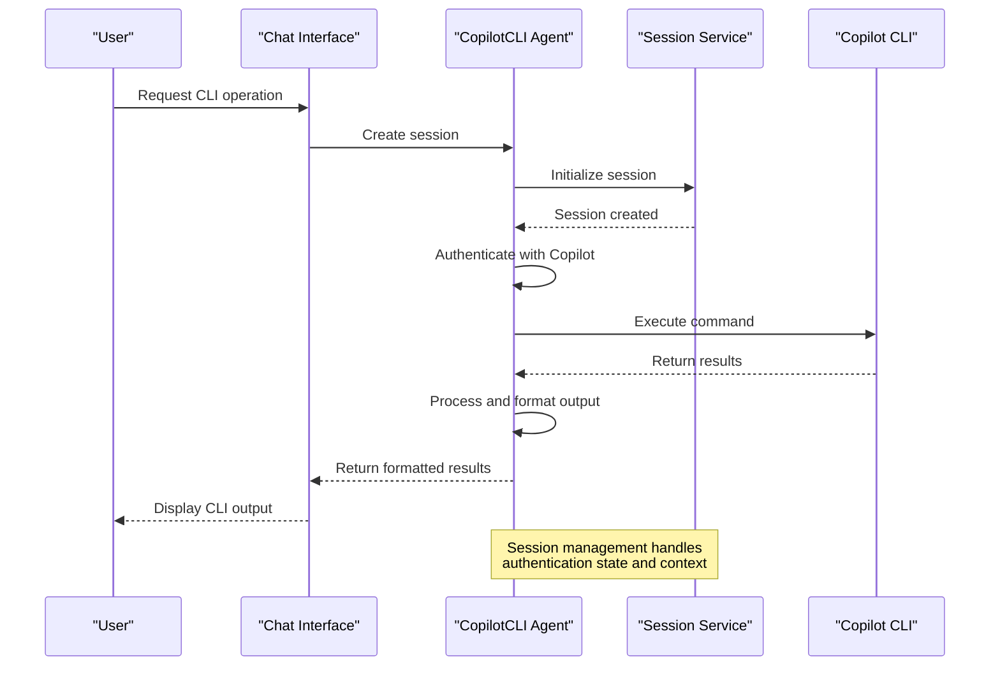
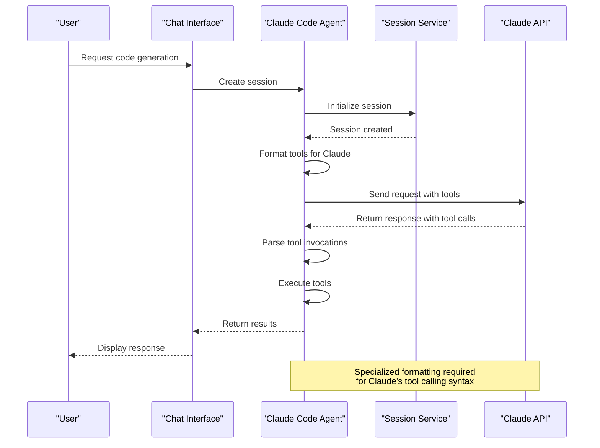
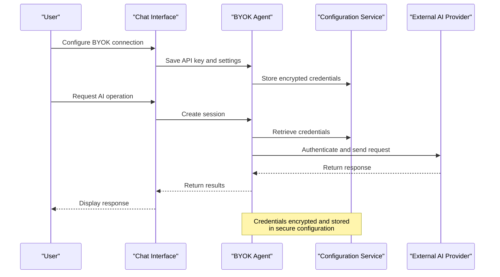
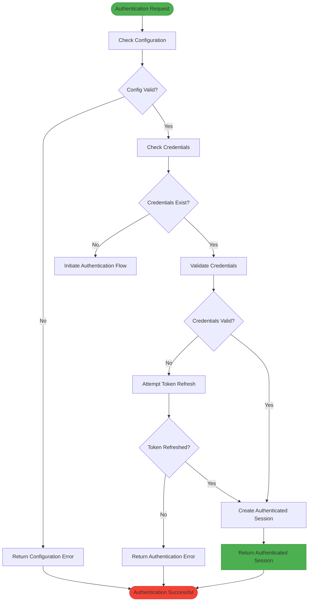

# Integration Features

<cite>
**Referenced Files in This Document**   
- [githubMcpDefinitionProvider.ts](file://src/extension/githubMcp/common/githubMcpDefinitionProvider.ts)
- [githubMcp.contribution.ts](file://src/extension/githubMcp/vscode-node/githubMcp.contribution.ts)
- [commands.ts](file://src/extension/mcp/vscode-node/commands.ts)
- [mcpToolCallingLoop.tsx](file://src/extension/mcp/vscode-node/mcpToolCallingLoop.tsx)
- [mcpToolCallingTools.tsx](file://src/extension/mcp/vscode-node/mcpToolCallingTools.tsx)
- [nuget.ts](file://src/extension/mcp/vscode-node/nuget.ts)
- [copilotCLITools.ts](file://src/extension/agents/copilotcli/common/copilotCLITools.ts)
- [copilotCLIPrompt.ts](file://src/extension/agents/copilotcli/common/copilotCLIPrompt.ts)
- [copilotcliSession.ts](file://src/extension/agents/copilotcli/node/copilotcliSession.ts)
- [copilotcliSessionService.ts](file://src/extension/agents/copilotcli/node/copilotcliSessionService.ts)
- [claudeCodeAgent.ts](file://src/extension/agents/claude/node/claudeCodeAgent.ts)
- [claudeCodeSessionService.ts](file://src/extension/agents/claude/node/claudeCodeSessionService.ts)
- [claudeTools.ts](file://src/extension/agents/claude/common/claudeTools.ts)
- [toolInvocationFormatter.ts](file://src/extension/agents/claude/common/toolInvocationFormatter.ts)
- [byokAgent.ts](file://src/extension/agents/byok/common/byokAgent.ts)
- [byokSessionService.ts](file://src/extension/agents/byok/node/byokSessionService.ts)
- [byokTools.ts](file://src/extension/agents/byok/common/byokTools.ts)
</cite>

## Table of Contents
1. [Introduction](#introduction)
2. [GitHub Integration](#github-integration)
3. [MCP (Model Control Plane) Connectivity](#mcp-model-control-plane-connectivity)
4. [Third-Party AI Service Integration](#third-party-ai-service-integration)
5. [Agent Framework Architecture](#agent-framework-architecture)
6. [Configuration and Connection Settings](#configuration-and-connection-settings)
7. [Authentication and Security](#authentication-and-security)
8. [Error Handling and Troubleshooting](#error-handling-and-troubleshooting)
9. [Conclusion](#conclusion)

## Introduction
The vscode-copilot-chat extension provides a sophisticated integration framework that enables seamless connectivity with various AI services through multiple integration channels. This document details the implementation of GitHub integration, MCP (Model Control Plane) connectivity, and third-party AI service integration, focusing on the architecture, interfaces, and domain models that facilitate these connections. The system is designed to support multiple agent implementations (copilotcli, claude, byok) while providing a consistent integration framework for external AI providers.

## GitHub Integration

The GitHub integration in vscode-copilot-chat enables deep connectivity with GitHub repositories and services, allowing the AI assistant to access repository metadata, pull requests, issues, and other GitHub-specific resources. The integration is implemented through the githubMcp module, which provides a bridge between the chat interface and GitHub's API ecosystem.

The integration follows a contribution-based architecture where GitHub-specific functionality is registered through contribution points. The core implementation resides in the githubMcp module, which handles authentication, API requests, and data transformation between the chat system and GitHub's REST API.



**Diagram sources**
- [githubMcpDefinitionProvider.ts](file://src/extension/githubMcp/common/githubMcpDefinitionProvider.ts#L1-L50)
- [githubMcp.contribution.ts](file://src/extension/githubMcp/vscode-node/githubMcp.contribution.ts#L1-L30)

**Section sources**
- [githubMcpDefinitionProvider.ts](file://src/extension/githubMcp/common/githubMcpDefinitionProvider.ts#L1-L100)
- [githubMcp.contribution.ts](file://src/extension/githubMcp/vscode-node/githubMcp.contribution.ts#L1-L50)

## MCP (Model Control Plane) Connectivity

The Model Control Plane (MCP) connectivity system provides a standardized interface for interacting with various AI models and services. The MCP implementation enables tool calling, function execution, and structured data exchange between the chat system and external AI providers.

The MCP architecture is built around a command-based system where specific tools and capabilities are exposed through well-defined interfaces. The implementation includes support for NuGet package management, which serves as a reference implementation for how external services can be integrated through the MCP framework.

```mermaid
classDiagram
class MCPCommands {
+executeCommand(command : string, args : any) : Promise~any~
+registerTool(tool : MCPTool) : void
+getAvailableTools() : MCPTool[]
}
class MCPTool {
+name : string
+description : string
+parameters : MCPToolParameters
+execute(args : any) : Promise~any~
}
class MCPToolParameters {
+type : string
+properties : Map~string, MCPParameter~
+required : string[]
}
class MCPParameter {
+type : string
+description : string
+enum : string[]
}
class NuGetIntegration {
+searchPackage(query : string) : Promise~PackageResult[]
+getPackageMetadata(id : string) : Promise~PackageMetadata~
+getPackageReadme(id : string, version : string) : Promise~string~
}
class ToolCallingLoop {
+start(session : MCPSession) : Promise~void~
+handleToolCall(toolCall : ToolCall) : Promise~ToolResult~
+validateToolInput(toolName : string, input : any) : boolean
}
MCPCommands --> MCPTool : "has"
MCPTool --> MCPToolParameters : "has"
MCPToolParameters --> MCPParameter : "contains"
MCPCommands --> NuGetIntegration : "implements"
ToolCallingLoop --> MCPCommands : "uses"
NuGetIntegration ..|> MCPTool : "implements"
Note over MCPCommands,ToolCallingLoop : The MCP framework provides a standardized<br/>interface for tool integration and execution
```

**Diagram sources**
- [commands.ts](file://src/extension/mcp/vscode-node/commands.ts#L1-L80)
- [mcpToolCallingLoop.tsx](file://src/extension/mcp/vscode-node/mcpToolCallingLoop.tsx#L1-L60)
- [mcpToolCallingTools.tsx](file://src/extension/mcp/vscode-node/mcpToolCallingTools.tsx#L1-L40)
- [nuget.ts](file://src/extension/mcp/vscode-node/nuget.ts#L1-L50)

**Section sources**
- [commands.ts](file://src/extension/mcp/vscode-node/commands.ts#L1-L100)
- [mcpToolCallingLoop.tsx](file://src/extension/mcp/vscode-node/mcpToolCallingLoop.tsx#L1-L80)
- [nuget.ts](file://src/extension/mcp/vscode-node/nuget.ts#L1-L60)

## Third-Party AI Service Integration

The extension supports integration with third-party AI services through a flexible agent-based architecture. Each AI provider is implemented as an agent that conforms to a common interface while providing provider-specific capabilities. The system currently supports agents for Copilot CLI, Claude, and Bring-Your-Own-Key (BYOK) configurations.

The integration framework provides a consistent API for authentication, session management, and tool execution across different AI providers. Each agent implementation handles the specific requirements of its target service while abstracting these details from the core chat system.

### Copilot CLI Integration

The Copilot CLI agent provides integration with the GitHub Copilot CLI service, enabling command-line interface capabilities within the chat environment. The agent handles authentication, session management, and tool execution for CLI-based operations.



**Diagram sources**
- [copilotcliSession.ts](file://src/extension/agents/copilotcli/node/copilotcliSession.ts#L1-L40)
- [copilotcliSessionService.ts](file://src/extension/agents/copilotcli/node/copilotcliSessionService.ts#L1-L50)
- [copilotCLITools.ts](file://src/extension/agents/copilotcli/common/copilotCLITools.ts#L1-L30)

### Claude Integration

The Claude agent provides integration with Anthropic's Claude AI model, enabling access to its advanced reasoning and code generation capabilities. The integration includes specialized tool formatting and session management tailored to Claude's API requirements.



**Diagram sources**
- [claudeCodeAgent.ts](file://src/extension/agents/claude/node/claudeCodeAgent.ts#L1-L50)
- [claudeCodeSessionService.ts](file://src/extension/agents/claude/node/claudeCodeSessionService.ts#L1-L40)
- [claudeTools.ts](file://src/extension/agents/claude/common/claudeTools.ts#L1-L30)
- [toolInvocationFormatter.ts](file://src/extension/agents/claude/common/toolInvocationFormatter.ts#L1-L25)

### BYOK (Bring-Your-Own-Key) Integration

The BYOK agent enables users to connect their own AI service credentials, providing flexibility to use various AI providers with their own API keys. This integration supports custom authentication and configuration for different service providers.



**Diagram sources**
- [byokAgent.ts](file://src/extension/agents/byok/common/byokAgent.ts#L1-L40)
- [byokSessionService.ts](file://src/extension/agents/byok/node/byokSessionService.ts#L1-L50)
- [byokTools.ts](file://src/extension/agents/byok/common/byokTools.ts#L1-L30)

**Section sources**
- [copilotCLITools.ts](file://src/extension/agents/copilotcli/common/copilotCLITools.ts#L1-L60)
- [copilotCLIPrompt.ts](file://src/extension/agents/copilotcli/common/copilotCLIPrompt.ts#L1-L40)
- [claudeTools.ts](file://src/extension/agents/claude/common/claudeTools.ts#L1-L50)
- [byokAgent.ts](file://src/extension/agents/byok/common/byokAgent.ts#L1-L50)

## Agent Framework Architecture

The agent framework provides a unified interface for integrating different AI providers while allowing for provider-specific implementations. The architecture follows a modular design with clear separation between common functionality and provider-specific code.

```mermaid
classDiagram
class Agent {
<<interface>>
+createSession(config : AgentConfig) : AgentSession
+getCapabilities() : AgentCapability[]
+getName() : string
+getDescription() : string
}
class AgentSession {
<<interface>>
+sendMessage(message : AgentMessage) : Promise~AgentResponse~
+getTools() : AgentTool[]
+dispose() : void
}
class AgentTool {
+name : string
+description : string
+parameters : AgentToolParameters
+execute(args : any) : Promise~any~
}
class AgentConfig {
+provider : string
+apiKey : string
+model : string
+temperature : number
+maxTokens : number
}
class AgentMessage {
+role : MessageRole
+content : string
+toolCalls : ToolCall[]
}
class AgentResponse {
+content : string
+toolCalls : ToolCall[]
+usage : TokenUsage
}
class TokenUsage {
+promptTokens : number
+completionTokens : number
+totalTokens : number
}
class CopilotCLIAgent {
+createSession(config : AgentConfig) : CopilotCLISession
+getCapabilities() : AgentCapability[]
}
class ClaudeAgent {
+createSession(config : AgentConfig) : ClaudeSession
+getCapabilities() : AgentCapability[]
}
class BYOKAgent {
+createSession(config : AgentConfig) : BYOKSession
+getCapabilities() : AgentCapability[]
}
class CopilotCLISession {
+sendMessage(message : AgentMessage) : Promise~AgentResponse~
+getTools() : AgentTool[]
}
class ClaudeSession {
+sendMessage(message : AgentMessage) : Promise~AgentResponse~
+getTools() : AgentTool[]
}
class BYOKSession {
+sendMessage(message : AgentMessage) : Promise~AgentResponse~
+getTools() : AgentTool[]
}
Agent <|.. CopilotCLIAgent : "implements"
Agent <|.. ClaudeAgent : "implements"
Agent <|.. BYOKAgent : "implements"
AgentSession <|.. CopilotCLISession : "implements"
AgentSession <|.. ClaudeSession : "implements"
AgentSession <|.. BYOKSession : "implements"
AgentSession --> AgentTool : "has"
AgentMessage --> ToolCall : "contains"
AgentResponse --> ToolCall : "contains"
AgentResponse --> TokenUsage : "has"
CopilotCLIAgent --> CopilotCLISession : "creates"
ClaudeAgent --> ClaudeSession : "creates"
BYOKAgent --> BYOKSession : "creates"
Note over Agent,AgentSession : Common interface for all AI providers<br/>Enables consistent integration pattern
```

**Diagram sources**
- [copilotCLITools.ts](file://src/extension/agents/copilotcli/common/copilotCLITools.ts#L1-L80)
- [claudeTools.ts](file://src/extension/agents/claude/common/claudeTools.ts#L1-L60)
- [byokAgent.ts](file://src/extension/agents/byok/common/byokAgent.ts#L1-L70)

**Section sources**
- [copilotCLITools.ts](file://src/extension/agents/copilotcli/common/copilotCLITools.ts#L1-L100)
- [claudeTools.ts](file://src/extension/agents/claude/common/claudeTools.ts#L1-L80)
- [byokAgent.ts](file://src/extension/agents/byok/common/byokAgent.ts#L1-L90)

## Configuration and Connection Settings

The integration system provides extensive configuration options to customize connection behavior, authentication methods, and operational parameters for different AI services. Configuration is managed through a hierarchical system that supports both global settings and provider-specific overrides.

### Configuration Options

The system supports the following configuration parameters for integration behavior:

| Configuration Parameter | Description | Default Value | Scope |
|------------------------|-------------|---------------|-------|
| `agent.provider` | Specifies the AI provider to use | "copilot" | Global |
| `agent.model` | Specifies the model version to use | "default" | Provider-specific |
| `agent.temperature` | Controls randomness of responses | 0.7 | Provider-specific |
| `agent.maxTokens` | Maximum tokens in response | 1024 | Provider-specific |
| `agent.apiKey` | API key for authentication | "" | Provider-specific |
| `agent.endpoint` | Custom endpoint URL | "" | Provider-specific |
| `mcp.enabled` | Enables MCP tool calling | true | Global |
| `githubMcp.enabled` | Enables GitHub integration | true | Global |
| `rateLimiting.enabled` | Enables rate limiting | true | Global |
| `rateLimiting.requestsPerMinute` | Max requests per minute | 60 | Global |

### Connection Parameters

Each integration type has specific connection parameters that control how the system connects to external services:

**GitHub MCP Connection Parameters:**
- `github.token`: Personal access token for GitHub authentication
- `github.scopes`: Required OAuth scopes for API access
- `github.apiEndpoint`: Custom GitHub API endpoint (for GitHub Enterprise)
- `github.timeout`: Request timeout in milliseconds

**MCP Connection Parameters:**
- `mcp.tools`: List of enabled MCP tools
- `mcp.toolTimeout`: Timeout for tool execution
- `mcp.maxToolCalls`: Maximum number of tool calls per request
- `mcp.parallelToolExecution`: Enable parallel tool execution

**Third-Party AI Service Parameters:**
- `aiService.apiKey`: API key for the AI service
- `aiService.model`: Specific model to use
- `aiService.region`: Geographic region for the service
- `aiService.proxy`: Proxy server for API requests
- `aiService.verifySSL`: Enable SSL certificate verification

**Section sources**
- [copilotcliSessionService.ts](file://src/extension/agents/copilotcli/node/copilotcliSessionService.ts#L1-L80)
- [claudeCodeSessionService.ts](file://src/extension/agents/claude/node/claudeCodeSessionService.ts#L1-L70)
- [byokSessionService.ts](file://src/extension/agents/byok/node/byokSessionService.ts#L1-L60)

## Authentication and Security

The integration framework implements robust authentication and security measures to protect user credentials and ensure secure communication with external services.

### Authentication Mechanisms

The system supports multiple authentication methods depending on the integration type:

**GitHub Authentication:**
- OAuth 2.0 with device flow
- Personal access tokens
- SSO (Single Sign-On) integration
- Token refresh and renewal

**Third-Party AI Service Authentication:**
- API key authentication
- Bring-Your-Own-Key (BYOK) model
- Secure credential storage
- Token-based authentication

### Security Features

The integration framework includes the following security features:

- **Credential Encryption**: All API keys and sensitive credentials are encrypted at rest
- **Secure Storage**: Credentials stored in secure storage mechanisms provided by the operating system
- **Token Scoping**: OAuth tokens with minimal required permissions
- **Request Validation**: Input validation for all API requests
- **Rate Limiting**: Protection against excessive API usage
- **Audit Logging**: Logging of authentication events and API calls
- **Certificate Pinning**: Protection against man-in-the-middle attacks
- **CORS Protection**: Cross-origin resource sharing restrictions



**Diagram sources**
- [githubMcpDefinitionProvider.ts](file://src/extension/githubMcp/common/githubMcpDefinitionProvider.ts#L1-L60)
- [copilotcliSessionService.ts](file://src/extension/agents/copilotcli/node/copilotcliSessionService.ts#L1-L100)
- [byokSessionService.ts](file://src/extension/agents/byok/node/byokSessionService.ts#L1-L80)

**Section sources**
- [githubMcpDefinitionProvider.ts](file://src/extension/githubMcp/common/githubMcpDefinitionProvider.ts#L1-L80)
- [copilotcliSessionService.ts](file://src/extension/agents/copilotcli/node/copilotcliSessionService.ts#L1-L120)
- [byokSessionService.ts](file://src/extension/agents/byok/node/byokSessionService.ts#L1-L100)

## Error Handling and Troubleshooting

The integration system includes comprehensive error handling and troubleshooting capabilities to address common issues that may arise during operation.

### Common Issues and Solutions

**Authentication Failures:**
- **Symptoms**: "Authentication failed", "Invalid credentials", "Token expired"
- **Causes**: Expired tokens, incorrect API keys, revoked permissions
- **Solutions**: 
  - Re-authenticate with the service
  - Verify API key validity
  - Check token expiration and refresh if needed
  - Ensure required permissions are granted

**Rate Limiting:**
- **Symptoms**: "Rate limit exceeded", "Too many requests", HTTP 429 errors
- **Causes**: Exceeding API request limits
- **Solutions**:
  - Implement exponential backoff for retries
  - Check current rate limit status
  - Reduce request frequency
  - Upgrade to higher-tier API plan if available

**Compatibility Issues:**
- **Symptoms**: "Unsupported feature", "Invalid request format", API version mismatch
- **Causes**: API version differences, unsupported features, schema changes
- **Solutions**:
  - Verify API version compatibility
  - Update integration code to match current API
  - Implement feature detection and fallbacks
  - Check service provider documentation for changes

**Network Connectivity:**
- **Symptoms**: "Connection timeout", "Network error", "Unable to reach service"
- **Causes**: Network issues, firewall restrictions, service outages
- **Solutions**:
  - Check network connectivity
  - Verify proxy settings if behind corporate firewall
  - Check service status page for outages
  - Implement retry logic with backoff

### Error Response Structure

The system standardizes error responses across different integrations:

```typescript
interface IntegrationError {
    code: string;           // Standardized error code
    message: string;        // Human-readable error message
    details?: any;          // Additional error details
    retryable: boolean;     // Whether the operation can be retried
    suggestedAction?: string; // Suggested action to resolve
    timestamp: Date;        // When the error occurred
}
```

### Troubleshooting Guide

When encountering integration issues, follow this systematic approach:

1. **Verify Configuration**: Check that all required settings are correctly configured
2. **Check Authentication**: Ensure credentials are valid and not expired
3. **Review Logs**: Examine detailed logs for specific error messages
4. **Test Connectivity**: Verify network connectivity to the service endpoint
5. **Check Rate Limits**: Confirm you're not exceeding API rate limits
6. **Validate Input**: Ensure requests contain valid data and parameters
7. **Update Dependencies**: Ensure you're using compatible versions
8. **Consult Documentation**: Review service provider documentation for changes

**Section sources**
- [githubMcpDefinitionProvider.ts](file://src/extension/githubMcp/common/githubMcpDefinitionProvider.ts#L1-L100)
- [commands.ts](file://src/extension/mcp/vscode-node/commands.ts#L1-L100)
- [copilotcliSessionService.ts](file://src/extension/agents/copilotcli/node/copilotcliSessionService.ts#L1-L150)
- [claudeCodeSessionService.ts](file://src/extension/agents/claude/node/claudeCodeSessionService.ts#L1-L120)

## Conclusion

The vscode-copilot-chat extension provides a robust and flexible integration framework that enables seamless connectivity with GitHub, MCP services, and various third-party AI providers. The architecture is designed with modularity and extensibility in mind, allowing for easy addition of new integration points while maintaining a consistent interface for users.

Key features of the integration system include:
- Support for multiple AI providers through a unified agent framework
- Comprehensive configuration options for customizing integration behavior
- Robust authentication and security measures
- Standardized error handling and troubleshooting capabilities
- Extensible architecture for adding new services and capabilities

The system effectively balances ease of use for beginners with sufficient technical depth for experienced developers who wish to extend or customize the integration features. By providing clear interfaces, well-documented configuration options, and comprehensive error handling, the integration framework enables reliable and secure connectivity with various AI services while maintaining a high level of flexibility and extensibility.