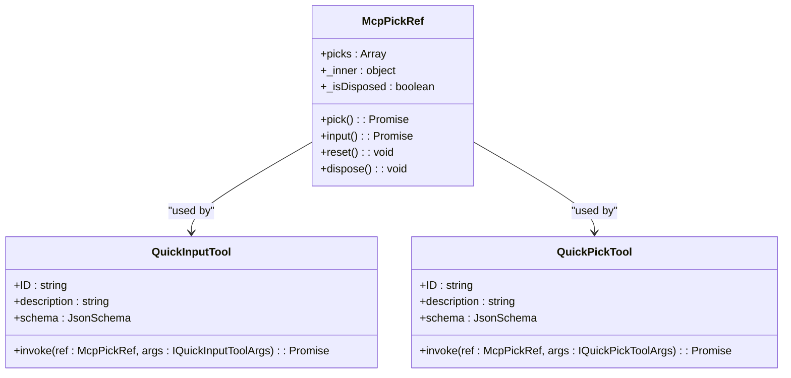
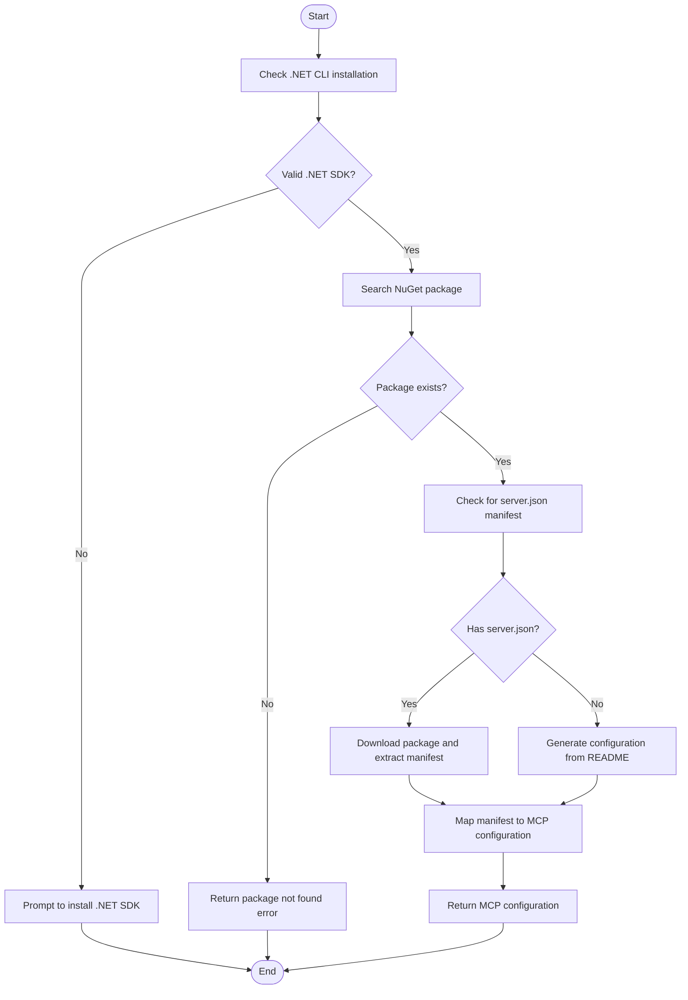
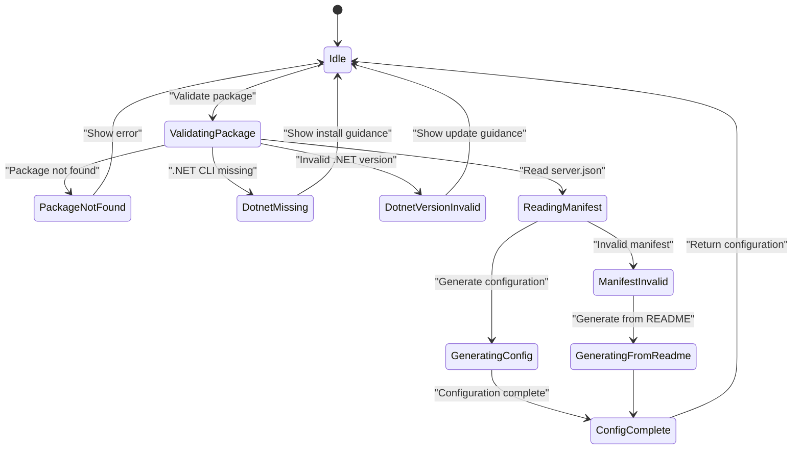

# MCP Integration

<cite>
**Referenced Files in This Document**   
- [commands.ts](file://src/extension/mcp/vscode-node/commands.ts)
- [mcpToolCallingLoop.tsx](file://src/extension/mcp/vscode-node/mcpToolCallingLoop.tsx)
- [mcpToolCallingTools.tsx](file://src/extension/mcp/vscode-node/mcpToolCallingTools.tsx)
- [nuget.ts](file://src/extension/mcp/vscode-node/nuget.ts)
- [mcpToolCallingLoopPrompt.tsx](file://src/extension/mcp/vscode-node/mcpToolCallingLoopPrompt.tsx)
- [util.ts](file://src/extension/mcp/vscode-node/util.ts)
- [nuget.integration.spec.ts](file://src/extension/mcp/test/vscode-node/nuget.integration.spec.ts)
- [nuget.mapping.spec.ts](file://src/extension/mcp/test/vscode-node/nuget.mapping.spec.ts)
</cite>

## Table of Contents
1. [Introduction](#introduction)
2. [MCP Tool Calling Loop](#mcp-tool-calling-loop)
3. [MCP Tool Calling Tools](#mcp-tool-calling-tools)
4. [NuGet Package Integration](#nuget-package-integration)
5. [Configuration and Parameters](#configuration-and-parameters)
6. [Error Handling and Common Issues](#error-handling-and-common-issues)
7. [Extending MCP Integration](#extending-mcp-integration)
8. [Conclusion](#conclusion)

## Introduction
The MCP (Model Control Plane) Integration feature in the vscode-copilot-chat extension enables communication with external AI services through the MCP protocol. This integration allows developers to set up and manage MCP servers based on various package types, including npm, pip, Docker, and NuGet packages. The system uses a tool calling loop to interact with language models, gather necessary configuration information, and generate appropriate MCP server configurations. This document provides a comprehensive overview of the MCP integration implementation, focusing on the mcpToolCallingLoop component, the mcpToolCallingTools that define available operations, and specific examples of NuGet package search and other MCP services.

**Section sources**
- [commands.ts](file://src/extension/mcp/vscode-node/commands.ts#L1-L382)
- [mcpToolCallingLoop.tsx](file://src/extension/mcp/vscode-node/mcpToolCallingLoop.tsx#L1-L96)

## MCP Tool Calling Loop
The mcpToolCallingLoop component manages the lifecycle of tool calls in the MCP integration. It orchestrates the interaction between the language model and the user, facilitating the gathering of necessary configuration information for MCP servers. The loop is implemented as a class that extends a base ToolCallingLoop, providing specific functionality for MCP server setup.

The loop begins by validating the package registry to ensure the requested package exists. It supports multiple package types, including npm, pip, Docker, and NuGet. For each package type, it queries the respective registry API to retrieve package metadata. If the package is found, the loop proceeds to generate a configuration for the MCP server.

The tool calling loop uses a prompt system to guide the language model in creating the appropriate configuration. It provides a structured prompt that includes instructions for reading documentation, extracting relevant information, and generating a JSON configuration that matches a provided schema. The loop limits the number of tool calls to prevent infinite loops and ensures that the process completes within a reasonable timeframe.

```mermaid
sequenceDiagram
participant User as "User"
participant Loop as "McpToolCallingLoop"
participant Model as "Language Model"
participant Registry as "Package Registry"
User->>Loop : Request MCP server setup
Loop->>Registry : Validate package existence
Registry-->>Loop : Package metadata
Loop->>Model : Send prompt with instructions
Model->>Loop : Request tool calls
alt User input needed
Loop->>User : Show input prompt
User->>Loop : Provide input
Loop->>Model : Forward input
end
Model->>Loop : Return configuration
Loop->>User : Display generated configuration
```

**Diagram sources **
- [mcpToolCallingLoop.tsx](file://src/extension/mcp/vscode-node/mcpToolCallingLoop.tsx#L26-L95)
- [mcpToolCallingLoopPrompt.tsx](file://src/extension/mcp/vscode-node/mcpToolCallingLoopPrompt.tsx#L34-L108)

**Section sources**
- [mcpToolCallingLoop.tsx](file://src/extension/mcp/vscode-node/mcpToolCallingLoop.tsx#L26-L95)
- [mcpToolCallingLoopPrompt.tsx](file://src/extension/mcp/vscode-node/mcpToolCallingLoopPrompt.tsx#L34-L108)

## MCP Tool Calling Tools
The mcpToolCallingTools component defines the available operations that can be performed during the tool calling loop. These tools enable interaction with the user to gather necessary configuration information for MCP servers. The primary tools are QuickInputTool and QuickPickTool, which provide mechanisms for collecting user input and selections.

QuickInputTool prompts the user for a short string input, such as a server hostname or API key. It accepts parameters including an ID, title, placeholder text, and default value. When invoked, it displays an input box to the user and returns their input as a tool result. This tool is essential for collecting sensitive information like passwords or API keys that cannot be hardcoded in configurations.

QuickPickTool presents the user with a list of choices, allowing them to select one or more options. It is particularly useful for selecting from predefined sets of values, such as environment types or configuration modes. The tool accepts parameters including a title, placeholder text, whether multiple selections are allowed, and the list of choices with their labels and descriptions.

Both tools utilize the McpPickRef class to manage the state of user interactions. This class coordinates the display of input prompts and ensures that user responses are properly captured and returned to the tool calling loop. The tools are designed to be invoked by the language model when it determines that additional information is needed to complete the MCP server configuration.



**Diagram sources **
- [mcpToolCallingTools.tsx](file://src/extension/mcp/vscode-node/mcpToolCallingTools.tsx#L10-L229)

**Section sources**
- [mcpToolCallingTools.tsx](file://src/extension/mcp/vscode-node/mcpToolCallingTools.tsx#L10-L229)

## NuGet Package Integration
The NuGet package integration provides specific functionality for working with NuGet packages in the MCP ecosystem. The NuGetMcpSetup class handles the validation and configuration of NuGet packages as MCP servers. It performs several key operations to ensure proper setup and configuration.

First, the integration checks for the presence and version of the .NET CLI, which is required to work with NuGet packages. If the .NET SDK is not installed or is an outdated version, the system provides appropriate error messages and guidance for installation. This ensures that users have the necessary prerequisites before attempting to set up a NuGet-based MCP server.

Next, the integration verifies the existence of the requested NuGet package by querying the NuGet registry. It uses the dotnet CLI to search for the package and retrieve its metadata, including the latest version and owner information. If the package is not found, the system returns an appropriate error message indicating that the package does not exist on NuGet.org.

For packages that include a server.json manifest, the integration downloads the package and extracts the manifest to use as the basis for the MCP server configuration. This allows for more accurate and complete configurations that reflect the package author's intended setup. The manifest is then mapped to the VS Code MCP configuration format, handling various schema versions and ensuring compatibility.



**Diagram sources **
- [nuget.ts](file://src/extension/mcp/vscode-node/nuget.ts#L44-L120)

**Section sources**
- [nuget.ts](file://src/extension/mcp/vscode-node/nuget.ts#L44-L120)
- [nuget.integration.spec.ts](file://src/extension/mcp/test/vscode-node/nuget.integration.spec.ts#L1-L130)

## Configuration and Parameters
The MCP integration supports various configuration options and parameters for connecting to MCP servers. These configurations are defined through JSON schemas that specify the required fields and their types. The system uses these schemas to validate and generate appropriate MCP server configurations.

For NuGet packages, the configuration includes parameters such as the package name, version, and any required environment variables. The system also supports command-line arguments that may be necessary to run the MCP server in stdio mode. These parameters are extracted from the package's documentation or server.json manifest and incorporated into the final configuration.

Authentication parameters are handled through environment variables, which can be populated with user-provided values during the tool calling loop. Sensitive information like API keys or passwords are marked as secret in the configuration schema, ensuring they are properly protected. The system uses input interpolation (e.g., ${input:api_key}) to reference these values in the final configuration.

Service endpoints are configured based on the transport type specified in the server.json manifest. For stdio transport, the configuration includes the command and arguments needed to start the server. For remote transports like SSE or streamable HTTP, the configuration includes the URL and any required headers. The system handles both local and remote server configurations, providing flexibility in how MCP servers are deployed and accessed.

**Section sources**
- [nuget.ts](file://src/extension/mcp/vscode-node/nuget.ts#L344-L800)
- [nuget.mapping.spec.ts](file://src/extension/mcp/test/vscode-node/nuget.mapping.spec.ts#L1-L800)

## Error Handling and Common Issues
The MCP integration includes comprehensive error handling to address common issues that may arise when connecting to MCP servers. These issues include service unavailability, malformed responses, and authentication challenges.

Service unavailability is handled by validating the package registry before attempting to set up an MCP server. If the package does not exist or the registry is unreachable, the system provides clear error messages and guidance for resolution. For NuGet packages, the system checks for the presence of the .NET CLI and appropriate SDK version, providing helpful links for installation if needed.

Malformed responses are addressed through robust JSON parsing and schema validation. The system validates the server.json manifest against known schemas and handles various schema versions. If the manifest is invalid or missing required fields, the system attempts to generate a configuration from the package README as a fallback.

Authentication challenges are managed through the use of environment variables and input prompts. When sensitive information like API keys is required, the system prompts the user to provide this information during the tool calling loop. The configuration ensures that these values are properly interpolated and protected in the final MCP server configuration.



**Diagram sources **
- [nuget.ts](file://src/extension/mcp/vscode-node/nuget.ts#L58-L120)
- [nuget.integration.spec.ts](file://src/extension/mcp/test/vscode-node/nuget.integration.spec.ts#L92-L114)

**Section sources**
- [nuget.ts](file://src/extension/mcp/vscode-node/nuget.ts#L58-L120)
- [nuget.integration.spec.ts](file://src/extension/mcp/test/vscode-node/nuget.integration.spec.ts#L92-L114)

## Extending MCP Integration
The MCP integration can be extended to support additional tools or services beyond the current implementation. The modular design of the tool calling loop and tools system allows for easy addition of new functionality.

To add a new tool, developers can create a class that follows the pattern of QuickInputTool and QuickPickTool. The new tool should define a unique ID, description, and JSON schema for its input parameters. It should also implement an invoke method that handles the tool's functionality and returns a LanguageModelToolResult.

For supporting additional package types, developers can extend the validatePackageRegistry method in the McpSetupCommands class. This involves adding support for new package types and their respective registry APIs. The method should return appropriate validation results and package metadata for the new package type.

The prompt system can also be extended to support new scenarios or provide additional guidance to the language model. Developers can modify the McpToolCallingLoopPrompt class to include new instructions or examples that help the model generate more accurate configurations for specific use cases.

**Section sources**
- [commands.ts](file://src/extension/mcp/vscode-node/commands.ts#L108-L382)
- [mcpToolCallingTools.tsx](file://src/extension/mcp/vscode-node/mcpToolCallingTools.tsx#L97-L229)

## Conclusion
The MCP Integration feature in the vscode-copilot-chat extension provides a robust framework for connecting to and managing external AI services through the MCP protocol. The implementation centers around the mcpToolCallingLoop component, which manages the tool calling lifecycle, and the mcpToolCallingTools that define available operations for gathering configuration information. The integration supports various package types, with specific functionality for NuGet packages that includes validation, manifest extraction, and configuration mapping. The system handles common issues such as service unavailability and authentication challenges, providing clear error messages and guidance for resolution. The modular design allows for easy extension to support additional tools or services, making the MCP integration a flexible and powerful feature for developers working with AI services.