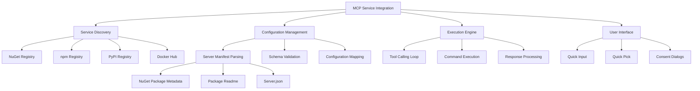
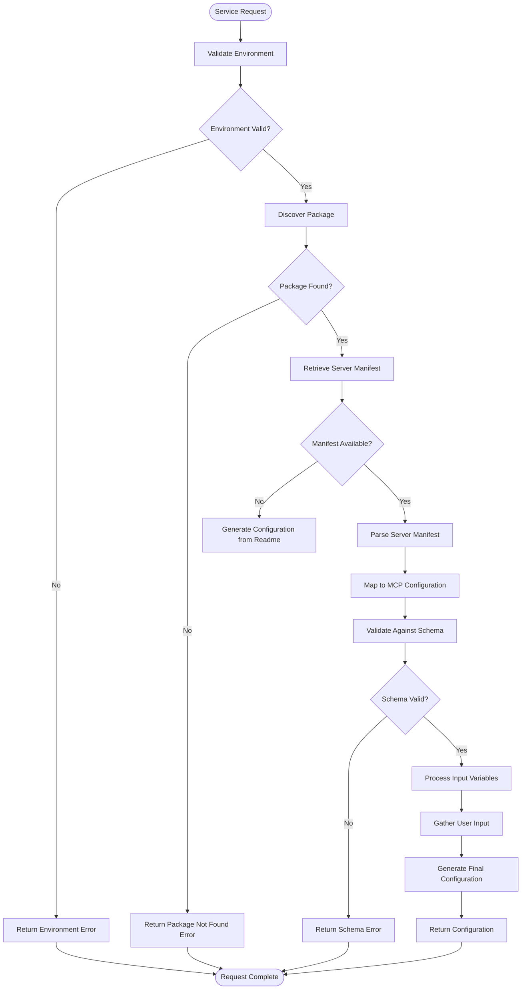
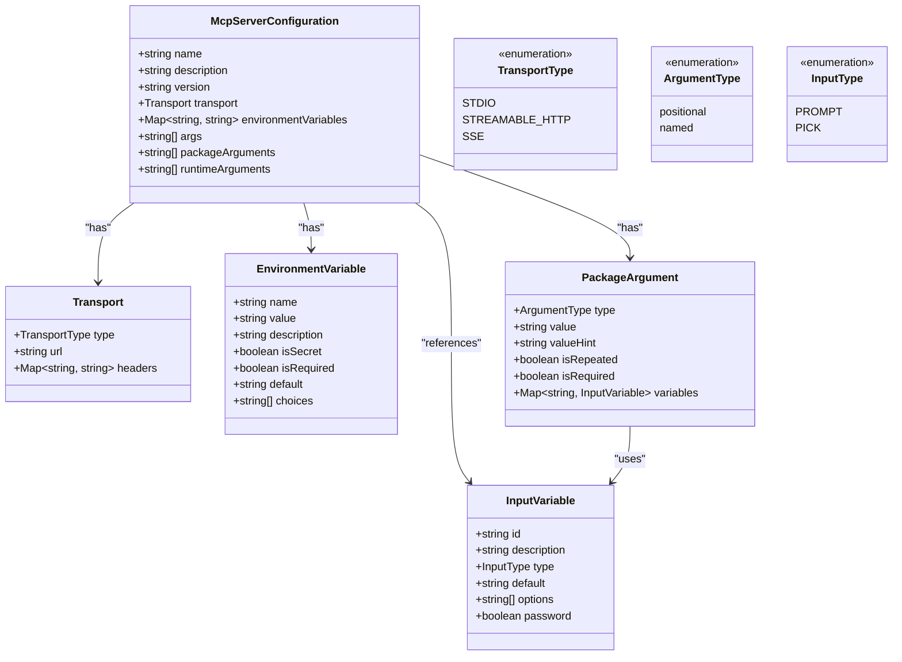
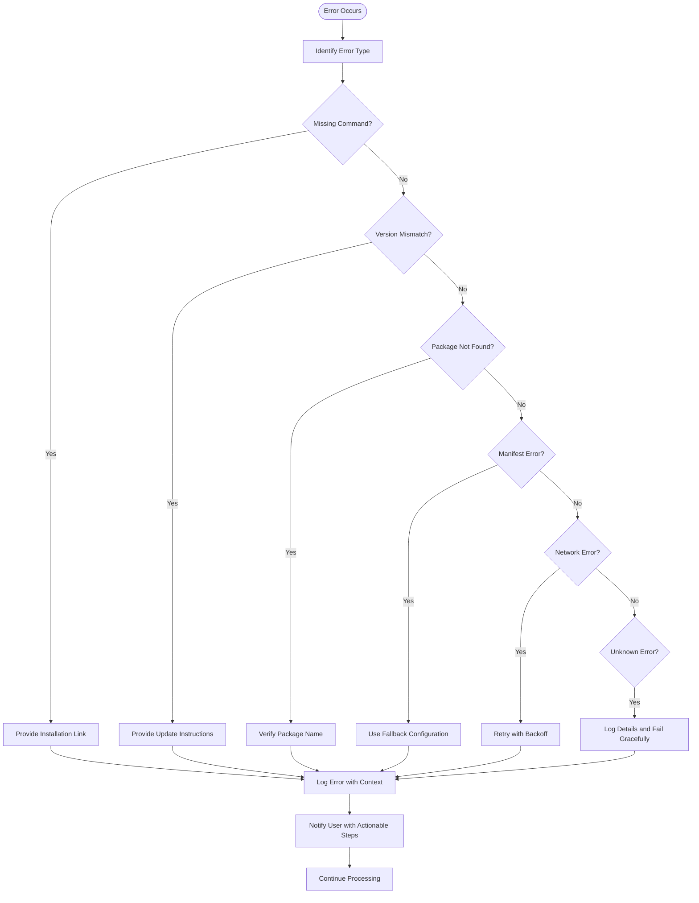

# MCP Services

<cite>
**Referenced Files in This Document**   
- [nuget.ts](file://src/extension/mcp/vscode-node/nuget.ts)
- [commands.ts](file://src/extension/mcp/vscode-node/commands.ts)
- [mcpToolCallingLoop.tsx](file://src/extension/mcp/vscode-node/mcpToolCallingLoop.tsx)
- [mcpToolCallingLoopPrompt.tsx](file://src/extension/mcp/vscode-node/mcpToolCallingLoopPrompt.tsx)
- [mcpToolCallingTools.tsx](file://src/extension/mcp/vscode-node/mcpToolCallingTools.tsx)
- [util.ts](file://src/extension/mcp/vscode-node/util.ts)
</cite>

## Table of Contents
1. [Introduction](#introduction)
2. [MCP Service Integration Architecture](#mcp-service-integration-architecture)
3. [NuGet Package Search Service Implementation](#nuget-package-search-service-implementation)
4. [Service Request Construction and Processing](#service-request-construction-and-processing)
5. [MCP Tool Calling System and Prompt Generation](#mcp-tool-calling-system-and-prompt-generation)
6. [Configuration and Customization Options](#configuration-and-customization-options)
7. [Error Handling and Common Issues](#error-handling-and-common-issues)
8. [Extending the MCP Framework](#extending-the-mcp-framework)
9. [Conclusion](#conclusion)

## Introduction
The MCP (Model Context Protocol) Services component in the vscode-copilot-chat extension enables seamless integration of external services through the MCP protocol. This documentation focuses on the implementation of service integrations, with particular emphasis on the NuGet package search service as a primary example. The MCP framework allows developers to discover, configure, and utilize external services directly within the VS Code environment, enhancing the capabilities of AI-assisted development.

The core functionality revolves around service discovery, configuration, and execution, with the NuGet integration serving as a comprehensive example of how package-based services can be integrated. The system handles service requests from construction to processing, including request/response formats and error handling mechanisms. This documentation will explore the architecture, implementation details, and practical usage of the MCP Services component.

**Section sources**
- [nuget.ts](file://src/extension/mcp/vscode-node/nuget.ts#L1-L1114)
- [commands.ts](file://src/extension/mcp/vscode-node/commands.ts#L1-L382)

## MCP Service Integration Architecture
The MCP Services architecture in vscode-copilot-chat follows a modular design that separates service discovery, configuration, and execution concerns. The system is built around several key components that work together to provide a seamless integration experience.

At the core of the architecture is the `NuGetMcpSetup` class, which handles NuGet package-based service integration. This class implements the service discovery and configuration logic for NuGet packages that contain MCP server definitions. The architecture follows a layered approach with clear separation of responsibilities:

1. **Service Discovery Layer**: Responsible for locating and validating service packages
2. **Configuration Layer**: Handles the extraction and mapping of service configuration from package manifests
3. **Execution Layer**: Manages the actual execution of service calls and tool invocations
4. **User Interaction Layer**: Provides interfaces for user input and consent during service setup

The architecture leverages the MCP protocol specification to ensure compatibility with various service types while providing a consistent interface for users. The system supports multiple package registries including NuGet, npm, PyPI, and Docker Hub, with NuGet serving as the primary example in this documentation.

The integration architecture is designed to be extensible, allowing for the addition of new service types and registries without modifying the core framework. This is achieved through a plugin-like pattern where each registry type has its own implementation of the service discovery and configuration interfaces.



**Diagram sources**
- [nuget.ts](file://src/extension/mcp/vscode-node/nuget.ts#L44-L120)
- [commands.ts](file://src/extension/mcp/vscode-node/commands.ts#L108-L382)

**Section sources**
- [nuget.ts](file://src/extension/mcp/vscode-node/nuget.ts#L1-L1114)
- [commands.ts](file://src/extension/mcp/vscode-node/commands.ts#L1-L382)

## NuGet Package Search Service Implementation
The NuGet package search service implementation provides a comprehensive example of how the MCP framework integrates with package registries. The `NuGetMcpSetup` class serves as the primary entry point for NuGet-based service integration, handling all aspects of package discovery, validation, and configuration.

The implementation begins with the `getNuGetPackageMetadata` method, which performs several critical operations to validate and retrieve information about a NuGet package. First, it checks for the presence of the .NET SDK by executing the `dotnet --version` command. This ensures that the necessary runtime environment is available for executing MCP servers. If the .NET SDK is not found or is an incompatible version, the method returns an appropriate error response with guidance for installation.

Once the environment is validated, the implementation searches for the specified package using the `dotnet package search` command. This command queries the NuGet registry (by default, NuGet.org) to find package metadata including the latest version and publisher information. The search results are parsed to extract the relevant package details, which are then used to construct a validation result.

For packages that contain MCP server definitions, the implementation retrieves the server manifest by installing the package locally in a temporary directory. This process involves creating a tool manifest, installing the package as a local tool, and then reading the `.mcp/server.json` file from the installed package. The manifest is then parsed and mapped to the internal MCP server configuration format.

The implementation also handles package readme retrieval by querying the NuGet API to locate the readme URL template and then fetching the actual readme content. This information is provided to the user during the service setup process to help them understand the service's capabilities and configuration requirements.

```mermaid
sequenceDiagram
participant User as "User"
participant MCP as "MCP Service"
participant NuGet as "NuGet Registry"
participant CLI as ".NET CLI"
User->>MCP : Request package validation
MCP->>MCP : Check .NET SDK availability
alt .NET SDK not found
MCP-->>User : Error - Install .NET SDK
stop
end
MCP->>MCP : Validate .NET SDK version
alt Version too old
MCP-->>User : Error - Update .NET SDK
stop
end
MCP->>CLI : dotnet package search [package]
CLI->>NuGet : HTTP GET to NuGet API
NuGet-->>CLI : Package metadata
CLI-->>MCP : Search results
MCP->>MCP : Parse package metadata
MCP->>NuGet : Fetch service index
NuGet-->>MCP : Service index with readme template
MCP->>NuGet : Fetch package readme
NuGet-->>MCP : Readme content
MCP->>MCP : Create temporary directory
MCP->>CLI : dotnet new tool-manifest
CLI-->>MCP : Manifest created
MCP->>CLI : dotnet tool install [package]
CLI-->>MCP : Package installed
MCP->>MCP : Read .mcp/server.json
MCP->>MCP : Map to MCP configuration
MCP-->>User : Validation result with configuration
```

**Diagram sources**
- [nuget.ts](file://src/extension/mcp/vscode-node/nuget.ts#L58-L185)
- [commands.ts](file://src/extension/mcp/vscode-node/commands.ts#L322-L381)

**Section sources**
- [nuget.ts](file://src/extension/mcp/vscode-node/nuget.ts#L58-L245)
- [commands.ts](file://src/extension/mcp/vscode-node/commands.ts#L322-L381)

## Service Request Construction and Processing
The service request construction and processing pipeline in the MCP framework follows a well-defined sequence of operations that transform user requests into executable service calls. This process involves several stages, from initial request validation to final configuration generation.

The request construction begins with the `validatePackageRegistry` method in the `McpSetupCommands` class, which serves as the entry point for service validation requests. This method receives a package type and name, then delegates to the appropriate registry-specific implementation. For NuGet packages, it creates an instance of `NuGetMcpSetup` and calls its `getNuGetPackageMetadata` method.

The request processing pipeline includes several key steps:

1. **Environment Validation**: Checking for required dependencies and tools
2. **Package Discovery**: Querying the registry for package metadata
3. **Manifest Retrieval**: Installing the package and extracting the server manifest
4. **Configuration Mapping**: Converting the manifest to the internal configuration format
5. **User Interaction**: Gathering additional configuration parameters through user input

For NuGet packages, the request processing involves executing .NET CLI commands to search for packages, install them locally, and extract configuration files. The system uses the `CommandExecutor` class to safely execute these commands with timeout handling and error reporting.

When a package contains a server manifest, the system attempts to retrieve it by installing the package in a temporary directory. This process involves several steps:
- Creating a temporary directory for installation
- Creating a tool manifest to manage local tools
- Installing the package as a local tool
- Locating the installed package in the global packages directory
- Reading the `.mcp/server.json` file from the installed package

The retrieved manifest is then processed through the schema mapping system, which handles multiple versions of the MCP server schema. The system supports both the 2025-07-09 and 2025-09-29 schema versions, automatically detecting and converting between them as needed.



**Diagram sources**
- [nuget.ts](file://src/extension/mcp/vscode-node/nuget.ts#L122-L343)
- [commands.ts](file://src/extension/mcp/vscode-node/commands.ts#L216-L319)

**Section sources**
- [nuget.ts](file://src/extension/mcp/vscode-node/nuget.ts#L122-L343)
- [commands.ts](file://src/extension/mcp/vscode-node/commands.ts#L216-L319)

## MCP Tool Calling System and Prompt Generation
The MCP tool calling system and prompt generation pipeline represents a sophisticated integration of AI capabilities with service configuration. This system enables the automatic generation of service configurations by leveraging language models to interpret package documentation and generate appropriate configuration files.

The core of this system is the `McpToolCallingLoop` class, which orchestrates the interaction between the user, the language model, and the service configuration process. This class extends the base `ToolCallingLoop` and implements the specific logic for MCP service setup. The loop is initialized with a conversation context and a set of available tools that can be used to gather information from the user.

The prompt generation process begins with the `McpToolCallingLoopPrompt` component, which constructs a comprehensive prompt for the language model. This prompt includes:
- The package type and name
- The package readme content
- The target JSON schema for the configuration
- Step-by-step instructions for configuration generation
- Examples of successful configurations

The system uses two primary tools for user interaction:
1. **QuickInputTool**: For gathering single string inputs from the user
2. **QuickPickTool**: For presenting choices and allowing the user to select from multiple options

These tools are integrated into the prompt generation process through the `McpPickRef` class, which manages the user interface elements and handles the asynchronous nature of user input. When the language model determines that it needs additional information to generate a configuration, it calls one of these tools, which then presents the appropriate input interface to the user.

The tool calling loop follows a specific sequence:
1. Build the initial prompt with package information and schema
2. Execute the language model request
3. Process any tool calls in the response
4. Gather user input through the appropriate tool
5. Continue the conversation with the gathered information
6. Repeat until a complete configuration is generated or the process is complete

The system includes safeguards to prevent infinite loops, such as limiting the number of conversation turns to five. It also handles the case where a package already contains a valid server manifest by attempting to use that configuration directly before falling back to the tool calling loop.

```mermaid
sequenceDiagram
participant User as "User"
participant Loop as "McpToolCallingLoop"
participant Prompt as "McpToolCallingLoopPrompt"
participant Model as "Language Model"
participant Tools as "QuickInput/QuickPick"
User->>Loop : Initiate service setup
Loop->>Prompt : Build prompt with package info
Prompt->>Prompt : Include readme and schema
Prompt->>Prompt : Add instructions and examples
Prompt-->>Loop : Complete prompt
Loop->>Model : Send prompt and request
Model->>Model : Process request
alt Needs more information
Model->>Loop : Request tool call
Loop->>Tools : Execute tool
Tools->>User : Present input interface
User->>Tools : Provide input
Tools-->>Loop : Return input result
Loop->>Model : Continue conversation with input
Model->>Model : Generate updated response
else Configuration complete
Model-->>Loop : Return configuration
end
Loop->>Loop : Extract configuration from response
Loop->>Loop : Process input variables
Loop-->>User : Return final configuration
```

**Diagram sources**
- [mcpToolCallingLoop.tsx](file://src/extension/mcp/vscode-node/mcpToolCallingLoop.tsx#L26-L95)
- [mcpToolCallingLoopPrompt.tsx](file://src/extension/mcp/vscode-node/mcpToolCallingLoopPrompt.tsx#L34-L109)
- [mcpToolCallingTools.tsx](file://src/extension/mcp/vscode-node/mcpToolCallingTools.tsx#L97-L228)

**Section sources**
- [mcpToolCallingLoop.tsx](file://src/extension/mcp/vscode-node/mcpToolCallingLoop.tsx#L26-L95)
- [mcpToolCallingLoopPrompt.tsx](file://src/extension/mcp/vscode-node/mcpToolCallingLoopPrompt.tsx#L34-L109)
- [mcpToolCallingTools.tsx](file://src/extension/mcp/vscode-node/mcpToolCallingTools.tsx#L97-L228)

## Configuration and Customization Options
The MCP Services framework provides extensive configuration and customization options that allow users to tailor service integrations to their specific needs. These options are exposed through various mechanisms, including package manifest properties, environment variables, and runtime arguments.

The configuration system is based on the MCP server schema, which defines the structure of service configurations. The schema supports several key configuration elements:

1. **Package Arguments**: Positional and named arguments that are passed to the package during installation or execution
2. **Runtime Arguments**: Arguments that are passed to the MCP server when it is started
3. **Environment Variables**: Key-value pairs that are set in the server's environment
4. **Transport Configuration**: Settings for how the server communicates with the client

For NuGet packages, these configuration options are specified in the server manifest file (`server.json`). The manifest can include:
- `packageArguments`: Arguments for installing or running the package
- `runtimeArguments`: Arguments for starting the MCP server
- `environmentVariables`: Environment variables required by the server
- `transport`: Configuration for the communication protocol (stdio, streamable-http, or SSE)

The framework also supports dynamic configuration through input variables, which are represented as `${input:variable_name}` in the configuration. These variables are resolved at runtime by prompting the user for input. The system supports different types of input:
- **Prompt Input**: Simple text input for values like API keys or connection strings
- **Pick Input**: Selection from a list of options, with support for default values and choices
- **Secret Input**: Password-style input for sensitive information

Configuration options can be customized in several ways:
1. **Manifest Override**: Users can modify the server manifest before installation
2. **Command Line Arguments**: Additional arguments can be passed during service setup
3. **Environment Variables**: System environment variables can influence configuration
4. **User Preferences**: VS Code settings can affect default values and behavior

The system also supports configuration inheritance and overrides, allowing base configurations to be extended or modified for specific use cases. This is particularly useful when multiple instances of the same service are needed with different configurations.



**Diagram sources**
- [nuget.ts](file://src/extension/mcp/vscode-node/nuget.ts#L764-L797)
- [commands.ts](file://src/extension/mcp/vscode-node/commands.ts#L71-L82)

**Section sources**
- [nuget.ts](file://src/extension/mcp/vscode-node/nuget.ts#L764-L797)
- [commands.ts](file://src/extension/mcp/vscode-node/commands.ts#L71-L82)

## Error Handling and Common Issues
The MCP Services framework implements comprehensive error handling to address various failure scenarios that may occur during service integration. The error handling system is designed to provide clear, actionable feedback to users while maintaining the stability of the overall system.

The framework defines several error types through the `ValidatePackageErrorType` enumeration:
- **NotFound**: The requested package does not exist in the registry
- **UnknownPackageType**: The package type is not supported
- **UnhandledError**: An unexpected error occurred during processing
- **MissingCommand**: A required command-line tool is not available
- **BadCommandVersion**: The installed version of a required tool is incompatible

For each error type, the system provides specific guidance to help users resolve the issue. For example, when the .NET SDK is not found, the error response includes a help URI and label that direct the user to the installation instructions.

Common issues and their handling mechanisms include:

1. **Missing Dependencies**: When required tools like the .NET CLI are not available, the system detects this through command execution failures and provides installation guidance.

2. **Version Incompatibility**: The system checks the version of required tools and provides update instructions when the installed version is too old.

3. **Network Issues**: HTTP requests to package registries include timeout handling and retry logic to handle transient network problems.

4. **Manifest Parsing Errors**: Invalid or malformed server manifests are handled gracefully, with warnings logged and fallback mechanisms employed.

5. **Permission Issues**: File system operations include appropriate error handling for permission-related failures.

The error handling system also includes telemetry to help identify and address common failure patterns. Events are logged for key operations, including package validation and configuration generation, with detailed information about the final state, duration, and any errors encountered.

For user-facing errors, the system provides clear messages with actionable steps. For example, when a package is not found, the error message includes the package name and registry being searched. When a required tool is missing, the message includes a direct link to the installation instructions.

The framework also handles edge cases such as:
- Empty or missing package readmes
- Packages without server manifests
- Schema version mismatches
- Invalid JSON in configuration files
- Temporary directory cleanup failures

These cases are handled with appropriate logging and fallback behaviors to ensure the system remains functional even when individual components fail.



**Diagram sources**
- [nuget.ts](file://src/extension/mcp/vscode-node/nuget.ts#L69-L91)
- [commands.ts](file://src/extension/mcp/vscode-node/commands.ts#L52-L58)

**Section sources**
- [nuget.ts](file://src/extension/mcp/vscode-node/nuget.ts#L69-L91)
- [commands.ts](file://src/extension/mcp/vscode-node/commands.ts#L52-L58)

## Extending the MCP Framework
The MCP Services framework is designed to be extensible, allowing developers to integrate additional services beyond the built-in NuGet support. The architecture follows a modular pattern that makes it relatively straightforward to add support for new service types and registries.

To extend the framework, developers can follow these key steps:

1. **Implement a New Registry Handler**: Create a class that implements the service discovery and configuration logic for the new registry type. This class should follow the pattern established by `NuGetMcpSetup`, providing methods for package validation, metadata retrieval, and configuration generation.

2. **Register the Handler**: Add the new handler to the `validatePackageRegistry` method in `McpSetupCommands`, extending the switch statement to include the new package type.

3. **Define Configuration Mappings**: Implement the logic to map the new service's configuration format to the internal MCP server configuration format, similar to the schema mapping in `mapServerJsonToMcpServer`.

4. **Handle Registry-Specific Authentication**: If the new registry requires authentication, implement the necessary authentication flows and credential management.

5. **Add User Interface Elements**: Create any necessary UI components for user interaction during service setup, potentially reusing existing tools like `QuickInputTool` and `QuickPickTool`.

The framework's extensibility is demonstrated by its support for multiple package types (npm, pip, docker, nuget) through a consistent interface. Each registry type has its own implementation details but shares the same overall structure and integration points.

Key extension points in the framework include:
- **Service Discovery**: The ability to locate and validate services in different registries
- **Configuration Extraction**: Methods for retrieving configuration from various sources
- **Schema Mapping**: Converting between different configuration formats
- **Execution Environment**: Handling different runtime requirements for services
- **User Interaction**: Customizing the setup experience for different service types

When adding new services, developers should consider the following best practices:
- Follow the existing code patterns and naming conventions
- Implement comprehensive error handling with user-friendly messages
- Provide clear documentation for configuration options
- Support both automated and manual configuration methods
- Ensure compatibility with the MCP protocol specification

The framework's design allows for both registry-based services (like NuGet packages) and direct service integrations (like remote HTTP endpoints), providing flexibility for different integration scenarios.

**Section sources**
- [nuget.ts](file://src/extension/mcp/vscode-node/nuget.ts#L44-L120)
- [commands.ts](file://src/extension/mcp/vscode-node/commands.ts#L322-L381)

## Conclusion
The MCP Services component in the vscode-copilot-chat extension provides a robust framework for integrating external services through the Model Context Protocol. The implementation demonstrates a well-architected approach to service discovery, configuration, and execution, with the NuGet package search service serving as a comprehensive example of the framework's capabilities.

Key aspects of the implementation include:
- A modular architecture that separates concerns and enables extensibility
- Comprehensive error handling with user-friendly guidance
- Integration of AI capabilities for automatic configuration generation
- Support for multiple package registries and service types
- Flexible configuration options with dynamic input variables

The framework successfully bridges the gap between package-based services and AI-assisted development, allowing users to easily discover and configure external tools within their development environment. The combination of automated configuration generation and manual customization options provides a balanced approach that caters to both novice and experienced users.

Future enhancements could include additional registry support, improved performance through caching, and enhanced security features for handling sensitive configuration data. The extensible design of the framework makes it well-positioned to accommodate these and other improvements while maintaining backward compatibility.

Overall, the MCP Services component represents a significant advancement in developer tooling, enabling seamless integration of external services and enhancing productivity through intelligent configuration assistance.