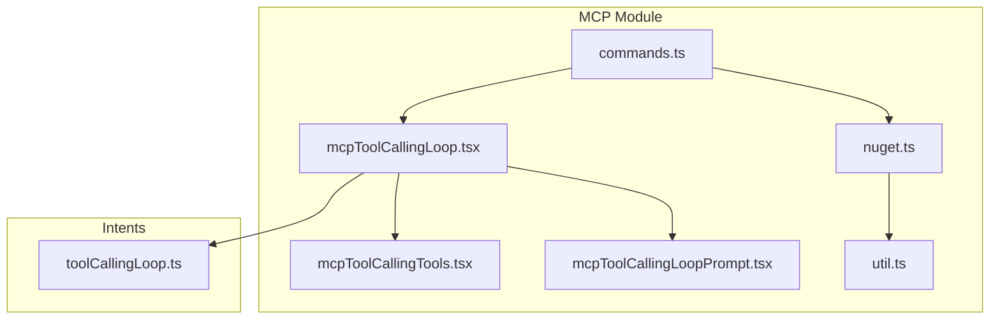
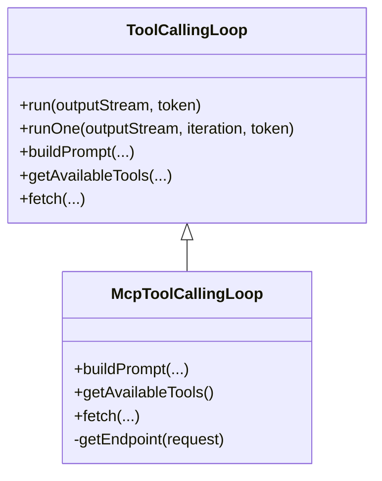
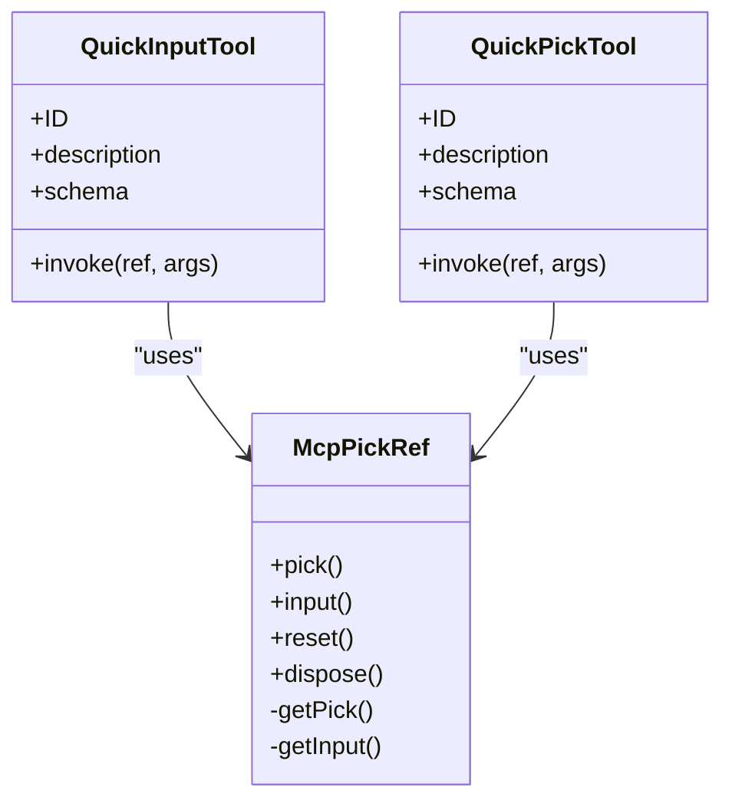
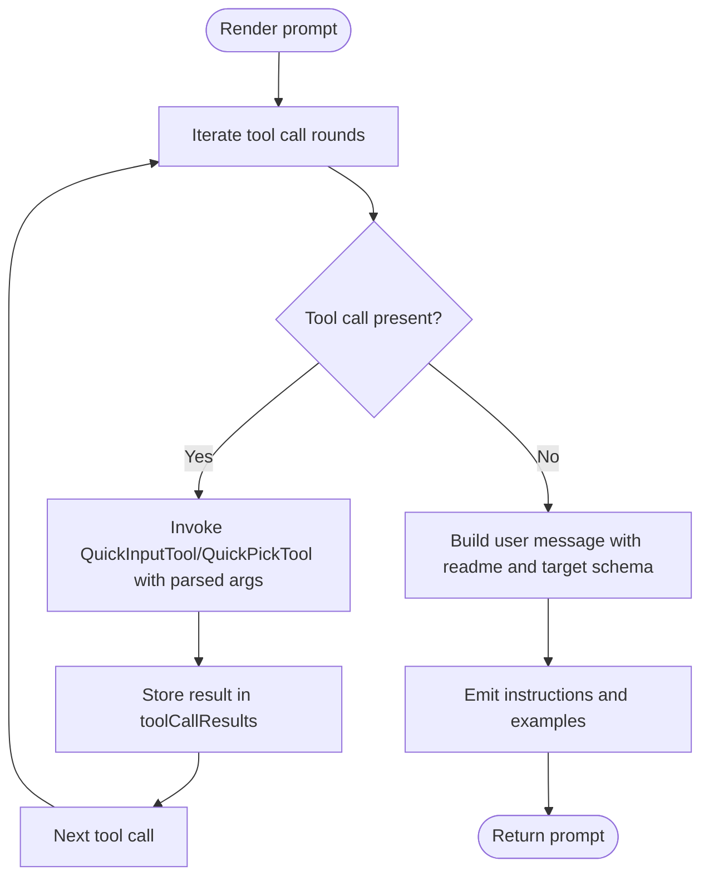
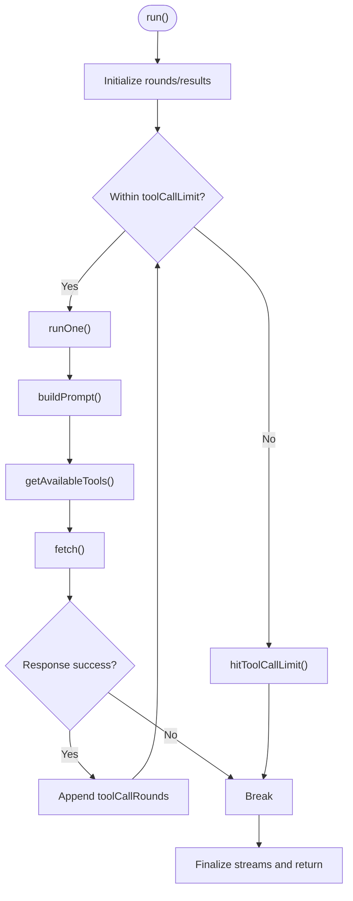
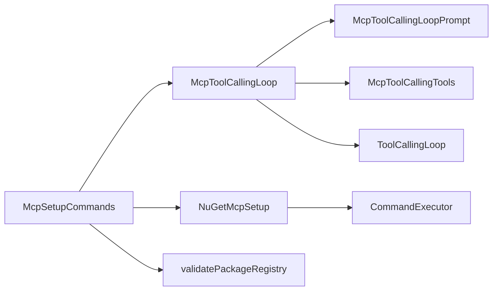

# MCP Tool Calling

<cite>
**Referenced Files in This Document**
- [mcpToolCallingLoop.tsx](file://src/extension/mcp/vscode-node/mcpToolCallingLoop.tsx)
- [mcpToolCallingTools.tsx](file://src/extension/mcp/vscode-node/mcpToolCallingTools.tsx)
- [mcpToolCallingLoopPrompt.tsx](file://src/extension/mcp/vscode-node/mcpToolCallingLoopPrompt.tsx)
- [commands.ts](file://src/extension/mcp/vscode-node/commands.ts)
- [toolCallingLoop.ts](file://src/extension/intents/node/toolCallingLoop.ts)
- [util.ts](file://src/extension/mcp/vscode-node/util.ts)
- [nuget.ts](file://src/extension/mcp/vscode-node/nuget.ts)
- [commands.spec.ts](file://src/extension/mcp/test/vscode-node/commands.spec.ts)
</cite>

## Table of Contents
1. [Introduction](#introduction)
2. [Project Structure](#project-structure)
3. [Core Components](#core-components)
4. [Architecture Overview](#architecture-overview)
5. [Detailed Component Analysis](#detailed-component-analysis)
6. [Dependency Analysis](#dependency-analysis)
7. [Performance Considerations](#performance-considerations)
8. [Troubleshooting Guide](#troubleshooting-guide)
9. [Conclusion](#conclusion)
10. [Appendices](#appendices)

## Introduction
This document explains the MCP Tool Calling subsystem of the vscode-copilot-chat extension. It focuses on the mcpToolCallingLoop component that orchestrates MCP tool calls during agent-assisted MCP server configuration generation, the mcpToolCallingTools that define the available operations (QuickInput and QuickPick), and the VS Code command integration that drives the setup flow. It also covers how tool calls are structured, executed, processed, and how the conversation flow integrates with the tool loop. Configuration options, parameters, and error handling strategies are documented, along with guidance for extending the system with additional MCP operations.

## Project Structure
The MCP Tool Calling subsystem lives primarily under the mcp module in the extension, with orchestration and prompting under the mcp/vscode-node directory, and integration with the broader tool calling framework in the intents module.



**Diagram sources**
- [mcpToolCallingLoop.tsx](file://src/extension/mcp/vscode-node/mcpToolCallingLoop.tsx#L1-L96)
- [mcpToolCallingTools.tsx](file://src/extension/mcp/vscode-node/mcpToolCallingTools.tsx#L1-L229)
- [mcpToolCallingLoopPrompt.tsx](file://src/extension/mcp/vscode-node/mcpToolCallingLoopPrompt.tsx#L1-L230)
- [commands.ts](file://src/extension/mcp/vscode-node/commands.ts#L1-L382)
- [toolCallingLoop.ts](file://src/extension/intents/node/toolCallingLoop.ts#L1-L685)
- [util.ts](file://src/extension/mcp/vscode-node/util.ts#L1-L123)
- [nuget.ts](file://src/extension/mcp/vscode-node/nuget.ts#L1-L800)

**Section sources**
- [mcpToolCallingLoop.tsx](file://src/extension/mcp/vscode-node/mcpToolCallingLoop.tsx#L1-L96)
- [mcpToolCallingTools.tsx](file://src/extension/mcp/vscode-node/mcpToolCallingTools.tsx#L1-L229)
- [mcpToolCallingLoopPrompt.tsx](file://src/extension/mcp/vscode-node/mcpToolCallingLoopPrompt.tsx#L1-L230)
- [commands.ts](file://src/extension/mcp/vscode-node/commands.ts#L1-L382)
- [toolCallingLoop.ts](file://src/extension/intents/node/toolCallingLoop.ts#L1-L685)
- [util.ts](file://src/extension/mcp/vscode-node/util.ts#L1-L123)
- [nuget.ts](file://src/extension/mcp/vscode-node/nuget.ts#L1-L800)

## Core Components
- McpToolCallingLoop: A specialized tool calling loop that builds prompts, exposes QuickInput and QuickPick tools, and executes model requests with tool-call support.
- McpToolCallingTools: Defines QuickInputTool and QuickPickTool with JSON schemas and invoke handlers that surface VS Code QuickPick/Input UIs and return LanguageModelToolResult.
- McpToolCallingLoopPrompt: Renders the agent prompt that instructs the model to use the MCP tools to collect configuration inputs and produce a JSON configuration.
- McpSetupCommands: Orchestrates the MCP server setup flow, validates packages across registries, and runs the tool calling loop to generate a configuration.
- ToolCallingLoop: Base loop that manages prompt building, tool availability, streaming responses, tool execution, and iteration limits.
- CommandExecutor and NuGetMcpSetup: Provide process execution and NuGet metadata/manifest retrieval used by the setup flow.

**Section sources**
- [mcpToolCallingLoop.tsx](file://src/extension/mcp/vscode-node/mcpToolCallingLoop.tsx#L22-L95)
- [mcpToolCallingTools.tsx](file://src/extension/mcp/vscode-node/mcpToolCallingTools.tsx#L90-L229)
- [mcpToolCallingLoopPrompt.tsx](file://src/extension/mcp/vscode-node/mcpToolCallingLoopPrompt.tsx#L1-L230)
- [commands.ts](file://src/extension/mcp/vscode-node/commands.ts#L108-L382)
- [toolCallingLoop.ts](file://src/extension/intents/node/toolCallingLoop.ts#L93-L685)
- [util.ts](file://src/extension/mcp/vscode-node/util.ts#L1-L123)
- [nuget.ts](file://src/extension/mcp/vscode-node/nuget.ts#L1-L800)

## Architecture Overview
The MCP Tool Calling subsystem integrates the tool calling loop with VS Code UI prompts to collect configuration inputs and produce a structured MCP server configuration. The setup flow validates package metadata, optionally retrieves a server manifest, and then runs the tool calling loop to gather inputs and produce a JSON configuration.

```mermaid
sequenceDiagram
participant User as "User"
participant Cmd as "McpSetupCommands"
participant Loop as "McpToolCallingLoop"
participant Prompt as "McpToolCallingLoopPrompt"
participant Tools as "QuickInputTool/QuickPickTool"
participant Base as "ToolCallingLoop"
participant Endpoint as "Chat Endpoint"
User->>Cmd : "Validate package and generate MCP config"
Cmd->>Cmd : "validatePackageRegistry()"
alt "Package has server manifest"
Cmd->>Cmd : "getMcpServer(consent)"
Cmd-->>User : "Mapped server config"
else "No manifest"
Cmd->>Loop : "createInstance(...props)"
Loop->>Prompt : "render(promptContext)"
Prompt->>Tools : "invoke(...) for each tool call"
Tools-->>Prompt : "LanguageModelToolResult"
Prompt-->>Loop : "toolCallResults"
Loop->>Base : "runOne()/run()"
Base->>Endpoint : "makeChatRequest2(...)"
Endpoint-->>Base : "streamed response with toolCalls"
Base-->>Loop : "round/toolCallResults"
Loop-->>Cmd : "success/failure"
Cmd->>User : "Assisted server configuration"
end
```

**Diagram sources**
- [commands.ts](file://src/extension/mcp/vscode-node/commands.ts#L108-L382)
- [mcpToolCallingLoop.tsx](file://src/extension/mcp/vscode-node/mcpToolCallingLoop.tsx#L22-L95)
- [mcpToolCallingLoopPrompt.tsx](file://src/extension/mcp/vscode-node/mcpToolCallingLoopPrompt.tsx#L1-L230)
- [mcpToolCallingTools.tsx](file://src/extension/mcp/vscode-node/mcpToolCallingTools.tsx#L90-L229)
- [toolCallingLoop.ts](file://src/extension/intents/node/toolCallingLoop.ts#L121-L685)

## Detailed Component Analysis

### McpToolCallingLoop
- Purpose: Specialized loop for MCP server configuration generation. It ensures the model has access to QuickInput and QuickPick tools only within the scoped prompt, enforces temperature and location, and selects an endpoint that supports tool calls.
- Key behaviors:
  - Endpoint selection: Falls back to a model that supports tool calls if the preferred endpoint does not.
  - Prompt building: Uses McpToolCallingLoopPrompt with props containing target schema, package metadata, and a McpPickRef for UI.
  - Tool availability: Limits tools to QuickInputTool and QuickPickTool for the first few turns; after a threshold, forces a response.
  - Fetch: Calls the endpoint with a fixed temperature and Agent location.



**Diagram sources**
- [toolCallingLoop.ts](file://src/extension/intents/node/toolCallingLoop.ts#L93-L685)
- [mcpToolCallingLoop.tsx](file://src/extension/mcp/vscode-node/mcpToolCallingLoop.tsx#L22-L95)

**Section sources**
- [mcpToolCallingLoop.tsx](file://src/extension/mcp/vscode-node/mcpToolCallingLoop.tsx#L22-L95)
- [toolCallingLoop.ts](file://src/extension/intents/node/toolCallingLoop.ts#L121-L685)

### McpToolCallingTools
- McpPickRef: Manages a shared reference to a single QuickPick or InputBox, resetting state and ensuring consistent UI behavior across tool invocations.
- QuickInputTool:
  - ID and description for tool identification.
  - JSON schema defines required fields (title, id) and optional fields (placeholder, value).
  - invoke handler shows a VS Code InputBox, collects user input, resets UI, and returns a LanguageModelToolResult with a text part summarizing the input.
- QuickPickTool:
  - ID and description for tool identification.
  - JSON schema defines required fields (title, choices) and optional fields (placeholder, canPickMany).
  - invoke handler shows a VS Code QuickPick, collects selections, resets UI, and returns a LanguageModelToolResult with a text part summarizing the selection(s).



**Diagram sources**
- [mcpToolCallingTools.tsx](file://src/extension/mcp/vscode-node/mcpToolCallingTools.tsx#L1-L229)

**Section sources**
- [mcpToolCallingTools.tsx](file://src/extension/mcp/vscode-node/mcpToolCallingTools.tsx#L1-L229)

### McpToolCallingLoopPrompt
- Purpose: Renders the agent prompt that guides the model to use the MCP tools to collect configuration inputs and produce a JSON configuration.
- Key behaviors:
  - Iterates through tool call rounds and invokes QuickInputTool and QuickPickTool synchronously for each tool call in the current round, storing results in toolCallResults.
  - Detects presence of an MCP server manifest in the package readme and adjusts instructions accordingly.
  - Provides package-type-specific preferred commands to run the server locally.
  - Emits instructions and examples tailored to whether the readme contains an MCP configuration example.



**Diagram sources**
- [mcpToolCallingLoopPrompt.tsx](file://src/extension/mcp/vscode-node/mcpToolCallingLoopPrompt.tsx#L1-L230)

**Section sources**
- [mcpToolCallingLoopPrompt.tsx](file://src/extension/mcp/vscode-node/mcpToolCallingLoopPrompt.tsx#L1-L230)

### McpSetupCommands
- Purpose: Orchestrates the MCP server setup flow, including package validation across registries (npm, pip, nuget, docker), optional server manifest retrieval, and running the tool calling loop to generate a configuration.
- Key behaviors:
  - validatePackageRegistry: Validates package existence and metadata across registries and returns either ok with metadata or error with type and message.
  - enqueuePendingSetup: Creates a McpPickRef, optionally fetches a server manifest via getMcpServer, constructs a fake prompt, instantiates McpToolCallingLoop, runs it, extracts JSON from the response, maps picked values to inputs, and returns an assisted or mapped configuration.
  - Command registration: Registers commands for setup flow, validation, and a check endpoint.

```mermaid
sequenceDiagram
participant VS as "VS Code"
participant Cmd as "McpSetupCommands"
participant Reg as "validatePackageRegistry"
participant Loop as "McpToolCallingLoop"
participant Pick as "McpPickRef"
VS->>Cmd : "validatePackageRegistry(args)"
Cmd->>Reg : "validate package"
Reg-->>Cmd : "ok/error"
alt "ok"
Cmd->>Cmd : "enqueuePendingSetup(args, result)"
Cmd->>Pick : "create McpPickRef"
Cmd->>Loop : "createInstance with props"
Loop->>Loop : "run()"
Loop-->>Cmd : "success/failure"
Cmd->>Cmd : "extract JSON, map picks to inputs"
Cmd-->>VS : "Assisted server configuration"
else "error"
Cmd-->>VS : "Error result"
end
```

**Diagram sources**
- [commands.ts](file://src/extension/mcp/vscode-node/commands.ts#L108-L382)
- [mcpToolCallingLoop.tsx](file://src/extension/mcp/vscode-node/mcpToolCallingLoop.tsx#L22-L95)
- [mcpToolCallingTools.tsx](file://src/extension/mcp/vscode-node/mcpToolCallingTools.tsx#L1-L229)

**Section sources**
- [commands.ts](file://src/extension/mcp/vscode-node/commands.ts#L108-L382)
- [commands.spec.ts](file://src/extension/mcp/test/vscode-node/commands.spec.ts#L1-L116)
- [nuget.ts](file://src/extension/mcp/vscode-node/nuget.ts#L1-L800)

### Tool Calling Loop Integration
- The McpToolCallingLoop extends the base ToolCallingLoop to:
  - Build prompts with a specialized renderer.
  - Limit tool availability to QuickInputTool and QuickPickTool for the first few turns.
  - Enforce a deterministic temperature and location for the request.
- The base ToolCallingLoop manages:
  - Prompt context creation, token counting, and tool message validation.
  - Streaming response processing and early stop logic.
  - Tool call iteration, round accumulation, and result logging.



**Diagram sources**
- [toolCallingLoop.ts](file://src/extension/intents/node/toolCallingLoop.ts#L171-L685)
- [mcpToolCallingLoop.tsx](file://src/extension/mcp/vscode-node/mcpToolCallingLoop.tsx#L22-L95)

**Section sources**
- [toolCallingLoop.ts](file://src/extension/intents/node/toolCallingLoop.ts#L171-L685)
- [mcpToolCallingLoop.tsx](file://src/extension/mcp/vscode-node/mcpToolCallingLoop.tsx#L22-L95)

## Dependency Analysis
- McpToolCallingLoop depends on:
  - McpToolCallingLoopPrompt for rendering.
  - McpToolCallingTools for tool definitions and invoke handlers.
  - ToolCallingLoop for orchestration and streaming.
  - Endpoint provider for model selection and request execution.
- McpSetupCommands depends on:
  - McpToolCallingLoop for configuration generation.
  - NuGetMcpSetup for .NET package metadata and server manifest retrieval.
  - CommandExecutor for process execution.
  - validatePackageRegistry for cross-registry package validation.



**Diagram sources**
- [mcpToolCallingLoop.tsx](file://src/extension/mcp/vscode-node/mcpToolCallingLoop.tsx#L22-L95)
- [mcpToolCallingLoopPrompt.tsx](file://src/extension/mcp/vscode-node/mcpToolCallingLoopPrompt.tsx#L1-L230)
- [mcpToolCallingTools.tsx](file://src/extension/mcp/vscode-node/mcpToolCallingTools.tsx#L1-L229)
- [toolCallingLoop.ts](file://src/extension/intents/node/toolCallingLoop.ts#L1-L685)
- [commands.ts](file://src/extension/mcp/vscode-node/commands.ts#L108-L382)
- [nuget.ts](file://src/extension/mcp/vscode-node/nuget.ts#L1-L800)
- [util.ts](file://src/extension/mcp/vscode-node/util.ts#L1-L123)

**Section sources**
- [mcpToolCallingLoop.tsx](file://src/extension/mcp/vscode-node/mcpToolCallingLoop.tsx#L22-L95)
- [mcpToolCallingTools.tsx](file://src/extension/mcp/vscode-node/mcpToolCallingTools.tsx#L1-L229)
- [mcpToolCallingLoopPrompt.tsx](file://src/extension/mcp/vscode-node/mcpToolCallingLoopPrompt.tsx#L1-L230)
- [commands.ts](file://src/extension/mcp/vscode-node/commands.ts#L108-L382)
- [toolCallingLoop.ts](file://src/extension/intents/node/toolCallingLoop.ts#L1-L685)
- [util.ts](file://src/extension/mcp/vscode-node/util.ts#L1-L123)
- [nuget.ts](file://src/extension/mcp/vscode-node/nuget.ts#L1-L800)

## Performance Considerations
- Tool call limit: The loop enforces a configurable limit and can confirm continuation or stop early, preventing runaway iterations.
- Streaming and early stop: The base loop supports early termination of long-running requests when the response processor finishes processing.
- Endpoint selection: The loop prefers an endpoint that supports tool calls; if unavailable, it falls back to a compatible model to reduce retries.
- UI responsiveness: McpPickRef defers UI creation until the first tool call, minimizing startup latency.

[No sources needed since this section provides general guidance]

## Troubleshooting Guide
Common issues and resolutions:
- Tool execution failures:
  - QuickInputTool/QuickPickTool return CancellationError when the user dismisses the input. The loop treats this as a cancellation and stops further tool calls in the current round.
  - NuGet package validation failures: If the .NET CLI is not installed or the version is too low, the setup flow returns an error with guidance to install/update the SDK.
- Timeout handling:
  - CommandExecutor enforces timeouts and graceful shutdown using SIGTERM/SIGKILL. Failures with non-zero exit codes are surfaced with stdout/stderr context.
- Response parsing errors:
  - The setup flow extracts code blocks from the model response and attempts to parse JSON. If parsing fails, the flow returns undefined and displays an error message.
- Tool call limit exceeded:
  - The base loop can prompt the user to continue or stop when the configured limit is reached.

**Section sources**
- [mcpToolCallingTools.tsx](file://src/extension/mcp/vscode-node/mcpToolCallingTools.tsx#L123-L154)
- [mcpToolCallingTools.tsx](file://src/extension/mcp/vscode-node/mcpToolCallingTools.tsx#L196-L227)
- [util.ts](file://src/extension/mcp/vscode-node/util.ts#L41-L122)
- [commands.ts](file://src/extension/mcp/vscode-node/commands.ts#L270-L313)
- [toolCallingLoop.ts](file://src/extension/intents/node/toolCallingLoop.ts#L310-L339)

## Conclusion
The MCP Tool Calling subsystem integrates a specialized tool calling loop with VS Code UI prompts to assist in generating MCP server configurations. McpToolCallingLoop and McpToolCallingTools define a constrained set of tools available only within the scoped prompt, while McpSetupCommands coordinates package validation, optional manifest retrieval, and loop execution. The base ToolCallingLoop provides robust orchestration, streaming, and iteration control. The system includes strong error handling for timeouts, cancellation, and parsing failures, and offers guidance for extending with additional MCP operations.

[No sources needed since this section summarizes without analyzing specific files]

## Appendices

### Configuration Options and Parameters
- McpToolCallingLoop options:
  - toolCallLimit: Maximum number of tool call iterations.
  - conversation: Conversation context for the loop.
  - request: Chat request metadata.
  - props: McpToolCallingLoopPromptContext including target schema, package metadata, and McpPickRef.
- McpToolCallingLoopPrompt props:
  - packageName, packageType, packageVersion, packageReadme, targetSchema, pickRef.
- QuickInputTool schema:
  - Required: title, id.
  - Optional: placeholder, value.
- QuickPickTool schema:
  - Required: title, choices.
  - Optional: placeholder, canPickMany.

**Section sources**
- [mcpToolCallingLoop.tsx](file://src/extension/mcp/vscode-node/mcpToolCallingLoop.tsx#L22-L95)
- [mcpToolCallingLoopPrompt.tsx](file://src/extension/mcp/vscode-node/mcpToolCallingLoopPrompt.tsx#L16-L33)
- [mcpToolCallingTools.tsx](file://src/extension/mcp/vscode-node/mcpToolCallingTools.tsx#L90-L229)

### Extending the Tool System
- Add a new tool:
  - Define a new tool class with ID, description, schema, and invoke handler.
  - Register the tool in getAvailableTools of McpToolCallingLoop or another loop variant.
  - Ensure the prompt context passes a McpPickRef if the tool surfaces UI.
- Integrate with setup flow:
  - Extend validatePackageRegistry to support new package types.
  - Optionally implement getMcpServer for manifests or server.json retrieval.
  - Use CommandExecutor for process execution with timeouts and cancellation.

**Section sources**
- [mcpToolCallingLoop.tsx](file://src/extension/mcp/vscode-node/mcpToolCallingLoop.tsx#L63-L81)
- [mcpToolCallingTools.tsx](file://src/extension/mcp/vscode-node/mcpToolCallingTools.tsx#L90-L229)
- [commands.ts](file://src/extension/mcp/vscode-node/commands.ts#L322-L381)
- [util.ts](file://src/extension/mcp/vscode-node/util.ts#L1-L123)