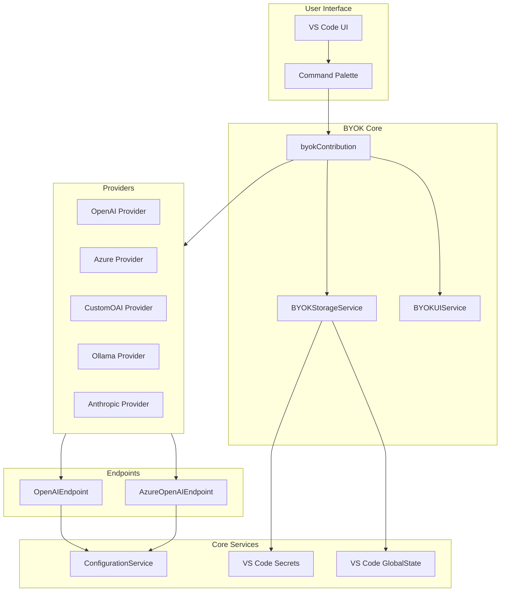
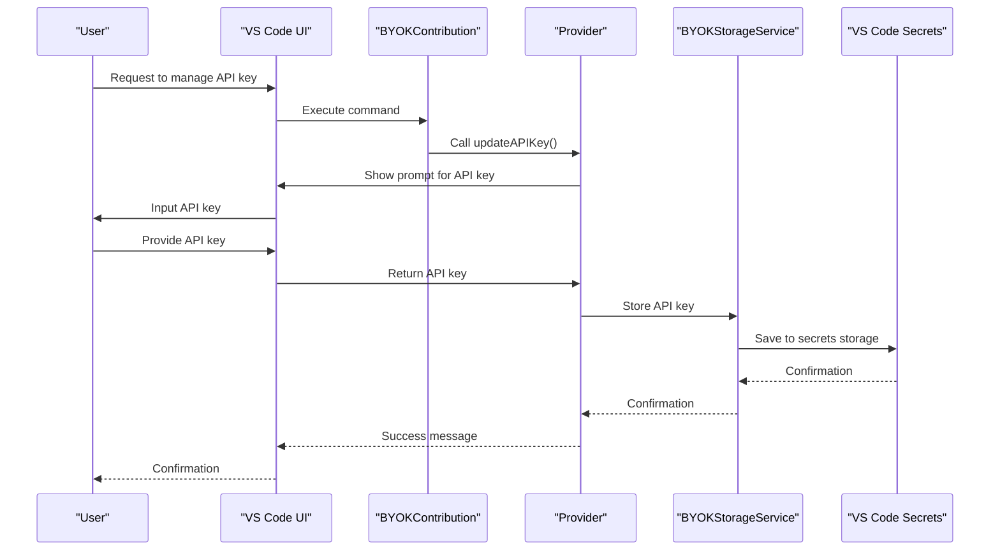
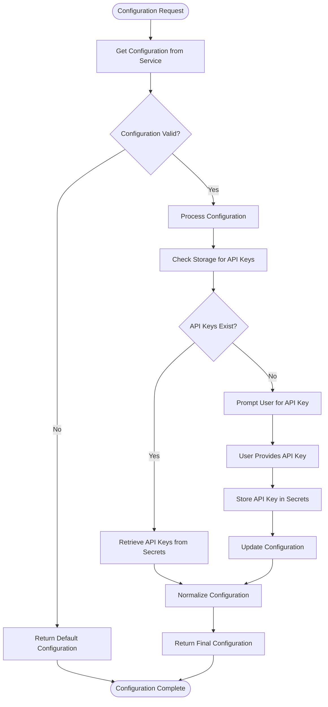
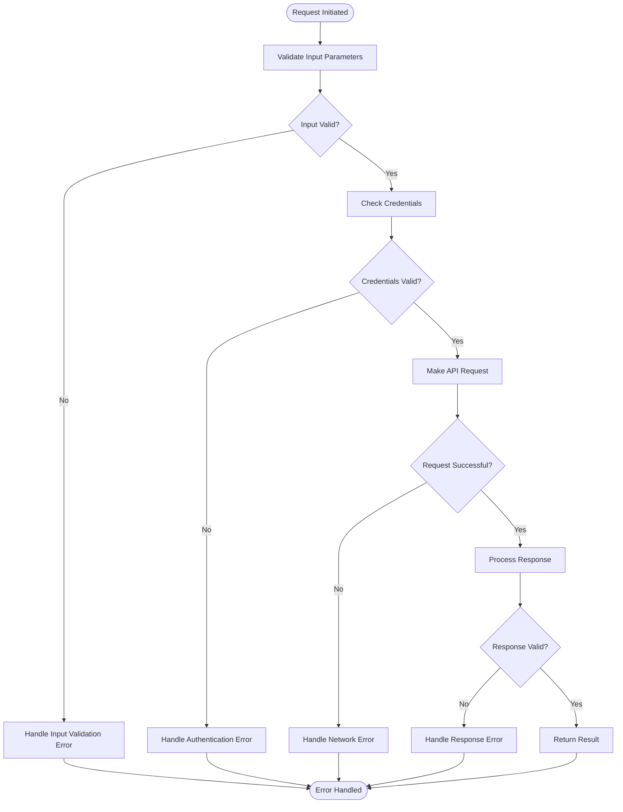
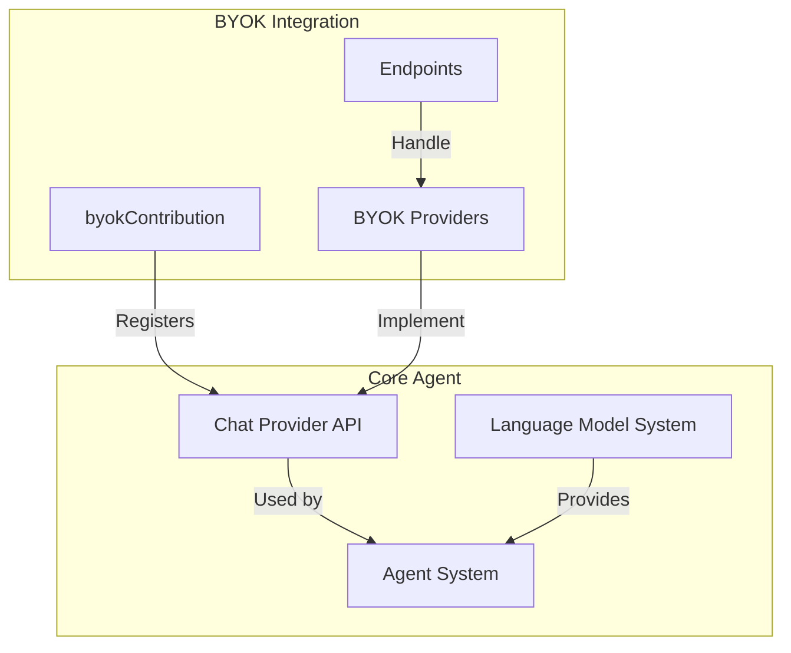

# BYOK Integration

<cite>
**Referenced Files in This Document**   
- [byokContribution.ts](file://src/extension/byok/vscode-node/byokContribution.ts)
- [openAIEndpoint.ts](file://src/extension/byok/node/openAIEndpoint.ts)
- [azureOpenAIEndpoint.ts](file://src/extension/byok/node/azureOpenAIEndpoint.ts)
- [customOAIProvider.ts](file://src/extension/byok/vscode-node/customOAIProvider.ts)
- [byokStorageService.ts](file://src/extension/byok/vscode-node/byokStorageService.ts)
- [byokProvider.ts](file://src/extension/byok/common/byokProvider.ts)
- [baseOpenAICompatibleProvider.ts](file://src/extension/byok/vscode-node/baseOpenAICompatibleProvider.ts)
- [azureProvider.ts](file://src/extension/byok/vscode-node/azureProvider.ts)
</cite>

## Table of Contents
1. [Introduction](#introduction)
2. [BYOK Architecture Overview](#byok-architecture-overview)
3. [Core Components](#core-components)
4. [Authentication and Credential Management](#authentication-and-credential-management)
5. [Provider Implementation Details](#provider-implementation-details)
6. [Configuration and Storage](#configuration-and-storage)
7. [Error Handling and Validation](#error-handling-and-validation)
8. [Integration with Core Agent Architecture](#integration-with-core-agent-architecture)
9. [Troubleshooting Guide](#troubleshooting-guide)

## Introduction

The Bring Your Own Key (BYOK) Integration feature in the vscode-copilot-chat extension enables users to configure their own AI service credentials for various providers, allowing them to leverage their existing AI service subscriptions within the VS Code environment. This comprehensive integration supports multiple AI service providers including OpenAI, Azure OpenAI, and any OpenAI-compatible API endpoint through the customOAIProvider.

The BYOK system is designed to provide a secure and flexible way for users to connect to their preferred AI services while maintaining compatibility with the core Copilot functionality. The implementation follows a modular architecture that separates concerns between configuration management, authentication, endpoint communication, and provider-specific logic.

This documentation provides a detailed analysis of the BYOK integration, covering the implementation of key components such as the byokContribution, openAIEndpoint and azureOpenAIEndpoint classes, and the customOAIProvider that enables connections to any OpenAI-compatible API endpoint. It also explains how user credentials are securely stored and retrieved, how API requests are formatted for different services, and how responses are normalized across providers.

**Section sources**
- [byokContribution.ts](file://src/extension/byok/vscode-node/byokContribution.ts#L1-L118)

## BYOK Architecture Overview

The BYOK integration follows a layered architecture that separates the concerns of configuration, authentication, endpoint communication, and provider management. The system is designed to be extensible, allowing for the addition of new providers while maintaining a consistent interface for the core Copilot functionality.



**Diagram sources**
- [byokContribution.ts](file://src/extension/byok/vscode-node/byokContribution.ts#L28-L118)
- [byokStorageService.ts](file://src/extension/byok/vscode-node/byokStorageService.ts#L58-L159)

## Core Components

The BYOK integration consists of several core components that work together to enable users to configure and use their own AI service credentials. The primary entry point is the byokContribution class, which implements the IExtensionContribution interface and is responsible for initializing the BYOK system when the extension is activated.

The byokContribution class registers commands for managing BYOK configurations and handles authentication changes. It creates instances of various provider classes and registers them with the language model system. The contribution is responsible for determining whether BYOK is enabled based on the user's Copilot token and GitHub environment.

The OpenAIEndpoint class serves as the base implementation for communicating with OpenAI-compatible services. It handles the creation of request bodies, interception of requests, and normalization of responses. The class includes comprehensive header sanitization to prevent security vulnerabilities and ensure compliance with HTTP standards.

**Section sources**
- [byokContribution.ts](file://src/extension/byok/vscode-node/byokContribution.ts#L28-L118)
- [openAIEndpoint.ts](file://src/extension/byok/node/openAIEndpoint.ts#L58-L343)

## Authentication and Credential Management

The BYOK system implements a robust authentication and credential management system that securely stores and retrieves user API keys. The system supports different authentication types through the BYOKAuthType enum, which includes GlobalApiKey, PerModelDeployment, and None.

The BYOKStorageService class is responsible for securely storing API keys and model configurations. It uses VS Code's secrets storage for API keys and global state for model configurations. The service provides methods for getting, storing, and deleting API keys based on the provider's authentication type.



**Diagram sources**
- [byokStorageService.ts](file://src/extension/byok/vscode-node/byokStorageService.ts#L58-L159)
- [byokProvider.ts](file://src/extension/byok/common/byokProvider.ts#L13-L26)

## Provider Implementation Details

The BYOK system supports multiple providers through a common interface defined by the BYOKModelProvider interface. Each provider implements this interface to provide language model chat information, handle chat responses, and manage token counting.

The OpenAIProvider and AzureProvider classes extend the base functionality to support their respective services. The AzureProvider supports both API key authentication and Entra ID authentication, providing flexibility for enterprise users. The CustomOAIProvider allows users to connect to any OpenAI-compatible API endpoint with custom configuration.

```mermaid
classDiagram
class BYOKModelProvider {
<<interface>>
+authType : BYOKAuthType
+updateAPIKey() : Promise~void~
+updateAPIKeyViaCmd(envVarName : string, action : 'update' | 'remove', modelId? : string) : Promise~void~
+provideLanguageModelChatInformation(options : { silent : boolean }, token : CancellationToken) : Promise~T[]
+provideLanguageModelChatResponse(model : T, messages : LanguageModelChatMessage | LanguageModelChatMessage2[], options : ProvideLanguageModelChatResponseOptions, progress : Progress~LanguageModelResponsePart2~, token : CancellationToken) : Promise~void~
+provideTokenCount(model : T, text : string | LanguageModelChatMessage | LanguageModelChatMessage2, token : CancellationToken) : Promise~number~
}
class CustomOAIBYOKModelProvider {
-_byokStorageService : IBYOKStorageService
-_configurationService : IConfigurationService
-_logService : ILogService
-_instantiationService : IInstantiationService
-_experimentationService : IExperimentationService
-_lmWrapper : CopilotLanguageModelWrapper
+authType : BYOKAuthType
+providerName : string
+updateAPIKey() : Promise~void~
+updateAPIKeyViaCmd(envVarName : string, action : 'update' | 'remove', modelId? : string) : Promise~void~
+provideLanguageModelChatInformation(options : { silent : boolean }, token : CancellationToken) : Promise~CustomOAIModelInfo[]
+provideLanguageModelChatResponse(model : CustomOAIModelInfo, messages : LanguageModelChatMessage | LanguageModelChatMessage2[], options : ProvideLanguageModelChatResponseOptions, progress : Progress~LanguageModelResponsePart2~, token : CancellationToken) : Promise~void~
+provideTokenCount(model : CustomOAIModelInfo, text : string | LanguageModelChatMessage | LanguageModelChatMessage2, token : CancellationToken) : Promise~number~
}
class AzureBYOKModelProvider {
+providerName : string
+updateAPIKey() : Promise~void~
+updateAPIKeyViaCmd(envVarName : string, action : 'update' | 'remove', modelId? : string) : Promise~void~
+provideLanguageModelChatResponse(model : CustomOAIModelInfo, messages : LanguageModelChatMessage | LanguageModelChatMessage2[], options : ProvideLanguageModelChatResponseOptions, progress : Progress~LanguageModelResponsePart2~, token : CancellationToken) : Promise~void~
}
BYOKModelProvider <|-- CustomOAIBYOKModelProvider
CustomOAIBYOKModelProvider <|-- AzureBYOKModelProvider
CustomOAIBYOKModelProvider --> BYOKStorageService
CustomOAIBYOKModelProvider --> ConfigurationService
CustomOAIBYOKModelProvider --> LogService
CustomOAIBYOKModelProvider --> InstantiationService
CustomOAIBYOKModelProvider --> ExperimentationService
CustomOAIBYOKModelProvider --> CopilotLanguageModelWrapper
```

**Diagram sources**
- [customOAIProvider.ts](file://src/extension/byok/vscode-node/customOAIProvider.ts#L54-L314)
- [azureProvider.ts](file://src/extension/byok/vscode-node/azureProvider.ts#L45-L156)
- [byokProvider.ts](file://src/extension/byok/common/byokProvider.ts#L72-L85)

## Configuration and Storage

The BYOK system uses a comprehensive configuration and storage mechanism to manage user settings and credentials. Configuration is managed through the IConfigurationService, which provides access to user settings defined in VS Code's configuration system.

The system supports several configuration keys for different providers:
- ConfigKey.CustomOAIModels: Configuration for custom OpenAI-compatible models
- ConfigKey.AzureModels: Configuration for Azure OpenAI models
- ConfigKey.OllamaEndpoint: Configuration for Ollama endpoint

Model configurations are stored in VS Code's global state using the key format `copilot-byok-{providerName}-models-config`. This allows the system to persist model configurations across sessions. API keys are stored in VS Code's secrets storage using the key format `copilot-byok-{providerName}-{modelId}-api-key` for per-model authentication or `copilot-byok-{providerName}-api-key` for global authentication.

The BYOKStorageService class provides a unified interface for accessing both configuration and storage, abstracting the underlying implementation details. It handles the complexities of different authentication types and ensures that credentials are stored securely.



**Diagram sources**
- [byokStorageService.ts](file://src/extension/byok/vscode-node/byokStorageService.ts#L58-L159)
- [customOAIProvider.ts](file://src/extension/byok/vscode-node/customOAIProvider.ts#L90-L106)

## Error Handling and Validation

The BYOK system implements comprehensive error handling and validation to ensure robust operation and provide meaningful feedback to users. The system includes validation at multiple levels, from input validation to network error handling.

The OpenAIEndpoint class includes extensive header sanitization to prevent security vulnerabilities. It validates header names and values against RFC 7230 standards and blocks reserved headers that could interfere with request processing. The system also validates API keys and endpoint URLs to ensure they meet security requirements.

When errors occur, the system provides detailed error messages that help users diagnose and resolve issues. Network errors, authentication failures, and configuration errors are all handled appropriately, with specific error messages for each type of issue.



**Diagram sources**
- [openAIEndpoint.ts](file://src/extension/byok/node/openAIEndpoint.ts#L149-L243)
- [byokProvider.ts](file://src/extension/byok/common/byokProvider.ts#L163-L183)

## Integration with Core Agent Architecture

The BYOK integration is tightly coupled with the core agent architecture of the vscode-copilot-chat extension. The system integrates with the language model system through the lm.registerLanguageModelChatProvider API, allowing BYOK providers to participate in the same ecosystem as the default Copilot providers.

The integration follows the extension contribution model, where the byokContribution class is automatically instantiated when the extension is activated. The contribution registers commands and listens for authentication changes, ensuring that BYOK providers are only registered when the user has appropriate permissions.

The system uses the CopilotLanguageModelWrapper to normalize responses from different providers, ensuring a consistent interface for the rest of the extension. This wrapper handles the differences in response formats between providers and provides a unified interface for token counting and chat responses.



**Diagram sources**
- [byokContribution.ts](file://src/extension/byok/vscode-node/byokContribution.ts#L99-L101)
- [customOAIProvider.ts](file://src/extension/byok/vscode-node/customOAIProvider.ts#L208-L209)

## Troubleshooting Guide

This section addresses common issues users may encounter when configuring and using the BYOK integration.

### Credential Validation Issues
If users encounter credential validation issues, they should verify that:
1. The API key is correct and has not expired
2. The endpoint URL is correct and accessible
3. The provider's authentication type matches the configuration
4. Network connectivity to the endpoint is available

Users can use the "github.copilot.chat.manageBYOKAPIKey" command to update or remove API keys through the command palette.

### Network Connectivity Problems
Network connectivity issues can occur due to:
- Firewall restrictions blocking access to the endpoint
- Proxy configuration issues
- DNS resolution problems

Users should verify their network configuration and ensure that the endpoint URL is accessible from their environment.

### Compatibility with OpenAI API Versions
The BYOK system is designed to be compatible with various OpenAI API versions and extensions. However, some endpoints may require specific configuration:
- Custom headers may need to be configured for certain endpoints
- Different API versions may require different URL paths
- Some endpoints may not support all features (tool calling, vision, etc.)

Users should consult their provider's documentation for specific requirements and configure the customOAIProvider accordingly.

**Section sources**
- [byokContribution.ts](file://src/extension/byok/vscode-node/byokContribution.ts#L44-L74)
- [byokStorageService.ts](file://src/extension/byok/vscode-node/byokStorageService.ts#L65-L77)
- [customOAIProvider.ts](file://src/extension/byok/vscode-node/customOAIProvider.ts#L237-L297)