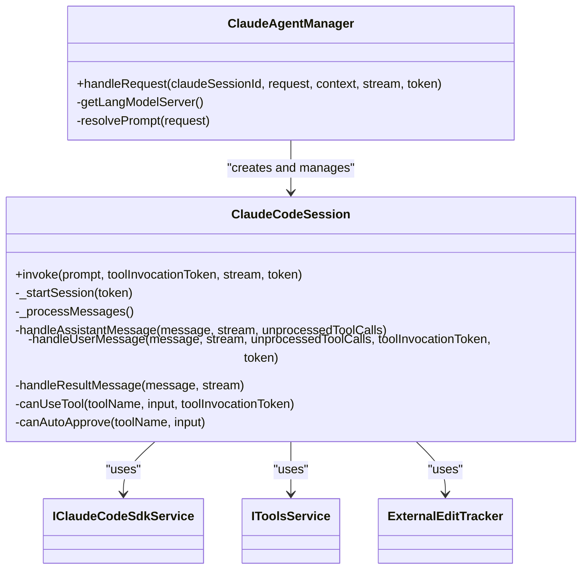
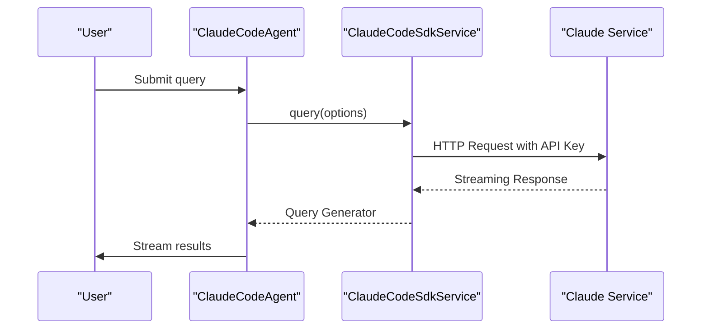
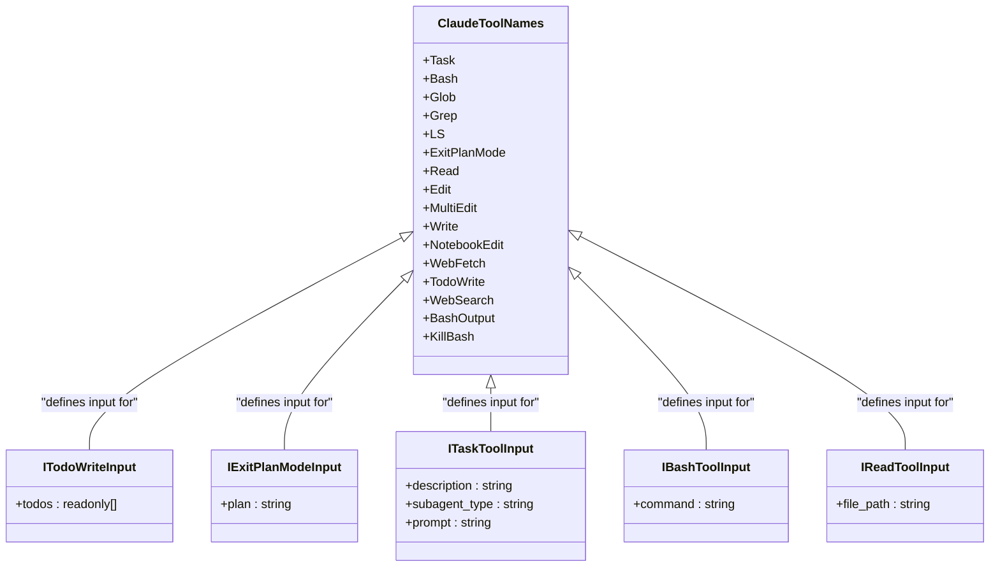
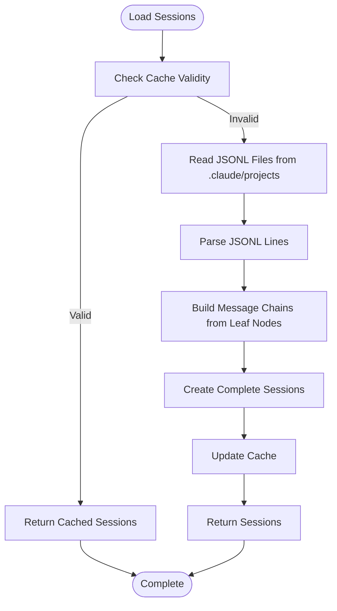
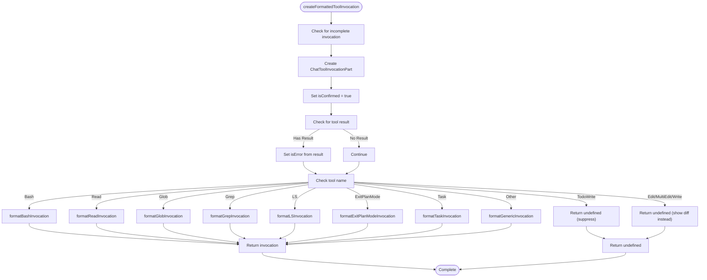
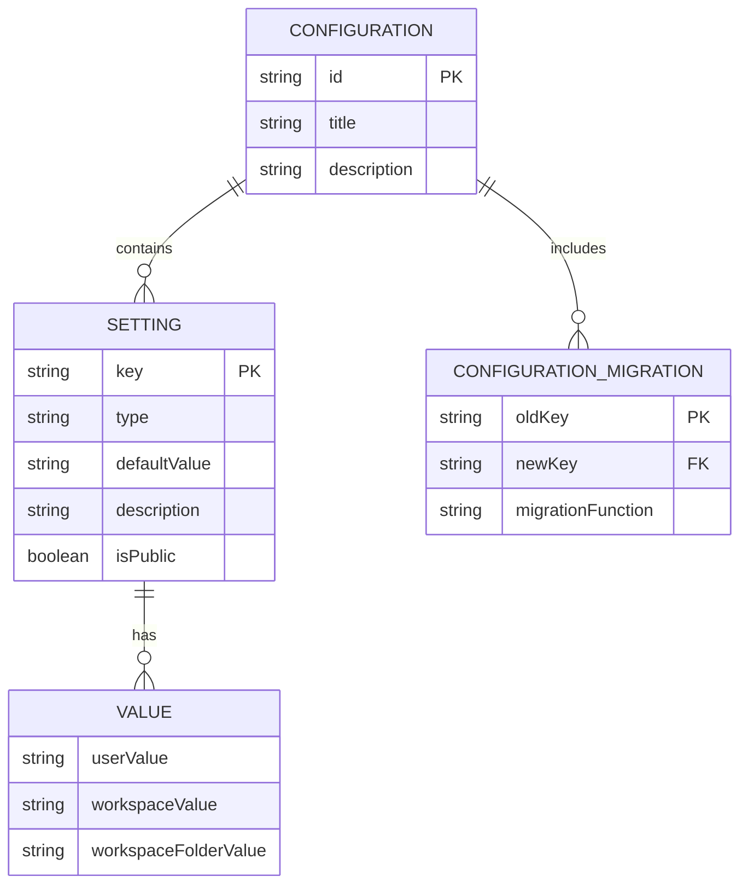
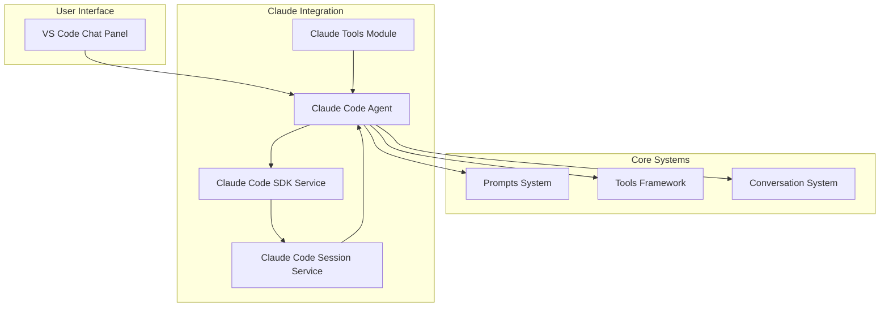

# Claude Integration

<cite>
**Referenced Files in This Document**   
- [claudeCodeAgent.ts](file://src/extension/agents/claude/node/claudeCodeAgent.ts)
- [claudeCodeSdkService.ts](file://src/extension/agents/claude/node/claudeCodeSdkService.ts)
- [claudeTools.ts](file://src/extension/agents/claude/common/claudeTools.ts)
- [claudeCodeSessionService.ts](file://src/extension/agents/claude/node/claudeCodeSessionService.ts)
- [toolInvocationFormatter.ts](file://src/extension/agents/claude/common/toolInvocationFormatter.ts)
- [configurationService.ts](file://src/platform/configuration/common/configurationService.ts)
- [package.json](file://package.json)
</cite>

## Table of Contents
1. [Introduction](#introduction)
2. [Core Components](#core-components)
3. [Claude Code Agent](#claude-code-agent)
4. [Claude Code SDK Service](#claude-code-sdk-service)
5. [Claude Tools Module](#claude-tools-module)
6. [Claude Code Session Service](#claude-code-session-service)
7. [Tool Invocation Formatter](#tool-invocation-formatter)
8. [Configuration and Settings](#configuration-and-settings)
9. [Integration with Core Systems](#integration-with-core-systems)
10. [Error Handling and Common Issues](#error-handling-and-common-issues)

## Introduction
The Claude Integration feature in the vscode-copilot-chat extension provides a sophisticated interface for interacting with Anthropic's Claude AI service. This integration enables developers to leverage Claude's advanced language model capabilities directly within the VS Code environment for code generation, analysis, and modification tasks. The system is built around several core components that work together to manage communication with the Claude service, handle authentication, process streaming responses, and maintain conversation state across multiple interactions. The integration is designed to be seamless, allowing users to engage with Claude through natural language queries while the underlying system handles the complexities of API communication, tool execution, and context preservation.

## Core Components
The Claude integration architecture consists of several key components that work together to provide a robust interface between VS Code and the Anthropic Claude service. The primary components include the claudeCodeAgent class which serves as the main entry point for handling user requests, the claudeCodeSdkService that manages API communication with the Claude service, the claudeTools module that defines the available tool functions Claude can invoke, and the claudeCodeSessionService that manages conversation state and context preservation. These components are designed to work in concert, with the claudeCodeAgent coordinating the overall flow of requests and responses, while the other components handle specialized tasks such as API communication, tool management, and session persistence. The architecture follows a modular design pattern, allowing for clear separation of concerns and easier maintenance and extension of functionality.

**Section sources**
- [claudeCodeAgent.ts](file://src/extension/agents/claude/node/claudeCodeAgent.ts#L30-L87)
- [claudeCodeSdkService.ts](file://src/extension/agents/claude/node/claudeCodeSdkService.ts#L9-L21)
- [claudeTools.ts](file://src/extension/agents/claude/common/claudeTools.ts#L9-L26)
- [claudeCodeSessionService.ts](file://src/extension/agents/claude/node/claudeCodeSessionService.ts#L49-L53)

## Claude Code Agent
The claudeCodeAgent class serves as the primary interface for handling user interactions with the Claude AI service. This class, implemented as the ClaudeAgentManager and ClaudeCodeSession, manages the complete lifecycle of Claude interactions, from receiving user requests to delivering responses. The agent handles request queuing, session management, and coordination between various components of the integration. When a user submits a request, the agent first checks if an existing session should be reused or if a new session needs to be created. It then processes the user's prompt, potentially modifying it to include relevant context from referenced files. The agent manages a queue of requests, ensuring they are processed in order while handling cancellation and error conditions appropriately. It also implements sophisticated state management, preserving conversation context across multiple interactions and maintaining the flow of the dialogue with the AI.

**Diagram sources**
- [claudeCodeAgent.ts](file://src/extension/agents/claude/node/claudeCodeAgent.ts#L31-L87)
- [claudeCodeAgent.ts](file://src/extension/agents/claude/node/claudeCodeAgent.ts#L150-L592)

**Section sources**
- [claudeCodeAgent.ts](file://src/extension/agents/claude/node/claudeCodeAgent.ts#L30-L87)
- [claudeCodeAgent.ts](file://src/extension/agents/claude/node/claudeCodeAgent.ts#L150-L592)

## Claude Code SDK Service
The claudeCodeSdkService component is responsible for managing the communication between the VS Code extension and the Anthropic Claude service. This service acts as a wrapper around the Claude Code SDK, providing a clean interface for making API requests while handling authentication, configuration, and error management. The service is defined by the IClaudeCodeSdkService interface, which specifies a single method for creating a query generator that can stream responses from the Claude service. The implementation, ClaudeCodeSdkService, uses dependency injection to integrate seamlessly with the rest of the extension's architecture. When a query is initiated, the service establishes a connection to the Claude service using the configured API endpoint and authentication credentials, then streams the response back to the calling component. This abstraction allows the rest of the system to interact with the Claude service without needing to understand the underlying API details.

**Diagram sources**
- [claudeCodeSdkService.ts](file://src/extension/agents/claude/node/claudeCodeSdkService.ts#L9-L38)
- [claudeCodeAgent.ts](file://src/extension/agents/claude/node/claudeCodeAgent.ts#L281-L284)

**Section sources**
- [claudeCodeSdkService.ts](file://src/extension/agents/claude/node/claudeCodeSdkService.ts#L9-L38)

## Claude Tools Module
The claudeTools module defines the set of tool functions that Claude can invoke during conversations with users. These tools extend Claude's capabilities beyond simple text generation, allowing it to interact with the user's codebase, file system, and development environment. The module exports an enumeration, ClaudeToolNames, which lists all available tools including Bash, Read, Edit, Write, WebFetch, and others. Each tool has a corresponding interface that defines its input parameters, ensuring type safety and clear documentation of expected inputs. The module also includes utility functions like getAffectedUrisForEditTool, which determines which files will be affected by edit operations, enabling proper tracking and management of file changes. These tools are integrated into the conversation flow, allowing Claude to request permission to execute them and providing structured responses that can be properly displayed in the VS Code interface.

**Diagram sources**
- [claudeTools.ts](file://src/extension/agents/claude/common/claudeTools.ts#L9-L92)

**Section sources**
- [claudeTools.ts](file://src/extension/agents/claude/common/claudeTools.ts#L9-L92)

## Claude Code Session Service
The claudeCodeSessionService is responsible for managing and persisting conversation sessions with the Claude AI service. This service implements the IClaudeCodeSessionService interface, providing methods to retrieve all available sessions and specific sessions by identifier. The service loads session data from disk, where conversations are stored in JSONL format in the user's home directory under the .claude/projects folder. It maintains a cache of loaded sessions to improve performance, checking file modification times to determine when cached data is stale and needs to be reloaded. The service parses the JSONL files, reconstructing conversation histories by following parent-child relationships between messages. It also generates session labels based on conversation summaries or the first user message when summaries are not available. This persistence mechanism allows users to resume previous conversations with Claude, maintaining context across VS Code sessions.

**Diagram sources**
- [claudeCodeSessionService.ts](file://src/extension/agents/claude/node/claudeCodeSessionService.ts#L77-L273)

**Section sources**
- [claudeCodeSessionService.ts](file://src/extension/agents/claude/node/claudeCodeSessionService.ts#L49-L53)
- [claudeCodeSessionService.ts](file://src/extension/agents/claude/node/claudeCodeSessionService.ts#L77-L273)

## Tool Invocation Formatter
The tool invocation formatter is responsible for transforming raw tool call data from the Claude service into formatted representations that can be properly displayed in the VS Code interface. The createFormattedToolInvocation function takes a tool use block from Claude and optionally a tool result, then creates a ChatToolInvocationPart object with appropriate formatting. The formatter handles different tool types with specialized formatting functions, such as formatBashInvocation for command-line operations or formatReadInvocation for file reading operations. For certain tools like edit operations, the formatter returns undefined since the changes are displayed as diffs rather than tool invocation messages. The formatter also handles generic tool types with a default message format. This component ensures that tool invocations are presented to users in a clear and consistent manner, enhancing the transparency of Claude's actions during the conversation.

**Diagram sources**
- [toolInvocationFormatter.ts](file://src/extension/agents/claude/common/toolInvocationFormatter.ts#L15-L53)

**Section sources**
- [toolInvocationFormatter.ts](file://src/extension/agents/claude/common/toolInvocationFormatter.ts#L15-L102)

## Configuration and Settings
The Claude integration provides several configuration options that allow users to customize its behavior. These settings are defined in the extension's configuration schema and can be accessed through VS Code's settings interface. Key configuration options include enabling the Claude code agent (chat.advanced.claudeCode.enabled), controlling debug output for the Claude integration (chat.advanced.claudeCode.debug), and specifying the model to use for Claude interactions. The configuration system uses a hierarchical approach with default values, user overrides, and experiment-based configurations. Settings are accessed through the IConfigurationService interface, which provides methods for retrieving configuration values and observing changes. The configuration system also supports migration of settings from old keys to new keys, ensuring backward compatibility as the extension evolves.

**Diagram sources**
- [configurationService.ts](file://src/platform/configuration/common/configurationService.ts#L600-L652)
- [package.json](file://package.json#L2374-L2399)

**Section sources**
- [configurationService.ts](file://src/platform/configuration/common/configurationService.ts#L600-L652)
- [package.json](file://package.json#L2374-L2399)

## Integration with Core Systems
The Claude integration is designed to work seamlessly with the core conversation system and other components of the VS Code extension. It integrates with the prompt system by transforming user queries into Claude-compatible messages, potentially enriching them with context from referenced files. The integration also works with the tool execution framework, allowing Claude to invoke various tools during conversations and handling the responses appropriately. When Claude requests to use a tool, the system presents a confirmation dialog to the user, ensuring that potentially destructive operations like file modifications are approved before execution. The integration also handles streaming responses from Claude, displaying them incrementally in the chat interface to provide a responsive user experience. Conversation state is preserved across multiple interactions, allowing for coherent multi-turn dialogues with the AI.

**Diagram sources**
- [claudeCodeAgent.ts](file://src/extension/agents/claude/node/claudeCodeAgent.ts#L98-L125)
- [claudeCodeAgent.ts](file://src/extension/agents/claude/node/claudeCodeAgent.ts#L510-L538)

**Section sources**
- [claudeCodeAgent.ts](file://src/extension/agents/claude/node/claudeCodeAgent.ts#L98-L125)
- [claudeCodeAgent.ts](file://src/extension/agents/claude/node/claudeCodeAgent.ts#L510-L538)

## Error Handling and Common Issues
The Claude integration includes comprehensive error handling to manage various failure scenarios that may occur during API communication and tool execution. Common issues include API rate limits, authentication failures, and responses that exceed token limits. When an error occurs, the system captures the error details and presents a user-friendly message in the chat interface. For authentication failures, the system may prompt the user to re-authenticate or check their API key configuration. When responses exceed token limits, the system handles this gracefully by truncating or summarizing the content as appropriate. The integration also includes debug settings that can be enabled to provide more detailed logging for troubleshooting purposes. Rate limiting is handled by the underlying Claude service, with the client implementing appropriate retry logic when necessary.

**Section sources**
- [claudeCodeAgent.ts](file://src/extension/agents/claude/node/claudeCodeAgent.ts#L87-L95)
- [claudeCodeSessionService.ts](file://src/extension/agents/claude/node/claudeCodeSessionService.ts#L174-L181)
- [configurationService.ts](file://src/platform/configuration/common/configurationService.ts#L644-L650)