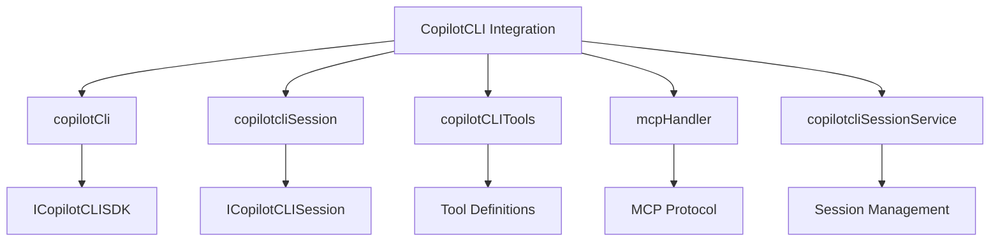
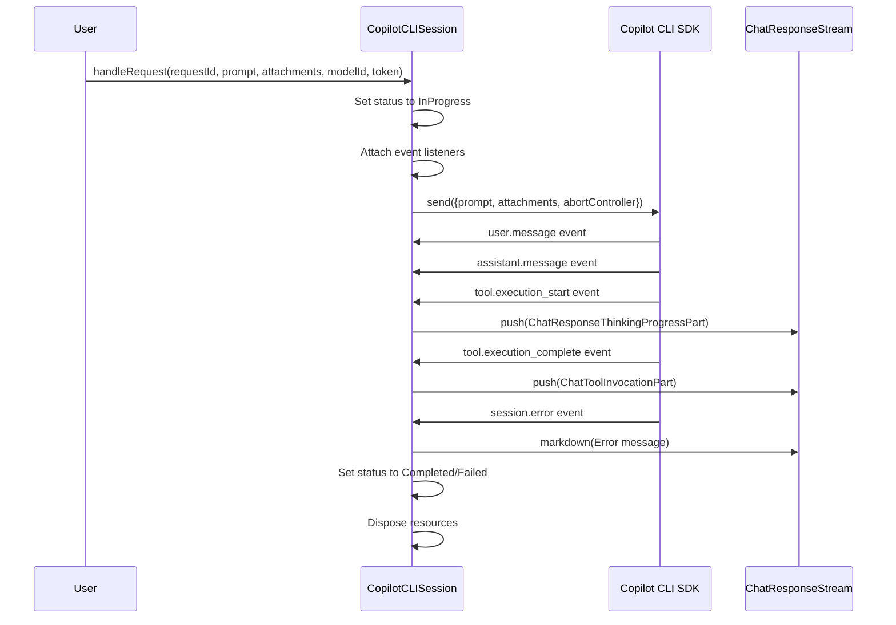
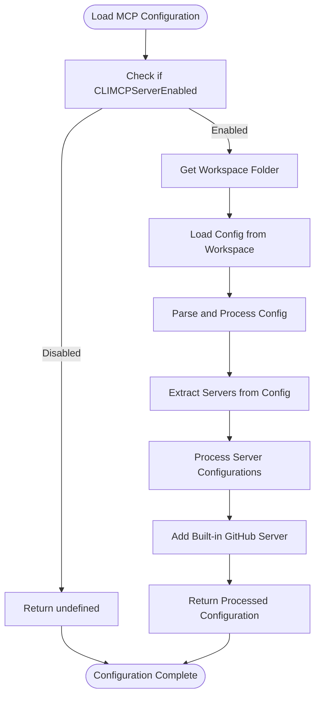
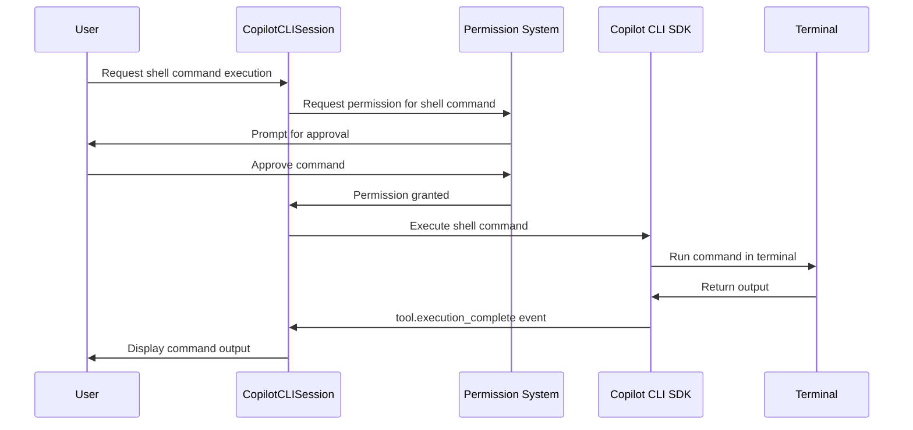
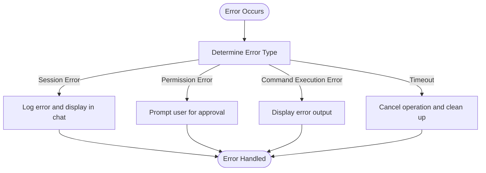
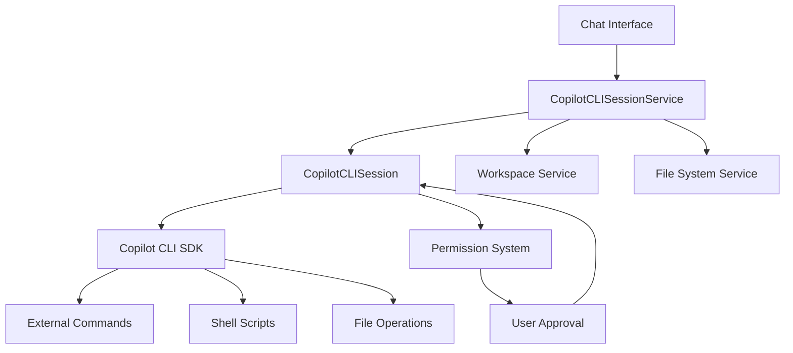

# Copilot CLI Integration

<cite>
**Referenced Files in This Document**   
- [copilotCli.ts](file://src/extension/agents/copilotcli/node/copilotCli.ts)
- [copilotcliSession.ts](file://src/extension/agents/copilotcli/node/copilotcliSession.ts)
- [copilotCLITools.ts](file://src/extension/agents/copilotcli/common/copilotCLITools.ts)
- [mcpHandler.ts](file://src/extension/agents/copilotcli/node/mcpHandler.ts)
- [copilotcliSessionService.ts](file://src/extension/agents/copilotcli/node/copilotcliSessionService.ts)
- [permissionHelpers.ts](file://src/extension/agents/copilotcli/node/permissionHelpers.ts)
- [nodePtyShim.ts](file://src/extension/agents/copilotcli/node/nodePtyShim.ts)
- [logger.ts](file://src/extension/agents/copilotcli/node/logger.ts)
- [copilotCLIShim.ts](file://src/extension/chatSessions/vscode-node/copilotCLIShim.ts)
</cite>

## Table of Contents
1. [Introduction](#introduction)
2. [Core Components](#core-components)
3. [CopilotCLI Class Implementation](#copilotcli-class-implementation)
4. [Session Management with copilotcliSession](#session-management-with-copilotclisession)
5. [Tool Definitions and Operations](#tool-definitions-and-operations)
6. [MCP Protocol Message Processing](#mcp-protocol-message-processing)
7. [Shell Command Execution and I/O Processing](#shell-command-execution-and-io-processing)
8. [Configuration Options](#configuration-options)
9. [Error Handling and Common Issues](#error-handling-and-common-issues)
10. [Integration with Tool Execution Framework](#integration-with-tool-execution-framework)
11. [Conclusion](#conclusion)

## Introduction
The Copilot CLI Integration feature in the vscode-copilot-chat extension provides a comprehensive interface for communicating with the GitHub Copilot CLI service. This integration enables AI-assisted workflows by allowing the extension to execute external commands and scripts through the Copilot CLI. The system is built around several core components that work together to manage sessions, process commands, handle permissions, and integrate with the Model Control Plane (MCP) protocol. This documentation provides a detailed analysis of the implementation, focusing on the key classes and their interactions within the extension's architecture.

**Section sources**
- [copilotCli.ts](file://src/extension/agents/copilotcli/node/copilotCli.ts#L1-L334)

## Core Components
The Copilot CLI integration consists of several interconnected components that provide a robust interface between the VS Code extension and the Copilot CLI service. The primary components include the copilotCli class, which serves as the main interface for communication; the copilotcliSession class, which manages the lifecycle of CLI-based interactions; the copilotCLITools module, which defines available commands and operations; and the mcpHandler, which processes MCP protocol messages. These components work together to enable seamless execution of shell commands, capture and process input/output, and handle errors during CLI operations. The integration also includes specialized utilities for permission handling, logging, and environment setup, ensuring secure and reliable operation.



**Diagram sources **
- [copilotCli.ts](file://src/extension/agents/copilotcli/node/copilotCli.ts#L1-L334)
- [copilotcliSession.ts](file://src/extension/agents/copilotcli/node/copilotcliSession.ts#L1-L390)
- [copilotCLITools.ts](file://src/extension/agents/copilotcli/common/copilotCLITools.ts#L1-L668)
- [mcpHandler.ts](file://src/extension/agents/copilotcli/node/mcpHandler.ts#L1-L284)
- [copilotcliSessionService.ts](file://src/extension/agents/copilotcli/node/copilotcliSessionService.ts#L1-L405)

**Section sources**
- [copilotCli.ts](file://src/extension/agents/copilotcli/node/copilotCli.ts#L1-L334)
- [copilotcliSession.ts](file://src/extension/agents/copilotcli/node/copilotcliSession.ts#L1-L390)
- [copilotCLITools.ts](file://src/extension/agents/copilotcli/common/copilotCLITools.ts#L1-L668)
- [mcpHandler.ts](file://src/extension/agents/copilotcli/node/mcpHandler.ts#L1-L284)
- [copilotcliSessionService.ts](file://src/extension/agents/copilotcli/node/copilotcliSessionService.ts#L1-L405)

## CopilotCLI Class Implementation
The copilotCli class serves as the primary interface for communicating with the Copilot CLI service. It provides a service interface (ICopilotCLISDK) that abstracts the dynamic import of the Copilot CLI SDK, making it easier to unit test by allowing mock implementations. The class manages authentication information, request IDs, and default working directories, while also handling the loading of necessary shims for node-pty and ripgrep. The CopilotCLISDK implementation includes methods for getting the SDK package, retrieving authentication information, and managing request IDs with automatic pruning of entries older than seven days. This class acts as a bridge between the extension and the underlying Copilot CLI SDK, ensuring proper initialization and configuration of the CLI environment.

```mermaid
classDiagram
class ICopilotCLISDK {
+_serviceBrand : undefined
+getPackage() : Promise~typeof import('@github/copilot/sdk')~
+getAuthInfo() : Promise~NonNullable~SessionOptions['authInfo']~~
+getRequestId(sdkRequestId : string) : RequestDetails['details'] | undefined
+setRequestId(sdkRequestId : string, details : { requestId : string; toolIdEditMap : Record~string, string~ }) : void
+getDefaultWorkingDirectory() : Promise~Uri | undefined~
}
class CopilotCLISDK {
+_serviceBrand : undefined
+requestMap : Record~string, RequestDetails~
+constructor(extensionContext, envService, logService, instantiationService, authentService, workspaceService)
+getRequestId(sdkRequestId : string) : RequestDetails['details'] | undefined
+setRequestId(sdkRequestId : string, details : { requestId : string; toolIdEditMap : Record~string, string~ }) : void
+getPackage() : Promise~typeof import('@github/copilot/sdk')~
+ensureShims() : Promise~void~
+getAuthInfo() : Promise~NonNullable~SessionOptions['authInfo']~~
+getDefaultWorkingDirectory() : Promise~Uri | undefined~
}
class CopilotCLISessionOptions {
+isolationEnabled : boolean
+workingDirectory? : Uri
+model? : string
+agent? : SweCustomAgent
+customAgents? : SweCustomAgent[]
+mcpServers? : SessionOptions['mcpServers']
+logger : ReturnType~getCopilotLogger~
+requestPermissionRejected : NonNullable~SessionOptions['requestPermission']~
+requestPermissionHandler : NonNullable~SessionOptions['requestPermission']~
+constructor(options, logger)
+addPermissionHandler(handler) : IDisposable
+toSessionOptions() : Readonly~SessionOptions & { requestPermission : NonNullable~SessionOptions['requestPermission']~ }~
}
ICopilotCLISDK <|-- CopilotCLISDK
```

**Diagram sources **
- [copilotCli.ts](file://src/extension/agents/copilotcli/node/copilotCli.ts#L254-L334)

**Section sources**
- [copilotCli.ts](file://src/extension/agents/copilotcli/node/copilotCli.ts#L254-L334)

## Session Management with copilotcliSession
The copilotcliSession class manages the lifecycle of CLI-based interactions, handling session initialization, command execution, and result processing. The CopilotCLISession class implements the ICopilotCLISession interface and extends DisposableStore, providing methods for attaching streams and permission handlers, handling requests, and managing chat history. When a request is processed, the session sets up event listeners for various SDK events, including tool execution start and complete, user and assistant messages, and session errors. The session maintains state through properties like status, permission requests, and pending prompts, and handles the complete lifecycle from request initiation to completion or failure. The class also manages external edit tracking and integrates with the core tool execution framework to enable running external commands as part of AI-assisted workflows.



**Diagram sources **
- [copilotcliSession.ts](file://src/extension/agents/copilotcli/node/copilotcliSession.ts#L57-L390)

**Section sources**
- [copilotcliSession.ts](file://src/extension/agents/copilotcli/node/copilotcliSession.ts#L57-L390)

## Tool Definitions and Operations
The copilotCLITools module defines the available commands and operations that can be performed through the Copilot CLI integration. It includes type definitions for various tool calls such as file operations (create, edit, view), shell commands (bash, powershell), search operations (grep, glob), and specialized tools for reporting intent and progress. The module provides utility functions for identifying edit tool calls, extracting affected URIs, and processing tool execution events. The createCopilotCLIToolInvocation function formats tool invocations for display in the chat interface, with specific formatters for different tool types. This comprehensive tool definition system enables the extension to support a wide range of operations while providing consistent formatting and error handling across different tool types.

```mermaid
classDiagram
class ToolInfo {
+toolName : string
+arguments : unknown
+toolCallId : string
}
class ToolCall {
+toolName : string
+arguments : unknown
+toolCallId : string
}
class UnknownToolCall {
+toolName : string
+arguments : unknown
+toolCallId : string
}
class ShellTool {
+toolName : 'bash' | 'powershell'
+arguments : { command : string; description : string; sessionId? : string; async? : boolean; timeout? : number }
}
class WriteShellTool {
+toolName : 'write_bash' | 'write_powershell'
+arguments : { sessionId : string; input : string; delay? : number }
}
class ReadShellTool {
+toolName : 'read_bash' | 'read_powershell'
+arguments : { sessionId : string; delay : number }
}
class StopShellTool {
+toolName : 'stop_bash' | 'stop_powershell'
+arguments : unknown
}
class GrepTool {
+toolName : 'grep'
+arguments : { pattern : string; path? : string; output_mode : 'content' | 'files_with_matches' | 'count'; glob? : string; type? : string; '-i'? : boolean; '-A'? : boolean; '-B'? : boolean; '-C'? : boolean; '-n'? : boolean; head_limit? : number; multiline? : boolean }
}
ToolInfo <|-- ShellTool
ToolInfo <|-- WriteShellTool
ToolInfo <|-- ReadShellTool
ToolInfo <|-- StopShellTool
ToolInfo <|-- GrepTool
ToolCall <|-- ToolInfo
UnknownToolCall <|-- ToolInfo
```

**Diagram sources **
- [copilotCLITools.ts](file://src/extension/agents/copilotcli/common/copilotCLITools.ts#L18-L202)

**Section sources**
- [copilotCLITools.ts](file://src/extension/agents/copilotcli/common/copilotCLITools.ts#L18-L202)

## MCP Protocol Message Processing
The mcpHandler processes MCP (Model Control Plane) protocol messages between the extension and the Copilot CLI service. The CopilotCLIMCPHandler class implements the ICopilotCLIMCPHandler interface and is responsible for loading MCP configuration from workspace files and adding built-in GitHub server definitions. The handler supports both local and remote MCP server configurations, with the ability to parse and process configuration from mcp.json files in the workspace. It validates server configurations, handles environment variables and working directory paths, and integrates with the authentication service to provide secure access to MCP servers. The handler also supports configuration through the extension's settings, allowing users to enable or disable MCP server functionality as needed.



**Diagram sources **
- [mcpHandler.ts](file://src/extension/agents/copilotcli/node/mcpHandler.ts#L84-L284)

**Section sources**
- [mcpHandler.ts](file://src/extension/agents/copilotcli/node/mcpHandler.ts#L84-L284)

## Shell Command Execution and I/O Processing
The Copilot CLI integration handles shell command execution through specialized tool definitions and permission handling mechanisms. When a shell command is executed, the system creates a ShellTool invocation with the command and description, which is then processed by the formatShellInvocation function. This function formats the command for display in the chat interface, including the original command line and language information. The permission system requires user approval for shell command execution, with the requestPermission function in permissionHelpers.ts handling the approval workflow. The integration also includes shims for node-pty and ripgrep, ensuring that the necessary native modules are available for terminal operations. Input and output are captured through the SDK's event system, with tool execution start and complete events providing visibility into command execution.



**Diagram sources **
- [copilotCLITools.ts](file://src/extension/agents/copilotcli/common/copilotCLITools.ts#L601-L621)
- [permissionHelpers.ts](file://src/extension/agents/copilotcli/node/permissionHelpers.ts#L126-L135)

**Section sources**
- [copilotCLITools.ts](file://src/extension/agents/copilotcli/common/copilotCLITools.ts#L601-L621)
- [permissionHelpers.ts](file://src/extension/agents/copilotcli/node/permissionHelpers.ts#L126-L135)

## Configuration Options
The Copilot CLI integration includes several configuration options that can be customized by users. These options are managed through the extension's configuration system and include settings for the executable path, timeout limits, and environment variables. The copilotcliSessionService class handles session-specific configuration, including model selection, working directory, and isolation settings. The mcpHandler respects the CLIMCPServerEnabled configuration option, allowing users to enable or disable MCP server functionality. The copilotCLISDK class manages authentication information and default working directory selection, while the copilotCLIAgents class handles agent selection and persistence. These configuration options provide flexibility in how the Copilot CLI integration operates, allowing users to tailor the behavior to their specific needs and environments.

**Section sources**
- [copilotCli.ts](file://src/extension/agents/copilotcli/node/copilotCli.ts#L23-L29)
- [mcpHandler.ts](file://src/extension/agents/copilotcli/node/mcpHandler.ts#L94-L96)

## Error Handling and Common Issues
The Copilot CLI integration includes comprehensive error handling for various scenarios, including command execution failures, permission errors, and long-running processes. The system uses a combination of try-catch blocks, event listeners, and status tracking to detect and respond to errors. When a session error occurs, the system logs the error and displays an error message in the chat interface. Permission requests are handled through a dedicated permission system that requires user approval for sensitive operations like file writes and shell command execution. Long-running processes are managed through cancellation tokens and timeout mechanisms, with the session automatically disposing of resources when a request is completed or cancelled. The integration also includes retry mechanisms for file operations and handles edge cases like zero-byte files and special file types.



**Diagram sources **
- [copilotcliSession.ts](file://src/extension/agents/copilotcli/node/copilotcliSession.ts#L261-L266)
- [permissionHelpers.ts](file://src/extension/agents/copilotcli/node/permissionHelpers.ts#L34-L52)

**Section sources**
- [copilotcliSession.ts](file://src/extension/agents/copilotcli/node/copilotcliSession.ts#L261-L266)
- [permissionHelpers.ts](file://src/extension/agents/copilotcli/node/permissionHelpers.ts#L34-L52)

## Integration with Tool Execution Framework
The Copilot CLI integration seamlessly connects with the core tool execution framework, enabling the execution of external commands and scripts as part of AI-assisted workflows. The copilotcliSessionService class acts as a bridge between the chat interface and the underlying CLI service, managing session creation, retrieval, and disposal. The integration uses reference counting to manage session lifetimes, ensuring that sessions are only disposed of when no longer needed. The system also integrates with the extension's file system and workspace services, allowing it to access workspace files and directories as needed. The permission system works in conjunction with the core tool execution framework to ensure that all operations are properly authorized before execution, providing a secure and reliable interface for AI-assisted development.



**Diagram sources **
- [copilotcliSessionService.ts](file://src/extension/agents/copilotcli/node/copilotcliSessionService.ts#L60-L405)

**Section sources**
- [copilotcliSessionService.ts](file://src/extension/agents/copilotcli/node/copilotcliSessionService.ts#L60-L405)

## Conclusion
The Copilot CLI Integration in the vscode-copilot-chat extension provides a robust and flexible interface for communicating with the GitHub Copilot CLI service. Through its well-designed architecture and comprehensive feature set, the integration enables powerful AI-assisted workflows that enhance developer productivity. The system's modular design, with clear separation of concerns between the copilotCli, copilotcliSession, copilotCLITools, and mcpHandler components, ensures maintainability and extensibility. The integration's support for shell command execution, file operations, and MCP protocol messaging, combined with robust error handling and permission management, makes it a valuable tool for modern software development. As the Copilot CLI ecosystem continues to evolve, this integration provides a solid foundation for future enhancements and capabilities.