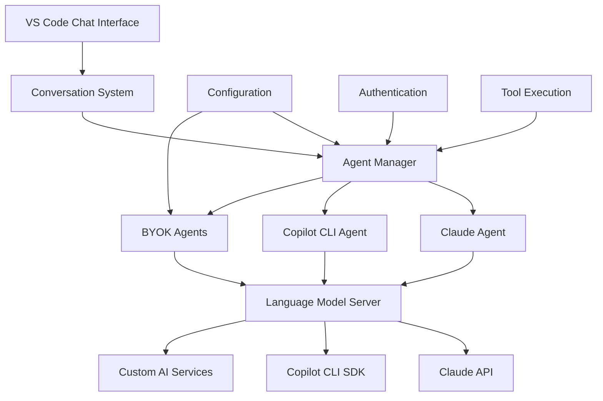
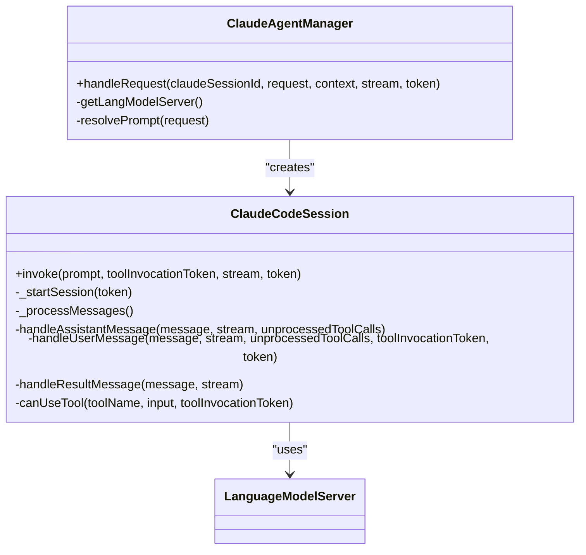
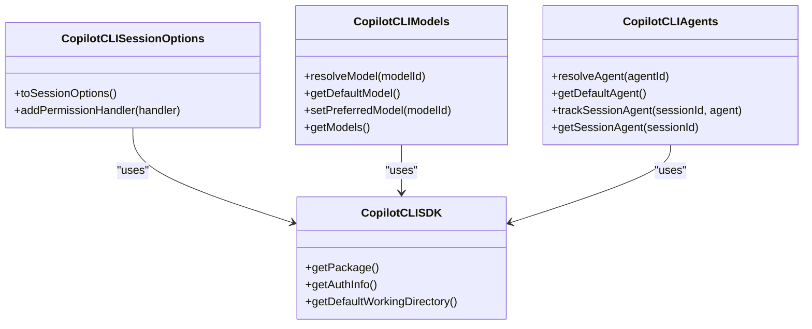
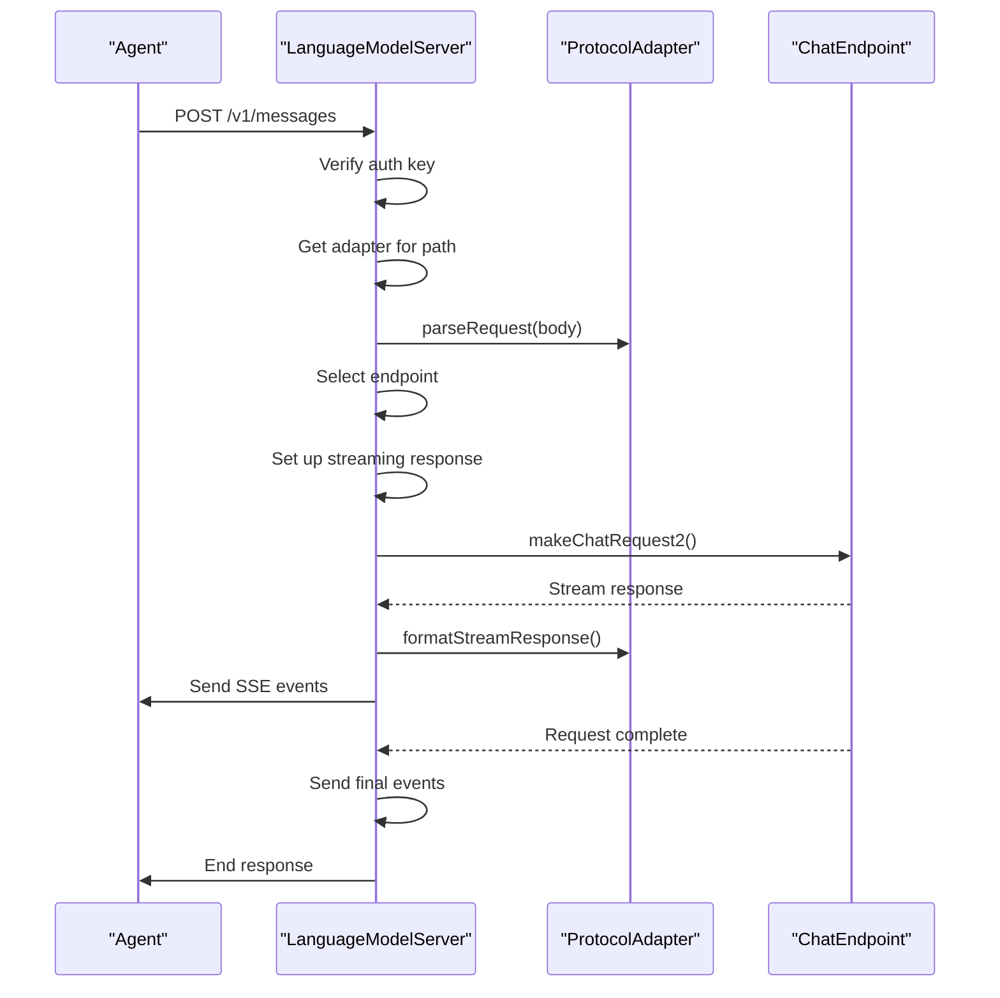
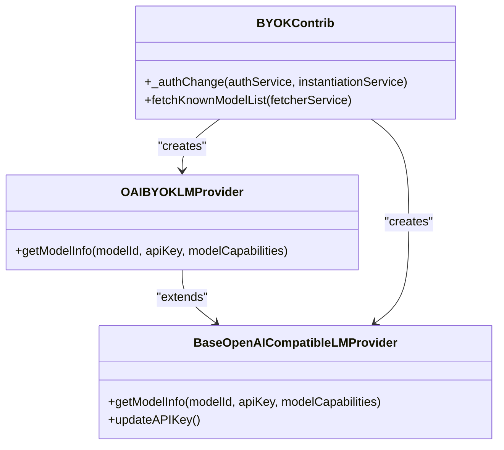
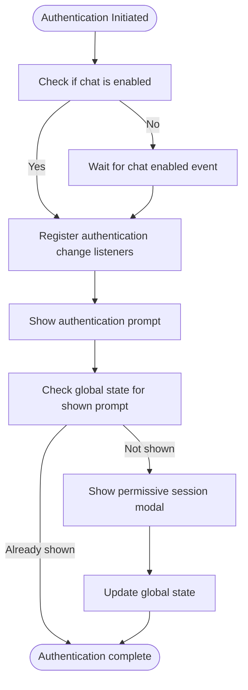
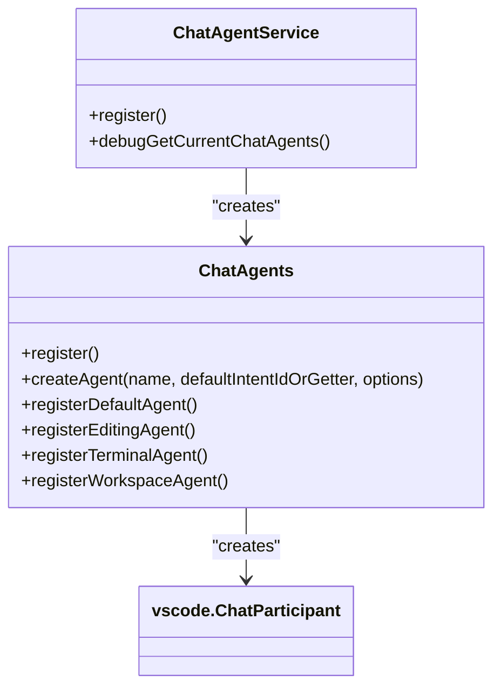
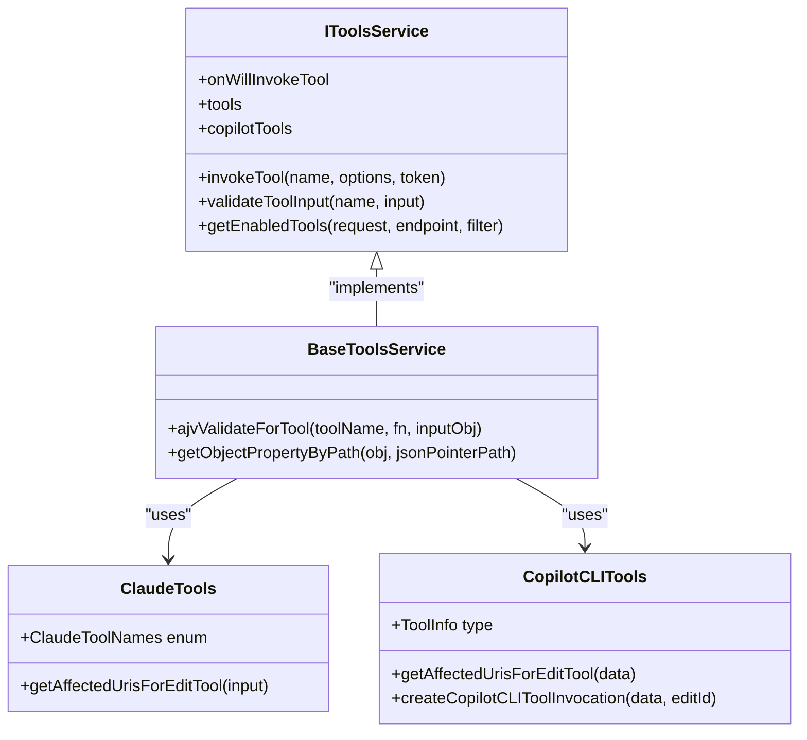

# Third-Party AI Service Integration

<cite>
**Referenced Files in This Document**   
- [claudeCodeAgent.ts](file://src/extension/agents/claude/node/claudeCodeAgent.ts)
- [copilotCli.ts](file://src/extension/agents/copilotcli/node/copilotCli.ts)
- [langModelServer.ts](file://src/extension/agents/node/langModelServer.ts)
- [claudeTools.ts](file://src/extension/agents/claude/common/claudeTools.ts)
- [copilotCLITools.ts](file://src/extension/agents/copilotcli/common/copilotCLITools.ts)
- [byokProvider.ts](file://src/extension/byok/common/byokProvider.ts)
- [openAIProvider.ts](file://src/extension/byok/vscode-node/openAIProvider.ts)
- [byokContribution.ts](file://src/extension/byok/vscode-node/byokContribution.ts)
- [configurationService.ts](file://src/platform/configuration/common/configurationService.ts)
- [authentication.contribution.ts](file://src/extension/authentication/vscode-node/authentication.contribution.ts)
- [chatParticipants.ts](file://src/extension/conversation/vscode-node/chatParticipants.ts)
- [toolsService.ts](file://src/extension/tools/common/toolsService.ts)
</cite>

## Table of Contents
1. [Introduction](#introduction)
2. [Architecture Overview](#architecture-overview)
3. [Core Components](#core-components)
4. [Agent Implementations](#agent-implementations)
5. [Language Model Server](#language-model-server)
6. [BYOK (Bring Your Own Key) Integration](#byok-bring-your-own-key-integration)
7. [Authentication and Configuration](#authentication-and-configuration)
8. [Conversation System Integration](#conversation-system-integration)
9. [Tool Execution Framework](#tool-execution-framework)
10. [Error Handling and Common Issues](#error-handling-and-common-issues)
11. [Conclusion](#conclusion)

## Introduction
The vscode-copilot-chat extension provides comprehensive integration with third-party AI services through its agents module. This feature enables seamless communication with various AI providers including Claude, Copilot CLI, and custom BYOK (Bring Your Own Key) services. The architecture is designed to provide a unified interface for language models while maintaining flexibility for service-specific features and configurations. The system handles authentication, request formatting, response processing, and tool execution across different AI services, allowing users to leverage multiple AI providers within the VS Code environment.

**Section sources**
- [claudeCodeAgent.ts](file://src/extension/agents/claude/node/claudeCodeAgent.ts#L30-L592)
- [copilotCli.ts](file://src/extension/agents/copilotcli/node/copilotCli.ts#L6-L334)

## Architecture Overview
The third-party AI service integration architecture consists of several key components that work together to provide a seamless experience. At the core is the agents module, which manages communication with different AI providers. Each agent implementation handles service-specific details while presenting a consistent interface to the rest of the system. The language model server acts as a proxy between the agents and the actual AI services, handling authentication and routing. The BYOK system allows users to configure custom AI providers with their own API keys. All components integrate with the conversation system and tool execution framework to provide a cohesive experience.

**Diagram sources**
- [claudeCodeAgent.ts](file://src/extension/agents/claude/node/claudeCodeAgent.ts#L30-L592)
- [copilotCli.ts](file://src/extension/agents/copilotcli/node/copilotCli.ts#L6-L334)
- [langModelServer.ts](file://src/extension/agents/node/langModelServer.ts#L33-L335)

## Core Components
The core components of the third-party AI service integration include the agent managers, language model server, and BYOK providers. These components work together to provide a unified interface for different AI services while handling service-specific details. The system is designed with extensibility in mind, allowing new AI providers to be added with minimal changes to the core architecture. The components are responsible for managing authentication, request formatting, response processing, and error handling for their respective services.

**Section sources**
- [claudeCodeAgent.ts](file://src/extension/agents/claude/node/claudeCodeAgent.ts#L30-L592)
- [copilotCli.ts](file://src/extension/agents/copilotcli/node/copilotCli.ts#L6-L334)
- [langModelServer.ts](file://src/extension/agents/node/langModelServer.ts#L33-L335)

## Agent Implementations

### Claude Agent
The Claude agent implementation provides integration with the Claude AI service through the claudeCodeAgent.ts file. The ClaudeAgentManager class manages Claude Code agent interactions and language model server lifecycle. It handles requests by either reusing an existing session or creating a new one. The ClaudeCodeSession class represents a queued chat request and manages the message processing loop. The agent uses hooks to handle tool usage events and processes tool results before sending them to the response stream. Authentication is handled through the language model server, which provides a nonce-based authentication mechanism.

**Diagram sources**
- [claudeCodeAgent.ts](file://src/extension/agents/claude/node/claudeCodeAgent.ts#L30-L592)

### Copilot CLI Agent
The Copilot CLI agent implementation provides integration with the GitHub Copilot CLI service through the copilotCli.ts file. The CopilotCLISessionOptions class manages session configuration including model selection, working directory, and permission handling. The CopilotCLIModels class handles model resolution and management, while the CopilotCLIAgents class manages agent selection and tracking. The CopilotCLISDK class provides a service interface for the Copilot CLI SDK, handling authentication and package loading. The agent uses a request permission handler to manage user consent for tool execution.

**Diagram sources**
- [copilotCli.ts](file://src/extension/agents/copilotcli/node/copilotCli.ts#L6-L334)

## Language Model Server
The language model server provides a unified interface for language models through the langModelServer.ts file. It acts as a proxy between the agents and the actual AI services, handling authentication and routing. The server creates an HTTP server that listens for requests and routes them to the appropriate adapter based on the URL path. The AnthropicAdapterFactory is registered to handle requests to the /v1/messages endpoint. The server verifies authentication using a nonce-based mechanism and selects the appropriate endpoint based on the requested model. It handles streaming responses and manages request cancellation.

**Diagram sources**
- [langModelServer.ts](file://src/extension/agents/node/langModelServer.ts#L33-L335)

## BYOK (Bring Your Own Key) Integration
The BYOK system allows users to configure custom AI providers with their own API keys through the byok module. The BYOKContrib class registers providers for various services including OpenAI, Azure, Anthropic, Groq, Gemini, and others. The OAIBYOKLMProvider class extends BaseOpenAICompatibleLMProvider to handle OpenAI-compatible services. The system fetches a known models list from a CDN to ensure all providers have the same list of available models. Users can manage their API keys through commands like github.copilot.chat.manageBYOK and github.copilot.chat.manageBYOKAPIKey.

**Diagram sources**
- [byokContribution.ts](file://src/extension/byok/vscode-node/byokContribution.ts#L28-L118)
- [openAIProvider.ts](file://src/extension/byok/vscode-node/openAIProvider.ts#L15-L52)

## Authentication and Configuration
The authentication and configuration system manages user credentials and settings for the AI services. The AuthenticationContrib class handles authentication contributions and ensures users have the necessary permissions. It registers commands for triggering permissive sign-in and shows prompts when necessary. The IConfigurationService interface provides access to configuration settings, with methods for getting, setting, and observing configuration values. Configuration keys are defined in the ConfigKey enum, and the system supports experimentation-based configurations.

**Diagram sources**
- [authentication.contribution.ts](file://src/extension/authentication/vscode-node/authentication.contribution.ts#L17-L113)
- [configurationService.ts](file://src/platform/configuration/common/configurationService.ts#L25-L200)

## Conversation System Integration
The conversation system integration connects the AI agents with the VS Code chat interface through the chatParticipants.ts file. The ChatAgentService class registers various chat agents including default, editing, terminal, and workspace agents. Each agent is created with a specific intent and icon, and can have additional welcome messages and title providers. The system handles user feedback and actions through the IUserFeedbackService. The agents are registered with the VS Code chat system, making them available in the chat interface.

**Diagram sources**
- [chatParticipants.ts](file://src/extension/conversation/vscode-node/chatParticipants.ts#L28-L200)

## Tool Execution Framework
The tool execution framework manages the invocation and handling of tools by the AI agents. The IToolsService interface provides methods for invoking tools, validating input, and getting enabled tools. The BaseToolsService class implements the core functionality, using AJV for schema validation. The claudeTools.ts file defines the various tools available for the Claude agent, including edit, read, write, and bash tools. The copilotCLITools.ts file defines similar tools for the Copilot CLI agent. The system handles tool permission requests by showing confirmation dialogs to the user.

**Diagram sources**
- [toolsService.ts](file://src/extension/tools/common/toolsService.ts#L17-L200)
- [claudeTools.ts](file://src/extension/agents/claude/common/claudeTools.ts#L9-L92)
- [copilotCLITools.ts](file://src/extension/agents/copilotcli/common/copilotCLITools.ts#L17-L668)

## Error Handling and Common Issues
The system includes comprehensive error handling for common issues such as API rate limits, authentication failures, and compatibility problems. The Claude agent handles errors by logging them and sending error messages to the response stream. The language model server handles authentication failures by returning 401 responses and internal errors by returning 500 responses. The BYOK system handles missing API keys by prompting users to configure them. The system also handles request cancellation and client disconnection events. Common issues are addressed through user-friendly error messages and guidance on resolving configuration problems.

**Section sources**
- [claudeCodeAgent.ts](file://src/extension/agents/claude/node/claudeCodeAgent.ts#L87-L95)
- [langModelServer.ts](file://src/extension/agents/node/langModelServer.ts#L74-L78)
- [byokContribution.ts](file://src/extension/byok/vscode-node/byokContribution.ts#L60-L73)

## Conclusion
The third-party AI service integration in the vscode-copilot-chat extension provides a robust and extensible framework for connecting with various AI providers. The architecture separates concerns between agent implementations, the language model server, and the BYOK system, allowing for flexible integration of new services. The system handles authentication, configuration, and error management while providing a consistent interface to the conversation system and tool execution framework. This design enables users to leverage multiple AI providers within VS Code, enhancing productivity and development workflows.