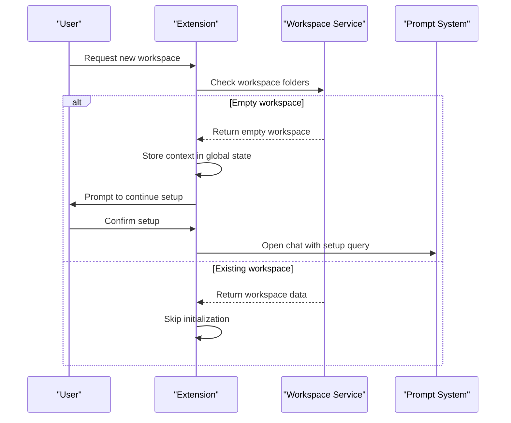
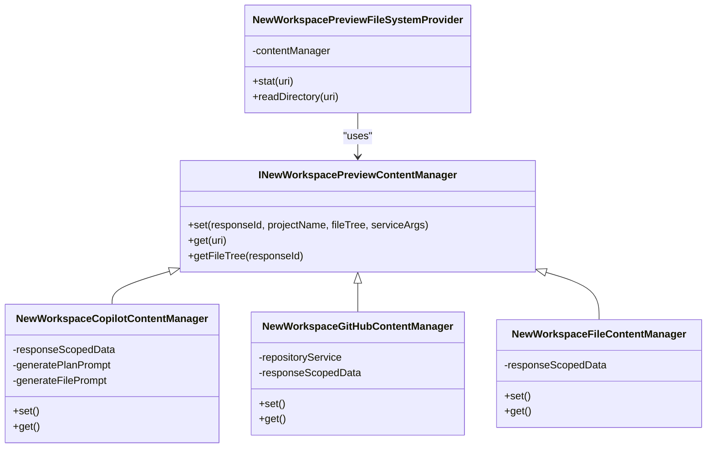
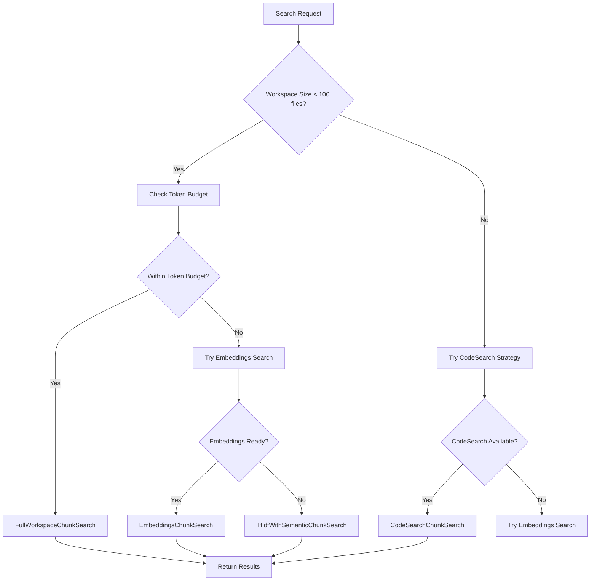
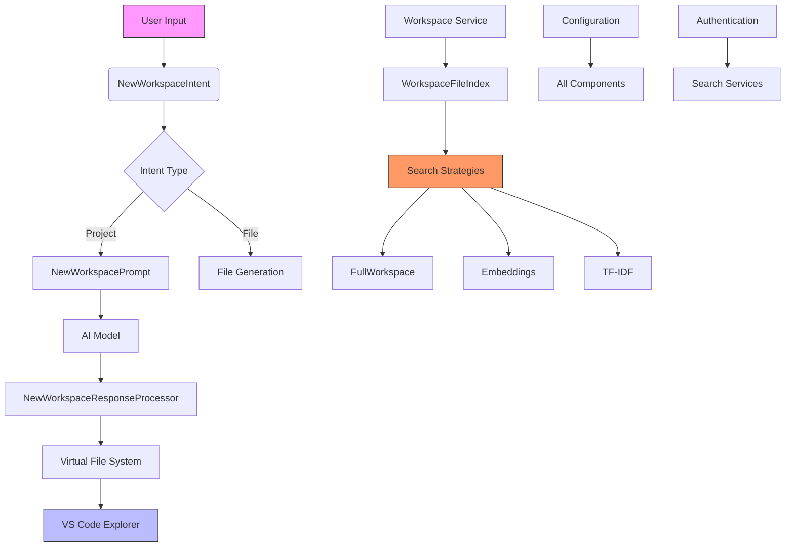

# Workspace Management

<cite>
**Referenced Files in This Document**   
- [newWorkspace.contribution.ts](file://src/extension/getting-started/vscode-node/newWorkspace.contribution.ts)
- [newWorkspaceInitializer.ts](file://src/extension/getting-started/vscode-node/newWorkspaceInitializer.ts)
- [newWorkspace.tsx](file://src/extension/prompts/node/panel/newWorkspace/newWorkspace.tsx)
- [newIntent.ts](file://src/extension/intents/node/newIntent.ts)
- [workspaceChunkSearchService.ts](file://src/platform/workspaceChunkSearch/node/workspaceChunkSearchService.ts)
- [workspaceFileIndex.ts](file://src/platform/workspaceChunkSearch/node/workspaceFileIndex.ts)
- [fullWorkspaceChunkSearch.ts](file://src/platform/workspaceChunkSearch/node/fullWorkspaceChunkSearch.ts)
- [workspaceService.ts](file://src/platform/workspace/common/workspaceService.ts)
- [newWorkspacePreviewFileSystemProvider.ts](file://src/extension/intents/vscode-node/newWorkspacePreviewFileSystemProvider.ts)
</cite>

## Table of Contents
1. [Introduction](#introduction)
2. [Workspace Creation](#workspace-creation)
3. [File Management](#file-management)
4. [Code Search Capabilities](#code-search-capabilities)
5. [Configuration Options](#configuration-options)
6. [Common Issues and Troubleshooting](#common-issues-and-troubleshooting)
7. [Architecture Overview](#architecture-overview)
8. [Conclusion](#conclusion)

## Introduction
The Workspace Management feature in the vscode-copilot-chat extension provides comprehensive capabilities for creating new development environments, managing file structures, and searching across codebases. This documentation details the implementation of workspace creation, file management, and code search functionalities, focusing on the integration between the workspace module, workspace chunk search system, and project creation components. The system is designed to assist users in scaffolding new projects and files through intelligent AI-powered suggestions while maintaining efficient code search capabilities across the workspace.

**Section sources**
- [newWorkspace.contribution.ts](file://src/extension/getting-started/vscode-node/newWorkspace.contribution.ts#L1-L18)
- [newWorkspaceInitializer.ts](file://src/extension/getting-started/vscode-node/newWorkspaceInitializer.ts#L1-L72)

## Workspace Creation
The workspace creation functionality is implemented through a contribution system that initializes new workspaces based on user intent. The process begins with the `newWorkspace.contribution.ts` file, which creates an instance of `NewWorkspaceInitializer` when the extension is activated. This initializer monitors workspace folders and handles the setup process for new workspaces.

When a new empty workspace is detected, the system stores context data in the extension's global state using the `NEW_WORKSPACE_STORAGE_KEY`. If a workspace is found to be empty after initialization, the system prompts the user to continue with workspace setup through a chat interface. The initialization process checks whether the workspace has already been initialized and presents appropriate messaging to guide the user through the setup process.

The workspace creation flow supports two primary scenarios: creating a new project from scratch or using existing templates from GitHub repositories. When a user requests a new workspace, the system first determines the user's intent by analyzing the query through a meta-prompt that clarifies ambiguous terms and resolves pronouns. Based on this analysis, the system either generates a new project structure or identifies relevant GitHub templates that match the user's requirements.

**Diagram sources**
- [newWorkspace.contribution.ts](file://src/extension/getting-started/vscode-node/newWorkspace.contribution.ts#L1-L18)
- [newWorkspaceInitializer.ts](file://src/extension/getting-started/vscode-node/newWorkspaceInitializer.ts#L1-L72)

**Section sources**
- [newWorkspace.contribution.ts](file://src/extension/getting-started/vscode-node/newWorkspace.contribution.ts#L1-L18)
- [newWorkspaceInitializer.ts](file://src/extension/getting-started/vscode-node/newWorkspaceInitializer.ts#L1-L72)

## File Management
The file management system in vscode-copilot-chat implements a sophisticated preview and creation mechanism that allows users to visualize and generate files before committing them to the workspace. The core of this functionality is the `INewWorkspacePreviewContentManager` interface, which manages preview content for different workspace types including Copilot-generated workspaces, GitHub repositories, and individual files.

When a user requests a new file or project, the system creates a virtual file system using custom URI schemes:
- `vscode-copilot-workspace` for AI-generated project structures
- `vscode-copilot-github-workspace` for GitHub repository templates
- `vscode-copilot-file` for individual file contents

The `NewWorkspacePreviewFileSystemProvider` implements the VS Code FileSystemProvider interface to handle file operations on these virtual workspaces. It delegates file metadata and content requests to the appropriate content manager based on the URI scheme. When a user requests file information through the `stat` method, the provider retrieves the corresponding node from the content manager and returns appropriate file statistics including creation time, modification time, size, and file type.

For directory listings, the `readDirectory` method returns a list of child entries with their names and types (file or directory). This enables the VS Code explorer to display the virtual file structure as if it were a real file system. The content managers (`NewWorkspaceCopilotContentManager`, `NewWorkspaceGitHubContentManager`, and `NewWorkspaceFileContentManager`) maintain response-scoped data that maps request IDs to their corresponding file structures and content.

When creating individual files, the system follows a two-step process where the AI generates both the file content and a JSON structure containing the filename. This ensures consistent naming and proper file association. The file content generation uses a prefetching mechanism that prepares file contents in advance, though this feature is currently disabled in the implementation.

**Diagram sources**
- [newIntent.ts](file://src/extension/intents/node/newIntent.ts#L41-L309)
- [newWorkspacePreviewFileSystemProvider.ts](file://src/extension/intents/vscode-node/newWorkspacePreviewFileSystemProvider.ts#L1-L34)

**Section sources**
- [newIntent.ts](file://src/extension/intents/node/newIntent.ts#L41-L309)
- [newWorkspacePreviewFileSystemProvider.ts](file://src/extension/intents/vscode-node/newWorkspacePreviewFileSystemProvider.ts#L1-L34)

## Code Search Capabilities
The code search capabilities in vscode-copilot-chat are implemented through a sophisticated workspace chunk search system that combines multiple search strategies to provide relevant results efficiently. The core service, `IWorkspaceChunkSearchService`, coordinates between different search strategies including embeddings-based search, TF-IDF search, and full workspace search.

The search process begins with the `WorkspaceChunkSearchService` which acts as a facade for the actual implementation `WorkspaceChunkSearchServiceImpl`. This service determines the appropriate search strategy based on various factors including workspace size, token budget, and indexing status. The system supports several search strategies identified by the `WorkspaceChunkSearchStrategyId` enum:
- `Embeddings`: Semantic search using vector embeddings
- `CodeSearch`: Remote code search with indexed commits
- `Tfidf`: Term frequency-inverse document frequency search
- `FullWorkspace`: Complete workspace inclusion when feasible

The `FullWorkspaceChunkSearch` strategy is optimized for small workspaces with fewer than 100 files. It checks whether the entire workspace can fit within the token budget before attempting to include all files. For larger workspaces, the system falls back to other strategies that prioritize the most relevant files based on semantic similarity or keyword matching.

The search process involves several key components:
- `WorkspaceFileIndex`: Maintains an index of workspace files that can be searched
- `EmbeddingsChunkSearch`: Performs semantic search using vector embeddings
- `TfidfChunkSearch`: Implements traditional information retrieval using TF-IDF
- `CodeSearchChunkSearch`: Integrates with remote code search capabilities

The system implements a fallback mechanism where it first attempts faster search methods and falls back to slower but more comprehensive methods if needed. This ensures responsive performance while still providing thorough search results when necessary.

**Diagram sources**
- [workspaceChunkSearchService.ts](file://src/platform/workspaceChunkSearch/node/workspaceChunkSearchService.ts#L1-L800)
- [fullWorkspaceChunkSearch.ts](file://src/platform/workspaceChunkSearch/node/fullWorkspaceChunkSearch.ts#L1-L194)
- [workspaceFileIndex.ts](file://src/platform/workspaceChunkSearch/node/workspaceFileIndex.ts#L1-L800)

**Section sources**
- [workspaceChunkSearchService.ts](file://src/platform/workspaceChunkSearch/node/workspaceChunkSearchService.ts#L1-L800)
- [fullWorkspaceChunkSearch.ts](file://src/platform/workspaceChunkSearch/node/fullWorkspaceChunkSearch.ts#L1-L194)
- [workspaceFileIndex.ts](file://src/platform/workspaceChunkSearch/node/workspaceFileIndex.ts#L1-L800)

## Configuration Options
The workspace management system provides several configuration options that control its behavior. These options are primarily accessed through the `IConfigurationService` and can be modified by users to customize the workspace experience.

Key configuration parameters include:
- `ConfigKey.Advanced.WorkspaceEnableFullWorkspace`: Enables or disables the full workspace search strategy
- `ConfigKey.Advanced.WorkspaceMaxLocalIndexSize`: Sets the maximum number of files to index locally
- `ConfigKey.UseProjectTemplates`: Controls whether project templates should be used when creating new workspaces

The system also respects various workspace-level settings and ignores certain files and directories by default. The `shouldAlwaysIgnoreFile` function in `workspaceFileIndex.ts` defines a comprehensive list of file extensions, directories, and schemes that should never be indexed, including:
- Common binary formats (images, videos, compressed files)
- Build artifacts (node_modules, dist, out)
- Version control directories (.git)
- Sensitive files (certificates, private keys)

The workspace indexing process can be controlled through experimentation variables that allow gradual rollout of features:
- `copilotchat.workspaceChunkSearch.shouldEagerlyInitLocalIndex`: Determines whether local indexing should be initialized eagerly
- `copilotchat.workspaceChunkSearch.shouldRemoteIndexOnAuthUpgrade`: Controls whether remote indexing should be triggered when authentication is upgraded

These configuration options provide flexibility for both end users and developers to optimize the workspace management behavior based on their specific needs and environment constraints.

**Section sources**
- [workspaceChunkSearchService.ts](file://src/platform/workspaceChunkSearch/node/workspaceChunkSearchService.ts#L1-L800)
- [workspaceFileIndex.ts](file://src/platform/workspaceChunkSearch/node/workspaceFileIndex.ts#L1-L800)
- [fullWorkspaceChunkSearch.ts](file://src/platform/workspaceChunkSearch/node/fullWorkspaceChunkSearch.ts#L1-L194)

## Common Issues and Troubleshooting
The workspace management system addresses several common issues that may arise during workspace creation, file management, and code search operations.

### File Conflicts
When creating new workspaces, the system handles potential file conflicts by checking the workspace state before proceeding with initialization. If a workspace is found to be non-empty after initialization, the system removes the initialization context to prevent redundant setup prompts. For file creation, the virtual file system approach prevents conflicts by keeping generated files in memory until the user explicitly chooses to create them in the actual workspace.

### Search Performance
Search performance is optimized through several mechanisms:
- The `FullWorkspaceChunkSearch` strategy includes an optimization that avoids computing workspace token counts for workspaces with more than 100 files
- The system implements a timeout mechanism (12,500ms by default) for code search operations, falling back to local search if the remote search times out
- File reading is rate-limited using a `Limiter` with a concurrency of 20 to prevent overwhelming the system
- The workspace file index limits the number of files it indexes based on the `WorkspaceMaxLocalIndexSize` configuration

### Project Template Management
The system handles project template management by integrating with GitHub repositories. When a user request matches an existing template, the system fetches the repository items and constructs a file tree representation. The template search uses embeddings to find the closest matching projects based on semantic similarity. If no suitable template is found, the system falls back to generating a new project structure from scratch.

Common troubleshooting steps for issues include:
1. Clearing the workspace initialization state if setup prompts appear incorrectly
2. Checking authentication status, as some search capabilities require proper authentication
3. Verifying that the workspace does not contain ignored file types or directories
4. Adjusting configuration settings for indexing and search behavior

**Section sources**
- [newWorkspaceInitializer.ts](file://src/extension/getting-started/vscode-node/newWorkspaceInitializer.ts#L1-L72)
- [workspaceChunkSearchService.ts](file://src/platform/workspaceChunkSearch/node/workspaceChunkSearchService.ts#L1-L800)
- [workspaceFileIndex.ts](file://src/platform/workspaceChunkSearch/node/workspaceFileIndex.ts#L1-L800)

## Architecture Overview
The workspace management architecture in vscode-copilot-chat follows a modular design with clear separation of concerns between components. The system is organized into several key layers:

1. **Contribution Layer**: Handles extension activation and initialization
2. **Intent Processing Layer**: Manages user requests and determines appropriate actions
3. **Content Management Layer**: Handles file and workspace content
4. **Search Infrastructure Layer**: Provides code search capabilities
5. **Virtual File System Layer**: Exposes generated content to VS Code

The architecture follows dependency injection principles, with services registered through the `IInstantiationService`. This allows for loose coupling between components and facilitates testing and extensibility.

The core workflow begins with user input in the chat interface, which triggers the `NewWorkspaceIntent` processing. This intent determines whether the user wants to create a file or project and orchestrates the appropriate response. The system then generates a prompt using the `NewWorkspacePrompt` component, which formats the request for the AI model.

Once the AI response is received, the `NewWorkspaceResponseProcessor` parses the output and creates appropriate UI elements including file trees, buttons, and markdown content. The virtual file system makes the generated content accessible through standard VS Code file operations, allowing users to explore the proposed structure before committing to creation.

The search infrastructure operates independently but integrates with the workspace management features when context from existing code is needed. The `WorkspaceChunkSearchService` coordinates between multiple search strategies, selecting the most appropriate one based on workspace characteristics and user requirements.

**Diagram sources**
- [newIntent.ts](file://src/extension/intents/node/newIntent.ts#L327-L624)
- [newWorkspace.tsx](file://src/extension/prompts/node/panel/newWorkspace/newWorkspace.tsx#L1-L475)
- [workspaceChunkSearchService.ts](file://src/platform/workspaceChunkSearch/node/workspaceChunkSearchService.ts#L1-L800)
- [workspaceService.ts](file://src/platform/workspace/common/workspaceService.ts#L1-L227)

**Section sources**
- [newIntent.ts](file://src/extension/intents/node/newIntent.ts#L327-L624)
- [newWorkspace.tsx](file://src/extension/prompts/node/panel/newWorkspace/newWorkspace.tsx#L1-L475)
- [workspaceChunkSearchService.ts](file://src/platform/workspaceChunkSearch/node/workspaceChunkSearchService.ts#L1-L800)
- [workspaceService.ts](file://src/platform/workspace/common/workspaceService.ts#L1-L227)

## Conclusion
The Workspace Management feature in vscode-copilot-chat provides a comprehensive solution for creating and managing development environments through AI-powered assistance. The system integrates workspace creation, file management, and code search capabilities into a cohesive experience that helps developers scaffold new projects and navigate existing codebases efficiently.

Key strengths of the implementation include:
- A modular architecture with clear separation of concerns
- Support for multiple workspace creation scenarios (from scratch, from templates)
- A virtual file system that allows previewing generated content
- Multiple search strategies optimized for different workspace sizes and conditions
- Comprehensive configuration options for customization

The system effectively balances performance and functionality by using appropriate search strategies based on workspace characteristics and implementing fallback mechanisms for reliability. The integration with GitHub templates expands the capabilities beyond simple file generation, allowing users to leverage existing project structures and best practices.

For developers looking to extend or customize the workspace management features, the well-defined interfaces and dependency injection system provide clear extension points. The separation between the contribution layer, intent processing, content management, and search infrastructure makes it possible to modify individual components without affecting the overall system stability.