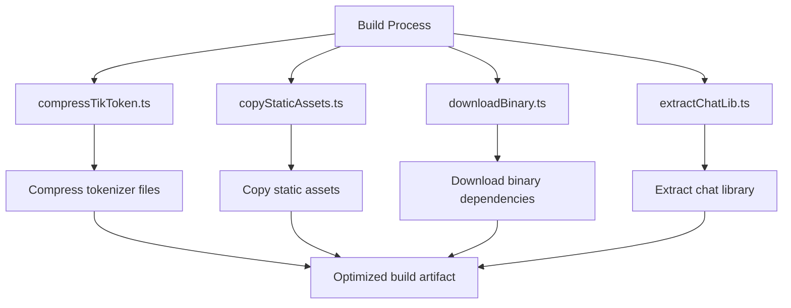
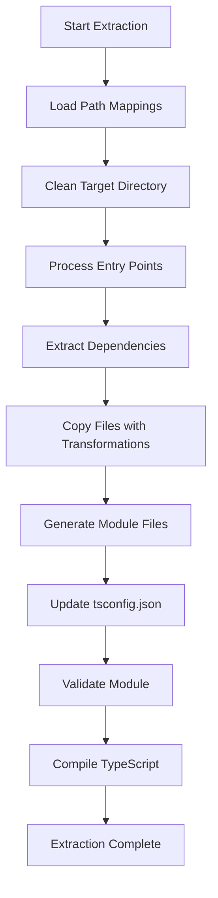
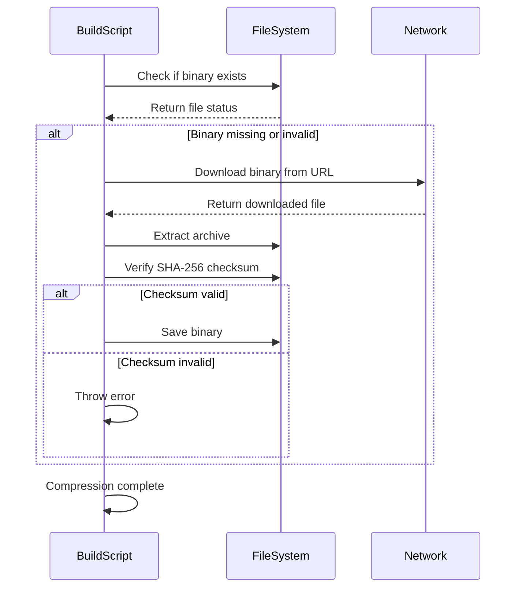
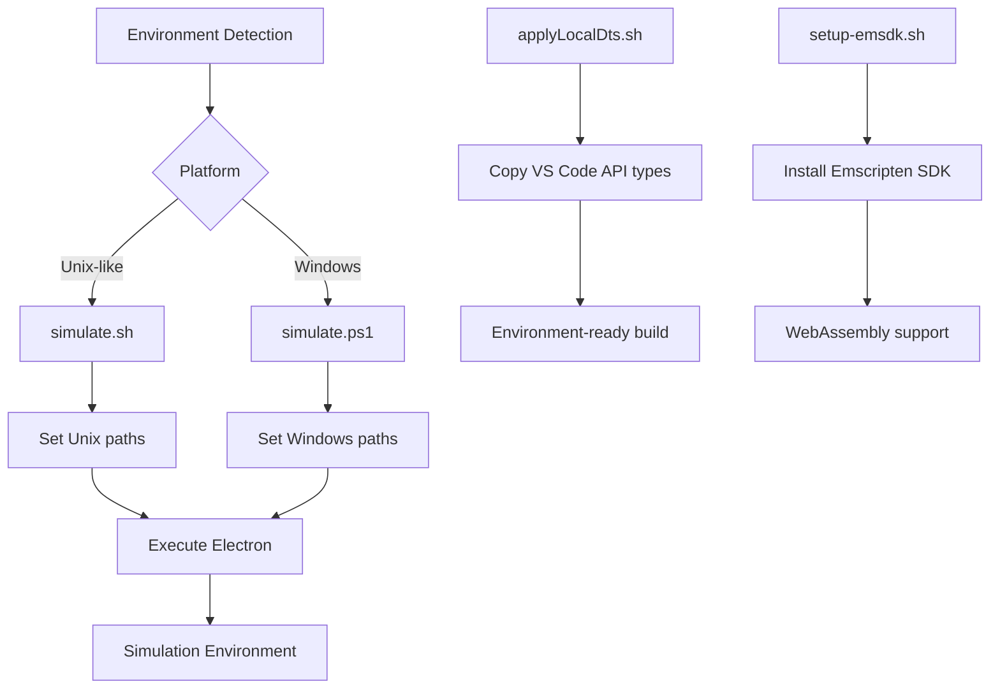

# Build Process

<cite>
**Referenced Files in This Document**   
- [package.json](file://package.json)
- [tsconfig.json](file://tsconfig.json)
- [vite.config.ts](file://vite.config.ts)
- [tsconfig.base.json](file://tsconfig.base.json)
- [chat-lib/tsconfig.json](file://chat-lib/tsconfig.json)
- [script/build/compressTikToken.ts](file://script/build/compressTikToken.ts)
- [script/build/copyStaticAssets.ts](file://script/build/copyStaticAssets.ts)
- [script/build/downloadBinary.ts](file://script/build/downloadBinary.ts)
- [script/build/extractChatLib.ts](file://script/build/extractChatLib.ts)
- [build/setup-emsdk.sh](file://build/setup-emsdk.sh)
- [script/applyLocalDts.sh](file://script/applyLocalDts.sh)
- [script/simulate.sh](file://script/simulate.sh)
- [script/simulate.ps1](file://script/simulate.ps1)
- [build/npm-package.yml](file://build/npm-package.yml)
- [build/release.yml](file://build/release.yml)
</cite>

## Table of Contents
1. [Introduction](#introduction)
2. [Build Script Overview](#build-script-overview)
3. [TypeScript Configuration](#typescript-configuration)
4. [Chat Library Extraction Process](#chat-library-extraction-process)
5. [Asset Compression and Binary Management](#asset-compression-and-binary-management)
6. [Static Asset Handling](#static-asset-handling)
7. [Environment-Specific Builds](#environment-specific-builds)
8. [Dependency Management](#dependency-management)
9. [CI/CD and Packaging](#cicd-and-packaging)
10. [Troubleshooting Common Build Issues](#troubleshooting-common-build-issues)
11. [Performance Optimization Tips](#performance-optimization-tips)

## Introduction
The vscode-copilot-chat extension build process is a comprehensive system that handles compilation, bundling, and packaging of the extension for deployment. The build system is designed to prepare the extension with all necessary assets, dependencies, and optimized code for efficient execution within the VS Code environment. This document details the various components of the build process, including the role of each build script, TypeScript configuration settings, environment-specific builds, dependency management, and artifact generation. The build process ensures that the extension is properly packaged with all required components, including the chat library, static assets, and binary dependencies, while maintaining code quality and performance standards.

**Section sources**
- [package.json](file://package.json#L1-L800)
- [tsconfig.json](file://tsconfig.json#L1-L40)

## Build Script Overview
The build process for the vscode-copilot-chat extension is orchestrated through a series of specialized scripts located in the `/script/build` directory. These scripts handle various aspects of the build process, from asset compression to dependency extraction. The build system is designed to be modular, with each script focusing on a specific task to ensure maintainability and clarity. The primary build scripts include `compressTikToken.ts` for compressing tokenizer files, `copyStaticAssets.ts` for managing static assets, `downloadBinary.ts` for handling binary dependencies, and `extractChatLib.ts` for extracting and preparing the chat library component. These scripts work together to create a complete build artifact that includes all necessary components for the extension to function properly in the VS Code environment.



**Diagram sources **
- [script/build/compressTikToken.ts](file://script/build/compressTikToken.ts#L1-L77)
- [script/build/copyStaticAssets.ts](file://script/build/copyStaticAssets.ts#L1-L19)
- [script/build/downloadBinary.ts](file://script/build/downloadBinary.ts#L1-L133)
- [script/build/extractChatLib.ts](file://script/build/extractChatLib.ts#L1-L842)

**Section sources**
- [script/build/compressTikToken.ts](file://script/build/compressTikToken.ts#L1-L77)
- [script/build/copyStaticAssets.ts](file://script/build/copyStaticAssets.ts#L1-L19)
- [script/build/downloadBinary.ts](file://script/build/downloadBinary.ts#L1-L133)
- [script/build/extractChatLib.ts](file://script/build/extractChatLib.ts#L1-L842)

## TypeScript Configuration
The TypeScript configuration for the vscode-copilot-chat extension is managed through multiple configuration files that work together to define the compilation settings for different parts of the project. The base configuration is defined in `tsconfig.base.json`, which establishes fundamental compiler options such as targeting ES2022, enabling strict type checking, and configuring module resolution. The main `tsconfig.json` file extends this base configuration and adds project-specific settings, including JSX compilation options and path mappings for module resolution. The chat library has its own `tsconfig.json` file that inherits from the base configuration while specifying output directory and declaration file generation settings. These configuration files work together to ensure consistent type checking and compilation across the entire codebase, with special attention to the unique requirements of the extension and its components.

```mermaid
classDiagram
class tsconfig.base.json {
+module : "commonjs"
+target : "es2022"
+lib : ["ES2022"]
+sourceMap : true
+strict : true
+esModuleInterop : true
+skipLibCheck : true
}
class tsconfig.json {
+extends : "./tsconfig.base.json"
+jsx : "react"
+jsxFactory : "vscpp"
+jsxFragmentFactory : "vscppf"
+rootDir : "."
+types : ["minimist", "mocha", "node", "picomatch", "sinon", "tar", "vscode"]
+paths : {"vscode" : ["./src/util/common/test/shims/vscodeTypesShim.ts"]}
}
class chatLibTsConfig {
+extends : "./tsconfig.base.json"
+outDir : "dist"
+declaration : true
+declarationMap : true
+types : ["node"]
+paths : {}
}
tsconfig.base.json <|-- tsconfig.json
tsconfig.base.json <|-- chatLibTsConfig
```

**Diagram sources **
- [tsconfig.base.json](file://tsconfig.base.json#L1-L23)
- [tsconfig.json](file://tsconfig.json#L1-L40)
- [chat-lib/tsconfig.json](file://chat-lib/tsconfig.json#L1-L22)

**Section sources**
- [tsconfig.base.json](file://tsconfig.base.json#L1-L23)
- [tsconfig.json](file://tsconfig.json#L1-L40)
- [chat-lib/tsconfig.json](file://chat-lib/tsconfig.json#L1-L22)

## Chat Library Extraction Process
The chat library extraction process is a critical component of the build system, implemented in the `extractChatLib.ts` script. This process is responsible for creating a standalone version of the chat library that can be used independently of the main extension. The extraction begins by identifying entry points in the codebase, including the main chat library file and various supporting files. The script then recursively analyzes dependencies, following import statements to identify all required files. During the extraction, the script performs several transformations to ensure the extracted library functions correctly in its new context. This includes rewriting import paths to use the new directory structure, updating path mappings in the TypeScript configuration, and copying necessary static files such as type definitions and tokenizer data. The process also validates the extracted module by compiling it with TypeScript to ensure there are no type errors or missing dependencies.



**Diagram sources **
- [script/build/extractChatLib.ts](file://script/build/extractChatLib.ts#L1-L842)

**Section sources**
- [script/build/extractChatLib.ts](file://script/build/extractChatLib.ts#L1-L842)

## Asset Compression and Binary Management
The build process includes specialized scripts for handling asset compression and binary dependencies. The `compressTikToken.ts` script is responsible for compressing tokenizer files used by the extension, converting them from a verbose text format to a more compact binary representation. This compression takes advantage of the monotonic increase in term lengths by using variable-length quantity encoding for lengths followed by the raw term data. The `downloadBinary.ts` script manages external binary dependencies, downloading them from specified URLs and verifying their integrity through SHA-256 checksums. This script handles the entire lifecycle of binary dependencies, including checking for existing files, downloading new versions when necessary, extracting compressed archives, and validating the downloaded content. These processes ensure that the extension has access to optimized assets and verified binary dependencies while minimizing the final package size.



**Diagram sources **
- [script/build/compressTikToken.ts](file://script/build/compressTikToken.ts#L1-L77)
- [script/build/downloadBinary.ts](file://script/build/downloadBinary.ts#L1-L133)

**Section sources**
- [script/build/compressTikToken.ts](file://script/build/compressTikToken.ts#L1-L77)
- [script/build/downloadBinary.ts](file://script/build/downloadBinary.ts#L1-L133)

## Static Asset Handling
Static asset handling in the build process is managed by the `copyStaticAssets.ts` script, which is responsible for copying specified files from their source locations to designated destination directories. This script operates by taking an array of source paths and a destination directory, then creating the necessary directory structure and copying each file to its new location. The process is designed to be efficient by using Promise.all to perform multiple copy operations in parallel. The script also ensures that the destination directory structure exists by creating it recursively if necessary. This functionality is essential for preparing the extension with all required static assets, such as images, configuration files, and other resources that need to be included in the final package but are not generated during the compilation process.

**Section sources**
- [script/build/copyStaticAssets.ts](file://script/build/copyStaticAssets.ts#L1-L19)

## Environment-Specific Builds
The build system supports environment-specific configurations through various scripts and configuration files. The `simulate.sh` and `simulate.ps1` scripts provide cross-platform support for running the extension in a simulation environment, with different implementations for Unix-like systems and Windows. These scripts detect the operating system and set appropriate paths for the Electron executable, ensuring consistent behavior across platforms. The `applyLocalDts.sh` script handles environment-specific type definition files by copying proposed VS Code API definitions to the appropriate location in the source tree. Additionally, the `setup-emsdk.sh` script configures the Emscripten SDK for WebAssembly compilation, which is necessary for certain components of the extension. These environment-specific scripts ensure that the build process can adapt to different development and deployment environments while maintaining consistency in the final output.



**Diagram sources **
- [script/simulate.sh](file://script/simulate.sh#L1-L22)
- [script/simulate.ps1](file://script/simulate.ps1#L1-L10)
- [script/applyLocalDts.sh](file://script/applyLocalDts.sh#L1-L6)
- [build/setup-emsdk.sh](file://build/setup-emsdk.sh#L1-L8)

**Section sources**
- [script/simulate.sh](file://script/simulate.sh#L1-L22)
- [script/simulate.ps1](file://script/simulate.ps1#L1-L10)
- [script/applyLocalDts.sh](file://script/applyLocalDts.sh#L1-L6)
- [build/setup-emsdk.sh](file://build/setup-emsdk.sh#L1-L8)

## Dependency Management
Dependency management in the vscode-copilot-chat extension is handled through a combination of npm packages and custom build scripts. The `package.json` file defines the project's dependencies, including development tools and runtime requirements. The build process includes specific steps to ensure dependency consistency between the main extension and the extracted chat library. During the chat library extraction process, the `updateChatLibDependencies` function synchronizes dependencies between the root `package.json` and the chat library's `package.json`, updating versions and removing obsolete dependencies. The system also manages transitive dependencies through the `package-lock.json` file, which is updated during the build process to reflect the current state of all dependencies. This comprehensive approach to dependency management ensures that both the extension and its components have access to the correct versions of all required packages.

**Section sources**
- [package.json](file://package.json#L1-L800)
- [script/build/extractChatLib.ts](file://script/build/extractChatLib.ts#L653-L797)

## CI/CD and Packaging
The continuous integration and deployment process for the vscode-copilot-chat extension is defined in GitHub Actions workflow files, including `npm-package.yml`, `pre-release.yml`, `release.yml`, and `update-assets.yml`. These workflows automate the build, testing, and packaging process, ensuring consistent and reliable releases. The CI/CD pipeline includes steps for installing dependencies, running tests, building the extension, and creating distribution packages. The `release.yml` workflow handles the final packaging and deployment process, generating the VSIX file that can be installed in VS Code. The `update-assets.yml` workflow manages the updating of static assets and dependencies, ensuring that the extension always includes the latest versions of required components. These automated processes reduce the risk of human error and ensure that every release meets the quality standards required for distribution.

**Section sources**
- [build/npm-package.yml](file://build/npm-package.yml)
- [build/release.yml](file://build/release.yml)
- [build/update-assets.yml](file://build/update-assets.yml)

## Troubleshooting Common Build Issues
Common build issues in the vscode-copilot-chat extension typically fall into several categories: dependency resolution problems, TypeScript compilation errors, and asset handling issues. For dependency issues, ensure that all required packages are installed by running `npm install` and verify that the `package-lock.json` file is up to date. TypeScript compilation errors can often be resolved by checking the `tsconfig.json` files for correct path mappings and ensuring that all imported modules are available. Asset handling problems may occur if the `copyStaticAssets.ts` script fails to create the necessary directory structure; verify that the source files exist and that the script has write permissions to the destination directory. Binary download failures can be addressed by checking network connectivity and verifying the integrity of downloaded files against their expected SHA-256 checksums. When troubleshooting, consult the build logs for specific error messages and use the validation steps in the build scripts to identify the source of the problem.

**Section sources**
- [script/build/downloadBinary.ts](file://script/build/downloadBinary.ts#L20-L43)
- [script/build/extractChatLib.ts](file://script/build/extractChatLib.ts#L822-L824)
- [script/build/compressTikToken.ts](file://script/build/compressTikToken.ts#L64-L65)

## Performance Optimization Tips
To optimize build performance for the vscode-copilot-chat extension, consider several strategies. First, leverage parallel execution by running independent build tasks simultaneously, such as asset copying and binary downloading. Implement caching for frequently used dependencies and build artifacts to avoid redundant operations. Optimize TypeScript compilation by ensuring that the `exclude` patterns in `tsconfig.json` properly exclude test fixtures and simulation data that don't need to be processed during compilation. For the chat library extraction process, minimize file I/O operations by batching copy operations and reducing the number of times files are read and written. Additionally, consider using incremental builds that only process changed files rather than rebuilding the entire project. These optimizations can significantly reduce build times, especially for large projects with many dependencies and assets.

**Section sources**
- [tsconfig.json](file://tsconfig.json#L28-L38)
- [vite.config.ts](file://vite.config.ts#L13-L16)
- [script/build/copyStaticAssets.ts](file://script/build/copyStaticAssets.ts#L12-L17)