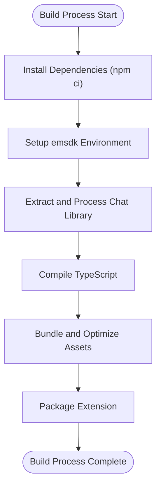
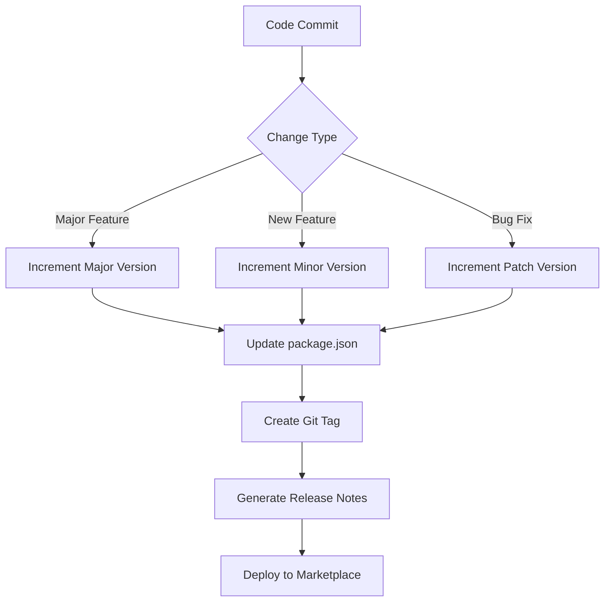
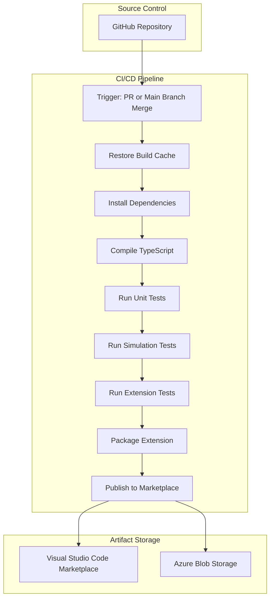
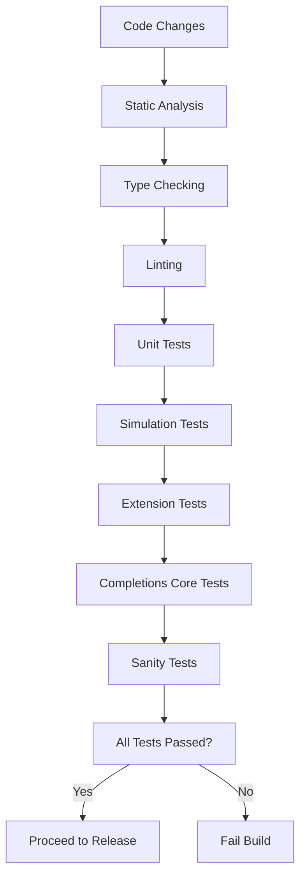

# Deployment and Release

<cite>
**Referenced Files in This Document**   
- [package.json](file://package.json)
- [CHANGELOG.md](file://CHANGELOG.md)
- [build/release.yml](file://build/release.yml)
- [build/pre-release.yml](file://build/pre-release.yml)
- [build/npm-package.yml](file://build/npm-package.yml)
- [build/update-assets.yml](file://build/update-assets.yml)
- [script/build/extractChatLib.ts](file://script/build/extractChatLib.ts)
- [script/build/compressTikToken.ts](file://script/build/compressTikToken.ts)
- [script/build/copyStaticAssets.ts](file://script/build/copyStaticAssets.ts)
- [script/build/downloadBinary.ts](file://script/build/downloadBinary.ts)
- [build/setup-emsdk.sh](file://build/setup-emsdk.sh)
- [vite.config.ts](file://vite.config.ts)
</cite>

## Table of Contents
1. [Introduction](#introduction)
2. [Build Process](#build-process)
3. [Release Cycle and Versioning](#release-cycle-and-versioning)
4. [Continuous Integration and Delivery Pipeline](#continuous-integration-and-delivery-pipeline)
5. [Quality Assurance Processes](#quality-assurance-processes)
6. [Release Channels Management](#release-channels-management)
7. [Emergency Patch Handling](#emergency-patch-handling)
8. [Release Notes and User Communication](#release-notes-and-user-communication)
9. [Post-Release Monitoring](#post-release-monitoring)
10. [Best Practices](#best-practices)

## Introduction
The vscode-copilot-chat extension follows a comprehensive deployment and release process designed to ensure high-quality, reliable releases to the Visual Studio Code Marketplace. This document details the complete workflow from build and compilation to release publication, including the continuous integration and delivery pipeline, quality assurance processes, and best practices for release management.

## Build Process
The build process for the vscode-copilot-chat extension involves several key steps including compilation, bundling, and packaging. The process is orchestrated through a combination of npm scripts and Azure Pipeline configurations.

The build process begins with dependency installation using `npm ci`, followed by TypeScript compilation and various build steps defined in the pipeline configuration. Key build scripts include:

- **TypeScript compilation**: The codebase is compiled using TypeScript with configuration defined in `tsconfig.json` and related files.
- **Asset extraction**: The `extractChatLib.ts` script extracts and processes the chat library components, copying necessary files and transforming imports to create a self-contained module.
- **Binary downloads**: The `downloadBinary.ts` script handles downloading and verifying external binaries with checksum validation.
- **Static asset copying**: The `copyStaticAssets.ts` script manages copying of static assets to their destination directories.
- **Token compression**: The `compressTikToken.ts` script compresses tiktoken files into a more compact binary format.

The build process also includes setting up the emsdk environment through the `setup-emsdk.sh` script, which installs and activates a specific version of the Emscripten SDK required for compilation.

**Diagram sources**
- [build/release.yml](file://build/release.yml#L40-L114)
- [script/build/extractChatLib.ts](file://script/build/extractChatLib.ts#L18-L68)
- [build/setup-emsdk.sh](file://build/setup-emsdk.sh#L1-L8)

**Section sources**
- [package.json](file://package.json#L114-L115)
- [build/release.yml](file://build/release.yml#L40-L114)
- [script/build/extractChatLib.ts](file://script/build/extractChatLib.ts#L18-L68)

## Release Cycle and Versioning
The vscode-copilot-chat extension follows a structured release cycle with regular updates and a clear versioning strategy. The versioning follows semantic versioning principles with major, minor, and patch increments based on the nature of changes.

The release cycle includes both stable releases and pre-releases, with pre-releases generated nightly from the main branch. The current version as indicated in package.json is 0.34.0, with a build number of 1.

The release process is triggered automatically when changes are merged to the main branch, with stable releases requiring manual approval through pipeline parameters. Pre-releases are scheduled to run automatically on weekdays at 4:00 AM.

The versioning strategy is reflected in the CHANGELOG.md file, which documents changes for each version with detailed release notes organized by version number and release date. Each release entry includes categorized changes such as new features, improvements, and bug fixes.

**Diagram sources**
- [package.json](file://package.json#L5)
- [CHANGELOG.md](file://CHANGELOG.md#L1-L800)
- [build/release.yml](file://build/release.yml#L1-L2)

**Section sources**
- [package.json](file://package.json#L5)
- [CHANGELOG.md](file://CHANGELOG.md#L1-L800)

## Continuous Integration and Delivery Pipeline
The continuous integration and delivery pipeline for the vscode-copilot-chat extension is implemented using Azure Pipelines with configurations defined in YAML files. The pipeline architecture consists of multiple pipeline definitions that handle different aspects of the release process.

The primary pipeline configurations include:

- **release.yml**: Handles stable releases to the Visual Studio Code Marketplace, triggered by merges to the main branch.
- **pre-release.yml**: Manages pre-release builds with a nightly schedule running Monday through Friday at 4:00 AM.
- **npm-package.yml**: Responsible for publishing the npm package, triggered both by pull requests and on a nightly schedule.
- **update-assets.yml**: Handles the deployment of walkthrough assets to Azure Blob Storage.

The CI/CD pipeline includes comprehensive build and test steps executed across multiple platforms (Linux, macOS, and Windows). The build process includes dependency installation, TypeScript compilation, and various build steps. Testing includes unit tests, simulation tests, extension tests, and sanity tests executed using VS Code.

The pipeline incorporates caching mechanisms to improve build performance, with a cache key that includes the build salt, setup script, and package lock file. This ensures that dependencies are only reinstalled when necessary, significantly reducing build times.

**Diagram sources**
- [build/release.yml](file://build/release.yml#L1-L236)
- [build/pre-release.yml](file://build/pre-release.yml#L1-L233)
- [build/npm-package.yml](file://build/npm-package.yml#L1-L88)

**Section sources**
- [build/release.yml](file://build/release.yml#L1-L236)
- [build/pre-release.yml](file://build/pre-release.yml#L1-L233)

## Quality Assurance Processes
The quality assurance processes for the vscode-copilot-chat extension are comprehensive and integrated into the CI/CD pipeline. The testing strategy includes multiple layers of automated testing to ensure code quality and functionality.

The primary testing components include:

- **Unit tests**: Implemented using vitest, these tests validate individual functions and components in isolation.
- **Simulation tests**: Execute through the `simulate-ci` script, these tests simulate real-world usage scenarios and user interactions.
- **Extension tests**: Run using VS Code, these tests validate the extension's integration with the editor environment.
- **Completions Core prompt tests**: Specifically test the prompt handling and response generation functionality.
- **Sanity tests**: Verify basic functionality and integration points.

The test execution is orchestrated through the Azure Pipeline configuration, with test steps defined in both the release and pre-release pipelines. Tests are executed across multiple platforms (Linux, macOS, and Windows) to ensure cross-platform compatibility.

The pipeline also includes type checking (`npm run typecheck`) and linting (`npm run lint`) as part of the quality assurance process, ensuring code quality and adherence to coding standards.

**Diagram sources**
- [build/release.yml](file://build/release.yml#L125-L225)
- [package.json](file://package.json#L114-L115)

**Section sources**
- [build/release.yml](file://build/release.yml#L125-L225)
- [package.json](file://package.json#L114-L115)

## Release Channels Management
The vscode-copilot-chat extension manages multiple release channels to support different user needs and testing requirements. The primary release channels are:

- **Stable channel**: Production releases distributed through the Visual Studio Code Marketplace, intended for general users.
- **Pre-release channel**: Nightly builds generated from the main branch, intended for early adopters and testing.

The release channel management is controlled through the pipeline configuration files. The stable channel is managed by the `release.yml` pipeline, which requires manual approval to publish extensions. The pre-release channel is managed by the `pre-release.yml` pipeline, which runs on a nightly schedule and can be configured to automatically publish pre-releases.

The npm package is also published to different channels based on the release type, with prereleases tagged with the "next" tag in the npm registry. This allows users to opt into pre-release versions if desired.

The pipeline parameters provide control over which channels receive updates, with boolean parameters to enable or disable publishing to specific channels.

## Emergency Patch Handling
The emergency patch handling process for the vscode-copilot-chat extension follows the standard release pipeline but with expedited approval and deployment. Emergency patches are treated as high-priority releases and bypass the normal scheduling.

The process for emergency patches includes:

1. Creating a hotfix branch from the latest stable release tag
2. Implementing and testing the critical fix
3. Manually triggering the release pipeline with the publish extension parameter enabled
4. Rapid validation and deployment to the Visual Studio Code Marketplace
5. Communication of the patch to users through release notes and notifications

The pipeline structure supports emergency patches by allowing manual triggering of releases outside the normal schedule. The build and test processes remain the same to ensure quality, but the approval process is streamlined for critical fixes.

## Release Notes and User Communication
Release notes for the vscode-copilot-chat extension are maintained in the CHANGELOG.md file, which follows a structured format with version numbers, release dates, and categorized changes. Each release entry includes detailed descriptions of new features, improvements, and bug fixes.

The release notes are organized by version, with the most recent release at the top. Each section includes subsections for different feature areas such as Chat, MCP, Accessibility, and others. Changes are described with sufficient detail to inform users of new capabilities and improvements.

User communication is facilitated through multiple channels:
- Release notes in the Visual Studio Code Marketplace
- Documentation updates
- In-product notifications for significant changes
- GitHub repository updates

The release notes include links to screenshots and videos that demonstrate new features, providing visual context for users. The notes also reference related documentation and settings that users may need to configure.

## Post-Release Monitoring
Post-release monitoring for the vscode-copilot-chat extension includes several mechanisms to ensure stability and identify issues:

- **User feedback collection**: Monitoring user reviews and feedback in the Visual Studio Code Marketplace
- **Error reporting**: Collection and analysis of error reports from extension users
- **Usage telemetry**: Analysis of feature usage patterns to identify potential issues
- **Performance monitoring**: Tracking extension performance metrics

The team monitors GitHub issues and discussions for reports of problems with new releases. Critical issues are prioritized for immediate investigation and resolution. The monitoring process helps identify patterns in user-reported issues and guides the development of emergency patches when necessary.

## Best Practices
The deployment and release process for the vscode-copilot-chat extension follows several best practices to ensure reliability and quality:

1. **Automated testing**: Comprehensive test coverage integrated into the CI/CD pipeline
2. **Caching**: Implementation of build caching to reduce pipeline execution time
3. **Cross-platform testing**: Validation on all supported platforms (Linux, macOS, Windows)
4. **Version control**: Strict versioning and tagging practices
5. **Security**: Secure handling of secrets through Azure Key Vault
6. **Documentation**: Maintaining detailed release notes and changelogs
7. **Staged releases**: Using pre-release channels to validate changes before stable release
8. **Monitoring**: Comprehensive post-release monitoring and feedback collection

These practices ensure that the extension maintains high quality and reliability while enabling rapid iteration and improvement.