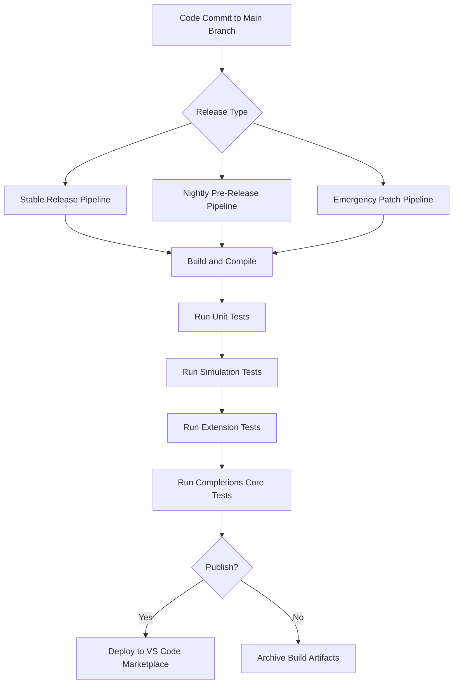
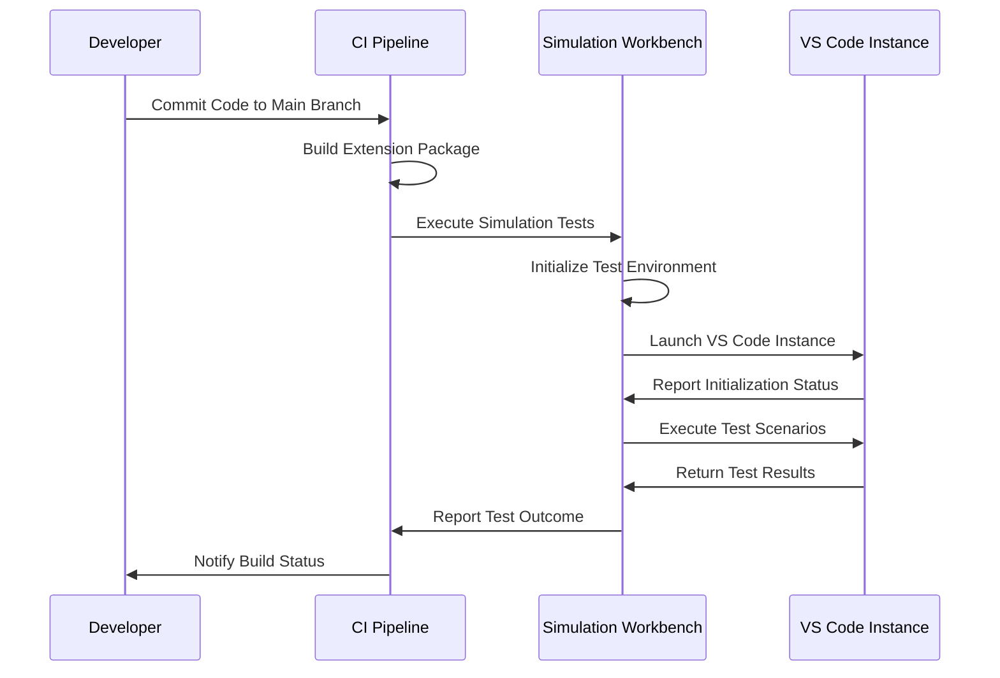

# Release Cycle

<cite>
**Referenced Files in This Document**   
- [package.json](file://package.json)
- [CHANGELOG.md](file://CHANGELOG.md)
- [README.md](file://README.md)
- [build/release.yml](file://build/release.yml)
- [build/pre-release.yml](file://build/pre-release.yml)
- [build/npm-package.yml](file://build/npm-package.yml)
- [script/simulate.sh](file://script/simulate.sh)
- [script/simulate.ps1](file://script/simulate.ps1)
- [script/electron/simulationWorkbenchMain.js](file://script/electron/simulationWorkbenchMain.js)
- [script/postinstall.ts](file://script/postinstall.ts)
- [chat-lib/script/postinstall.ts](file://chat-lib/script/postinstall.ts)
</cite>

## Table of Contents
1. [Introduction](#introduction)
2. [Release Types and Versioning](#release-types-and-versioning)
3. [Release Pipeline and Automation](#release-pipeline-and-automation)
4. [Testing and Quality Assurance](#testing-and-quality-assurance)
5. [Release Candidate Validation](#release-candidate-validation)
6. [Preview vs Stable Releases](#preview-vs-stable-releases)
7. [Emergency Patch Management](#emergency-patch-management)
8. [User Communication and Release Announcements](#user-communication-and-release-announcements)
9. [Rollback Procedures](#rollback-procedures)
10. [Release Integrity and Verification](#release-integrity-and-verification)

## Introduction
The vscode-copilot-chat extension follows a structured release cycle that ensures high-quality, reliable updates for users. This document details the comprehensive workflow from development to production release, covering testing phases, quality assurance processes, approval mechanisms, and user communication strategies. The release process is designed to maintain the integrity of the extension while enabling rapid iteration and deployment of new features and improvements.

## Release Types and Versioning
The vscode-copilot-chat extension employs a semantic versioning system with three main release types: stable, pre-release, and emergency patches. The versioning follows the pattern MAJOR.MINOR.PATCH, with the current version at 0.34.0 as indicated in the package.json file. Stable releases are published monthly and contain thoroughly tested features and bug fixes. Pre-release versions are generated nightly from the main branch and serve as preview builds for early adopters and testing. Emergency patches are released as needed to address critical issues or security vulnerabilities. The release cycle is closely aligned with VS Code's release schedule, ensuring compatibility with the latest VS Code versions.

**Section sources**
- [package.json](file://package.json#L5)
- [CHANGELOG.md](file://CHANGELOG.md#L1)

## Release Pipeline and Automation
The release process for vscode-copilot-chat is fully automated through Azure Pipelines, with distinct workflows for stable releases, pre-releases, and npm package publishing. The build/release.yml configuration defines the stable release pipeline, which triggers on commits to the main branch. This pipeline includes comprehensive build steps, testing, and optional publishing to the VS Code Marketplace. The build/pre-release.yml configuration establishes a nightly release schedule that runs Monday through Friday, automatically generating pre-release builds for testing and validation. The build/npm-package.yml configuration manages the npm package publishing process, including automated versioning and tagging. All pipelines share common infrastructure for dependency management, caching, and security checks, ensuring consistency across release types.

**Diagram sources **
- [build/release.yml](file://build/release.yml)
- [build/pre-release.yml](file://build/pre-release.yml)
- [build/npm-package.yml](file://build/npm-package.yml)

**Section sources**
- [build/release.yml](file://build/release.yml)
- [build/pre-release.yml](file://build/pre-release.yml)
- [build/npm-package.yml](file://build/npm-package.yml)

## Testing and Quality Assurance
The vscode-copilot-chat extension employs a multi-layered testing strategy to ensure quality and reliability. The test suite includes unit tests, integration tests, simulation tests, and end-to-end tests. Unit tests validate individual components and functions, while integration tests verify the interaction between different modules. Simulation tests, executed through the simulation framework, validate complex AI-driven workflows and agent behaviors in realistic scenarios. Extension tests run within VS Code to verify the integration and functionality of the extension in its actual environment. The test:unit, test:extension, test:completions-core, and test:sanity npm scripts coordinate the execution of these test suites, ensuring comprehensive coverage before release.

**Section sources**
- [build/release.yml](file://build/release.yml#L209-L225)
- [package.json](file://package.json)

## Release Candidate Validation
Release candidates for vscode-copilot-chat undergo rigorous validation through simulation scripts and post-installation checks. The simulation framework, accessible via the simulate.sh and simulate.ps1 scripts, launches an Electron-based workbench that executes comprehensive test scenarios. These simulations validate AI agent behaviors, code generation accuracy, and integration with VS Code features. The simulationWorkbenchMain.js file orchestrates the test execution, managing child processes and collecting results. Post-installation checks verify that all required assets are properly deployed and that the extension initializes correctly. The validation process includes automated checks for performance, memory usage, and error conditions, ensuring that release candidates meet quality standards before promotion to stable release.

**Diagram sources **
- [script/simulate.sh](file://script/simulate.sh)
- [script/simulate.ps1](file://script/simulate.ps1)
- [script/electron/simulationWorkbenchMain.js](file://script/electron/simulationWorkbenchMain.js)

**Section sources**
- [script/simulate.sh](file://script/simulate.sh)
- [script/simulate.ps1](file://script/simulate.ps1)
- [script/electron/simulationWorkbenchMain.js](file://script/electron/simulationWorkbenchMain.js)

## Preview vs Stable Releases
The vscode-copilot-chat extension maintains a clear distinction between preview and stable releases to balance innovation with reliability. Preview releases, generated nightly from the main branch, provide early access to new features and improvements for testing and feedback. These builds are published with the "next" tag on npm and are available to users who opt into pre-releases. Stable releases, published monthly, contain features and fixes that have undergone extensive testing and validation. The release process includes mechanisms to prevent accidental promotion of unstable code, with manual approval required for stable releases. Users can choose their preferred release channel based on their tolerance for potential instability versus desire for the latest features.

**Section sources**
- [build/pre-release.yml](file://build/pre-release.yml)
- [build/release.yml](file://build/release.yml)
- [build/npm-package.yml](file://build/npm-package.yml)

## Emergency Patch Management
The emergency patch management process for vscode-copilot-chat is designed to rapidly address critical issues while maintaining release integrity. When a critical bug or security vulnerability is identified, a dedicated hotfix branch is created from the latest stable release tag. The fix is developed, tested, and validated in isolation before being merged and released as a patch version. The process bypasses the normal nightly pre-release cycle to ensure rapid deployment, but retains essential quality checks including unit tests, simulation tests, and extension tests. Emergency patches are communicated clearly to users, highlighting the nature of the issue and the importance of updating. The process is documented and rehearsed to ensure team readiness for rapid response.

**Section sources**
- [build/release.yml](file://build/release.yml)
- [CHANGELOG.md](file://CHANGELOG.md)

## User Communication and Release Announcements
User communication for vscode-copilot-chat releases follows a structured approach to ensure transparency and awareness. Release announcements are published through multiple channels including the VS Code blog, GitHub repository, and in-product notifications. The CHANGELOG.md file provides detailed release notes for each version, documenting new features, improvements, and bug fixes. For major releases, accompanying documentation and tutorials are published to help users understand and leverage new capabilities. The communication strategy includes advance notice for breaking changes and deprecations, allowing users to prepare for updates. Feedback mechanisms are prominently featured, encouraging users to report issues and suggest improvements.

**Section sources**
- [CHANGELOG.md](file://CHANGELOG.md)
- [README.md](file://README.md)

## Rollback Procedures
The rollback procedures for vscode-copilot-chat are designed to quickly restore service in case of critical issues with a release. The extension maintains compatibility with previous versions, allowing users to manually install an older version if needed. The VS Code Marketplace provides access to previous extension versions, and the release pipeline archives build artifacts for recovery purposes. In cases where a rollback is necessary, a communication plan is executed to inform users of the issue and provide instructions for reverting to a stable version. The team monitors rollback rates and feedback to assess the effectiveness of the rollback and inform future release decisions. Post-rollback analysis is conducted to understand the root cause and prevent recurrence.

**Section sources**
- [build/release.yml](file://build/release.yml)
- [README.md](file://README.md)

## Release Integrity and Verification
Release integrity for vscode-copilot-chat is maintained through automated checks and manual verification processes. Automated checks include code signing, vulnerability scanning, and compliance verification against Microsoft's security and privacy standards. The build process incorporates dependency validation to prevent supply chain attacks and ensure the integrity of third-party components. Manual verification includes code reviews, security assessments, and quality assurance testing by the engineering team. The release pipeline integrates with Microsoft's Trust Services Authority (TSA) for additional security validation. Before publication, final verification is performed by release managers to confirm that all checks have passed and the release meets quality standards.

**Section sources**
- [build/release.yml](file://build/release.yml#L227-L231)
- [CodeQL.yml](file://CodeQL.yml)