# Building and Testing

<cite>
**Referenced Files in This Document**   
- [package.json](file://package.json)
- [chat-lib/package.json](file://chat-lib/package.json)
- [script/build/extractChatLib.ts](file://script/build/extractChatLib.ts)
- [script/build/copyStaticAssets.ts](file://script/build/copyStaticAssets.ts)
- [script/build/downloadBinary.ts](file://script/build/downloadBinary.ts)
- [script/build/compressTikToken.ts](file://script/build/compressTikToken.ts)
- [script/simulate.sh](file://script/simulate.sh)
- [script/simulate.ps1](file://script/simulate.ps1)
- [test/simulationMain.ts](file://test/simulationMain.ts)
- [chat-lib/vitest.config.ts](file://chat-lib/vitest.config.ts)
- [chat-lib/test/getInlineCompletions.spec.ts](file://chat-lib/test/getInlineCompletions.spec.ts)
- [script/test/scoredEditsReconciler.spec.ts](file://script/test/scoredEditsReconciler.spec.ts)
</cite>

## Table of Contents
1. [Introduction](#introduction)
2. [Build Pipeline](#build-pipeline)
3. [Testing Infrastructure](#testing-infrastructure)
4. [Running Tests](#running-tests)
5. [Writing and Organizing Tests](#writing-and-organizing-tests)
6. [Code Coverage and Quality Gates](#code-coverage-and-quality-gates)
7. [Validation and Complete Cycle](#validation-and-complete-cycle)
8. [Testing Utilities](#testing-utilities)
9. [Conclusion](#conclusion)

## Introduction
The vscode-copilot-chat extension employs a comprehensive build and testing infrastructure to ensure high-quality development and reliable functionality. This document details the build pipeline, testing frameworks, and validation processes used in the project. The system is designed to support both local development and continuous integration workflows, with a focus on reproducibility, performance, and code quality.

**Section sources**
- [package.json](file://package.json#L1-L5257)

## Build Pipeline

### Compilation and Asset Processing
The build pipeline for the vscode-copilot-chat extension is defined in the `package.json` file and consists of several key scripts that handle compilation, asset processing, and packaging. The primary build command is executed through the `build` script, which invokes the `.esbuild.ts` configuration file to compile the TypeScript codebase into JavaScript.

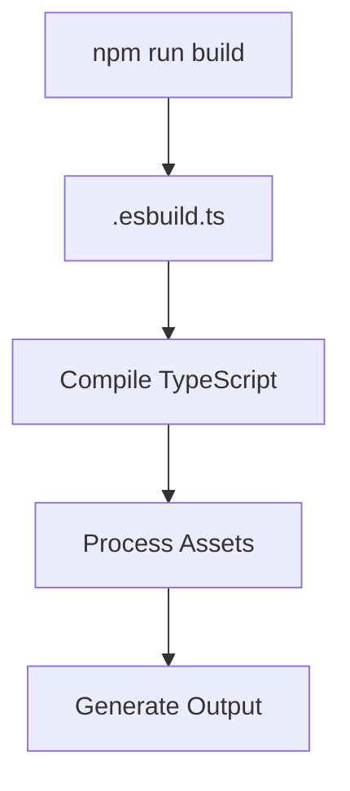

**Diagram sources**
- [package.json](file://package.json#L5090)
- [.esbuild.ts](file://.esbuild.ts)

The build process begins with the `build` script in `package.json`, which calls `tsx .esbuild.ts` to execute the build configuration. This script is responsible for compiling the TypeScript codebase into JavaScript, processing static assets, and generating the final output files. The build process is optimized for both development and production environments, with different configurations for each.

### Static Asset Management
Static assets are managed through the `copyStaticAssets.ts` script located in the `script/build` directory. This script is responsible for copying static files from their source locations to the appropriate destination directories. The script uses Node.js's `fs` module to create directories and copy files, ensuring that the file structure is maintained during the copy process.

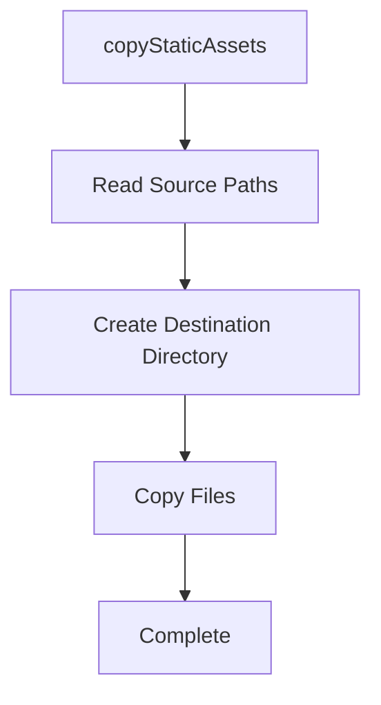

**Diagram sources**
- [script/build/copyStaticAssets.ts](file://script/build/copyStaticAssets.ts#L1-L19)

The `copyStaticAssets` function takes an array of source paths and a destination directory as parameters. It iterates over the source paths, resolves the full path for each file, creates the necessary directory structure in the destination, and copies the file. This ensures that all static assets are correctly placed in the output directory, ready for use in the extension.

### Binary Dependencies and Compression
The build process also includes handling binary dependencies and compressing certain files for efficiency. The `downloadBinary.ts` script is responsible for downloading and verifying binary files, such as the Electron runtime, which are required for the extension to function. This script ensures that the downloaded binaries match the expected checksums, providing a secure and reliable way to include external dependencies.

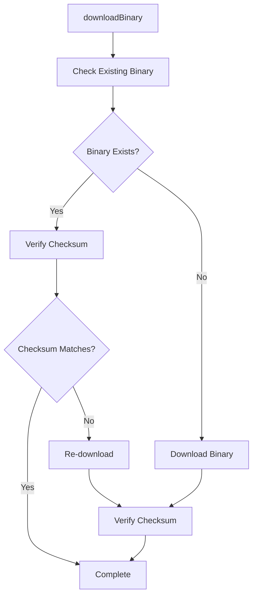

**Diagram sources**
- [script/build/downloadBinary.ts](file://script/build/downloadBinary.ts#L1-L133)

Additionally, the `compressTikToken.ts` script is used to compress `.tiktoken` files into a more compact binary format. This compression takes advantage of the fact that term lengths increase monotonically with their index, representing each term with a variable-length quantity (VLQ)-encoded length followed by the term itself. This optimization reduces the size of the token files, improving load times and reducing memory usage.

**Section sources**
- [script/build/downloadBinary.ts](file://script/build/downloadBinary.ts#L1-L133)
- [script/build/compressTikToken.ts](file://script/build/compressTikToken.ts#L1-L77)

### Chat Library Extraction
The `extractChatLib.ts` script is a crucial part of the build process, responsible for extracting and packaging the chat library used by the extension. This script follows imports from the main chat-lib file, processes entry points and their dependencies, and copies all processed files to the target directory. It also generates module files and validates the module to ensure that all required files are present and correctly configured.

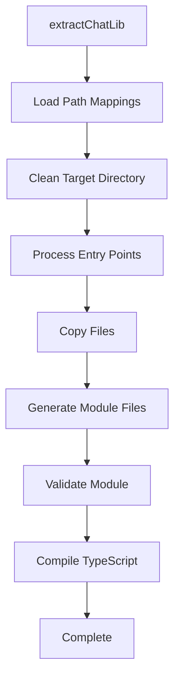

**Diagram sources**
- [script/build/extractChatLib.ts](file://script/build/extractChatLib.ts#L1-L842)

The extraction process begins by loading path mappings from the `tsconfig.json` file, which defines how module imports are resolved. The target directory is then cleaned to ensure a fresh build. The script processes entry points and their dependencies, recursively following imports to include all necessary files. After copying the files, it generates module files, validates the module, and compiles the TypeScript code to ensure that the extracted library is functional and error-free.

**Section sources**
- [script/build/extractChatLib.ts](file://script/build/extractChatLib.ts#L1-L842)

## Testing Infrastructure

### Test Framework and Configuration
The testing infrastructure for the vscode-copilot-chat extension is built around the Vitest framework, which is used for unit and integration testing. The `chat-lib` package includes its own `vitest.config.ts` file, which configures the test environment and specifies the test files to be included. This configuration ensures that tests are run in a consistent and isolated environment, with access to the necessary dependencies and utilities.

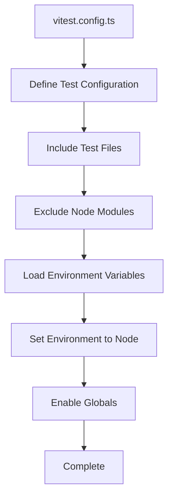

**Diagram sources**
- [chat-lib/vitest.config.ts](file://chat-lib/vitest.config.ts#L1-L21)

The `vitest.config.ts` file defines the test configuration, including the test files to be included and excluded. It loads environment variables from the project root, sets the test environment to Node.js, and enables global variables for convenience. This configuration ensures that tests are run in a consistent and predictable environment, with access to the necessary dependencies and utilities.

### Test Organization and Structure
Tests are organized into various directories based on their purpose and scope. The `chat-lib` package contains unit tests for the core functionality of the chat library, while the `script` directory includes tests for build and utility scripts. The `src/extension` directory contains integration and end-to-end tests for the extension's features, ensuring that all components work together as expected.

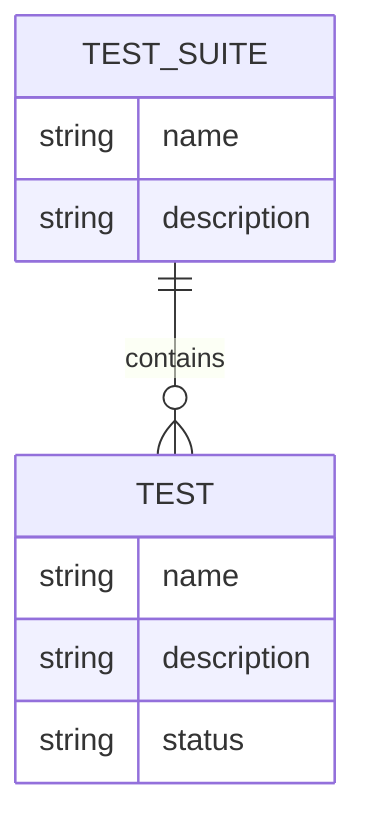

**Diagram sources**
- [chat-lib/test/getInlineCompletions.spec.ts](file://chat-lib/test/getInlineCompletions.spec.ts#L1-L100)
- [script/test/scoredEditsReconciler.spec.ts](file://script/test/scoredEditsReconciler.spec.ts#L1-L827)

The test organization follows a clear structure, with each test suite containing multiple test cases. Each test case is designed to verify a specific aspect of the functionality, ensuring that the code behaves as expected under various conditions. This modular approach makes it easy to add new tests and maintain existing ones, promoting a robust and reliable testing process.

**Section sources**
- [chat-lib/vitest.config.ts](file://chat-lib/vitest.config.ts#L1-L21)
- [chat-lib/test/getInlineCompletions.spec.ts](file://chat-lib/test/getInlineCompletions.spec.ts#L1-L100)
- [script/test/scoredEditsReconciler.spec.ts](file://script/test/scoredEditsReconciler.spec.ts#L1-L827)

## Running Tests

### Test Execution Commands
The project provides several npm scripts for running different types of tests. The `test` script in `package.json` runs all tests, while more specific scripts allow for targeted testing. For example, `test:unit` runs unit tests using Vitest, and `test:extension` runs extension-specific tests using the `vscode-test` framework.

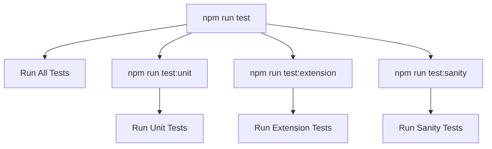

**Diagram sources**
- [package.json](file://package.json#L5101-L5105)

The `test:unit` script runs unit tests using Vitest with the `--run --pool=forks` options, which execute tests in parallel for improved performance. The `test:extension` script uses the `vscode-test` framework to run tests in the context of a VS Code extension, ensuring that the extension's features work correctly in the target environment. The `test:sanity` script runs a minimal set of tests to quickly verify that the basic functionality is working.

### Simulation Framework
The simulation framework is a key component of the testing infrastructure, allowing for end-to-end testing of the extension's features. The `simulate` script in `package.json` runs the simulation framework, which simulates user interactions with the extension and verifies that the expected outcomes are achieved. This framework is particularly useful for testing complex workflows and edge cases that are difficult to cover with unit tests alone.

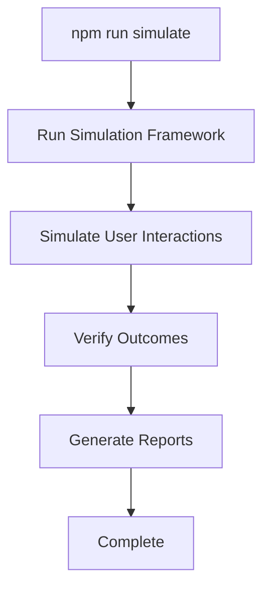

**Diagram sources**
- [package.json](file://package.json#L5110)
- [test/simulationMain.ts](file://test/simulationMain.ts#L1-L978)

The simulation framework is implemented in the `test/simulationMain.ts` file, which orchestrates the execution of simulation tests. It loads test scenarios, runs them in a simulated environment, and verifies the outcomes against expected results. The framework supports various test modes, including baseline comparisons and performance testing, making it a versatile tool for comprehensive testing.

**Section sources**
- [package.json](file://package.json#L5101-L5114)
- [test/simulationMain.ts](file://test/simulationMain.ts#L1-L978)

## Writing and Organizing Tests

### Test Conventions and Best Practices
When writing tests for the vscode-copilot-chat extension, it is important to follow the project's conventions and best practices. Tests should be organized into logical suites based on their purpose, with clear and descriptive names that indicate what is being tested. Each test should be self-contained and independent, avoiding dependencies on other tests to ensure reliable and repeatable results.

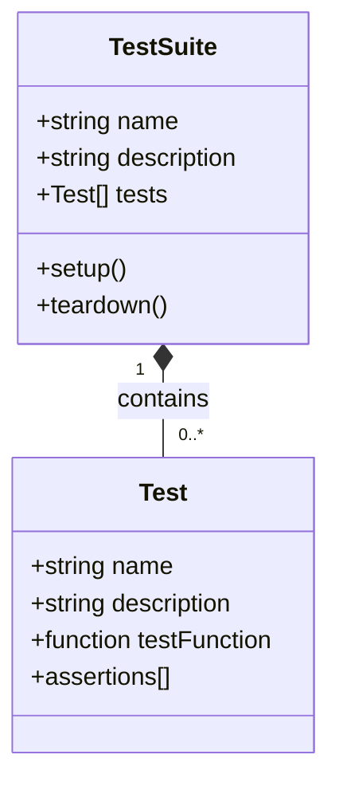

**Diagram sources**
- [chat-lib/test/getInlineCompletions.spec.ts](file://chat-lib/test/getInlineCompletions.spec.ts#L1-L100)
- [script/test/scoredEditsReconciler.spec.ts](file://script/test/scoredEditsReconciler.spec.ts#L1-L827)

Test suites should include setup and teardown methods to initialize and clean up the test environment, ensuring that each test runs in a consistent state. Assertions should be clear and specific, verifying the expected outcomes with minimal assumptions. This approach promotes maintainable and reliable tests that are easy to understand and modify.

### Test File Organization
Test files are organized into directories based on their scope and purpose. Unit tests for the `chat-lib` package are located in the `chat-lib/test` directory, while integration and end-to-end tests for the extension are in the `src/extension` directory. Utility and build script tests are in the `script/test` directory, ensuring that all test files are logically grouped and easy to locate.

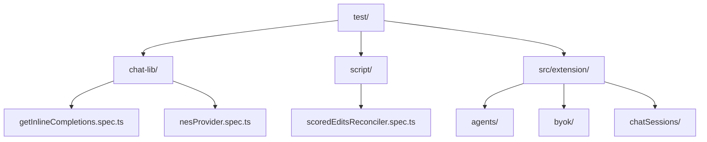

**Diagram sources**
- [chat-lib/test/](file://chat-lib/test/)
- [script/test/](file://script/test/)
- [src/extension/](file://src/extension/)

This organization makes it easy to navigate the test suite and find relevant tests for a specific component or feature. It also facilitates the addition of new tests, as developers can follow the existing structure and conventions to ensure consistency across the codebase.

**Section sources**
- [chat-lib/test/getInlineCompletions.spec.ts](file://chat-lib/test/getInlineCompletions.spec.ts#L1-L100)
- [script/test/scoredEditsReconciler.spec.ts](file://script/test/scoredEditsReconciler.spec.ts#L1-L827)

## Code Coverage and Quality Gates

### Coverage Analysis
Code coverage is an important metric for assessing the quality and completeness of the test suite. The project uses the `@vitest/coverage-v8` plugin to generate coverage reports, which provide detailed information about which parts of the code are covered by tests. These reports help identify areas that need additional testing and ensure that the test suite is comprehensive.

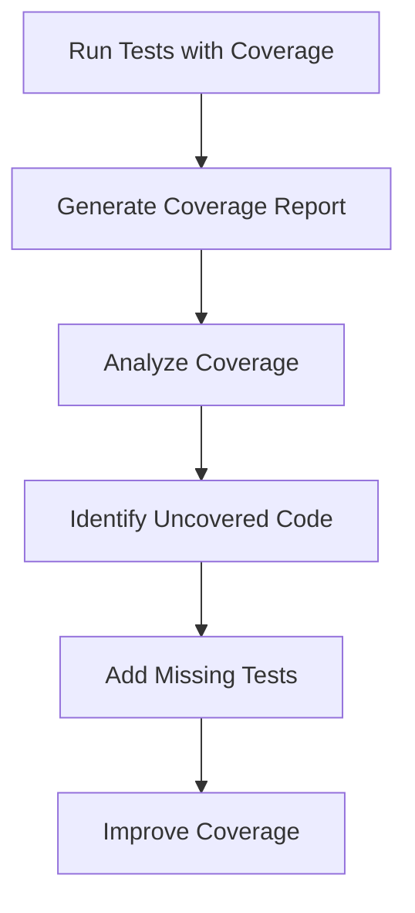

**Diagram sources**
- [package.json](file://package.json#L5159)
- [vitest.config.ts](file://vitest.config.ts)

The coverage analysis is integrated into the build process, with coverage reports generated automatically when tests are run. Developers can use these reports to identify uncovered code and add missing tests, ensuring that the test suite is comprehensive and reliable. The goal is to achieve high coverage across all critical components, with a focus on edge cases and error handling.

### Quality Gates
Quality gates are used to enforce code quality standards and prevent the introduction of regressions. The project includes several quality gates, such as linting, type checking, and test coverage requirements, which must be passed before code can be merged. These gates ensure that the codebase remains clean, maintainable, and free of common issues.

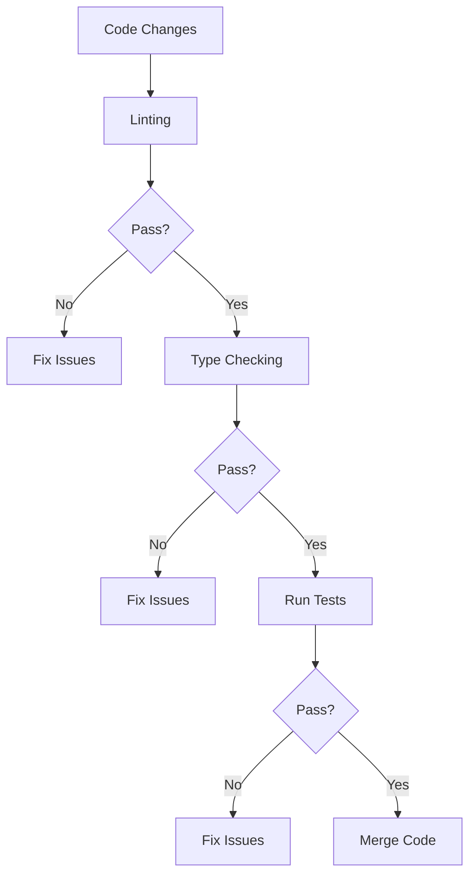

**Diagram sources**
- [package.json](file://package.json#L5098-L5100)
- [tsconfig.json](file://tsconfig.json)

The quality gates are enforced through npm scripts and CI/CD pipelines, ensuring that all code changes are thoroughly vetted before being merged. Linting checks for code style and potential issues, type checking ensures that the code is type-safe, and test coverage requirements ensure that new code is adequately tested. These gates help maintain a high standard of code quality and prevent the introduction of bugs and regressions.

**Section sources**
- [package.json](file://package.json#L5098-L5100)
- [tsconfig.json](file://tsconfig.json)

## Validation and Complete Cycle

### Complete Build-Test Cycle
The complete build-test cycle is a critical part of the development process, ensuring that changes are validated through a comprehensive series of steps. This cycle begins with the build process, which compiles the code and processes assets, followed by the execution of tests to verify functionality. The cycle concludes with the generation of coverage reports and the enforcement of quality gates, ensuring that the code meets all requirements.

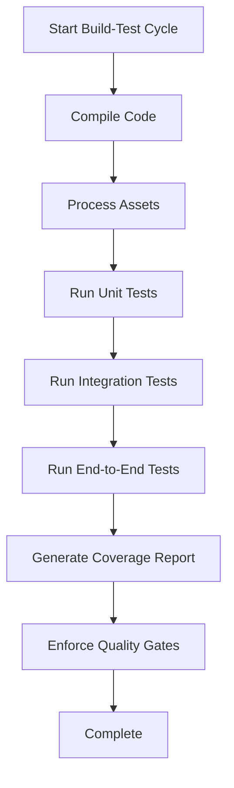

**Diagram sources**
- [package.json](file://package.json#L5090-L5114)
- [test/simulationMain.ts](file://test/simulationMain.ts#L1-L978)

The build-test cycle is designed to be fast and efficient, with parallel execution of tests and incremental builds to minimize wait times. This allows developers to quickly validate their changes and receive feedback, promoting a rapid development cycle. The cycle is also integrated into CI/CD pipelines, ensuring that all changes are thoroughly tested before being deployed.

### Continuous Integration
Continuous integration (CI) is an essential part of the development process, ensuring that changes are automatically tested and validated. The project uses CI pipelines to run the build-test cycle on every commit, providing immediate feedback on the impact of changes. This helps catch issues early and prevents the introduction of regressions.

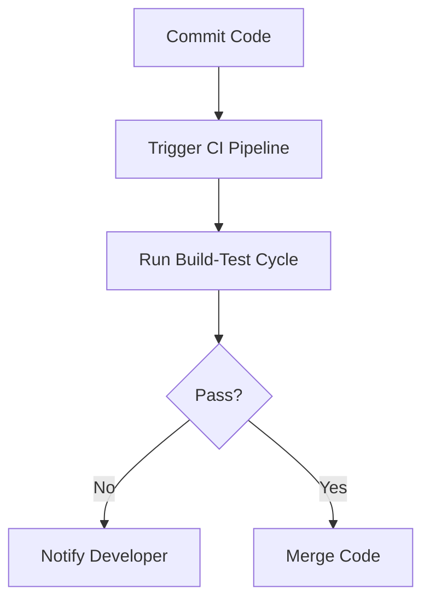

**Diagram sources**
- [package.json](file://package.json#L5112)
- [test/simulationMain.ts](file://test/simulationMain.ts#L1-L978)

The CI pipeline runs the complete build-test cycle, including compilation, asset processing, and all types of tests. It also generates coverage reports and enforces quality gates, ensuring that the code meets all requirements. If any step fails, the pipeline notifies the developer, allowing them to address the issue before merging the code. This automated process helps maintain a high standard of code quality and reliability.

**Section sources**
- [package.json](file://package.json#L5112)
- [test/simulationMain.ts](file://test/simulationMain.ts#L1-L978)

## Testing Utilities

### Key Testing Utilities
The project includes several key testing utilities that facilitate the development and execution of tests. These utilities provide common functionality and abstractions that simplify the testing process and promote consistency across the test suite.

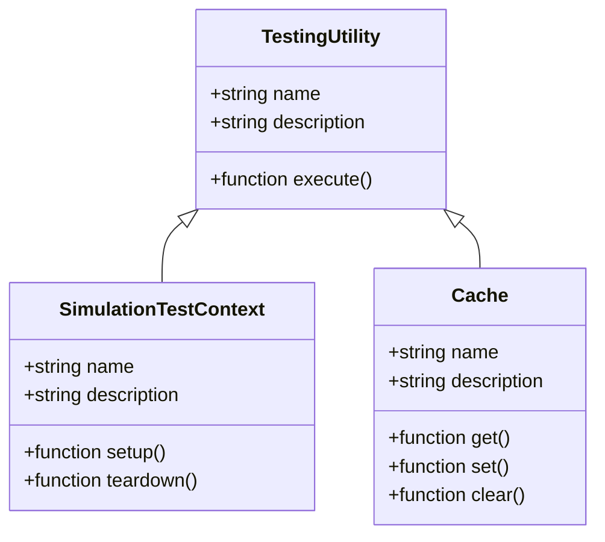

**Diagram sources**
- [test/simulationMain.ts](file://test/simulationMain.ts#L1-L978)
- [test/base/cache.ts](file://test/base/cache.ts)

The `SimulationTestContext` utility provides a context for running simulation tests, including setup and teardown methods for initializing and cleaning up the test environment. The `Cache` utility manages caching of test data, improving performance by avoiding redundant operations. These utilities are used throughout the test suite to ensure consistent and reliable testing.

### Simulation Workbench
The simulation workbench is a key component of the testing infrastructure, providing a controlled environment for running simulation tests. It is implemented in the `script/electron/simulationWorkbenchMain.js` file and is launched using the `simulate.sh` and `simulate.ps1` scripts for Unix and Windows systems, respectively.

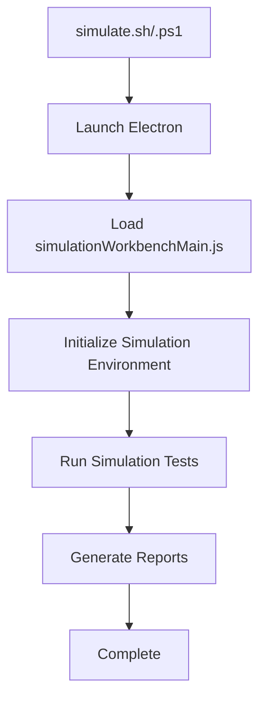

**Diagram sources**
- [script/simulate.sh](file://script/simulate.sh#L1-L22)
- [script/simulate.ps1](file://script/simulate.ps1#L1-L10)
- [script/electron/simulationWorkbenchMain.js](file://script/electron/simulationWorkbenchMain.js)

The simulation workbench provides a realistic environment for testing the extension's features, simulating user interactions and verifying the expected outcomes. It is particularly useful for testing complex workflows and edge cases that are difficult to cover with unit tests alone. The workbench is integrated into the build-test cycle, ensuring that all changes are thoroughly tested before being merged.

**Section sources**
- [script/simulate.sh](file://script/simulate.sh#L1-L22)
- [script/simulate.ps1](file://script/simulate.ps1#L1-L10)
- [script/electron/simulationWorkbenchMain.js](file://script/electron/simulationWorkbenchMain.js)

## Conclusion
The vscode-copilot-chat extension employs a robust and comprehensive build and testing infrastructure to ensure high-quality development and reliable functionality. The build pipeline handles compilation, asset processing, and packaging, while the testing infrastructure includes unit, integration, and end-to-end tests, as well as a simulation framework for complex workflows. Code coverage and quality gates enforce high standards of code quality, and the complete build-test cycle ensures that changes are thoroughly validated. Key testing utilities and the simulation workbench provide a controlled environment for running tests, promoting consistency and reliability across the codebase. This comprehensive approach to building and testing helps maintain a high standard of quality and reliability in the extension.