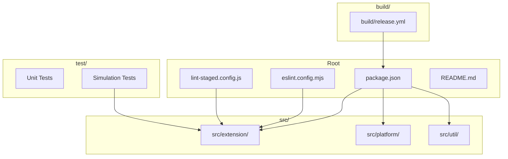
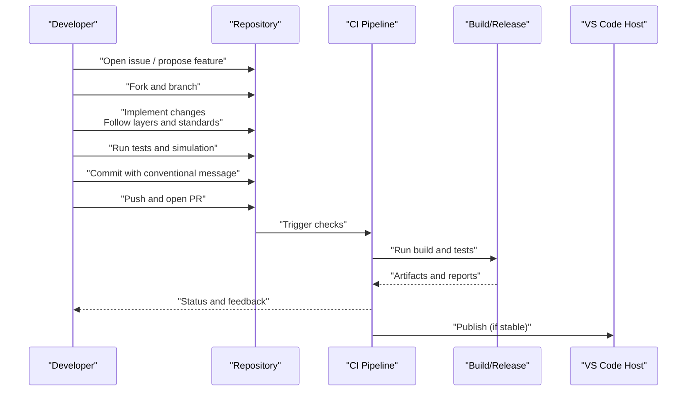
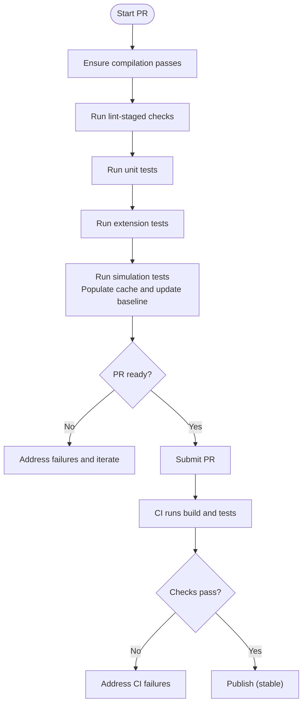
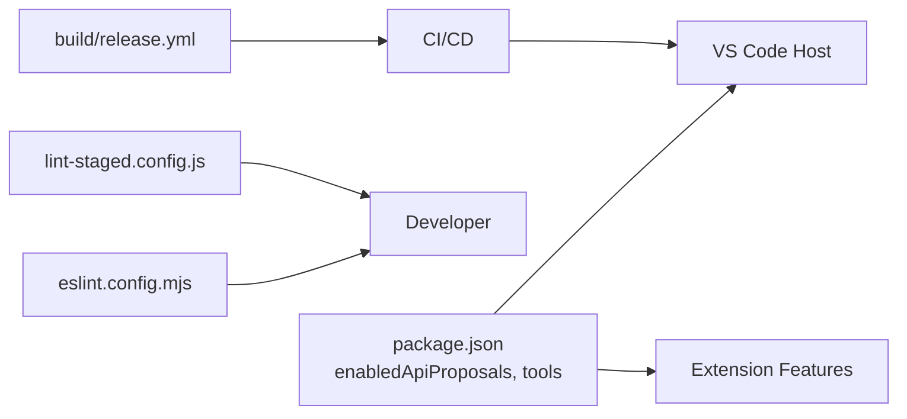

# Contributing Guidelines

<cite>
**Referenced Files in This Document**
- [CONTRIBUTING.md](file://CONTRIBUTING.md)
- [.github/copilot-instructions.md](file://.github/copilot-instructions.md)
- [CODE_OF_CONDUCT.md](file://CODE_OF_CONDUCT.md)
- [package.json](file://package.json)
- [eslint.config.mjs](file://eslint.config.mjs)
- [lint-staged.config.js](file://lint-staged.config.js)
- [README.md](file://README.md)
- [build/release.yml](file://build/release.yml)
- [script/simulate.sh](file://script/simulate.sh)
- [test/simulation/baseline.json](file://test/simulation/baseline.json)
</cite>

## Table of Contents
1. [Introduction](#introduction)
2. [Project Structure](#project-structure)
3. [Core Components](#core-components)
4. [Architecture Overview](#architecture-overview)
5. [Detailed Component Analysis](#detailed-component-analysis)
6. [Dependency Analysis](#dependency-analysis)
7. [Performance Considerations](#performance-considerations)
8. [Troubleshooting Guide](#troubleshooting-guide)
9. [Conclusion](#conclusion)
10. [Appendices](#appendices)

## Introduction
This document consolidates the contribution workflow and standards for the vscode-copilot-chat extension based on the repository’s official documentation and configuration. It explains how to report issues, develop features, adhere to coding standards, manage prompts, and submit high-quality pull requests. It also details the code quality enforcement via ESLint and lint-staged, the testing and simulation processes, and the community expectations outlined by the code of conduct.

## Project Structure
The repository is a large, layered VS Code extension with a strong emphasis on modular architecture, runtime parity (node.js and web worker), and layered code organization. The primary source lives under src/, with platform services, utilities, and feature implementations separated by layer and runtime target. Tests live under test/, and simulation tests under test/simulation.

**Diagram sources**
- [package.json](file://package.json#L1-L120)
- [eslint.config.mjs](file://eslint.config.mjs#L1-L120)
- [lint-staged.config.js](file://lint-staged.config.js#L1-L28)
- [README.md](file://README.md#L1-L84)
- [build/release.yml](file://build/release.yml#L1-L60)

**Section sources**
- [CONTRIBUTING.md](file://CONTRIBUTING.md#L186-L267)
- [.github/copilot-instructions.md](file://.github/copilot-instructions.md#L39-L120)

## Core Components
- Contribution and service registration: Contributions and services are registered per runtime layer and automatically picked up by the extension.
- Layered architecture: The code is organized into common, vscode, node, vscode-node, worker, and vscode-worker layers, with strict import restrictions to enforce layering.
- Runtime parity: The extension builds for both node.js and web worker hosts; avoid runtime-specific code unless absolutely necessary.
- Prompt engineering: TSX-based prompt framework enables dynamic composition, token-aware pruning, and reusable prompt elements.

**Section sources**
- [CONTRIBUTING.md](file://CONTRIBUTING.md#L252-L267)
- [CONTRIBUTING.md](file://CONTRIBUTING.md#L230-L251)
- [CONTRIBUTING.md](file://CONTRIBUTING.md#L128-L186)
- [.github/copilot-instructions.md](file://.github/copilot-instructions.md#L187-L224)

## Architecture Overview
The extension follows a service-oriented architecture with contributions and services. The activation flow initializes the service infrastructure, registers platform and extension services, and loads contributions. The chat system orchestrates participants, context resolution, prompt construction, model interaction, and action execution.

**Diagram sources**
- [CONTRIBUTING.md](file://CONTRIBUTING.md#L1-L120)
- [build/release.yml](file://build/release.yml#L1-L60)

**Section sources**
- [.github/copilot-instructions.md](file://.github/copilot-instructions.md#L140-L179)
- [CONTRIBUTING.md](file://CONTRIBUTING.md#L1-L120)

## Detailed Component Analysis

### Issue Reporting Workflow
- Search existing issues and use reactions to express interest rather than posting duplicates.
- Provide reproducible steps, expected vs actual behavior, OS/version, and relevant logs or screenshots.
- Use the built-in “Report Issue” tool to auto-collect environment details.

**Section sources**
- [CONTRIBUTING.md](file://CONTRIBUTING.md#L32-L66)

### Development Environment and Setup
- Requirements: Node 22.x, Python 3.10–3.12, Git LFS, and Windows build tools if applicable.
- First-time setup: Install dependencies, obtain tokens, and use the provided launch configurations to build and debug.
- Testing: Unit tests, extension-host tests, and simulation tests. Simulation tests require cache population and baseline updates.

**Section sources**
- [CONTRIBUTING.md](file://CONTRIBUTING.md#L69-L127)
- [CONTRIBUTING.md](file://CONTRIBUTING.md#L85-L123)

### Code Structure and Layers
- Layers: common, vscode, node, vscode-node, worker, vscode-worker. Import restrictions enforce layer discipline.
- Top-level folders: src/util (utilities), src/platform (shared services), src/extension (features), test (tests).
- Runtime targets: Separate entry points for node and web worker hosts; prefer shared code for portability.

**Section sources**
- [CONTRIBUTING.md](file://CONTRIBUTING.md#L200-L267)
- [.github/copilot-instructions.md](file://.github/copilot-instructions.md#L39-L120)

### Prompt Engineering with TSX
- Motivations: Token-aware pruning, dynamic composition, and safer prompt ownership.
- Quickstart: Define a root TSX prompt component, render with PromptRenderer, and compose reusable elements (SystemMessage, UserMessage, AssistantMessage, SafetyRules).
- Notes: Newlines are not preserved; use explicit line breaks; pruning behavior for equal priorities is documented.

**Section sources**
- [CONTRIBUTING.md](file://CONTRIBUTING.md#L128-L186)

### Tools and Agent Mode
- Tools: Language Model Tool API integrations are defined in the extension manifest and implemented under src/extension/tools/.
- Agent mode: Registered as a chat participant with special capabilities; uses VS Code’s lm.invokeTool API and proposed APIs.

**Section sources**
- [CONTRIBUTING.md](file://CONTRIBUTING.md#L281-L309)
- [package.json](file://package.json#L140-L220)

### API Updates and Compatibility
- Breaking changes: Update the proposal version and adopt in the extension; declare supported API versions in enabledApiProposals.
- Additive changes: Adopt new features without breaking changes; update engines.vscode date to gate adoption.

**Section sources**
- [CONTRIBUTING.md](file://CONTRIBUTING.md#L309-L335)

### Running with Code OSS
- Desktop and web: Follow the documented steps to enable the extension in OSS builds, including product overrides and manual configuration.

**Section sources**
- [CONTRIBUTING.md](file://CONTRIBUTING.md#L335-L439)

### Pull Request Submission and Review
- Validation: Ensure compilation passes before running scripts; monitor watch tasks for errors.
- Testing: Run unit, extension, and simulation tests; ensure cache and baseline are updated for simulation tests.
- CI pipeline: The release pipeline installs dependencies, sets up secrets, restores caches, builds, and runs tests.

**Diagram sources**
- [.github/copilot-instructions.md](file://.github/copilot-instructions.md#L26-L40)
- [build/release.yml](file://build/release.yml#L1-L60)

**Section sources**
- [.github/copilot-instructions.md](file://.github/copilot-instructions.md#L26-L40)
- [CONTRIBUTING.md](file://CONTRIBUTING.md#L100-L123)
- [build/release.yml](file://build/release.yml#L114-L140)

### Code Quality: ESLint and lint-staged
- ESLint configuration enforces style, correctness, and layering rules across TS/JS files.
- Key rules include:
  - Indentation with tabs, curly braces, equality checks, const preference, var prohibition, semicolons.
  - Header license enforcement.
  - TypeScript naming conventions (PascalCase for classes).
  - Restricted imports and restricted-paths to enforce layer discipline.
  - Local plugin rules for layering, filenames, GDPR, and PR strings.
  - No-explicit-any warnings with fix-to-unknown policy for src/ files.
- lint-staged runs formatting and ESLint on staged files, excluding ignored patterns.

**Section sources**
- [eslint.config.mjs](file://eslint.config.mjs#L52-L111)
- [eslint.config.mjs](file://eslint.config.mjs#L134-L144)
- [eslint.config.mjs](file://eslint.config.mjs#L170-L281)
- [eslint.config.mjs](file://eslint.config.mjs#L319-L521)
- [lint-staged.config.js](file://lint-staged.config.js#L1-L28)

### Commit Messages and PR Descriptions
- Use conventional commit messages and clear PR descriptions that:
  - Summarize the change
  - Link to related issues
  - Describe testing performed
  - Highlight any breaking changes or API updates
- Include simulation cache and baseline updates when applicable.

**Section sources**
- [CONTRIBUTING.md](file://CONTRIBUTING.md#L100-L123)
- [CONTRIBUTING.md](file://CONTRIBUTING.md#L309-L335)

### Community Expectations and Code of Conduct
- The project adheres to the Microsoft Open Source Code of Conduct.
- Follow the conduct in all interactions and report concerns via the provided contact channels.

**Section sources**
- [CODE_OF_CONDUCT.md](file://CODE_OF_CONDUCT.md#L1-L10)

## Dependency Analysis
The extension relies on VS Code’s proposed APIs and integrates with multiple external services. The manifest enumerates enabled proposals and language model tools, while the release pipeline manages secrets and caching for builds.

**Diagram sources**
- [package.json](file://package.json#L90-L140)
- [eslint.config.mjs](file://eslint.config.mjs#L1-L120)
- [lint-staged.config.js](file://lint-staged.config.js#L1-L28)
- [build/release.yml](file://build/release.yml#L1-L60)

**Section sources**
- [package.json](file://package.json#L90-L140)
- [build/release.yml](file://build/release.yml#L1-L60)

## Performance Considerations
- Prefer shared code across node and web worker hosts to minimize duplication and improve maintainability.
- Use simulation tests judiciously due to cost and randomness; keep cache updated and baseline synchronized.
- Leverage lint-staged to catch style and layering issues early, reducing CI overhead.

[No sources needed since this section provides general guidance]

## Troubleshooting Guide
- Compilation errors: Always check the watch tasks and fix compilation errors before proceeding.
- Simulation tests: Ensure cache is populated and baseline is updated; PRs fail if cache layers are missing or baseline changes are uncommitted.
- Debugging requests: Use the “Show Chat Debug View” to inspect prompts, tools, and responses; review logs carefully before sharing.

**Section sources**
- [.github/copilot-instructions.md](file://.github/copilot-instructions.md#L26-L40)
- [CONTRIBUTING.md](file://CONTRIBUTING.md#L100-L123)
- [CONTRIBUTING.md](file://CONTRIBUTING.md#L300-L309)

## Conclusion
Contributions to vscode-copilot-chat should emphasize correctness, readability, and runtime compatibility. Follow the layered architecture, adhere to ESLint and lint-staged rules, validate with unit and simulation tests, and ensure API compatibility when proposing changes. Use the code of conduct to guide interactions and maintain a respectful, productive community.

[No sources needed since this section summarizes without analyzing specific files]

## Appendices

### Appendix A: Simulation Test Workflow
- Run simulation tests to exercise end-to-end scenarios; cache layers are stored under test/simulation/cache.
- Populate cache and update baseline as needed; PRs fail if cache is missing or baseline is uncommitted.

**Section sources**
- [CONTRIBUTING.md](file://CONTRIBUTING.md#L100-L123)
- [script/simulate.sh](file://script/simulate.sh#L1-L22)
- [test/simulation/baseline.json](file://test/simulation/baseline.json#L1-L60)

### Appendix B: Release and CI Highlights
- The release pipeline installs Node, sets up secrets, restores caches, builds, and runs tests; publishing is gated by parameters.

**Section sources**
- [build/release.yml](file://build/release.yml#L1-L60)
- [build/release.yml](file://build/release.yml#L114-L140)