# Debugging

<cite>
**Referenced Files in This Document**   
- [postinstall.ts](file://script/postinstall.ts)
- [simulate.sh](file://script/simulate.sh)
- [simulate.ps1](file://script/simulate.ps1)
- [simulationWorkbenchMain.js](file://script/electron/simulationWorkbenchMain.js)
- [simulationWorkbench.html](file://script/electron/simulationWorkbench.html)
- [debugOutputService.ts](file://src/platform/debug/common/debugOutputService.ts)
- [debugOutputServiceImpl.ts](file://src/platform/debug/vscode/debugOutputServiceImpl.ts)
- [debugOutputListener.ts](file://src/platform/debug/vscode/debugOutputListener.ts)
- [debugValueEditorGlobals.ts](file://src/util/common/debugValueEditorGlobals.ts)
- [package.json](file://package.json)
- [README.md](file://README.md)
</cite>

## Table of Contents
1. [Introduction](#introduction)
2. [Debugging Environment Setup](#debugging-environment-setup)
3. [Launch Configurations](#launch-configurations)
4. [Simulation Framework](#simulation-framework)
5. [Logging Mechanisms](#logging-mechanisms)
6. [Frontend UI Debugging](#frontend-ui-debugging)
7. [Backend Service Debugging](#backend-service-debugging)
8. [Asynchronous Operations Debugging](#asynchronous-operations-debugging)
9. [AI Model Interactions Debugging](#ai-model-interactions-debugging)
10. [Tool Executions Debugging](#tool-executions-debugging)
11. [Common Bugs and Diagnostic Approaches](#common-bugs-and-diagnostic-approaches)
12. [Postinstall and Simulation Scripts](#postinstall-and-simulation-scripts)

## Introduction
This document provides comprehensive guidance for debugging the vscode-copilot-chat extension. It covers setting up the debugging environment, using the simulation framework, understanding logging mechanisms, and debugging various components including frontend UI, backend services, asynchronous operations, AI model interactions, and tool executions. The document also includes examples of common bugs and their diagnostic approaches, as well as guidance on using postinstall and simulation scripts for debugging setup and runtime issues.

**Section sources**
- [README.md](file://README.md#L1-L84)

## Debugging Environment Setup
To set up the debugging environment for the vscode-copilot-chat extension, follow these steps:

1. Clone the repository and install dependencies using `npm install`.
2. Ensure you have the latest version of VS Code installed, as the extension is compatible only with the latest release.
3. Install the required development dependencies specified in the package.json file.
4. Set up the necessary environment variables for authentication and service access.

The postinstall script is automatically executed after npm install and handles various setup tasks including compressing TikToken files, copying static assets, and creating shims for native dependencies.

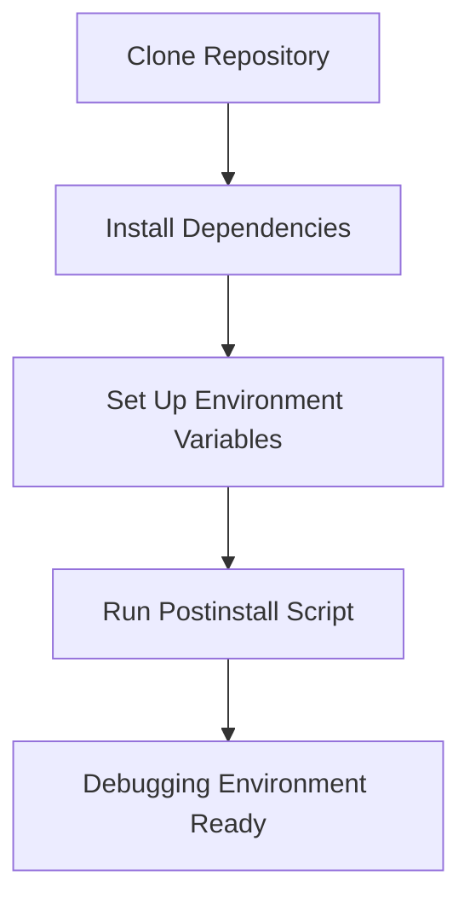

**Diagram sources**
- [postinstall.ts](file://script/postinstall.ts#L1-L149)
- [package.json](file://package.json#L1-L800)

**Section sources**
- [postinstall.ts](file://script/postinstall.ts#L1-L149)
- [package.json](file://package.json#L1-L800)

## Launch Configurations
The vscode-copilot-chat extension supports multiple launch configurations for different components:

1. **Extension Host**: Launches the extension in the VS Code Extension Host for debugging the main extension functionality.
2. **Simulation Workbench**: Launches the Electron-based simulation workbench for testing complex scenarios.
3. **Unit Tests**: Runs the unit tests with debugging enabled.
4. **Integration Tests**: Executes integration tests with full debugging capabilities.

The simulation workbench can be launched using the simulate.sh (Linux/macOS) or simulate.ps1 (Windows) scripts, which start an Electron application that hosts the simulation environment.

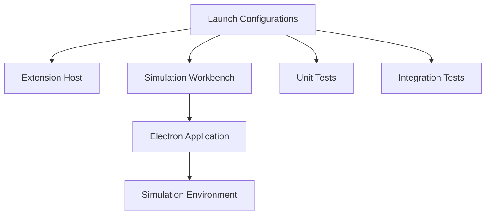

**Diagram sources**
- [simulate.sh](file://script/simulate.sh#L1-L22)
- [simulate.ps1](file://script/simulate.ps1#L1-L10)
- [simulationWorkbenchMain.js](file://script/electron/simulationWorkbenchMain.js#L1-L121)

**Section sources**
- [simulate.sh](file://script/simulate.sh#L1-L22)
- [simulate.ps1](file://script/simulate.ps1#L1-L10)
- [simulationWorkbenchMain.js](file://script/electron/simulationWorkbenchMain.js#L1-L121)

## Simulation Framework
The simulation framework is a comprehensive testing environment that allows reproduction and debugging of complex scenarios. It consists of:

1. **Simulation Workbench**: An Electron application that provides a GUI for running and monitoring simulations.
2. **Simulation Scripts**: TypeScript files that define test scenarios and expected outcomes.
3. **Baseline Comparisons**: Mechanisms for comparing simulation results against known good baselines.
4. **Outcome Validators**: Tools for verifying the correctness of simulation results.

The framework can be launched using the simulate.sh or simulate.ps1 scripts, which start the Electron application and load the simulation environment. The workbench allows filtering and searching of simulation results, making it easier to identify and debug issues.

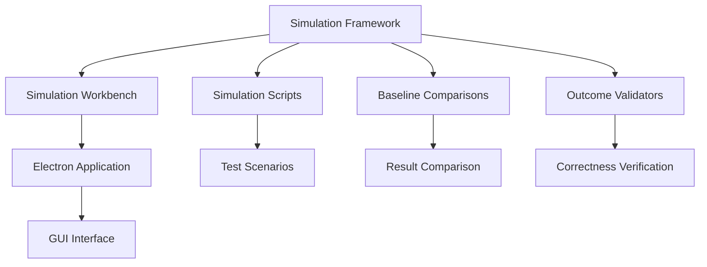

**Diagram sources**
- [simulationWorkbenchMain.js](file://script/electron/simulationWorkbenchMain.js#L1-L121)
- [simulationWorkbench.html](file://script/electron/simulationWorkbench.html#L1-L16)

**Section sources**
- [simulationWorkbenchMain.js](file://script/electron/simulationWorkbenchMain.js#L1-L121)
- [simulationWorkbench.html](file://script/electron/simulationWorkbench.html#L1-L16)

## Logging Mechanisms
The vscode-copilot-chat extension implements a comprehensive logging system to facilitate debugging and monitoring. The key components of the logging system are:

1. **Debug Output Service**: A service interface that provides access to console output for debugging purposes.
2. **Debug Output Implementation**: The concrete implementation of the debug output service that collects and manages console output.
3. **Debug Output Listeners**: Components that listen for debug output events and forward them to the appropriate destinations.
4. **Global Debug Variables**: Global variables that enable debugging features and provide access to debug channels.

The IDebugOutputService interface defines the contract for the debug output service, while the DebugOutputServiceImpl class provides the actual implementation. The service collects console output and makes it available for debugging and monitoring.

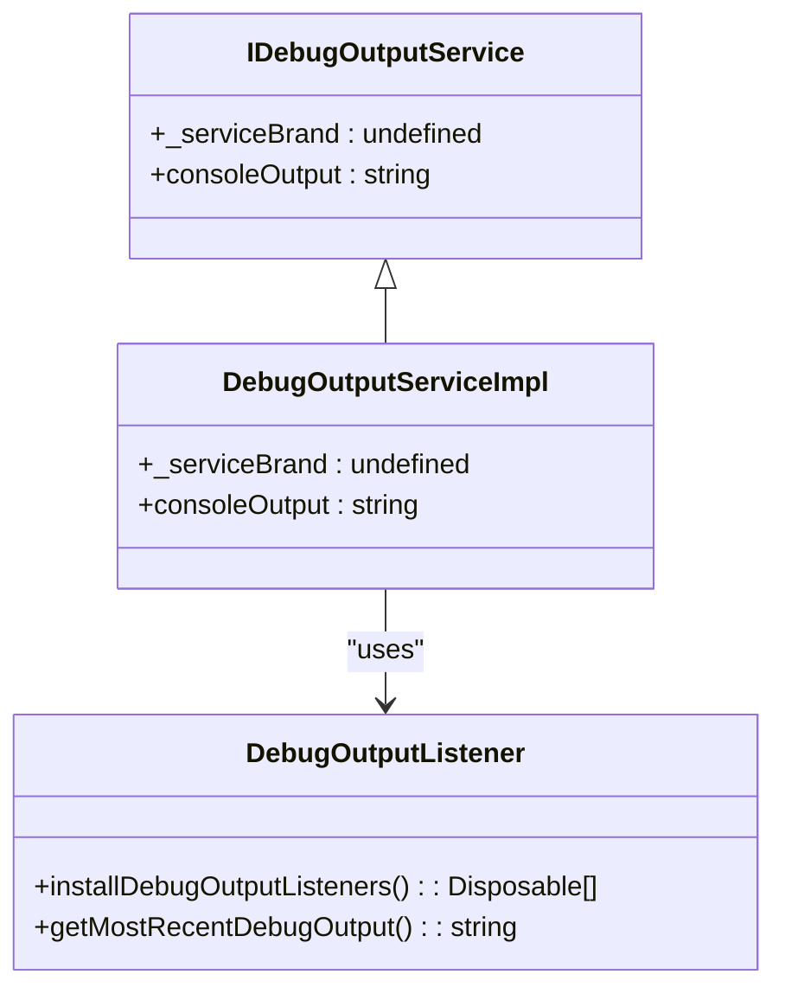

**Diagram sources**
- [debugOutputService.ts](file://src/platform/debug/common/debugOutputService.ts#L1-L15)
- [debugOutputServiceImpl.ts](file://src/platform/debug/vscode/debugOutputServiceImpl.ts#L1-L25)
- [debugOutputListener.ts](file://src/platform/debug/vscode/debugOutputListener.ts)

**Section sources**
- [debugOutputService.ts](file://src/platform/debug/common/debugOutputService.ts#L1-L15)
- [debugOutputServiceImpl.ts](file://src/platform/debug/vscode/debugOutputServiceImpl.ts#L1-L25)

## Frontend UI Debugging
Debugging the frontend UI components of the vscode-copilot-chat extension involves several techniques:

1. **React Developer Tools**: Use React Developer Tools to inspect the component hierarchy and state.
2. **Console Logging**: Utilize console.log statements to trace the flow of data and events.
3. **Breakpoints**: Set breakpoints in the TypeScript code to pause execution and inspect variables.
4. **Component State Inspection**: Examine the state of React components to identify issues.

The debugValueEditorGlobals interface provides global variables that enable debugging features and access to debug channels. These globals can be used to run debugging commands and inspect properties.

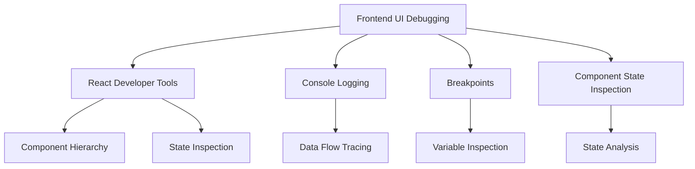

**Diagram sources**
- [debugValueEditorGlobals.ts](file://src/util/common/debugValueEditorGlobals.ts#L1-L30)

**Section sources**
- [debugValueEditorGlobals.ts](file://src/util/common/debugValueEditorGlobals.ts#L1-L30)

## Backend Service Debugging
Debugging the backend services of the vscode-copilot-chat extension requires understanding the service architecture and communication patterns:

1. **Service Interfaces**: Identify the service interfaces and their contracts.
2. **Dependency Injection**: Understand how services are instantiated and injected.
3. **API Endpoints**: Trace the flow of requests through API endpoints.
4. **Error Handling**: Examine error handling mechanisms and exception flows.

The extension uses a service-oriented architecture with clearly defined interfaces and implementations. Services are registered and resolved using a dependency injection system, making it easier to isolate and debug individual components.

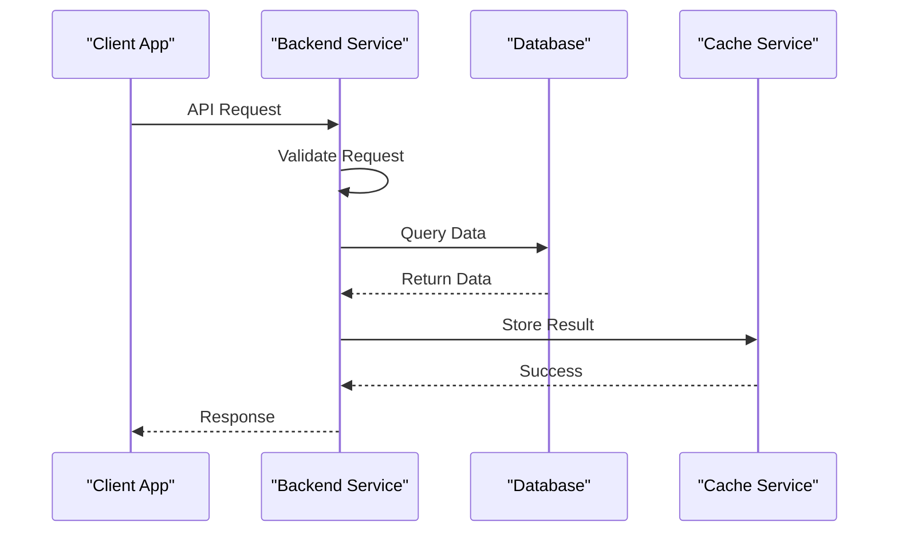

**Diagram sources**
- [debugOutputService.ts](file://src/platform/debug/common/debugOutputService.ts#L1-L15)
- [debugOutputServiceImpl.ts](file://src/platform/debug/vscode/debugOutputServiceImpl.ts#L1-L25)

**Section sources**
- [debugOutputService.ts](file://src/platform/debug/common/debugOutputService.ts#L1-L15)
- [debugOutputServiceImpl.ts](file://src/platform/debug/vscode/debugOutputServiceImpl.ts#L1-L25)

## Asynchronous Operations Debugging
Debugging asynchronous operations in the vscode-copilot-chat extension requires special attention to timing and concurrency issues:

1. **Promise Chains**: Trace the flow of promises and async/await operations.
2. **Event Listeners**: Monitor event listeners and their callbacks.
3. **Timeouts and Intervals**: Examine setTimeout and setInterval calls.
4. **Race Conditions**: Identify potential race conditions in concurrent operations.

The extension uses async/await syntax extensively for handling asynchronous operations. When debugging, pay attention to the order of operations and potential timing issues that could lead to race conditions.

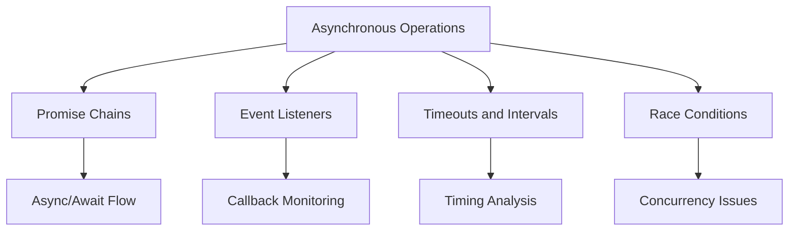

**Section sources**
- [debugOutputServiceImpl.ts](file://src/platform/debug/vscode/debugOutputServiceImpl.ts#L1-L25)

## AI Model Interactions Debugging
Debugging interactions with AI models in the vscode-copilot-chat extension involves understanding the model invocation patterns and response handling:

1. **Model Requests**: Trace the construction and sending of model requests.
2. **Response Parsing**: Examine how model responses are parsed and processed.
3. **Error Handling**: Analyze error handling for failed model invocations.
4. **Rate Limiting**: Monitor rate limiting and retry mechanisms.

The extension communicates with AI models through well-defined interfaces that abstract the underlying implementation details. When debugging model interactions, focus on the request/response cycle and error handling mechanisms.

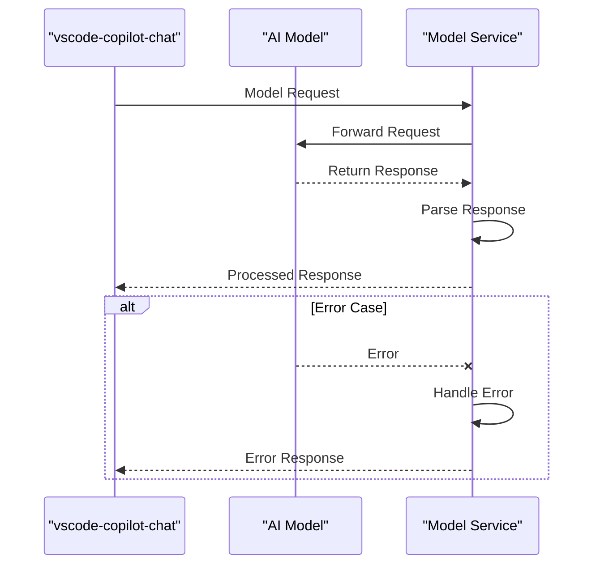

**Section sources**
- [package.json](file://package.json#L141-L735)

## Tool Executions Debugging
Debugging tool executions in the vscode-copilot-chat extension requires understanding the tool invocation framework and execution context:

1. **Tool Registration**: Identify how tools are registered and made available.
2. **Execution Context**: Examine the context in which tools are executed.
3. **Input Validation**: Trace input validation for tool parameters.
4. **Output Processing**: Analyze how tool outputs are processed and used.

The extension defines a comprehensive set of tools in the package.json file, each with specific input schemas and execution requirements. When debugging tool executions, verify that inputs match the expected schema and that outputs are properly handled.

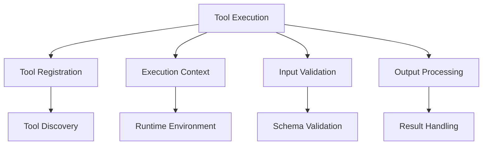

**Diagram sources**
- [package.json](file://package.json#L141-L735)

**Section sources**
- [package.json](file://package.json#L141-L735)

## Common Bugs and Diagnostic Approaches
This section documents common bugs encountered when working with the vscode-copilot-chat extension and their diagnostic approaches:

1. **Postinstall Script Failures**: Check for missing dependencies or incorrect file paths.
2. **Simulation Workbench Not Launching**: Verify Electron installation and script permissions.
3. **Debug Output Not Appearing**: Ensure debug services are properly registered and listening.
4. **Tool Execution Failures**: Validate input parameters against the tool's schema.
5. **AI Model Timeouts**: Check network connectivity and model service availability.

When diagnosing issues, start by examining the relevant log output and tracing the execution flow. Use breakpoints and console logging to isolate the problem area.

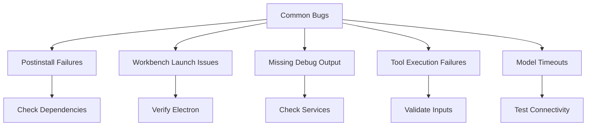

**Section sources**
- [postinstall.ts](file://script/postinstall.ts#L1-L149)
- [simulate.sh](file://script/simulate.sh#L1-L22)
- [simulate.ps1](file://script/simulate.ps1#L1-L10)

## Postinstall and Simulation Scripts
The postinstall and simulation scripts are essential tools for debugging setup and runtime issues in the vscode-copilot-chat extension:

1. **postinstall.ts**: This script runs automatically after npm install and handles various setup tasks:
   - Compresses TikToken files for efficient storage
   - Copies static assets to the dist directory
   - Creates shims for native dependencies
   - Validates the presence of required cache files

2. **simulate.sh and simulate.ps1**: These scripts launch the simulation workbench:
   - Start an Electron application hosting the simulation environment
   - Pass command-line arguments to configure the simulation
   - Handle platform-specific differences in script execution

The postinstall script ensures that all required assets are properly prepared before the extension is used, while the simulation scripts provide a controlled environment for testing and debugging complex scenarios.

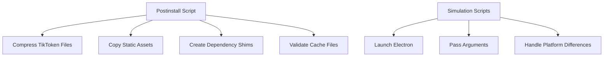

**Diagram sources**
- [postinstall.ts](file://script/postinstall.ts#L1-L149)
- [simulate.sh](file://script/simulate.sh#L1-L22)
- [simulate.ps1](file://script/simulate.ps1#L1-L10)

**Section sources**
- [postinstall.ts](file://script/postinstall.ts#L1-L149)
- [simulate.sh](file://script/simulate.sh#L1-L22)
- [simulate.ps1](file://script/simulate.ps1#L1-L10)