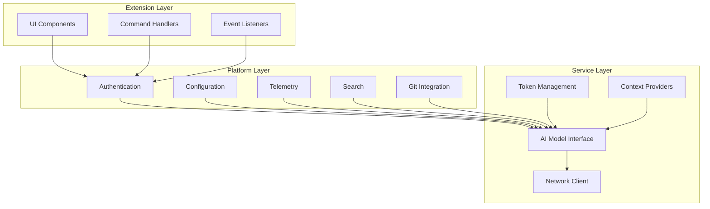
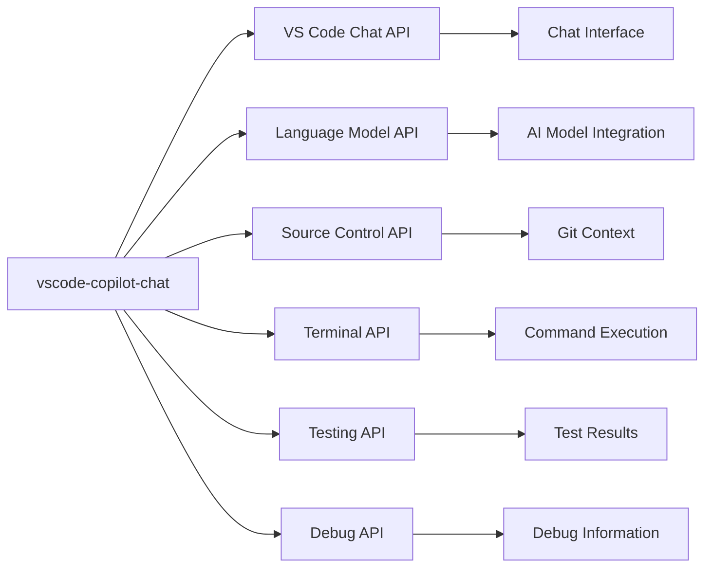

# Project Overview

<cite>
**Referenced Files in This Document**   
- [README.md](file://README.md)
- [CONTRIBUTING.md](file://CONTRIBUTING.md)
- [package.json](file://package.json)
- [CHANGELOG.md](file://CHANGELOG.md)
- [src/extension/extension/vscode-node/extension.ts](file://src/extension/extension/vscode-node/extension.ts)
- [src/lib/node/chatLibMain.ts](file://src/lib/node/chatLibMain.ts)
- [src/platform](file://src/platform)
- [src/extension](file://src/extension)
</cite>

## Table of Contents
1. [Introduction](#introduction)
2. [Core Value Proposition](#core-value-proposition)
3. [Target Audience](#target-audience)
4. [Key Benefits](#key-benefits)
5. [Architecture Overview](#architecture-overview)
6. [Technology Stack](#technology-stack)
7. [Integration with VS Code Ecosystem](#integration-with-vs-code-ecosystem)
8. [AI Model Integration](#ai-model-integration)
9. [Practical Use Cases](#practical-use-cases)
10. [Versioning Strategy and Release Cycle](#versioning-strategy-and-release-cycle)
11. [Contribution Guidelines](#contribution-guidelines)

## Introduction

The vscode-copilot-chat extension is an AI-powered chat assistant designed specifically for Visual Studio Code, enhancing developer productivity through natural language interaction, code generation, explanation, and refactoring capabilities. As a companion extension to GitHub Copilot, it provides conversational AI assistance that integrates seamlessly into the development workflow. The extension enables developers to interact with AI using natural language to solve coding problems, generate tests, debug issues, and understand complex codebases.

The extension leverages advanced AI models and integrates deeply with VS Code's ecosystem, providing features like inline chat, agent mode for autonomous coding tasks, and context-aware responses that understand the current codebase. It supports multiple programming languages and frameworks, making it a versatile tool for developers across different technology stacks.

**Section sources**
- [README.md](file://README.md#L1-L84)

## Core Value Proposition

The core value proposition of the vscode-copilot-chat extension is to dramatically enhance developer productivity by providing an AI-powered coding assistant that understands context, responds to natural language queries, and can perform coding tasks autonomously. The extension transforms the development experience by enabling developers to:

- **Accelerate coding tasks** through AI-generated code suggestions and completions
- **Gain instant understanding** of complex codebases through natural language explanations
- **Automate repetitive tasks** using agent mode for multi-step coding operations
- **Improve code quality** with AI-powered refactoring and debugging assistance
- **Reduce context switching** by accessing AI assistance directly within the editor

The extension adapts to individual coding styles and project requirements, allowing developers to select the most appropriate AI model for their specific needs. It supports customization through custom instructions, enabling teams to align the AI's behavior with their coding standards and practices.

**Section sources**
- [README.md](file://README.md#L3-L59)

## Target Audience

The vscode-copilot-chat extension serves developers of all levels, from beginners learning to code to experienced professionals working on complex enterprise applications. The target audience includes:

- **Beginner developers** who benefit from code explanations, examples, and guided learning
- **Intermediate developers** seeking to improve productivity and learn best practices
- **Senior developers** looking to accelerate complex coding tasks and explore new technologies
- **Development teams** wanting to standardize coding practices and onboard new members quickly
- **Open source contributors** needing to understand unfamiliar codebases rapidly

The extension is designed to be accessible to developers with varying levels of AI experience, providing intuitive interfaces and clear documentation to help users get started quickly. Its features scale with the user's expertise, offering basic assistance to newcomers while providing advanced capabilities for experienced developers.

**Section sources**
- [README.md](file://README.md#L3-L59)

## Key Benefits

The vscode-copilot-chat extension delivers several key benefits that enhance the development experience:

- **Increased productivity**: Developers can write code faster with AI-generated suggestions and automated refactoring
- **Improved code quality**: AI-powered analysis helps identify potential issues and suggests improvements
- **Enhanced learning**: Natural language explanations help developers understand complex code and concepts
- **Reduced cognitive load**: The AI assistant handles routine tasks, allowing developers to focus on higher-level design
- **Context-aware assistance**: The extension understands the current codebase and project context to provide relevant suggestions
- **Multi-language support**: Works across various programming languages and frameworks
- **Seamless integration**: Features are integrated directly into VS Code's interface for a smooth workflow

The extension also supports collaborative development by enabling teams to share custom instructions and prompt templates, ensuring consistency across projects.

**Section sources**
- [README.md](file://README.md#L3-L59)

## Architecture Overview

The vscode-copilot-chat extension follows a modular architecture with three main layers: extension, platform, and service. This layered design enables separation of concerns, promotes code reuse, and facilitates maintenance and extension development.

**Diagram sources**
- [src/extension](file://src/extension)
- [src/platform](file://src/platform)
- [src/lib/node/chatLibMain.ts](file://src/lib/node/chatLibMain.ts)

The architecture follows VS Code's extension development patterns, organizing code into layers based on runtime targets and ambient APIs. The extension supports both node.js and web worker extension hosts, enabling it to run on desktop and in web environments.

**Section sources**
- [CONTRIBUTING.md](file://CONTRIBUTING.md#L200-L210)
- [src/extension/extension/vscode-node/extension.ts](file://src/extension/extension/vscode-node/extension.ts#L1-L44)

## Technology Stack

The vscode-copilot-chat extension is built using modern web technologies and follows industry best practices for extension development:

- **TypeScript**: Primary programming language providing type safety and enhanced developer experience
- **Node.js**: Runtime environment for server-side operations and tool execution
- **VS Code API**: Extension interface for integrating with the editor's features and UI
- **React/JSX**: Framework for building user interface components (where applicable)
- **ESLint**: Code linting and quality enforcement
- **Vitest**: Testing framework for unit and integration tests
- **Git LFS**: Large file storage for test assets and binary dependencies

The extension leverages VS Code's proposed APIs for advanced features, ensuring compatibility with the latest editor capabilities. It follows strict coding standards and architecture patterns documented in the project's contribution guidelines.

**Section sources**
- [CONTRIBUTING.md](file://CONTRIBUTING.md#L188-L196)
- [package.json](file://package.json#L1-L800)

## Integration with VS Code Ecosystem

The vscode-copilot-chat extension integrates deeply with the VS Code ecosystem, leveraging various extension APIs and services to provide a seamless user experience:

- **Chat Participants**: Implements the chat participant API to provide conversational AI capabilities
- **Language Model Tools**: Registers tools that can be invoked by AI agents for code manipulation and analysis
- **Proposed APIs**: Utilizes VS Code's proposed APIs for advanced features like agent mode and inline chat
- **Extension Contributions**: Registers commands, views, and other UI elements through standard contribution points
- **Service Registry**: Uses VS Code's service architecture for dependency injection and component communication

The extension respects VS Code's extension lifecycle and activation events, ensuring efficient resource usage and fast startup times. It integrates with source control, debugging, testing, and other core VS Code features to provide context-aware assistance.

**Diagram sources**
- [package.json](file://package.json#L141-L140)
- [src/extension/extension/vscode-node/extension.ts](file://src/extension/extension/vscode-node/extension.ts#L1-L44)

**Section sources**
- [package.json](file://package.json#L141-L140)
- [CONTRIBUTING.md](file://CONTRIBUTING.md#L252-L267)

## AI Model Integration

The extension integrates with AI models through a flexible architecture that supports multiple language models and providers:

- **Model Selection**: Users can choose between different AI models based on their needs and subscription level
- **Token Management**: Secure handling of API keys and authentication tokens
- **Prompt Engineering**: Advanced prompt composition using a TSX-based framework for dynamic message generation
- **Context Management**: Intelligent context selection to optimize token usage and response quality
- **Tool Integration**: AI models can invoke VS Code commands and extension APIs through registered tools

The extension supports both Microsoft's AI models and third-party models through the Bring Your Own Key (BYOK) feature, giving developers flexibility in their AI provider choices. It handles rate limiting, quota management, and error recovery to ensure reliable service.

**Section sources**
- [README.md](file://README.md#L50-L53)
- [CONTRIBUTING.md](file://CONTRIBUTING.md#L129-L185)

## Practical Use Cases

The vscode-copilot-chat extension supports various practical use cases that enhance the development workflow:

### Code Explanation
Developers can ask the AI to explain complex code snippets, algorithms, or design patterns in natural language. The assistant analyzes the code context and provides clear, concise explanations that help developers understand unfamiliar code.

### Test Generation
The extension can generate unit tests, integration tests, and test cases based on existing code. Developers can request specific test types or coverage requirements, and the AI generates appropriate test code with proper assertions and edge case handling.

### Debugging Assistance
When encountering errors or bugs, developers can describe the issue to the AI assistant, which analyzes the error messages, stack traces, and relevant code to suggest potential causes and solutions.

### Code Refactoring
The AI can suggest and apply code improvements, including:
- Simplifying complex logic
- Improving code readability
- Applying design patterns
- Optimizing performance
- Fixing code smells

### Implementation Examples
Common interactions include:
- "Explain this function and its purpose"
- "Generate tests for this class with 100% coverage"
- "How can I improve the performance of this algorithm?"
- "Refactor this code to use async/await instead of callbacks"
- "What does this error mean and how can I fix it?"

These use cases demonstrate how the extension enhances developer productivity by providing instant, context-aware assistance.

**Section sources**
- [README.md](file://README.md#L34-L43)
- [CHANGELOG.md](file://CHANGELOG.md#L1-L800)

## Versioning Strategy and Release Cycle

The vscode-copilot-chat extension follows a structured versioning strategy and release cycle:

- **Semantic Versioning**: Uses semantic versioning (MAJOR.MINOR.PATCH) to indicate the nature of changes
- **Regular Releases**: New versions are released on a regular schedule, typically aligned with VS Code updates
- **Backward Compatibility**: Maintains compatibility with recent VS Code versions while leveraging new features
- **Preview Features**: Experimental features are marked as such and may change between releases

The extension version is tightly coupled with VS Code due to its deep UI integration, meaning each new version of Copilot Chat is only compatible with the latest and newest release of VS Code. This ensures that the extension can leverage the latest editor capabilities and APIs.

**Section sources**
- [README.md](file://README.md#L48-L53)
- [CHANGELOG.md](file://CHANGELOG.md#L1-L800)
- [package.json](file://package.json#L5-L6)

## Contribution Guidelines

The project welcomes contributions from the community and provides clear guidelines for participation:

- **Issue Reporting**: Users are encouraged to search for existing issues before creating new ones and to provide detailed information including reproduction steps, expected vs. actual behavior, and system information
- **Development Setup**: Requires Node 22.x, Python 3.10-3.12, and Git LFS for testing
- **Testing**: Includes unit tests, integration tests, and simulation tests that validate functionality against AI API endpoints
- **Coding Standards**: Follows TypeScript/JavaScript guidelines, React/JSX conventions, and architecture patterns documented in the project's contribution guide
- **API Changes**: Requires proper versioning and compatibility considerations when modifying APIs

Contributors are directed to the Copilot Instructions document for comprehensive information about project architecture, coding standards, and development guidelines.

**Section sources**
- [CONTRIBUTING.md](file://CONTRIBUTING.md#L1-L439)
- [README.md](file://README.md#L69-L70)