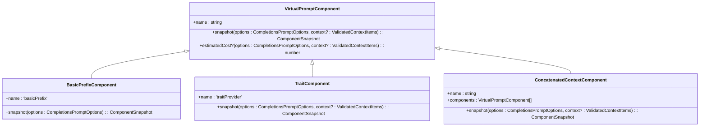

# Prompt Structure

<cite>
**Referenced Files in This Document**   
- [virtualComponent.ts](file://src/extension/completions-core/vscode-node/lib/src/prompt/components/virtualComponent.ts)
- [elision.ts](file://src/extension/completions-core/vscode-node/lib/src/prompt/components/elision.ts)
- [completionsPromptFactory.ts](file://src/extension/completions-core/vscode-node/lib/src/prompt/completionsPromptFactory/completionsPromptFactory.ts)
- [contextProviderRegistry.ts](file://src/extension/completions-core/vscode-node/lib/src/prompt/contextProviderRegistry.ts)
- [promptElement.ts](file://src/extension/prompts/node/base/promptElement.ts)
- [promptRenderer.ts](file://src/extension/prompts/node/base/promptRenderer.ts)
- [promptsService.ts](file://src/platform/promptFiles/common/promptsService.ts)
- [promptPathRepresentationService.ts](file://src/platform/prompts/common/promptPathRepresentationService.ts)
</cite>

## Table of Contents
1. [Introduction](#introduction)
2. [Prompt Composition Architecture](#prompt-composition-architecture)
3. [Core Components](#core-components)
4. [Prompt Renderer Implementation](#prompt-renderer-implementation)
5. [Modular Prompt Elements](#modular-prompt-elements)
6. [Base Templates and Structure](#base-templates-and-structure)
7. [Safety Rules and Response Translation](#safety-rules-and-response-translation)
8. [Common Issues and Solutions](#common-issues-and-solutions)
9. [Conclusion](#conclusion)

## Introduction
The vscode-copilot-chat extension implements a sophisticated prompt structure system that enables modular composition of AI prompts through reusable components, tags, and base templates. This system allows for dynamic construction of context-rich prompts that adapt to various use cases while maintaining efficiency and safety. The architecture is designed to handle complex scenarios including code completion, explanation generation, and multi-file editing by intelligently combining different prompt elements based on context and requirements.

**Section sources**
- [virtualComponent.ts](file://src/extension/completions-core/vscode-node/lib/src/prompt/components/virtualComponent.ts#L1-L252)
- [elision.ts](file://src/extension/completions-core/vscode-node/lib/src/prompt/components/elision.ts#L1-L382)

## Prompt Composition Architecture
The prompt composition system in vscode-copilot-chat follows a hierarchical component-based architecture where prompts are constructed from modular elements that can be combined and nested. The core architecture revolves around virtual components that represent different parts of the prompt, such as code context, user instructions, and system directives. These components are processed through a rendering pipeline that handles token budgeting, elision, and formatting.

The system uses a tree-like structure where each node represents a prompt component with associated metadata, weight, and cost function. Components can be concatenated, nested, or conditionally included based on context. The architecture supports both prefix and suffix components, allowing for flexible prompt construction that can adapt to different AI model requirements.

**Diagram sources **
- [virtualComponent.ts](file://src/extension/completions-core/vscode-node/lib/src/prompt/components/virtualComponent.ts#L1-L252)
- [contextProviderRegistry.ts](file://src/extension/completions-core/vscode-node/lib/src/prompt/contextProviderRegistry.ts#L1-L540)

**Section sources**
- [virtualComponent.ts](file://src/extension/completions-core/vscode-node/lib/src/prompt/components/virtualComponent.ts#L1-L252)
- [contextProviderRegistry.ts](file://src/extension/completions-core/vscode-node/lib/src/prompt/contextProviderRegistry.ts#L1-L540)

## Core Components
The prompt system is built around several core components that work together to create effective AI prompts. The VirtualPromptComponent interface serves as the foundation, defining the contract for all prompt components with required properties like name and snapshot methods. Each component can provide an estimated cost and maintain statistics for telemetry purposes.

The BasicPrefixComponent handles the primary code context by capturing the text before the cursor position, while the TraitComponent manages contextual information such as file type, language, and project characteristics. The ConcatenatedContextComponent allows for combining multiple components into a single logical unit, enabling complex prompt structures through composition rather than inheritance.

**Diagram sources **
- [virtualComponent.ts](file://src/extension/completions-core/vscode-node/lib/src/prompt/components/virtualComponent.ts#L48-L252)

**Section sources**
- [virtualComponent.ts](file://src/extension/completions-core/vscode-node/lib/src/prompt/components/virtualComponent.ts#L48-L252)

## Prompt Renderer Implementation
The prompt renderer is responsible for transforming structured prompt components into AI-ready text formats while respecting token budgets and formatting requirements. The rendering process involves several stages: component snapshotting, cost calculation, elision, and final text assembly. The renderer uses a caching mechanism to optimize performance by storing rendered results for frequently used components.

The rendering pipeline begins with creating snapshots of all active components, which capture their current state and structure. These snapshots are then processed through an elision strategy that removes or trims components based on their weight and token consumption. The final step combines the remaining components into a cohesive prompt string that adheres to the specified token limits.

**Diagram sources **
- [virtualComponent.ts](file://src/extension/completions-core/vscode-node/lib/src/prompt/components/virtualComponent.ts#L59-L114)
- [elision.ts](file://src/extension/completions-core/vscode-node/lib/src/prompt/components/elision.ts#L58-L103)

**Section sources**
- [virtualComponent.ts](file://src/extension/completions-core/vscode-node/lib/src/prompt/components/virtualComponent.ts#L59-L114)
- [elision.ts](file://src/extension/completions-core/vscode-node/lib/src/prompt/components/elision.ts#L58-L103)

## Modular Prompt Elements
The system implements a modular approach to prompt construction through reusable elements that can be combined in various configurations. Prompt elements are defined as independent units that encapsulate specific types of information or functionality. These elements can be categorized into several types: context providers, instruction elements, and structural components.

Context providers supply relevant information from the development environment, such as code snippets, file structure, and project configuration. Instruction elements contain user requests and system directives that guide the AI's behavior. Structural components define the organization and formatting of the prompt, ensuring consistency across different use cases.

**Diagram sources **
- [promptElement.ts](file://src/extension/prompts/node/base/promptElement.ts)
- [contextProviderRegistry.ts](file://src/extension/completions-core/vscode-node/lib/src/prompt/contextProviderRegistry.ts#L39-L55)

**Section sources**
- [promptElement.ts](file://src/extension/prompts/node/base/promptElement.ts)
- [contextProviderRegistry.ts](file://src/extension/completions-core/vscode-node/lib/src/prompt/contextProviderRegistry.ts#L39-L55)

## Base Templates and Structure
The prompt system utilizes base templates that define the overall structure and organization of AI prompts. These templates serve as blueprints for constructing consistent and effective prompts across different scenarios. The templates include predefined sections for context, instructions, and expected output format, ensuring that prompts follow a standardized pattern.

Base templates are implemented as reusable configurations that can be extended or modified for specific use cases. They define the order and formatting of prompt elements, as well as default values for various parameters. The template system supports inheritance, allowing specialized templates to build upon more general ones while maintaining consistency in structure and style.

**Diagram sources **
- [promptRenderer.ts](file://src/extension/prompts/node/base/promptRenderer.ts)
- [completionsPromptFactory.ts](file://src/extension/completions-core/vscode-node/lib/src/prompt/completionsPromptFactory/completionsPromptFactory.ts#L19-L30)

**Section sources**
- [promptRenderer.ts](file://src/extension/prompts/node/base/promptRenderer.ts)
- [completionsPromptFactory.ts](file://src/extension/completions-core/vscode-node/lib/src/prompt/completionsPromptFactory/completionsPromptFactory.ts#L19-L30)

## Safety Rules and Response Translation
The prompt system incorporates comprehensive safety rules and response translation mechanisms to ensure responsible AI interactions. Safety rules are implemented as validation and filtering layers that prevent potentially harmful or inappropriate content from being included in prompts or responses. These rules operate at multiple levels, from input validation to output filtering.

Response translation mechanisms handle the conversion between AI-generated content and user-facing formats, ensuring that responses are properly formatted and contextualized. This includes translating code suggestions into appropriate edit operations, converting natural language explanations into structured documentation, and adapting responses to match the user's preferred style and conventions.

**Diagram sources **
- [completionsPromptFactory.ts](file://src/extension/completions-core/vscode-node/lib/src/prompt/completionsPromptFactory/completionsPromptFactory.ts#L79-L100)
- [promptPathRepresentationService.ts](file://src/platform/prompts/common/promptPathRepresentationService.ts#L13-L40)

**Section sources**
- [completionsPromptFactory.ts](file://src/extension/completions-core/vscode-node/lib/src/prompt/completionsPromptFactory/completionsPromptFactory.ts#L79-L100)
- [promptPathRepresentationService.ts](file://src/platform/prompts/common/promptPathRepresentationService.ts#L13-L40)

## Common Issues and Solutions
The prompt system addresses several common challenges in AI-assisted development, including prompt overflow, context truncation, and formatting errors. These issues are mitigated through a combination of proactive design patterns and reactive error handling mechanisms.

Prompt overflow is prevented through token budgeting and elision strategies that dynamically adjust prompt content based on available space. Context truncation is minimized by prioritizing relevant information and using hierarchical context selection. Formatting errors are reduced through standardized templates and automated validation checks.

The system implements timeout handling and cancellation mechanisms to prevent hanging requests, with fallback strategies that provide partial results when complete processing is not possible. Error recovery is supported through retry logic and alternative processing paths that maintain functionality even when individual components fail.

**Diagram sources **
- [completionsPromptFactory.ts](file://src/extension/completions-core/vscode-node/lib/src/prompt/completionsPromptFactory/completionsPromptFactory.ts#L79-L100)
- [elision.ts](file://src/extension/completions-core/vscode-node/lib/src/prompt/components/elision.ts#L75-L103)

**Section sources**
- [completionsPromptFactory.ts](file://src/extension/completions-core/vscode-node/lib/src/prompt/completionsPromptFactory/completionsPromptFactory.ts#L79-L100)
- [elision.ts](file://src/extension/completions-core/vscode-node/lib/src/prompt/components/elision.ts#L75-L103)

## Conclusion
The prompt structure in the vscode-copilot-chat extension represents a sophisticated system for creating effective AI interactions through modular components, templates, and intelligent rendering. By breaking down prompts into reusable elements and implementing robust processing pipelines, the system achieves both flexibility and reliability in generating context-aware AI responses.

The architecture balances complexity with usability, providing powerful features for advanced users while maintaining accessibility for beginners. Through careful attention to safety, performance, and error handling, the system delivers a reliable foundation for AI-assisted development that can adapt to diverse use cases and requirements.