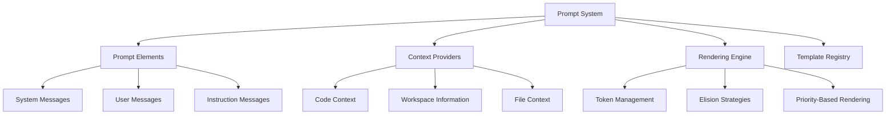
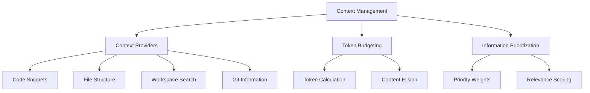
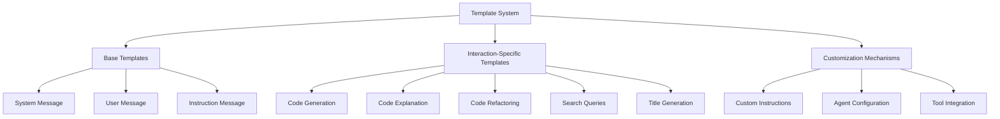
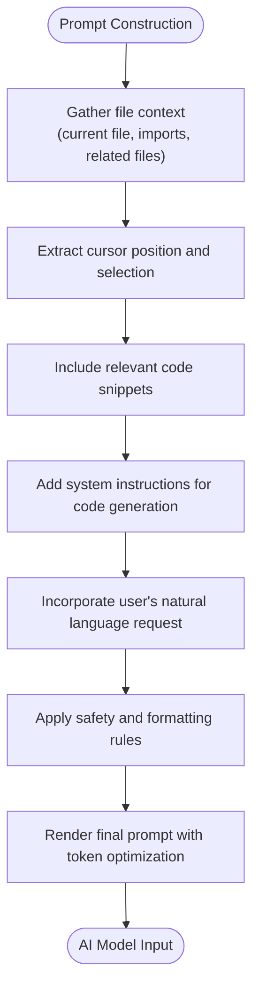
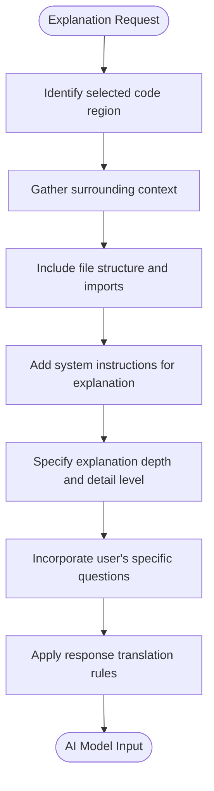
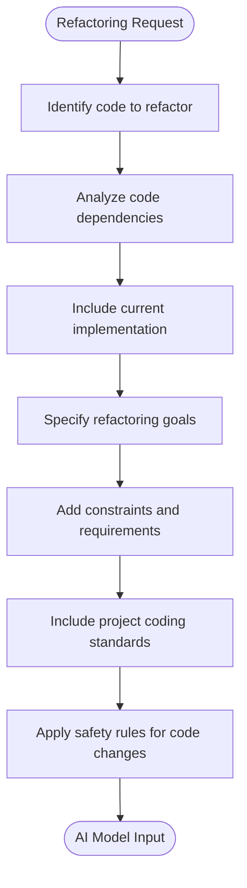
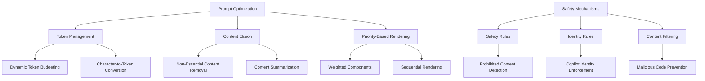
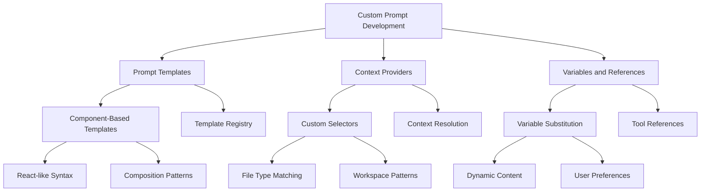

# Prompt System

<cite>
**Referenced Files in This Document**   
- [promptsService.ts](file://src/platform/promptFiles/common/promptsService.ts)
- [promptsServiceImpl.ts](file://src/platform/promptFiles/common/promptsServiceImpl.ts)
- [promptFileContextService.ts](file://src/extension/promptFileContext/vscode-node/promptFileContextService.ts)
- [promptVariablesService.ts](file://src/extension/prompt/node/promptVariablesService.ts)
- [agentPrompt.tsx](file://src/extension/prompts/node/agent/agentPrompt.tsx)
- [search.tsx](file://src/extension/prompts/node/panel/search.tsx)
- [title.tsx](file://src/extension/prompts/node/panel/title.tsx)
- [cascadingPromptFactory.ts](file://src/extension/completions-core/vscode-node/lib/src/prompt/completionsPromptFactory/cascadingPromptFactory.ts)
- [components.ts](file://src/extension/completions-core/vscode-node/prompt/src/components/components.ts)
- [completionsPromptRenderer.tsx](file://src/extension/completions-core/vscode-node/lib/src/prompt/components/completionsPromptRenderer.tsx)
</cite>

## Table of Contents
1. [Introduction](#introduction)
2. [Prompt Architecture](#prompt-architecture)
3. [Context Management System](#context-management-system)
4. [Template System](#template-system)
5. [Prompt Construction Examples](#prompt-construction-examples)
6. [Prompt Optimization and Safety](#prompt-optimization-and-safety)
7. [Custom Prompt Development](#custom-prompt-development)
8. [Best Practices](#best-practices)

## Introduction
The prompt system in the vscode-copilot-chat extension provides a sophisticated framework for generating AI responses through structured prompts. This system combines user input, code context, and system instructions to create effective interactions with AI models. The architecture supports various interaction types including code generation, explanation, and refactoring, with comprehensive context management and template systems.

## Prompt Architecture

The prompt system is built on a component-based architecture that allows for flexible composition of prompts. The core components include prompt elements, context providers, and rendering mechanisms that work together to create effective AI interactions.

**Diagram sources**
- [components.ts](file://src/extension/completions-core/vscode-node/prompt/src/components/components.ts)
- [completionsPromptRenderer.tsx](file://src/extension/completions-core/vscode-node/lib/src/prompt/components/completionsPromptRenderer.tsx)

**Section sources**
- [components.ts](file://src/extension/completions-core/vscode-node/prompt/src/components/components.ts)
- [completionsPromptRenderer.tsx](file://src/extension/completions-core/vscode-node/lib/src/prompt/components/completionsPromptRenderer.tsx)

## Context Management System

The context management system gathers relevant code, file, and workspace information to enrich prompts with contextual data. This system uses context providers to collect information based on the current editing context and workspace state.

The system implements a token budgeting mechanism that calculates available tokens based on document size and model limits. Context providers are registered with selectors that determine when they should provide context, and the system uses priority-based rendering to ensure the most relevant information is included first.

**Diagram sources**
- [promptFileContextService.ts](file://src/extension/promptFileContext/vscode-node/promptFileContextService.ts)
- [components.ts](file://src/extension/completions-core/vscode-node/prompt/src/components/components.ts)

**Section sources**
- [promptFileContextService.ts](file://src/extension/promptFileContext/vscode-node/promptFileContextService.ts)
- [components.ts](file://src/extension/completions-core/vscode-node/prompt/src/components/components.ts)

## Template System

The template system provides specialized prompt templates for different types of interactions. These templates are implemented as React-like components that can be composed and customized based on the interaction type and user context.

The system uses a registry pattern to manage templates, allowing for dynamic resolution of appropriate templates based on the current context. Templates can be customized through configuration options and can incorporate safety rules, identity rules, and response translation mechanisms.

**Diagram sources**
- [agentPrompt.tsx](file://src/extension/prompts/node/agent/agentPrompt.tsx)
- [search.tsx](file://src/extension/prompts/node/panel/search.tsx)
- [title.tsx](file://src/extension/prompts/node/panel/title.tsx)

**Section sources**
- [agentPrompt.tsx](file://src/extension/prompts/node/agent/agentPrompt.tsx)
- [search.tsx](file://src/extension/prompts/node/panel/search.tsx)
- [title.tsx](file://src/extension/prompts/node/panel/title.tsx)

## Prompt Construction Examples

The prompt system constructs prompts by combining user input, code context, and system instructions in a structured format. The following examples illustrate how prompts are constructed for various scenarios.

### Code Generation Prompt
When generating code, the system creates a prompt that includes the current file context, cursor position, and any relevant code snippets. The template guides the AI to generate syntactically correct code that follows project conventions.

**Diagram sources**
- [agentPrompt.tsx](file://src/extension/prompts/node/agent/agentPrompt.tsx)
- [completionsPromptRenderer.tsx](file://src/extension/completions-core/vscode-node/lib/src/prompt/components/completionsPromptRenderer.tsx)

### Code Explanation Prompt
For code explanation requests, the system constructs a prompt that focuses on the selected code region, providing context about the surrounding code structure and project architecture.

**Diagram sources**
- [agentPrompt.tsx](file://src/extension/prompts/node/agent/agentPrompt.tsx)
- [components.ts](file://src/extension/completions-core/vscode-node/prompt/src/components/components.ts)

### Refactoring Prompt
When requesting code refactoring, the prompt includes the target code, refactoring goals, and constraints to guide the AI in making appropriate changes.

**Diagram sources**
- [agentPrompt.tsx](file://src/extension/prompts/node/agent/agentPrompt.tsx)
- [cascadingPromptFactory.ts](file://src/extension/completions-core/vscode-node/lib/src/prompt/completionsPromptFactory/cascadingPromptFactory.ts)

**Section sources**
- [agentPrompt.tsx](file://src/extension/prompts/node/agent/agentPrompt.tsx)
- [cascadingPromptFactory.ts](file://src/extension/completions-core/vscode-node/lib/src/prompt/completionsPromptFactory/cascadingPromptFactory.ts)

## Prompt Optimization and Safety

The prompt system implements several optimization techniques and safety mechanisms to ensure effective and secure AI interactions.

The system uses cascading prompt factories to handle different optimization strategies based on model capabilities and user preferences. Token allocation is carefully managed to ensure that critical information is included while staying within model limits.

**Diagram sources**
- [cascadingPromptFactory.ts](file://src/extension/completions-core/vscode-node/lib/src/prompt/completionsPromptFactory/cascadingPromptFactory.ts)
- [completionsPromptRenderer.tsx](file://src/extension/completions-core/vscode-node/lib/src/prompt/components/completionsPromptRenderer.tsx)
- [safetyRules.tsx](file://src/extension/prompts/node/base/safetyRules.tsx)

**Section sources**
- [cascadingPromptFactory.ts](file://src/extension/completions-core/vscode-node/lib/src/prompt/completionsPromptFactory/cascadingPromptFactory.ts)
- [completionsPromptRenderer.tsx](file://src/extension/completions-core/vscode-node/lib/src/prompt/components/completionsPromptRenderer.tsx)

## Custom Prompt Development

The extension provides mechanisms for creating custom prompts and extending the prompt system. Developers can create new prompt templates, context providers, and variables to enhance the AI interaction capabilities.

The system supports custom prompt files with YAML front matter that defines metadata such as agent type, model, and tools. Developers can create specialized agents for specific tasks by defining custom instructions and handoff workflows.

**Diagram sources**
- [promptsService.ts](file://src/platform/promptFiles/common/promptsService.ts)
- [promptsServiceImpl.ts](file://src/platform/promptFiles/common/promptsServiceImpl.ts)
- [promptVariablesService.ts](file://src/extension/prompt/node/promptVariablesService.ts)

**Section sources**
- [promptsService.ts](file://src/platform/promptFiles/common/promptsService.ts)
- [promptsServiceImpl.ts](file://src/platform/promptFiles/common/promptsServiceImpl.ts)
- [promptVariablesService.ts](file://src/extension/prompt/node/promptVariablesService.ts)

## Best Practices

When working with the prompt system in the vscode-copilot-chat extension, consider the following best practices:

1. **Context Awareness**: Always consider the current editing context when designing prompts. Include relevant code snippets, file structure, and workspace information to provide adequate context for the AI.

2. **Token Efficiency**: Be mindful of token limits and use elision strategies to prioritize essential information. Structure prompts to include the most critical information first.

3. **Safety Compliance**: Follow safety guidelines and include appropriate safety rules in prompts to prevent generation of harmful or inappropriate content.

4. **Template Reusability**: Design templates to be reusable across different scenarios by using configurable parameters and conditional rendering.

5. **User Experience**: Consider the end-user experience when designing prompts. Ensure that instructions are clear and that the expected output format is well-defined.

6. **Performance Optimization**: Use caching mechanisms and efficient context resolution to minimize latency in prompt generation.

7. **Testing and Validation**: Thoroughly test custom prompts with various inputs and edge cases to ensure reliable behavior.

8. **Documentation**: Document custom prompts and templates to facilitate maintenance and collaboration.