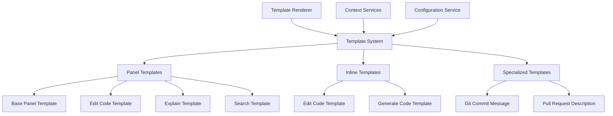
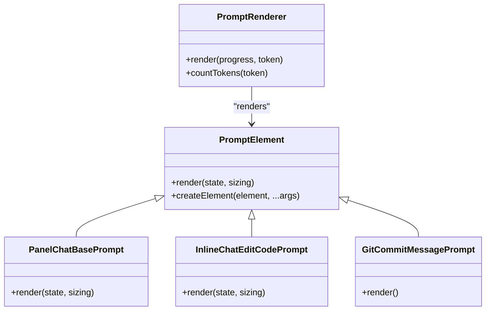

# Template System

<cite>
**Referenced Files in This Document**   
- [panelChatBasePrompt.tsx](file://src/extension/prompts/node/panel/panelChatBasePrompt.tsx)
- [inlineChatEditCodePrompt.tsx](file://src/extension/prompts/node/inline/inlineChatEditCodePrompt.tsx)
- [gitCommitMessagePrompt.tsx](file://src/extension/prompts/node/git/gitCommitMessagePrompt.tsx)
- [editCodePrompt.tsx](file://src/extension/prompts/node/panel/editCodePrompt.tsx)
- [explain.tsx](file://src/extension/prompts/node/panel/explain.tsx)
- [search.tsx](file://src/extension/prompts/node/panel/search.tsx)
- [inlineChatGenerateCodePrompt.tsx](file://src/extension/prompts/node/inline/inlineChatGenerateCodePrompt.tsx)
- [pullRequestDescriptionPrompt.tsx](file://src/extension/prompts/node/github/pullRequestDescriptionPrompt.tsx)
- [promptRenderer.ts](file://src/extension/prompts/node/base/promptRenderer.ts)
- [promptsService.ts](file://src/platform/promptFiles/common/promptsService.ts)
</cite>

## Table of Contents
1. [Introduction](#introduction)
2. [Template Architecture Overview](#template-architecture-overview)
3. [Panel-Based Templates](#panel-based-templates)
4. [Inline Chat Templates](#inline-chat-templates)
5. [Specialized Templates](#specialized-templates)
6. [Template Composition and Structure](#template-composition-and-structure)
7. [Template Selection and Adaptation](#template-selection-and-adaptation)
8. [Extensibility and Customization](#extensibility-and-customization)
9. [Conclusion](#conclusion)

## Introduction
The template system in the vscode-copilot-chat extension provides a sophisticated framework for generating context-aware prompts for various interaction types. This system enables the creation of specialized templates for code generation, explanation, refactoring, and git operations, with distinct implementations for panel-based and inline chat interactions. The templates are designed to incorporate relevant context from the user's workspace, including code, file structure, and project-specific information, to generate more accurate and helpful responses. The system supports specialized templates for GitHub and notebook interactions, ensuring appropriate formatting and content for these specific use cases. This documentation provides a comprehensive overview of the template system, explaining its architecture, implementation details, and usage patterns.

## Template Architecture Overview
The template system is built on a component-based architecture that leverages React-like JSX syntax through the @vscode/prompt-tsx library. Templates are implemented as TypeScript classes that extend the PromptElement base class, allowing for hierarchical composition of prompt elements. The system uses a dependency injection pattern to provide services such as authentication, logging, and configuration to template components. Each template is responsible for rendering a specific type of prompt based on the interaction context, with common elements like system messages, instruction messages, and user messages composed together to form the complete prompt. The template renderer handles the conversion of these components into the format expected by the language model, including token counting and message serialization.

**Diagram sources**
- [panelChatBasePrompt.tsx](file://src/extension/prompts/node/panel/panelChatBasePrompt.tsx)
- [inlineChatEditCodePrompt.tsx](file://src/extension/prompts/node/inline/inlineChatEditCodePrompt.tsx)
- [gitCommitMessagePrompt.tsx](file://src/extension/prompts/node/git/gitCommitMessagePrompt.tsx)

## Panel-Based Templates
Panel-based templates are designed for interactions that occur in the dedicated Copilot chat panel, providing a comprehensive context for multi-turn conversations. The base panel template (PanelChatBasePrompt) establishes the foundational structure with system messages that define the AI's identity, safety rules, and capabilities. It incorporates conversation history, custom instructions, and workspace context to create a rich prompt environment. Specialized panel templates extend this base structure for specific interaction types. For example, the edit code template (editCodePrompt.tsx) includes detailed instructions for code modification requests, with specific formatting requirements for code blocks and file references. The explain template (explain.tsx) is optimized for code explanation requests, incorporating symbol definitions and language server context to provide detailed explanations of selected code. The search template (search.tsx) is designed to generate structured search queries, with specific formatting requirements for JSON output that can be consumed by VS Code's search functionality.

**Section sources**
- [panelChatBasePrompt.tsx](file://src/extension/prompts/node/panel/panelChatBasePrompt.tsx)
- [editCodePrompt.tsx](file://src/extension/prompts/node/panel/editCodePrompt.tsx)
- [explain.tsx](file://src/extension/prompts/node/panel/explain.tsx)
- [search.tsx](file://src/extension/prompts/node/panel/search.tsx)

## Inline Chat Templates
Inline chat templates are optimized for context-specific interactions that occur directly within the code editor. These templates are designed to be more focused and concise, leveraging the immediate context of the selected code or cursor position. The inline edit code template (inlineChatEditCodePrompt.tsx) is specifically designed for code modification requests within the current file, with instructions that guide the AI to modify only the selected code region. It uses a placeholder-based approach where the selected code is replaced with a special marker, and the AI is instructed to generate replacement code that fits in that location. The inline generate code template (inlineChatGenerateCodePrompt.tsx) is used for code generation requests, with instructions that vary based on whether the generation is occurring within existing code (insertion) or in an empty file (full generation). These templates incorporate language-specific context from the language server to ensure generated code follows the conventions and patterns of the current language.

**Section sources**
- [inlineChatEditCodePrompt.tsx](file://src/extension/prompts/node/inline/inlineChatEditCodePrompt.tsx)
- [inlineChatGenerateCodePrompt.tsx](file://src/extension/prompts/node/inline/inlineChatGenerateCodePrompt.tsx)

## Specialized Templates
The template system includes specialized templates for specific use cases that require unique formatting and content requirements. The git commit message template (gitCommitMessagePrompt.tsx) is designed to generate commit messages based on code changes, with a structured format that includes repository context, recent commit messages for style reference, and the actual code changes in diff format. The template instructs the AI to analyze the code changes and generate a concise commit message that follows the repository's conventions. The pull request description template (pullRequestDescriptionPrompt.tsx) is used to generate pull request titles and descriptions based on multiple commit messages and code patches. It includes examples of good pull request descriptions and specific formatting requirements using triple-plus delimiters (+++). These specialized templates demonstrate the system's ability to handle complex, structured output requirements for specific development workflows.

**Section sources**
- [gitCommitMessagePrompt.tsx](file://src/extension/prompts/node/git/gitCommitMessagePrompt.tsx)
- [pullRequestDescriptionPrompt.tsx](file://src/extension/prompts/node/github/pullRequestDescriptionPrompt.tsx)

## Template Composition and Structure
The template system employs a hierarchical composition model where complex templates are built from reusable components. Each template is structured as a tree of prompt elements, with the root element typically being a container that combines system messages, instruction messages, and user messages. System messages establish the AI's identity and fundamental rules, while instruction messages provide task-specific guidance. User messages contain the actual query and relevant context from the workspace. The system uses a priority-based rendering mechanism to control the order of elements, ensuring that critical instructions appear in the appropriate position within the prompt. Templates can incorporate dynamic content through props that are populated with context from the user's workspace, such as file content, symbol definitions, and workspace structure. The template renderer handles the serialization of these components into the format expected by the language model, including proper token counting and message formatting.

**Diagram sources**
- [promptRenderer.ts](file://src/extension/prompts/node/base/promptRenderer.ts)
- [panelChatBasePrompt.tsx](file://src/extension/prompts/node/panel/panelChatBasePrompt.tsx)
- [inlineChatEditCodePrompt.tsx](file://src/extension/prompts/node/inline/inlineChatEditCodePrompt.tsx)
- [gitCommitMessagePrompt.tsx](file://src/extension/prompts/node/git/gitCommitMessagePrompt.tsx)

## Template Selection and Adaptation
The template system employs a dynamic selection mechanism that chooses the appropriate template based on the interaction context and user intent. The selection process considers factors such as the chat location (panel or inline), the type of request (code generation, explanation, refactoring), and the specific context (file type, selection state, workspace configuration). Templates can adapt their behavior based on configuration settings and experimentation flags, allowing for A/B testing of different prompt structures. The system also handles edge cases such as ignored files or unsupported file types by returning appropriate error indicators. For notebook interactions, the system uses specialized templates that account for the unique structure of notebook documents, including cell boundaries and kernel state. The adaptation logic ensures that templates provide appropriate instructions based on whether they are being used in a panel or inline context, with inline templates focusing more on the immediate code context and panel templates providing a broader workspace context.

**Section sources**
- [panelChatBasePrompt.tsx](file://src/extension/prompts/node/panel/panelChatBasePrompt.tsx)
- [inlineChatEditCodePrompt.tsx](file://src/extension/prompts/node/inline/inlineChatEditCodePrompt.tsx)
- [editCodePrompt.tsx](file://src/extension/prompts/node/panel/editCodePrompt.tsx)

## Extensibility and Customization
The template system is designed to be extensible, allowing for the addition of new template types and customization of existing ones. The component-based architecture makes it easy to create new prompt elements that can be reused across multiple templates. Custom instructions from users are incorporated through the CustomInstructions component, which can be included in various templates to apply user-specific guidance. The system supports experimentation through feature flags that can enable or disable specific template variations, allowing for gradual rollout of new prompt structures. The promptsService interface provides a foundation for loading and managing prompt files, suggesting potential for future extension through user-defined prompt templates. The dependency injection pattern used throughout the system makes it possible to replace or extend services used by templates, enabling customization of behavior such as token counting, logging, and context retrieval.

**Section sources**
- [promptsService.ts](file://src/platform/promptFiles/common/promptsService.ts)
- [panelChatBasePrompt.tsx](file://src/extension/prompts/node/panel/panelChatBasePrompt.tsx)
- [customInstructions.tsx](file://src/extension/prompts/node/panel/customInstructions.tsx)

## Conclusion
The template system in the vscode-copilot-chat extension provides a robust and flexible framework for generating context-aware prompts for various development tasks. By leveraging a component-based architecture and hierarchical composition, the system can create specialized templates for different interaction types while maintaining consistency in core elements like identity, safety rules, and response formatting. The distinction between panel-based and inline templates ensures that prompts are optimized for their specific context, with panel templates providing a comprehensive workspace view and inline templates focusing on immediate code context. Specialized templates for git operations and pull requests demonstrate the system's ability to handle complex, structured output requirements. The extensible design allows for future enhancements and customization, making the template system a powerful foundation for AI-assisted development in Visual Studio Code.